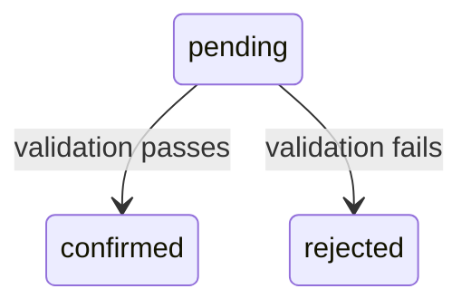

# Section: Data

## Purpose

States what this feature touches in storage: which tables it reads or writes even without changing them, what schema actually changes, and what must always remain true (invariants). This is what lets a reviewer assess blast radius without re-deriving it from the Contract endpoint by endpoint.

## What to include

### Tables Accessed

Every table this feature reads or writes, **including tables with no schema change**. This is deliberately broader than Schema Changes — a feature can touch five tables and only add a column to one of them; a reader needs to see all five to understand the actual footprint.

### Schema Changes

New tables, new columns on existing tables (name, type, default, nullable), or `"None."` if this feature introduces no schema change at all.

### State Transitions (conditional)

Include this subsection **only if** the feature adds a new status value or a new transition to an existing state machine. Represent it as a Mermaid state diagram. Omit the subsection entirely — heading and all — if the feature doesn't touch any state machine.



### Data Flow (conditional)

Include this subsection **only if** data moves across more than one table or service in a way that isn't already obvious from Contract + Flow read together. Represent it as a Mermaid flowchart. Omit entirely if a single endpoint writing a single table makes this redundant.


### Invariants

Business rules that must always hold, numbered as `BR-NN` using the same requirement-keyword discipline as Functional Requirements:

```
BR-NN: <entity/field> MUST <condition that must always hold>.
```

`BR-NN` is numbered independently from `FR-NN`, same zero-padded two-digit format, same permanence rule (never reused or renumbered). A Contract validation rule or an Errors condition can — and should — cite a `BR-NN` instead of restating the same rule in different words.

## Template

```markdown
## Data

### Tables Accessed

| Table | Read / Write | Notes |
| :---- | :----------- | :---- |

### Schema Changes

| Table | Change |
| :---- | :----- |

### Invariants

- **BR-01:** <entity/field> MUST <condition>.
```

## Example

```markdown
## Data

### Tables Accessed

| Table                    | Read / Write | Notes                                               |
| :----------------------- | :----------- | :-------------------------------------------------- |
| subscribers              | Read         | to resolve the subscriber's account                 |
| notification_preferences | Read, Write  | the table this feature primarily changes            |
| notification_categories  | Read         | to check whether a category is non-optional (BR-01) |

### Schema Changes

| Table                    | Change                                                       |
| :----------------------- | :----------------------------------------------------------- |
| notification_preferences | add column `updated_at` (timestamp, not null, default now()) |

### Invariants

- **BR-01:** A notification_preferences row for a non-optional category MUST have at least one channel enabled.
```

## Common mistakes

- Listing only tables that get a schema change and omitting tables that are read/written but otherwise unchanged — this undersells the actual footprint of the feature.
- Adding a Mermaid diagram as decoration even when the feature is a single endpoint writing a single table — if Contract + Flow already make it obvious, the diagram adds noise, not clarity.
- Writing an invariant as a description of current behavior ("the system currently checks...") rather than a requirement ("...MUST have at least one channel enabled") — BR-NN statements use the same mandatory-keyword discipline as FR-NN.
