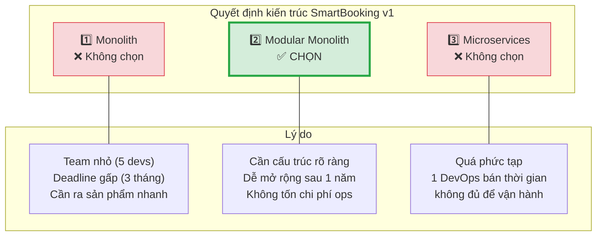
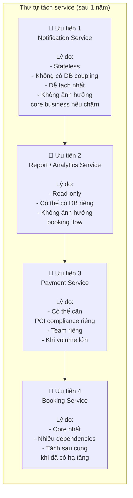
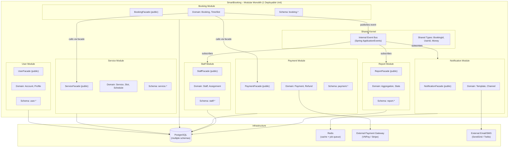
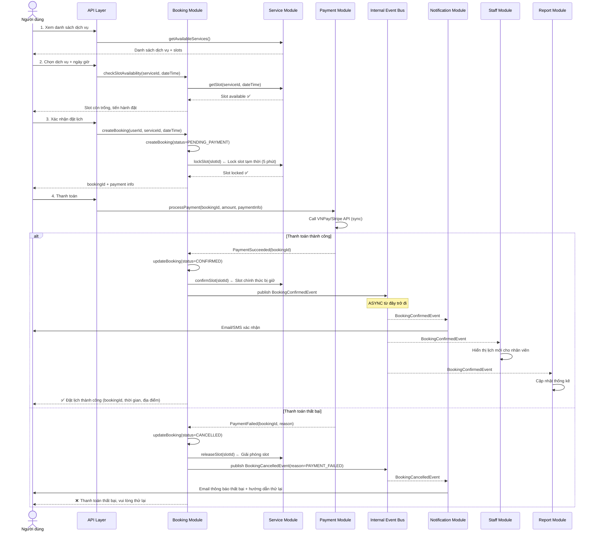
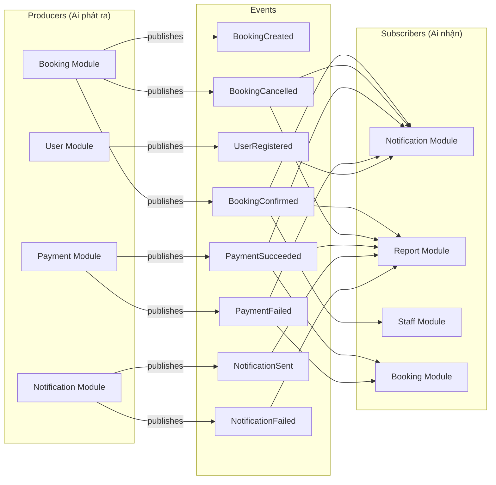
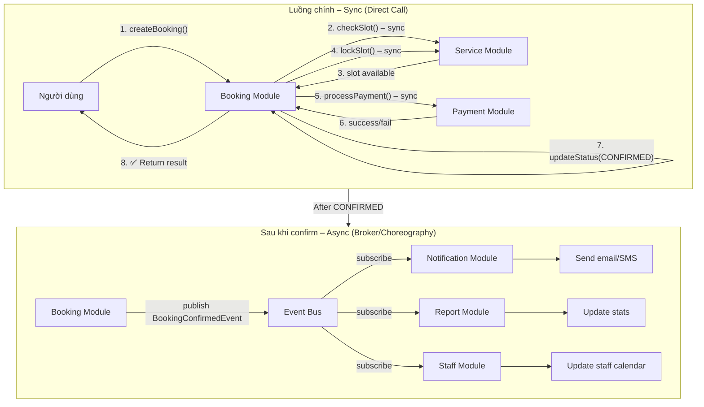
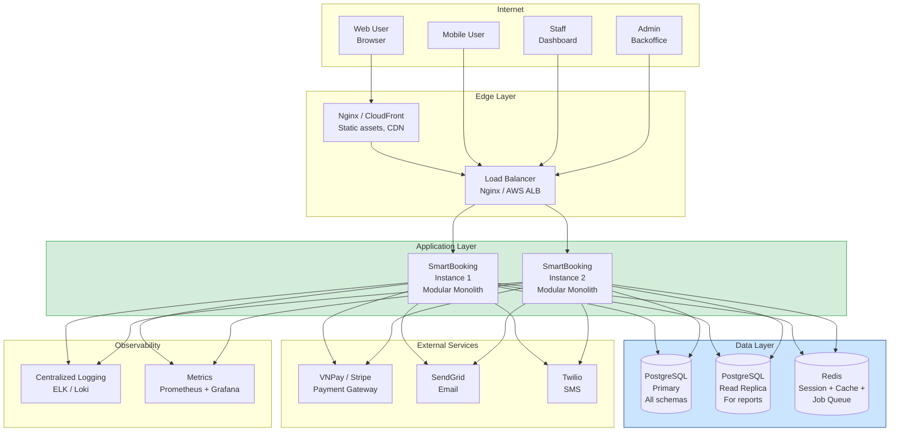
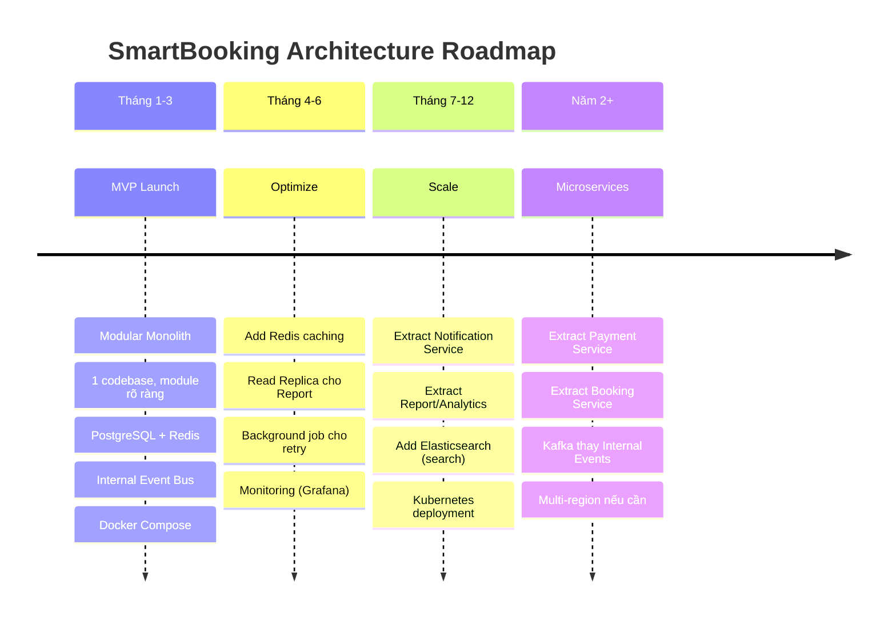

# Bài Tập 02: Kiến Trúc Hệ Thống – SmartBooking

## ĐỀ BÀI

### 1. Mục tiêu

Sau bài tập này, sinh viên cần biết:

- Phân biệt khi nào nên dùng **Monolith**, **Modular Monolith**, **Microservices**
- Biết rằng microservices **không phải lúc nào cũng tốt nhất**
- Biết phần nào nên xử lý **trực tiếp (sync)**, phần nào nên xử lý **bằng sự kiện (async)**
- Biết phân tích **lỗi thực tế** thay vì chỉ vẽ kiến trúc đẹp
- Biết giải thích quyết định kiến trúc bằng **lý do**, không trả lời máy móc

### 2. Tình huống thực tế

Một công ty nhỏ muốn xây dựng hệ thống **SmartBooking** – cho phép người dùng:

- Xem danh sách dịch vụ
- Chọn ngày giờ đặt lịch
- Đặt lịch & thanh toán
- Nhận email/SMS xác nhận
- Nhân viên xem và xác nhận lịch
- Quản trị viên xem báo cáo số lượng đơn đặt lịch

> **Ví dụ use case:** Đặt lịch sửa xe, khám bệnh, tư vấn tài chính, học online.

**Ràng buộc hiện tại:**

| Ràng buộc     | Chi tiết                                      |
| ------------- | --------------------------------------------- |
| Team size     | 5 lập trình viên + 1 DevOps bán thời gian     |
| Deadline      | Ra sản phẩm đầu tiên trong **3 tháng**        |
| Scale dự kiến | ~10.000 người dùng trong 6 tháng đầu          |
| Tương lai     | Sau 1 năm mở rộng thêm nhiều chi nhánh        |
| Đặc điểm      | Chưa quá lớn, nhưng cần **dễ mở rộng** về sau |

### 3. Câu hỏi của bài tập

> Nếu bạn là người thiết kế hệ thống, bạn sẽ chọn kiến trúc nào cho phiên bản đầu tiên?

**3 lựa chọn:**

1. Monolith
2. Modular Monolith ← _(đáp án được đề xuất trong bài giải)_
3. Microservices

> Không có đáp án duy nhất đúng. Điểm cao phụ thuộc vào **lý do chọn**, **biết đánh đổi**, và **biết phân tích lỗi thực tế**.

## BÀI GIẢI

## PHẦN A – Chọn Kiến Trúc Tổng Thể

### ✅ Kiến trúc được chọn: **Modular Monolith**



### A.1. Vì sao chọn Modular Monolith?

**Lý do 1: Context của dự án khớp hoàn toàn với Modular Monolith**

SmartBooking giai đoạn đầu có các đặc điểm sau – tất cả đều trỏ về Modular Monolith:

| Đặc điểm         | Giá trị thực tế                 | Implication                                                |
| ---------------- | ------------------------------- | ---------------------------------------------------------- |
| Team size        | 5 developers                    | Nhỏ → 1 codebase dễ coordinate                             |
| DevOps           | 1 người, bán thời gian          | Không đủ để vận hành 6-8 services riêng biệt               |
| Deadline         | 3 tháng                         | Không có thời gian setup infra microservices               |
| Traffic          | ~10,000 users / 6 tháng         | Rất nhỏ, 1 server đủ xử lý                                 |
| Domain knowledge | Mới, chưa ổn định               | Chưa biết chính xác boundaries → tách sớm = sai boundaries |
| Budget infra     | Không đề cập → giả định hạn chế | Microservices = nhiều servers, nhiều cost                  |

**Lý do 2: "Make it right before making it distributed"**

Nguyên tắc từ Martin Fowler: **"MonolithFirst"** – bắt đầu với monolith (có cấu trúc), hiểu rõ domain, rồi mới tách khi thực sự cần. Tách service sai boundary = **Distributed Monolith** (worst of both worlds).

**Lý do 3: Modular Monolith ≠ Monolith hỗn loạn**

Điểm khác biệt quan trọng: Modular Monolith vẫn có **ranh giới module rõ ràng**, mỗi module có:

- `api/` – public interface (chỉ expose những gì cần thiết)
- `domain/` – business logic riêng
- `infrastructure/` – DB access riêng (schema riêng trong cùng DB)

→ Khi cần tách thành microservice sau này: **ranh giới đã sẵn sàng**, không phải refactor lại từ đầu.

### A.2. Vì sao **không** chọn Monolith thuần túy?

| Vấn đề                     | Giải thích                                                                   |
| -------------------------- | ---------------------------------------------------------------------------- |
| **Không có ranh giới**     | Code của Booking, Payment, Notification trộn lẫn nhau sau 6 tháng            |
| **Khó mở rộng**            | Sau 1 năm muốn tách service → phải refactor lớn, tốn kém                     |
| **Debt tích lũy nhanh**    | Với 5 devs trong 1 codebase không có structure → "Big Ball of Mud" sau 1 năm |
| **Không phù hợp mục tiêu** | Đề bài yêu cầu "dễ mở rộng về sau" – Monolith thuần không đáp ứng            |

> Monolith phù hợp cho MVP **< 3 tháng**, **team ≤ 3 người**, **không cần scale**. SmartBooking có yêu cầu scale sau 1 năm → Monolith không đủ.

### A.3. Vì sao **không** chọn Microservices ngay?

| Vấn đề                        | Chi phí thực tế với SmartBooking                                                                                         |
| ----------------------------- | ------------------------------------------------------------------------------------------------------------------------ |
| **Operational overhead**      | 6-8 services × (deploy + monitor + logs + CI/CD riêng) = 1 DevOps bán thời gian không đủ                                 |
| **Distributed complexity**    | Network calls, service discovery, distributed tracing → team 5 người mất nhiều thời gian xử lý infra hơn là viết feature |
| **Distributed transactions**  | Booking + Payment phải dùng Saga pattern → phức tạp không cần thiết ở giai đoạn này                                      |
| **Domain boundaries chưa rõ** | Sau 3 tháng đầu mới biết thực sự cần tách phần nào – tách sai = phải merge lại                                           |
| **Time to market**            | Setup Kubernetes, service mesh, distributed tracing mất 4-6 tuần → trễ deadline                                          |
| **Cost**                      | 8 services × 2 instances mỗi cái = 16 servers thay vì 2-3 servers                                                        |

> **Microservices giải quyết vấn đề của team 30+ người và hàng triệu users.** SmartBooking chưa có những vấn đề đó.

### A.4. Kiến trúc có phù hợp với 5 devs + 1 DevOps bán thời gian không?

**Hoàn toàn phù hợp.** Với Modular Monolith:

```
DevOps bán thời gian cần quản lý:
✅ 1 Docker container (hoặc 1 server)
✅ 1 PostgreSQL database
✅ 1 CI/CD pipeline
✅ 1 Redis instance (caching/queue)
✅ 1 monitoring dashboard

So sánh nếu chọn Microservices:
❌ 6-8 Docker containers
❌ 6-8 CI/CD pipelines riêng
❌ Service discovery (Consul/Eureka)
❌ Distributed tracing (Jaeger)
❌ Message broker cluster (Kafka)
→ Không thể vận hành với 1 DevOps bán thời gian
```

### A.5. Sau 1 năm, phần nào tách ra trước?

Khi hệ thống lớn lên (mở rộng chi nhánh, nhiều users hơn), ưu tiên tách theo thứ tự:



**Lý do tách Notification trước:**

- Không blocking (gửi email chậm không ảnh hưởng booking)
- Stateless (không cần DB riêng)
- Business risk thấp nhất
- Ranh giới rõ ràng nhất

## PHẦN B – Chia Chức Năng Hệ Thống

### Cấu trúc Modular Monolith của SmartBooking



### Bảng phân tích từng module

| Module chức năng             | Nhiệm vụ chính                                                                                  | Có nên tách riêng ngay không?                                              | Lý do chi tiết                                                                                                                                                                                                                                        |
| ---------------------------- | ----------------------------------------------------------------------------------------------- | -------------------------------------------------------------------------- | ----------------------------------------------------------------------------------------------------------------------------------------------------------------------------------------------------------------------------------------------------- |
| **User**                     | Quản lý tài khoản, xác thực (login/logout), thông tin cá nhân khách hàng                        | ❌ **Không – để trong Modular Monolith**                                   | User data được dùng bởi hầu hết modules (Booking cần userId, Staff cần xác thực). Tách sớm tạo nhiều network calls không cần thiết. Với 10K users, PostgreSQL đơn xử lý dễ dàng.                                                                      |
| **Dịch vụ (Service)**        | Quản lý danh sách dịch vụ (tên, mô tả, giá, thời lượng), quản lý slot/lịch khả dụng             | ❌ **Không – để trong Modular Monolith**                                   | Service data ít thay đổi, read-heavy. Catalog nhỏ (vài chục đến vài trăm dịch vụ). Chỉ cần tách khi có hàng nghìn dịch vụ hoặc cần search engine riêng.                                                                                               |
| **Đặt lịch (Booking)**       | Tạo lịch hẹn, kiểm tra slot trống, quản lý trạng thái booking (PENDING → CONFIRMED → CANCELLED) | ❌ **Không – là core, để trong Modular Monolith nhưng module riêng biệt**  | Đây là core domain. Tách sớm đòi hỏi distributed transaction với Payment → Saga complexity. Là ứng viên tách SAU CÙNG khi thực sự cần.                                                                                                                |
| **Thanh toán (Payment)**     | Xử lý giao dịch, tích hợp payment gateway (VNPay/Stripe), hoàn tiền                             | ❌ **Không tách ngay, nhưng module riêng với ranh giới cứng**              | Payment liên kết chặt với Booking (đặt lịch phải trả tiền). Tách sớm cần Saga pattern. Giai đoạn đầu, để chung nhưng **schema riêng, không cho module khác truy cập trực tiếp**. Tách khi cần PCI compliance riêng hoặc team riêng xử lý payment.     |
| **Thông báo (Notification)** | Gửi email/SMS xác nhận, nhắc nhở lịch hẹn, thông báo hủy                                        | ✅ **Có thể tách sớm nhất, nhưng ban đầu để trong Modular Monolith là OK** | Notification hoàn toàn async, stateless. Không blocking. Giai đoạn đầu, dùng Internal Event Bus + Redis queue là đủ. Khi cần scale (volume lớn), tách ra dễ nhất vì ranh giới rõ nhất.                                                                |
| **Nhân viên (Staff)**        | Nhân viên xem lịch được giao, xác nhận/từ chối lịch hẹn, quản lý ca làm việc                    | ❌ **Không – để trong Modular Monolith**                                   | Staff module chủ yếu đọc dữ liệu từ Booking. Không có logic phức tạp riêng. Số lượng nhân viên nhỏ (startup). Tách ra không mang lại benefit gì.                                                                                                      |
| **Báo cáo (Report)**         | Thống kê số lượng đặt lịch, doanh thu theo ngày/tháng, báo cáo cho quản trị viên                | ❌ **Không tách ngay, nhưng cần thiết kế để tách dễ**                      | Report là read-only, aggregate data. Với 10K users, query SQL trực tiếp đủ dùng. Khi lớn hơn, tách thành Analytics Service với DB riêng (read replica hoặc data warehouse). Giai đoạn đầu, update qua Events (async) để không ảnh hưởng booking flow. |

### Kiến trúc thư mục (Modular Monolith)

```
smartbooking/
├── modules/
│   ├── user/
│   │   ├── api/            ← UserFacade.java (public)
│   │   ├── domain/         ← User.java, UserService.java (private)
│   │   └── infrastructure/ ← UserRepository.java (private)
│   ├── service-catalog/
│   │   ├── api/            ← ServiceFacade.java (public)
│   │   ├── domain/         ← Service.java, Slot.java (private)
│   │   └── infrastructure/
│   ├── booking/
│   │   ├── api/            ← BookingFacade.java (public)
│   │   ├── domain/         ← Booking.java, BookingService.java (private)
│   │   └── infrastructure/
│   ├── payment/
│   │   ├── api/            ← PaymentFacade.java (public)
│   │   ├── domain/         ← Payment.java (private)
│   │   └── infrastructure/ ← VNPayAdapter.java (private)
│   ├── notification/
│   │   ├── api/            ← NotificationFacade.java (public)
│   │   ├── domain/         ← EmailTemplate.java (private)
│   │   └── infrastructure/ ← SendGridAdapter.java (private)
│   ├── staff/
│   │   ├── api/            ← StaffFacade.java (public)
│   │   └── domain/
│   └── report/
│       ├── api/            ← ReportFacade.java (public)
│       └── domain/
├── shared/
│   ├── events/             ← BookingConfirmedEvent.java, PaymentSucceededEvent.java
│   └── types/              ← BookingId.java, UserId.java, Money.java
└── SmartBookingApplication.java
```

**Quy tắc ranh giới (bắt buộc, enforce bằng ArchUnit test):**

```
✅ booking.domain → service-catalog.api   (OK: gọi qua public facade)
✅ booking.domain → payment.api           (OK: gọi qua public facade)
❌ booking.domain → payment.domain        (Vi phạm: bypass interface)
❌ report.infrastructure → booking.infrastructure (Vi phạm: cross-module DB)
```

## PHẦN C – Luồng Đặt Lịch

### Sơ đồ luồng đầy đủ



### Bảng phân loại: Xử lý ngay hay xử lý bằng sự kiện?

| Bước xử lý                       | Sync hay Async?                   | Lý do chi tiết                                                                                                                                                                                                                 |
| -------------------------------- | --------------------------------- | ------------------------------------------------------------------------------------------------------------------------------------------------------------------------------------------------------------------------------ |
| **Kiểm tra lịch trống**          | ✅ **Xử lý ngay (Sync)**          | Người dùng cần biết ngay slot còn hay hết để tiếp tục. Nếu async: người dùng không biết mình có đặt được không. Race condition: 2 người cùng đặt 1 slot → phải lock ngay lập tức.                                              |
| **Tạo booking (PENDING)**        | ✅ **Xử lý ngay (Sync)**          | Cần trả về `bookingId` cho bước thanh toán tiếp theo. Đây là transactional boundary: tạo booking + lock slot phải cùng transaction.                                                                                            |
| **Thanh toán**                   | ✅ **Xử lý ngay (Sync)**          | Người dùng đang chờ kết quả thanh toán. Cần biết thành công hay thất bại để quyết định bước tiếp. Kết quả ảnh hưởng trực tiếp đến trạng thái booking. Không thể async – ai sẽ xác nhận booking nếu không đợi payment response? |
| **Xác nhận booking (CONFIRMED)** | ✅ **Xử lý ngay (Sync)**          | Sau khi payment thành công, phải cập nhật trạng thái booking ngay trong cùng transaction hoặc ngay sau. Đây là final state mà người dùng chờ.                                                                                  |
| **Gửi email/SMS**                | 🔄 **Xử lý bằng sự kiện (Async)** | Gửi email không ảnh hưởng đến kết quả booking. Email chậm 5-10 giây người dùng không quan tâm. Nếu sync: email server chậm → booking cả flow bị chậm theo. Nếu email fail: không nên rollback booking đã thành công.           |
| **Cập nhật báo cáo**             | 🔄 **Xử lý bằng sự kiện (Async)** | Báo cáo là dữ liệu phân tích, không cần real-time tuyệt đối. Người dùng không cần thấy báo cáo cập nhật ngay khi đặt lịch. Cho phép lag vài giây đến vài phút là hoàn toàn chấp nhận được.                                     |
| **Ghi log / phân tích dữ liệu**  | 🔄 **Xử lý bằng sự kiện (Async)** | Log và analytics là background concern. Không bao giờ nên blocking main flow. Nếu log service chậm → không được ảnh hưởng booking flow.                                                                                        |
| **Thông báo cho nhân viên**      | 🔄 **Xử lý bằng sự kiện (Async)** | Nhân viên không cần thấy lịch mới trong vòng mili-giây. Độ trễ vài giây hoàn toàn OK. Nhân viên thường refresh dashboard hoặc dùng polling.                                                                                    |

**Nguyên tắc phân loại:**

```
Sync (xử lý ngay) khi:
  ✅ Kết quả ảnh hưởng đến quyết định của người dùng ngay lập tức
  ✅ Cần strong consistency (thanh toán, trạng thái booking)
  ✅ Failure phải dừng toàn bộ flow (slot hết → không thể tiếp tục)

Async (sự kiện) khi:
  🔄 Kết quả không ảnh hưởng đến response trả về cho người dùng
  🔄 Failure của bước này không nên rollback bước trước
  🔄 Nhiều consumers cần cùng thông tin (notification + report + staff cùng cần biết booking confirmed)
  🔄 Bước có thể retry độc lập (gửi email fail → retry, không cần hủy booking)
```

## PHẦN D – Thiết Kế Sự Kiện (Events)

### Bảng đầy đủ các sự kiện trong SmartBooking



### Bảng chi tiết từng sự kiện

| Sự kiện              | Ai phát ra          | Ai nhận                              | Nhận để làm gì                                                                                      | Schema (payload chính)                                                            |
| -------------------- | ------------------- | ------------------------------------ | --------------------------------------------------------------------------------------------------- | --------------------------------------------------------------------------------- |
| `BookingCreated`     | Booking Module      | Notification, Report                 | Notification: gửi email "Đang xử lý", Report: ghi nhận booking mới                                  | `{bookingId, userId, serviceId, slotId, createdAt}`                               |
| `BookingConfirmed`   | Booking Module      | Notification, Report, Staff          | Notification: gửi email/SMS xác nhận; Report: cập nhật thống kê confirmed; Staff: hiển thị lịch mới | `{bookingId, userId, serviceId, staffId, confirmedAt, slotDateTime, serviceName}` |
| `BookingCancelled`   | Booking Module      | Notification, Report, Staff          | Notification: gửi email thông báo hủy; Report: cập nhật thống kê; Staff: xóa lịch khỏi calendar     | `{bookingId, userId, reason, cancelledAt, refundAmount}`                          |
| `PaymentSucceeded`   | Payment Module      | Booking Module, Notification, Report | Booking: chuyển status → CONFIRMED; Notification: gửi receipt; Report: ghi doanh thu                | `{paymentId, bookingId, amount, currency, method, transactionId, paidAt}`         |
| `PaymentFailed`      | Payment Module      | Booking Module, Notification         | Booking: hủy booking, release slot; Notification: email thông báo thất bại + hướng dẫn              | `{paymentId, bookingId, amount, failureReason, failedAt}`                         |
| `NotificationSent`   | Notification Module | Report                               | Report: ghi nhận notification thành công                                                            | `{notificationId, bookingId, channel, sentAt, recipientEmail}`                    |
| `NotificationFailed` | Notification Module | Report                               | Report: ghi nhận lỗi, lưu để retry sau                                                              | `{notificationId, bookingId, channel, failureReason, attemptCount, failedAt}`     |
| `UserRegistered`     | User Module         | Notification                         | Notification: gửi email chào mừng                                                                   | `{userId, email, name, registeredAt}`                                             |

### Event Schema chuẩn (mọi event đều phải có)

```json
{
  "eventId": "evt-uuid-abc123",
  "eventType": "booking.confirmed",
  "version": "1.0",
  "timestamp": "2024-01-15T10:30:00Z",
  "source": "booking-module",
  "correlationId": "req-xyz789",
  "data": {
    "bookingId": "book-001",
    "userId": "usr-123",
    "serviceId": "svc-456",
    "slotDateTime": "2024-01-20T14:00:00Z",
    "serviceName": "Sửa xe máy",
    "staffId": "staff-789"
  }
}
```

## PHẦN E – Chọn Cách Điều Phối: Broker hay Mediator?

### E.1. SmartBooking giai đoạn đầu chọn cách nào?

**✅ Chọn kết hợp có chọn lọc:**

- **Sync (direct call)** cho luồng chính: Booking → Payment (cần kết quả ngay)
- **Broker Topology (Choreography)** cho các hành động sau khi booking thành công: Notification, Report, Staff



### E.2. Vì sao chọn cách này?

**Luồng chính dùng Sync vì:**

| Bước                  | Lý do phải Sync                                                            |
| --------------------- | -------------------------------------------------------------------------- |
| Check slot            | Phải biết ngay trước khi cho đặt                                           |
| Lock slot             | Phải atomic với createBooking (tránh race condition 2 người đặt cùng slot) |
| Process payment       | Phải đợi kết quả để biết booking có thành công không                       |
| Update booking status | Phải trong cùng transaction với payment result                             |

**Sau khi confirm dùng Broker (Choreography) vì:**

| Lợi ích              | Giải thích                                                                                                    |
| -------------------- | ------------------------------------------------------------------------------------------------------------- |
| **Loose coupling**   | Booking Module không cần biết Notification hay Report tồn tại. Thêm consumer mới không cần sửa Booking Module |
| **Fault isolation**  | Email server chậm → không ảnh hưởng booking response                                                          |
| **Fan-out tự nhiên** | 1 event `BookingConfirmed` → 3 modules xử lý song song                                                        |
| **Đơn giản**         | Không cần orchestrator khi flow sau confirm là independent (không phụ thuộc thứ tự)                           |

### E.3. Nếu quy trình thanh toán phức tạp hơn, có nên dùng Orchestrator không?

**Có – khi xuất hiện các điều kiện sau:**

```
Giai đoạn đầu (đơn giản):
Booking → VNPay → Success/Fail
→ Sync call đủ dùng

Khi thanh toán phức tạp hơn (cần Orchestrator):
Ví dụ: Đặt lịch cao cấp cần:
  1. Pre-authorize thẻ (giữ tiền tạm)
  2. Chờ nhân viên xác nhận (có thể 24h)
  3. Nếu xác nhận: Capture payment thật
  4. Nếu từ chối: Release pre-authorization
  5. Retry nếu capture fail
  → Flow có nhiều nhánh, nhiều bước có điều kiện, timeout
  → CẦN Mediator/Orchestrator (ví dụ: Saga với Orchestration)
```

**Orchestrator phù hợp khi:**

- Flow có nhiều nhánh điều kiện (if/else phức tạp)
- Cần compensation (rollback từng bước)
- Cần timeout và retry ở từng bước
- Cần theo dõi state tổng thể của workflow

### E.4. Nếu chỉ gửi email và cập nhật báo cáo, có cần Orchestrator không?

**Không cần.** Lý do:

```
Gửi email và cập nhật báo cáo sau BookingConfirmed:
- 2 actions này độc lập nhau hoàn toàn
- Không cần thứ tự: email sent trước hay report updated trước đều OK
- Không có compensation: nếu email fail → không cần rollback report
- Không có điều kiện: cả 2 luôn chạy khi có BookingConfirmed

→ Broker Topology (Choreography) là đủ:
BookingConfirmed → Notification (tự listen)
BookingConfirmed → Report (tự listen)
Không cần orchestrator chen vào giữa
```

**Tóm tắt quyết định E/M:**

| Tình huống                                       | Chọn gì                      | Lý do                                |
| ------------------------------------------------ | ---------------------------- | ------------------------------------ |
| Gửi email + update report sau booking            | **Broker (Choreography)**    | Độc lập, song song, không cần thứ tự |
| Thanh toán phức tạp nhiều bước có điều kiện      | **Mediator (Orchestration)** | Cần control flow, compensation       |
| Notification đến nhiều kênh (email + SMS + push) | **Broker**                   | Fan-out tự nhiên                     |
| Workflow: pre-auth → confirm → capture           | **Mediator**                 | Sequential, stateful, compensatable  |

## PHẦN F – Phân Tích Lỗi Thực Tế

### Lỗi 1: Thanh toán thành công nhưng Booking chưa được xác nhận

**Tình huống:**
Người dùng thanh toán xong (tiền đã bị trừ), nhưng hệ thống crash ngay sau khi nhận kết quả từ payment gateway trước khi cập nhật booking status = CONFIRMED.

**Hậu quả:**

- Người dùng mất tiền nhưng không có lịch hẹn
- Slot vẫn bị lock (không ai dùng được)
- Người dùng hoang mang, gọi support

**Phân tích nguyên nhân:**

```
Timeline lỗi:
1. Payment.processPayment() → VNPay trả về SUCCESS ✅
2. System CRASH 💥 (trước khi Booking.updateStatus(CONFIRMED))
3. Restart: Booking status vẫn là PENDING_PAYMENT
4. Người dùng thấy: "Booking chưa xác nhận" dù đã trả tiền
```

**Giải pháp chi tiết:**

```
Bước 1: Lưu Payment result trước, rồi mới cập nhật Booking
  → Dùng DB Transaction:
     BEGIN TRANSACTION;
       INSERT INTO payment.payments (bookingId, status=PAID, transactionId);
       UPDATE booking.bookings SET status=CONFIRMED WHERE id=bookingId;
     COMMIT;
  → Nếu crash giữa chừng: transaction rollback, cả 2 đều về trạng thái cũ

Bước 2: Idempotency Key cho Payment Gateway
  → Mỗi payment request có unique idempotency_key = bookingId + attemptNumber
  → Nếu retry: Payment gateway nhận ra đã xử lý → trả về kết quả cũ (không charge 2 lần)
  → VNPay và Stripe đều hỗ trợ idempotency

Bước 3: Recovery Job
  → Background job chạy mỗi 5 phút:
     SELECT * FROM bookings WHERE status = 'PENDING_PAYMENT' AND created_at < NOW() - 10m
     → Check payment gateway: transaction này đã thành công chưa?
     → Nếu thành công: cập nhật booking → CONFIRMED
     → Nếu chưa: giữ PENDING hoặc cancel sau 30 phút

Bước 4: Webhook từ Payment Gateway
  → VNPay/Stripe gửi webhook khi payment thành công/thất bại
  → SmartBooking nhận webhook → cập nhật booking
  → Đây là backup cho trường hợp main flow fail
```

### Lỗi 2: Gửi email/SMS bị lỗi

**Tình huống:**
Sau khi booking confirmed, hệ thống publish `BookingConfirmedEvent`. Notification module consume event và gọi SendGrid API, nhưng SendGrid đang bảo trì → trả về lỗi 503.

**Hậu quả nếu không xử lý đúng:**

- Người dùng không nhận được xác nhận
- Không biết booking thành công hay thất bại
- Không có cách nào gửi lại

**Giải pháp chi tiết:**

```
Bước 1: Notification phải retry có kiểm soát
  → Retry 3 lần với exponential backoff:
     Attempt 1: Ngay lập tức → FAIL
     Attempt 2: 30 giây sau → FAIL
     Attempt 3: 2 phút sau → FAIL
  → Sau 3 lần: đưa vào Dead Letter Queue (Redis list: "notifications:failed")

Bước 2: KHÔNG cancel booking khi email fail
  → Booking đã CONFIRMED = booking thành công
  → Email chỉ là thông báo phụ, failure không được rollback booking
  → Đây là điểm quan trọng: notification failure ≠ booking failure

Bước 3: Lưu trạng thái notification
  → Table: notification_logs (notificationId, bookingId, status, attemptCount, lastError, createdAt)
  → status: PENDING → SENT | FAILED
  → Dùng để: audit, retry manual, báo cáo tỷ lệ gửi thành công

Bước 4: Dead Letter Queue processing
  → Job chạy mỗi 15 phút: lấy failed notifications → retry
  → Nếu vẫn fail sau 24h: Alert cho ops team
  → Ops team có thể manual trigger resend từ admin panel

Bước 5: Idempotency khi retry
  → Mỗi notification có unique notificationId
  → Trước khi gửi: kiểm tra đã gửi chưa (tránh gửi email 2 lần)
  → IF notification_logs.status = 'SENT' → skip, không gửi lại
```

### Lỗi 3: Một sự kiện bị xử lý hai lần (Duplicate Event)

**Tình huống:**
Event Bus (Internal Event / Redis) đảm bảo at-least-once delivery. `BookingConfirmedEvent` được deliver 2 lần do network glitch. Report module cập nhật thống kê 2 lần → số liệu sai.

**Hậu quả:**

- Báo cáo doanh thu sai (tính gấp đôi)
- Thống kê số lượng booking sai
- Người dùng nhận 2 email xác nhận (spam)

**Giải pháp chi tiết:**

```
Nguyên tắc: Consumer phải IDEMPOTENT
→ Xử lý cùng 1 event nhiều lần = xử lý 1 lần (kết quả giống nhau)

Giải pháp 1: Idempotency check trước khi xử lý
  → Table: processed_events (eventId, processedAt, consumerName)
  → Mỗi consumer, trước khi xử lý:
     IF EXISTS (SELECT 1 FROM processed_events WHERE eventId=? AND consumerName=?)
       → SKIP (đã xử lý rồi)
     ELSE
       → Process + INSERT INTO processed_events (eventId, ...) trong cùng transaction

Giải pháp 2: Upsert thay vì Insert cho Report
  ❌ Sai: INSERT INTO daily_stats (date, count) VALUES (today, count+1)
  ✅ Đúng: UPDATE daily_stats SET count = (SELECT COUNT(*) FROM bookings WHERE date=today)
  → Recalculate từ source of truth thay vì accumulate
  → Idempotent tự nhiên: chạy bao nhiêu lần kết quả đều đúng

Giải pháp 3: Event deduplication cho Notification
  → Trước khi gửi email: check notification_logs.eventId đã xử lý chưa
  → IF đã xử lý → skip
  → TTL: giữ eventId trong 24-48h (đủ để detect duplicate)

Giải pháp 4: Idempotency key trong event schema
  → Mỗi event có eventId duy nhất (UUID)
  → Consumer lưu eventId đã xử lý
  → Nếu thấy cùng eventId → bỏ qua
```

### Lỗi 4: Hệ thống thanh toán phản hồi chậm

**Tình huống:**
VNPay response time tăng từ 500ms lên 15 giây. Người dùng đang chờ kết quả thanh toán. Nếu không có timeout, thread bị block vô thời hạn → thread pool cạn kiệt → toàn hệ thống không respond.

**Hậu quả nếu không xử lý:**

- Tất cả request vào SmartBooking bị block (không chỉ payment)
- Hệ thống treo hoàn toàn dù chỉ VNPay chậm

**Giải pháp chi tiết:**

```
Bước 1: Timeout cứng cho payment call
  → Payment gateway call: timeout = 10 giây
  → Connection timeout: 3 giây (nếu không connect được)
  → Read timeout: 10 giây (nếu connect được nhưng không nhận response)

Bước 2: Circuit Breaker cho Payment Gateway
  → Nếu 5 requests liên tiếp timeout → Circuit OPEN
  → Khi Circuit OPEN: không gọi VNPay nữa, trả về lỗi ngay lập tức
  → Sau 30 giây: Circuit HALF-OPEN, thử 1 request
  → Nếu OK: Circuit CLOSED, hoạt động bình thường

Bước 3: Xử lý timeout cho người dùng
  → Khi timeout: Booking status = PENDING_PAYMENT (giữ nguyên)
  → Trả về người dùng: "Hệ thống thanh toán đang chậm.
     Vui lòng kiểm tra email trong 5-10 phút để xác nhận."
  → Webhook từ VNPay sẽ đến sau → cập nhật booking status

Bước 4: Recovery qua Webhook
  → VNPay vẫn gửi webhook khi xử lý xong (dù bị timeout từ phía SmartBooking)
  → SmartBooking nhận webhook → cập nhật booking → gửi email xác nhận
  → Background job kiểm tra bookings PENDING_PAYMENT > 15 phút → query VNPay API

Bước 5: Slot timeout
  → Slot lock chỉ giữ 30 phút (sau đó tự release nếu payment không hoàn thành)
  → Scheduled job: mỗi 5 phút quét bookings PENDING > 30 phút → release slot
```

### Lỗi 5: Số lượng người dùng tăng đột biến

**Tình huống:**
SmartBooking chạy campaign khuyến mãi → 10x traffic trong vòng 1 giờ (thay vì 1,000 users/giờ bình thường, đột ngột 10,000 users/giờ). Database connection pool cạn, API trả về lỗi.

**Giải pháp chi tiết:**

```
Giải pháp ngắn hạn (trong giờ xảy ra):
1. Scale ngang: tăng số instance của SmartBooking lên 3-5
   → Với Docker/K8s: 2-3 phút để scale
   → Cần: stateless application (session lưu Redis, không lưu in-memory)

2. Redis cache cho read requests:
   → GET /services: cache 10 phút trong Redis
   → Giảm DB load cho read-heavy operations
   → Cache-Aside pattern: check Redis trước, miss thì query DB

3. Rate limiting:
   → Giới hạn: 100 requests/phút/IP
   → Ưu tiên: người dùng đang trong checkout > người dùng browse

Giải pháp trung hạn (chuẩn bị trước):
4. Database connection pooling tăng cẩn thận
   → HikariCP: maxPoolSize = 20 (không phải 100 – DB cũng có giới hạn connection)
   → Read queries → Read Replica (tách load đọc và ghi)

5. Queue cho booking requests khi quá tải
   → Nếu concurrent bookings > threshold: đưa vào queue
   → Người dùng thấy: "Đang xử lý, vui lòng đợi..."
   → Background worker xử lý từng cái một

6. Load testing định kỳ
   → Dùng k6 hoặc Locust test 5x peak load trước campaign
   → Biết bottleneck ở đâu trước khi thực tế xảy ra
```

### Lỗi 6: Báo cáo chưa cập nhật kịp

**Tình huống:**
Quản trị viên xem báo cáo ngay sau khi có booking mới. Do báo cáo được cập nhật async (qua event), có thể lag 1-5 giây → Admin thấy số liệu chưa cập nhật, tưởng hệ thống lỗi.

**Giải pháp:**

```
Cách xử lý:
1. Cho phép eventual consistency có kiểm soát:
   → Hiển thị thời gian cập nhật cuối: "Cập nhật lần cuối: 2 giây trước"
   → Admin hiểu đây là near-real-time, không phải real-time

2. Phân biệt 2 loại báo cáo:
   → Dashboard tổng quan: Acceptable lag 30-60 giây (cập nhật qua events)
   → Báo cáo chi tiết khi cần chính xác: Query trực tiếp từ DB (không qua cache)
     → Có nút "Refresh" để admin chủ động refresh

3. Không bao giờ xóa data, chỉ mark deleted:
   → Soft delete: is_deleted = true
   → Báo cáo luôn có thể recalculate từ raw data nếu report table bị sai
```

## Kiến Trúc Triển Khai (Deployment Architecture)



**Infrastructure giai đoạn đầu (đơn giản, chi phí thấp):**

```
Server 1: SmartBooking App (2 instances với Docker Compose)
  - RAM: 2GB mỗi instance
  - CPU: 2 cores
  - Cost: ~$50/tháng (DigitalOcean Droplet / AWS t3.small)

Server 2: PostgreSQL + Redis
  - RAM: 4GB
  - SSD: 100GB
  - Cost: ~$80/tháng

Total: ~$130-200/tháng → Phù hợp startup
So với Microservices: 8 servers × $50 = $400 + monitoring tools + service mesh = $600+/tháng
```

## Tổng Kết & Roadmap

### Quyết định kiến trúc tổng hợp

| Quyết định                | Lựa chọn                              | Lý do cốt lõi                                   |
| ------------------------- | ------------------------------------- | ----------------------------------------------- |
| **Kiến trúc tổng thể**    | Modular Monolith                      | Team nhỏ, deadline gấp, domain chưa ổn định     |
| **Giao tiếp luồng chính** | Synchronous (Direct call)             | Cần result ngay, strong consistency             |
| **Giao tiếp sau booking** | Async Events (Broker/Choreography)    | Fan-out, loose coupling, fault isolation        |
| **Điều phối**             | Không có Orchestrator (giai đoạn đầu) | Flow đơn giản, không cần stateful orchestration |
| **Database**              | PostgreSQL với multiple schemas       | 1 instance, schema separation, dễ tách sau      |
| **Cache**                 | Redis                                 | Session, job queue, frequently-read data        |
| **Deployment**            | Docker Compose trên 2 servers         | 1 DevOps bán thời gian đủ quản lý               |

### Roadmap phát triển kiến trúc


