# CryptoInsight – Thiết Kế Kiến Trúc Tiến Hóa Nền Tảng Phân Tích Thị Trường Tiền Mã Hóa

## Mục Lục

1. [Phân Tích Yêu Cầu Nghiệp Vụ](#1-phân-tích-yêu-cầu-nghiệp-vụ)
2. [Giả Định và Ước Lượng Tải](#2-giả-định-và-ước-lượng-tải)
3. [Phiên Bản 1 – Pilot (100 DAU)](#3-phiên-bản-1--pilot-100-dau)
4. [Phiên Bản 2 – Tăng Trưởng (10.000 DAU)](#4-phiên-bản-2--tăng-trưởng-10000-dau)
5. [Phiên Bản 3 – Lưu Lượng Lớn (100.000 DAU)](#5-phiên-bản-3--lưu-lượng-lớn-100000-dau)
6. [Phiên Bản 4 – Triệu Người Dùng & High Availability](#6-phiên-bản-4--triệu-người-dùng--high-availability)
7. [Bảng Tổng Hợp Tiến Hóa Kiến Trúc](#7-bảng-tổng-hợp-tiến-hóa-kiến-trúc)
8. [Trả Lời Câu Hỏi Gợi Ý](#8-trả-lời-câu-hỏi-gợi-ý)

## 1. Phân Tích Yêu Cầu Nghiệp Vụ

### 1.1 Các Miền Chức Năng Cốt Lõi

| Miền                   | Mô tả                                       | Đặc điểm kỹ thuật                                               |
| ---------------------- | ------------------------------------------- | --------------------------------------------------------------- |
| **Price Data**         | Lấy giá lịch sử và real-time từ Binance     | Pull (REST) + Push (WebSocket), nhiều cặp tiền, nhiều timeframe |
| **News Crawling**      | Thu thập tin tức từ nhiều website tài chính | Adaptive extraction pipeline, HTML gốc, dedup, quality scoring  |
| **AI Analysis**        | Sentiment, trend forecast, evidence linking | Async batch + on-demand, model versioning, causal analysis      |
| **Account Management** | Regular vs VIP, server-side auth            | JWT/session, role-based access control, rate limiting           |

### 1.2 Phân Loại Dữ Liệu theo Đặc Tính

| Loại dữ liệu                    | Kích thước ước tính/đơn vị | Consistency yêu cầu | Storage phù hợp               |
| ------------------------------- | -------------------------- | ------------------- | ----------------------------- |
| Tài khoản, quyền VIP            | ~1–5 KB/user               | **Strong**          | Relational DB                 |
| Metadata tin tức (đã chuẩn hóa) | ~5–20 KB/bài               | Strong              | Relational DB                 |
| HTML gốc                        | ~100–500 KB/bài            | Eventual            | Object Storage                |
| Dữ liệu giá OHLCV               | ~200 bytes/nến             | Strong              | TimeSeries DB hoặc Relational |
| Kết quả AI                      | ~2–10 KB/analysis          | Eventual            | Relational DB                 |
| Log, metrics                    | Hàng GB/ngày               | Eventual            | Log Storage                   |

### 1.3 Yêu Cầu Phi Chức Năng Tổng Quan

- **Latency:** Chart API p95 < 500ms (V4), real-time price delay < 2s
- **Availability:** 99.9% (V4) → tối đa ~8.7 giờ downtime/năm
- **Scalability:** Từ 100 lên 1.000.000 DAU qua 4 giai đoạn
- **Security:** Server-side VIP check, không chỉ ẩn UI
- **Observability:** Monitoring, alerting, distributed tracing (từ V3+)

## 2. Giả Định và Ước Lượng Tải

### 2.1 Công Thức Ước Lượng Cơ Bản

```
QPS (Queries Per Second) = DAU × requests_per_user_per_day / 86400
Peak QPS ≈ QPS × peak_factor (thường 3–5x)
```

### 2.2 Ước Lượng Theo Từng Phiên Bản

| Metric                  | V1    | V2     | V3      | V4        |
| ----------------------- | ----- | ------ | ------- | --------- |
| DAU                     | 100   | 10.000 | 100.000 | 1.000.000 |
| Concurrent users (peak) | ~10   | 1.000  | 10.000  | 100.000   |
| Requests/user/day       | ~20   | ~30    | ~40     | ~40       |
| Average QPS             | ~0.02 | ~3.5   | ~46     | ~463      |
| Peak QPS                | ~1    | ~35    | ~230    | ~2.300    |
| Tin tức/ngày            | 200   | 2.000  | 10.000  | 50.000    |
| Nguồn tin tức           | 2     | 10     | 30      | 50        |
| Cặp tiền                | 1     | 5      | 20      | 50        |
| WebSocket connections   | 0     | ~100   | ~10.000 | ~100.000  |

### 2.3 Ước Lượng Lưu Trữ

```
HTML gốc: 50.000 bài/ngày × 300KB × 365 ngày ≈ 5.4 TB/năm
Metadata tin tức: 50.000 × 10KB × 365 ≈ 182 GB/năm
Giá OHLCV: 50 cặp × 6 timeframes × 1440 nến/ngày × 200B × 365 ≈ ~31 GB/năm
Kết quả AI: 50.000 × 5KB × 365 ≈ 91 GB/năm
```

## 3. Phiên Bản 1 – Pilot (100 DAU)

### 3.1 Mục Tiêu Kiến Trúc

Triển khai được nhanh nhất, chi phí thấp nhất, đủ để validate sản phẩm với người dùng thật.  
**Nguyên tắc:** 1 server, 1 database, monolith. Không over-engineer.

### 3.2 Giả Định Kỹ Thuật

- 1 VPS (ví dụ: 4 vCPU, 8GB RAM, SSD 100GB)
- 1 PostgreSQL instance (cùng server hoặc managed DB nhỏ)
- Scheduler nội bộ (cron hoặc APScheduler) cho crawler và AI batch job
- Giá cập nhật theo polling mỗi 1–5 phút (không cần WebSocket)
- Frontend là Single Page Application gọi REST API

### 3.3 Diagram Kiến Trúc V1

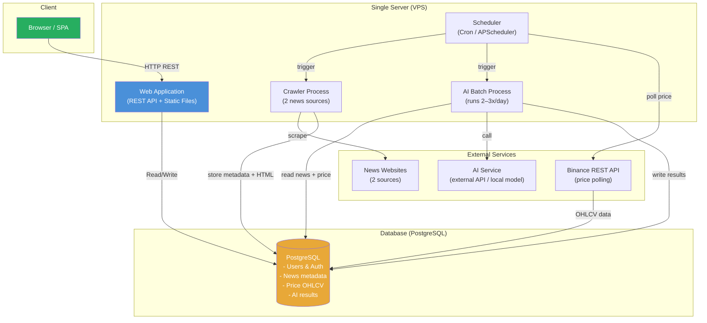

### 3.4 Luồng Xử Lý Chính V1

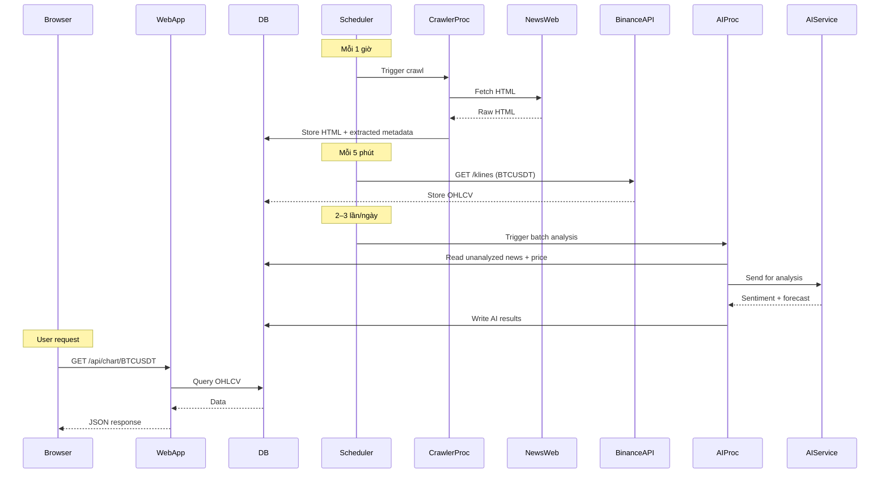

### 3.5 Schema Dữ Liệu Cơ Bản V1

```sql
-- Người dùng
users (id, email, password_hash, role ENUM('regular','vip'), created_at)

-- Tin tức
-- Lưu ý: html_content chỉ dùng ở V1 (lưu trong DB do chưa có Object Storage).
-- Từ V2 trở đi, trường này được thay bằng html_storage_path VARCHAR trỏ vào Object Storage.
articles (
  id            BIGSERIAL PRIMARY KEY,
  title         TEXT        NOT NULL,
  content       TEXT,
  summary       TEXT,
  source        VARCHAR(255),
  author        VARCHAR(255),
  published_at  TIMESTAMPTZ,
  collected_at  TIMESTAMPTZ NOT NULL DEFAULT NOW(),
  url           TEXT        NOT NULL,
  url_hash      CHAR(64)    NOT NULL UNIQUE,   -- SHA256(normalize(url)), dùng cho dedup
  language      VARCHAR(10),
  mentioned_pairs   TEXT[],                    -- VD: ['BTCUSDT', 'ETHUSDT']
  html_content  TEXT,                          -- Chỉ V1; xóa từ V2
  extractor_version VARCHAR(50),
  confidence_score  NUMERIC(4,3),             -- 0.000–1.000
  status        VARCHAR(20) DEFAULT 'pending'  -- pending | approved | rejected
)

-- Giá OHLCV
-- Composite PK đảm bảo idempotent UPSERT (ON CONFLICT DO UPDATE)
price_candles (
  pair          VARCHAR(20)  NOT NULL,
  timeframe     VARCHAR(5)   NOT NULL,         -- '1m','5m','15m','1h','4h','1d'
  open_time     BIGINT       NOT NULL,         -- Unix ms, thời điểm mở nến
  open          NUMERIC(20,8),
  high          NUMERIC(20,8),
  low           NUMERIC(20,8),
  close         NUMERIC(20,8),
  volume        NUMERIC(30,8),
  is_closed     BOOLEAN      DEFAULT FALSE,    -- TRUE khi nến đã đóng
  PRIMARY KEY (pair, timeframe, open_time)
)

-- Kết quả AI (phân tích cơ bản)
ai_analyses (
  id                BIGSERIAL PRIMARY KEY,
  article_id        BIGINT      REFERENCES articles(id),
  pair              VARCHAR(20),
  sentiment         VARCHAR(10),               -- positive | negative | neutral
  impact_level      VARCHAR(10),               -- low | medium | high
  time_horizon      VARCHAR(50),               -- VD: '1h', '1d', '1w'
  forecast          VARCHAR(15),               -- UP | DOWN | UNCERTAIN
  evidence          TEXT,                      -- đoạn văn/tin tức làm bằng chứng
  price_sync_at     TIMESTAMPTZ,              -- thời điểm dữ liệu giá được ghép
  model_version     VARCHAR(50),
  confidence_score  NUMERIC(4,3),
  idempotency_key   CHAR(64) UNIQUE,           -- SHA256(article_id || model_version)
  status            VARCHAR(20) DEFAULT 'pending', -- pending | complete | failed
  created_at        TIMESTAMPTZ DEFAULT NOW(),

  -- Phân tích nhân quả nâng cao (nullable – chỉ populate khi có causal reasoning)
  -- Dùng JSONB để tránh làm phình schema với nhiều NULL columns cho phần lớn records
  -- Tham chiếu: đề bài section 5.3 "Lưu ý về giải thích và nhân quả"
  causal_hypothesis JSONB
  -- Cấu trúc causal_hypothesis:
  -- {
  --   "cause":                  "Tổ chức X mua lượng lớn BTC",
  --   "effect":                 "Giá BTC tăng mạnh trong 4h tiếp theo",
  --   "cause_time_range":       "2024-01-15T08:00Z/2024-01-15T10:00Z",
  --   "effect_time_range":      "2024-01-15T10:00Z/2024-01-15T14:00Z",
  --   "confounding_variables":  ["Lãi suất FED công bố cùng ngày", "Thị trường chứng khoán tăng"],
  --   "supporting_evidence":    ["Khối lượng giao dịch tăng 300%", "Đoạn văn: 'Whale wallet moved...'"],
  --   "opposing_evidence":      ["Giá altcoin không tăng theo"],
  --   "uncertainty_level":      "medium",   -- low | medium | high
  --   "test_method":            "event_study",  -- event_study | ablation | counterfactual
  --   "hypothesis_version":     "1.0"
  -- }
)

-- Index hỗ trợ
CREATE INDEX idx_articles_url_hash      ON articles(url_hash);
CREATE INDEX idx_articles_status        ON articles(status);
CREATE INDEX idx_articles_published_at  ON articles(published_at DESC);
CREATE INDEX idx_ai_analyses_article    ON ai_analyses(article_id);
CREATE INDEX idx_ai_analyses_pair       ON ai_analyses(pair, created_at DESC);
CREATE INDEX idx_ai_causal              ON ai_analyses USING GIN (causal_hypothesis)
  WHERE causal_hypothesis IS NOT NULL;    -- Partial index: chỉ index rows có causal data
```

> **Lý do dùng JSONB thay vì tạo bảng riêng:** Ở V1, số lượng records có causal analysis là thiểu số (chỉ khi AI xác định được mối quan hệ nhân quả). Tạo bảng riêng `causal_analyses` ngay từ V1 sẽ over-engineer. JSONB cho phép lưu linh hoạt cấu trúc phức tạp, hỗ trợ GIN index cho query, và dễ migrate sang bảng riêng sau nếu cần. Đây là pattern phổ biến trong các hệ thống analytics (Stripe, Shopify dùng JSONB tương tự cho metadata linh hoạt).

### 3.6 Trả Lời Câu Hỏi V1

| Câu hỏi                             | Trả lời                                                                               |
| ----------------------------------- | ------------------------------------------------------------------------------------- |
| Dữ liệu lưu ở đâu?                  | Tất cả trong PostgreSQL: users, articles (metadata + HTML), price OHLCV, AI results   |
| Crawler kích hoạt thế nào?          | Cron job nội bộ, chạy định kỳ (mỗi 1–2 giờ)                                           |
| AI đọc input từ đâu?                | Query PostgreSQL lấy articles chưa phân tích + price trong cùng khoảng thời gian      |
| Vì sao phù hợp với quy mô nhỏ?      | ~1 QPS, 100 users, 1 server đủ xử lý; không cần distributed system overhead           |
| Điểm lỗi đơn (SPOF)?                | Toàn bộ server (nếu crash → mọi thứ down); PostgreSQL (nếu lỗi → mất data)            |
| Giới hạn đầu tiên có thể xuất hiện? | CPU/RAM khi crawler + AI + user requests chạy đồng thời; disk khi HTML files tích lũy |

### 3.7 Đánh Giá Rủi Ro V1

- ✅ **Phù hợp:** Deploy nhanh, cost thấp (~$20–50/tháng), đủ cho pilot
- ⚠️ **Rủi ro:** HTML gốc (100–500KB/bài × 200 bài/ngày = 20–100MB/ngày) sẽ nhanh chóng lấp đầy ổ đĩa
- ⚠️ **Rủi ro:** Crawler chạy cùng thread với API → latency spike
- ❌ **Không phù hợp cho:** >1.000 users đồng thời

## 4. Phiên Bản 2 – Tăng Trưởng (10.000 DAU)

### 4.1 Các Vấn Đề Được Xác Định Từ V1

> **Nguyên tắc:** Không thay đổi bất cứ thứ gì chưa có số liệu chứng minh là bottleneck.

Từ kết quả load test giả định:

| Số liệu quan sát                   | Giá trị       | Ngưỡng nguy hiểm            | Kết luận                               |
| ---------------------------------- | ------------- | --------------------------- | -------------------------------------- |
| CPU server khi cao điểm            | **>85%**      | >70% cần chú ý              | Quá tải – cần tách workload            |
| p95 latency chart API              | **~1.5 giây** | >500ms là vấn đề            | DB query chậm hoặc contention          |
| Disk usage (HTML + price history)  | Tăng nhanh    | Dự kiến đầy trong vài tháng | Cần tách storage                       |
| Crawler ảnh hưởng API              | Có            | —                           | Chạy đồng thời gây resource contention |
| Bài viết bị bỏ sót khi crawler lỗi | Có            | —                           | Không có retry mechanism               |

### 4.2 Phân Tích Bottleneck và Giải Pháp

**Bottleneck 1: CPU overload do monolith**

- Nguyên nhân: Crawler (CPU-intensive scraping) + AI batch + API handler cùng chạy trên 1 process/server
- Giải pháp: Tách crawler và AI sang **background worker process** riêng (vẫn cùng server hoặc server riêng nhỏ)

**Bottleneck 2: Disk đầy do HTML gốc**

- Nguyên nhân: HTML files 100–500KB/bài không phù hợp lưu trong PostgreSQL (BLOB làm chậm query)
- Giải pháp: Chuyển HTML gốc sang **Object Storage** (S3-compatible); PostgreSQL chỉ lưu metadata + path

**Bottleneck 3: Chart query chậm**

- Nguyên nhân: OHLCV query không có cache, mỗi request đều hit DB
- Giải pháp: Thêm **Redis cache** cho chart data (TTL 60s cho realtime, 5–15 phút cho historical)

**Bottleneck 4: Không có retry khi crawler lỗi**

- Nguyên nhân: Cron job không có state, lỗi = mất bài
- Giải pháp: Thêm **task queue** (Celery + Redis hoặc RQ) với retry logic

**Quyết định về Reverse Proxy:**

- Thêm **Nginx** làm reverse proxy: terminate TLS, serve static files, gzip compression, rate limiting cơ bản
- Lý do: Ngay cả với 1 server, Nginx giúp giảm tải cho application server và là best practice cơ bản

**Quyết định về Load Balancer:** Chưa cần – vẫn 1 app server, LB không có ý nghĩa với 1 upstream.

**Quyết định về API Gateway:** Chưa cần – logic auth vẫn đơn giản, 1 service.

### 4.3 Diagram Kiến Trúc V2

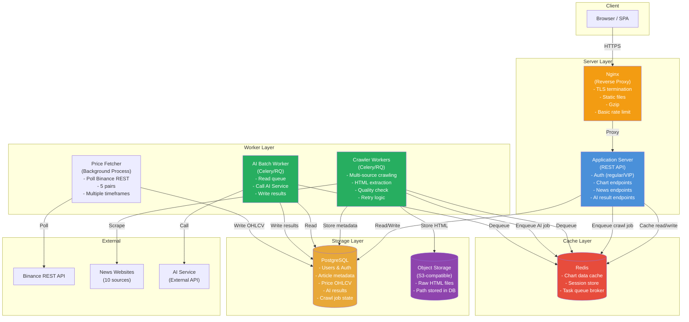

### 4.4 Luồng Crawling Có Retry V2

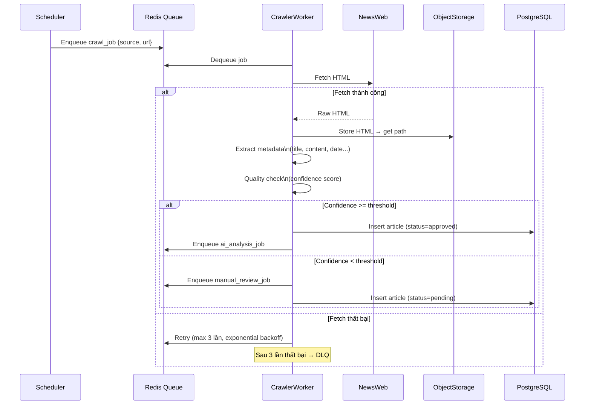

### 4.5 Cache Strategy V2

| Dữ liệu được cache            | TTL                | Lý do                              |
| ----------------------------- | ------------------ | ---------------------------------- |
| Chart data (OHLCV 1h, 4h, 1d) | 5–15 phút          | Historical data thay đổi chậm      |
| Chart data (OHLCV 1m, 5m)     | 30–60 giây         | Near-realtime, chấp nhận stale nhẹ |
| Danh sách tin tức công khai   | 2–5 phút           | Không cần fresh tuyệt đối          |
| User session/JWT              | TTL = token expiry | Auth state                         |

**Cache Invalidation:**

- Time-based TTL (passive expiration): đơn giản, phù hợp V2
- Write-through: khi Price Fetcher ghi OHLCV mới → cũng invalidate cache key tương ứng

### 4.6 Trả Lời Câu Hỏi V2

| Câu hỏi                           | Trả lời                                                                                                          |
| --------------------------------- | ---------------------------------------------------------------------------------------------------------------- |
| Tách thành phần nào?              | Crawler và AI sang worker process riêng; tách khỏi request path                                                  |
| HTML gốc lưu trong relational DB? | **Không** – quá lớn, làm chậm index scan; chuyển sang Object Storage                                             |
| Cần Object Storage?               | **Có** – HTML gốc 100–500KB/bài × 2.000 bài/ngày = 200MB–1GB/ngày                                                |
| Tách crawler khỏi user request?   | **Có** – dùng task queue (Celery+Redis); crawler không còn block API thread                                      |
| Cần cache?                        | **Có** – Redis cache cho chart data; giảm p95 từ 1.5s xuống <200ms                                               |
| Reverse Proxy cần chưa?           | **Có** – Nginx: TLS, static files, gzip; API Gateway và LB chưa cần                                              |
| Thay đổi giải quyết số liệu nào?  | CPU giảm (tách worker), latency giảm (cache), disk có thể scale (object storage), bài không bỏ sót (retry queue) |

## 5. Phiên Bản 3 – Lưu Lượng Lớn (100.000 DAU)

### 5.1 Các Vấn Đề Được Xác Định Từ V2

| Số liệu quan sát                                    | Giá trị                | Kết luận                                  |
| --------------------------------------------------- | ---------------------- | ----------------------------------------- |
| WebSocket connection ảnh hưởng REST                 | Có (shared server)     | Cần tách WebSocket service                |
| Nhiều user cùng query BTCUSDT 1m                    | Cache miss rate cao    | Cần shared price broadcast                |
| AI tạo CPU/GPU spike đột biến                       | Có                     | Cần queue buffer + dedicated worker       |
| 1 nguồn tin gửi data nhanh làm các nguồn khác chậm  | Có                     | Cần per-source queue isolation            |
| Bài viết xử lý lặp lại (duplicate processing)       | Có                     | Cần idempotency key                       |
| User timeout khi AI service chậm                    | Có                     | Cần async decoupling với callback/polling |
| 10% VIP cần kiểm tra quyền trước khi trả kết quả AI | Chưa có cơ chế rõ ràng | Cần middleware/guard                      |

### 5.2 Chiến Lược Kiến Trúc V3

**Thêm Load Balancer:**

- Lý do: Cần chạy nhiều App Server instance để xử lý 10.000 concurrent users (~230 QPS peak)
- Không cần LB cho V2 vì 1 instance đủ handle 1.000 concurrent

**Tách WebSocket Service:**

- Lý do: WebSocket giữ connection lâu dài (long-lived), chiếm file descriptor và memory của App Server
- Giải pháp: Dedicated WebSocket Server(s) nhận price broadcast từ Pub/Sub (Redis)

**Binance WebSocket Aggregator:**

- Lý do: Không tạo 1 WS connection per user đến Binance (vi phạm TOS, không scalable)
- Giải pháp: 1 Aggregator duy nhất kết nối với Binance, fan-out qua Redis Pub/Sub đến tất cả WebSocket servers

**Message Queue cho Crawler và AI:**

- Lý do: Tách producer và consumer; tránh overload AI service; per-source isolation
- Giải pháp: Kafka hoặc RabbitMQ với dedicated topic/queue per source

> **Tại sao Kafka ở V3?** 10.000 bài/ngày từ 30 nguồn, có yêu cầu per-source isolation, replay capability khi worker lỗi, và AI spike isolation. Đây là vấn đề cụ thể, không phải thêm Kafka vì "có khả năng mở rộng".

**Database Read Replica:**

- Lý do: Chart read query (heavy) và write (price update, crawl) bắt đầu tranh chấp lock
- Giải pháp: 1 PostgreSQL read replica cho chart/news read; master chỉ write

**VIP Access Control Middleware:**

- Lý do: AI result endpoint cần kiểm tra VIP trước khi execute query đắt tiền
- Giải pháp: Auth middleware kiểm tra role từ JWT/session trước khi route vào handler

**Idempotency cho Crawler và AI:**

- Crawler: dedup bằng URL hash (SHA256) trước khi insert
- AI job: idempotency_key = hash(article_id + model_version); nếu đã có result → skip

### 5.3 Diagram Kiến Trúc V3

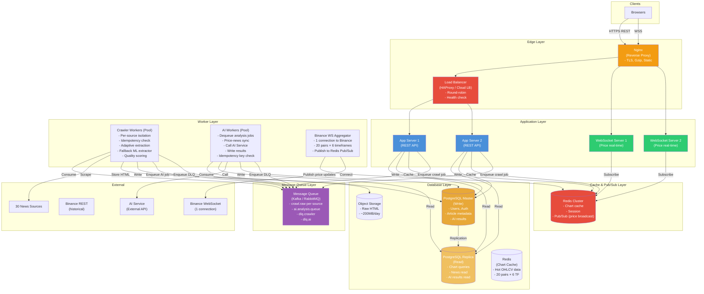

### 5.4 Luồng Real-time Price V3

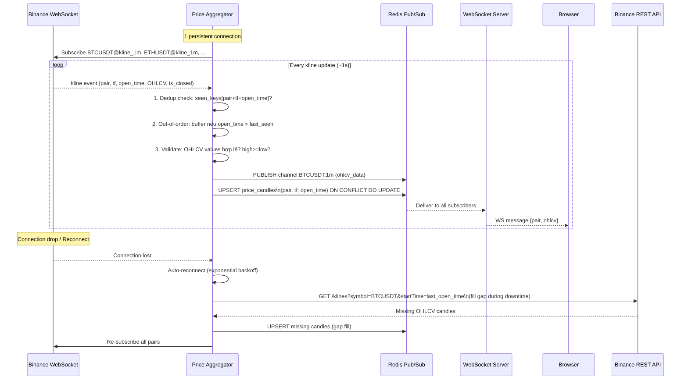

### 5.4a Cơ Chế Xử Lý Dữ Liệu Giá Bất Thường

Binance WebSocket stream OHLCV kline có 3 loại bất thường cần xử lý tại tầng **Price Aggregator**:

#### Dữ liệu Trùng (Duplicate)

Binance gửi kline update liên tục trong suốt chu kỳ nến (ví dụ mỗi ~250ms cho nến 1m đang hình thành). Sau khi nến đóng (`is_closed=true`), Binance gửi thêm 1 event cuối. Ngoài ra khi reconnect, có thể nhận lại event của nến cũ.

**Cơ chế:**

```
In-memory seen_keys = Set of (pair + timeframe + open_time)
Mỗi event đến:
  if key in seen_keys AND is_closed == false: skip (duplicate in-progress update)
  if key in seen_keys AND is_closed == true: UPDATE (final close value)
  else: INSERT và add to seen_keys

DB layer: UPSERT với ON CONFLICT (pair, timeframe, open_time) DO UPDATE
  SET high=GREATEST(high, $new_high),
      low=LEAST(low, $new_low),
      close=$new_close,
      volume=$new_volume
```

#### Dữ Liệu Sai Thứ Tự (Out-of-order)

Với OHLCV kline (không phải tick-level), out-of-order xảy ra chủ yếu khi:

- Reconnect và nhận lại batch cũ từ stream
- Network jitter làm 2 events đến lộn thứ tự

**Cơ chế:** Aggregator duy trì `last_processed_open_time[pair][tf]`. Nếu event đến có `open_time < last_processed_open_time` → không publish lên Pub/Sub (tránh chart giật lùi) nhưng vẫn UPSERT vào DB (tránh mất dữ liệu). Pub/Sub chỉ nhận events theo chiều tăng của `open_time`.

#### Dữ Liệu Bị Thiếu (Missing / Gap)

Xảy ra khi Aggregator mất kết nối với Binance trong khoảng thời gian nhất định.

**Cơ chế – Gap Filler (chạy sau mỗi lần reconnect):**

```
1. Khi reconnect thành công, lấy last_open_time từ DB cho mỗi pair+tf
2. So sánh với current_time:
   gap = current_time - last_open_time
   expected_candles = gap / timeframe_duration
3. Nếu gap > 1 candle → gọi Binance REST /klines với:
   startTime = last_open_time + 1
   endTime   = current_time
   limit     = min(expected_candles, 1000)  -- Binance max limit
4. UPSERT tất cả candles thiếu vào DB
5. Publish "gap_filled" event để WS Servers reload chart nếu cần
```

| Loại bất thường | Phát hiện tại                    | Xử lý                    | Kết quả                         |
| --------------- | -------------------------------- | ------------------------ | ------------------------------- |
| Duplicate       | Aggregator in-memory + DB UNIQUE | Skip publish + UPSERT DB | Idempotent write                |
| Out-of-order    | Aggregator (compare open_time)   | Skip publish, UPSERT DB  | DB đầy đủ, chart không giật lùi |
| Missing/Gap     | Aggregator sau reconnect         | REST API gap fill        | DB đầy đủ, không đứt đoạn       |

### 5.4b Adaptive Extraction Pipeline V3

Đây là core domain của hệ thống. Pipeline được thiết kế để tự phát hiện khi extractor bị lỗi do website thay đổi cấu trúc, tự động fallback sang LLM, và cho phép cập nhật config mà không cần redeploy.

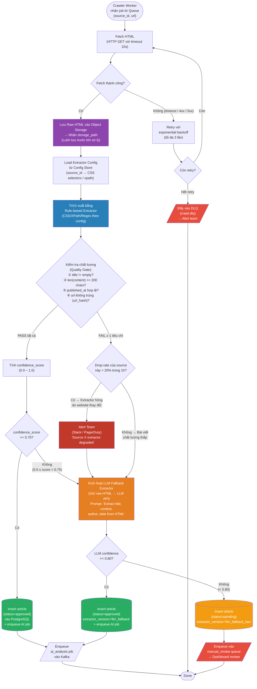

**Giải thích các quyết định thiết kế trong pipeline:**

| Điểm quyết định                                    | Logic             | Lý do                                                                 |
| -------------------------------------------------- | ----------------- | --------------------------------------------------------------------- |
| Lưu HTML **trước** khi extract                     | Always-first      | Nếu extractor crash → HTML vẫn còn để replay sau                      |
| Config từ Config Store                             | Hot-reload        | Cập nhật selector mới mà không redeploy worker                        |
| Quality Gate 4 tiêu chí                            | Whitelist rule    | Phát hiện sớm trước khi tốn LLM call                                  |
| Phân biệt "drop rate cao" vs "bài chất lượng thấp" | Khác trigger      | Drop rate cao = extractor hỏng (alert); bài đơn lẻ thấp = bình thường |
| LLM Fallback chỉ khi rule-based fail               | Cost control      | LLM inference tốn kém; chỉ dùng khi cần thiết                         |
| `status=pending` + DLQ                             | Human-in-the-loop | LLM cũng có thể sai; cần review trước khi publish                     |

### 5.5 Luồng AI Analysis Async V3

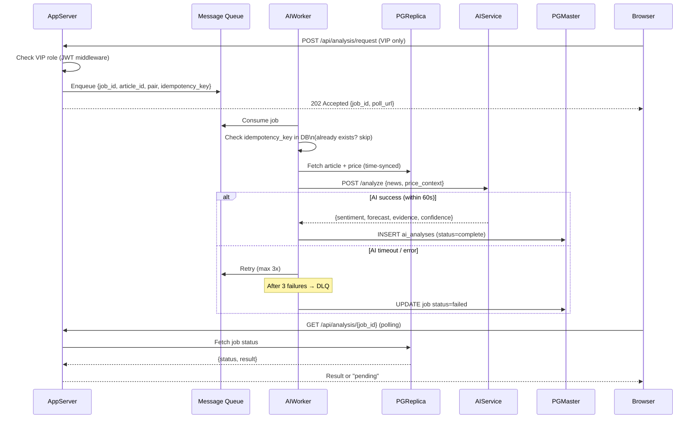

### 5.6 Dead-letter Queue và Retry Strategy V3

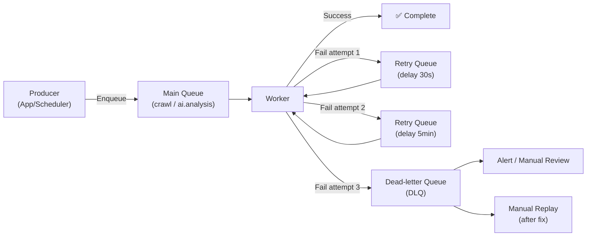

**Idempotency Implementation:**

```
Crawler idempotency key: SHA256(source_domain + article_url)
AI job idempotency key:  SHA256(article_id + model_version)

Trước khi process: SELECT 1 FROM processed_jobs WHERE idempotency_key = ?
Nếu tồn tại → skip và ACK message
Nếu không tồn tại → process và INSERT key
```

### 5.7 Trả Lời Câu Hỏi V3

| Câu hỏi                             | Trả lời                                                                               |
| ----------------------------------- | ------------------------------------------------------------------------------------- |
| Luồng thu nhận giá từ Binance       | 1 Aggregator connect Binance WS → Redis Pub/Sub → fan-out đến WS Servers              |
| Chia sẻ price stream cho nhiều user | Redis Pub/Sub: 1 channel per pair/timeframe; WS Servers subscribe và push đến clients |
| Tách WebSocket khỏi REST            | Có – WebSocket Server riêng, không share process với App Server                       |
| Crawler và AI async                 | Qua Message Queue; Worker pool consume độc lập                                        |
| Message Queue đặt ở đâu             | Giữa App/Scheduler (producer) và Workers (consumer)                                   |
| Worker lấy job và ghi kết quả       | Consumer từ MQ, ghi vào PGMaster, update job status                                   |
| Retry, idempotency, DLQ             | Exponential backoff retry, idempotency key trước khi process, DLQ sau 3 lần fail      |
| Cache chart data                    | Redis: key = `chart:{pair}:{timeframe}:{from}:{to}`, TTL theo timeframe               |
| Tách read/write DB                  | PostgreSQL Master (write) + Read Replica (read)                                       |
| Kiểm tra quyền VIP                  | JWT middleware tại App Server trước khi vào handler; không chỉ ẩn UI                  |

## 6. Phiên Bản 4 – Triệu Người Dùng & High Availability

### 6.1 Các Vấn Đề Được Xác Định Từ V3

| Số liệu / Yêu cầu mới                 | Bottleneck V3                                   | Cần giải quyết                        |
| ------------------------------------- | ----------------------------------------------- | ------------------------------------- |
| 1M DAU, 100K concurrent               | App Server không đủ dù scale horizontal         | Autoscaling group + API Gateway       |
| 99.9% availability                    | Single AZ deployment → AZ failure = full outage | Multi-AZ deployment                   |
| p95 < 500ms cho chart API             | DB replica bị lag dưới tải cao                  | Read cache + CDN cho static assets    |
| Real-time delay < 2s                  | WS Server bottleneck ở 100K connections         | Scale WS + Redis Cluster              |
| Website HTML thay đổi không báo trước | Không có monitoring trên extraction quality     | Adaptive pipeline + alerting          |
| Backup & recovery                     | Không có DR plan                                | Automated backup, failover, RTO/RPO   |
| Auth, rate limiting, versioning       | Phân tán ở từng service                         | API Gateway tập trung                 |
| Monitoring, tracing                   | Không có observability                          | Centralized logging, metrics, tracing |

### 6.2 Các Thành Phần Mới Trong V4

**Multi-AZ Deployment:**

- App Server, WebSocket Server, Worker chạy trên ít nhất 2 AZ
- PostgreSQL Multi-AZ (Primary + Standby với automatic failover)
- Redis Cluster (sharding + replication)
- Object Storage đã inherently multi-AZ (S3-compatible)

**API Gateway (tập trung) – chỉ cho REST:**

- Lý do V3 chưa cần: 1 loại service, auth đơn giản; V4 cần: 100K RPS, nhiều version API, rate limiting per-user
- Chức năng: Authentication (JWT validation), Authorization (role check), Rate limiting, API versioning, Request routing
- **Quan trọng:** API Gateway **không** nằm trên đường đi của WebSocket connections. WebSocket là long-lived TCP connection; nếu giữ 100K connections qua API Gateway sẽ tiêu tốn cực lớn memory và file descriptor, đẩy chi phí hạ tầng lên rất cao. API Gateway được thiết kế cho HTTP request–response ngắn hạn.

**WebSocket Authentication – Ticket-based Flow:**

WebSocket cần cơ chế auth riêng, không qua API Gateway:

```
1. Client gọi REST API (qua API Gateway):
   POST /api/ws/ticket
   Authorization: Bearer <JWT>
   → Response: { "ticket": "<one-time-token>", "expires_in": 30 }
   (Ticket được lưu vào Redis với TTL 30s, single-use)

2. Client kết nối thẳng đến WebSocket Server (qua Network/TCP LB):
   wss://ws.cryptoinsight.com/price?ticket=<one-time-token>

3. WebSocket Server verify ticket:
   - Lookup ticket trong Redis
   - Nếu valid: xóa ticket khỏi Redis (single-use), thiết lập connection
   - Nếu invalid/expired: đóng connection với code 4001
```

Luồng này đảm bảo: (a) auth vẫn được kiểm tra đúng, (b) WebSocket connection không đi qua API Gateway, (c) ticket chỉ dùng 1 lần tránh replay attack.

**Autoscaling:**

- App Server: scale based on CPU >60% hoặc request queue depth
- WebSocket Server: scale based on connection count
- AI Worker: scale based on MQ queue depth

**CDN (Content Delivery Network):**

- Static assets (JS, CSS, fonts): CDN edge cache
- API responses không qua CDN (dynamic, user-specific)

**Graceful Degradation:**

- Nếu AI Service down → show cached last result hoặc "Analysis unavailable"
- Nếu WebSocket gián đoạn → fallback về polling mỗi 5s
- Nếu Read Replica lag >30s → failover sang read từ Master tạm thời

**Observability Stack:**

- Metrics: Prometheus + Grafana (hoặc Datadog)
- Logging: ELK Stack hoặc Loki + Grafana
- Tracing: OpenTelemetry → Jaeger / Tempo
- Alerting: PagerDuty / OpsGenie với on-call rotation

**Price Fan-out: Từ Redis Pub/Sub sang Kafka Consumer Groups (V4):**

Redis Pub/Sub hoạt động tốt ở V3 (Redis standalone hoặc Sentinel). Tuy nhiên ở V4 khi cần **Redis Cluster** (sharding để handle 100K connections + high throughput), Pub/Sub có vấn đề quan trọng:

> Trong Redis Cluster trước phiên bản 7.0, một `PUBLISH` message trên bất kỳ node nào sẽ được **broadcast nội bộ tới tất cả nodes** trong cluster thông qua cluster bus. Với 50 pairs × 6 timeframes × cập nhật liên tục, điều này tạo ra internal network amplification ("broadcast storm") làm nghẽn cluster bus và tăng latency.

**Giải pháp ở V4:** Tận dụng **Kafka cluster đã có sẵn** để fan-out price data, thay vì Redis Pub/Sub:

```
Price Aggregator → PUBLISH vào Kafka topic: price.realtime.{pair}.{timeframe}
                   (VD: price.realtime.BTCUSDT.1m)

WS Server → Consumer group: ws-fanout-{server_id}
            - Mỗi WS Server instance là 1 consumer riêng
            - Consume tất cả partitions của topic cần thiết
            - Push đến browsers đang subscribe pair đó
```

Lợi ích so với Redis Pub/Sub trong môi trường cluster:

- Không có broadcast storm nội bộ: Kafka broker routing message đúng partition
- Message persistence: WS Server restart không mất message (replay từ offset)
- Consumer lag monitoring: biết ngay WS Server nào đang chậm
- Horizontal scale WS Server mà không cần re-configure Pub/Sub

Redis Cluster vẫn được giữ lại cho: chart cache, session, WS ticket, rate limiting. Không dùng Redis Pub/Sub cho price fan-out ở V4.

> **Lưu ý:** Nếu dùng Redis >= 7.0, **Sharded Pub/Sub** (`SSUBSCRIBE`/`SPUBLISH`) giải quyết được vấn đề broadcast storm bằng cách giới hạn message chỉ đi trong shard chứa channel hash. Đây là lựa chọn thay thế hợp lệ nếu muốn giữ Redis Pub/Sub thay vì Kafka. Hệ thống này chọn Kafka vì đã có sẵn và tránh phụ thuộc vào version Redis cụ thể.

**Adaptive Extraction Monitoring:**

- Monitor confidence_score trung bình theo source mỗi 1 giờ
- Nếu avg confidence drops >20% → trigger alert → auto-send to DLQ cho manual review
- Extractor config được load từ Object Storage / Config Service (không cần redeploy)

### 6.3 Diagram Kiến Trúc V4 – Full High Availability

> **Lưu ý thiết kế quan trọng:** Luồng REST và luồng WebSocket được tách biệt hoàn toàn từ tầng Load Balancer. REST đi qua API Gateway (HTTP LB → API GW → App Server). WebSocket đi qua TCP/Network LB thẳng đến WS Server, xác thực bằng one-time ticket (không qua API Gateway). Lý do: API Gateway không phù hợp giữ 100K long-lived TCP connections.

```mermaid
graph TB
    subgraph "CDN / Edge"
        CDN["CDN\n(Static assets, JS/CSS)"]
    end

    subgraph "Global Routing"
        GlobalLB["Global Load Balancer\n(DNS-based / Anycast)\n- Health check per AZ\n- AZ failover"]
        GlobalWSLB["Global WS Load Balancer\n(TCP/Network LB)\n- Sticky session by user\n- Health check WS Servers"]
    end

    subgraph "Availability Zone A"
        direction TB
        subgraph "REST Tier AZ-A"
            APIGW_A["API Gateway (AZ-A)\n- JWT Auth/AuthZ\n- Rate limiting per-user\n- API versioning\n- Routing"]
            AppA1["App Server A1\n(REST API)\n- Issues WS Ticket"]
            AppA2["App Server A2\n(REST API)\n- Issues WS Ticket"]
        end
        subgraph "WebSocket Tier AZ-A"
            WSA1["WS Server A1\n- Verify one-time ticket\n  (lookup Redis)\n- Subscribe Pub/Sub\n- Push price to clients"]
            WSA2["WS Server A2"]
        end
        subgraph "Data AZ-A"
            PGPrimary[("PostgreSQL Primary\n(AZ-A)")]
            RedisA[("Redis Cluster Node\n(AZ-A)\n- WS tickets (TTL 30s)\n- Pub/Sub\n- Chart cache")]
        end
    end

    subgraph "Availability Zone B"
        direction TB
        subgraph "REST Tier AZ-B"
            APIGW_B["API Gateway (AZ-B)"]
            AppB1["App Server B1"]
            AppB2["App Server B2"]
        end
        subgraph "WebSocket Tier AZ-B"
            WSB1["WS Server B1"]
            WSB2["WS Server B2"]
        end
        subgraph "Data AZ-B"
            PGStandby[("PostgreSQL Standby\n(AZ-B, auto-failover)")]
            RedisB[("Redis Cluster Node\n(AZ-B)")]
        end
    end

    subgraph "Shared / Regional Services"
        MQ["Kafka Cluster\n- Multi-broker\n- Replication factor 3\n- Per-source topics\n- AI queue / DLQ"]
        ObjectStorage[("Object Storage\n(Multi-AZ)\n- Raw HTML\n- Backups\n- Log archives")]
        PGReadReplica[("PostgreSQL Read Replica Pool")]
    end

    subgraph "Worker Layer (Auto-scaling)"
        CrawlerPool["Crawler Worker Pool\n(Auto-scale)"]
        AIPool["AI Worker Pool\n(Auto-scale on queue depth)\n- Circuit breaker\n- Idempotency"]
        PriceAgg["Price Aggregator\n(Primary + Hot Standby)\n- 50 pairs × 6 TF\n- Gap Filler on reconnect"]
    end

    subgraph "Observability"
        Metrics["Prometheus / Datadog"]
        Logs["ELK / Loki"]
        Tracing["OpenTelemetry + Jaeger"]
        Alerting["PagerDuty"]
    end

    subgraph "External"
        BinanceWS["Binance WebSocket"]
        NewsWeb["50 News Sources"]
        AIService["AI Service"]
    end

    Client["Clients\n(REST)"] --> CDN
    Client --> GlobalLB
    ClientWS["Clients\n(WebSocket)"] --> GlobalWSLB

    GlobalLB --> APIGW_A --> AppA1 & AppA2
    GlobalLB --> APIGW_B --> AppB1 & AppB2

    GlobalWSLB --> WSA1 & WSA2
    GlobalWSLB --> WSB1 & WSB2

    AppA1 & AppA2 & AppB1 & AppB2 -- "POST /ws/ticket → store in Redis" --> RedisA & RedisB
    AppA1 & AppA2 & AppB1 & AppB2 --> PGReadReplica
    AppA1 & AppA2 & AppB1 & AppB2 --> PGPrimary

    WSA1 & WSA2 & WSB1 & WSB2 -- "Verify ticket + DELETE\n(single-use)" --> RedisA & RedisB
    WSA1 & WSA2 & WSB1 & WSB2 -- "Consume price topics" --> MQ

    PriceAgg -- "Publish price updates" --> MQ
    PriceAgg --> BinanceWS

    AppA1 & AppA2 --> MQ
    CrawlerPool --> MQ & NewsWeb & ObjectStorage & PGPrimary
    AIPool --> MQ & PGReadReplica & AIService & PGPrimary

    PGPrimary -- "Sync replication" --> PGStandby
    PGPrimary -- "Async replication" --> PGReadReplica
    RedisA <-- "Cluster sync" --> RedisB

    AppA1 & AppA2 & AppB1 & AppB2 & CrawlerPool & AIPool & WSA1 --> Metrics & Logs & Tracing
    Metrics --> Alerting

    style GlobalLB fill:#E74C3C,color:#fff
    style GlobalWSLB fill:#C0392B,color:#fff
    style APIGW_A fill:#8E44AD,color:#fff
    style APIGW_B fill:#8E44AD,color:#fff
    style WSA1 fill:#2ECC71,color:#fff
    style WSA2 fill:#2ECC71,color:#fff
    style WSB1 fill:#2ECC71,color:#fff
    style WSB2 fill:#2ECC71,color:#fff
    style PGPrimary fill:#E8A838,color:#fff
    style PGStandby fill:#F0C060,color:#fff
    style MQ fill:#9B59B6,color:#fff
    style ObjectStorage fill:#6C3483,color:#fff
```

### 6.3a WebSocket Ticket-based Authentication Flow

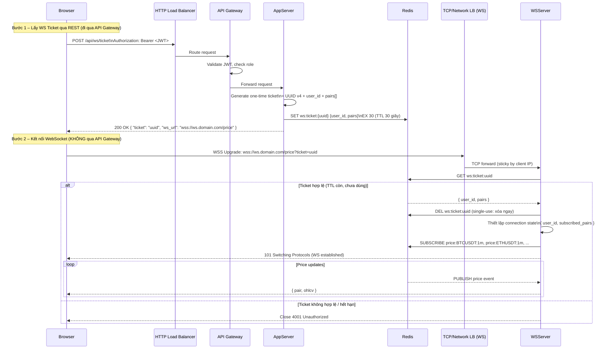

### 6.4 API Gateway – Chi Tiết Luồng Xử Lý (REST Only)

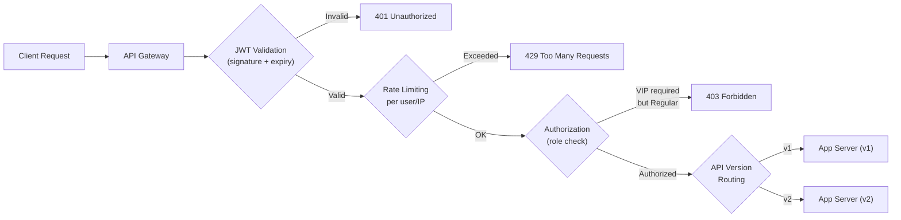

### 6.5 Graceful Degradation Strategy

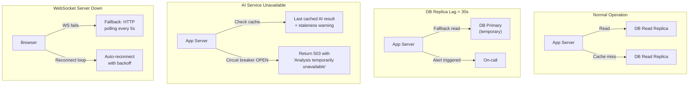

### 6.6 Backup và Disaster Recovery Plan

| Thành phần               | Backup strategy                                   | RTO                      | RPO                         |
| ------------------------ | ------------------------------------------------- | ------------------------ | --------------------------- |
| PostgreSQL Primary       | Automated daily full + WAL streaming to standby   | 2–5 phút (auto-failover) | ~seconds (sync replication) |
| PostgreSQL Read Replicas | Rebuilt từ Primary                                | 10–30 phút               | N/A                         |
| Object Storage (HTML)    | Versioning + cross-region replication             | Minutes                  | 0 (eventual)                |
| Redis Cluster            | Persistence (RDB + AOF) + replication             | 5–15 phút                | 1–5 phút                    |
| Message Queue            | Cluster replication (Kafka: replication factor 3) | Automatic                | 0                           |
| AI results               | Trong PostgreSQL (đã có backup)                   | —                        | —                           |

### 6.7 Phân Tách Dữ Liệu Rõ Ràng

| Loại dữ liệu                 | Storage                         | Lý do                                         |
| ---------------------------- | ------------------------------- | --------------------------------------------- |
| Tài khoản, quyền VIP         | PostgreSQL (strong consistency) | ACID required, kích thước nhỏ                 |
| Metadata tin tức (chuẩn hóa) | PostgreSQL                      | Cần full-text search, join với AI results     |
| HTML gốc                     | Object Storage (S3)             | Kích thước lớn, không cần query               |
| Dữ liệu giá OHLCV            | PostgreSQL + Redis cache        | Structured, time-series query, cache hot data |
| Kết quả AI                   | PostgreSQL                      | Cần join với articles, structured             |
| Log, metrics, traces         | ELK / Loki + Prometheus         | Volume lớn, append-only, không cần ACID       |
| Config extractor             | Object Storage / Config Service | Hot-reload không cần redeploy                 |

### 6.8 Monitoring và Alerting – Key Metrics

| Metric                       | Threshold Alert      | Action                                          |
| ---------------------------- | -------------------- | ----------------------------------------------- |
| p95 Chart API latency        | >500ms               | Scale App Server; check cache hit rate          |
| WebSocket connection count   | >80K per server      | Trigger autoscale WS Server                     |
| AI Queue depth               | >1000 jobs           | Scale AI Worker pool                            |
| Crawler confidence score avg | Drop >20% per source | Alert + suspend source + manual review          |
| DB replication lag           | >30s                 | Alert + failover read to primary                |
| Error rate (5xx)             | >1%                  | Alert on-call                                   |
| Price feed delay             | >2s                  | Alert + check Aggregator + Binance connectivity |

## 7. Bảng Tổng Hợp Tiến Hóa Kiến Trúc

| Chuyển phiên bản | Yêu cầu / Số liệu mới                                                                                                   | Nút thắt phiên bản cũ                                                                                                                                                                                                                               | Thay đổi kiến trúc                                                                                                                                                                                                                                                                                                                                                                                                                                                                                                                                                                                                              | Lý do lựa chọn                                                                                                                                                                  | Đánh đổi                                                                                                                                                     | Metric kiểm chứng                                                                                                                                                                    |
| ---------------- | ----------------------------------------------------------------------------------------------------------------------- | --------------------------------------------------------------------------------------------------------------------------------------------------------------------------------------------------------------------------------------------------- | ------------------------------------------------------------------------------------------------------------------------------------------------------------------------------------------------------------------------------------------------------------------------------------------------------------------------------------------------------------------------------------------------------------------------------------------------------------------------------------------------------------------------------------------------------------------------------------------------------------------------------- | ------------------------------------------------------------------------------------------------------------------------------------------------------------------------------- | ------------------------------------------------------------------------------------------------------------------------------------------------------------ | ------------------------------------------------------------------------------------------------------------------------------------------------------------------------------------ |
| **V1 → V2**      | 10K DAU, 1K concurrent, 5 pairs, 10 sources, near-realtime price, VIP account                                           | CPU >85% (monolith); p95 latency 1.5s; disk đầy (HTML trong DB); crawler block API; không có retry                                                                                                                                                  | ① Nginx reverse proxy ② Object Storage cho HTML ③ Redis cache cho chart ④ Task queue (Celery+Redis) với retry ⑤ Tách Crawler + AI sang worker process                                                                                                                                                                                                                                                                                                                                                                                                                                                                           | Tách I/O-bound (crawl) khỏi request path; HTML không phù hợp lưu RDBMS; cache giảm DB load; queue cho retry capability                                                          | Tăng số lượng thành phần (Nginx, Redis, workers); cần monitor queue; eventual consistency cho AI results                                                     | CPU <70% peak; chart p95 <300ms; disk growth predictable; zero missed articles; queue depth                                                                                          |
| **V2 → V3**      | 100K DAU, 10K concurrent, 20 pairs, 30 sources, 10K articles/day, 10K WS connections, AI <60s                           | WS và REST trên cùng server gây tranh chấp; nhiều user query cùng price data; AI spike CPU đột biến; 1 nguồn nhanh block các nguồn khác; duplicate article processing; AI timeout gây user timeout                                                  | ① Load Balancer + horizontal scale App Server ② Tách WebSocket Server riêng ③ Redis Pub/Sub cho price broadcast ④ Binance WS Aggregator (1 connection) ⑤ Kafka/RabbitMQ với per-source isolation ⑥ PostgreSQL Read Replica ⑦ Idempotency key cho crawler và AI ⑧ VIP middleware ⑨ Async AI với job polling                                                                                                                                                                                                                                                                                                                      | LB cần khi >1 instance; WS có connection model khác REST; 1 Binance connection tránh TOS violation; per-source queue isolation; read replica tách read/write contention         | Distributed system complexity cao hơn; cần Kafka expertise; eventual consistency mạnh hơn; data lag từ read replica                                          | WS connections per server; Redis Pub/Sub throughput; queue consumer lag per source; DB replication lag; idempotency collision rate; AI job completion rate <60s                      |
| **V3 → V4**      | 1M DAU, 100K concurrent, 50 sources, 50K articles/day, 50 pairs, 99.9% availability, website HTML thay đổi, backup & DR | Single AZ = single point of failure; không autoscale → spike gây outage; không có centralized auth/rate limit; không có observability; không có DR plan; Redis Cluster Pub/Sub broadcast storm với 50 pairs; WS auth nếu qua API Gateway sẽ quá tải | ① Multi-AZ deployment (app, DB, cache) ② Global LB: HTTP LB cho REST (→ API Gateway → App Server); TCP LB riêng cho WS (→ WS Server trực tiếp) ③ API Gateway chỉ cho REST: auth, rate limit, versioning ④ WS auth bằng one-time Ticket (issue qua REST, verify tại WS Server) ⑤ Chuyển price fan-out từ Redis Pub/Sub sang Kafka Consumer Groups (tránh broadcast storm trên Redis Cluster) ⑥ Autoscaling groups (App, WS, Worker theo queue depth) ⑦ CDN cho static assets ⑧ Adaptive extraction monitor + hot config reload ⑨ Graceful degradation (circuit breaker) ⑩ Full observability stack ⑪ Automated backup + failover | Multi-AZ minimum cho 99.9%; tách REST/WS LB tránh API GW bottleneck; Kafka fan-out giải quyết Redis Cluster Pub/Sub limitation; Ticket pattern đảm bảo WS auth không qua API GW | Chi phí tăng đáng kể; Kafka consumer group thêm lag cần monitor; WS ticket flow thêm 1 round-trip REST trước khi connect; operational complexity cần đội SRE | Availability 30-day window; AZ failover RTO; WS connection count per server; Kafka consumer lag cho price topic; Redis cluster bus traffic giảm; p95 latency; autoscale trigger time |

## 8. Trả Lời Câu Hỏi Gợi Ý

### Q1. Vì sao không xây dựng microservices ngay từ V1?

Microservices giải quyết vấn đề **independent scaling** và **independent deployment** của các service có tải khác nhau. Ở V1, với 100 DAU và ~1 QPS, tải không đủ để cần tách service; ngược lại, microservices ở quy mô này mang lại overhead nghiêm trọng:

- **Network latency** thay vì function call
- **Distributed transaction** thay vì local DB transaction
- **Service discovery, health check, CI/CD pipeline** mỗi service riêng
- **Observability phức tạp** hơn (distributed tracing bắt buộc)

Monolith ở V1-V2 không phải anti-pattern – đó là **right tool for the right scale**. Tách service chỉ có nghĩa khi có bottleneck cụ thể đòi hỏi independent scaling (V3: WS Server cần scale độc lập với App Server).

### Q2. Dữ liệu nào cần strong consistency? Dữ liệu nào chấp nhận eventual consistency?

| Dữ liệu                       | Consistency cần                | Lý do                                          |
| ----------------------------- | ------------------------------ | ---------------------------------------------- |
| Thông tin tài khoản, role VIP | **Strong**                     | Mất tiền hoặc bảo mật nếu sai                  |
| Trạng thái thanh toán VIP     | **Strong**                     | Tài chính                                      |
| Kết quả AI đã completed       | **Eventual** (seconds)         | User chịu được polling, không cần instant      |
| Chart data historical         | **Eventual** (minutes)         | Historical data không thay đổi liên tục        |
| Price real-time               | **Eventual** (<2s)             | Trên thực tế mọi real-time system đều eventual |
| Tin tức đã publish            | **Eventual** (seconds–minutes) | Không ảnh hưởng business critical              |
| Job status trong queue        | **Eventual**                   | Không cần global order                         |

### Q3. Redis nên lưu dữ liệu nào?

| Key pattern                      | Value                   | TTL        | Lý do                           |
| -------------------------------- | ----------------------- | ---------- | ------------------------------- |
| `chart:{pair}:{tf}:{from}:{to}`  | Serialized OHLCV array  | 30s–15m    | Hot read, tái sử dụng cao       |
| `price:latest:{pair}`            | Latest tick {o,h,l,c,v} | 2s         | Buffer cho polling fallback     |
| `session:{user_id}`              | JWT payload + role      | Token TTL  | Tránh DB hit mỗi request        |
| `ratelimit:{user_id}:{endpoint}` | Counter                 | 60s window | Rate limiting                   |
| `ai:result:{article_id}`         | Serialized AI result    | 5 phút     | Cache cho repeated VIP requests |

### Q4. Cơ chế cache invalidation được thực hiện thế nào?

Hệ thống dùng kết hợp hai chiến lược:

**Time-based TTL (passive):** Cache tự expire sau TTL. Phù hợp cho chart data và news list vì chấp nhận stale data trong khoảng ngắn.

**Write-through invalidation (active):** Khi Price Fetcher ghi OHLCV mới vào DB, đồng thời:

1. INSERT into price_candles
2. SET Redis key `chart:{pair}:{tf}:latest` với TTL ngắn
3. DELETE key `chart:{pair}:{tf}:{from}:{to}` nếu range bị ảnh hưởng

Không dùng cache-aside đơn thuần vì dễ dẫn đến thundering herd khi nhiều request đến cùng lúc sau khi key expire.

### Q5. Vì sao không mở một Binance WebSocket connection cho mỗi người dùng?

- **Binance API limits:** Binance giới hạn số connection từ 1 IP; 1 IP mở 10.000 WS connections sẽ bị block
- **Network bandwidth:** 10.000 kết nối × raw data stream = lãng phí nếu data giống nhau
- **Binance TOS violation:** Tái phân phối raw stream mà không qua proxy là vi phạm điều khoản

**Giải pháp đúng:** 1 Aggregator duy nhất, dùng Redis Pub/Sub để fan-out cho tất cả người dùng cần cùng dữ liệu.

### Q6. Queue được dùng cho crawler, AI hay cả hai? Vì sao?

**Cả hai**, vì lý do khác nhau:

- **Crawler queue:** Tách crawler khỏi request path; retry logic khi nguồn không trả về; per-source isolation tránh 1 nguồn nhanh starve nguồn chậm; backpressure khi nhiều nguồn cùng lúc
- **AI queue:** Buffer spike load (AI inference không đều); decouple user request khỏi AI latency (60s); allow horizontal scaling AI workers độc lập; timeout handling và DLQ cho failed jobs

### Q7. Khi nào cần Load Balancer?

Khi hệ thống cần **nhiều hơn 1 instance** của cùng 1 service để xử lý tải. Dấu hiệu:

- 1 instance đạt giới hạn CPU/RAM/connections
- Cần zero-downtime deployment (rolling update)
- Cần health check và failover tự động

→ **V3** khi có 10.000 concurrent users và cần ≥2 App Server instances.

### Q8. Khi nào cần Reverse Proxy?

Reverse Proxy (Nginx) hữu ích ngay từ **V2** vì:

- Terminate TLS (SSL offloading) thay App Server
- Serve static files trực tiếp (không qua Python/Node process)
- Gzip compression tại edge
- Basic rate limiting
- Connection pooling đến upstream

Khác với Load Balancer: Reverse Proxy có thể đứng trước 1 upstream; LB cần ≥2 upstream.

### Q9. Khi nào cần API Gateway?

API Gateway cần khi có **cross-cutting concerns phức tạp** hoặc **nhiều service/version** cần quản lý tập trung:

- Authentication và Authorization trên nhiều endpoints
- Rate limiting per-user (không chỉ per-IP)
- API versioning (v1, v2)
- Request/Response transformation
- Routing đến nhiều backend services

→ **V4** khi tải đạt 100K concurrent và cần per-user rate limiting, multiple API versions.

### Q10. Có nhất thiết phải dùng cả ba (Reverse Proxy + LB + API Gateway) không?

Không nhất thiết. Trong nhiều triển khai:

- **Nginx** có thể làm cả Reverse Proxy lẫn Load Balancer (upstream pool)
- **API Gateway** (Kong, AWS API GW) thường tích hợp sẵn reverse proxy và LB
- Cloud LB (ALB) có thể làm LB + basic routing

Nguyên tắc: dùng ít layer nhất đáp ứng được yêu cầu. Chỉ tách khi có lý do rõ ràng về quản lý, scalability hoặc chức năng cụ thể.

### Q11. Tại sao HTML gốc nên được giữ lại?

- **Extractor có thể lỗi:** Nếu parser bị lỗi, cần replay lại trên HTML gốc mà không cần crawl lại
- **Website thay đổi cấu trúc:** HTML gốc cho phép test extractor mới trên dữ liệu cũ
- **Audit trail:** Có thể kiểm tra lại nội dung bài viết tại thời điểm thu thập
- **ML training data:** HTML gốc có thể dùng để train fallback extractor

HTML gốc không lưu trong DB (quá lớn) mà lưu trong Object Storage với path reference trong DB.

### Q12. Làm sao biết bộ trích xuất của một website đã bị lỗi?

**Pipeline phát hiện:**

1. Sau mỗi batch crawl → tính `avg_confidence_score` per source trong 1 giờ qua
2. So sánh với baseline (rolling average 7 ngày)
3. Nếu drop >20% → trigger alert
4. Kiểm tra thêm: `title_empty_rate`, `content_too_short_rate`, `date_invalid_rate`
5. Automatic: gửi failed articles vào DLQ cho manual review
6. Semi-automatic: fallback sang LLM extractor, ghi `extractor_version = "llm_fallback"`

### Q13. Làm sao tránh xử lý cùng một bài viết hoặc AI job nhiều lần?

**Crawler deduplication:**

```
idempotency_key = SHA256(normalize(article_url))
Before insert: SELECT id FROM articles WHERE url_hash = ?
If exists: skip; else insert
```

**AI job deduplication:**

```
idempotency_key = SHA256(article_id || model_version)
Before process: SELECT id FROM ai_analyses WHERE idempotency_key = ?
If exists: ACK message and skip
If not: process, then INSERT với key
```

Quan trọng: **ACK message** sau khi confirm đã xử lý hoặc skip, không trước khi xử lý (at-least-once delivery).

### Q14. Làm sao ngăn tài khoản thường truy cập kết quả VIP?

**Defense in depth:**

1. **API Gateway / Middleware:** Validate JWT → extract `role` claim → nếu `role != 'vip'` → return 403 **trước khi** vào handler
2. **Application layer:** Handler kiểm tra lại role từ DB (không chỉ trust JWT) với `SELECT role FROM users WHERE id = ?`
3. **Database layer:** View/RLS (Row-Level Security) nếu cần thêm layer bảo vệ
4. **Không dựa vào UI hiding:** Frontend chỉ ẩn nút/tab, nhưng nếu user gọi API trực tiếp vẫn phải bị chặn

### Q15. Khi AI không hoạt động, phần nào vẫn phải hoạt động?

| Chức năng                     | Khi AI down                                        |
| ----------------------------- | -------------------------------------------------- |
| Biểu đồ giá real-time         | ✅ Phải hoạt động (không phụ thuộc AI)             |
| Xem tin tức                   | ✅ Phải hoạt động                                  |
| Đăng nhập / quản lý tài khoản | ✅ Phải hoạt động                                  |
| Kết quả AI mới                | ❌ Không có (AI down)                              |
| Kết quả AI cũ (cached)        | ✅ Show với timestamp "Last updated: X"            |
| Yêu cầu phân tích mới (VIP)   | Queue vào DLQ / pending, xử lý sau khi AI phục hồi |

**Circuit breaker pattern:** Khi AI service trả lỗi >5 lần trong 60s → circuit opens → tất cả request trả cached result hoặc 503 với message rõ ràng. Tránh cascade failure.

### Q16. Thành phần nào có chi phí cao nhất ở V4?

| Hạng | Thành phần              | Lý do                                                |
| ---- | ----------------------- | ---------------------------------------------------- |
| 1    | **AI Service**          | Inference cost per call × 50K bài/ngày × GPU pricing |
| 2    | **Multi-AZ PostgreSQL** | Managed DB với sync replication, IOPS cao            |
| 3    | **Object Storage**      | 5+ TB/năm HTML data, egress cost                     |
| 4    | **App Server fleet**    | 4+ instances × 2 AZ, autoscale spike                 |
| 5    | **Kafka Cluster**       | Multi-broker, managed service premium                |

### Q17. Nếu phải giảm 30% chi phí, thay đổi gì trước?

1. **AI Service:** Batch processing thay vì real-time; dùng smaller/cheaper model cho initial screening; chỉ call expensive model khi confidence thấp
2. **Object Storage lifecycle policy:** HTML cũ >6 tháng chuyển sang cold storage (Glacier/nearline) – tiết kiệm 70% storage cost
3. **App Server rightsizing:** Dùng spot/preemptible instances cho workers (AI, crawler) – tiết kiệm 60–80% worker cost
4. **Read Replica:** Giảm từ N replicas xuống 1–2; tăng Redis cache TTL để giảm DB read
5. **Kafka → Redis Streams:** Cho workload nhỏ hơn, Redis Streams tiết kiệm hơn Kafka managed service

### Q18. Thiết kế hiện tại có điểm lỗi đơn nào còn tồn tại?

Ngay cả ở V4, một số SPOFs vẫn còn:

| SPOF còn tồn tại                  | Mức độ          | Giảm thiểu                                                                               |
| --------------------------------- | --------------- | ---------------------------------------------------------------------------------------- |
| **Binance WS Aggregator**         | Trung bình      | Primary + hot standby; auto-restart; nhưng nếu cả 2 fail → real-time data gián đoạn      |
| **API Gateway** (nếu centralized) | Cao             | Cần HA deployment; dùng cloud-managed hoặc multi-instance                                |
| **DNS**                           | Cao             | Dùng DNS provider với 99.99% SLA; TTL ngắn                                               |
| **Binance API**                   | Không kiểm soát | Fallback sang cached data; alert; không có alternative thực sự                           |
| **AI Service** (external)         | Không kiểm soát | Circuit breaker + cache last results; không có DIY alternative nếu không có model nội bộ |

**Bài học:** Zero SPOF là lý tưởng nhưng luôn có external dependencies không kiểm soát được. Mục tiêu thực tế là giảm thiểu blast radius và có recovery plan rõ ràng cho từng failure scenario.

## Phụ Lục: Tóm Tắt Vai Trò Các Thành Phần

| Thành phần                | Vai trò trong CryptoInsight                                    | Khi nào thêm            |
| ------------------------- | -------------------------------------------------------------- | ----------------------- |
| **Reverse Proxy (Nginx)** | TLS termination, static files, gzip, basic rate limit          | V2                      |
| **Load Balancer**         | Phân phối traffic đến nhiều App Server instances, health check | V3                      |
| **API Gateway**           | Auth, AuthZ, rate limiting per-user, versioning, routing       | V4                      |
| **Redis (Cache)**         | Chart data cache, session, rate limit counters                 | V2                      |
| **Redis (Pub/Sub)**       | Fan-out price updates từ Aggregator đến WS Servers             | V3                      |
| **Message Queue**         | Async crawl jobs, AI jobs, per-source isolation, retry, DLQ    | V2 (simple), V3 (Kafka) |
| **Object Storage**        | HTML gốc, large binary data không phù hợp RDBMS                | V2                      |
| **PostgreSQL**            | Structured data cần ACID: users, articles, prices, AI results  | V1+                     |
| **Read Replica**          | Scale read workload; tách chart read khỏi write                | V3                      |
| **WebSocket Server**      | Long-lived connections, tách khỏi REST App Server              | V3                      |
| **Binance WS Aggregator** | 1 connection to Binance, fan-out via Pub/Sub                   | V3                      |
| **CDN**                   | Static asset caching tại edge                                  | V4                      |
| **Circuit Breaker**       | Ngăn cascade failure khi AI service chậm/lỗi                   | V4                      |
| **Observability Stack**   | Metrics, logs, traces, alerting cho production                 | V3 (basic), V4 (full)   |

_Tham khảo: [System Design Primer – Scaling AWS](https://github.com/donnemartin/system-design-primer/blob/master/solutions/system_design/scaling_aws/README.md)_
