# Caching & Redis: System Architecture Deep Dive

## 📋 Table of Contents

1. [Tổng quan về Caching](#1-tổng-quan-về-caching)
   - 1.1 [Caching là gì?](#11-caching-là-gì)
   - 1.2 [Tại sao cần Caching?](#12-tại-sao-cần-caching)
   - 1.3 [Cache Hit / Cache Miss / Cache Ratio](#13-cache-hit--cache-miss--cache-ratio)
   - 1.4 [Các tầng Cache trong hệ thống](#14-các-tầng-cache-trong-hệ-thống)

2. [Caching Strategies (Chiến thuật Cache)](#2-caching-strategies-chiến-thuật-cache)
   - 2.1 [Cache-Aside (Lazy Loading)](#21-cache-aside-lazy-loading)
   - 2.2 [Write-Through](#22-write-through)
   - 2.3 [Write-Behind (Write-Back)](#23-write-behind-write-back)
   - 2.4 [Read-Through](#24-read-through)
   - 2.5 [Refresh-Ahead](#25-refresh-ahead)
   - 2.6 [So sánh các chiến thuật](#26-so-sánh-các-chiến-thuật)

3. [Cache Invalidation & Expiration](#3-cache-invalidation--expiration)
   - 3.1 [TTL (Time-To-Live)](#31-ttl-time-to-live)
   - 3.2 [Event-Driven Invalidation](#32-event-driven-invalidation)
   - 3.3 [Cache Stampede & Thundering Herd](#33-cache-stampede--thundering-herd)
   - 3.4 [Stale-While-Revalidate](#34-stale-while-revalidate)

4. [Cache Eviction Policies](#4-cache-eviction-policies)
   - 4.1 [LRU (Least Recently Used)](#41-lru-least-recently-used)
   - 4.2 [LFU (Least Frequently Used)](#42-lfu-least-frequently-used)
   - 4.3 [FIFO / TTL-based](#43-fifo--ttl-based)
   - 4.4 [So sánh Eviction Policies](#44-so-sánh-eviction-policies)

5. [Cache Problems & Anti-Patterns](#5-cache-problems--anti-patterns)
   - 5.1 [Cache Penetration](#51-cache-penetration)
   - 5.2 [Cache Avalanche](#52-cache-avalanche)
   - 5.3 [Cache Breakdown](#53-cache-breakdown)
   - 5.4 [Dirty Cache & Data Inconsistency](#54-dirty-cache--data-inconsistency)
   - 5.5 [Over-Caching & Under-Caching](#55-over-caching--under-caching)

6. [Distributed Caching](#6-distributed-caching)
   - 6.1 [Local Cache vs Distributed Cache](#61-local-cache-vs-distributed-cache)
   - 6.2 [Consistent Hashing](#62-consistent-hashing)
   - 6.3 [Cache Replication](#63-cache-replication)

7. [Redis: Giới thiệu & Kiến trúc](#7-redis-giới-thiệu--kiến-trúc)
   - 7.1 [Redis là gì?](#71-redis-là-gì)
   - 7.2 [Kiến trúc nội bộ Redis](#72-kiến-trúc-nội-bộ-redis)
   - 7.3 [Redis vs Memcached vs Valkey](#73-redis-vs-memcached-vs-valkey)
   - 7.4 [Khi nào dùng Redis?](#74-khi-nào-dùng-redis)

8. [Redis Data Structures & Use Cases](#8-redis-data-structures--use-cases)
   - 8.1 [String](#81-string)
   - 8.2 [Hash](#82-hash)
   - 8.3 [List](#83-list)
   - 8.4 [Set & Sorted Set](#84-set--sorted-set)
   - 8.5 [Bitmap & HyperLogLog](#85-bitmap--hyperloglog)
   - 8.6 [Stream](#86-stream)
   - 8.7 [Geospatial](#87-geospatial)

9. [Redis Persistence & Durability](#9-redis-persistence--durability)
   - 9.1 [RDB Snapshots](#91-rdb-snapshots)
   - 9.2 [AOF (Append Only File)](#92-aof-append-only-file)
   - 9.3 [RDB + AOF Hybrid](#93-rdb--aof-hybrid)
   - 9.4 [No Persistence Mode](#94-no-persistence-mode)

10. [Redis High Availability](#10-redis-high-availability)
    - 10.1 [Redis Sentinel](#101-redis-sentinel)
    - 10.2 [Redis Cluster](#102-redis-cluster)
    - 10.3 [Master-Replica Replication](#103-master-replica-replication)

11. [Redis Advanced Features](#11-redis-advanced-features)
    - 11.1 [Lua Scripting & Transactions](#111-lua-scripting--transactions)
    - 11.2 [Pub/Sub & Redis Streams](#112-pubsub--redis-streams)
    - 11.3 [Redis Modules (RedisSearch, RedisJSON, RedisBloom)](#113-redis-modules-redissearch-redisjson-redisbloom)
    - 11.4 [Pipeline & Batching](#114-pipeline--batching)
    - 11.5 [Distributed Lock (Redlock)](#115-distributed-lock-redlock)

12. [Case Study: E-Commerce Platform (ShopX)](#12-case-study-e-commerce-platform-shopx)
    - 12.1 [Kiến trúc tổng thể](#121-kiến-trúc-tổng-thể)
    - 12.2 [Product Catalog Caching](#122-product-catalog-caching)
    - 12.3 [Shopping Cart với Redis Hash](#123-shopping-cart-với-redis-hash)
    - 12.4 [Session Management](#124-session-management)
    - 12.5 [Flash Sale & Inventory với Atomic Operations](#125-flash-sale--inventory-với-atomic-operations)
    - 12.6 [Leaderboard & Top Products với Sorted Set](#126-leaderboard--top-products-với-sorted-set)
    - 12.7 [Rate Limiting API](#127-rate-limiting-api)
    - 12.8 [Real-time Notification với Pub/Sub](#128-real-time-notification-với-pubsub)

13. [Redis Configuration & Production Best Practices](#13-redis-configuration--production-best-practices)
    - 13.1 [Memory Management](#131-memory-management)
    - 13.2 [Security](#132-security)
    - 13.3 [Monitoring & Alerting](#133-monitoring--alerting)
    - 13.4 [Capacity Planning](#134-capacity-planning)

14. [Tổng kết & Checklist](#14-tổng-kết--checklist)

## Hệ thống ví dụ: ShopX E-Commerce Platform

> Xuyên suốt tutorial này, chúng ta sẽ dùng **ShopX** — một nền tảng thương mại điện tử quy mô vừa-lớn (tương tự Tiki/Shopee), với:
>
> - **5 triệu** người dùng đăng ký
> - **500,000** đơn hàng/ngày
> - **Peak traffic**: 50,000 requests/giây (Flash Sale)
> - **Catalog**: 10 triệu sản phẩm
> - **Stack**: Node.js microservices + PostgreSQL + Redis

## 1. Tổng quan về Caching

### 1.1 Caching là gì?

**Cache** là một lớp lưu trữ dữ liệu tạm thời **tốc độ cao** nằm giữa client và nguồn dữ liệu chính (database, API, disk), với mục đích giảm latency và tải cho hệ thống.

> **Nguyên lý cốt lõi:** "Đừng tính toán hoặc fetch lại những gì bạn đã có."

**Ví dụ ShopX:**  
Mỗi khi user mở trang chủ, hệ thống phải fetch danh sách 20 sản phẩm nổi bật. Nếu query thẳng vào PostgreSQL mỗi request, với 50,000 req/s, database sẽ collapse ngay lập tức. Cache giữ kết quả này trong bộ nhớ RAM — response time giảm từ **200ms → 2ms**.

```
Without Cache:
User → App Server → PostgreSQL → [200ms] → User

With Cache:
User → App Server → Redis Cache → [2ms] → User
                         ↓ (miss)
                    PostgreSQL → [200ms] → Redis → User
```

### 1.2 Tại sao cần Caching?

#### Vấn đề không có Cache:

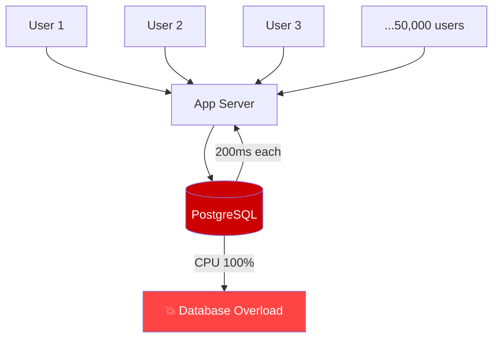
```mermaid
graph TD
    U1[User 1] --> AS[App Server]
    U2[User 2] --> AS
    U3[User 3] --> AS
    U4[...50,000 users] --> AS
    AS --> DB[(PostgreSQL)]
    DB --> |200ms each| AS
    DB --> |CPU 100%| ALERT[💥 Database Overload]

    style ALERT fill:#ff4444,color:#fff
    style DB fill:#cc0000,color:#fff
```

#### Với Cache:

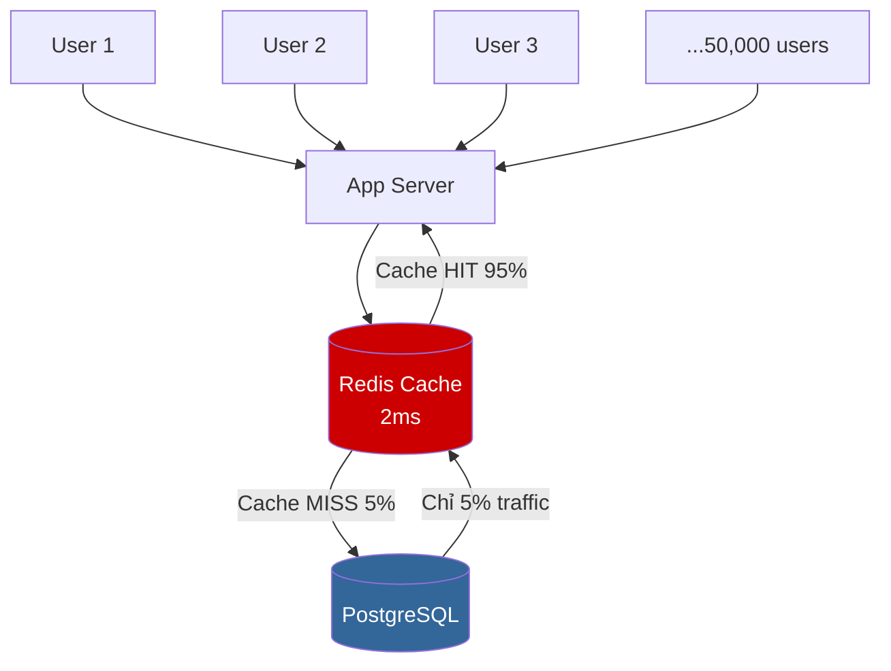
```mermaid
graph TD
    U1[User 1] --> AS[App Server]
    U2[User 2] --> AS
    U3[User 3] --> AS
    U4[...50,000 users] --> AS
    AS --> RC[(Redis Cache\n2ms)]
    RC --> |Cache HIT 95%| AS
    RC --> |Cache MISS 5%| DB[(PostgreSQL)]
    DB --> |Chỉ 5% traffic| RC

    style RC fill:#cc0000,color:#fff
    style DB fill:#336699,color:#fff
```

#### Lợi ích cụ thể:

| Metric         | Không có Cache | Có Cache        |
| -------------- | -------------- | --------------- |
| Response Time  | 200-500ms      | 1-5ms           |
| DB CPU         | 95%            | 15%             |
| Throughput     | 500 req/s      | 50,000 req/s    |
| DB Connections | Maxed out      | ~50 connections |
| Cost           | Cao (scale DB) | Thấp hơn        |

#### Khi nào nên Cache?

Cache phù hợp với dữ liệu có đặc điểm:

- **Read-heavy**: Đọc nhiều hơn ghi (product catalog, user profile)
- **Recomputation cost cao**: Aggregation queries, ML model inference
- **Data ít thay đổi**: Config, category tree
- **Acceptable staleness**: Dữ liệu có thể trễ vài giây đến vài phút

Cache **không phù hợp** với:

- Dữ liệu phải real-time tuyệt đối (số dư tài khoản ngân hàng)
- Dữ liệu unique per-user với write frequency cao
- Dữ liệu quá lớn so với RAM available

### 1.3 Cache Hit / Cache Miss / Cache Ratio

```
Cache Hit Rate = (Cache Hits) / (Cache Hits + Cache Misses) × 100%
```

**Ví dụ ShopX:**

- 1 giờ: 1,000,000 requests trang sản phẩm
- Cache Hit: 950,000
- Cache Miss: 50,000
- **Hit Rate = 95%** ✅

#### Benchmark thực tế (Industry Standard):

| Hit Rate | Đánh giá                    |
| -------- | --------------------------- |
| < 80%    | ❌ Cần xem xét lại strategy |
| 80-90%   | ⚠️ Chấp nhận được           |
| 90-95%   | ✅ Tốt                      |
| > 95%    | 🏆 Excellent                |

> **Netflix** duy trì cache hit rate > 99% cho video metadata thông qua EVCache (Memcached-based distributed cache).  
> **Facebook** (TAO cache) đạt ~99.8% hit rate cho social graph data.

#### Cost of Cache Miss:

```
Mỗi Cache Miss = 1 DB Query
ShopX: 5% miss rate × 50,000 req/s = 2,500 DB queries/s
PostgreSQL tối đa ~5,000 TPS → Còn an toàn nhưng không có room
```

### 1.4 Các tầng Cache trong hệ thống

Hệ thống thực tế có nhiều tầng cache, mỗi tầng có trade-off khác nhau:

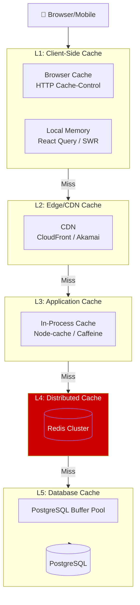
```mermaid
graph TD
    User[👤 Browser/Mobile]

    subgraph L1["L1: Client-Side Cache"]
        BC[Browser Cache\nHTTP Cache-Control]
        LC[Local Memory\nReact Query / SWR]
    end

    subgraph L2["L2: Edge/CDN Cache"]
        CDN[CDN\nCloudFront / Akamai]
    end

    subgraph L3["L3: Application Cache"]
        INPROC[In-Process Cache\nNode-cache / Caffeine]
    end

    subgraph L4["L4: Distributed Cache"]
        REDIS[(Redis Cluster)]
    end

    subgraph L5["L5: Database Cache"]
        PGCACHE[PostgreSQL Buffer Pool]
        DB[(PostgreSQL)]
    end

    User --> L1
    L1 --> |Miss| L2
    L2 --> |Miss| L3
    L3 --> |Miss| L4
    L4 --> |Miss| L5
    L5 --> DB

    style L4 fill:#cc0000,color:#fff
    style REDIS fill:#cc0000,color:#fff
```

#### Chi tiết từng tầng:

| Tầng            | Technology               | Latency | Scope         | ShopX Use Case                   |
| --------------- | ------------------------ | ------- | ------------- | -------------------------------- |
| L1: Browser     | HTTP Cache, localStorage | 0ms     | Per-user      | Static assets, user preferences  |
| L2: CDN         | CloudFront, Akamai       | 1-5ms   | Global        | Product images, static pages     |
| L3: In-Process  | node-cache, Guava        | 0.1ms   | Per-instance  | Config data, hot lookup tables   |
| L4: Distributed | **Redis**                | 1-5ms   | Cross-service | Product catalog, sessions, cart  |
| L5: DB Cache    | PG Buffer Pool           | 5-20ms  | DB internal   | Frequently accessed rows/indexes |

> **Best Practice (Netflix/Amazon pattern):** Luôn thiết kế cache theo hierarchy. Khi L4 (Redis) miss, không hit thẳng vào DB mà thông qua L3 in-process cache để tránh thundering herd.

## 2. Caching Strategies (Chiến thuật Cache)

### 2.1 Cache-Aside (Lazy Loading)

Đây là pattern phổ biến nhất trong thực tế. Application tự quản lý việc đọc/ghi cache.

#### Flow:

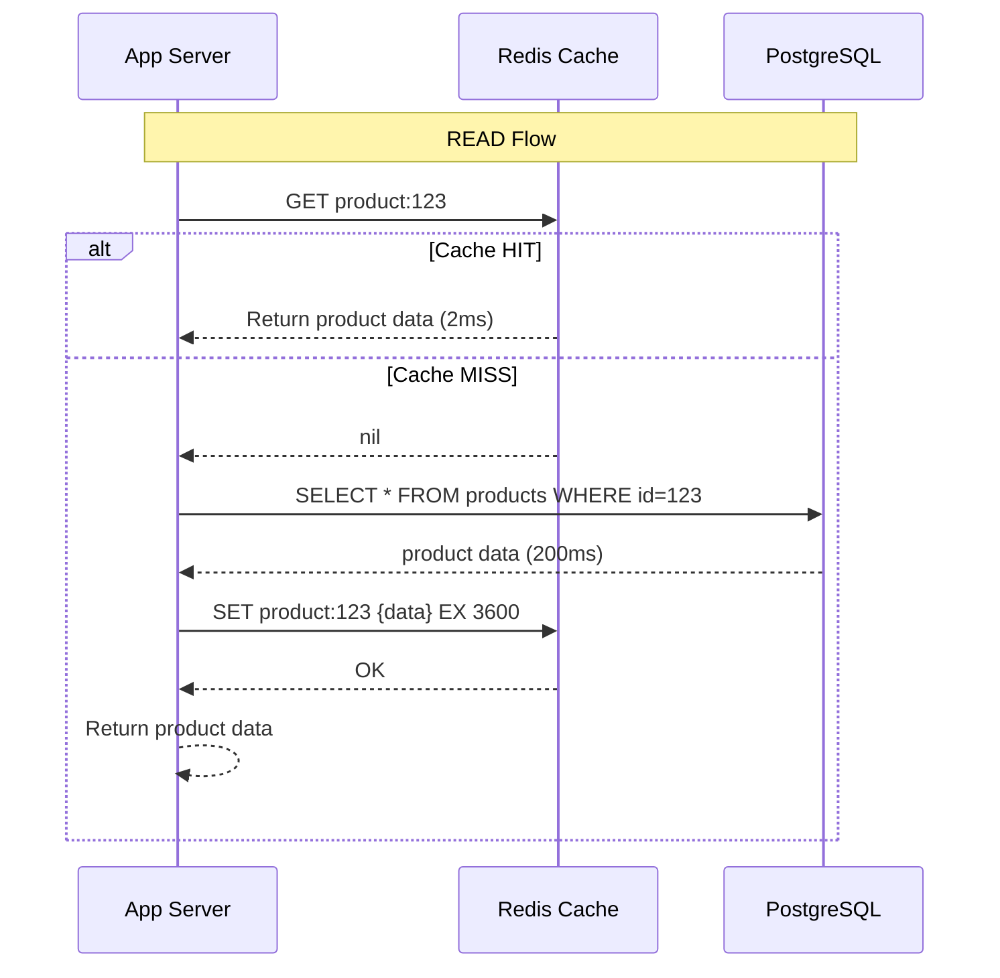
```mermaid
sequenceDiagram
    participant App as App Server
    participant Cache as Redis Cache
    participant DB as PostgreSQL

    Note over App,DB: READ Flow
    App->>Cache: GET product:123
    alt Cache HIT
        Cache-->>App: Return product data (2ms)
    else Cache MISS
        Cache-->>App: nil
        App->>DB: SELECT * FROM products WHERE id=123
        DB-->>App: product data (200ms)
        App->>Cache: SET product:123 {data} EX 3600
        Cache-->>App: OK
        App-->>App: Return product data
    end
```

#### Implementation (Node.js + ShopX):

```javascript
// ProductService.js
class ProductService {
  constructor(redisClient, db) {
    this.redis = redisClient;
    this.db = db;
    this.CACHE_TTL = 3600; // 1 hour
  }

  async getProduct(productId) {
    const cacheKey = `product:${productId}`;

    // 1. Try cache first
    const cached = await this.redis.get(cacheKey);
    if (cached) {
      return JSON.parse(cached); // Cache HIT
    }

    // 2. Cache MISS - query database
    const product = await this.db.query(
      "SELECT * FROM products WHERE id = $1 AND active = true",
      [productId],
    );

    if (!product) return null;

    // 3. Store in cache for next time
    await this.redis.setex(cacheKey, this.CACHE_TTL, JSON.stringify(product));

    return product;
  }

  async updateProduct(productId, data) {
    // Update database first
    await this.db.query("UPDATE products SET ... WHERE id = $1", [productId]);

    // Invalidate cache (not update!) - Cache-Aside pattern
    await this.redis.del(`product:${productId}`);
  }
}
```

#### Ưu & Nhược điểm:

|                   | Cache-Aside                                                  |
| ----------------- | ------------------------------------------------------------ |
| ✅ **Ưu điểm**    | Cache chỉ chứa data được request → Tiết kiệm memory          |
| ✅                | Resilient: App vẫn hoạt động khi Redis down (fallback to DB) |
| ✅                | Flexible: Developer kiểm soát hoàn toàn                      |
| ❌ **Nhược điểm** | First request luôn slow (cold start)                         |
| ❌                | Risk dirty data nếu invalidation sai                         |
| ❌                | Code phức tạp hơn (cần handle cache logic)                   |

**→ Dùng khi:** Read-heavy workload, data có thể chấp nhận brief staleness, cần control tốt. **Đây là default choice cho 80% use case.**

### 2.2 Write-Through

Data được ghi vào cache và database **đồng thời** trong cùng một write operation.

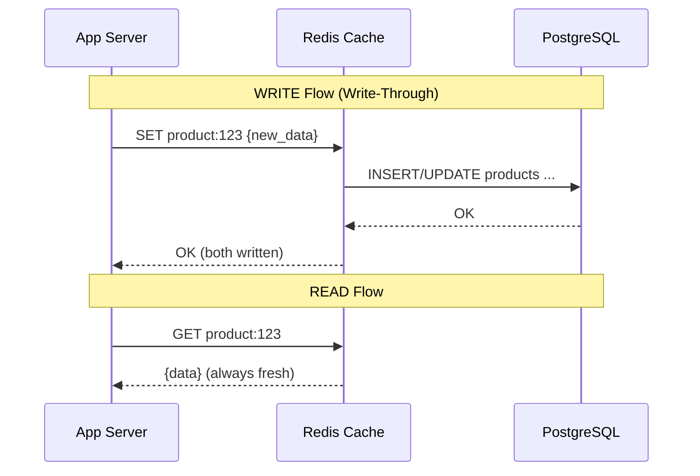
```mermaid
sequenceDiagram
    participant App as App Server
    participant Cache as Redis Cache
    participant DB as PostgreSQL

    Note over App,DB: WRITE Flow (Write-Through)
    App->>Cache: SET product:123 {new_data}
    Cache->>DB: INSERT/UPDATE products ...
    DB-->>Cache: OK
    Cache-->>App: OK (both written)

    Note over App,DB: READ Flow
    App->>Cache: GET product:123
    Cache-->>App: {data} (always fresh)
```

#### Implementation:

```javascript
// Write-Through: Cache layer wraps DB write
async updateProductPrice(productId, newPrice) {
  const cacheKey = `product:${productId}`;

  // Write to DB first
  await this.db.query(
    'UPDATE products SET price = $1 WHERE id = $2',
    [newPrice, productId]
  );

  // Immediately update cache (NOT delete!)
  const updatedProduct = await this.db.query(
    'SELECT * FROM products WHERE id = $1', [productId]
  );
  await this.redis.setex(cacheKey, this.CACHE_TTL, JSON.stringify(updatedProduct));
}
```

#### Ưu & Nhược điểm:

|                   | Write-Through                                     |
| ----------------- | ------------------------------------------------- |
| ✅ **Ưu điểm**    | Cache luôn consistent với DB                      |
| ✅                | Read luôn fast (no cold miss sau khi write)       |
| ❌ **Nhược điểm** | Write latency tăng (phải wait cả DB lẫn Cache)    |
| ❌                | Cache có thể chứa data ít được đọc (waste memory) |
| ❌                | Khó implement đúng trong distributed system       |

**→ Dùng khi:** Data consistency quan trọng, write/read ratio cân bằng. Ví dụ: User profile trong ShopX (cần consistent sau khi update).

### 2.3 Write-Behind (Write-Back)

App ghi vào cache trước, cache async ghi vào database sau. Tốc độ write cực cao nhưng có risk data loss.

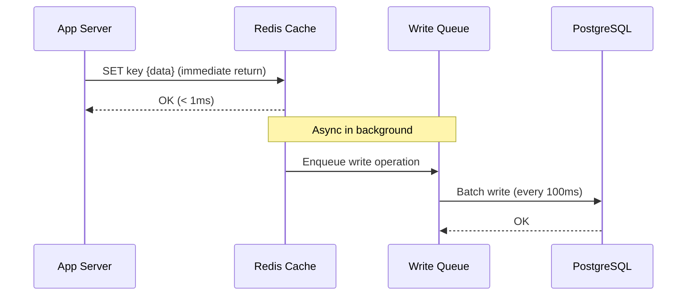
```mermaid
sequenceDiagram
    participant App as App Server
    participant Cache as Redis Cache
    participant Queue as Write Queue
    participant DB as PostgreSQL

    App->>Cache: SET key {data} (immediate return)
    Cache-->>App: OK (< 1ms)

    Note over Cache,Queue: Async in background
    Cache->>Queue: Enqueue write operation
    Queue->>DB: Batch write (every 100ms)
    DB-->>Queue: OK
```

#### Use Case thực tế - ShopX View Counter:

```javascript
// Write-Behind cho product view counts
// Không cần persist mỗi view - batch update mỗi 60 giây

async incrementProductView(productId) {
  // Chỉ update Redis, không touch DB
  await this.redis.incr(`views:${productId}`);
  await this.redis.sadd('dirty:views', productId); // Track what needs flushing
}

// Background job chạy mỗi 60 giây
async flushViewsToDB() {
  const dirtyProducts = await this.redis.smembers('dirty:views');

  for (const productId of dirtyProducts) {
    const views = await this.redis.get(`views:${productId}`);
    await this.db.query(
      'UPDATE products SET view_count = view_count + $1 WHERE id = $2',
      [views, productId]
    );
    await this.redis.set(`views:${productId}`, 0);
  }

  await this.redis.del('dirty:views');
}
```

**→ Dùng khi:** Write-heavy với data loss acceptable (analytics counters, view counts, like counts). **KHÔNG dùng cho financial data.**

### 2.4 Read-Through

Cache tự động load data từ DB khi miss, thay vì để application làm. Application chỉ tương tác với cache.

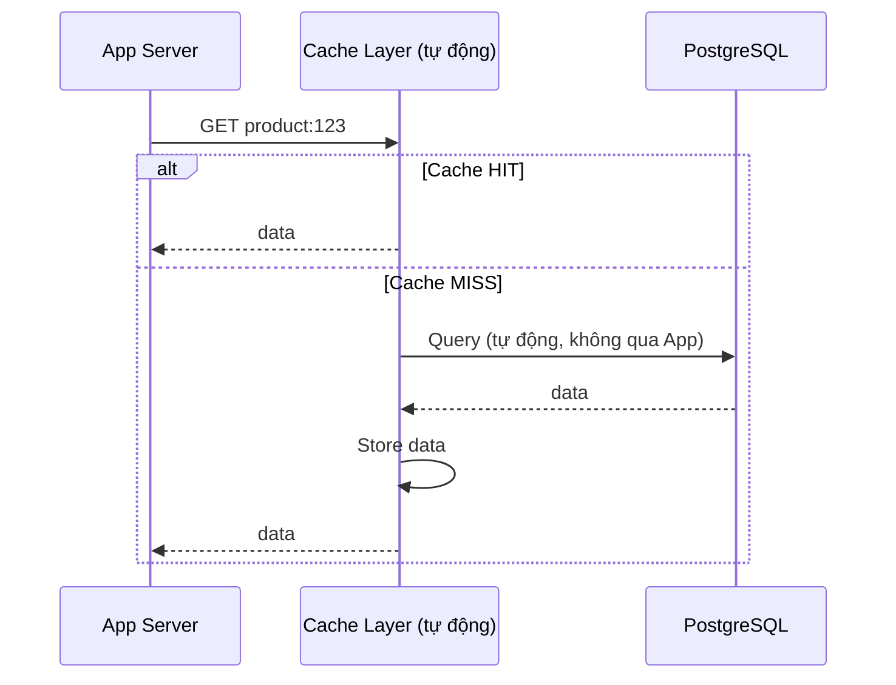
```mermaid
sequenceDiagram
    participant App as App Server
    participant Cache as Cache Layer (tự động)
    participant DB as PostgreSQL

    App->>Cache: GET product:123

    alt Cache HIT
        Cache-->>App: data
    else Cache MISS
        Cache->>DB: Query (tự động, không qua App)
        DB-->>Cache: data
        Cache->>Cache: Store data
        Cache-->>App: data
    end
```

> **Khác với Cache-Aside:** Trong Read-Through, cache tự load từ DB. Trong Cache-Aside, app tự load rồi populate vào cache.

**Thư viện hỗ trợ:** Spring Cache (Java), django-cache-machine (Python).

**→ Dùng khi:** Muốn transparent caching, không muốn cache logic leak vào business logic. Phổ biến trong Java Spring ecosystem.

### 2.5 Refresh-Ahead

Cache tự động refresh data **trước khi** TTL hết hạn, dựa trên prediction.

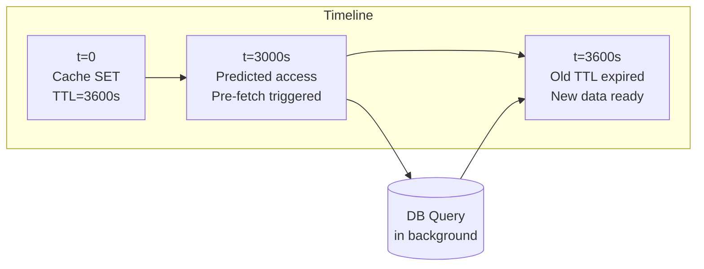
```mermaid
graph LR
    subgraph Timeline
        T0[t=0\nCache SET\nTTL=3600s] --> T1[t=3000s\nPredicted access\nPre-fetch triggered] --> T2[t=3600s\nOld TTL expired\nNew data ready]
    end

    T1 --> DB[(DB Query\nin background)]
    DB --> T2
```

**→ Dùng khi:** Biết trước data nào sẽ được access (product page trước flash sale). Ít phổ biến do complexity cao.

### 2.6 So sánh các chiến thuật

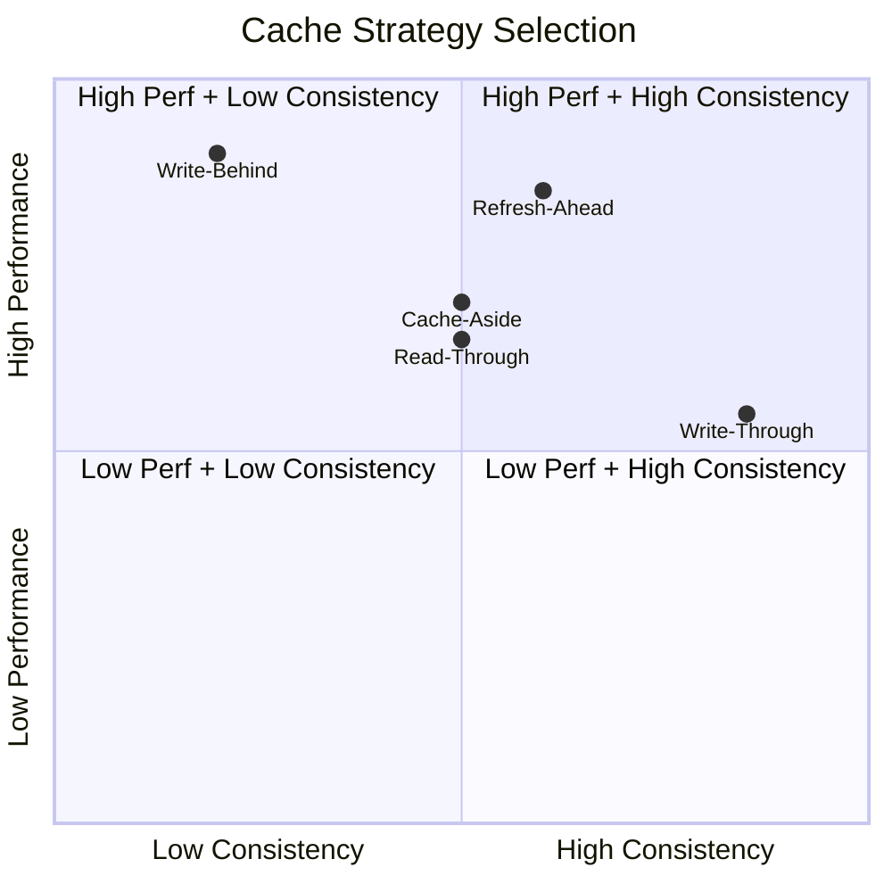
```mermaid
quadrantChart
    title Cache Strategy Selection
    x-axis Low Consistency --> High Consistency
    y-axis Low Performance --> High Performance
    quadrant-1 High Perf + High Consistency
    quadrant-2 High Perf + Low Consistency
    quadrant-3 Low Perf + Low Consistency
    quadrant-4 Low Perf + High Consistency
    Cache-Aside: [0.5, 0.7]
    Write-Through: [0.85, 0.55]
    Write-Behind: [0.2, 0.9]
    Read-Through: [0.5, 0.65]
    Refresh-Ahead: [0.6, 0.85]
```

| Strategy          | Consistency | Performance | Complexity      | Use Case (ShopX)                |
| ----------------- | ----------- | ----------- | --------------- | ------------------------------- |
| **Cache-Aside**   | Medium      | High        | Medium          | Product catalog, search results |
| **Write-Through** | High        | Medium      | High            | User profile, order data        |
| **Write-Behind**  | Low         | Very High   | Very High       | View counts, analytics          |
| **Read-Through**  | Medium      | High        | Low (framework) | General purpose                 |
| **Refresh-Ahead** | High        | Very High   | Very High       | Pre-computed recommendations    |

> **Amazon DynamoDB Accelerator (DAX)** dùng Read-Through + Write-Through.  
> **Netflix EVCache** dùng Cache-Aside với custom invalidation logic.  
> **Twitter** dùng Write-Behind cho tweet engagement counts.

## 3. Cache Invalidation & Expiration

Phil Karlton nói: _"There are only two hard things in Computer Science: cache invalidation and naming things."_

### 3.1 TTL (Time-To-Live)

TTL là thời gian sống của một cache entry. Sau TTL, entry tự động bị xóa.

```
SET product:123 "{...}" EX 3600   # Expire sau 3600 giây
SET session:abc "{...}" PX 1800000 # Expire sau 1800000 ms
```

#### Chọn TTL như thế nào?

| Data Type           | TTL Recommended  | Reasoning                         |
| ------------------- | ---------------- | --------------------------------- |
| Product catalog     | 1-6 giờ          | Ít thay đổi, acceptable staleness |
| Product price       | 5-60 phút        | Thay đổi thường hơn, cần fresher  |
| Search results      | 1-5 phút         | Dynamic, thay đổi theo inventory  |
| User session        | 30 phút - 24 giờ | Security + UX balance             |
| Shopping cart       | 7-30 ngày        | User experience                   |
| Rate limit counters | Match the window | 1 phút window = 60s TTL           |
| Homepage featured   | 10-30 phút       | Business update frequency         |

#### TTL Jitter — Tránh Cache Avalanche:

```javascript
// BAD: Tất cả product cache expire cùng lúc
await redis.setex(`product:${id}`, 3600, data);

// GOOD: Thêm random jitter ±10%
const TTL_BASE = 3600;
const jitter = Math.floor(Math.random() * TTL_BASE * 0.1);
const ttl = TTL_BASE + (Math.random() > 0.5 ? jitter : -jitter);
await redis.setex(`product:${id}`, ttl, data);
```

### 3.2 Event-Driven Invalidation

Thay vì chỉ dựa vào TTL, invalidate cache ngay khi data thay đổi.

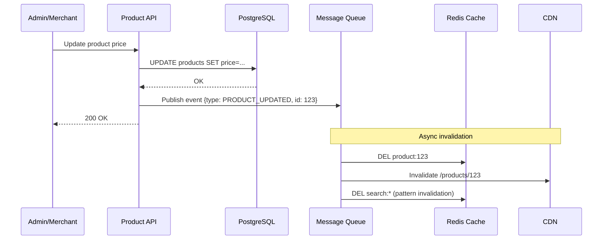
```mermaid
sequenceDiagram
    participant Admin as Admin/Merchant
    participant API as Product API
    participant DB as PostgreSQL
    participant MQ as Message Queue
    participant Cache as Redis Cache
    participant CDN as CDN

    Admin->>API: Update product price
    API->>DB: UPDATE products SET price=...
    DB-->>API: OK
    API->>MQ: Publish event {type: PRODUCT_UPDATED, id: 123}
    API-->>Admin: 200 OK

    Note over MQ,CDN: Async invalidation
    MQ->>Cache: DEL product:123
    MQ->>CDN: Invalidate /products/123
    MQ->>Cache: DEL search:*  (pattern invalidation)
```

#### Implementation với Redis Pub/Sub:

```javascript
// Publisher (Product Service)
async updateProduct(productId, data) {
  await this.db.update(productId, data);

  // Publish invalidation event
  await this.redis.publish('cache:invalidate', JSON.stringify({
    type: 'PRODUCT_UPDATED',
    key: `product:${productId}`,
    relatedKeys: [`category:${data.categoryId}`, 'homepage:featured']
  }));
}

// Subscriber (Cache Manager - chạy trên mỗi instance)
this.redis.subscribe('cache:invalidate', (message) => {
  const event = JSON.parse(message);
  this.handleInvalidation(event);
});

async handleInvalidation({ type, key, relatedKeys }) {
  await this.redis.del(key);

  if (relatedKeys) {
    await this.redis.del(...relatedKeys);
  }

  // Also clear local in-process cache
  this.localCache.del(key);
}
```

### 3.3 Cache Stampede & Thundering Herd

**Vấn đề:** Khi một cache key hết hạn và **nhiều requests đồng thời** cùng hit miss → Tất cả đổ xuống DB cùng lúc.

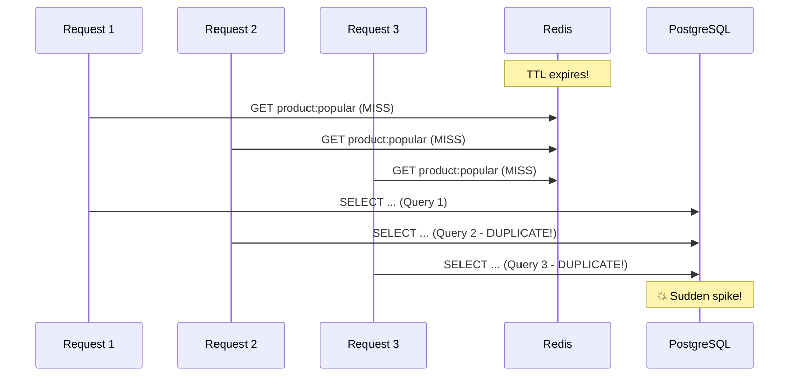
```mermaid
sequenceDiagram
    participant R1 as Request 1
    participant R2 as Request 2
    participant R3 as Request 3
    participant Cache as Redis
    participant DB as PostgreSQL

    Note over Cache: TTL expires!
    R1->>Cache: GET product:popular (MISS)
    R2->>Cache: GET product:popular (MISS)
    R3->>Cache: GET product:popular (MISS)

    R1->>DB: SELECT ... (Query 1)
    R2->>DB: SELECT ... (Query 2 - DUPLICATE!)
    R3->>DB: SELECT ... (Query 3 - DUPLICATE!)

    Note over DB: 💥 Sudden spike!
```

#### Giải pháp 1: Mutex/Lock (Redis SETNX)

```javascript
async getProductWithLock(productId) {
  const cacheKey = `product:${productId}`;
  const lockKey = `lock:${cacheKey}`;

  // Try cache first
  const cached = await this.redis.get(cacheKey);
  if (cached) return JSON.parse(cached);

  // Try to acquire lock
  const lockAcquired = await this.redis.set(lockKey, '1', 'NX', 'EX', 5);

  if (lockAcquired) {
    try {
      // This instance fetches from DB
      const data = await this.db.getProduct(productId);
      await this.redis.setex(cacheKey, 3600, JSON.stringify(data));
      return data;
    } finally {
      await this.redis.del(lockKey);
    }
  } else {
    // Wait and retry (other instance is fetching)
    await sleep(100);
    return this.getProductWithLock(productId); // Retry
  }
}
```

#### Giải pháp 2: Probabilistic Early Expiration (PER)

```javascript
// Tự nguyện refresh trước khi expire, dựa trên xác suất
async getWithEarlyRefresh(key, fetchFn, ttl) {
  const result = await this.redis.get(key);

  if (result) {
    const { data, expireAt } = JSON.parse(result);
    const now = Date.now() / 1000;
    const remainingTTL = expireAt - now;

    // PER algorithm: probability tăng dần khi gần expire
    const probability = Math.exp(-remainingTTL / (ttl * 0.1));

    if (Math.random() < probability) {
      // Proactively refresh in background
      fetchFn().then(newData => {
        this.redis.set(key, JSON.stringify({
          data: newData,
          expireAt: Date.now() / 1000 + ttl
        }), 'EX', ttl);
      });
    }

    return data;
  }

  // Cache miss - normal fetch
  const data = await fetchFn();
  await this.redis.set(key, JSON.stringify({
    data,
    expireAt: Date.now() / 1000 + ttl
  }), 'EX', ttl);

  return data;
}
```

### 3.4 Stale-While-Revalidate

Trả về data cũ (stale) ngay lập tức, đồng thời refresh cache ở background.

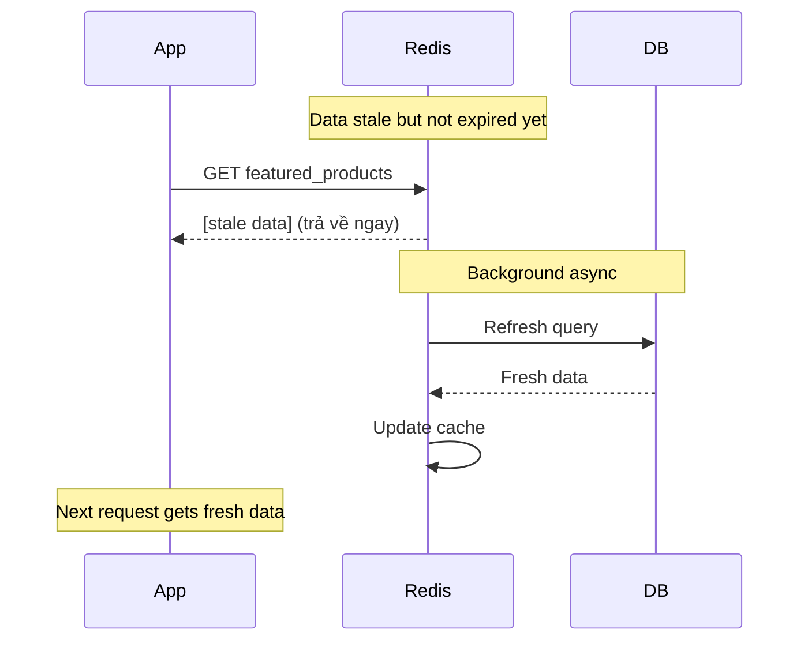
```mermaid
sequenceDiagram
    participant App as App
    participant Cache as Redis
    participant DB as DB

    Note over Cache: Data stale but not expired yet
    App->>Cache: GET featured_products
    Cache-->>App: [stale data] (trả về ngay)

    Note over Cache,DB: Background async
    Cache->>DB: Refresh query
    DB-->>Cache: Fresh data
    Cache->>Cache: Update cache

    Note over App: Next request gets fresh data
```

```javascript
// HTTP Cache-Control header version
res.set('Cache-Control', 'max-age=60, stale-while-revalidate=300');
// → Fresh trong 60s, dùng stale tối đa 300s trong khi refresh

// Application-level SWR
async getFeaturedProducts() {
  const key = 'homepage:featured';
  const FRESH_TTL = 60;     // Fresh for 60s
  const STALE_TTL = 300;    // Serve stale up to 300s

  const cached = await this.redis.get(key);

  if (cached) {
    const { data, cachedAt } = JSON.parse(cached);
    const age = (Date.now() - cachedAt) / 1000;

    if (age < FRESH_TTL) {
      return data; // Fresh, serve immediately
    }

    if (age < STALE_TTL) {
      // Stale but acceptable - serve immediately and refresh
      this.refreshFeaturedProducts(); // Non-blocking background refresh
      return data;
    }
  }

  // Fully expired or not cached
  return this.refreshFeaturedProducts();
}
```

## 4. Cache Eviction Policies

Khi cache đầy memory, Redis cần quyết định xóa key nào. Đây là các eviction policy.

### 4.1 LRU (Least Recently Used)

Xóa key **ít được dùng gần đây nhất** (dùng lâu nhất rồi chưa access lại).

```
Access order: A → B → C → D → A → E
Cache size: 4 items
When E comes in: Evict B (least recently used)
Result: C, D, A, E
```

**Redis config:** `maxmemory-policy allkeys-lru` hoặc `volatile-lru` (chỉ cho key có TTL)

```
# Redis configuration
maxmemory 4gb
maxmemory-policy allkeys-lru
```

### 4.2 LFU (Least Frequently Used)

Xóa key **ít được access nhất** tính theo tần suất.

```
Key A: accessed 100 times (thường xuyên)
Key B: accessed 2 times (hiếm khi)
Key C: accessed 50 times

Khi cần evict → Xóa B (frequency thấp nhất)
```

**Redis config:** `maxmemory-policy allkeys-lfu`

> **Khi nào dùng LFU thay LRU?**  
> LFU tốt hơn với **non-uniform access patterns** — một số keys được access rất nhiều (hot keys) và một số rất ít. LRU có thể evict hot keys nếu gần đây không được access.

### 4.3 FIFO / TTL-based

```
volatile-ttl: Xóa key có TTL ngắn nhất (sắp expire sớm nhất)
allkeys-random: Xóa key ngẫu nhiên
volatile-random: Xóa key có TTL ngẫu nhiên
noeviction: Không xóa - trả lỗi khi đầy (default)
```

### 4.4 So sánh Eviction Policies

| Policy         | Cơ chế                   | Use Case (ShopX)                             |
| -------------- | ------------------------ | -------------------------------------------- |
| `allkeys-lru`  | Xóa key ít dùng gần đây  | **Default choice** cho general cache         |
| `allkeys-lfu`  | Xóa key ít dùng nhất     | Hot product catalog với Zipfian distribution |
| `volatile-lru` | LRU nhưng chỉ key có TTL | Mix cache + persistent data trong 1 Redis    |
| `volatile-ttl` | Xóa key gần expire       | Muốn ưu tiên giữ data long-lived             |
| `noeviction`   | Báo lỗi khi đầy          | Session store (không muốn mất session)       |

> **Best Practice:** Dùng `allkeys-lru` cho pure cache instance. Dùng `noeviction` nếu Redis được dùng như primary store (không thể mất data).

## 5. Cache Problems & Anti-Patterns

### 5.1 Cache Penetration

**Vấn đề:** User request data **không tồn tại** trong cả cache lẫn DB → Mỗi request đều bypass cache, hit thẳng DB.

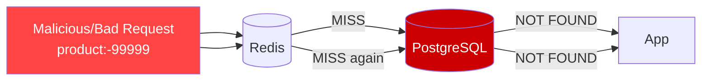
```mermaid
graph LR
    A[Malicious/Bad Request\nproduct:-99999] --> Cache[(Redis)]
    Cache --> |MISS| DB[(PostgreSQL)]
    DB --> |NOT FOUND| App
    A --> Cache
    Cache --> |MISS again| DB
    DB --> |NOT FOUND| App

    style A fill:#ff4444,color:#fff
    style DB fill:#cc0000,color:#fff
```

**Ví dụ ShopX:** Attacker gửi 100,000 req/s với product_id ngẫu nhiên không tồn tại → DB bị DDoS.

#### Giải pháp 1: Cache Null Values

```javascript
async getProduct(productId) {
  const cached = await this.redis.get(`product:${productId}`);

  if (cached !== null) {
    if (cached === 'NULL') return null; // Cache null hit
    return JSON.parse(cached);
  }

  const product = await this.db.getProduct(productId);

  if (!product) {
    // Cache the null result với short TTL
    await this.redis.setex(`product:${productId}`, 60, 'NULL');
    return null;
  }

  await this.redis.setex(`product:${productId}`, 3600, JSON.stringify(product));
  return product;
}
```

#### Giải pháp 2: Bloom Filter (Best Practice cho large scale)

```javascript
const { createClient } = require('@redis/client');
const { BloomFilter } = require('bloomfilter');

// Tạo Bloom Filter với 10M items, 1% false positive rate
const bloomFilter = new BloomFilter(10_000_000, 10);

// Seed khi khởi động (load all valid product IDs)
const validIds = await db.query('SELECT id FROM products');
validIds.forEach(id => bloomFilter.add(id));

async getProduct(productId) {
  // Check Bloom Filter first (O(1), in memory)
  if (!bloomFilter.test(productId)) {
    return null; // Definitely not exist
  }

  // Normal cache-aside flow...
}
```

> **Facebook** dùng Bloom Filter để giảm tải query cho không tồn tại user/content.  
> **Redis Stack** có **RedisBloom** module hỗ trợ native Bloom Filter.

### 5.2 Cache Avalanche

**Vấn đề:** **Nhiều cache keys expire cùng lúc** → Tất cả requests đồng loạt hit DB.

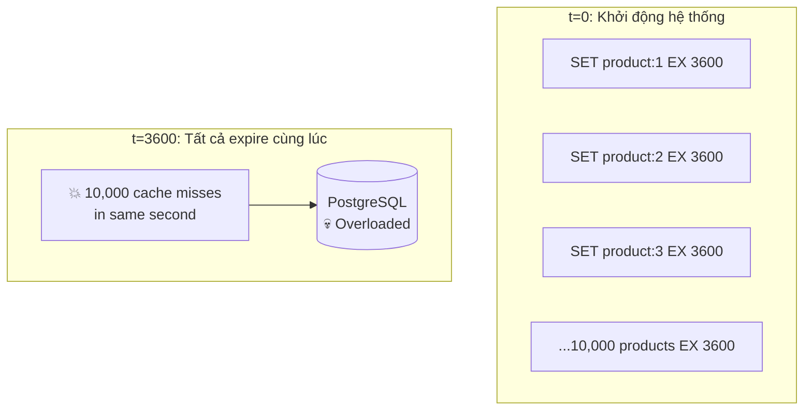
```mermaid
graph TD
    subgraph "t=0: Khởi động hệ thống"
        SET1["SET product:1 EX 3600"]
        SET2["SET product:2 EX 3600"]
        SET3["SET product:3 EX 3600"]
        SET4["...10,000 products EX 3600"]
    end

    subgraph "t=3600: Tất cả expire cùng lúc"
        EXPIRE["💥 10,000 cache misses\nin same second"]
        DB[("PostgreSQL\n💀 Overloaded")]
        EXPIRE --> DB
    end
```

#### Giải pháp — TTL Jitter (đã đề cập) + Cache Warming:

```javascript
// Cache Warming: Pre-populate cache trước khi deploy
async warmCache() {
  console.log('Warming cache...');

  const topProducts = await this.db.query(
    'SELECT * FROM products ORDER BY view_count DESC LIMIT 10000'
  );

  const pipeline = this.redis.pipeline();

  topProducts.forEach((product, idx) => {
    const jitter = Math.floor(Math.random() * 600); // ±10 mins
    const ttl = 3600 + jitter;
    pipeline.setex(`product:${product.id}`, ttl, JSON.stringify(product));
  });

  await pipeline.exec();
  console.log(`Warmed ${topProducts.length} products`);
}

// Circuit Breaker: Khi DB quá tải, return stale data
class CircuitBreaker {
  async getProduct(productId) {
    try {
      // Try cache first (even stale)
      const cached = await this.redis.get(`product:${productId}`);
      if (cached) return JSON.parse(cached);

      // DB call with circuit breaker
      return await this.circuitBreaker.fire(() =>
        this.db.getProduct(productId)
      );
    } catch (err) {
      // Circuit open - serve from backup/stale cache
      return this.getStaleData(productId);
    }
  }
}
```

### 5.3 Cache Breakdown

**Vấn đề:** Một **hot key** (key được access cực nhiều) expire → Tất cả concurrent requests đồng thời miss và query DB. Khác với Avalanche (nhiều key), Breakdown chỉ 1 key nhưng cực hot.

**Ví dụ ShopX:** `flash_sale:active_products` expire trong Flash Sale → 10,000 concurrent requests/giây đổ vào DB.

#### Giải pháp: Logical Expiration (Never actually expire hot keys)

```javascript
async getFlashSaleProducts() {
  const key = 'flash_sale:active_products';
  const cached = await this.redis.get(key);

  if (cached) {
    const { data, logicalExpireAt } = JSON.parse(cached);

    if (Date.now() < logicalExpireAt) {
      return data; // Still fresh
    }

    // Logically expired but key still in Redis
    // Use mutex to prevent breakdown
    const lockKey = `lock:${key}`;
    const locked = await this.redis.set(lockKey, '1', 'NX', 'EX', 5);

    if (!locked) {
      return data; // Return stale data while someone else refreshes
    }

    // We got the lock, refresh data
    try {
      const freshData = await this.db.getActiveFlashSaleProducts();
      await this.redis.set(key, JSON.stringify({
        data: freshData,
        logicalExpireAt: Date.now() + 300_000 // 5 mins logical TTL
      }), 'EX', 86400); // Physical TTL: 1 day (almost never expires)
      return freshData;
    } finally {
      await this.redis.del(lockKey);
    }
  }

  // Cache completely empty - must fetch
  return this.db.getActiveFlashSaleProducts();
}
```

### 5.4 Dirty Cache & Data Inconsistency

**Vấn đề:** Cache và DB out-of-sync do race conditions.

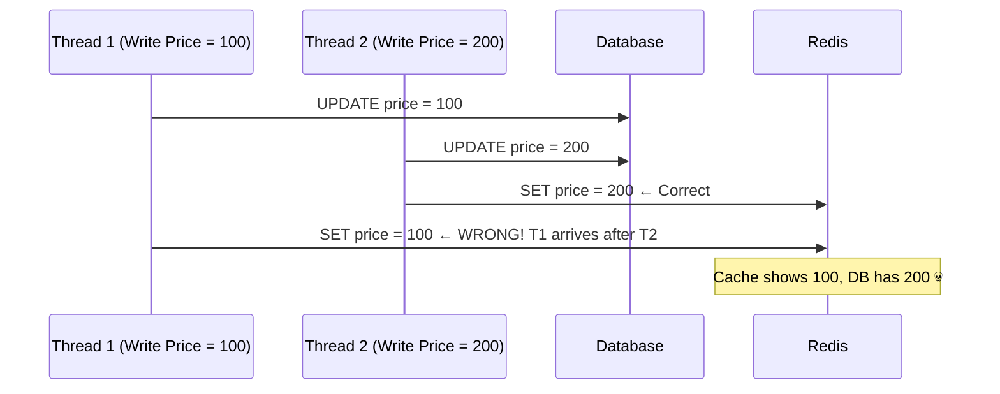
```mermaid
sequenceDiagram
    participant T1 as Thread 1 (Write Price = 100)
    participant T2 as Thread 2 (Write Price = 200)
    participant DB as Database
    participant Cache as Redis

    T1->>DB: UPDATE price = 100
    T2->>DB: UPDATE price = 200
    T2->>Cache: SET price = 200  ← Correct
    T1->>Cache: SET price = 100  ← WRONG! T1 arrives after T2

    Note over Cache: Cache shows 100, DB has 200 💀
```

#### Giải pháp: Delete Cache Instead of Update + Versioning

```javascript
// Pattern: Delete-then-read (Cache-Aside) vs Update
// PREFER: Delete cache on write, lazy-load on next read

async updatePrice(productId, newPrice) {
  // 1. Update DB
  await this.db.query('UPDATE products SET price = $1 WHERE id = $2',
    [newPrice, productId]);

  // 2. DELETE cache (NOT update) - Prevents race conditions
  await this.redis.del(`product:${productId}`);

  // Next read will fetch fresh from DB
}

// Alternative: Version-based cache
async getProductVersioned(productId) {
  const dbVersion = await this.db.query(
    'SELECT version FROM products WHERE id = $1', [productId]
  );

  const cacheKey = `product:${productId}:v${dbVersion.version}`;
  const cached = await this.redis.get(cacheKey);

  if (cached) return JSON.parse(cached);

  const product = await this.db.getProduct(productId);
  await this.redis.setex(cacheKey, 3600, JSON.stringify(product));

  // Cleanup old version
  await this.redis.del(`product:${productId}:v${dbVersion.version - 1}`);

  return product;
}
```

### 5.5 Over-Caching & Under-Caching

#### Over-Caching Anti-patterns:

- Cache dữ liệu thay đổi liên tục (real-time stock price với TTL=1h)
- Cache per-user unique data (mỗi user có cart riêng → OK, nhưng cache recommendation 100% unique thì waste)
- Cache data quá lớn gây memory pressure
- Cache kết quả của operation có side effect

#### Under-Caching Anti-patterns:

- Không cache expensive queries (JOIN nhiều bảng)
- Không cache external API calls (payment gateway, shipping rate)
- Không cache computed/aggregated data

```javascript
// Anti-pattern: Caching personalized real-time data
await redis.set(`stock_price:AAPL`, price, 'EX', 3600); // Too stale for real-time

// Better: Short TTL or no cache
await redis.set(`stock_price:AAPL`, price, 'EX', 5); // 5 seconds max
// Or: Push-based update via WebSocket instead

// Anti-pattern: Not caching expensive external calls
async getShippingRate(from, to, weight) {
  return await shippingAPI.calculate(from, to, weight); // Called every request!
}

// Better: Cache with reasonable TTL
async getShippingRate(from, to, weight) {
  const key = `shipping:${from}:${to}:${weight}`;
  const cached = await redis.get(key);
  if (cached) return parseFloat(cached);

  const rate = await shippingAPI.calculate(from, to, weight);
  await redis.setex(key, 3600, rate.toString()); // Rates don't change hourly
  return rate;
}
```

## 6. Distributed Caching

### 6.1 Local Cache vs Distributed Cache

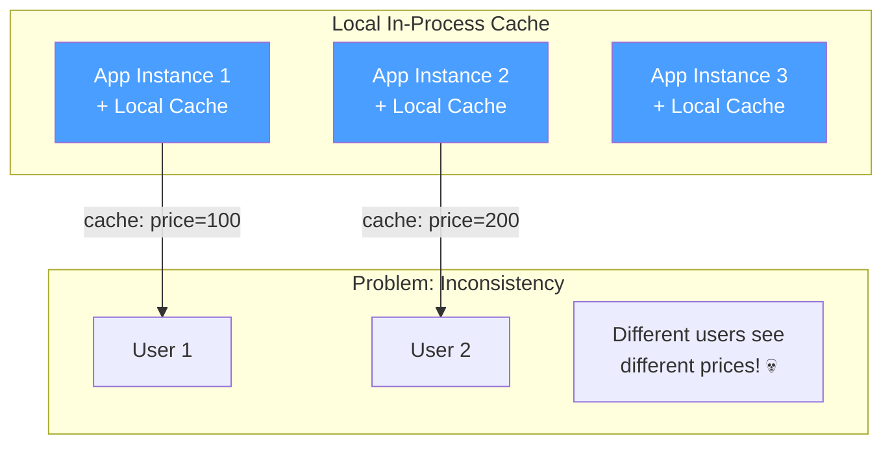
```mermaid
graph TD
    subgraph "Local In-Process Cache"
        A1[App Instance 1\n+ Local Cache]
        A2[App Instance 2\n+ Local Cache]
        A3[App Instance 3\n+ Local Cache]

        style A1 fill:#4a9eff,color:#fff
        style A2 fill:#4a9eff,color:#fff
        style A3 fill:#4a9eff,color:#fff
    end

    subgraph "Problem: Inconsistency"
        A1 --> |cache: price=100| U1[User 1]
        A2 --> |cache: price=200| U2[User 2]
        NOTE["Different users see\ndifferent prices! 💀"]
    end
```

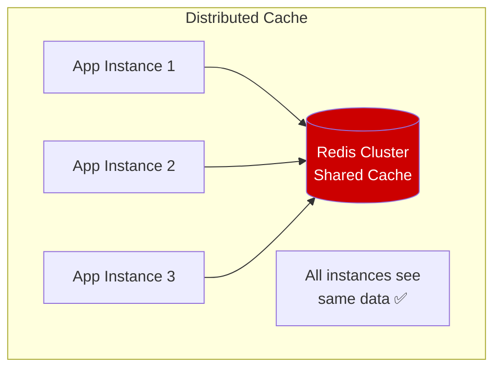
```mermaid
graph TD
    subgraph "Distributed Cache"
        A1[App Instance 1]
        A2[App Instance 2]
        A3[App Instance 3]

        REDIS[(Redis Cluster\nShared Cache)]

        A1 --> REDIS
        A2 --> REDIS
        A3 --> REDIS

        style REDIS fill:#cc0000,color:#fff
        NOTE["All instances see\nsame data ✅"]
    end
```

|                   | Local Cache                 | Distributed Cache          |
| ----------------- | --------------------------- | -------------------------- |
| Latency           | ~0.1ms                      | 1-5ms                      |
| Consistency       | ❌ Per-instance             | ✅ Shared                  |
| Scalability       | Limited by RAM per instance | Scale horizontally         |
| Failure isolation | Instance crash = cache lost | Persistent across restarts |
| Use case          | Config, hot lookup tables   | Sessions, shared state     |

**Best Practice (Two-Level Caching):**

```javascript
async getProduct(productId) {
  // L1: Local in-process cache (node-cache)
  const local = this.localCache.get(`product:${productId}`);
  if (local) return local; // ~0.1ms

  // L2: Redis distributed cache
  const distributed = await this.redis.get(`product:${productId}`);
  if (distributed) {
    const data = JSON.parse(distributed);
    this.localCache.set(`product:${productId}`, data, 60); // Local TTL: 60s
    return data; // ~2ms
  }

  // L3: Database
  const product = await this.db.getProduct(productId); // ~200ms
  await this.redis.setex(`product:${productId}`, 3600, JSON.stringify(product));
  this.localCache.set(`product:${productId}`, product, 60);
  return product;
}
```

### 6.2 Consistent Hashing

Khi có multiple Redis nodes, cần map keys vào đúng node. Consistent Hashing đảm bảo khi thêm/xóa node, chỉ ~1/N keys cần redistribute (thay vì rehash toàn bộ).

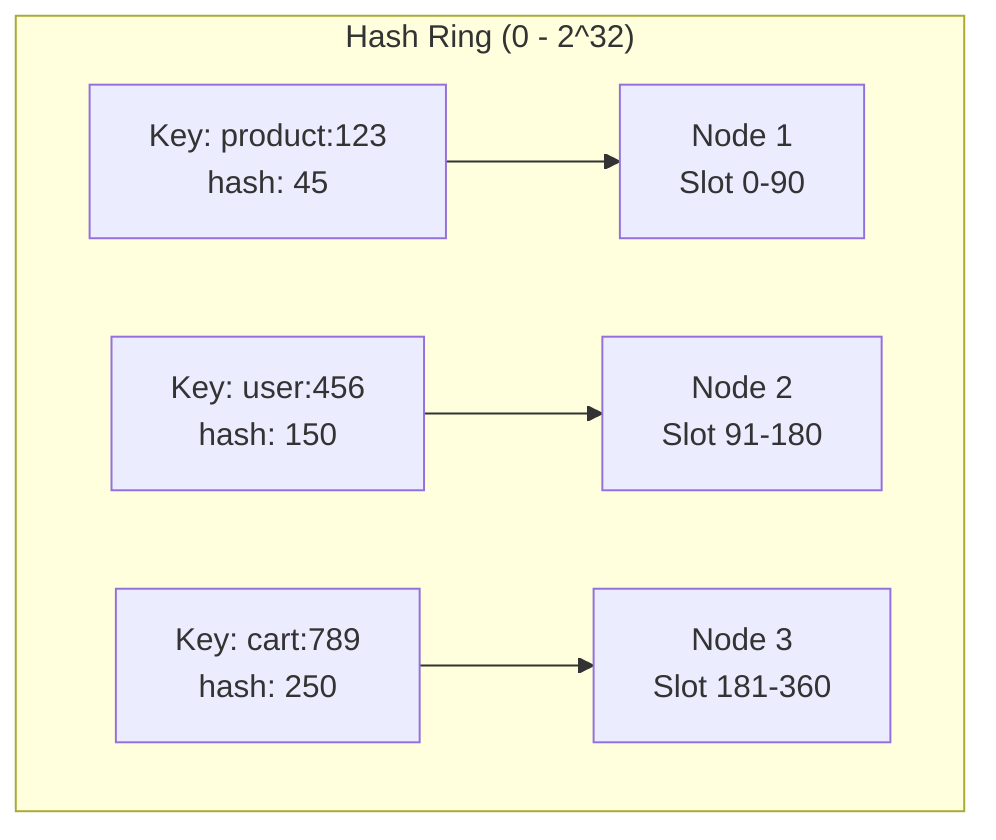
```mermaid
graph TD
    subgraph "Hash Ring (0 - 2^32)"
        K1["Key: product:123\nhash: 45"] --> N1[Node 1\nSlot 0-90]
        K2["Key: user:456\nhash: 150"] --> N2[Node 2\nSlot 91-180]
        K3["Key: cart:789\nhash: 250"] --> N3[Node 3\nSlot 181-360]
    end
```

> **Redis Cluster** dùng **hash slots** (16,384 slots) thay vì consistent hashing thuần. Keys được map vào slots, slots được phân bổ vào nodes.

```
HASH_SLOT = CRC16(key) % 16384
```

### 6.3 Cache Replication

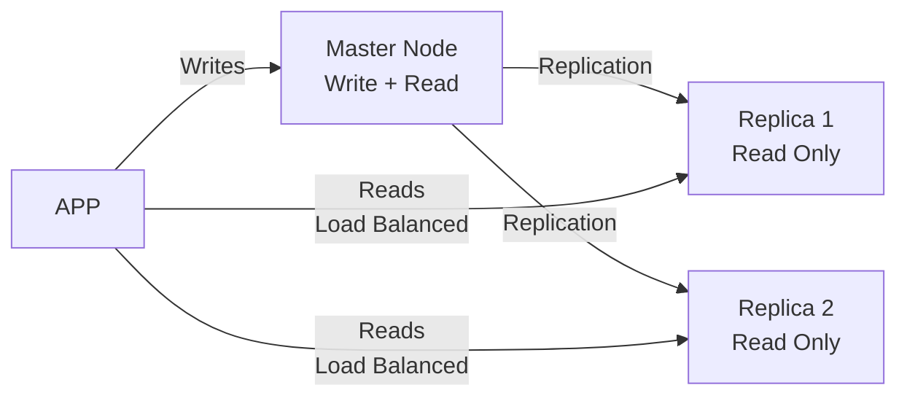
```mermaid
graph LR
    M[Master Node\nWrite + Read] --> |Replication| R1[Replica 1\nRead Only]
    M --> |Replication| R2[Replica 2\nRead Only]

    APP --> |Writes| M
    APP --> |Reads\nLoad Balanced| R1
    APP --> |Reads\nLoad Balanced| R2
```

## 7. Redis: Giới thiệu & Kiến trúc

### 7.1 Redis là gì?

**Redis** (Remote Dictionary Server) là một **in-memory data structure store** open-source, được dùng như:

- 🗄️ **Cache** (use case chính)
- 📨 **Message Broker** (Pub/Sub, Streams)
- 🔒 **Distributed Lock**
- 📊 **Real-time Analytics**
- 🗃️ **Session Store**
- 📋 **Job Queue**

**Thống kê (2024):**

- Được dùng bởi Twitter, GitHub, Snapchat, Craigslist, Digg, StackOverflow, Flickr
- #1 most loved database (Stack Overflow Survey nhiều năm)
- Latency < 1ms cho 99.9% requests
- Throughput: Hàng triệu operations/giây trên single instance

### 7.2 Kiến trúc nội bộ Redis

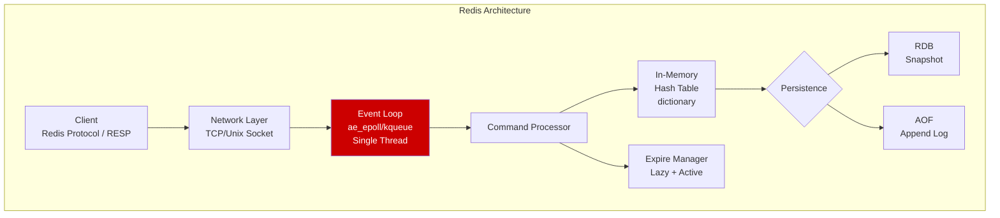
```mermaid
graph TD
    subgraph "Redis Architecture"
        CLIENT[Client\nRedis Protocol / RESP] --> NETWORK[Network Layer\nTCP/Unix Socket]

        NETWORK --> EVENTLOOP[Event Loop\nae_epoll/kqueue\nSingle Thread]

        EVENTLOOP --> COMMANDS[Command Processor]

        COMMANDS --> DICT[In-Memory\nHash Table\ndictionary]
        COMMANDS --> EXPIRE[Expire Manager\nLazy + Active]

        DICT --> PERSISTENCE{Persistence}
        PERSISTENCE --> RDB[RDB\nSnapshot]
        PERSISTENCE --> AOF[AOF\nAppend Log]
    end

    style EVENTLOOP fill:#cc0000,color:#fff
```

#### Key Design Decisions:

**1. Single-threaded Event Loop**
Redis xử lý commands trong **single thread** → Không có race conditions, lock contention. Đây là lý do Redis cực fast và predictable.

```
# Redis 6.0+ có I/O threads để xử lý network, nhưng command execution vẫn single-threaded
```

**2. In-Memory with Persistence Options**
Tất cả data trong RAM → Đọc/ghi cực nhanh. Persistence (RDB/AOF) đảm bảo durability.

**3. RESP Protocol (Redis Serialization Protocol)**

```
Client → Server: *3\r\n$3\r\nSET\r\n$3\r\nkey\r\n$5\r\nvalue\r\n
Server → Client: +OK\r\n
```

**4. Memory Efficiency**
Redis dùng các encoding tối ưu:

- Small integers: shared objects (0-9999 pre-allocated)
- Short strings: embstr (≤44 bytes, single allocation)
- Small hash/list/set: ziplist encoding

### 7.3 Redis vs Memcached vs Valkey

```mermaid
graph LR
    subgraph "Feature Comparison"
        R[Redis]
        M[Memcached]
        V[Valkey]
    end
```

| Feature        | **Redis**          | **Memcached**  | **Valkey**             |
| -------------- | ------------------ | -------------- | ---------------------- |
| Data Types     | Rich (10+ types)   | String only    | Rich (Redis fork)      |
| Persistence    | ✅ RDB + AOF       | ❌ None        | ✅ RDB + AOF           |
| Replication    | ✅ Master-Replica  | ❌             | ✅                     |
| Clustering     | ✅ Redis Cluster   | ✅ Client-side | ✅                     |
| Pub/Sub        | ✅                 | ❌             | ✅                     |
| Scripting      | ✅ Lua             | ❌             | ✅                     |
| Transactions   | ✅ MULTI/EXEC      | ❌             | ✅                     |
| Memory         | Efficient          | Very efficient | Similar to Redis       |
| Multithreading | Partial (I/O)      | ✅ Full        | ✅ Full (improved)     |
| License        | RSALv2/SSPL (2024) | BSD            | BSD (true open source) |
| Max value size | 512MB              | 1MB            | 512MB                  |
| **Latency**    | < 1ms              | < 1ms          | < 1ms                  |

> **Lưu ý:** Redis đổi license sang RSALv2 + SSPL vào 2024 (không còn pure open-source). **Valkey** là fork của Redis 7.2 do AWS, Google, Oracle, Ericsson tạo ra, dưới Linux Foundation, giữ BSD license. Nhiều cloud providers đang chuyển sang Valkey.

#### Khi nào dùng gì?

- **Redis:** Cần rich data types, persistence, pub/sub, scripting. Phù hợp cho hầu hết use cases.
- **Memcached:** Pure caching, cần multithreading tối đa, memory-efficient string cache đơn giản.
- **Valkey:** Muốn Redis-compatible nhưng true open-source, cloud-managed environments (AWS ElastiCache đã migrate).

### 7.4 Khi nào dùng Redis?

**✅ Dùng Redis khi:**

| Use Case              | Reasoning                            |
| --------------------- | ------------------------------------ |
| Application caching   | Core use case, latency giảm 100x     |
| Session storage       | Distributed, TTL support, fast reads |
| Rate limiting         | Atomic INCR/EXPIRE operations        |
| Real-time leaderboard | Sorted Sets, O(log N) insert         |
| Job queue             | List LPUSH/BRPOP, reliable queue     |
| Pub/Sub messaging     | Lightweight event broadcasting       |
| Distributed locking   | SETNX + EXPIRE atomic pattern        |
| Feature flags/config  | Low-latency reads, easy update       |
| Shopping cart         | Hash per user, O(1) field access     |
| Flash sale inventory  | Atomic DECR, no oversell             |

**❌ Không dùng Redis khi:**

| Scenario                              | Lý do                                     |
| ------------------------------------- | ----------------------------------------- |
| Primary database (dữ liệu quan trọng) | In-memory = risk data loss nếu config sai |
| Complex relational queries            | Redis không phải relational DB            |
| Full-text search (dữ liệu lớn)        | Dùng Elasticsearch/OpenSearch             |
| Time-series data lớn                  | Dùng InfluxDB/TimescaleDB                 |
| Analytics với aggregation phức tạp    | Dùng ClickHouse/BigQuery                  |
| Data > RAM size                       | Redis cần fit in RAM                      |

## 8. Redis Data Structures & Use Cases

### 8.1 String

Type đơn giản nhất — binary-safe, tối đa 512MB.

```redis
SET product:name "iPhone 15 Pro"
GET product:name
# → "iPhone 15 Pro"

SETEX session:abc123 1800 '{"userId": 456, "role": "admin"}'
TTL session:abc123
# → 1799

INCR page_view:home
INCRBY product:inventory:123 -1   # Decrement stock
INCRBYFLOAT product:price:123 -50 # Apply discount

SETNX lock:flash_sale 1   # Set if Not eXists (distributed lock)
GETSET old_value new_value # Atomic get-then-set
```

**ShopX Use Cases:**

- Product name, description, price
- Session tokens
- Feature flags: `GET feature:new_checkout` → `"enabled"`
- Rate limit counters

### 8.2 Hash

Map của field-value pairs. Tốt cho objects.

```redis
HSET product:123 name "iPhone 15" price 999 stock 50 category "phones"
HGET product:123 price        # → "999"
HGETALL product:123           # → All fields
HMGET product:123 name price  # → Multiple fields
HINCRBY product:123 stock -1  # Atomic decrement
HLEN product:123              # → 4 (number of fields)
```

**Memory advantage:** Hash với ≤128 fields và values ≤64 bytes dùng ziplist encoding — tiết kiệm ~10x memory so với multiple string keys.

```
# BAD: Separate string keys for each field
SET product:123:name "iPhone 15"    # Each key has overhead
SET product:123:price "999"
SET product:123:stock "50"

# GOOD: One hash per product
HSET product:123 name "iPhone 15" price "999" stock "50"
```

**ShopX Use Cases:**

- Shopping cart: `HSET cart:user123 product:456 2 product:789 1`
- Product object
- User profile

### 8.3 List

Linked list of strings. O(1) push/pop từ đầu/cuối.

```redis
LPUSH order:queue orderId1 orderId2  # Push to left (head)
RPUSH order:queue orderId3           # Push to right (tail)
LPOP order:queue                     # Pop from left
BRPOP order:queue 0                  # Blocking pop (wait for item)
LRANGE order:queue 0 -1             # Get all items
LLEN order:queue                     # Length
LTRIM recent:views 0 99             # Keep only last 100 items
```

**ShopX Use Cases:**

- Order processing queue: `LPUSH order:processing orderId`
- Recent viewed products: `LPUSH user:123:recent_views productId`, `LTRIM` to 20
- Activity feed: `LPUSH user:123:feed event_json`
- Message queue cho microservices

### 8.4 Set & Sorted Set

**Set:** Unordered collection of unique strings.

```redis
SADD product:123:tags "electronics" "apple" "smartphone"
SMEMBERS product:123:tags       # Get all tags
SISMEMBER product:123:tags "apple"  # → 1 (true)
SCARD product:123:tags          # → 3 (cardinality)
SINTERSTORE result set1 set2    # Intersection → result key
SUNIONSTORE result set1 set2    # Union

# Unique visitors
SADD daily:visitors:2024-01-15 user:123 user:456
SCARD daily:visitors:2024-01-15  # Unique count
```

**Sorted Set (ZSet):** Set với score, sorted by score.

```redis
ZADD leaderboard 1500 "user:alice"
ZADD leaderboard 2300 "user:bob"
ZADD leaderboard 800  "user:charlie"

ZRANGE leaderboard 0 -1 WITHSCORES  # All, ascending
ZREVRANGE leaderboard 0 9 WITHSCORES # Top 10, descending
ZRANK leaderboard "user:alice"       # → 1 (0-indexed rank)
ZINCRBY leaderboard 100 "user:alice" # Add 100 to alice's score

# ShopX: Flash sale priority queue
ZADD flash_queue 1704067200 "order:111" # score = timestamp
ZPOPMIN flash_queue  # Process earliest order
```

**ShopX Use Cases (Sorted Set):**

- Top selling products: score = sales count
- Leaderboard: score = points/revenue
- Time-ordered events: score = timestamp
- Rate limiting with sliding window: score = timestamp, members = request IDs

### 8.5 Bitmap & HyperLogLog

**Bitmap:** Bit array. Memory-efficient for boolean flags per ID.

```redis
# Track user login per day
SETBIT user_login:2024-01-15 user_id 1   # User 456 logged in
GETBIT user_login:2024-01-15 456          # → 1
BITCOUNT user_login:2024-01-15            # Total users logged in today

# ShopX: Track which users have seen a flash sale banner
SETBIT banner:flash_sale:seen userId 1
BITCOUNT banner:flash_sale:seen           # How many users have seen it
```

Memory: 1 bit per user → 10 million users = 1.25MB only!

**HyperLogLog:** Probabilistic cardinality estimation with ~0.81% error.

```redis
PFADD unique_visitors:2024-01-15 user:123 user:456 user:789
PFADD unique_visitors:2024-01-15 user:123   # Duplicate, ignored
PFCOUNT unique_visitors:2024-01-15          # → ~3 (estimates unique count)

# Multiple dates
PFMERGE total_visitors unique_visitors:2024-01-15 unique_visitors:2024-01-16
PFCOUNT total_visitors
```

Memory: Fixed ~12KB regardless of cardinality (vs millions of strings in a Set).

### 8.6 Stream

Append-only log. Perfect cho event sourcing, message queue với consumer groups.

```redis
# Add events to stream
XADD orders * userId 123 productId 456 quantity 2 total 1998

# Consumer Groups (reliable message processing)
XGROUP CREATE orders order-processor $ MKSTREAM
XREADGROUP GROUP order-processor worker1 COUNT 10 STREAMS orders >
XACK orders order-processor messageId  # Acknowledge processed
```

**ShopX Use Case:** Order event stream

```javascript
// Producer: Order Service
await redis.xAdd("orders:events", "*", {
  type: "ORDER_PLACED",
  orderId: order.id,
  userId: order.userId,
  total: order.total,
});

// Consumer: Inventory Service
const messages = await redis.xReadGroup(
  "GROUP",
  "inventory-service",
  "worker-1",
  "COUNT",
  "10",
  "STREAMS",
  "orders:events",
  ">",
);

for (const [id, fields] of messages) {
  await processInventoryUpdate(fields);
  await redis.xAck("orders:events", "inventory-service", id);
}
```

### 8.7 Geospatial

Lưu coordinates và query theo khoảng cách/bán kính.

```redis
GEOADD stores 106.6297 10.8231 "shopx-district1"
GEOADD stores 106.7008 10.7801 "shopx-district7"

GEODIST stores shopx-district1 shopx-district7 km  # → ~8.5

# Find stores within 5km of user location
GEOSEARCH stores FROMLONLAT 106.6700 10.7900 BYRADIUS 5 km ASC WITHCOORD
```

**ShopX Use Case:** "Nearest pickup point", delivery zone calculation, store locator.

## 9. Redis Persistence & Durability

### 9.1 RDB Snapshots

Tạo snapshot của toàn bộ dataset tại một thời điểm, lưu vào file `.rdb`.

```
# redis.conf
save 900 1      # Save if ≥1 key changed in 900s (15 min)
save 300 10     # Save if ≥10 keys changed in 300s (5 min)
save 60 10000   # Save if ≥10000 keys changed in 60s

rdbcompression yes
dbfilename dump.rdb
dir /var/lib/redis
```

**Cơ chế:** Redis fork() child process → Child ghi snapshot → không block main thread.

|     | RDB                                      |
| --- | ---------------------------------------- |
| ✅  | File nhỏ, compact                        |
| ✅  | Fast restart (single file load)          |
| ✅  | Minimal performance impact               |
| ❌  | Potential data loss (minutes of data)    |
| ❌  | Fork() expensive với very large datasets |

### 9.2 AOF (Append Only File)

Log mọi write operation. Replay để recover data.

```
# redis.conf
appendonly yes
appendfsync everysec    # Sync every second (recommended)
# appendfsync always    # Sync every write (safest, slowest)
# appendfsync no        # Let OS decide (fastest, risky)

auto-aof-rewrite-percentage 100  # Rewrite when double size
auto-aof-rewrite-min-size 64mb
```

**AOF Rewrite:** Khi file quá lớn, Redis compacts nó (chỉ giữ final state).

|     | AOF                                             |
| --- | ----------------------------------------------- |
| ✅  | Minimal data loss (max 1 second với everysec)   |
| ✅  | Human-readable log                              |
| ✅  | Safe against write truncation (redis-check-aof) |
| ❌  | File lớn hơn RDB                                |
| ❌  | Restart chậm hơn (replay log)                   |

### 9.3 RDB + AOF Hybrid

Redis 4.0+ hỗ trợ hybrid mode: RDB snapshot embedded in AOF file.

```
# redis.conf
aof-use-rdb-preamble yes
```

**Behavior:** AOF file bắt đầu bằng RDB snapshot, sau đó append AOF entries. Restart nhanh (load RDB) + minimal data loss (AOF).

### 9.4 No Persistence Mode

Cho pure cache (nếu Redis restart, mất hết data — acceptable với cache).

```
# redis.conf
save ""             # Disable RDB
appendonly no       # Disable AOF
```

**ShopX Decision:**

```
Redis Instance 1 (Cache):  No persistence - Pure cache, loss acceptable
Redis Instance 2 (Session): AOF everysec - Can't lose sessions
Redis Instance 3 (Queue):  RDB + AOF Hybrid - Reliable queue
```

## 10. Redis High Availability

### 10.1 Redis Sentinel

Sentinel cung cấp HA (High Availability) với **automatic failover**.

```mermaid
graph TD
    subgraph "Normal Operation"
        S1[Sentinel 1]
        S2[Sentinel 2]
        S3[Sentinel 3]

        M[Master\n:6379]
        R1[Replica 1\n:6380]
        R2[Replica 2\n:6381]

        S1 --> M
        S2 --> M
        S3 --> M
        M --> |Replication| R1
        M --> |Replication| R2
    end
```

```mermaid
graph TD
    subgraph "Failover"
        S1F[Sentinel 1\n🚨 Master down!]
        S2F[Sentinel 2\n🚨 Agree!]
        S3F[Sentinel 3\n🚨 Agree! Vote→ Promote R1]

        R1F[Replica 1\n→ New Master ✅]
        R2F[Replica 2\n→ Replica of R1]

        S3F --> |Promote| R1F
        R1F --> |New Replication| R2F
    end
```

**Sentinel Config:**

```
# sentinel.conf
sentinel monitor mymaster 127.0.0.1 6379 2  # Quorum: 2/3 sentinels must agree
sentinel down-after-milliseconds mymaster 5000
sentinel failover-timeout mymaster 10000
```

**Node.js connection (ioredis):**

```javascript
const redis = new Redis({
  sentinels: [
    { host: "sentinel-1", port: 26379 },
    { host: "sentinel-2", port: 26379 },
    { host: "sentinel-3", port: 26379 },
  ],
  name: "mymaster", // Sentinel master name
});
```

### 10.2 Redis Cluster

Scale horizontally bằng cách sharding data qua multiple master nodes.

```mermaid
graph TD
    subgraph "Redis Cluster (6 nodes)"
        M1[Master 1\nSlots 0-5460]
        M2[Master 2\nSlots 5461-10922]
        M3[Master 3\nSlots 10923-16383]

        R1[Replica 1\nSlots 0-5460]
        R2[Replica 2\nSlots 5461-10922]
        R3[Replica 3\nSlots 10923-16383]

        M1 --> R1
        M2 --> R2
        M3 --> R3
    end

    Client --> |HASH SLOT of key| M1
    Client --> |HASH SLOT of key| M2
    Client --> |HASH SLOT of key| M3
```

**Hash Tags — Ensure related keys go to same slot:**

```redis
# Without hash tag: Different slots, cross-slot operations fail
SET product:123 ...    → Slot X
SET inventory:123 ...  → Slot Y

# With hash tag {}: Same slot
SET {product:123}:detail ...    → Slot Z
SET {product:123}:inventory ... → Slot Z (same!)

# MGET now works (same slot)
MGET {product:123}:detail {product:123}:inventory
```

**ShopX Cluster Config:**

```javascript
const cluster = new Redis.Cluster(
  [
    { host: "redis-node-1", port: 6379 },
    { host: "redis-node-2", port: 6379 },
    { host: "redis-node-3", port: 6379 },
  ],
  {
    scaleReads: "slave", // Read from replicas
    maxRedirections: 16, // MOVED redirections
    retryDelayOnFailover: 1000,
  },
);
```

### 10.3 Master-Replica Replication

```
# Master config
bind 0.0.0.0
requirepass your-master-password

# Replica config
replicaof master-host 6379
masterauth your-master-password
replica-read-only yes
```

## 11. Redis Advanced Features

### 11.1 Lua Scripting & Transactions

#### MULTI/EXEC Transactions:

```redis
MULTI
SET product:123:stock 50
DECRBY product:123:stock 3
PUBLISH inventory:update product:123
EXEC
```

> **Lưu ý:** Redis MULTI/EXEC không roll back nếu một command lỗi logic (chỉ lỗi syntax mới bị discard). Không phải ACID transaction như PostgreSQL.

#### Lua Scripts — Atomic complex operations:

```javascript
// Atomic: Check stock và decrement (Flash Sale critical path)
const DECREMENT_IF_POSITIVE = `
  local current = redis.call('GET', KEYS[1])
  if current == false then
    return -1
  end
  current = tonumber(current)
  if current <= 0 then
    return 0
  end
  return redis.call('DECRBY', KEYS[1], ARGV[1])
`;

// Execute atomically
const result = await redis.eval(
  DECREMENT_IF_POSITIVE,
  1, // Number of keys
  `stock:${productId}`, // KEYS[1]
  quantity, // ARGV[1]
);

if (result <= 0) {
  throw new Error("Out of stock");
}
```

**Ưu điểm Lua:** Atomic (single thread), giảm round trips, có thể lưu với SCRIPT LOAD.

### 11.2 Pub/Sub & Redis Streams

#### Pub/Sub (Simple broadcast):

```javascript
// Publisher
const pub = new Redis();
await pub.publish(
  "order:events",
  JSON.stringify({
    type: "ORDER_PLACED",
    orderId: "12345",
  }),
);

// Subscriber
const sub = new Redis();
await sub.subscribe("order:events");
sub.on("message", (channel, message) => {
  const event = JSON.parse(message);
  console.log(`Event: ${event.type}`);
});
```

> **Pub/Sub Limitation:** Fire-and-forget. If subscriber is offline, messages lost. No persistence. → Dùng **Streams** cho reliable messaging.

#### Redis Streams (Kafka-lite):

```javascript
// Producer
await redis.xAdd("orders:stream", "*", {
  orderId: "12345",
  status: "PLACED",
  timestamp: Date.now(),
});

// Consumer với Consumer Group (reliable)
await redis.xGroupCreate("orders:stream", "notifications-service", "0", true);

// Process messages
const messages = await redis.xReadGroup(
  "GROUP",
  "notifications-service",
  "worker-1",
  "COUNT",
  "10",
  "BLOCK",
  "5000",
  "STREAMS",
  "orders:stream",
  ">",
);

// Handle pending messages (unacknowledged after crash)
const pending = await redis.xPendingRange(
  "orders:stream",
  "notifications-service",
  "-",
  "+",
  100,
);
```

### 11.3 Redis Modules

**RedisJSON:** Store và query JSON natively

```redis
JSON.SET product:123 $ '{"name": "iPhone 15", "price": 999, "specs": {"ram": "8GB"}}'
JSON.GET product:123 $.specs.ram     # → ["8GB"]
JSON.NUMINCRBY product:123 $.price -50  # → 949
JSON.ARRAPPEND product:123 $.tags '"sale"'
```

**RediSearch:** Full-text search + secondary indexing

```redis
FT.CREATE idx:products ON JSON SCHEMA
  $.name AS name TEXT WEIGHT 5
  $.price AS price NUMERIC SORTABLE
  $.category AS category TAG

FT.SEARCH idx:products "iphone" FILTER price 500 1500 SORTBY price ASC LIMIT 0 20
```

**RedisBloom:** Probabilistic data structures

```redis
BF.RESERVE product:bloom 0.001 1000000  # 0.1% false positive, 1M items
BF.ADD product:bloom productId:12345
BF.EXISTS product:bloom productId:99999  # → 0 (definitely not exist)

# Count-Min Sketch (frequency estimation)
CMS.INITBYDIM product:frequency 1000 5
CMS.INCRBY product:frequency productId:123 1
CMS.QUERY product:frequency productId:123   # → ~frequency
```

### 11.4 Pipeline & Batching

Gửi nhiều commands trong một network round-trip.

```javascript
// WITHOUT pipeline: 5 round-trips
await redis.set("k1", "v1");
await redis.set("k2", "v2");
await redis.get("k1");
await redis.get("k2");
await redis.del("k1");

// WITH pipeline: 1 round-trip
const pipeline = redis.pipeline();
pipeline.set("k1", "v1");
pipeline.set("k2", "v2");
pipeline.get("k1");
pipeline.get("k2");
pipeline.del("k1");
const results = await pipeline.exec();
```

**ShopX Cart loading:**

```javascript
async getCart(userId) {
  const pipeline = redis.pipeline();

  // Get cart items
  pipeline.hgetall(`cart:${userId}`);

  // Get item details in parallel
  const cartItems = await redis.hgetall(`cart:${userId}`);

  for (const productId of Object.keys(cartItems)) {
    pipeline.get(`product:${productId}`);
  }

  const results = await pipeline.exec();
  // Process results...
}
```

### 11.5 Distributed Lock (Redlock)

**Redlock algorithm** — Distributed lock across multiple Redis instances.

```javascript
const Redlock = require("redlock");

const redlock = new Redlock([redis1, redis2, redis3], {
  driftFactor: 0.01, // Clock drift compensation
  retryCount: 3,
  retryDelay: 200,
  retryJitter: 200,
});

// Acquire lock for Flash Sale inventory decrement
async function purchaseItem(productId, userId, quantity) {
  const lock = await redlock.acquire(
    [`lock:inventory:${productId}`],
    10000, // 10 second TTL
  );

  try {
    const stock = await redis.get(`stock:${productId}`);

    if (parseInt(stock) < quantity) {
      throw new Error("Insufficient stock");
    }

    await redis.decrby(`stock:${productId}`, quantity);
    await createOrder(userId, productId, quantity);
  } finally {
    await lock.release();
  }
}
```

> **Redlock** yêu cầu quorum (N/2 + 1) trong multiple Redis instances → dùng 5 nodes là best practice.
>
> **Lưu ý:** Martin Kleppmann và Redis creator Antirez đã có tranh luận về Redlock correctness. Trong hệ thống yêu cầu strict safety, cân nhắc dùng ZooKeeper hoặc etcd.

## 12. Case Study: E-Commerce Platform (ShopX)

### 12.1 Kiến trúc tổng thể

```mermaid
graph TB
    subgraph "Client Layer"
        WEB[Web Browser]
        MOBILE[Mobile App]
    end

    subgraph "Edge Layer"
        CDN[CloudFront CDN\nStatic Assets + Edge Cache]
        LB[Load Balancer\nNginx]
    end

    subgraph "API Gateway"
        GW[API Gateway\nRate Limiting\nAuth]
    end

    subgraph "Microservices"
        PS[Product Service]
        US[User Service]
        CS[Cart Service]
        OS[Order Service]
        NFS[Notification Service]
        INV[Inventory Service]
    end

    subgraph "Cache Layer (Redis)"
        RC1[(Redis Cluster\nProduct Cache\nSession)]
        RC2[(Redis Sentinel\nCart + Session\nRate Limits)]
        RC3[(Redis Stream\nEvent Queue)]
    end

    subgraph "Database Layer"
        PG1[(PostgreSQL\nProducts + Orders)]
        PG2[(PostgreSQL\nUsers)]
        ES[(Elasticsearch\nSearch)]
    end

    WEB --> CDN
    MOBILE --> CDN
    CDN --> LB
    LB --> GW
    GW --> PS
    GW --> US
    GW --> CS
    GW --> OS

    PS --> RC1
    US --> RC2
    CS --> RC2
    OS --> RC3
    GW --> RC2

    PS --> PG1
    US --> PG2
    CS --> PG2
    OS --> PG1
    OS --> RC3
    RC3 --> NFS
    RC3 --> INV

    style RC1 fill:#cc0000,color:#fff
    style RC2 fill:#cc0000,color:#fff
    style RC3 fill:#cc0000,color:#fff
```

### 12.2 Product Catalog Caching

**Challenge:** 10 triệu products, 50,000 req/s, database không thể handle.

```mermaid
sequenceDiagram
    participant User
    participant PS as Product Service
    participant L3 as In-Process Cache\n(node-cache 60s)
    participant L4 as Redis Cluster\n(1 hour TTL)
    participant DB as PostgreSQL

    User->>PS: GET /products/123
    PS->>L3: Check local cache

    alt L3 Hit (~0.1ms)
        L3-->>PS: Product data
        PS-->>User: 200 OK
    else L3 Miss
        PS->>L4: GET product:123
        alt L4 Hit (~2ms)
            L4-->>PS: Product data
            PS->>L3: Store locally
            PS-->>User: 200 OK
        else L4 Miss
            PS->>DB: SELECT * FROM products WHERE id=123
            DB-->>PS: Product data (~200ms)
            PS->>L4: SET product:123 EX 3600+jitter
            PS->>L3: Store locally
            PS-->>User: 200 OK
        end
    end
```

```javascript
class ProductCacheService {
  constructor(redis, db, localCache) {
    this.redis = redis;
    this.db = db;
    this.local = localCache; // node-cache
    this.REDIS_TTL = 3600;
    this.LOCAL_TTL = 60;
  }

  async getProduct(productId) {
    const cacheKey = `product:${productId}`;

    // L3: In-process (0.1ms)
    const local = this.local.get(cacheKey);
    if (local) return local;

    // L4: Redis (2ms)
    const redisData = await this.redis.get(cacheKey);
    if (redisData) {
      const product = JSON.parse(redisData);
      this.local.set(cacheKey, product, this.LOCAL_TTL);
      return product;
    }

    // Database (200ms)
    const product = await this.db.getProduct(productId);
    if (!product) {
      // Cache null to prevent penetration
      await this.redis.setex(cacheKey, 60, "NULL");
      return null;
    }

    const jitter = Math.floor(Math.random() * 600);
    await this.redis.setex(
      cacheKey,
      this.REDIS_TTL + jitter,
      JSON.stringify(product),
    );
    this.local.set(cacheKey, product, this.LOCAL_TTL);

    return product;
  }

  async invalidateProduct(productId) {
    const cacheKey = `product:${productId}`;
    await this.redis.del(cacheKey);
    this.local.del(cacheKey);

    // Also invalidate related category/search caches
    await this.redis.del(`category:${product.categoryId}:products`);
  }
}
```

### 12.3 Shopping Cart với Redis Hash

**Design Decision:** Redis Hash per user — mỗi field là productId, value là quantity.

```
KEY: cart:{userId}
TYPE: Hash
FIELD: product:{productId}
VALUE: {"quantity": 2, "price": 999, "addedAt": 1704067200}
TTL: 30 days (rolling - refresh on access)
```

```javascript
class CartService {
  async addToCart(userId, productId, quantity) {
    const cartKey = `cart:${userId}`;
    const field = `product:${productId}`;

    // Get current cart item
    const existing = await this.redis.hget(cartKey, field);
    const currentQty = existing ? JSON.parse(existing).quantity : 0;

    await this.redis.hset(
      cartKey,
      field,
      JSON.stringify({
        quantity: currentQty + quantity,
        price: await this.getPrice(productId), // Cache price at add time
        addedAt: Date.now(),
      }),
    );

    // Rolling TTL: 30 days from last activity
    await this.redis.expire(cartKey, 30 * 24 * 3600);

    // Emit event for analytics
    await this.redis.xAdd("cart:events", "*", {
      userId,
      productId,
      quantity: quantity.toString(),
      action: "ADD",
    });
  }

  async getCart(userId) {
    const cartKey = `cart:${userId}`;
    const items = await this.redis.hgetall(cartKey);

    if (!items || Object.keys(items).length === 0) return { items: [] };

    // Batch fetch product details (pipeline)
    const pipeline = this.redis.pipeline();
    const productIds = Object.keys(items).map((k) => k.replace("product:", ""));

    productIds.forEach((id) => pipeline.get(`product:${id}`));
    const productResults = await pipeline.exec();

    return {
      items: productIds.map((id, idx) => ({
        product: JSON.parse(productResults[idx][1] || "null"),
        ...JSON.parse(items[`product:${id}`]),
      })),
      itemCount: productIds.length,
    };
  }

  async removeFromCart(userId, productId) {
    await this.redis.hdel(`cart:${userId}`, `product:${productId}`);
  }

  async clearCart(userId) {
    await this.redis.del(`cart:${userId}`);
  }
}
```

### 12.4 Session Management

```javascript
class SessionService {
  constructor(redis) {
    this.redis = redis;
    this.SESSION_TTL = 86400; // 24 hours
  }

  async createSession(userId, deviceInfo) {
    const sessionId = crypto.randomBytes(32).toString("hex");
    const sessionKey = `session:${sessionId}`;

    await this.redis.setex(
      sessionKey,
      this.SESSION_TTL,
      JSON.stringify({
        userId,
        deviceInfo,
        createdAt: Date.now(),
        lastAccessAt: Date.now(),
      }),
    );

    // Track user's active sessions (for logout-all-devices)
    await this.redis.sadd(`user:${userId}:sessions`, sessionId);
    await this.redis.expire(`user:${userId}:sessions`, this.SESSION_TTL);

    return sessionId;
  }

  async getSession(sessionId) {
    const sessionKey = `session:${sessionId}`;
    const session = await this.redis.get(sessionKey);

    if (!session) return null;

    // Refresh TTL on access (sliding session)
    await this.redis.expire(sessionKey, this.SESSION_TTL);

    return JSON.parse(session);
  }

  async invalidateAllUserSessions(userId) {
    const sessionIds = await this.redis.smembers(`user:${userId}:sessions`);

    const pipeline = this.redis.pipeline();
    sessionIds.forEach((id) => pipeline.del(`session:${id}`));
    pipeline.del(`user:${userId}:sessions`);
    await pipeline.exec();
  }
}
```

### 12.5 Flash Sale & Inventory với Atomic Operations

**Yêu cầu:** Không oversell. 100,000 users đồng thời mua 1,000 items trong 1 giây.

```mermaid
sequenceDiagram
    participant U as 100K Users
    participant API as Order Service
    participant REDIS as Redis
    participant DB as PostgreSQL
    participant MQ as Message Queue

    Note over REDIS: Pre-set stock: flash:stock:789 = 1000

    U->>API: POST /flash-sale/purchase

    API->>REDIS: DECR flash:stock:789 (Atomic!)

    alt stock >= 0 (Success)
        REDIS-->>API: 999 (remaining)
        API->>MQ: Enqueue order creation
        API-->>U: 202 Accepted (orderId reserved)

        Note over MQ,DB: Async processing
        MQ->>DB: INSERT INTO orders ...
    else stock < 0 (Sold out)
        REDIS-->>API: -1
        API->>REDIS: INCR flash:stock:789 (compensate!)
        API-->>U: 409 Sold Out
    end
```

```javascript
class FlashSaleService {
  // Pre-load inventory vào Redis trước Flash Sale
  async preloadInventory(flashSaleId, productId, quantity) {
    await this.redis.set(`flash:${flashSaleId}:stock:${productId}`, quantity);
    await this.redis.set(`flash:${flashSaleId}:status`, "ACTIVE", "EX", 7200);
  }

  // Atomic purchase using Lua script
  async purchaseItem(flashSaleId, productId, userId, quantity) {
    const PURCHASE_SCRIPT = `
      local stockKey = KEYS[1]
      local userKey = KEYS[2]
      local qty = tonumber(ARGV[1])
      local userId = ARGV[2]
      
      -- Check if user already purchased
      if redis.call('SISMEMBER', userKey, userId) == 1 then
        return -2  -- Already purchased
      end
      
      -- Check and decrement stock
      local current = tonumber(redis.call('GET', stockKey))
      if current == nil or current < qty then
        return -1  -- Out of stock
      end
      
      redis.call('DECRBY', stockKey, qty)
      redis.call('SADD', userKey, userId)
      redis.call('EXPIRE', userKey, 86400)
      
      return current - qty  -- Return remaining stock
    `;

    const result = await this.redis.eval(
      PURCHASE_SCRIPT,
      2,
      `flash:${flashSaleId}:stock:${productId}`,
      `flash:${flashSaleId}:buyers`,
      quantity,
      userId,
    );

    if (result === -2) throw new Error("Already purchased in this flash sale");
    if (result < 0) throw new Error("Out of stock");

    // Async order creation
    await this.redis.xAdd("orders:flash", "*", {
      userId,
      productId,
      quantity: quantity.toString(),
      flashSaleId,
    });

    return { remainingStock: result, orderId: `FLASH-${Date.now()}-${userId}` };
  }
}
```

### 12.6 Leaderboard & Top Products với Sorted Set

```javascript
class LeaderboardService {
  // Update product sales count
  async recordSale(productId, quantity, revenue) {
    const today = new Date().toISOString().split("T")[0];

    await this.redis
      .pipeline()
      .zincrby(
        `leaderboard:sales:daily:${today}`,
        quantity,
        `product:${productId}`,
      )
      .zincrby(
        `leaderboard:revenue:daily:${today}`,
        revenue,
        `product:${productId}`,
      )
      .zincrby("leaderboard:sales:alltime", quantity, `product:${productId}`)
      .expire(`leaderboard:sales:daily:${today}`, 86400 * 7) // Keep 7 days
      .exec();
  }

  // Get top 10 best sellers today
  async getTopSellers(limit = 10) {
    const today = new Date().toISOString().split("T")[0];

    const topItems = await this.redis.zrevrange(
      `leaderboard:sales:daily:${today}`,
      0,
      limit - 1,
      "WITHSCORES",
    );

    // topItems: ['product:123', '450', 'product:456', '380', ...]
    const result = [];
    for (let i = 0; i < topItems.length; i += 2) {
      result.push({
        productId: topItems[i].replace("product:", ""),
        sales: parseInt(topItems[i + 1]),
        rank: i / 2 + 1,
      });
    }

    return result;
  }

  // Get product's rank
  async getProductRank(productId) {
    const today = new Date().toISOString().split("T")[0];
    const rank = await this.redis.zrevrank(
      `leaderboard:sales:daily:${today}`,
      `product:${productId}`,
    );
    return rank !== null ? rank + 1 : null; // Convert 0-indexed to 1-indexed
  }
}
```

### 12.7 Rate Limiting API

**Yêu cầu:** Giới hạn 100 requests/phút per user. Chống abuse trong Flash Sale.

```javascript
class RateLimiter {
  // Sliding Window Counter
  async checkRateLimit(userId, endpoint, limit = 100, windowMs = 60000) {
    const now = Date.now();
    const windowStart = now - windowMs;
    const key = `ratelimit:${userId}:${endpoint}`;

    const RATE_LIMIT_SCRIPT = `
      local key = KEYS[1]
      local now = tonumber(ARGV[1])
      local window_start = tonumber(ARGV[2])
      local limit = tonumber(ARGV[3])
      local window_ms = tonumber(ARGV[4])
      
      -- Remove old entries outside the window
      redis.call('ZREMRANGEBYSCORE', key, 0, window_start)
      
      -- Count current requests in window
      local count = redis.call('ZCARD', key)
      
      if count >= limit then
        return {0, count, window_ms}  -- Rejected
      end
      
      -- Add current request
      redis.call('ZADD', key, now, now .. '-' .. math.random(99999))
      redis.call('PEXPIRE', key, window_ms)
      
      return {1, count + 1, window_ms}  -- Allowed
    `;

    const [allowed, currentCount] = await this.redis.eval(
      RATE_LIMIT_SCRIPT,
      1,
      key,
      now,
      windowStart,
      limit,
      windowMs,
    );

    return {
      allowed: allowed === 1,
      remaining: Math.max(0, limit - currentCount),
      resetIn: windowMs,
    };
  }

  // Token Bucket (alternative - smoother)
  async tokenBucket(userId, capacity = 10, refillRate = 1) {
    const key = `bucket:${userId}`;

    const BUCKET_SCRIPT = `
      local key = KEYS[1]
      local capacity = tonumber(ARGV[1])
      local refill_rate = tonumber(ARGV[2])
      local now = tonumber(ARGV[3])
      
      local bucket = redis.call('HMGET', key, 'tokens', 'last_refill')
      local tokens = tonumber(bucket[1]) or capacity
      local last_refill = tonumber(bucket[2]) or now
      
      -- Add tokens based on time passed
      local elapsed = (now - last_refill) / 1000
      tokens = math.min(capacity, tokens + elapsed * refill_rate)
      
      if tokens < 1 then
        redis.call('HMSET', key, 'tokens', tokens, 'last_refill', now)
        redis.call('EXPIRE', key, 3600)
        return 0  -- Rejected
      end
      
      tokens = tokens - 1
      redis.call('HMSET', key, 'tokens', tokens, 'last_refill', now)
      redis.call('EXPIRE', key, 3600)
      return 1  -- Allowed
    `;

    return await this.redis.eval(
      BUCKET_SCRIPT,
      1,
      key,
      capacity,
      refillRate,
      Date.now(),
    );
  }
}

// Middleware
app.use(async (req, res, next) => {
  const { allowed, remaining } = await rateLimiter.checkRateLimit(
    req.user.id,
    req.path,
  );

  res.set("X-RateLimit-Remaining", remaining);

  if (!allowed) {
    return res.status(429).json({ error: "Too Many Requests" });
  }

  next();
});
```

### 12.8 Real-time Notification với Pub/Sub

```mermaid
sequenceDiagram
    participant OS as Order Service
    participant REDIS as Redis Pub/Sub
    participant NS as Notification Service
    participant WS as WebSocket Server
    participant User

    OS->>REDIS: PUBLISH order:events '{"type":"ORDER_SHIPPED","orderId":"123"}'

    REDIS->>NS: Message received
    NS->>NS: Process notification
    NS->>WS: Send to WebSocket channel for user:456
    WS->>User: Real-time notification 🔔
```

```javascript
// Notification Service
class NotificationService {
  constructor(redis, wsServer) {
    this.redis = redis.duplicate(); // Separate connection for subscribe
    this.ws = wsServer;
  }

  async start() {
    await this.redis.subscribe("order:events", "inventory:alerts");

    this.redis.on("message", async (channel, message) => {
      const event = JSON.parse(message);
      await this.handleEvent(channel, event);
    });
  }

  async handleEvent(channel, event) {
    switch (event.type) {
      case "ORDER_SHIPPED":
        await this.sendPushNotification(event.userId, {
          title: "Đơn hàng đã giao cho shipper",
          body: `Đơn hàng #${event.orderId} đang trên đường đến bạn`,
        });
        // Send via WebSocket for real-time update
        this.ws.to(`user:${event.userId}`).emit("notification", event);
        break;

      case "FLASH_SALE_ENDING":
        // Broadcast to all connected users
        this.ws.emit("flash_sale_alert", {
          message: "Flash Sale kết thúc sau 5 phút!",
        });
        break;
    }
  }
}
```

## 13. Redis Configuration & Production Best Practices

### 13.1 Memory Management

```bash
# redis.conf - Production Settings

# Memory limit (set to 75% of available RAM)
maxmemory 12gb
maxmemory-policy allkeys-lru

# Memory fragmentation warning
activedefrag yes
active-defrag-ignore-bytes 100mb
active-defrag-threshold-lower 10

# Lazy freeing (non-blocking delete for large keys)
lazyfree-lazy-eviction yes
lazyfree-lazy-expire yes
lazyfree-lazy-server-del yes

# Disable huge pages for better performance
# OS level: echo never > /sys/kernel/mm/transparent_hugepage/enabled
```

**Monitoring memory:**

```bash
redis-cli INFO memory | grep -E 'used_memory_human|mem_fragmentation_ratio|maxmemory_human'

# Check largest keys
redis-cli --bigkeys

# Memory usage per key
redis-cli MEMORY USAGE product:123
```

### 13.2 Security

```bash
# redis.conf

# Require authentication
requirepass YourStrongPassword123!

# Rename dangerous commands
rename-command FLUSHALL ""           # Disable completely
rename-command DEBUG ""
rename-command CONFIG "CONFIG_9a8b"  # Rename to obscure name

# Bind to specific interfaces only
bind 127.0.0.1 10.0.0.5

# TLS (Redis 6+)
tls-port 6380
tls-cert-file /etc/redis/tls/redis.crt
tls-key-file /etc/redis/tls/redis.key
tls-ca-cert-file /etc/redis/tls/ca.crt

# ACL (Access Control List - Redis 6+)
# redis.conf or via CLI
ACL SETUSER shopx_api on >api_password ~product:* ~cart:* +@read +@write -@dangerous
ACL SETUSER shopx_admin on >admin_password ~* +@all
```

### 13.3 Monitoring & Alerting

**Key metrics to monitor:**

```javascript
// Node.js monitoring middleware
const collectMetrics = async (redis) => {
  const info = await redis.info("all");

  return {
    // Memory
    usedMemoryMB: parseInfoValue(info, "used_memory") / 1024 / 1024,
    memFragRatio: parseFloat(parseInfoValue(info, "mem_fragmentation_ratio")),

    // Performance
    opsPerSec: parseInfoValue(info, "instantaneous_ops_per_sec"),
    hitRate: calculateHitRate(info),

    // Connections
    connectedClients: parseInfoValue(info, "connected_clients"),
    blockedClients: parseInfoValue(info, "blocked_clients"),

    // Replication
    replicationLag: parseInfoValue(info, "master_repl_offset"),
  };
};
```

**Alerting thresholds:**

| Metric                | Warning   | Critical  |
| --------------------- | --------- | --------- |
| Memory usage          | > 70%     | > 85%     |
| Hit rate              | < 90%     | < 80%     |
| Fragmentation ratio   | > 1.5     | > 2.0     |
| Connected clients     | > 80% max | > 95% max |
| Replication lag       | > 10MB    | > 100MB   |
| Command latency (p99) | > 5ms     | > 50ms    |

**Slow log:**

```bash
redis-cli CONFIG SET slowlog-log-slower-than 10000  # Log commands > 10ms
redis-cli SLOWLOG GET 10                             # Recent 10 slow commands
```

### 13.4 Capacity Planning

**Memory estimation:**

```
Per String key:
  Key overhead: ~50 bytes
  Value: actual data size
  Total: ~50 + len(key) + len(value) bytes

Per Hash (object):
  Small (<128 fields): ziplist → ~20 bytes/field
  Large: hashtable → ~50 bytes/field + value

Example ShopX:
  10M products × avg 500 bytes/product = 5GB
  5M user sessions × 200 bytes/session = 1GB
  Shopping carts: 100K active × 1KB = 100MB
  Rate limit counters: 500K users × 100 bytes = 50MB

  Total estimate: ~7GB
  With fragmentation (1.5x): ~10.5GB
  Recommended: 16GB Redis instance
```

**Key naming convention (ShopX):**

```
{service}:{entity}:{id}:{field}

product:detail:123
product:inventory:123
cart:user:456
session:abc123
ratelimit:user:456:api
flash:sale:789:stock:product:123
leaderboard:sales:daily:2024-01-15
```

## 14. Tổng kết & Checklist

### Caching Decision Flowchart

```mermaid
flowchart TD
    START([Need to cache something?]) --> Q1{Data thay đổi\nbao lâu 1 lần?}

    Q1 --> |Seconds| NC[❌ Không cache\nhoặc TTL rất ngắn]
    Q1 --> |Minutes-Hours| Q2{Acceptable\nstaleness?}
    Q1 --> |Days+| CACHE[✅ Definitely cache]

    Q2 --> |Yes| Q3{Read/Write\nratio?}
    Q2 --> |No, must be fresh| Q4{Can we use\nevent invalidation?}

    Q3 --> |Read-heavy >10:1| CACHE_ASIDE[Cache-Aside\nLazy Loading]
    Q3 --> |Balanced| WRITE_THROUGH[Write-Through]
    Q3 --> |Write-heavy| WRITE_BEHIND[Write-Behind\nwith caution]

    Q4 --> |Yes| EVENT_CACHE[Cache + Event\nInvalidation]
    Q4 --> |No| NC
```

### Production Checklist

#### Cache Design:

- [ ] Xác định cache strategy phù hợp (Cache-Aside, Write-Through, ...)
- [ ] Chọn TTL hợp lý với jitter
- [ ] Implement cache null values (chống penetration)
- [ ] Handle cache stampede (mutex hoặc PER)
- [ ] Cache warming strategy khi deploy

#### Redis Setup:

- [ ] Cấu hình `maxmemory` và eviction policy
- [ ] Enable persistence phù hợp (RDB/AOF/None)
- [ ] Setup HA (Sentinel cho medium scale, Cluster cho large scale)
- [ ] Enable TLS và authentication
- [ ] Disable/rename dangerous commands
- [ ] Configure `lazyfree-lazy-*` options

#### Key Design:

- [ ] Consistent naming convention
- [ ] Phân tích memory usage per key type
- [ ] Set appropriate TTL cho mọi key
- [ ] Dùng Hash thay vì nhiều String keys cho objects
- [ ] Hash tag cho Cluster nếu cần cross-slot operations

#### Monitoring:

- [ ] Track hit rate (alert nếu < 90%)
- [ ] Monitor memory usage (alert nếu > 75%)
- [ ] Monitor fragmentation ratio
- [ ] Enable slow log
- [ ] Monitor replication lag
- [ ] Setup alerts cho key metrics

#### Application:

- [ ] Implement circuit breaker (fallback to DB nếu Redis down)
- [ ] Use pipelining cho batch operations
- [ ] Connection pooling (không tạo new connection mỗi request)
- [ ] Proper error handling (không crash khi Redis timeout)
- [ ] Log cache hit/miss metrics

### Quick Reference: Khi nào dùng gì?

| Scenario               | Solution                                                   |
| ---------------------- | ---------------------------------------------------------- |
| Product catalog page   | Cache-Aside + TTL 1h + jitter                              |
| Shopping cart          | Redis Hash per user, TTL 30 days rolling                   |
| User session           | Redis String, TTL 24h sliding                              |
| Flash sale stock       | Redis DECR atomic + Lua script                             |
| Top sellers            | Redis Sorted Set                                           |
| Rate limiting          | Redis Sorted Set (sliding window) hoặc INCR (fixed window) |
| Real-time notification | Redis Pub/Sub → WebSocket                                  |
| Unique visitors        | HyperLogLog                                                |
| User activity flags    | Bitmap                                                     |
| Job queue              | Redis List (BRPOP) hoặc Redis Stream                       |
| Distributed lock       | SETNX + EXPIRE hoặc Redlock                                |
| Config/Feature flags   | Redis String, no TTL (manual update)                       |
| External API cache     | Cache-Aside + TTL match API freshness                      |
| Search results         | Cache-Aside + TTL 5 phút                                   |

> **📚 Tài liệu tham khảo:**
>
> - [Redis Official Documentation](https://redis.io/docs/)
> - [Redis Best Practices — AWS](https://aws.amazon.com/elasticache/redis/best-practices/)
> - [Designing Data-Intensive Applications — Martin Kleppmann](https://dataintensive.net/)
> - [System Design Interview — Alex Xu](https://www.amazon.com/System-Design-Interview-Insiders-Guide/dp/B08B3FWYBX)
> - [Netflix Tech Blog — EVCache](https://netflixtechblog.com/)
> - [Facebook Engineering — TAO](https://engineering.fb.com/2013/06/25/core-infra/tao-the-power-of-the-graph/)
