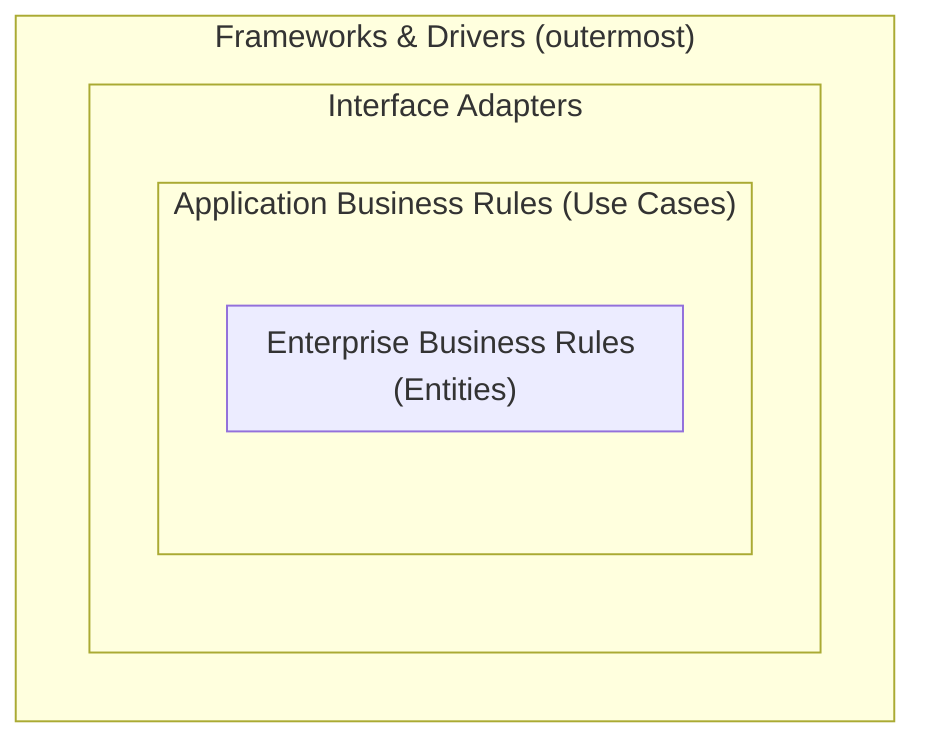
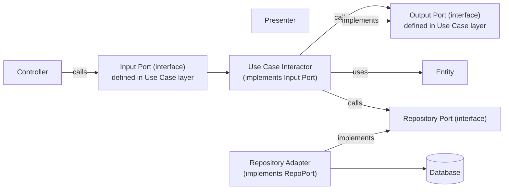
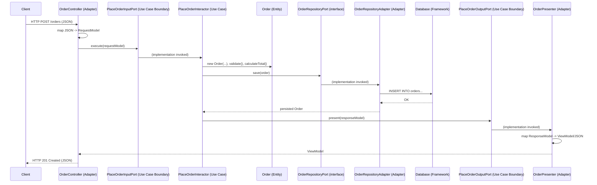
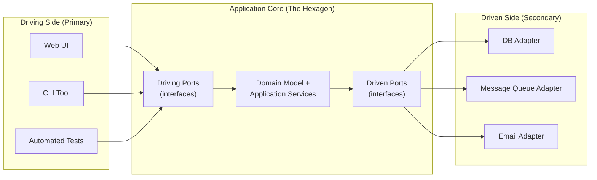
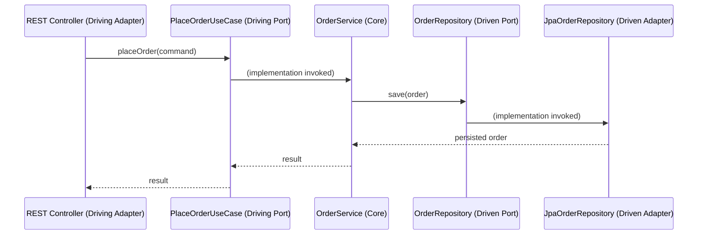
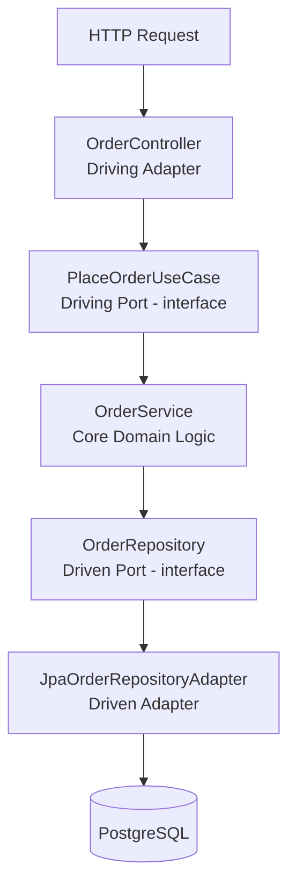
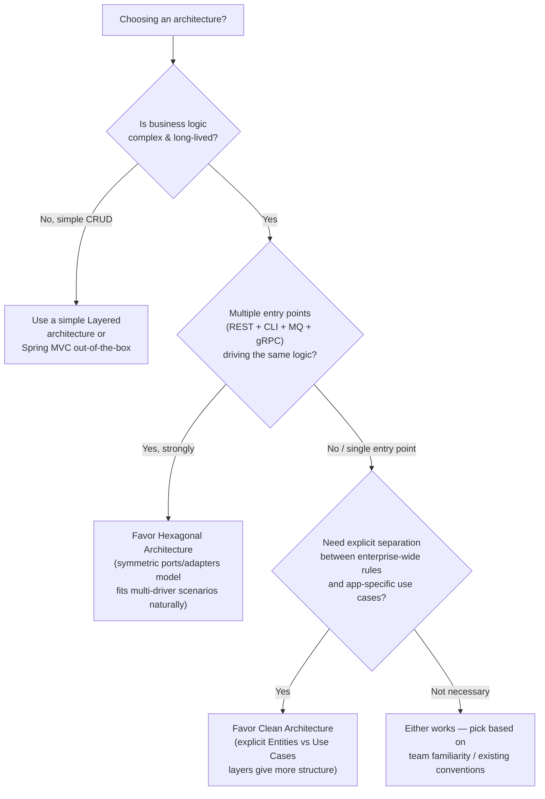

# Clean Architecture vs Hexagonal Architecture — A Complete Tutorial

## Table of Contents

1. [Clean Architecture](#part-1-clean-architecture)
   - 1.1 [Origin & Motivation](#11-origin--motivation)
   - 1.2 [Core Concepts & Principles](#12-core-concepts--principles)
   - 1.3 [The Four Layers](#13-the-four-layers)
   - 1.4 [Component Communication](#14-component-communication)
   - 1.5 [Standard Folder Structure](#15-standard-folder-structure)
   - 1.6 [Detailed Request Flow](#16-detailed-request-flow)
   - 1.7 [Java Example](#17-java-example)
   - 1.8 [Pros & Cons](#18-pros--cons)
   - 1.9 [When to Apply](#19-when-to-apply)
   - 1.10 [Key Takeaways](#110-key-takeaways)
2. [Hexagonal Architecture](#part-2-hexagonal-architecture-ports--adapters)
   - 2.1 [Origin & Motivation](#21-origin--motivation)
   - 2.2 [Core Concepts & Principles](#22-core-concepts--principles)
   - 2.3 [Standard Structure](#23-standard-structure)
   - 2.4 [Component Communication](#24-component-communication)
   - 2.5 [Standard Folder Structure](#25-standard-folder-structure)
   - 2.6 [Detailed Request Flow](#26-detailed-request-flow)
   - 2.7 [Java Example](#27-java-example)
   - 2.8 [Pros & Cons](#28-pros--cons)
   - 2.9 [When to Apply](#29-when-to-apply)
   - 2.10 [Key Takeaways](#210-key-takeaways)
3. [Comparison](#part-3-comparison)
   - 3.1 [Comparison Criteria](#31-comparison-criteria)
   - 3.2 [Similarities](#32-similarities)
   - 3.3 [Key Differences](#33-key-differences)
   - 3.4 [Related / Alternative Architectures](#34-related--alternative-architectures)
   - 3.5 [Decision Guide](#35-decision-guide)
4. [Further Reading](#4-further-reading)

# 1. Clean Architecture

## 1.1 Origin & Motivation

Clean Architecture was popularized by **Robert C. Martin ("Uncle Bob")** in his 2012 blog post and later the 2017 book _"Clean Architecture: A Craftsman's Guide to Software Structure and Design"_. It is not a brand-new invention — it is a **synthesis** of several older ideas that all converge on the same underlying goal:

- **Hexagonal Architecture** (Alistair Cockburn, 2005)
- **Onion Architecture** (Jeffrey Palermo, 2008)
- **DCI (Data, Context, Interaction)**
- **BCE (Boundary-Control-Entity)**

The motivating problem Uncle Bob wanted to solve: _"Why does business logic keep getting entangled with frameworks, UI, and databases, making the system fragile and hard to test?"_

His answer: **separate concerns into concentric layers, and force all dependencies to point inward**, so that business rules never know anything about the delivery mechanism (web, CLI, gRPC) or the persistence mechanism (SQL, NoSQL, files).

## 1.2 Core Concepts & Principles

### 1.2.1 The Dependency Rule

> _"Source code dependencies must point only inward, toward higher-level policies."_

This is the single most important rule. Inner circles are policy; outer circles are mechanism (detail). Nothing in an inner circle can know **anything at all** about something in an outer circle — not even the name of a class, function, or variable defined in an outer layer.

### 1.2.2 Independence Goals

Clean Architecture is designed to produce systems that are:

| Independent of        | Meaning                                                                                 |
| --------------------- | --------------------------------------------------------------------------------------- |
| **Frameworks**        | Spring, Express, Django are tools, not the architecture. You can swap them.             |
| **UI**                | The UI can change (Web → CLI → Mobile) without changing business rules.                 |
| **Database**          | You can swap PostgreSQL for MongoDB without touching use cases.                         |
| **External agencies** | Business rules don't know about any external service.                                   |
| **Testability**       | Business rules can be tested with no UI, database, web server, or any external element. |

### 1.2.3 SOLID as the Foundation

Clean Architecture is essentially SOLID principles applied at the **architectural (macro) level**, not just class level:

- **S**ingle Responsibility → each layer has one reason to change.
- **O**pen/Closed → add features by adding new use cases, not modifying core.
- **L**iskov Substitution → adapters/implementations must be substitutable.
- **I**nterface Segregation → small, use-case-specific ports.
- **D**ependency Inversion → the _big one_. High-level modules define interfaces; low-level modules implement them.

## 1.3 The Four Layers



### Layer 1 — Entities (Enterprise Business Rules)

Plain objects encapsulating the **most general, highest-level business rules** — the ones that would exist even if the application didn't. They are the least likely to change when something external changes (e.g., a UI framework upgrade).

- No annotations from frameworks (no `@Entity` JPA annotations here — that's a common violation!).
- No dependency on anything outside this layer.

### Layer 2 — Use Cases (Application Business Rules)

Contains **application-specific** business rules. Orchestrates the flow of data to and from entities, and directs entities to use their enterprise-wide business rules to achieve the goal of the use case.

- Defines **input/output boundaries (ports)** as interfaces.
- Does not know about HTTP, SQL, or JSON — only about entities and abstractions.

### Layer 3 — Interface Adapters

Converts data from the format most convenient for use cases/entities into the format most convenient for external agencies (DB, Web) and vice versa.

- Controllers, Presenters, Gateways, Mappers/DTO converters live here.
- This is where MVC pattern typically lives.

### Layer 4 — Frameworks & Drivers (outermost)

The "glue" layer — web frameworks, database drivers, devices, external APIs. Generally you write very little code here beyond configuration.

## 1.4 Component Communication

The key mechanism enabling the Dependency Rule to work **across layer boundaries** is the **Dependency Inversion Principle** combined with **Boundary Interfaces**:



**Important pattern — crossing boundaries:** When Use Case layer (inner) needs to call outward to Interface Adapter layer (outer), e.g. to persist data or present a result, it does so through an **interface it owns** (Dependency Inversion). The outer layer implements that interface. This keeps the arrow of source-code dependency pointing inward even though the _runtime_ call flows outward.

Data crossing a boundary is always **simple data structures (DTOs / Request-Response models)** — never entities directly, and never framework-specific types (e.g., never pass a JPA `Entity` or an HTTP `HttpServletRequest` into a use case).

## 1.5 Standard Folder Structure

A typical Java/Spring Boot Clean Architecture project:

There are two common packaging strategies. **Package-by-layer** (top-level folder = layer name) is fine for tiny demos, but it scales poorly: as the app grows, each top-level folder becomes a dumping ground for unrelated features, and Java's package-private visibility can't help you enforce encapsulation between features. For any real, production-grade codebase, the current industry best practice is **package-by-feature first, then by layer inside each feature** — this keeps every use case's files physically close together, makes the codebase map 1:1 to the business domain (a nod to "Screaming Architecture"), and lets you eventually extract a feature into its own microservice almost by copy-pasting a folder.

Below is the **full, production-grade structure** — every subfolder you'll actually need in a real Spring Boot Clean Architecture service, not just the minimal illustrative one:

```
order-service/
├── src/main/java/com/example/orderapp
│   ├── OrderAppApplication.java                      # @SpringBootApplication entry point
│   │
│   ├── domain/                                        # LAYER 1 — Entities (Enterprise Business Rules)
│   │   ├── order/
│   │   │   ├── Order.java                             # aggregate root entity
│   │   │   ├── OrderItem.java
│   │   │   ├── OrderStatus.java                       # enum
│   │   │   └── Money.java                             # value object
│   │   ├── customer/
│   │   │   └── Customer.java
│   │   ├── exception/
│   │   │   ├── DomainException.java                   # base class for all domain errors
│   │   │   └── InvalidOrderException.java
│   │   └── event/
│   │       └── OrderPlacedEvent.java                  # domain event (POJO, no framework)
│   │
│   ├── application/                                    # LAYER 2 — Use Cases (Application Business Rules)
│   │   ├── order/
│   │   │   ├── placeorder/
│   │   │   │   ├── PlaceOrderUseCase.java              # input port (interface)
│   │   │   │   ├── PlaceOrderService.java              # interactor — implements the use case
│   │   │   │   ├── PlaceOrderCommand.java              # request model
│   │   │   │   └── PlaceOrderResult.java               # response model
│   │   │   ├── cancelorder/
│   │   │   │   ├── CancelOrderUseCase.java
│   │   │   │   ├── CancelOrderService.java
│   │   │   │   └── CancelOrderCommand.java
│   │   │   └── getorder/
│   │   │       ├── GetOrderQuery.java                  # input port for a read use case
│   │   │       ├── GetOrderService.java
│   │   │       └── OrderView.java                      # read-optimized response model
│   │   ├── port/
│   │   │   └── out/                                     # output boundaries owned by the app layer
│   │   │       ├── OrderRepositoryPort.java
│   │   │       ├── PaymentGatewayPort.java
│   │   │       ├── NotificationPort.java
│   │   │       └── EventPublisherPort.java
│   │   ├── mapper/
│   │   │   └── OrderMapper.java                        # domain <-> use-case model, if needed
│   │   └── exception/
│   │       └── OrderNotFoundException.java
│   │
│   ├── adapter/                                         # LAYER 3 — Interface Adapters
│   │   ├── in/
│   │   │   ├── web/
│   │   │   │   ├── order/
│   │   │   │   │   ├── OrderController.java
│   │   │   │   │   ├── request/
│   │   │   │   │   │   └── PlaceOrderRequestDTO.java
│   │   │   │   │   ├── response/
│   │   │   │   │   │   └── OrderResponseDTO.java
│   │   │   │   │   └── mapper/
│   │   │   │   │       └── OrderRestMapper.java        # DTO <-> Command/Result mapping
│   │   │   │   └── advice/
│   │   │   │       └── GlobalExceptionHandler.java     # @ControllerAdvice
│   │   │   ├── messaging/
│   │   │   │   └── order/
│   │   │   │       └── OrderCreatedEventListener.java  # Kafka/RabbitMQ consumer
│   │   │   └── scheduler/
│   │   │       └── OrderCleanupJob.java                # @Scheduled cron adapter
│   │   └── out/
│   │       ├── persistence/
│   │       │   └── order/
│   │       │       ├── OrderJpaEntity.java
│   │       │       ├── OrderJpaRepository.java         # Spring Data interface
│   │       │       ├── OrderRepositoryAdapter.java      # implements application.port.out.OrderRepositoryPort
│   │       │       └── mapper/
│   │       │           └── OrderPersistenceMapper.java # domain <-> JPA entity
│   │       ├── payment/
│   │       │   └── StripePaymentAdapter.java           # implements PaymentGatewayPort
│   │       ├── notification/
│   │       │   └── EmailNotificationAdapter.java       # implements NotificationPort
│   │       └── event/
│   │           └── SpringEventPublisherAdapter.java    # implements EventPublisherPort
│   │
│   └── infrastructure/                                  # LAYER 4 — Frameworks & Drivers / cross-cutting config
│       ├── config/
│       │   ├── BeanConfiguration.java                   # wires interfaces -> implementations
│       │   ├── SecurityConfig.java
│       │   ├── SwaggerConfig.java
│       │   └── WebConfig.java
│       ├── security/
│       │   └── JwtAuthenticationFilter.java
│       └── persistence/
│           └── DatabaseConfig.java
│
├── src/main/resources/
│   ├── application.yml
│   ├── application-dev.yml
│   ├── application-prod.yml
│   └── db/migration/                                    # Flyway/Liquibase
│       └── V1__init_schema.sql
│
└── src/test/java/com/example/orderapp                    # mirrors main/ 1:1
    ├── domain/order/OrderTest.java                        # pure unit test, no Spring context
    ├── application/order/placeorder/PlaceOrderServiceTest.java  # mocks the out-ports
    ├── adapter/in/web/order/OrderControllerTest.java       # @WebMvcTest
    └── adapter/out/persistence/order/OrderRepositoryAdapterTest.java  # @DataJpaTest / Testcontainers
```

**How to read this structure when coding a new use case:** say you need to add "Update Order Shipping Address" — you know exactly what to create without second-guessing:

1. If there's a new business rule at the Entity level → edit `domain/order/Order.java`.
2. Create `application/order/updateshippingaddress/` with `UpdateShippingAddressUseCase.java`, `UpdateShippingAddressService.java`, `UpdateShippingAddressCommand.java`.
3. If a new port is needed (e.g. calling an address-validation service) → add it to `application/port/out/`.
4. Add the endpoint → `adapter/in/web/order/OrderController.java` (new method) + the matching DTO under `request/`.
5. If the new port needs an adapter → create it under `adapter/out/`.
6. Wire the new bean (if not already handled by `@Component`/constructor injection) → `infrastructure/config/BeanConfiguration.java`.

You never have to guess "where does this file belong" — the location is always dictated by **architectural role** (Entity / Use Case / Adapter-in / Adapter-out / Config), never by technology type.

## 1.6 Detailed Request Flow

Walking through **"Place an Order"** end-to-end:



**Key observations from the flow:**

1. The `Controller` never talks to the `Interactor` class directly — only through the `PlaceOrderInputPort` interface.
2. The `Interactor` never knows a database exists — it only knows `OrderRepositoryPort`.
3. The `Interactor` never builds an HTTP response — it emits a plain `ResponseModel` through `PlaceOrderOutputPort`; the `Presenter` (an outer-layer detail) decides how to render it.
4. All arrows of **source-code dependency** point inward; only **runtime control flow** goes outward, and it does so via interfaces owned by the inner layer.

## 1.7 Java Example

**Entity (Layer 1):**

```java
package com.example.orderapp.entities;

public class Order {
    private final String id;
    private final List<OrderItem> items;
    private Money total;

    public Order(String id, List<OrderItem> items) {
        if (items.isEmpty()) {
            throw new IllegalArgumentException("Order must contain at least one item");
        }
        this.id = id;
        this.items = items;
        this.total = calculateTotal();
    }

    private Money calculateTotal() {
        return items.stream()
                .map(OrderItem::subtotal)
                .reduce(Money.ZERO, Money::add);
    }

    public Money getTotal() { return total; }
    public String getId() { return id; }
    public List<OrderItem> getItems() { return items; }
}
```

**Boundary interfaces (Layer 2 - owned by Use Case):**

```java
package com.example.orderapp.usecases.placeorder;

public interface PlaceOrderInputPort {
    void placeOrder(PlaceOrderRequestModel request);
}

public interface PlaceOrderOutputPort {
    void present(PlaceOrderResponseModel response);
}
```

```java
package com.example.orderapp.usecases.ports;

public interface OrderRepositoryPort {
    Order save(Order order);
    Optional<Order> findById(String id);
}
```

**Interactor (Layer 2 - the use case implementation):**

```java
package com.example.orderapp.usecases.placeorder;

public class PlaceOrderInteractor implements PlaceOrderInputPort {

    private final OrderRepositoryPort orderRepository;
    private final PlaceOrderOutputPort outputPort;

    public PlaceOrderInteractor(OrderRepositoryPort orderRepository,
                                 PlaceOrderOutputPort outputPort) {
        this.orderRepository = orderRepository;
        this.outputPort = outputPort;
    }

    @Override
    public void placeOrder(PlaceOrderRequestModel request) {
        Order order = new Order(UUID.randomUUID().toString(), request.toOrderItems());
        Order saved = orderRepository.save(order);

        PlaceOrderResponseModel response =
            new PlaceOrderResponseModel(saved.getId(), saved.getTotal().amount());
        outputPort.present(response);
    }
}
```

**Adapter — Controller (Layer 3):**

```java
package com.example.orderapp.adapters.controllers;

@RestController
@RequestMapping("/orders")
public class OrderController {

    private final PlaceOrderInputPort placeOrderInputPort;
    private final OrderPresenter presenter; // also implements PlaceOrderOutputPort

    public OrderController(PlaceOrderInputPort placeOrderInputPort, OrderPresenter presenter) {
        this.placeOrderInputPort = placeOrderInputPort;
        this.presenter = presenter;
    }

    @PostMapping
    public ResponseEntity<OrderViewModel> create(@RequestBody OrderRequestDTO dto) {
        PlaceOrderRequestModel requestModel = dto.toRequestModel();
        placeOrderInputPort.placeOrder(requestModel);
        return ResponseEntity.status(201).body(presenter.getViewModel());
    }
}
```

**Adapter — Repository Gateway (Layer 3), implements the port from Layer 2:**

```java
package com.example.orderapp.adapters.gateways;

@Component
public class OrderRepositoryAdapter implements OrderRepositoryPort {

    private final OrderJpaRepository jpaRepository; // Layer 4 detail

    public OrderRepositoryAdapter(OrderJpaRepository jpaRepository) {
        this.jpaRepository = jpaRepository;
    }

    @Override
    public Order save(Order order) {
        OrderJpaEntity entity = OrderMapper.toJpaEntity(order);
        OrderJpaEntity saved = jpaRepository.save(entity);
        return OrderMapper.toDomain(saved);
    }

    @Override
    public Optional<Order> findById(String id) {
        return jpaRepository.findById(id).map(OrderMapper::toDomain);
    }
}
```

Notice: `OrderRepositoryAdapter` (outer) **implements** `OrderRepositoryPort` (inner interface) — this is the Dependency Inversion in action. The Spring `@Component`/`@Bean` wiring (Layer 4, e.g. via `BeanConfiguration.java`) is what actually injects the concrete adapter into the interactor at runtime.

## 1.8 Pros & Cons

**Pros:**

- Business logic is **100% framework-agnostic** and unit-testable without Spring context, database, or HTTP server.
- Easy to swap infrastructure (DB, message broker, web framework) with minimal blast radius.
- Clear separation of concerns makes large codebases more navigable long-term.
- Enforces explicit contracts (ports) between layers, improving parallel team development.
- Naturally supports Test-Driven Development for use cases.

**Cons:**

- **Significant boilerplate**: a single use case can require Request Model, Response Model, Input Port, Output Port, Interactor, Presenter, ViewModel — 6-7 files for one feature.
- Steeper learning curve for teams unfamiliar with Dependency Inversion.
- Over-engineering risk for small CRUD apps or short-lived MVPs.
- Strict mapping between layers (DTO ↔ Domain ↔ Persistence models) adds mapping code and potential performance overhead.
- Can slow down initial development velocity noticeably.

## 1.9 When to Apply

Good fit when:

- The system has **complex, long-lived business logic** that will evolve over years.
- You expect to **change delivery mechanisms or infrastructure** (e.g., migrate from REST to gRPC, or SQL to NoSQL).
- Multiple teams work on the same codebase and need clear contracts.
- High test coverage of business rules is a hard requirement (e.g., fintech, healthcare, insurance domains).

Poor fit when:

- Building a small CRUD prototype, internal tool, or short-lived MVP.
- The team is small and unfamiliar with DI/SOLID — the overhead won't pay off before the project ends.
- The domain logic is trivial (mostly pass-through to database).

## 1.10 Key Takeaways

- The **Dependency Rule** (dependencies point inward) is non-negotiable — everything else is a means to enforce it.
- Layers communicate exclusively through **interfaces (ports) and plain data structures (DTOs/models)** — never framework types crossing into the core.
- **Entities** encapsulate enterprise-wide rules; **Use Cases** encapsulate application-specific rules; both are pure, framework-free Java.
- Clean Architecture is a **generalization** — the number of layers/rings is flexible (Uncle Bob explicitly says 4 is just an example, you may need more or fewer depending on your domain).

# 2. Hexagonal Architecture (Ports & Adapters)

## 2.1 Origin & Motivation

Hexagonal Architecture was introduced by **Alistair Cockburn** in 2005, originally named **"Ports and Adapters"**. The "hexagon" shape is arbitrary/symbolic — it was chosen simply to leave room to draw multiple ports/adapters around a core without implying only "top" and "bottom" like a traditional layered diagram. There is nothing mathematically significant about six sides.

The core motivating question Cockburn asked:

> _"How do I let an application run equally well when driven by users, programs, automated tests, or batch scripts, and be developed and tested in isolation from its eventual run-time devices and databases?"_

## 2.2 Core Concepts & Principles

### 2.2.1 The Application Core (The Hexagon)

The center of the hexagon holds pure **business/domain logic**, completely isolated from the outside world. It has zero knowledge of HTTP, message queues, databases, or any technology.

### 2.2.2 Ports

A **port** is an interface defined by the application core that describes an interaction it needs — either something the core **offers** to the outside, or something the core **needs** from the outside.

There are two kinds of ports:

| Port type                   | Direction    | Purpose                                                   | Example                       |
| --------------------------- | ------------ | --------------------------------------------------------- | ----------------------------- |
| **Driving / Primary port**  | Outside → In | The API the outside world uses to _drive_ the application | `PlaceOrderUseCase` interface |
| **Driven / Secondary port** | Inside → Out | The API the application needs from external systems       | `OrderRepository` interface   |

### 2.2.3 Adapters

An **adapter** is the concrete implementation that translates between an external technology and a port.

| Adapter type                   | Also implements/calls    | Example                                           |
| ------------------------------ | ------------------------ | ------------------------------------------------- |
| **Driving / Primary adapter**  | Calls a driving port     | REST Controller, CLI command, message listener    |
| **Driven / Secondary adapter** | Implements a driven port | JPA Repository impl, S3 client, SMTP email sender |

### 2.2.4 Symmetry

Unlike Clean Architecture's concentric-circle diagram (which visually implies "up/down" layering), Hexagonal Architecture is explicitly **symmetric**: driving side and driven side are drawn as mirror images around the same core, emphasizing that _both_ sides are equally "outside" and equally replaceable.



## 2.3 Standard Structure

Conceptually there are only **two zones**:

1. **Inside the hexagon** — domain model + application services + ports (interfaces).
2. **Outside the hexagon** — adapters, one per external technology, plugged into ports like plugs into sockets.

This is why Hexagonal Architecture is also called the **"Ports and Adapters"** pattern — the metaphor is literal: a port is a socket shape, an adapter is the plug that matches it.

## 2.4 Component Communication



Communication rules:

- **Driving adapters call driving ports** — they never call the core's concrete classes directly.
- **The core calls driven ports** — it never references a concrete adapter class or a specific technology's SDK/library type.
- Wiring (which adapter implements which port at runtime) is done via **Dependency Injection** at the composition root (e.g., Spring's `@Configuration`, or manual wiring in `main()`).
- Data crossing ports is expressed as **domain objects or simple commands/DTOs**, never technology-specific types (no `HttpServletRequest`, no JPA `@Entity` leaking into the core).

## 2.5 Standard Folder Structure

The structure most widely adopted today is **package-by-module (bounded context) first, then port/adapter inside each module** — this is exactly the structure popularized by Tom Hombergs' reference project **"Buckpal"** (companion code to _"Get Your Hands Dirty on Clean Architecture"_), and it is the closest thing the Java community has to a de-facto standard for Hexagonal Architecture in Spring Boot. Java's package-private visibility is used deliberately here: `OrderService` and `OrderPersistenceAdapter` can be package-private (not `public`), which the compiler then _physically enforces_ — nothing outside `order.application` can accidentally call the interactor directly, only through the port interface.

Below is the **full, production-grade structure** covering every subfolder a real service needs, plus a second bounded-context module (`customer/`) to show how it scales to a multi-module application:

```
order-service/
├── src/main/java/com/example/orderapp
│   ├── OrderAppApplication.java
│   │
│   ├── order/                                          # Bounded context / feature module
│   │   ├── domain/                                     # Inside the hexagon — pure Java, zero framework
│   │   │   ├── Order.java                               # aggregate root
│   │   │   ├── OrderItem.java
│   │   │   ├── OrderStatus.java
│   │   │   ├── Money.java                               # value object
│   │   │   └── OrderValidationException.java
│   │   │
│   │   ├── application/                                 # The hexagon's wall (ports) + orchestration
│   │   │   ├── port/
│   │   │   │   ├── in/                                  # Driving ports (what the outside calls)
│   │   │   │   │   ├── PlaceOrderUseCase.java
│   │   │   │   │   ├── PlaceOrderCommand.java
│   │   │   │   │   ├── CancelOrderUseCase.java
│   │   │   │   │   ├── CancelOrderCommand.java
│   │   │   │   │   └── GetOrderQuery.java
│   │   │   │   └── out/                                 # Driven ports (what the core needs)
│   │   │   │       ├── LoadOrderPort.java
│   │   │   │       ├── SaveOrderPort.java
│   │   │   │       ├── PaymentPort.java
│   │   │   │       └── PublishOrderEventPort.java
│   │   │   └── service/                                 # Implements the "in" ports, calls the "out" ports
│   │   │       ├── PlaceOrderService.java                # implements PlaceOrderUseCase
│   │   │       ├── CancelOrderService.java               # implements CancelOrderUseCase
│   │   │       └── GetOrderService.java                  # implements GetOrderQuery
│   │   │
│   │   └── adapter/                                     # Outside the hexagon
│   │       ├── in/
│   │       │   ├── web/
│   │       │   │   ├── OrderController.java              # driving adapter
│   │       │   │   ├── PlaceOrderRequest.java
│   │       │   │   ├── OrderResponse.java
│   │       │   │   └── OrderRestMapper.java
│   │       │   └── messaging/
│   │       │       └── OrderEventConsumer.java           # e.g. Kafka listener as another driving adapter
│   │       └── out/
│   │           ├── persistence/
│   │           │   ├── OrderJpaEntity.java
│   │           │   ├── SpringDataOrderRepository.java     # Spring Data interface
│   │           │   ├── OrderPersistenceAdapter.java       # implements LoadOrderPort + SaveOrderPort
│   │           │   └── OrderMapper.java                   # domain <-> JPA entity
│   │           ├── payment/
│   │           │   └── StripePaymentAdapter.java          # implements PaymentPort
│   │           └── messaging/
│   │               └── KafkaOrderEventPublisher.java      # implements PublishOrderEventPort
│   │
│   ├── customer/                                        # A second bounded context — identical internal shape
│   │   ├── domain/
│   │   │   └── Customer.java
│   │   ├── application/
│   │   │   ├── port/{in,out}/
│   │   │   └── service/
│   │   └── adapter/
│   │       ├── in/web/
│   │       └── out/persistence/
│   │
│   ├── shared/                                          # Shared kernel — use sparingly, only true cross-module code
│   │   ├── domain/
│   │   │   └── Money.java                                # if genuinely shared by multiple modules
│   │   └── exception/
│   │       └── ApplicationException.java
│   │
│   └── config/                                          # Composition root — wires ports to adapters
│       ├── BeanConfiguration.java
│       ├── SecurityConfig.java
│       └── WebConfig.java
│
├── src/main/resources/
│   ├── application.yml
│   └── db/migration/
│       └── V1__init_schema.sql
│
└── src/test/java/com/example/orderapp
    ├── order/domain/OrderTest.java                       # pure unit test
    ├── order/application/service/PlaceOrderServiceTest.java  # mocks the "out" ports
    ├── order/adapter/in/web/OrderControllerTest.java      # @WebMvcTest
    └── order/adapter/out/persistence/OrderPersistenceAdapterTest.java  # @DataJpaTest / Testcontainers
```

**How to read this structure when coding a new use case:** say you need to add "Apply Discount Coupon to Order":

1. New business rule, if any → `order/domain/Order.java`.
2. Create the new port in `order/application/port/in/ApplyCouponUseCase.java` + `ApplyCouponCommand.java`.
3. If it needs to call out (e.g. a coupon-validation service) → add `order/application/port/out/CouponValidationPort.java`.
4. Write the interactor → `order/application/service/ApplyCouponService.java` (implements `ApplyCouponUseCase`, injects `CouponValidationPort`).
5. Add the calling endpoint → `order/adapter/in/web/OrderController.java`.
6. Write the adapter for the new port → `order/adapter/out/coupon/CouponServiceAdapter.java` (implements `CouponValidationPort`).
7. Register the bean (usually automatic via `@Component`/constructor injection — no need to touch `config/` unless there's special configuration).

> **Note:** The `port.in`/`port.out` and `adapter.in`/`adapter.out` naming convention is the de-facto industry standard, popularized by Tom Hombergs' book _"Get Your Hands Dirty on Clean Architecture"_ and its Buckpal reference implementation — it is what you will see in the vast majority of real-world Java/Spring Hexagonal Architecture codebases today.

## 2.6 Detailed Request Flow

Same "Place an Order" use case as before, walked through the hexagonal lens:

1. An HTTP request hits `OrderController` (a **driving adapter**).
2. The controller maps the JSON body into a `PlaceOrderCommand` and calls `placeOrderUseCase.placeOrder(command)` — a call to the **driving port** interface, resolved at runtime to `OrderService`.
3. `OrderService` (the **core**) validates business rules and constructs an `Order` domain object.
4. `OrderService` calls `orderRepository.save(order)` — the **driven port** — with no idea that this ultimately means "run an SQL INSERT."
5. `JpaOrderRepositoryAdapter` (a **driven adapter**) receives this call, maps the domain `Order` into a JPA entity, and persists it via Spring Data.
6. The result flows back up the same call chain to the controller, which maps the domain result into an HTTP response DTO.



## 2.7 Java Example

**Domain model (inside the hexagon):**

```java
package com.example.orderapp.domain.model;

public class Order {
    private final String id;
    private final List<OrderItem> items;

    public Order(String id, List<OrderItem> items) {
        this.id = id;
        this.items = items;
    }

    public Money total() {
        return items.stream().map(OrderItem::subtotal).reduce(Money.ZERO, Money::add);
    }
}
```

**Driving port (application layer, called by driving adapters):**

```java
package com.example.orderapp.application.port.in;

public interface PlaceOrderUseCase {
    OrderResult placeOrder(PlaceOrderCommand command);
}
```

**Driven port (application layer, implemented by driven adapters):**

```java
package com.example.orderapp.application.port.out;

public interface OrderRepository {
    Order save(Order order);
    Optional<Order> findById(String id);
}
```

**Core service — implements the driving port, depends only on driven ports:**

```java
package com.example.orderapp.domain.service;

public class OrderService implements PlaceOrderUseCase {

    private final OrderRepository orderRepository; // driven port, injected

    public OrderService(OrderRepository orderRepository) {
        this.orderRepository = orderRepository;
    }

    @Override
    public OrderResult placeOrder(PlaceOrderCommand command) {
        Order order = new Order(UUID.randomUUID().toString(), command.toItems());
        Order saved = orderRepository.save(order);
        return new OrderResult(saved.getId(), saved.total());
    }
}
```

**Driving adapter (web layer, calls the driving port):**

```java
package com.example.orderapp.adapter.in.web;

@RestController
@RequestMapping("/orders")
public class OrderController {

    private final PlaceOrderUseCase placeOrderUseCase; // driving port

    public OrderController(PlaceOrderUseCase placeOrderUseCase) {
        this.placeOrderUseCase = placeOrderUseCase;
    }

    @PostMapping
    public ResponseEntity<OrderResponse> create(@RequestBody PlaceOrderRequest request) {
        OrderResult result = placeOrderUseCase.placeOrder(request.toCommand());
        return ResponseEntity.status(201).body(OrderResponse.from(result));
    }
}
```

**Driven adapter (persistence layer, implements the driven port):**

```java
package com.example.orderapp.adapter.out.persistence;

@Component
public class JpaOrderRepositoryAdapter implements OrderRepository {

    private final SpringDataOrderJpaRepository springDataRepository;

    public JpaOrderRepositoryAdapter(SpringDataOrderJpaRepository springDataRepository) {
        this.springDataRepository = springDataRepository;
    }

    @Override
    public Order save(Order order) {
        OrderJpaEntity entity = OrderPersistenceMapper.toEntity(order);
        return OrderPersistenceMapper.toDomain(springDataRepository.save(entity));
    }

    @Override
    public Optional<Order> findById(String id) {
        return springDataRepository.findById(id).map(OrderPersistenceMapper::toDomain);
    }
}
```

**Composition root (wiring, e.g. Spring `@Configuration`):**

```java
package com.example.orderapp.config;

@Configuration
public class BeanWiringConfig {

    @Bean
    public PlaceOrderUseCase placeOrderUseCase(OrderRepository orderRepository) {
        return new OrderService(orderRepository);
    }
}
```

## 2.8 Pros & Cons

**Pros:**

- Extremely clear, symmetric mental model: **"the core never depends on anything outside it, period."**
- Naturally supports **multiple entry points** to the same core (REST, GraphQL, CLI, message consumers) without duplicating business logic.
- Makes it trivial to write **fast unit tests against the core** using test doubles/mocks for driven ports.
- Encourages **swappable infrastructure** — swapping a database or message broker is "just write a new adapter."
- Less prescriptive about _how many_ layers/rings you need compared to Clean Architecture's four-layer diagram, which can reduce over-structuring for simpler domains.

**Cons:**

- The "ports" concept can feel abstract to newcomers — where exactly does business logic end and a port begin?
- Cockburn's original writing doesn't define a use-case/interactor layer as explicitly as Clean Architecture does, so teams sometimes end up putting too much logic directly into driving adapters (e.g., "fat controllers") if not disciplined.
- Naming conventions (`port.in`/`port.out`, "driving"/"driven") are not fully standardized across the industry — different books/blogs use different terms, causing onboarding confusion.
- Same boilerplate/mapping overhead concerns as Clean Architecture (DTO ↔ domain ↔ persistence mapping).

## 2.9 When to Apply

Good fit when:

- Your application must be **driven by multiple different clients/protocols** (REST + gRPC + message queue + scheduled batch jobs) using the _same_ business logic.
- You need to **swap or mock external systems easily** for testing (e.g., replacing a real payment gateway with a stub in integration tests).
- You want a framework-agnostic core that can be tested with plain JUnit, no Spring context required.
- Building **domain-centric applications** where the domain will outlive any particular delivery/storage technology.

Poor fit when:

- The application is a thin CRUD façade over a database with minimal business logic (the port/adapter ceremony adds no value).
- Extremely short-lived project where infrastructure will never be swapped.
- Team lacks familiarity with dependency injection and interface-first design.

## 2.10 Key Takeaways

- **Ports are interfaces owned by the core**; **Adapters are technology-specific implementations plugged into those ports.**
- **Driving side** = things that call into your application (initiate use cases). **Driven side** = things your application calls out to (needs from the world).
- The hexagon shape itself carries no special meaning — it's a visual device against the false "top/bottom" hierarchy implied by layered diagrams.
- Testability is achieved by substituting **test doubles** for driven-port implementations, and by calling driving ports directly in tests, bypassing real adapters (e.g., real HTTP).

# PART 3: Comparison

## 3.1 Comparison Criteria

| #   | Criterion                              | Clean Architecture                                                                                                                        | Hexagonal Architecture                                                                                                                         |
| --- | -------------------------------------- | ----------------------------------------------------------------------------------------------------------------------------------------- | ---------------------------------------------------------------------------------------------------------------------------------------------- |
| 1   | **Author / Year**                      | Robert C. Martin, 2012                                                                                                                    | Alistair Cockburn, 2005                                                                                                                        |
| 2   | **Visual metaphor**                    | Concentric circles (onion-like), implies explicit layering with a strict inward Dependency Rule                                           | Symmetric hexagon with plugs (ports/adapters) on both sides, implies "core vs. everything else"                                                |
| 3   | **Number of layers**                   | Explicitly 4 recommended layers (Entities, Use Cases, Interface Adapters, Frameworks & Drivers) — but Martin says this number is flexible | Conceptually **2 zones only**: inside the hexagon (core) vs. outside (adapters); no fixed layer count                                          |
| 4   | **Core terminology**                   | Entities, Use Cases, Interactors, Boundaries, Input/Output Ports, Presenters, Gateways                                                    | Ports (driving/primary, driven/secondary), Adapters (driving/driven), Application Core                                                         |
| 5   | **Emphasis**                           | Strict layering + explicit use-case orchestration objects (Interactors) as first-class citizens                                           | Symmetry between "what drives the app" and "what the app drives"; less prescriptive about internal core structure                              |
| 6   | **Where business logic clearly lives** | Split across Entities (enterprise rules) + Use Cases (application rules) — two distinct sub-layers                                        | Single "Application Core" — Cockburn doesn't mandate splitting entities from use-case orchestration, though most real implementations still do |
| 7   | **Dependency direction rule**          | Dependencies point strictly inward across concentric rings                                                                                | Dependencies point strictly toward the core from both sides (driving & driven)                                                                 |
| 8   | **Boilerplate level**                  | Generally higher — explicit Input/Output boundary interfaces + Request/Response models + Presenters are commonly prescribed               | Somewhat lower in typical implementations — many teams merge use-case + presenter concerns, keeping only Ports + Adapters explicit             |
| 9   | **Testability approach**               | Test Interactors directly with mocked ports; no framework needed                                                                          | Test the core (services/domain) directly with mocked driven ports; identical concept, different naming                                         |
| 10  | **Multiple entry points support**      | Supported, but conceptually framed as "multiple controllers/presenters" within Interface Adapters                                         | Explicitly designed around this — symmetry naturally invites many driving adapters (REST, CLI, MQ)                                             |
| 11  | **Industry standardization**           | Very well documented (one canonical book, one canonical diagram)                                                                          | Less standardized naming across sources — you'll see different terms in different articles/books                                               |
| 12  | **Learning curve**                     | Moderate-to-steep — need to understand 4 layers + DIP + boundary objects                                                                  | Moderate — 2 zones + ports/adapters concept is arguably simpler to explain to newcomers                                                        |
| 13  | **Relationship to DDD**                | Complements DDD well — Entities layer maps naturally to DDD's domain model                                                                | Complements DDD equally well — the "core" is exactly where DDD's aggregates/domain services live                                               |
| 14  | **Typical use in microservices**       | Common in complex, single bounded-context services with rich business rules                                                               | Very common as the default internal structure for a microservice, especially when multiple protocols must be supported                         |

## 3.2 Similarities

Despite different vocabulary, both architectures share the same DNA:

- Both put **business logic at the center**, fully isolated from delivery mechanisms and infrastructure.
- Both rely on the **Dependency Inversion Principle** — abstractions (interfaces) are owned by the inner/core layer; concrete implementations live outside and depend on those abstractions.
- Both enable the core to be **tested in complete isolation**, with test doubles substituting for infrastructure.
- Both allow **infrastructure to be swapped** (database, message broker, web framework) without touching business logic.
- Both are **technology-agnostic** — neither mandates Java, Spring, or any specific framework; they are structural philosophies, not libraries.
- Both are strongly compatible with **Domain-Driven Design (DDD)** tactical patterns (Entities, Value Objects, Aggregates, Domain Services).

In practice, many teams' implementations of "Clean Architecture" and "Hexagonal Architecture" in Java/Spring end up **nearly identical in code shape** — the difference is largely in vocabulary, diagram shape, and how explicitly the internal sub-layers (Entities vs. Use Cases) are separated.

## 3.3 Key Differences

1. **Prescriptiveness of internal structure.** Clean Architecture prescribes a specific 4-layer structure with named roles (Entities, Interactors, Boundaries, Presenters, Gateways). Hexagonal Architecture only prescribes the _boundary_ between "core" and "outside" — what happens organizationally inside the core is left to the team.

2. **Framing of directionality.** Clean Architecture frames dependency direction as _"always inward, layer by layer"_ (a strict onion). Hexagonal Architecture frames it as _"always toward the center, from either side"_ (symmetric, no notion of "layers" stacked on top of each other).

3. **Vocabulary root.** Clean Architecture's vocabulary comes from an OOP/UML tradition (Interactors, Boundaries, Presenters — echoing the BCE/DCI patterns). Hexagonal Architecture's vocabulary comes from an electrical/mechanical metaphor (Ports, Adapters, Plugs, Sockets).

4. **Historical precedence.** Hexagonal Architecture (2005) predates Clean Architecture (2012); Uncle Bob explicitly cites Cockburn's Hexagonal Architecture as one of the influences that led him to formulate Clean Architecture as a more general pattern that also unifies Onion Architecture and DCI/BCE.

## 3.4 Related / Alternative Architectures

| Architecture                                        | Author / Era                     | Key Idea                                                                                                                                                                                                                    | Relationship to CA/HA                                                                                                                                                           |
| --------------------------------------------------- | -------------------------------- | --------------------------------------------------------------------------------------------------------------------------------------------------------------------------------------------------------------------------- | ------------------------------------------------------------------------------------------------------------------------------------------------------------------------------- |
| **Onion Architecture**                              | Jeffrey Palermo, 2008            | Concentric circles like Clean Architecture, with Domain Model at the very center, Domain Services next, then Application Services, then outermost Infrastructure/UI                                                         | Direct precursor to Clean Architecture; nearly identical dependency rule                                                                                                        |
| **Layered (N-Tier) Architecture**                   | Classic, pre-2000s               | Presentation → Business → Data Access, stacked layers where each layer can call the layer directly below it                                                                                                                 | Older, simpler, but dependencies point "downward" toward the database layer (opposite of CA/HA's inward-to-domain rule), making the domain layer dependent on persistence types |
| **Vertical Slice Architecture**                     | Jimmy Bogard (popularized ~2016) | Organizes code by **feature/use case** (a vertical slice cutting through UI→logic→DB) instead of by technical layer                                                                                                         | Complementary rather than competing — can be combined with CA/HA principles inside each slice                                                                                   |
| **CQRS (Command Query Responsibility Segregation)** | Greg Young                       | Separates write model (Commands) from read model (Queries), often with different data models for each                                                                                                                       | Often layered _on top of_ Clean/Hexagonal Architecture inside the "Use Case"/"Core" layer, not a replacement for it                                                             |
| **Screaming Architecture**                          | Robert C. Martin                 | A guiding idea (not a separate architecture) stating that a project's top-level folder structure should "scream" its business domain (e.g., `orders/`, `shipping/`) rather than its framework (`controllers/`, `services/`) | A packaging philosophy that pairs naturally with Clean Architecture's use-case-centric layer                                                                                    |
| **Event-Driven Architecture (EDA)**                 | General industry pattern         | Components communicate via asynchronous events/messages rather than direct calls                                                                                                                                            | Can be implemented _using_ Hexagonal Architecture — message consumers/producers simply become another pair of driving/driven adapters                                           |
| **Microkernel / Plugin Architecture**               | General industry pattern         | A minimal core with pluggable feature modules                                                                                                                                                                               | Conceptually related to Hexagonal's "plug adapters into ports" metaphor, but focused on extensibility of _features_, not isolation of _infrastructure_                          |
| **DDD (Domain-Driven Design) tactical layering**    | Eric Evans, 2003                 | Aggregates, Entities, Value Objects, Repositories, Domain Events, Bounded Contexts                                                                                                                                          | Not an alternative — a complementary methodology commonly used _inside_ the Entities/Domain layer of both CA and HA                                                             |

## 3.5 Decision Guide



**Practical rule of thumb:** in modern Java/Spring Boot practice, most teams don't treat this as an either/or choice. They adopt the **shared core idea** — domain model isolated from infrastructure, dependencies inverted via interfaces — and pick whichever **vocabulary and folder convention** (Clean's `entities/usecases/adapters/frameworks` vs. Hexagonal's `domain/application/adapter.in/adapter.out`) their team finds clearer to communicate and onboard new engineers with. The architectural _substance_ (isolate the domain, invert dependencies, keep infrastructure at the edges) is what actually matters for maintainability — the diagram shape is secondary.

## 4. Further Reading

- Robert C. Martin, _"Clean Architecture: A Craftsman's Guide to Software Structure and Design"_ (2017)
- Alistair Cockburn, original Hexagonal Architecture article (2005), alistair.cockburn.us
- Jeffrey Palermo, _"The Onion Architecture"_ blog series (2008)
- Tom Hombergs, _"Get Your Hands Dirty on Clean Architecture"_ (2019) — the primary source of the widely used `port.in`/`port.out` Java naming convention
- Eric Evans, _"Domain-Driven Design: Tackling Complexity in the Heart of Software"_ (2003)
- Vaughn Vernon, _"Implementing Domain-Driven Design"_ (2013)
