# CQRS: Command Query Responsibility Segregation

## Mục lục

1. [Giới thiệu & Động lực](#1-giới-thiệu--động-lực)
2. [Nền tảng lý thuyết: CQS → CQRS](#2-nền-tảng-lý-thuyết-cqs--cqrs)
3. [Khái niệm cốt lõi: Command, Query, và CRUD](#3-khái-niệm-cốt-lõi-command-query-và-crud)
4. [Write Model và Read Model](#4-write-model-và-read-model)
5. [Các biến thể triển khai CQRS](#5-các-biến-thể-triển-khai-cqrs)
6. [CQRS và Event Sourcing: Quan hệ thực sự là gì?](#6-cqrs-và-event-sourcing-quan-hệ-thực-sự-là-gì)
7. [Tại sao CQRS mạnh mẽ cho Reporting & Search?](#7-tại-sao-cqrs-mạnh-mẽ-cho-reporting--search)
8. [Triển khai CQRS trong Java — E-Commerce](#8-triển-khai-cqrs-trong-java--e-commerce)
9. [Eventual Consistency & Xử lý thực tiễn](#9-eventual-consistency--xử-lý-thực-tiễn)
10. [Khi nào NÊN và KHÔNG NÊN dùng CQRS](#10-khi-nào-nên-và-không-nên-dùng-cqrs)
11. [CQRS trong các hệ thống lớn thực tế](#11-cqrs-trong-các-hệ-thống-lớn-thực-tế)
12. [Anti-Patterns & Pitfalls](#12-anti-patterns--pitfalls)
13. [Tổng kết & Checklist](#13-tổng-kết--checklist)

## 1. Giới thiệu & Động lực

### 1.1 Vấn đề của CRUD truyền thống ở quy mô lớn

Hãy tưởng tượng một nền tảng e-commerce đang phát triển. Ban đầu, mọi thứ đơn giản: một entity `Order`, một database, mọi thao tác CRUD đều đi qua một model duy nhất. Nhưng khi hệ thống tăng trưởng, những vấn đề sau bắt đầu xuất hiện:

**Vấn đề về mô hình dữ liệu:**

- Màn hình **đặt hàng** cần validate business rules phức tạp (tồn kho, giảm giá, địa chỉ giao hàng...)
- Màn hình **lịch sử đơn hàng** của khách chỉ cần hiển thị danh sách đơn giản với trạng thái
- Màn hình **báo cáo doanh thu** cần aggregate dữ liệu từ nhiều bảng theo nhiều chiều khác nhau
- Màn hình **tìm kiếm sản phẩm** cần full-text search với filter phức tạp

Khi buộc tất cả phải đi qua **một model duy nhất**, kết quả là:

```
Một model Order "khổng lồ" phải:
├── Có đủ fields để validate business logic (write)
├── Có đủ fields để hiển thị cho UI (read)
├── Support được tất cả các loại query khác nhau
└── Chịu đựng mọi kiểu JOIN, aggregate
```

Model này trở nên **"God Object"** — khó maintain, khó tối ưu performance, không thể scale độc lập.

**Vấn đề về scaling:**

```
Read traffic:  ████████████████████████████ 90%
Write traffic: ████ 10%
```

Trong hầu hết hệ thống, **read nhiều hơn write 10:1 đến 100:1**. Tuy nhiên với CRUD, chúng ta phải scale cả read lẫn write cùng nhau, dù chúng có đặc điểm hoàn toàn khác nhau.

### 1.2 CQRS ra đời như thế nào

**CQRS** — viết tắt của **Command Query Responsibility Segregation** — là pattern được Greg Young giới thiệu và phổ biến hoá bởi Martin Fowler. Nó bắt nguồn từ một nguyên lý nhỏ hơn: **CQS (Command-Query Separation)** của Bertrand Meyer.

Ý tưởng cốt lõi rất đơn giản:

> _"Use a different model to update information than the model you use to read information."_ — Martin Fowler

## 2. Nền tảng lý thuyết: CQS → CQRS

### 2.1 CQS — Command Query Separation (Mức method)

Bertrand Meyer (tác giả của "Object-Oriented Software Construction") đề xuất nguyên lý CQS:

> **Mỗi method của một object nên là một trong hai loại — không bao giờ cả hai:**
>
> - **Command:** Thay đổi state, không trả về giá trị
> - **Query:** Trả về giá trị, không thay đổi state

**Ví dụ vi phạm CQS (Anti-pattern):**

```java
// BAD: Vừa thay đổi state, vừa trả về giá trị
public Order placeOrder(OrderRequest request) {
    // Modify state
    inventory.reserve(request.getItems());
    Order order = orderRepository.save(new Order(request));
    // Also return data
    return order;
}
```

**Tuân thủ CQS:**

```java
// Command: thay đổi state, void
public void placeOrder(PlaceOrderCommand command) {
    inventory.reserve(command.getItems());
    orderRepository.save(new Order(command));
}

// Query: đọc data, không thay đổi state
public Order getOrder(String orderId) {
    return orderRepository.findById(orderId);
}
```

### 2.2 CQRS — Nâng CQS lên mức Architecture

CQS hoạt động ở mức **method/object**. CQRS nâng nguyên lý này lên mức **architectural**: tách biệt hoàn toàn toàn bộ **hệ thống xử lý Command** và **hệ thống xử lý Query** thành các model, service, thậm chí database riêng biệt.

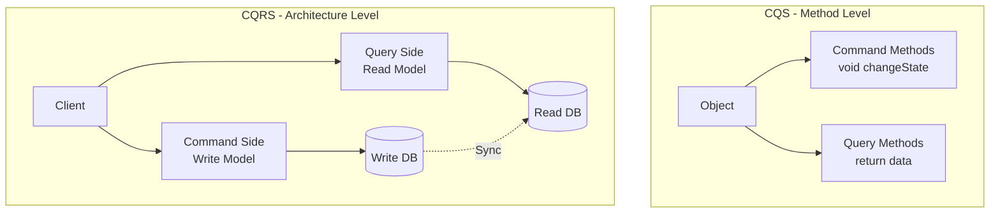

## 3. Khái niệm cốt lõi: Command, Query, và CRUD

### 3.1 Command là gì?

**Command** là một intent — một yêu cầu thay đổi trạng thái của hệ thống.

**Đặc điểm:**

- Thể hiện **ý định** của người dùng (không phải data transfer thuần túy)
- **Có thể bị từ chối** nếu vi phạm business rules
- **Không trả về data** (chỉ trả về success/failure hoặc void)
- Đặt tên theo **imperative verb**: `PlaceOrderCommand`, `CancelOrderCommand`, `UpdateInventoryCommand`
- Có thể là **synchronous** hoặc **asynchronous**

**Ví dụ E-Commerce:**

```
PlaceOrderCommand      → Đặt một đơn hàng mới
CancelOrderCommand     → Hủy đơn hàng
UpdateShippingAddress  → Cập nhật địa chỉ giao hàng
ApplyDiscountCommand   → Áp dụng mã giảm giá
ProcessPaymentCommand  → Xử lý thanh toán
```

### 3.2 Query là gì?

**Query** là một yêu cầu đọc dữ liệu — không gây ra bất kỳ side effect nào.

**Đặc điểm:**

- **Idempotent:** gọi 10 lần kết quả như gọi 1 lần
- **Không thay đổi state** của hệ thống
- Tối ưu hoá cho **tốc độ đọc**
- Có thể trả về **DTO riêng** không cần là domain entity
- Đặt tên theo **noun/question:** `GetOrderQuery`, `SearchProductsQuery`, `GetOrderHistoryQuery`

**Ví dụ E-Commerce:**

```
GetOrderQuery            → Lấy chi tiết một đơn hàng
GetOrderHistoryQuery     → Lấy lịch sử đơn hàng của khách
SearchProductsQuery      → Tìm kiếm sản phẩm
GetRevenueReportQuery    → Báo cáo doanh thu
GetInventoryStatusQuery  → Trạng thái tồn kho
```

### 3.3 CRUD vs CQRS — So sánh chi tiết

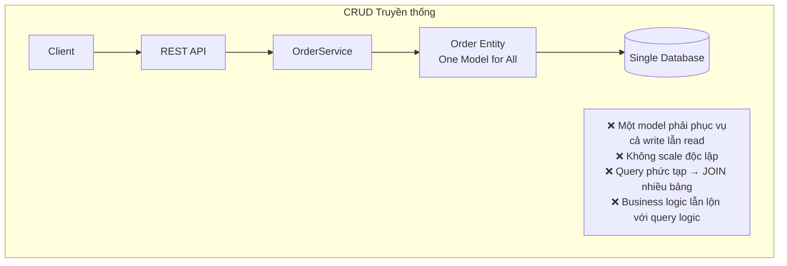

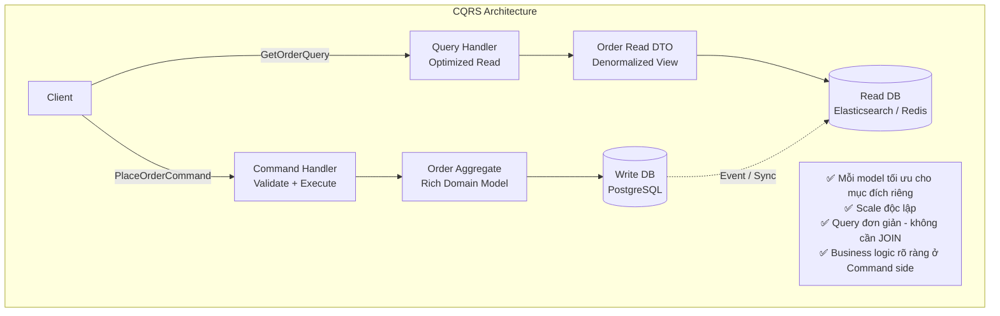

**Bảng so sánh chi tiết:**

| Tiêu chí             | CRUD Truyền thống          | CQRS                                 |
| -------------------- | -------------------------- | ------------------------------------ |
| **Model**            | 1 model dùng chung         | Write model và Read model riêng biệt |
| **Database**         | 1 database                 | Có thể 1 hoặc nhiều DB               |
| **Complexity**       | Thấp                       | Cao hơn                              |
| **Performance Read** | Phụ thuộc schema của write | Tối ưu riêng cho từng use case       |
| **Scalability**      | Scale cùng nhau            | Scale độc lập                        |
| **Consistency**      | Strong consistency         | Thường là eventual consistency       |
| **Audit Trail**      | Khó (chỉ lưu state cuối)   | Dễ (có thể kết hợp Event Sourcing)   |
| **Phù hợp**          | CRUD đơn giản, team nhỏ    | Domain phức tạp, hệ thống lớn        |

## 4. Write Model và Read Model

### 4.1 Write Model (Command Model)

Write Model là **trái tim của domain logic**. Đây là nơi chứa đựng toàn bộ business rules, invariants, và state transitions.

**Đặc điểm:**

- Sử dụng **Domain Entities** và **Aggregates** (theo DDD)
- **Normalized** — không duplicate data
- Tối ưu cho **tính toàn vẹn dữ liệu** (ACID transactions)
- Có thể sử dụng **RDBMS** (PostgreSQL, MySQL) để đảm bảo consistency
- **Thường là nguồn sự thật (Source of Truth)**

**Ví dụ Write Model trong E-Commerce:**

```java
// Write Model - Order Aggregate (Domain Entity)
// Chứa toàn bộ business rules
public class Order {
    private String id;
    private String customerId;
    private List<OrderLine> lines;
    private OrderStatus status;
    private Money totalAmount;
    private ShippingAddress shippingAddress;
    private LocalDateTime createdAt;

    // Business rule: chỉ có thể cancel khi chưa shipped
    public void cancel(String reason) {
        if (this.status == OrderStatus.SHIPPED || this.status == OrderStatus.DELIVERED) {
            throw new InvalidOrderStateException("Cannot cancel order in status: " + this.status);
        }
        this.status = OrderStatus.CANCELLED;
        // Emit domain event...
    }

    // Business rule: chỉ có thể confirm khi đã thanh toán
    public void confirm(PaymentConfirmation payment) {
        if (!payment.isSuccessful()) {
            throw new PaymentFailedException(payment.getFailureReason());
        }
        this.status = OrderStatus.CONFIRMED;
    }
}
```

### 4.2 Read Model (Query Model)

Read Model là **projection** — một dạng nhìn khác của dữ liệu, được tối ưu hoá hoàn toàn cho nhu cầu đọc của từng use case cụ thể.

**Đặc điểm:**

- **Denormalized** — dữ liệu có thể bị duplicate để tránh JOIN
- Tối ưu cho **tốc độ query**
- Có thể dùng **nhiều loại storage** khác nhau (Elasticsearch, Redis, MongoDB, Cassandra)
- **Có thể có nhiều Read Model khác nhau** cho các use case khác nhau
- Được **rebuild lại** từ Write Model khi cần thiết

**Ví dụ Read Model trong E-Commerce:**

```java
// Read Model 1: Danh sách đơn hàng của khách hàng
// Denormalized: chứa cả tên khách, tên sản phẩm — không cần JOIN
public class OrderSummaryView {
    private String orderId;
    private String customerName;    // Denormalized từ Customer
    private String customerEmail;   // Denormalized từ Customer
    private String status;
    private BigDecimal totalAmount;
    private int itemCount;
    private LocalDateTime createdAt;
    // Không có business logic — chỉ là data container
}

// Read Model 2: Chi tiết đơn hàng cho màn hình tracking
public class OrderDetailView {
    private String orderId;
    private List<OrderLineView> lines;  // Đã include tên sản phẩm, ảnh, giá
    private String trackingNumber;
    private String estimatedDelivery;
    private List<OrderTimelineEvent> timeline; // Pre-computed timeline
}

// Read Model 3: Báo cáo doanh thu (màn hình admin)
public class RevenueReportView {
    private String period;
    private BigDecimal totalRevenue;
    private int totalOrders;
    private BigDecimal averageOrderValue;
    private List<TopProductView> topProducts;
    private Map<String, BigDecimal> revenueByCategory;
}
```

### 4.3 Tại sao Read Model khác Write Model?

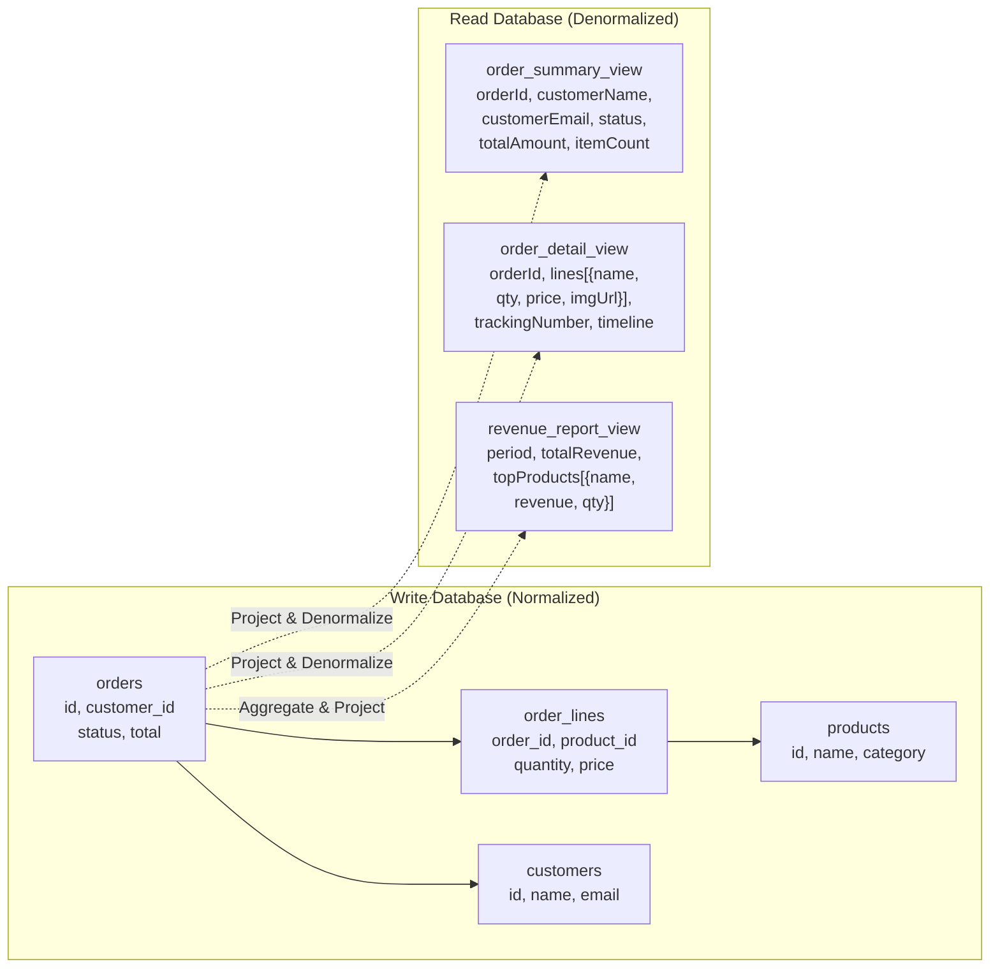

**Key insight:** Read Model được pre-compute và denormalize, nên query chỉ cần đọc **một row duy nhất** thay vì JOIN nhiều bảng.

## 5. Các biến thể triển khai CQRS

### 5.1 CQRS có bắt buộc dùng 2 Database không?

**Câu trả lời ngắn: KHÔNG.**

CQRS là về **sự tách biệt của model (logic)**, không phải về **sự tách biệt của storage (physical)**. Có 3 cấp độ triển khai:

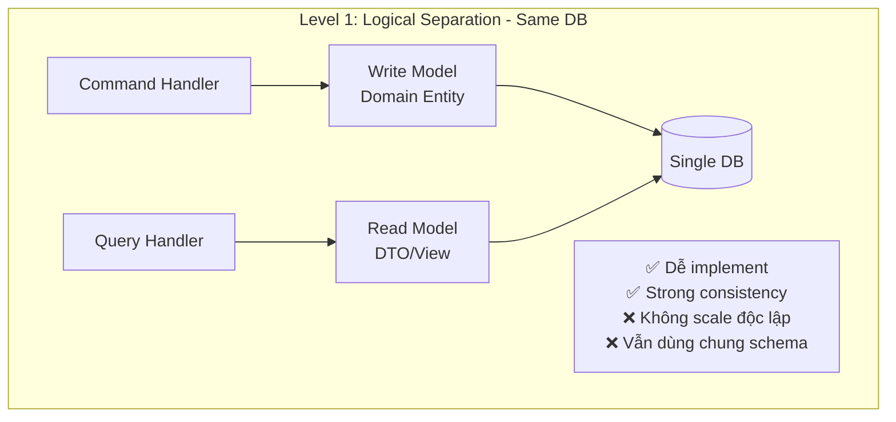

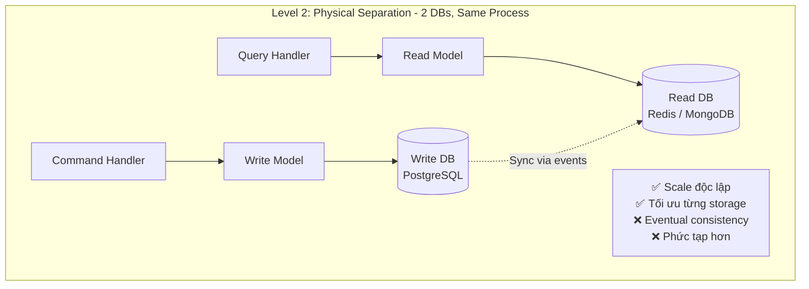

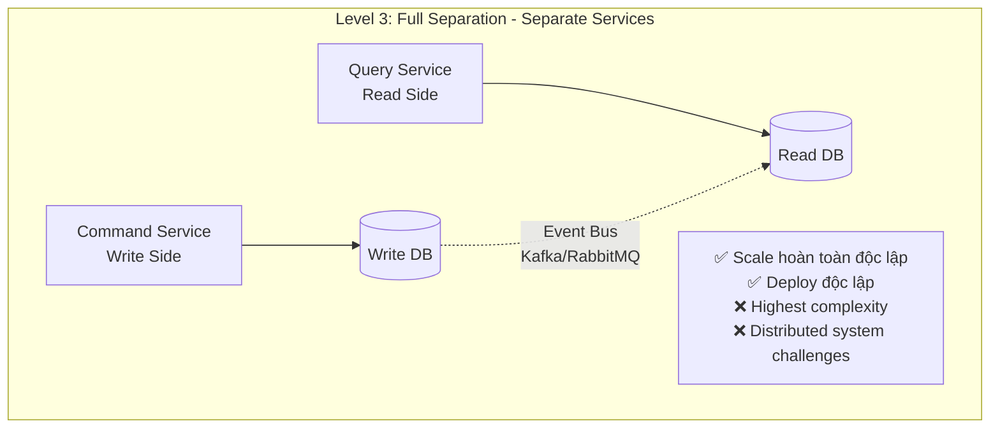

**Khuyến nghị:** Bắt đầu với **Level 1**, tiến lên Level 2 hoặc 3 khi có nhu cầu thực sự.

### 5.2 So sánh 3 biến thể

| Tiêu chí           | Level 1 (Logical) | Level 2 (2 DBs)     | Level 3 (Separate Services) |
| ------------------ | ----------------- | ------------------- | --------------------------- |
| **Complexity**     | Thấp              | Trung bình          | Cao                         |
| **Consistency**    | Strong            | Eventual            | Eventual                    |
| **Scale**          | Cùng nhau         | Độc lập (app level) | Hoàn toàn độc lập           |
| **Infrastructure** | 1 DB              | 2+ DBs              | 2+ DBs + Message Broker     |
| **Khi nào dùng**   | Bắt đầu với CQRS  | Cần scale khác nhau | Microservices, high load    |

## 6. CQRS và Event Sourcing: Quan hệ thực sự là gì?

### 6.1 CQRS có bắt buộc dùng Event Sourcing không?

**Câu trả lời: KHÔNG. Đây là hai pattern độc lập.**

Nhiều người nhầm lẫn CQRS và Event Sourcing là một, nhưng thực tế:

- CQRS ≠ Event Sourcing
- CQRS có thể kết hợp với Event Sourcing
- CQRS có thể KHÔNG dùng Event Sourcing
- Event Sourcing có thể KHÔNG dùng CQRS

### 6.2 Event Sourcing là gì?

**Event Sourcing** là pattern lưu trữ **chuỗi các sự kiện (events)** thay vì lưu trạng thái hiện tại.

```
CRUD: Lưu trạng thái hiện tại
  orders table: {id: "123", status: "SHIPPED", total: 500}

Event Sourcing: Lưu chuỗi events dẫn đến trạng thái đó
  events: [
    OrderPlaced      {orderId: "123", total: 500, at: "09:00"}
    PaymentConfirmed {orderId: "123", paymentId: "P1", at: "09:05"}
    OrderShipped     {orderId: "123", trackingNo: "TK1", at: "10:30"}
  ]
```

### 6.3 Bốn tổ hợp có thể

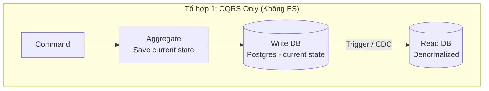

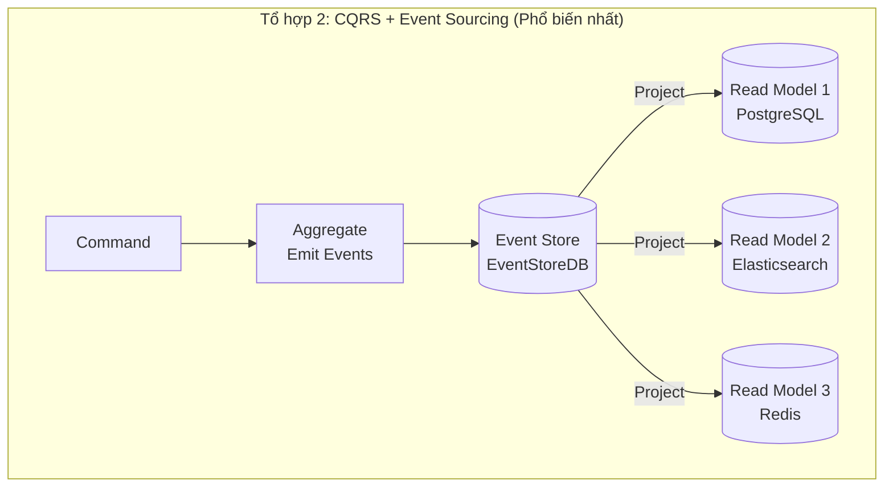

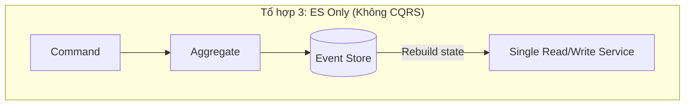

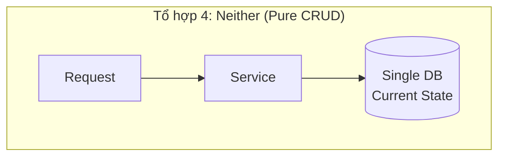

### 6.4 Khi nào nên kết hợp CQRS + Event Sourcing?

**Nên kết hợp khi:**

- Cần **audit trail** đầy đủ (fintech, healthcare, e-commerce enterprise)
- Cần khả năng **replay events** để rebuild state
- Cần **temporal queries** (trạng thái của hệ thống tại thời điểm T trong quá khứ)
- Cần **multiple read models** từ cùng một nguồn dữ liệu
- Khi có **bug trong Read Model** → có thể rebuild lại từ events

**KHÔNG nên kết hợp khi:**

- Hệ thống đơn giản, CRUD là đủ
- Team chưa quen với event-driven architecture
- Không có yêu cầu về audit trail hoặc temporal queries

## 7. Tại sao CQRS mạnh mẽ cho Reporting & Search?

### 7.1 Vấn đề với CRUD trong Reporting

Trong CRUD truyền thống, một query báo cáo doanh thu có thể trông như này:

```sql
-- CRUD: Query báo cáo đau đầu
SELECT
    DATE_TRUNC('month', o.created_at) as month,
    c.name as category_name,
    COUNT(o.id) as total_orders,
    SUM(ol.quantity * ol.unit_price) as revenue,
    AVG(ol.quantity * ol.unit_price) as avg_order_value,
    p.name as top_product
FROM orders o
JOIN order_lines ol ON ol.order_id = o.id
JOIN products p ON p.id = ol.product_id
JOIN categories c ON c.id = p.category_id
JOIN customers cu ON cu.id = o.customer_id
WHERE o.status = 'COMPLETED'
  AND o.created_at BETWEEN :startDate AND :endDate
GROUP BY DATE_TRUNC('month', o.created_at), c.name, p.name
ORDER BY revenue DESC;
```

**Hệ quả:**

- Query này **lock** nhiều bảng → ảnh hưởng đến write performance
- Khi scale, phải scale **cả write lẫn read** cho dù chỉ report mới cần tài nguyên
- Khi thêm index để tối ưu query → ảnh hưởng đến write performance
- Không thể dùng **full-text search** hay **geospatial query** trên RDBMS thông thường

### 7.2 CQRS giải quyết vấn đề Reporting

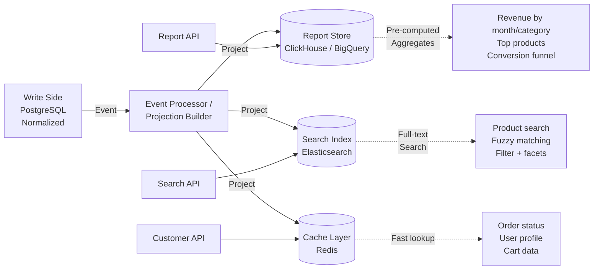

**Lợi ích cụ thể:**

**1. Pre-computed Read Models:**

```java
// Report Store đã được pre-compute
// Query chỉ cần SELECT * WHERE period = '2024-01' — cực kỳ nhanh
public class MonthlyRevenueReport {
    private String period;           // "2024-01"
    private BigDecimal totalRevenue;
    private int totalOrders;
    private BigDecimal avgOrderValue;
    private List<CategoryRevenue> byCategory;  // Đã aggregated sẵn
    private List<TopProduct> topProducts;      // Đã ranked sẵn
    // Updated incrementally khi có Order event mới
}
```

**2. Tách biệt hoàn toàn Read vs Write load:**

- Báo cáo chạy trên **Read DB riêng** → không ảnh hưởng production write
- Có thể chạy **báo cáo nặng** mà không lo ảnh hưởng checkout flow
- **Scale Read DB** riêng khi traffic tăng mà không cần scale Write DB

**3. Dùng đúng công cụ cho đúng mục đích:**

| Use Case         | CRUD (sai)                 | CQRS (đúng)                       |
| ---------------- | -------------------------- | --------------------------------- |
| Full-text search | SQL LIKE '%..%' trên RDBMS | Elasticsearch với inverted index  |
| Revenue reports  | Complex JOIN trên prod DB  | Pre-aggregated trong ClickHouse   |
| Real-time status | Query prod DB              | Redis cache, cập nhật theo events |
| Geospatial       | Không hiệu quả             | PostGIS / Elasticsearch Geo       |
| Dashboard        | Chậm, lock tables          | Pre-computed materialized views   |

### 7.3 Ví dụ E-Commerce: Search màn hình sản phẩm

```
CRUD Approach:
  GET /products?keyword=iphone&category=phone&priceMin=500&priceMax=1500&brand=Apple
  → SQL: SELECT * FROM products p JOIN categories c ON ... JOIN brands b ON ...
         WHERE p.name LIKE '%iphone%' AND c.name = 'phone'
         AND p.price BETWEEN 500 AND 1500 AND b.name = 'Apple'
  → Full table scan, slow, no ranking

CQRS Approach:
  GET /products/search?keyword=iphone&category=phone&priceMin=500&priceMax=1500&brand=Apple
  → Elasticsearch query với full-text search, pre-indexed filters, relevance scoring
  → Response time: < 50ms bất kể data size
  → Supports: typo tolerance, synonyms, faceted search, ranking by relevance
```

## 8. Triển khai CQRS trong Java — E-Commerce

### 8.1 Tổng quan kiến trúc hệ thống

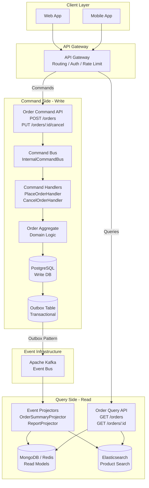

### 8.2 Command Side Implementation

#### 8.2.1 Command Objects

```java
// Commands là immutable value objects — thể hiện intent
// Sử dụng record (Java 16+) hoặc @Value (Lombok)

public record PlaceOrderCommand(
    String customerId,
    List<OrderItemRequest> items,
    String shippingAddressId,
    String paymentMethodId
) {}

public record CancelOrderCommand(
    String orderId,
    String customerId,
    String cancellationReason
) {}

public record OrderItemRequest(
    String productId,
    int quantity,
    BigDecimal unitPrice // Lấy từ catalog service tại thời điểm order
) {}
```

#### 8.2.2 Command Bus

```java
// Command Bus: trung gian định tuyến Command đến đúng Handler
// Có thể implement đơn giản hoặc dùng Axon Framework

public interface CommandBus {
    <R> CompletableFuture<R> dispatch(Object command);
}

@Component
public class SimpleCommandBus implements CommandBus {

    private final Map<Class<?>, CommandHandler<?>> handlers = new HashMap<>();

    @Override
    @SuppressWarnings("unchecked")
    public <R> CompletableFuture<R> dispatch(Object command) {
        CommandHandler<Object> handler = (CommandHandler<Object>) handlers.get(command.getClass());
        if (handler == null) {
            throw new CommandHandlerNotFoundException("No handler for: " + command.getClass().getName());
        }
        return CompletableFuture.supplyAsync(() -> (R) handler.handle(command));
    }

    public <C> void registerHandler(Class<C> commandType, CommandHandler<C> handler) {
        handlers.put(commandType, handler);
    }
}
```

#### 8.2.3 Order Aggregate (Write Model)

```java
// Order Aggregate: chứa toàn bộ business rules và invariants
// Đây là "Write Model" — normalized, rich domain logic

@Entity
@Table(name = "orders")
public class Order {

    @Id
    private String id;

    @Column(name = "customer_id", nullable = false)
    private String customerId;

    @Enumerated(EnumType.STRING)
    private OrderStatus status;

    @OneToMany(cascade = CascadeType.ALL, fetch = FetchType.EAGER)
    @JoinColumn(name = "order_id")
    private List<OrderLine> lines;

    @Embedded
    private Money totalAmount;

    @Column(name = "created_at")
    private LocalDateTime createdAt;

    // Domain Events để publish ra ngoài
    @Transient
    private List<DomainEvent> domainEvents = new ArrayList<>();

    // Factory method — entry point để tạo order
    public static Order place(String customerId, List<OrderLine> lines,
                               ShippingAddress address) {
        // Validate business invariants
        if (lines == null || lines.isEmpty()) {
            throw new InvalidOrderException("Order must have at least one item");
        }

        BigDecimal total = lines.stream()
            .map(l -> l.getUnitPrice().multiply(BigDecimal.valueOf(l.getQuantity())))
            .reduce(BigDecimal.ZERO, BigDecimal::add);

        if (total.compareTo(BigDecimal.ZERO) <= 0) {
            throw new InvalidOrderException("Order total must be positive");
        }

        Order order = new Order();
        order.id = UUID.randomUUID().toString();
        order.customerId = customerId;
        order.lines = lines;
        order.status = OrderStatus.PENDING_PAYMENT;
        order.totalAmount = new Money(total, "VND");
        order.createdAt = LocalDateTime.now();

        // Raise domain event
        order.domainEvents.add(new OrderPlacedEvent(order.id, customerId, total, LocalDateTime.now()));

        return order;
    }

    // Business operation: Cancel order
    public void cancel(String reason) {
        // Invariant: chỉ cancel được khi chưa shipped
        if (this.status == OrderStatus.SHIPPED || this.status == OrderStatus.DELIVERED) {
            throw new OrderCannotBeCancelledException(
                "Cannot cancel order " + id + " with status: " + this.status
            );
        }

        this.status = OrderStatus.CANCELLED;
        this.domainEvents.add(new OrderCancelledEvent(this.id, reason, LocalDateTime.now()));
    }

    // Business operation: Confirm payment
    public void confirmPayment(String paymentTransactionId) {
        if (this.status != OrderStatus.PENDING_PAYMENT) {
            throw new InvalidOrderStateException("Order is not in PENDING_PAYMENT state");
        }
        this.status = OrderStatus.CONFIRMED;
        this.domainEvents.add(new OrderConfirmedEvent(this.id, paymentTransactionId));
    }

    public List<DomainEvent> pullDomainEvents() {
        List<DomainEvent> events = new ArrayList<>(this.domainEvents);
        this.domainEvents.clear();
        return events;
    }

    // Getters only — no setters (enforce state change via methods)
    public String getId() { return id; }
    public OrderStatus getStatus() { return status; }
}
```

#### 8.2.4 Command Handlers

```java
// Command Handler: orchestrate việc thực thi command
// Không chứa business logic — delegate sang Aggregate

@Component
@Transactional
public class PlaceOrderCommandHandler implements CommandHandler<PlaceOrderCommand> {

    private final OrderRepository orderRepository;
    private final ProductCatalogClient productCatalog;
    private final InventoryService inventoryService;
    private final OutboxEventPublisher eventPublisher;

    @Override
    public String handle(PlaceOrderCommand command) {
        // 1. Validate: kiểm tra sản phẩm còn hàng
        List<OrderLine> orderLines = command.items().stream()
            .map(item -> {
                Product product = productCatalog.getProduct(item.productId());
                inventoryService.assertInStock(item.productId(), item.quantity());
                return new OrderLine(item.productId(), product.getName(),
                                     item.quantity(), item.unitPrice());
            })
            .toList();

        // 2. Execute: Tạo Order Aggregate (business logic ở đây)
        Order order = Order.place(command.customerId(), orderLines,
                                   getShippingAddress(command.shippingAddressId()));

        // 3. Persist write model
        orderRepository.save(order);

        // 4. Publish domain events qua Outbox Pattern (đảm bảo at-least-once delivery)
        List<DomainEvent> events = order.pullDomainEvents();
        eventPublisher.publish(events);

        return order.getId();
    }
}

@Component
@Transactional
public class CancelOrderCommandHandler implements CommandHandler<CancelOrderCommand> {

    private final OrderRepository orderRepository;
    private final OutboxEventPublisher eventPublisher;

    @Override
    public Void handle(CancelOrderCommand command) {
        // 1. Load aggregate từ write DB
        Order order = orderRepository.findById(command.orderId())
            .orElseThrow(() -> new OrderNotFoundException(command.orderId()));

        // 2. Verify ownership (authorization)
        if (!order.getCustomerId().equals(command.customerId())) {
            throw new UnauthorizedException("Order does not belong to customer");
        }

        // 3. Execute business operation — business rule validate trong aggregate
        order.cancel(command.cancellationReason());

        // 4. Persist
        orderRepository.save(order);
        eventPublisher.publish(order.pullDomainEvents());

        return null;
    }
}
```

#### 8.2.5 REST Controller — Command Side

```java
@RestController
@RequestMapping("/api/v1/orders")
public class OrderCommandController {

    private final CommandBus commandBus;

    // POST: tạo đơn hàng mới — Command
    @PostMapping
    public ResponseEntity<PlaceOrderResponse> placeOrder(
            @RequestBody PlaceOrderRequest request,
            @AuthenticationPrincipal UserDetails currentUser) {

        PlaceOrderCommand command = new PlaceOrderCommand(
            currentUser.getUsername(),
            request.getItems(),
            request.getShippingAddressId(),
            request.getPaymentMethodId()
        );

        // Command trả về ID, không trả về full object
        // Theo CQRS, sau khi command xong → client phải QUERY để lấy data
        CompletableFuture<String> future = commandBus.dispatch(command);
        String orderId = future.join();

        // 202 Accepted — không trả về full order data
        return ResponseEntity
            .accepted()
            .header("Location", "/api/v1/orders/" + orderId)
            .body(new PlaceOrderResponse(orderId, "Order placed successfully"));
    }

    // DELETE (cancel): hủy đơn hàng — Command
    @PostMapping("/{orderId}/cancel")
    public ResponseEntity<Void> cancelOrder(
            @PathVariable String orderId,
            @RequestBody CancelOrderRequest request,
            @AuthenticationPrincipal UserDetails currentUser) {

        CancelOrderCommand command = new CancelOrderCommand(
            orderId, currentUser.getUsername(), request.getReason()
        );

        commandBus.dispatch(command).join();
        return ResponseEntity.accepted().build();
    }
}
```

### 8.3 Event Infrastructure (Domain Events & Outbox)

#### 8.3.1 Domain Events

```java
// Domain Events: immutable records của những gì đã xảy ra
public interface DomainEvent {
    String getEventId();
    String getAggregateId();
    LocalDateTime getOccurredAt();
    String getEventType();
}

public record OrderPlacedEvent(
    String eventId,
    String orderId,
    String customerId,
    BigDecimal totalAmount,
    LocalDateTime occurredAt
) implements DomainEvent {

    public OrderPlacedEvent(String orderId, String customerId,
                             BigDecimal total, LocalDateTime at) {
        this(UUID.randomUUID().toString(), orderId, customerId, total, at);
    }

    @Override public String getAggregateId() { return orderId; }
    @Override public String getEventType() { return "ORDER_PLACED"; }
}

public record OrderCancelledEvent(
    String eventId,
    String orderId,
    String reason,
    LocalDateTime occurredAt
) implements DomainEvent {
    @Override public String getAggregateId() { return orderId; }
    @Override public String getEventType() { return "ORDER_CANCELLED"; }
}
```

#### 8.3.2 Outbox Pattern — Đảm bảo Reliability

> **Outbox Pattern** đảm bảo rằng khi save Order vào DB thành công, event sẽ CHẮC CHẮN được publish ra Kafka — tránh trường hợp save DB thành công nhưng publish Kafka thất bại.

```java
// Outbox table: lưu events cùng transaction với aggregate
@Entity
@Table(name = "outbox_events")
public class OutboxEvent {
    @Id
    private String id;
    private String aggregateId;
    private String eventType;

    @Column(columnDefinition = "jsonb")
    private String payload;

    @Enumerated(EnumType.STRING)
    private OutboxStatus status = OutboxStatus.PENDING;

    private LocalDateTime createdAt;
    private LocalDateTime processedAt;
}

// Publisher: lưu event vào outbox trong cùng transaction
@Component
public class OutboxEventPublisher {

    private final OutboxRepository outboxRepository;
    private final ObjectMapper objectMapper;

    @Transactional  // Cùng transaction với business operation
    public void publish(List<DomainEvent> events) {
        events.forEach(event -> {
            OutboxEvent outboxEvent = new OutboxEvent();
            outboxEvent.setId(event.getEventId());
            outboxEvent.setAggregateId(event.getAggregateId());
            outboxEvent.setEventType(event.getEventType());
            outboxEvent.setPayload(toJson(event));
            outboxEvent.setCreatedAt(LocalDateTime.now());
            outboxRepository.save(outboxEvent);
        });
    }
}

// Relay: background job đọc outbox và publish lên Kafka
@Component
@Slf4j
public class OutboxEventRelay {

    private final OutboxRepository outboxRepository;
    private final KafkaTemplate<String, String> kafkaTemplate;

    @Scheduled(fixedDelay = 100) // Mỗi 100ms
    @Transactional
    public void relayEvents() {
        List<OutboxEvent> pendingEvents = outboxRepository.findPendingEvents(100);

        pendingEvents.forEach(event -> {
            try {
                kafkaTemplate.send("order-events", event.getAggregateId(), event.getPayload());
                event.setStatus(OutboxStatus.PUBLISHED);
                event.setProcessedAt(LocalDateTime.now());
                outboxRepository.save(event);
            } catch (Exception e) {
                log.error("Failed to relay event: {}", event.getId(), e);
                // Retry logic — event vẫn ở PENDING, sẽ retry lần sau
            }
        });
    }
}
```

### 8.4 Query Side Implementation

#### 8.4.1 Query Objects

```java
// Queries — thể hiện yêu cầu đọc data
public record GetOrderQuery(String orderId, String customerId) {}

public record GetOrderHistoryQuery(
    String customerId,
    int page,
    int size,
    OrderStatus statusFilter,
    LocalDateTime fromDate,
    LocalDateTime toDate
) {}

public record SearchProductsQuery(
    String keyword,
    String categoryId,
    BigDecimal priceMin,
    BigDecimal priceMax,
    String brand,
    SortOption sortBy,
    int page,
    int size
) {}

public record GetRevenueReportQuery(
    String startPeriod,  // "2024-01"
    String endPeriod,    // "2024-03"
    String groupBy       // "day", "week", "month"
) {}
```

#### 8.4.2 Read Model DTOs

```java
// Read Models — optimized cho từng use case cụ thể

// Dùng cho màn hình danh sách đơn hàng
public record OrderSummaryDto(
    String orderId,
    String status,
    BigDecimal totalAmount,
    String currencyCode,
    int itemCount,
    LocalDateTime createdAt,
    String trackingNumber  // Denormalized từ shipping service
) {}

// Dùng cho màn hình chi tiết đơn hàng
public record OrderDetailDto(
    String orderId,
    CustomerDto customer,
    List<OrderLineDto> lines,
    AddressDto shippingAddress,
    PaymentSummaryDto payment,
    ShippingTrackingDto tracking,
    List<OrderTimelineEventDto> timeline
) {}

// Dùng cho màn hình search sản phẩm
public record ProductSearchResultDto(
    String productId,
    String name,
    String description,
    BigDecimal price,
    String imageUrl,
    double averageRating,
    int reviewCount,
    boolean inStock,
    String brandName,
    String categoryPath  // "Electronics > Phones > Smartphones"
) {}
```

#### 8.4.3 Event Projectors

```java
// Projector: lắng nghe events từ Kafka, cập nhật Read Models

@Component
@Slf4j
public class OrderReadModelProjector {

    private final OrderReadModelRepository readModelRepository;  // MongoDB
    private final RedisTemplate<String, OrderSummaryDto> redisTemplate;

    // Consume events từ Kafka và cập nhật Read Model
    @KafkaListener(topics = "order-events", groupId = "order-read-model-projector")
    public void handleOrderEvent(String eventJson) {
        DomainEventEnvelope envelope = parseEvent(eventJson);

        switch (envelope.getEventType()) {
            case "ORDER_PLACED"     -> handleOrderPlaced(envelope);
            case "ORDER_CONFIRMED"  -> handleOrderConfirmed(envelope);
            case "ORDER_SHIPPED"    -> handleOrderShipped(envelope);
            case "ORDER_CANCELLED"  -> handleOrderCancelled(envelope);
            default -> log.warn("Unknown event type: {}", envelope.getEventType());
        }
    }

    private void handleOrderPlaced(DomainEventEnvelope envelope) {
        OrderPlacedEvent event = parse(envelope, OrderPlacedEvent.class);

        // Tạo Read Model document
        OrderReadDocument doc = OrderReadDocument.builder()
            .orderId(event.orderId())
            .customerId(event.customerId())
            .status("PENDING_PAYMENT")
            .totalAmount(event.totalAmount())
            .createdAt(event.occurredAt())
            .build();

        readModelRepository.save(doc);

        // Invalidate cache nếu có
        redisTemplate.delete("order:" + event.orderId());
    }

    private void handleOrderShipped(DomainEventEnvelope envelope) {
        OrderShippedEvent event = parse(envelope, OrderShippedEvent.class);

        // Cập nhật Read Model — chỉ update field cần thiết
        readModelRepository.updateStatusAndTracking(
            event.orderId(),
            "SHIPPED",
            event.trackingNumber(),
            event.estimatedDelivery()
        );

        // Invalidate cache
        redisTemplate.delete("order:" + event.orderId());
    }
}

// Projector riêng cho Search (Elasticsearch)
@Component
public class ProductSearchProjector {

    private final ElasticsearchOperations elasticsearchOperations;

    @KafkaListener(topics = "product-events", groupId = "product-search-projector")
    public void handleProductEvent(String eventJson) {
        // Upsert vào Elasticsearch index khi product được tạo/cập nhật
        DomainEventEnvelope envelope = parseEvent(eventJson);

        if ("PRODUCT_UPDATED".equals(envelope.getEventType())) {
            ProductUpdatedEvent event = parse(envelope, ProductUpdatedEvent.class);

            ProductDocument doc = ProductDocument.builder()
                .id(event.productId())
                .name(event.name())
                .description(event.description())
                .price(event.price())
                .categoryPath(event.categoryPath())
                .brandName(event.brandName())
                .inStock(event.inStock())
                .tags(event.tags())
                .build();

            elasticsearchOperations.save(doc);
        }
    }
}
```

#### 8.4.4 Query Handlers

```java
// Query Handlers: chỉ đọc từ Read Model — không có business logic phức tạp

@Component
public class GetOrderQueryHandler {

    private final OrderReadModelRepository readModelRepository;
    private final RedisTemplate<String, OrderDetailDto> cache;

    public OrderDetailDto handle(GetOrderQuery query) {
        // 1. Try cache first
        String cacheKey = "order:" + query.orderId();
        OrderDetailDto cached = cache.opsForValue().get(cacheKey);
        if (cached != null) return cached;

        // 2. Query Read Model (MongoDB) — single document lookup, no JOIN
        OrderReadDocument doc = readModelRepository.findById(query.orderId())
            .orElseThrow(() -> new OrderNotFoundException(query.orderId()));

        // 3. Authorization check
        if (!doc.getCustomerId().equals(query.customerId())) {
            throw new UnauthorizedException("Access denied");
        }

        // 4. Map to DTO
        OrderDetailDto dto = mapToDetailDto(doc);

        // 5. Cache với TTL
        cache.opsForValue().set(cacheKey, dto, Duration.ofMinutes(5));

        return dto;
    }
}

@Component
public class GetOrderHistoryQueryHandler {

    private final OrderReadModelRepository readModelRepository;

    public Page<OrderSummaryDto> handle(GetOrderHistoryQuery query) {
        // Query optimized MongoDB index — không cần JOIN bất kỳ collection nào
        Pageable pageable = PageRequest.of(query.page(), query.size(),
                                            Sort.by("createdAt").descending());

        Page<OrderReadDocument> docs = readModelRepository
            .findByCustomerIdAndStatusAndCreatedAtBetween(
                query.customerId(),
                query.statusFilter(),
                query.fromDate(),
                query.toDate(),
                pageable
            );

        return docs.map(this::mapToSummaryDto);
    }
}

@Component
public class SearchProductsQueryHandler {

    private final ElasticsearchOperations elasticsearchOperations;

    public SearchResult<ProductSearchResultDto> handle(SearchProductsQuery query) {
        // Build Elasticsearch query
        BoolQuery.Builder boolQuery = new BoolQuery.Builder();

        // Full-text search với boost
        if (StringUtils.hasText(query.keyword())) {
            boolQuery.must(MultiMatchQuery.of(m -> m
                .fields("name^3", "description^1", "tags^2")  // Boost name field
                .query(query.keyword())
                .fuzziness("AUTO")  // Typo tolerance
            )._toQuery());
        }

        // Filters — không ảnh hưởng relevance score
        if (StringUtils.hasText(query.categoryId())) {
            boolQuery.filter(TermQuery.of(t -> t.field("categoryId").value(query.categoryId()))._toQuery());
        }
        if (query.priceMin() != null && query.priceMax() != null) {
            boolQuery.filter(RangeQuery.of(r -> r
                .field("price")
                .gte(JsonData.of(query.priceMin()))
                .lte(JsonData.of(query.priceMax()))
            )._toQuery());
        }

        SearchResponse<ProductDocument> response = elasticsearchOperations.search(
            new NativeQuery(boolQuery.build()._toQuery()), ProductDocument.class
        );

        return mapToSearchResult(response);
    }
}
```

#### 8.4.5 REST Controller — Query Side

```java
// Query Controller — chỉ READ, không modify state

@RestController
@RequestMapping("/api/v1/orders")
public class OrderQueryController {

    private final GetOrderQueryHandler getOrderHandler;
    private final GetOrderHistoryQueryHandler historyHandler;

    // GET: lấy chi tiết đơn hàng — Query
    @GetMapping("/{orderId}")
    public ResponseEntity<OrderDetailDto> getOrder(
            @PathVariable String orderId,
            @AuthenticationPrincipal UserDetails currentUser) {

        GetOrderQuery query = new GetOrderQuery(orderId, currentUser.getUsername());
        OrderDetailDto result = getOrderHandler.handle(query);
        return ResponseEntity.ok(result);
    }

    // GET: lịch sử đơn hàng — Query
    @GetMapping
    public ResponseEntity<Page<OrderSummaryDto>> getOrderHistory(
            @RequestParam(defaultValue = "0") int page,
            @RequestParam(defaultValue = "20") int size,
            @RequestParam(required = false) OrderStatus status,
            @AuthenticationPrincipal UserDetails currentUser) {

        GetOrderHistoryQuery query = new GetOrderHistoryQuery(
            currentUser.getUsername(), page, size, status, null, null
        );

        return ResponseEntity.ok(historyHandler.handle(query));
    }
}

@RestController
@RequestMapping("/api/v1/products")
public class ProductQueryController {

    private final SearchProductsQueryHandler searchHandler;

    // GET: search sản phẩm — Query với Elasticsearch
    @GetMapping("/search")
    public ResponseEntity<SearchResult<ProductSearchResultDto>> searchProducts(
            @RequestParam(required = false) String keyword,
            @RequestParam(required = false) String category,
            @RequestParam(required = false) BigDecimal priceMin,
            @RequestParam(required = false) BigDecimal priceMax,
            @RequestParam(defaultValue = "0") int page,
            @RequestParam(defaultValue = "20") int size) {

        SearchProductsQuery query = new SearchProductsQuery(
            keyword, category, priceMin, priceMax, null, null, page, size
        );

        return ResponseEntity.ok(searchHandler.handle(query));
    }
}
```

### 8.5 Tóm tắt Package Structure

```
com.ecommerce
├── order/
│   ├── command/                          # Write Side
│   │   ├── api/
│   │   │   └── OrderCommandController.java
│   │   ├── application/
│   │   │   ├── PlaceOrderCommandHandler.java
│   │   │   └── CancelOrderCommandHandler.java
│   │   ├── domain/
│   │   │   ├── Order.java               # Aggregate (Write Model)
│   │   │   ├── OrderLine.java
│   │   │   ├── OrderStatus.java
│   │   │   └── events/
│   │   │       ├── OrderPlacedEvent.java
│   │   │       └── OrderCancelledEvent.java
│   │   └── infrastructure/
│   │       ├── OrderJpaRepository.java
│   │       └── OutboxEventPublisher.java
│   │
│   └── query/                            # Read Side
│       ├── api/
│       │   └── OrderQueryController.java
│       ├── application/
│       │   ├── GetOrderQueryHandler.java
│       │   └── GetOrderHistoryQueryHandler.java
│       ├── readmodel/
│       │   ├── OrderReadDocument.java   # Read Model (MongoDB)
│       │   └── OrderSummaryDto.java
│       └── projector/
│           └── OrderReadModelProjector.java
│
├── product/
│   ├── command/ ...
│   └── query/
│       ├── readmodel/
│       │   └── ProductDocument.java     # Elasticsearch Document
│       └── projector/
│           └── ProductSearchProjector.java
│
└── shared/
    ├── commandbus/
    │   ├── CommandBus.java
    │   └── SimpleCommandBus.java
    └── events/
        └── DomainEvent.java
```

## 9. Eventual Consistency & Xử lý thực tiễn

### 9.1 Eventual Consistency là gì trong CQRS?

Khi dùng 2 database riêng biệt, sẽ luôn có một khoảng **lag** giữa lúc write model được cập nhật và lúc read model phản ánh thay đổi đó.

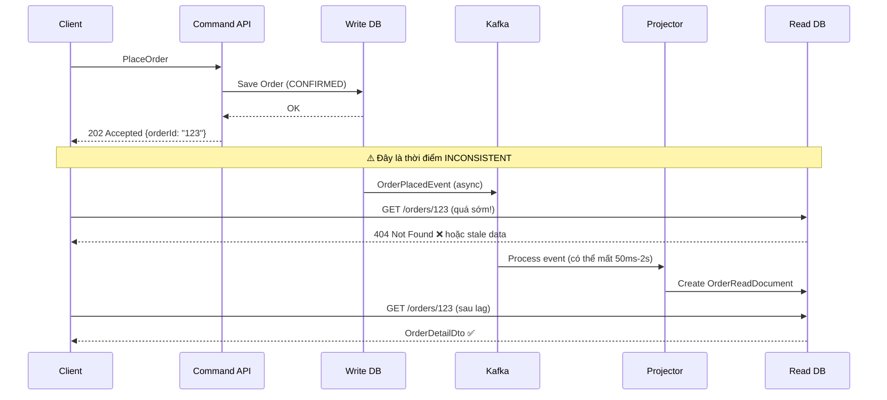

### 9.2 Chiến lược xử lý Eventual Consistency

#### Strategy 1: Optimistic UI Update (Phổ biến nhất)

Client không đợi Read Model cập nhật. Thay vào đó, UI tự cập nhật dựa trên command đã gửi.

```javascript
// Frontend: Sau khi PlaceOrder thành công
async function placeOrder(orderData) {
  const response = await api.post("/orders", orderData);
  const { orderId } = response.data;

  // Optimistic update: hiển thị ngay mà không đợi query
  orderStore.addOrder({
    id: orderId,
    status: "PENDING_PAYMENT", // Assume từ command logic
    items: orderData.items,
    createdAt: new Date(),
  });

  // Navigate đến trang order detail
  router.push(`/orders/${orderId}`);
  // Trang này sẽ hiển thị optimistic data ngay, và poll/refetch từ Read Model sau 1-2 giây
}
```

#### Strategy 2: Polling với Retry

```java
// Client poll Read Model cho đến khi thấy data
@GetMapping("/{orderId}")
public ResponseEntity<OrderDetailDto> getOrder(
        @PathVariable String orderId,
        @RequestParam(defaultValue = "false") boolean waitForConsistency) {

    if (waitForConsistency) {
        // Đợi tối đa 5 giây cho Read Model catch up
        return waitForReadModel(orderId, Duration.ofSeconds(5));
    }

    return ResponseEntity.ok(queryHandler.handle(new GetOrderQuery(orderId)));
}

private ResponseEntity<OrderDetailDto> waitForReadModel(String orderId, Duration timeout) {
    long deadline = System.currentTimeMillis() + timeout.toMillis();

    while (System.currentTimeMillis() < deadline) {
        Optional<OrderDetailDto> result = readModelRepository.findById(orderId)
            .map(this::mapToDto);

        if (result.isPresent()) {
            return ResponseEntity.ok(result.get());
        }

        try { Thread.sleep(100); } catch (InterruptedException e) { break; }
    }

    return ResponseEntity.status(HttpStatus.ACCEPTED)
        .header("Retry-After", "2")
        .body(null); // Client nên retry sau 2 giây
}
```

#### Strategy 3: Read-after-Write Consistency (cho các use case critical)

```java
// Sau khi PlaceOrder, query TRỰC TIẾP từ Write DB (một lần duy nhất)
// Chỉ dùng cho các màn hình quan trọng như order confirmation
@GetMapping("/{orderId}/confirmation")
public ResponseEntity<OrderConfirmationDto> getOrderConfirmation(@PathVariable String orderId) {
    // Query từ Write DB để đảm bảo consistency
    Order order = orderRepository.findById(orderId)
        .orElseThrow(() -> new OrderNotFoundException(orderId));

    return ResponseEntity.ok(mapToConfirmationDto(order));
}
```

### 9.3 Xử lý Projection Failures

```java
// Idempotent Projector — an toàn khi event được process nhiều lần
@Component
public class OrderReadModelProjector {

    @KafkaListener(topics = "order-events")
    public void handle(ConsumerRecord<String, String> record) {
        DomainEventEnvelope envelope = parseEvent(record.value());

        // Idempotency check: đã process event này chưa?
        if (processedEventRepository.existsByEventId(envelope.getEventId())) {
            log.info("Event {} already processed, skipping", envelope.getEventId());
            return; // Skip — không gây ra double-update
        }

        // Process event
        processEvent(envelope);

        // Đánh dấu đã processed
        processedEventRepository.save(new ProcessedEvent(envelope.getEventId()));
    }
}
```

### 9.4 Monitoring Projection Lag

```java
// Monitor: theo dõi lag giữa write và read
@Component
public class ProjectionLagMonitor {

    private final MeterRegistry meterRegistry;

    @Scheduled(fixedDelay = 10_000)
    public void checkProjectionLag() {
        // Lấy timestamp của event mới nhất đã được processed
        LocalDateTime lastProcessed = getLastProcessedEventTimestamp();

        // Tính lag
        long lagMillis = Duration.between(lastProcessed, LocalDateTime.now()).toMillis();

        // Report metric
        meterRegistry.gauge("cqrs.projection.lag.milliseconds", lagMillis);

        // Alert nếu lag quá lớn
        if (lagMillis > 5000) {
            alertService.send("Projection lag exceeds 5 seconds: " + lagMillis + "ms");
        }
    }
}
```

## 10. Khi nào NÊN và KHÔNG NÊN dùng CQRS

### 10.1 NÊN dùng CQRS khi

**1. Read/Write có sự bất đối xứng lớn:**

- Hệ thống có read:write ratio > 10:1
- Query phức tạp (nhiều JOIN, aggregation) ảnh hưởng write performance
- Cần dùng công nghệ khác nhau cho read (Elasticsearch, Redis) và write (PostgreSQL)

**2. Domain Logic phức tạp:**

- Nhiều business rules cần validate khi write
- Cần DDD (Domain-Driven Design) với Aggregates
- Cần audit trail hoặc event history

**3. Hệ thống cần scale độc lập:**

- Write service và Read service có yêu cầu scale khác nhau
- Cần deploy Read service và Write service với SLA khác nhau

**4. Use cases phù hợp:**

- E-commerce (đặt hàng, tồn kho, báo cáo)
- Fintech (giao dịch, số dư, analytics)
- Social platforms (post, feed, notification)
- Logistics (tracking, reporting)

### 10.2 KHÔNG NÊN dùng CQRS khi

**1. CRUD đơn giản:**

- Ứng dụng quản lý nội bộ (admin panel đơn giản)
- Blog, CMS cơ bản
- Form nhập liệu và hiển thị lại

**2. Yêu cầu Strong Consistency tuyệt đối:**

- Hệ thống ngân hàng core (balance phải luôn chính xác 100%)
- Hệ thống real-time trading (giá phải sync tức thì)

**3. Team nhỏ hoặc giai đoạn early-stage:**

- CQRS tăng complexity đáng kể — overhead với team < 5 người
- Startup giai đoạn MVP: CRUD nhanh hơn, dễ iterate hơn

**4. Domain logic đơn giản:**

- Không có business rules phức tạp
- Data ít thay đổi
- Không cần reporting phức tạp

### 10.3 Decision Framework

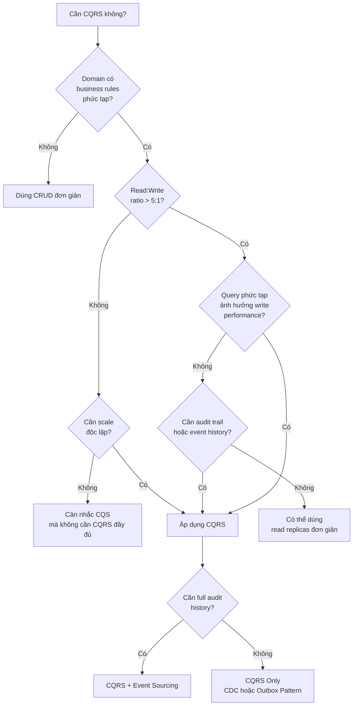

## 11. CQRS trong các hệ thống lớn thực tế

### 11.1 Netflix

Netflix xử lý hàng triệu viewing events mỗi giây. CQRS được áp dụng trong viewing history system:

**Write Side:** Mỗi action (play, pause, stop, seek) được ghi nhận như một event bất đồng bộ.

**Read Side:** Nhiều Read Models được build từ các events đó:

- **Viewing History Service:** Cassandra — lịch sử xem của user
- **Recommendation Engine:** Pre-computed projections cho recommendation
- **Analytics Pipeline:** Aggregated data cho business intelligence
- **Continue Watching:** Redis cache cho quick lookup

**Key insight:** Khi Netflix muốn cải thiện thuật toán recommendation, họ chỉ cần **replay lại events** lịch sử qua algorithm mới — không cần migration database phức tạp.

### 11.2 Amazon

Amazon áp dụng CQRS trong order fulfillment system theo **Bounded Context**:

**Các Command Bounded Contexts:**

- Order Service: xử lý PlaceOrder, CancelOrder
- Inventory Service: ReserveItem, ReleaseItem
- Payment Service: ProcessPayment, RefundPayment
- Shipping Service: CreateShipment, UpdateTrackingStatus

**Các Query Bounded Contexts:**

- Customer Order Portal: Read Model tối ưu cho UI khách hàng
- Warehouse Dashboard: Read Model tối ưu cho warehouse staff
- Analytics: Pre-aggregated data cho business reporting

**Key insight:** "Your order is being processed" — Amazon không claim rằng order đã được confirm hoàn toàn. Đây là cách xử lý elegant cho eventual consistency: acknowledge command, không claim read model đã cập nhật.

### 11.3 LinkedIn

LinkedIn dùng CQRS cho Feed System:

**Write Side:** User post, like, comment → ghi vào write model
**Read Side:** Feed được pre-computed và materialized dưới dạng personalized feed cho từng user

Mỗi user có một "feed projection" được tính sẵn, cập nhật bất đồng bộ khi connections của họ có activity. Đây là lý do tại sao LinkedIn Feed load cực nhanh mặc dù data rất phức tạp.

### 11.4 E-Commerce Platform (Tổng kết Pattern)

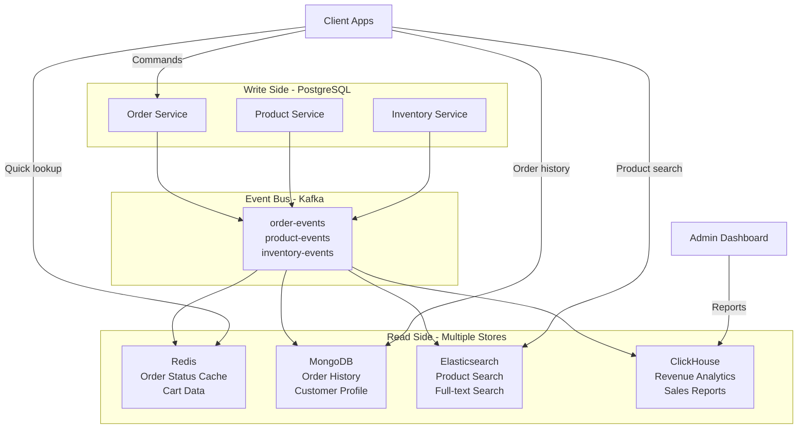

## 12. Anti-Patterns & Pitfalls

### 12.1 Anti-Pattern 1: Áp dụng CQRS cho mọi thứ

```
❌ SAI: Dùng CQRS cho hệ thống quản lý nội bộ đơn giản
❌ SAI: Dùng CQRS cho blog cá nhân
❌ SAI: Dùng CQRS khi team < 5 người và chưa quen với pattern

✅ ĐÚNG: Chỉ áp dụng cho Bounded Contexts có nhu cầu thực sự
✅ ĐÚNG: Bắt đầu với CRUD, migrate sang CQRS khi cần thiết
```

### 12.2 Anti-Pattern 2: Đưa Business Logic vào Query Handler

```java
// ❌ SAI: Query Handler có side effects và business logic
public OrderDetailDto handle(GetOrderQuery query) {
    Order order = readModelRepository.findById(query.orderId());

    // WRONG: Query không được thay đổi state!
    if (order.getViewCount() != null) {
        order.setViewCount(order.getViewCount() + 1); // Side effect!
        readModelRepository.save(order);
    }

    return mapToDto(order);
}

// ✅ ĐÚNG: Query Handler chỉ đọc data
public OrderDetailDto handle(GetOrderQuery query) {
    return readModelRepository.findById(query.orderId())
        .map(this::mapToDto)
        .orElseThrow(() -> new OrderNotFoundException(query.orderId()));
    // Nếu cần track view → phát ra ViewedEvent qua Command
}
```

### 12.3 Anti-Pattern 3: Command trả về đầy đủ data

```java
// ❌ SAI: Command trả về full object — vi phạm CQRS
@PostMapping("/orders")
public ResponseEntity<OrderDetailDto> placeOrder(...) {
    Order order = commandHandler.handle(command);
    OrderDetailDto dto = mapper.toDto(order);  // Đọc từ write model!
    return ResponseEntity.ok(dto);
}

// ✅ ĐÚNG: Command chỉ trả về ID và status
@PostMapping("/orders")
public ResponseEntity<PlaceOrderResponse> placeOrder(...) {
    String orderId = commandHandler.handle(command);
    return ResponseEntity.accepted()
        .header("Location", "/api/orders/" + orderId)
        .body(new PlaceOrderResponse(orderId, "ACCEPTED"));
    // Client dùng Location header để QUERY order detail
}
```

### 12.4 Anti-Pattern 4: Không handle idempotency

```java
// ❌ SAI: Command có thể được process hai lần → Duplicate orders!
public void handle(PlaceOrderCommand command) {
    Order order = Order.place(...);
    orderRepository.save(order);
}

// ✅ ĐÚNG: Idempotency key
public void handle(PlaceOrderCommand command) {
    // Check if already processed (idempotency)
    if (orderRepository.existsByIdempotencyKey(command.idempotencyKey())) {
        log.info("Command already processed: {}", command.idempotencyKey());
        return;
    }

    Order order = Order.place(...);
    order.setIdempotencyKey(command.idempotencyKey());
    orderRepository.save(order);
}
```

### 12.5 Anti-Pattern 5: Bỏ qua Projection Failures

```java
// ❌ SAI: Ignore projection errors — Read Model bị stale vĩnh viễn
@KafkaListener(topics = "order-events")
public void handle(String event) {
    try {
        project(event);
    } catch (Exception e) {
        log.error("Projection failed", e); // Silent failure!
        // Event bị skip → Read Model không bao giờ cập nhật
    }
}

// ✅ ĐÚNG: Dead Letter Queue + monitoring
@KafkaListener(topics = "order-events")
public void handle(ConsumerRecord<String, String> record) {
    try {
        project(record.value());
    } catch (Exception e) {
        log.error("Projection failed for event: {}", record.value(), e);
        // Gửi vào Dead Letter Topic để retry hoặc manual intervention
        deadLetterPublisher.send("order-events.DLT", record);
        // Alert monitoring
        alertService.send("Projection failure: " + e.getMessage());
        // KHÔNG ném exception → không làm block consumer
    }
}
```

### 12.6 Anti-Pattern 6: Không tách Command và Query trong cùng một service

```java
// ❌ SAI: Một service class vừa handle command vừa handle query
@Service
public class OrderService {
    public String placeOrder(PlaceOrderCommand cmd) { ... }  // Command
    public void cancelOrder(CancelOrderCommand cmd) { ... }  // Command
    public OrderDto getOrder(String id) { ... }              // Query ← dùng write model!
    public List<OrderDto> getOrders(String customerId) { ... } // Query ← JOIN nhiều bảng!
}

// ✅ ĐÚNG: Tách rõ ràng
@Service
public class OrderCommandService {
    public String placeOrder(PlaceOrderCommand cmd) { ... }
    public void cancelOrder(CancelOrderCommand cmd) { ... }
}

@Service
public class OrderQueryService {
    public OrderDetailDto getOrder(GetOrderQuery query) { ... }   // Query optimized read model
    public Page<OrderSummaryDto> getOrders(GetOrderHistoryQuery q) { ... }
}
```

## 13. Tổng kết & Checklist

### 13.1 Tổng kết các nguyên tắc cốt lõi

| Nguyên tắc                 | Mô tả                                                                 |
| -------------------------- | --------------------------------------------------------------------- |
| **Separation of Concerns** | Command và Query là hai concern hoàn toàn khác nhau — tách biệt chúng |
| **Model Optimization**     | Write Model tối ưu cho integrity, Read Model tối ưu cho performance   |
| **No Mandatory 2 DBs**     | CQRS là về model separation, không bắt buộc database separation       |
| **No Mandatory ES**        | CQRS và Event Sourcing là độc lập — kết hợp khi có nhu cầu cụ thể     |
| **Eventual Consistency**   | Là trade-off tự nhiên khi dùng 2 DBs — cần design UX cho phù hợp      |
| **Use Selectively**        | Chỉ áp dụng cho Bounded Contexts có nhu cầu thực sự                   |

### 13.2 CQRS Implementation Checklist

**Trước khi bắt đầu:**

- [ ] Xác định rõ Read:Write ratio của hệ thống
- [ ] Xác định Bounded Contexts cần CQRS
- [ ] Team đã hiểu eventual consistency và tradeoffs
- [ ] Đã cân nhắc việc bắt đầu với CRUD đơn giản trước

**Command Side:**

- [ ] Commands là immutable objects với tên imperative verb
- [ ] Command Handlers không chứa business logic — delegate sang Aggregate
- [ ] Aggregates chứa và enforce tất cả business invariants
- [ ] Sử dụng Outbox Pattern để đảm bảo reliable event publishing
- [ ] Commands có idempotency key để tránh duplicate processing
- [ ] Commands trả về ID/status, không trả về full data

**Query Side:**

- [ ] Read Models được denormalized cho từng use case cụ thể
- [ ] Query Handlers không có side effects
- [ ] Sử dụng đúng storage technology (Elasticsearch, Redis, MongoDB tùy use case)
- [ ] Projectors xử lý events idempotently
- [ ] Dead Letter Queue cho projection failures

**Eventual Consistency:**

- [ ] UX đã thiết kế để chấp nhận eventual consistency
- [ ] Có monitoring cho projection lag
- [ ] Alert khi projection lag vượt ngưỡng SLA
- [ ] Có chiến lược rõ ràng cho read-after-write consistency khi cần

**Testing:**

- [ ] Unit test: Command Handlers với mock repositories
- [ ] Unit test: Aggregates với business rule scenarios
- [ ] Integration test: Projectors với test events
- [ ] E2E test: Full flow từ Command đến Read Model

### 13.3 Quick Reference — CQRS vs CRUD

**Câu hỏi:** Hệ thống này có cần CQRS không?

Dùng CQRS khi:

- ✅ Domain business logic phức tạp, nhiều invariants
- ✅ Read:Write ratio cao (> 10:1)
- ✅ Cần scale read và write độc lập
- ✅ Query phức tạp (reporting, search, aggregation)
- ✅ Cần audit trail hoặc temporal queries
- ✅ Hệ thống microservices với event-driven architecture

Dùng CRUD khi:

- ✅ CRUD đơn giản, ít business rules
- ✅ Team nhỏ, early-stage product
- ✅ Cần strong consistency ở mọi nơi
- ✅ Không có sự bất đối xứng read/write
- ✅ Delivery speed quan trọng hơn scalability

## Tài liệu tham khảo

- **Martin Fowler** — [CQRS](https://martinfowler.com/bliki/CQRS.html)
- **Greg Young** — [CQRS Documents](https://cqrs.files.wordpress.com/2010/11/cqrs_documents.pdf)
- **Microsoft Azure Architecture Center** — [CQRS Pattern](https://learn.microsoft.com/en-us/azure/architecture/patterns/cqrs)
- **Axon Framework** — [https://docs.axoniq.io](https://docs.axoniq.io)
- **Vaughn Vernon** — _Implementing Domain-Driven Design_ (Chapter on CQRS)
- **Sam Newman** — _Building Microservices_ (Chapter on Event-Driven Architecture)
- **AWS Blog** — [Build a CQRS Event Store with Amazon DynamoDB](https://aws.amazon.com/blogs/database/build-a-cqrs-event-store-with-amazon-dynamodb/)
