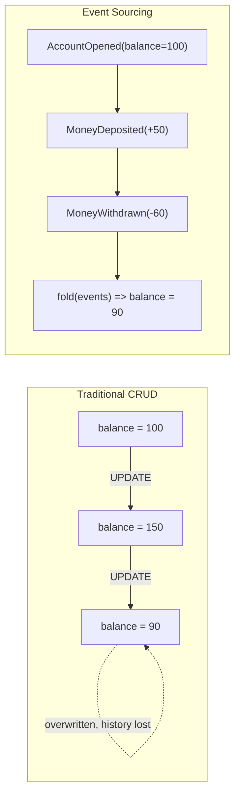
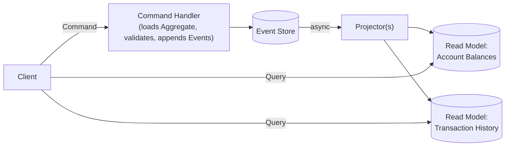
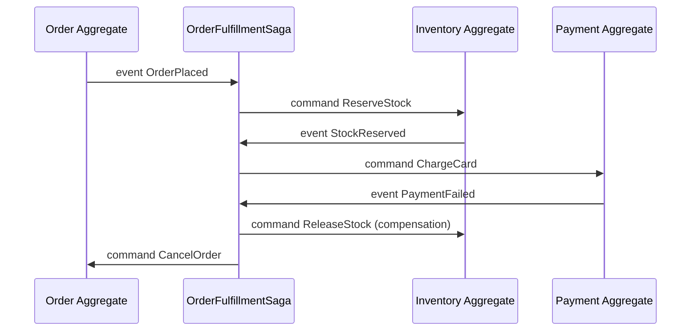
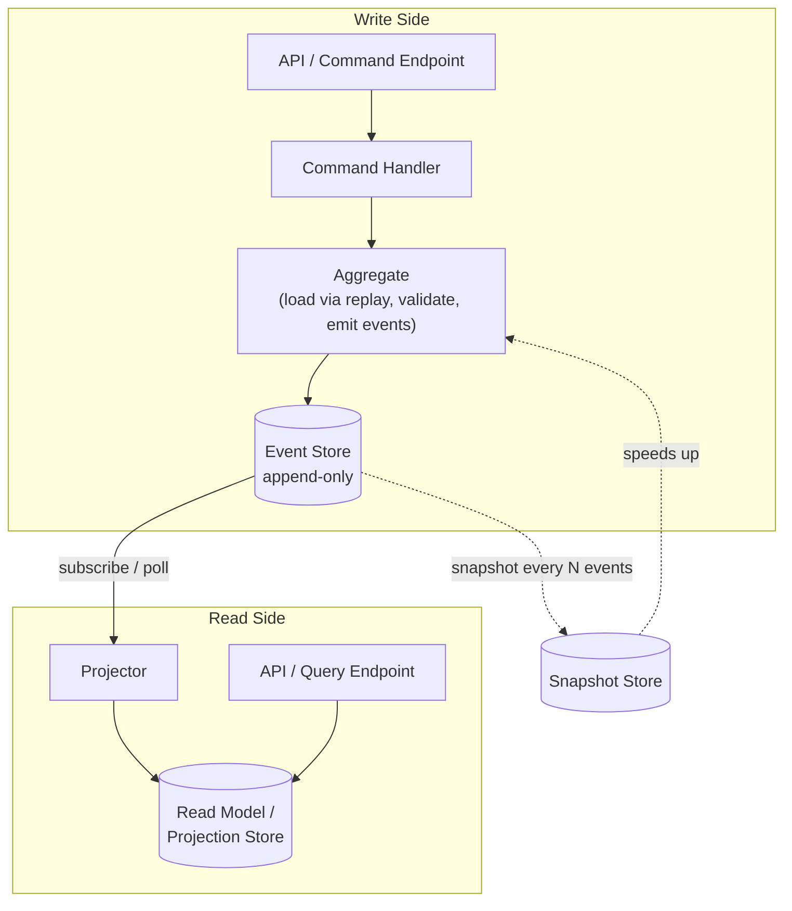

# Event Sourcing — A Complete Tutorial

## Table of Contents

1. [Introduction & Motivation](#1-introduction--motivation)
2. [Core Concepts](#2-core-concepts)
   - 2.1 [Events](#21-events)
   - 2.2 [Event Store](#22-event-store)
   - 2.3 [Aggregates](#23-aggregates)
   - 2.4 [Commands vs. Events](#24-commands-vs-events)
   - 2.5 [Projections / Read Models](#25-projections--read-models)
   - 2.6 [Snapshots](#26-snapshots)
   - 2.7 [Optimistic Concurrency Control](#27-optimistic-concurrency-control)
   - 2.8 [Event Replay](#28-event-replay)
   - 2.9 [Idempotency & Deduplication](#29-idempotency--deduplication)
   - 2.10 [Event Versioning & Upcasting](#210-event-versioning--upcasting)
   - 2.11 [Eventual Consistency](#211-eventual-consistency)
3. [Event Sourcing + CQRS](#3-event-sourcing--cqrs)
4. [Sagas / Process Managers](#4-sagas--process-managers)
5. [Standard Architecture & Component Communication](#5-standard-architecture--component-communication)
6. [Standard Folder Structure](#6-standard-folder-structure)
7. [Pros & Cons](#7-pros--cons)
8. [When to Apply](#8-when-to-apply)
9. [Common Pitfalls](#9-common-pitfalls)
10. [Comparison Table](#10-comparison-table)
11. [Reference Implementation (separate project)](#11-reference-implementation)
12. [Further Reading](#12-further-reading)

## 1. Introduction & Motivation

Traditional persistence (CRUD) stores only the **current state** of an entity. Every `UPDATE` statement **overwrites** the previous state — the history is gone forever unless you bolt on an audit-log table as an afterthought.

**Event Sourcing** flips this model: instead of persisting _current state_, you persist the **full sequence of immutable events** that led to that state. Current state becomes a _derived value_ — computed by replaying (folding) all events for an entity, in order.



**The core insight:** in the traditional model, `balance = 90` is a fact you must trust blindly — you cannot answer _"how did we get here?"_. In Event Sourcing, `balance = 90` is **provable** — you can always recompute it, audit it, and answer _"what happened, in what order, and why?"_.

This idea was popularized by **Martin Fowler** and Greg Young (who also created CQRS) in the mid-2000s, largely in the Domain-Driven Design (DDD) community, and today it underpins many production systems in banking, e-commerce order management, and audit-heavy domains (healthcare, insurance).

## 2. Core Concepts

### 2.1 Events

An **event** is an immutable fact describing something that **already happened**. Events are always named in the **past tense** (`MoneyDeposited`, not `DepositMoney`) because you cannot "un-happen" something that has already occurred — you can only record a new compensating event.

**Rules for a well-designed event:**

- Immutable once written — never edited or deleted.
- Contains only the data relevant to _what changed_, not the full entity state.
- Carries metadata: event ID, aggregate ID, version/sequence number, timestamp, and often a correlation/causation ID for tracing.

```javascript
// A minimal, well-formed event
const event = {
  eventId: "e7b2f6a0-...",
  eventType: "MoneyDeposited",
  aggregateId: "account-123",
  version: 3, // position in this aggregate's event stream
  timestamp: "2026-09-15T10:00:00Z",
  data: { amount: 50, currency: "USD" },
};
```

### 2.2 Event Store

The **Event Store** is an append-only database specialized for storing and reading event streams. Conceptually it behaves like a log: you can only `append` and `read`, never `update` or `delete`.

Two read patterns matter:

- **Read by stream** — "give me all events for `account-123`, in order" → used to rebuild one aggregate.
- **Read globally** — "give me all events across all streams, in order" → used to (re)build projections.

```javascript
// Minimal EventStore interface
class EventStore {
  async append(streamId, expectedVersion, events) {
    /* ... */
  }
  async loadStream(streamId) {
    /* returns ordered array of events */
  }
  async loadAll(fromPosition = 0) {
    /* returns global ordered stream, for projections */
  }
}
```

Real-world event stores: **EventStoreDB** (purpose-built), or events modeled as rows in **PostgreSQL/MySQL** (an `events` table with an append-only constraint), or as a stream in **Kafka**, or as items in **DynamoDB**. You do **not** need a specialized database to do Event Sourcing — a relational table with an `INSERT`-only access pattern is a perfectly valid, common choice.

### 2.3 Aggregates

An **Aggregate** (a DDD concept) is the consistency boundary — the object whose state is rebuilt by folding its event stream. It:

1. Exposes **command-handling methods** that validate business rules and, if valid, produce new events (it does **not** mutate its own state directly).
2. Exposes an **`apply(event)`** method that _does_ mutate in-memory state — this same method is used both when handling a new command and when replaying history.

```javascript
class BankAccount {
  constructor(id) {
    this.id = id;
    this.balance = 0;
    this.status = "NONEXISTENT";
    this.version = -1; // no events applied yet
  }

  // --- Rebuild state by replaying events (used on load AND right after handling a command) ---
  apply(event) {
    switch (event.eventType) {
      case "AccountOpened":
        this.status = "OPEN";
        this.balance = event.data.initialBalance;
        break;
      case "MoneyDeposited":
        this.balance += event.data.amount;
        break;
      case "MoneyWithdrawn":
        this.balance -= event.data.amount;
        break;
      case "AccountClosed":
        this.status = "CLOSED";
        break;
    }
    this.version = event.version;
  }

  // --- Handle a command: validate, then return the event(s) to be persisted ---
  withdraw(amount) {
    if (this.status !== "OPEN") throw new Error("Account is not open");
    if (amount > this.balance) throw new Error("Insufficient funds");
    return [{ eventType: "MoneyWithdrawn", data: { amount } }]; // not yet persisted!
  }
}
```

**Rebuilding an aggregate from its event stream:**

```javascript
async function loadAccount(eventStore, accountId) {
  const account = new BankAccount(accountId);
  const events = await eventStore.loadStream(accountId);
  for (const event of events) account.apply(event);
  return account; // current state, derived purely from history
}
```

### 2.4 Commands vs. Events

This distinction trips up almost every newcomer, so it deserves its own section.

|                  | Command                                      | Event                                                             |
| ---------------- | -------------------------------------------- | ----------------------------------------------------------------- |
| Tense            | Imperative — `WithdrawMoney`                 | Past — `MoneyWithdrawn`                                           |
| Meaning          | A _request/intention_ to do something        | A _fact_ that something happened                                  |
| Can be rejected? | **Yes** — business rules can refuse it       | **No** — it already happened, it's immutable history              |
| Who sends it?    | A user / external system / another service   | Produced internally by the aggregate, after a command is accepted |
| Persisted?       | Usually not (or logged separately for audit) | **Always** — this is your source of truth                         |

```javascript
// Command (intention) — may fail
const command = {
  type: "WithdrawMoney",
  accountId: "account-123",
  amount: 200,
};

// Handling the command may produce an event (success) or throw (rejected)
try {
  const events = account.withdraw(command.amount); // -> [{ eventType: "MoneyWithdrawn", ... }]
  await eventStore.append(account.id, account.version, events);
} catch (err) {
  // command rejected — nothing is ever written to the event store
  console.log("Command rejected:", err.message);
}
```

### 2.5 Projections / Read Models

Since the event store only supports "replay the whole stream," querying (e.g., "list all accounts with balance > $1000") would be painfully slow if done directly against raw events. **Projections** solve this: a separate process listens to the event stream and incrementally builds a **denormalized, query-optimized read model** (usually a plain SQL table, a Mongo collection, or an in-memory map).

```javascript
class AccountBalanceProjection {
  constructor() {
    this.table = new Map();
  } // accountId -> { balance, status }

  handle(event) {
    switch (event.eventType) {
      case "AccountOpened":
        this.table.set(event.aggregateId, {
          balance: event.data.initialBalance,
          status: "OPEN",
        });
        break;
      case "MoneyDeposited":
        this.table.get(event.aggregateId).balance += event.data.amount;
        break;
      case "MoneyWithdrawn":
        this.table.get(event.aggregateId).balance -= event.data.amount;
        break;
      case "AccountClosed":
        this.table.get(event.aggregateId).status = "CLOSED";
        break;
    }
  }

  // Fast query — no replay needed at read time
  getBalance(accountId) {
    return this.table.get(accountId)?.balance;
  }
}
```

A single event stream can feed **many different projections** simultaneously (e.g., "balance per account," "total deposits per day," "top 10 customers by transaction count") — each optimized for a specific query, without ever touching the write side.

### 2.6 Snapshots

Replaying 100,000 events every time you load an aggregate is wasteful. A **snapshot** is a periodically-saved copy of an aggregate's state at a specific version, so loading becomes: _load latest snapshot → replay only the events after it_.

```javascript
async function loadAccountWithSnapshot(eventStore, snapshotStore, accountId) {
  const snapshot = await snapshotStore.load(accountId); // { version, state } or null
  const account = new BankAccount(accountId);
  if (snapshot)
    Object.assign(account, snapshot.state, { version: snapshot.version });

  const eventsSinceSnapshot = await eventStore.loadStream(
    accountId,
    snapshot?.version ?? -1,
  );
  for (const event of eventsSinceSnapshot) account.apply(event);
  return account;
}

// Typically taken every N events (e.g., every 100) by a background job
async function maybeSnapshot(snapshotStore, account) {
  if (account.version % 100 === 0) {
    await snapshotStore.save(account.id, account.version, {
      balance: account.balance,
      status: account.status,
    });
  }
}
```

> Snapshots are a **pure optimization** — deleting all snapshots and replaying from event #0 must always produce the exact same state. If it doesn't, your snapshotting logic (or your `apply()` logic) has a bug.

### 2.7 Optimistic Concurrency Control

Two requests might try to modify the same aggregate at the same time (e.g., two withdrawals racing). Event Sourcing solves this the same way most systems do — with a **version check**: `append()` must be told the version the caller _expected_ the stream to be at; if the actual current version differs, the append is rejected.

```javascript
async function withdrawMoney(eventStore, accountId, amount) {
  const account = await loadAccount(eventStore, accountId); // e.g. version = 5
  const newEvents = account.withdraw(amount); // business validation

  try {
    // "I expect the stream to still be at version 5 — reject if someone else wrote first"
    await eventStore.append(accountId, account.version, newEvents);
  } catch (err) {
    if (err.code === "CONCURRENCY_CONFLICT") {
      // Retry: reload the aggregate (now at a newer version) and re-attempt the command
      return withdrawMoney(eventStore, accountId, amount);
    }
    throw err;
  }
}
```

This is exactly how a relational database's `WHERE version = 5` conditional `UPDATE`, or a `UNIQUE(aggregateId, version)` constraint on the events table, is typically implemented under the hood.

### 2.8 Event Replay

Because the event log is the source of truth, **replay** unlocks capabilities that traditional CRUD simply cannot offer:

- **Rebuild a corrupted read model** — drop the projection table, replay all events from position 0, done.
- **Add a brand-new projection later** — e.g., six months after launch, product wants a "fraud pattern" dashboard. Replay historical events into a new projection as if it had existed since day one.
- **Time-travel debugging** — replay events for one aggregate up to version 42 to see exactly what its state looked like at that point in history.
- **Retroactive bug fixes in projections** — if a projection had a bug, fix the projection code and simply replay; the _event log itself never needs to change_.

```javascript
async function rebuildProjection(eventStore, projection) {
  const allEvents = await eventStore.loadAll(0); // full history, in global order
  for (const event of allEvents) projection.handle(event);
}
```

### 2.9 Idempotency & Deduplication

Because commands may be retried (network errors, message-queue redelivery), command handlers must be **idempotent**: processing the same command twice must not produce duplicate events.

Common technique: attach a **client-generated idempotency key** to the command, and check the event store for an event already tagged with that key before appending.

```javascript
async function handleDepositCommand(eventStore, command) {
  const existing = await eventStore.findByIdempotencyKey(
    command.idempotencyKey,
  );
  if (existing) return existing; // already processed — return the same result, don't double-apply

  const account = await loadAccount(eventStore, command.accountId);
  const events = account
    .deposit(command.amount)
    .map((e) => ({ ...e, idempotencyKey: command.idempotencyKey }));
  await eventStore.append(command.accountId, account.version, events);
}
```

### 2.10 Event Versioning & Upcasting

Event schemas evolve over the life of a system (new field added, field renamed, event split into two). Since old events are **immutable and can never be rewritten**, you need a strategy to keep old events readable by new code: **upcasting** — transforming an old event shape into the new shape _at read time_, before it reaches the aggregate/projection.

```javascript
// v1 event (stored years ago): { eventType: "MoneyDeposited", data: { amount: 50 } }
// v2 schema now also requires a currency field.

function upcast(rawEvent) {
  if (rawEvent.eventType === "MoneyDeposited" && !rawEvent.data.currency) {
    return { ...rawEvent, data: { ...rawEvent.data, currency: "USD" } }; // assume legacy default
  }
  return rawEvent;
}

// Applied transparently as events are read from the store, before .apply()/.handle()
const events = (await eventStore.loadStream(accountId)).map(upcast);
```

### 2.11 Eventual Consistency

Because projections are built **asynchronously** from the event stream (not in the same transaction as the write), there is a small window where a write has succeeded but a read model hasn't caught up yet. This is a deliberate, explicit trade-off you must design around — e.g., by having the write side immediately return the data the client needs (so it doesn't have to re-query a lagging projection), or by using a "read-your-own-writes" strategy (routing a user's own subsequent reads to the primary stream instead of the projection for a short window).

## 3. Event Sourcing + CQRS

**CQRS (Command Query Responsibility Segregation)** and Event Sourcing are **not the same thing**, though they are frequently used together and reinforce each other extremely well.

- **CQRS** says: _use a different model for writes (commands) than for reads (queries)._
- **Event Sourcing** says: _persist state as a sequence of events instead of current state._

You can do CQRS without Event Sourcing (e.g., write to a normalized SQL table, read from a separate denormalized read replica kept in sync via triggers or CDC). You can also do Event Sourcing without full CQRS (e.g., a simple system that just replays events into the same model it queries). But together, they are a natural pair: **the event stream is the write model; projections are the read models** — which is exactly the structure shown in section 2.5.



## 4. Sagas / Process Managers

When a business process spans **multiple aggregates** (e.g., "Place Order" → reserve inventory → charge payment → confirm shipment), no single aggregate can enforce consistency across all of them (each aggregate is its own transaction boundary). A **Saga** (a.k.a. Process Manager) listens to events, and in response, issues new commands to other aggregates — including **compensating commands** if a later step fails.



Sagas are themselves often implemented as event-sourced state machines — they persist their own progress as events too, so they can safely resume after a crash.

## 5. Standard Architecture & Component Communication



**Communication rules that matter:**

- The **write side never reads from the projection store** — it always rebuilds aggregate state from the event stream (+ snapshot), guaranteeing correctness independent of read-model lag.
- The **read side never writes to the event store** — projections are purely derived, disposable, and rebuildable.
- Aggregates communicate with each other **only through events + sagas**, never through direct method calls — this preserves the transactional boundary of "one aggregate, one consistency unit."

## 6. Standard Folder Structure

```
order-service/
├── src/
│   ├── domain/
│   │   ├── account/
│   │   │   ├── events.js          # AccountOpened, MoneyDeposited, MoneyWithdrawn, AccountClosed
│   │   │   ├── commands.js        # OpenAccount, DepositMoney, WithdrawMoney, CloseAccount
│   │   │   └── BankAccount.js     # aggregate: apply() + command-handling methods
│   │   └── shared/
│   │       └── DomainError.js
│   │
│   ├── eventstore/
│   │   ├── EventStore.js          # interface
│   │   ├── PostgresEventStore.js  # production implementation
│   │   └── InMemoryEventStore.js  # for unit tests
│   │
│   ├── snapshot/
│   │   └── SnapshotStore.js
│   │
│   ├── application/
│   │   └── account/
│   │       ├── OpenAccountHandler.js
│   │       ├── DepositMoneyHandler.js
│   │       ├── WithdrawMoneyHandler.js
│   │       └── CloseAccountHandler.js
│   │
│   ├── projections/
│   │   ├── AccountBalanceProjection.js
│   │   ├── TransactionHistoryProjection.js
│   │   └── Projector.js           # generic subscribe-and-dispatch runner
│   │
│   ├── api/
│   │   ├── commandRoutes.js       # POST /accounts, POST /accounts/:id/deposit, ...
│   │   └── queryRoutes.js         # GET /accounts/:id/balance, GET /accounts/:id/history
│   │
│   └── sagas/
│       └── OrderFulfillmentSaga.js
│
└── test/
    ├── domain/BankAccount.test.js
    └── projections/AccountBalanceProjection.test.js
```

## 7. Pros & Cons

**Pros:**

- **Full audit trail by construction** — every state change is permanently recorded; nothing to bolt on separately.
- **Time-travel & debugging** — you can reconstruct exactly what the system believed at any point in the past.
- **Flexible read models** — add new projections at any time, retroactively, without touching the write side.
- **Natural fit for event-driven / microservices architectures** — the event stream doubles as an integration mechanism other services can subscribe to.
- **No lost updates** — optimistic concurrency at the event-append level is simple and reliable.

**Cons:**

- **Steep learning curve** — commands vs. events, eventual consistency, and replay all require a real mental shift from CRUD thinking.
- **Querying is harder** — you cannot just `SELECT * WHERE balance > 1000` against raw events; you must build and maintain projections.
- **Eventual consistency complexity** — UI/UX and client code must be designed to tolerate read-model lag.
- **Event schema evolution is a long-term maintenance burden** — upcasting logic accumulates over the life of the system.
- **Storage grows unbounded** (mitigated by snapshots, but the raw log itself is typically kept forever).
- **Operational tooling is less mature** than for plain relational databases in some ecosystems.

## 8. When to Apply

Good fit when:

- Regulatory/audit requirements demand a complete, tamper-evident history of every change (banking, insurance, healthcare, compliance-heavy domains).
- The business genuinely cares about _how_ state was reached, not just the current value (e.g., "why was this loan application rejected then later approved?").
- You expect to need **new ways to query historical data** that you can't fully predict today.
- The domain naturally involves complex state transitions/workflows (order lifecycles, claims processing, trading systems).

Poor fit when:

- Simple CRUD apps where current state is all that ever matters (a blog's draft/published flag, a user's profile settings).
- The team has no prior exposure to DDD/CQRS concepts and the project timeline can't absorb the learning curve.
- Strong, immediate read-after-write consistency is a hard UX requirement and eventual consistency can't be designed around.

## 9. Common Pitfalls

- **Storing "fat" events that mirror the entire entity state** (essentially a snapshot disguised as an event) — defeats the purpose; events should capture _intent_ and the _delta_, not the whole object.
- **Mutating or deleting past events** to "fix" bad data — never do this; write a new compensating event instead (e.g., `DepositCorrected`), preserving the true history.
- **Treating the event store as a message queue** — an event store is a durable log for rebuilding state; a message broker (Kafka, RabbitMQ) is for pub/sub delivery. They solve different problems, though they're sometimes the same physical technology.
- **Forgetting idempotency** on command handlers, leading to duplicate events after network retries.
- **Skipping snapshots** on high-frequency aggregates, causing replay time to grow unbounded.

## 10. Comparison Table

| Aspect                   | Traditional CRUD                                       | Event Sourcing (no CQRS)                                    | Event Sourcing + CQRS                                 |
| ------------------------ | ------------------------------------------------------ | ----------------------------------------------------------- | ----------------------------------------------------- |
| What's persisted         | Current state only                                     | Full event history                                          | Full event history (write) + derived read models      |
| Audit trail              | Manual, bolted on                                      | Built-in, by construction                                   | Built-in, by construction                             |
| Query complexity         | Simple (direct SQL)                                    | Hard (must replay or maintain ad-hoc models)                | Simple on the read side (dedicated read models)       |
| Consistency              | Immediate                                              | Immediate for the aggregate itself                          | Write side immediate; read side eventually consistent |
| Adding new "views" later | Requires backfill scripts against current-state tables | Possible via replay, but no clean separation of read models | Trivial — new projection + replay                     |
| Learning curve           | Low                                                    | Medium-High                                                 | High                                                  |
| Best for                 | Simple, low-audit-need apps                            | Systems needing history but simple querying needs           | Complex, audit-heavy, high-scale systems              |

## 11. Reference Implementation

A complete, runnable, production-style reference implementation (Node.js, zero external dependencies) is provided as a **separate project**: an event-sourced **Bank Account** system with an append-only file-based event store, snapshots, two projections, optimistic concurrency control, idempotent command handling, and a scripted demo you can run and observe step by step.

See: `event-sourcing-bank-account/README.md` for setup and run instructions.

## 12. Further Reading

- Martin Fowler, ["Event Sourcing"](https://martinfowler.com/eaaDev/EventSourcing.html)
- Greg Young, _"CQRS Documents"_ and various recorded talks on Event Sourcing
- Vaughn Vernon, _"Implementing Domain-Driven Design"_ (2013) — aggregate design fundamentals that Event Sourcing builds on
- EventStoreDB documentation — a purpose-built event store, useful for understanding stream semantics even if you don't use the product itself
- Chris Richardson, _"Microservices Patterns"_ (2018) — Sagas and event-driven data management across services
