# Load Balancing & Nginx: Hướng Dẫn Toàn Diện từ Lý Thuyết đến Production

## Mục Lục

1. [Tổng Quan: Tại Sao Cần Load Balancing?](#1-tổng-quan)
2. [Lý Thuyết Load Balancing](#2-lý-thuyết-load-balancing)
   - 2.1 [Định Nghĩa & Mục Tiêu](#21-định-nghĩa--mục-tiêu)
   - 2.2 [Các Loại Load Balancer](#22-các-loại-load-balancer)
   - 2.3 [Layer 4 vs Layer 7 Load Balancing](#23-layer-4-vs-layer-7-load-balancing)
   - 2.4 [Thuật Toán Load Balancing](#24-thuật-toán-load-balancing)
   - 2.5 [Session Persistence (Sticky Session)](#25-session-persistence-sticky-session)
   - 2.6 [Health Check](#26-health-check)
   - 2.7 [High Availability cho Load Balancer](#27-high-availability-cho-load-balancer)
3. [Khi Nào Áp Dụng Load Balancing?](#3-khi-nào-áp-dụng-load-balancing)
4. [Nginx: Tổng Quan & Kiến Trúc](#4-nginx-tổng-quan--kiến-trúc)
   - 4.1 [Lịch Sử & Đặc Điểm](#41-lịch-sử--đặc-điểm)
   - 4.2 [Kiến Trúc Event-Driven](#42-kiến-trúc-event-driven)
   - 4.3 [Nginx vs Apache vs HAProxy vs AWS ALB](#43-nginx-vs-apache-vs-haproxy-vs-aws-alb)
5. [Nginx Load Balancing: Tính Năng & Cấu Hình](#5-nginx-load-balancing-tính-năng--cấu-hình)
   - 5.1 [Upstream Module](#51-upstream-module)
   - 5.2 [Các Thuật Toán trong Nginx](#52-các-thuật-toán-trong-nginx)
   - 5.3 [Health Check trong Nginx](#53-health-check-trong-nginx)
   - 5.4 [SSL/TLS Termination](#54-ssltls-termination)
   - 5.5 [Connection Keepalive & Pooling](#55-connection-keepalive--pooling)
   - 5.6 [Rate Limiting & Connection Limiting](#56-rate-limiting--connection-limiting)
   - 5.7 [Caching](#57-caching)
   - 5.8 [Gzip Compression](#58-gzip-compression)
   - 5.9 [Logging & Observability](#59-logging--observability)
6. [Case Study: Hệ Thống E-Commerce ShopX](#6-case-study-hệ-thống-e-commerce-shopx)
   - 6.1 [Kiến Trúc Tổng Thể](#61-kiến-trúc-tổng-thể)
   - 6.2 [Traffic Flow Diagram](#62-traffic-flow-diagram)
   - 6.3 [Cấu Hình Nginx Production](#63-cấu-hình-nginx-production)
   - 6.4 [Flash Sale Scenario](#64-flash-sale-scenario)
7. [Best Practices](#7-best-practices)
8. [Anti-Patterns](#8-anti-patterns)
9. [Real-World: Bài Học từ Netflix & Amazon](#9-real-world-bài-học-từ-netflix--amazon)
10. [Troubleshooting Guide](#10-troubleshooting-guide)
11. [Tổng Kết & Checklist Production](#11-tổng-kết--checklist-production)
12. [Nginx với Docker & Docker Compose](#12-nginx-với-docker--docker-compose)
    - 12.1 [Nginx Container Cơ Bản](#121-nginx-container-cơ-bản)
    - 12.2 [ShopX trên Docker Compose](#122-shopx-trên-docker-compose)
    - 12.3 [Scale với Docker Compose Replicas](#123-scale-với-docker-compose-replicas)
    - 12.4 [Multi-stage Dockerfile cho Nginx](#124-multi-stage-dockerfile-cho-nginx)
13. [Nginx trên Kubernetes](#13-nginx-trên-kubernetes)
    - 13.1 [Ingress Controller vs Gateway API](#131-ingress-controller-vs-gateway-api)
    - 13.2 [Cài Đặt NGINX Ingress Controller](#132-cài-đặt-nginx-ingress-controller)
    - 13.3 [Ingress Resource & Routing](#133-ingress-resource--routing)
    - 13.4 [Canary Deployment với Nginx Ingress](#134-canary-deployment-với-nginx-ingress)
    - 13.5 [NGINX Gateway Fabric (Thế hệ mới)](#135-nginx-gateway-fabric-thế-hệ-mới)
    - 13.6 [ShopX trên Kubernetes](#136-shopx-trên-kubernetes)
14. [Case Study Chuyên Sâu & Anti-Patterns Nâng Cao](#14-case-study-chuyên-sâu--anti-patterns-nâng-cao)
    - 14.1 [Thundering Herd Problem](#141-thundering-herd-problem)
    - 14.2 [Cascading Failure & Circuit Breaker](#142-cascading-failure--circuit-breaker)
    - 14.3 [Pokémon GO Launch Incident (Google SRE)](#143-pokémon-go-launch-incident-google-sre)
    - 14.4 [Anti-Pattern: Retry Storm](#144-anti-pattern-retry-storm)
    - 14.5 [Anti-Pattern: Consistent Hash không dùng `consistent`](#145-anti-pattern-consistent-hash-không-dùng-consistent)
    - 14.6 [Anti-Pattern: Bỏ qua Slow Start sau Deploy](#146-anti-pattern-bỏ-qua-slow-start-sau-deploy)

## 1. Tổng Quan

### Bài Toán Thực Tế

Hãy tưởng tượng **ShopX** — một hệ thống e-commerce với 50,000 người dùng đồng thời trong ngày sale lớn. Toàn bộ traffic đổ vào một server duy nhất:

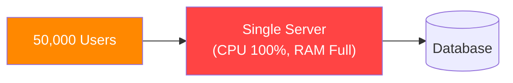

**Hậu quả:**

- Server quá tải → Response time tăng từ 200ms lên 30 giây
- Một server crash → **Toàn bộ hệ thống down**
- Không thể scale ngang (horizontal scaling)
- Điểm chết đơn (Single Point of Failure - SPOF)

**Giải pháp — Load Balancing:**

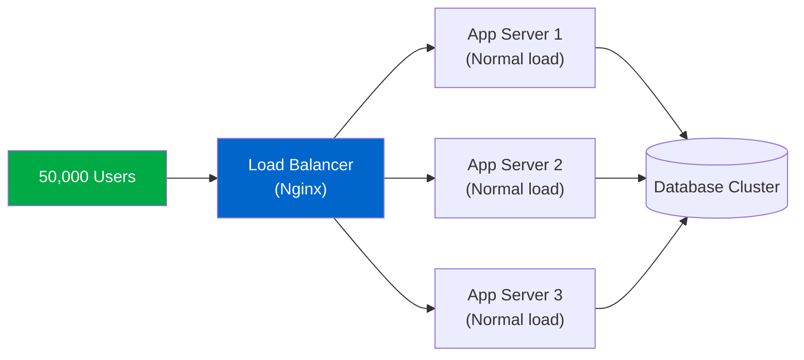

Load balancing phân phối traffic ra nhiều server → mỗi server chỉ nhận 1/N tải → hệ thống ổn định, fault-tolerant, và có thể scale.

## 2. Lý Thuyết Load Balancing

### 2.1 Định Nghĩa & Mục Tiêu

**Load Balancing** là kỹ thuật phân phối network traffic hoặc workload đều đặn (hoặc theo rule) ra nhiều server/instance, nhằm:

| Mục tiêu                 | Giải thích                                          | Ví dụ ShopX                                             |
| ------------------------ | --------------------------------------------------- | ------------------------------------------------------- |
| **Scalability**          | Scale ngang bằng cách thêm server                   | Thêm server trước ngày 11/11                            |
| **High Availability**    | Loại bỏ SPOF, tiếp tục hoạt động khi có server fail | 1 server crash, 2 server còn lại vẫn phục vụ            |
| **Performance**          | Giảm latency, tăng throughput                       | Response time từ 2s → 200ms                             |
| **Resource Utilization** | Dùng đều tài nguyên, không lãng phí                 | Không để một server 100% trong khi server khác 20%      |
| **Fault Tolerance**      | Tự động bypass server bị lỗi                        | Health check phát hiện server down, ngừng route traffic |

### 2.2 Các Loại Load Balancer

#### 2.2.1 Phân loại theo triển khai

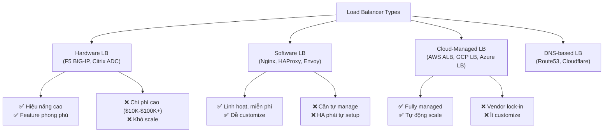

#### 2.2.2 Phân loại theo vị trí trong hệ thống

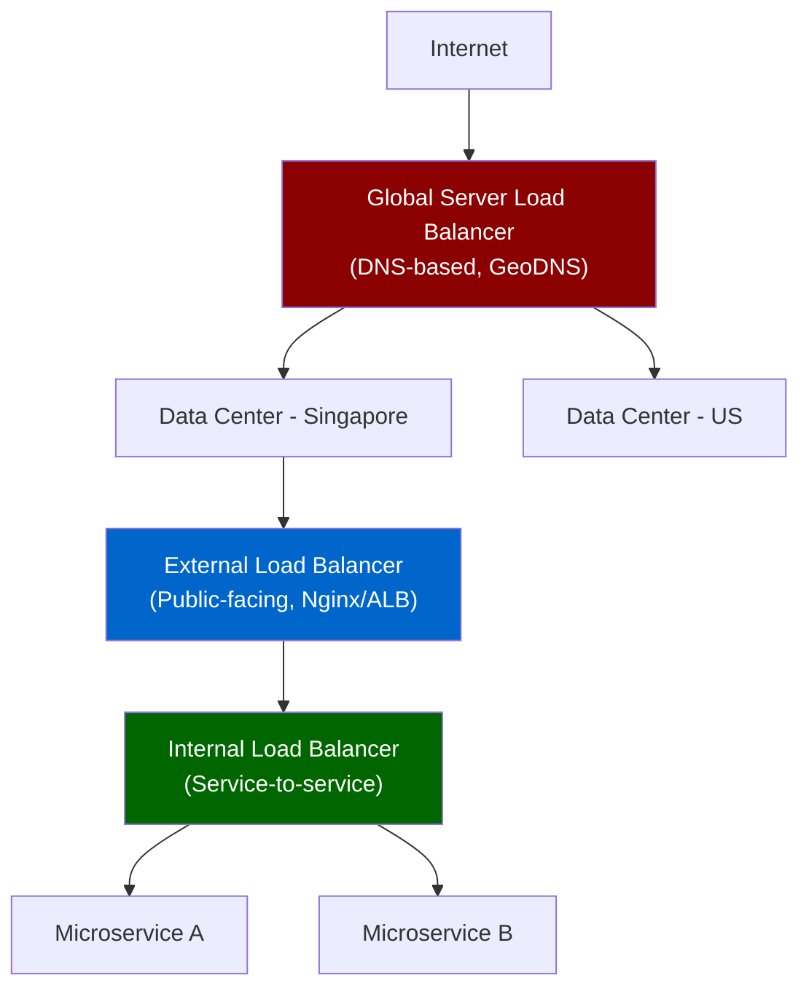

| Loại            | Vị trí                      | Dùng khi                               |
| --------------- | --------------------------- | -------------------------------------- |
| **Global LB**   | DNS layer, trước toàn bộ DC | Multi-region, geo-routing              |
| **External LB** | Edge, facing internet       | Phân phối traffic từ user vào internal |
| **Internal LB** | Giữa các microservice       | Service-to-service communication       |

### 2.3 Layer 4 vs Layer 7 Load Balancing

Đây là sự khác biệt cốt lõi trong kiến trúc. Hiểu rõ điều này quyết định bạn chọn tool gì.

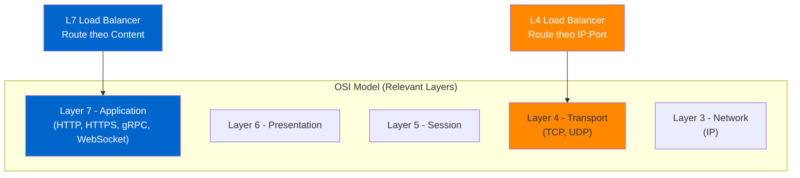

#### Layer 4 Load Balancing (Transport Layer)

**Cách hoạt động:** LB xem xét thông tin ở TCP/UDP header (source IP, destination IP, port) để quyết định routing. **Không nhìn vào nội dung packet.**

```
Client Request:
[IP Header: src=203.0.113.1, dst=10.0.0.1]
[TCP Header: src_port=12345, dst_port=80]
[HTTP Payload: GET /api/products ← LB KHÔNG ĐỌC CÁI NÀY]
```

**Ưu điểm:**

- Nhanh hơn (ít processing)
- Hoạt động với mọi protocol (TCP/UDP)
- Throughput cao hơn

**Nhược điểm:**

- Không routing theo URL, header, cookie
- Không SSL termination thực sự
- Không inspect nội dung request

**Use case:** Database cluster (MySQL, Redis), streaming (UDP), game server.

#### Layer 7 Load Balancing (Application Layer)

**Cách hoạt động:** LB đọc toàn bộ HTTP request, có thể routing theo URL path, hostname, header, cookie, body content.

```
Client Request → LB đọc:
GET /api/products HTTP/1.1
Host: shopx.com
Cookie: session_id=abc123
Authorization: Bearer eyJhbGc...
Content-Type: application/json

→ LB quyết định: Route đến "products-service" upstream
```

**Ưu điểm:**

- Routing thông minh theo content
- SSL termination
- Request/response modification
- Caching, compression
- Authentication offloading

**Nhược điểm:**

- Chậm hơn L4 (phải parse HTTP)
- Chỉ hoạt động với HTTP/HTTPS/gRPC

**Use case:** Gần như mọi web application hiện đại.

#### So sánh tổng quan

| Tiêu chí        | Layer 4              | Layer 7                   |
| --------------- | -------------------- | ------------------------- |
| Routing cơ sở   | IP + Port            | URL, Header, Cookie, Body |
| SSL Termination | Không (pass-through) | Có                        |
| Throughput      | Cao hơn (~30%)       | Thấp hơn chút             |
| Flexibility     | Thấp                 | Cao                       |
| Caching         | Không                | Có                        |
| Use case ShopX  | Database LB          | Web/API LB                |

> **Thực tế ShopX:** Nginx (Layer 7) ở edge để route `/api/*` vs `/static/*`, AWS NLB (Layer 4) cho database cluster.

### 2.4 Thuật Toán Load Balancing

Đây là phần cốt lõi — thuật toán quyết định request được gửi đến server nào.

#### 2.4.1 Round Robin

**Lý thuyết:** Request được phân phối tuần tự theo vòng tròn, mỗi server nhận một lần trước khi quay lại từ đầu.

```
Requests:  R1  R2  R3  R4  R5  R6  R7  R8  R9
Servers:   S1  S2  S3  S1  S2  S3  S1  S2  S3
```

**Weighted Round Robin:** Server mạnh hơn nhận nhiều request hơn.

```
Server A: weight=3 → nhận 3/5 requests
Server B: weight=2 → nhận 2/5 requests

Sequence: A, A, A, B, B, A, A, A, B, B, ...
```

**Nginx config:**

```nginx
upstream shopx_backend {
    server app1.shopx.internal weight=3;  # Server mạnh hơn
    server app2.shopx.internal weight=2;
    server app3.shopx.internal weight=1;  # Server yếu hơn
}
```

**Khi nào dùng:**

- Tất cả server có capacity tương đương
- Request có thời gian xử lý tương đương (stateless API)
- Ví dụ ShopX: Product listing API, static asset serving

**Nhược điểm:**

- Không tính đến server đang busy
- Server có request nặng vẫn nhận request mới

#### 2.4.2 Least Connections

**Lý thuyết:** Request mới được route đến server đang có **ít kết nối nhất** (đang bận ít nhất).

```
State tại thời điểm nhận request R10:
  Server 1: 5 connections (đang xử lý 5 request)
  Server 2: 2 connections ← WINNER
  Server 3: 8 connections

→ R10 được gửi đến Server 2
```

**Weighted Least Connections:** Tính cả weight.

```
Effective load = active_connections / weight

Server 1: 6 connections, weight=3 → effective = 6/3 = 2.0
Server 2: 4 connections, weight=2 → effective = 4/2 = 2.0
Server 3: 1 connection,  weight=1 → effective = 1/1 = 1.0 ← WINNER
```

**Nginx config:**

```nginx
upstream shopx_backend {
    least_conn;
    server app1.shopx.internal weight=3;
    server app2.shopx.internal weight=2;
    server app3.shopx.internal weight=1;
}
```

**Khi nào dùng:**

- Request có thời gian xử lý không đều (checkout vs product view)
- Long-lived connections (WebSocket)
- Ví dụ ShopX: Order processing service, checkout API

#### 2.4.3 IP Hash

**Lý thuyết:** Dùng hash của client IP address để xác định server. **Cùng một IP luôn → cùng một server** (trừ khi server đó down).

```
hash(client_ip) % num_servers = server_index

Client 203.0.113.1 → hash() % 3 = 1 → Server 1 (luôn luôn)
Client 198.51.100.2 → hash() % 3 = 2 → Server 2 (luôn luôn)
```

**Nginx config:**

```nginx
upstream shopx_session_backend {
    ip_hash;
    server app1.shopx.internal;
    server app2.shopx.internal;
    server app3.shopx.internal;
}
```

**Khi nào dùng:**

- Application có server-side session (không dùng Redis)
- User cần luôn hit cùng server

**Nhược điểm quan trọng:**

- Nếu nhiều user qua cùng NAT gateway (corporate, ISP), tất cả vào 1 server → mất cân bằng
- Khi thêm/bớt server, nhiều user bị re-route → session mất
- **Thực tế:** Nên dùng Redis session thay vì ip_hash

#### 2.4.4 Generic Hash (Consistent Hash)

**Lý thuyết:** Hash theo bất kỳ key nào (URL, custom header, cookie). Thường dùng **Consistent Hashing** để giảm re-mapping khi thêm/bớt server.

**Vấn đề với Modulo Hash khi thêm server:**

```
3 servers: hash(key) % 3
4 servers: hash(key) % 4  ← ~75% key bị re-route!
```

**Consistent Hashing giải quyết bài này:**

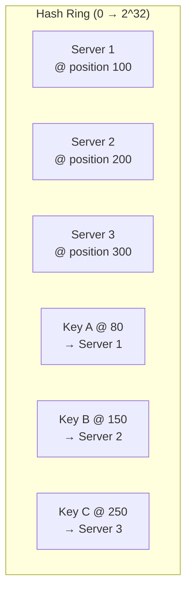

**Khi thêm Server 4 @ position 250:**

- Chỉ những Key nằm trong range (200→250) bị re-route
- Phần còn lại **không thay đổi** (~75% key giữ nguyên)

**Nginx config:**

```nginx
upstream shopx_cache_backend {
    hash $request_uri consistent;  # consistent = consistent hashing
    server cache1.shopx.internal;
    server cache2.shopx.internal;
    server cache3.shopx.internal;
}
```

**Khi nào dùng:**

- Cache server (cùng URL → cùng cache server → cache hit rate cao)
- Ví dụ ShopX: Route product page requests đến cache server, tăng cache hit rate

#### 2.4.5 Least Time (NGINX Plus)

**Lý thuyết:** Route đến server có **response time thấp nhất** kết hợp với ít connections nhất. Đây là thuật toán thông minh nhất.

```
Score = (active_connections / weight) + avg_response_time

Server 1: 5 conn, weight=1, avg=100ms → score = 5 + 100 = 105
Server 2: 3 conn, weight=1, avg=200ms → score = 3 + 200 = 203
Server 3: 1 conn, weight=1, avg=50ms  → score = 1 + 50  = 51 ← WINNER
```

**Nginx Plus config:**

```nginx
upstream shopx_backend {
    least_time header;  # hoặc last_byte
    server app1.shopx.internal;
    server app2.shopx.internal;
}
```

**Chú ý:** Chỉ có trong **Nginx Plus** (commercial). Open-source Nginx không hỗ trợ.

#### 2.4.6 Random with Two Choices (Power of Two Choices)

**Lý thuyết:** Chọn ngẫu nhiên **2 server**, sau đó route đến server có ít connections hơn. Đây là thuật toán cân bằng giữa Random và Least Connections.

```
1. Random chọn Server 1 và Server 3
2. Server 1: 5 connections, Server 3: 2 connections
3. → Route đến Server 3
```

**Tại sao hiệu quả?** Về mặt toán học, "Power of Two Choices" gần đạt được hiệu quả của Least Connections (O(log log n)) mà không cần global state synchronization giữa các worker.

**Nginx config:**

```nginx
upstream shopx_backend {
    random two least_conn;
    server app1.shopx.internal;
    server app2.shopx.internal;
    server app3.shopx.internal;
}
```

#### Tóm Tắt Lựa Chọn Thuật Toán

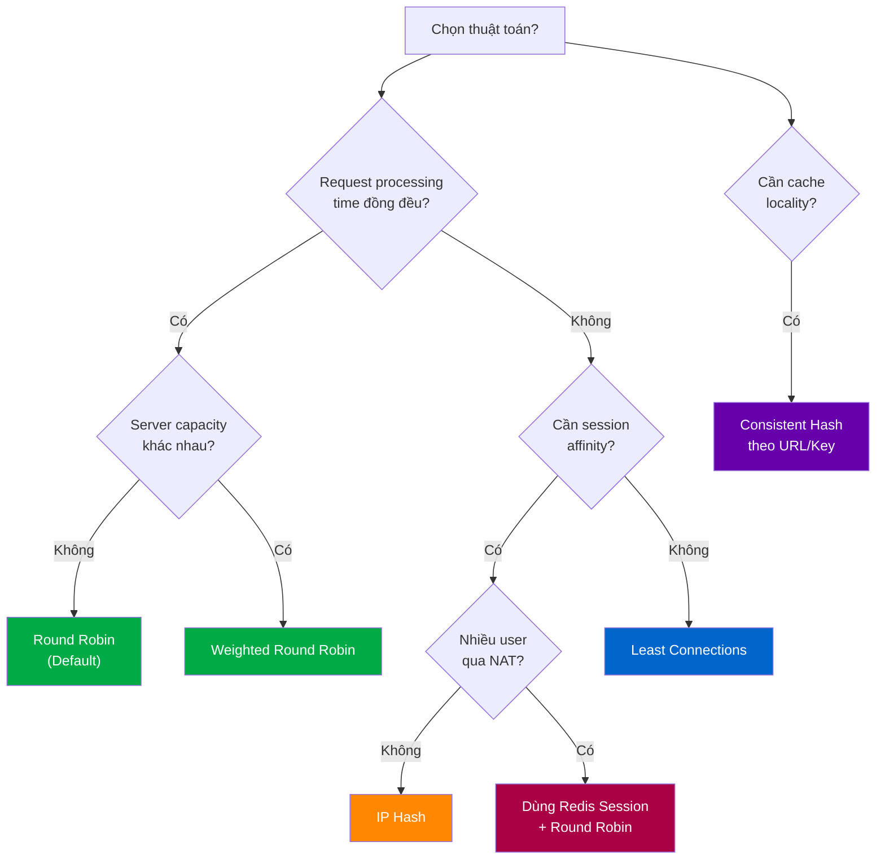

### 2.5 Session Persistence (Sticky Session)

**Vấn đề:** User login tại App Server 1, session được lưu in-memory. Request tiếp theo route đến App Server 2 → user bị logout.

#### Approach 1: Sticky Session (IP Hash hoặc Cookie-based)

```nginx
upstream shopx_backend {
    # Dùng sticky cookie (Nginx Plus)
    sticky cookie srv_id expires=1h domain=.shopx.com path=/;
    server app1.shopx.internal;
    server app2.shopx.internal;
}
```

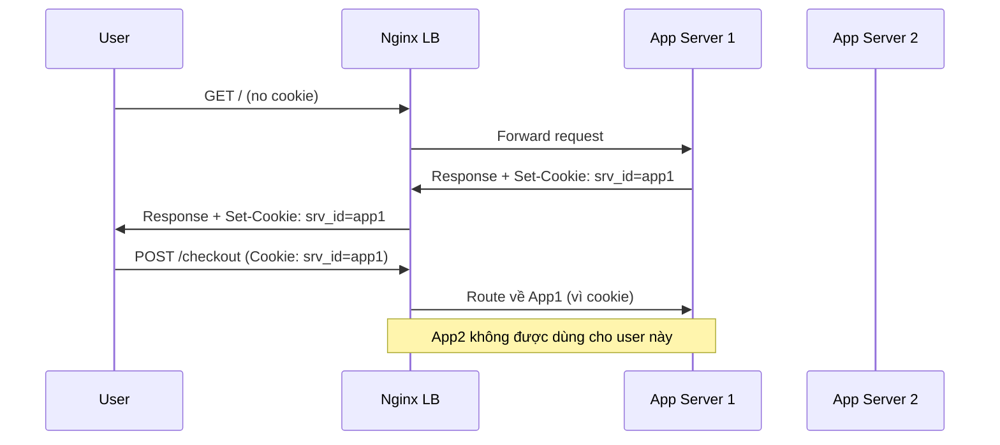

**Nhược điểm của Sticky Session:**

- Mất cân bằng tải khi nhiều user "dính" vào 1 server
- Server crash → tất cả session trên đó mất
- Khó scale

#### Approach 2: Centralized Session (Best Practice)

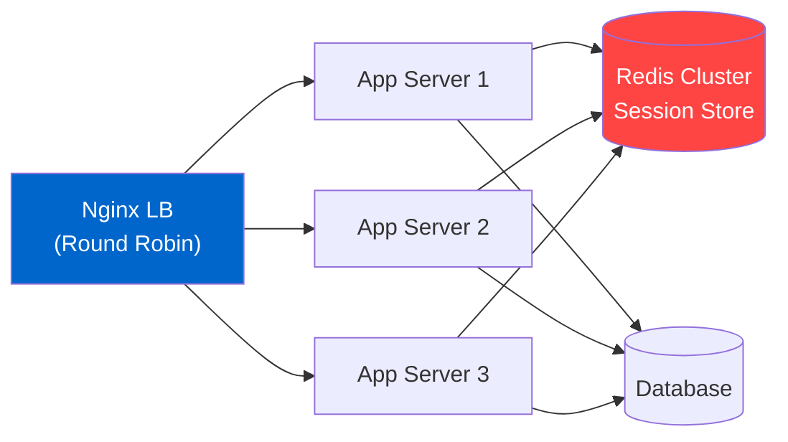

Mọi server đều đọc/ghi session từ Redis → **stateless application servers** → Round Robin hoạt động hoàn hảo.

> **ShopX Production:** Dùng Redis Cluster cho session, JWT cho API authentication. Không dùng sticky session.

### 2.6 Health Check

Health check là cơ chế LB phát hiện server bị lỗi và ngừng gửi traffic đến đó.

#### Passive Health Check

LB phát hiện lỗi thông qua **response thực tế của user request**.

```
User request → Server → 5xx error / timeout
→ LB đánh dấu server là "suspect"
→ Sau max_fails lần → mark as "down"
→ Sau fail_timeout giây → thử lại
```

**Nginx config:**

```nginx
upstream shopx_backend {
    server app1.shopx.internal max_fails=3 fail_timeout=30s;
    server app2.shopx.internal max_fails=3 fail_timeout=30s;
    server app3.shopx.internal max_fails=3 fail_timeout=30s;
}
```

**Nhược điểm:** User request đầu tiên vẫn bị lỗi trước khi LB phát hiện server down.

#### Active Health Check (Nginx Plus)

LB **chủ động gửi probe request** đến backend, không cần đợi user request.

```nginx
# Nginx Plus only
upstream shopx_backend {
    zone backend 64k;
    server app1.shopx.internal;
    server app2.shopx.internal;
}

server {
    location / {
        proxy_pass http://shopx_backend;
        health_check interval=10s fails=3 passes=2 uri=/health;
    }
}
```

**Health check endpoint trong application:**

```javascript
// Express.js health endpoint
app.get("/health", (req, res) => {
  // Kiểm tra DB connection, Redis, dependencies
  const checks = {
    database: checkDatabase(),
    redis: checkRedis(),
    uptime: process.uptime(),
  };

  const isHealthy = checks.database && checks.redis;
  res.status(isHealthy ? 200 : 503).json(checks);
});
```

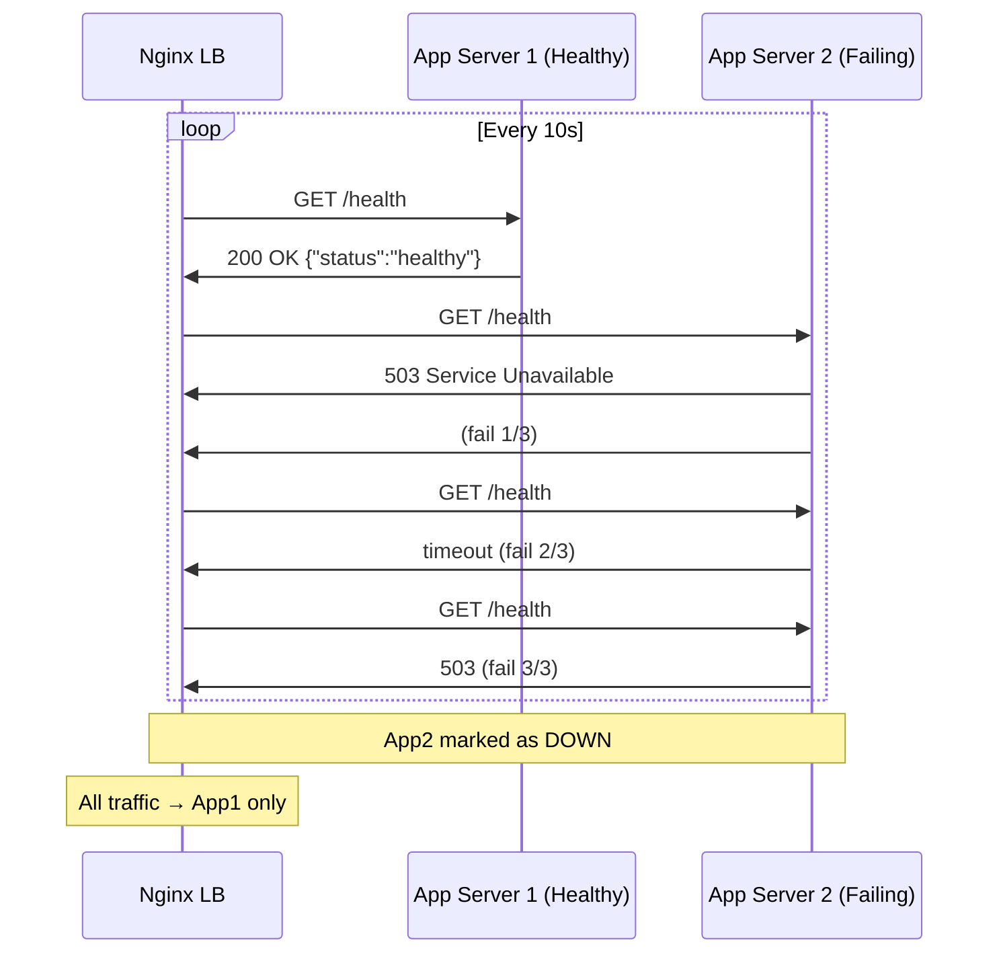

### 2.7 High Availability cho Load Balancer

**Irony:** Load Balancer loại bỏ SPOF cho app servers, nhưng bản thân LB lại là SPOF mới!

**Giải pháp: Active-Passive với Keepalived + Virtual IP**

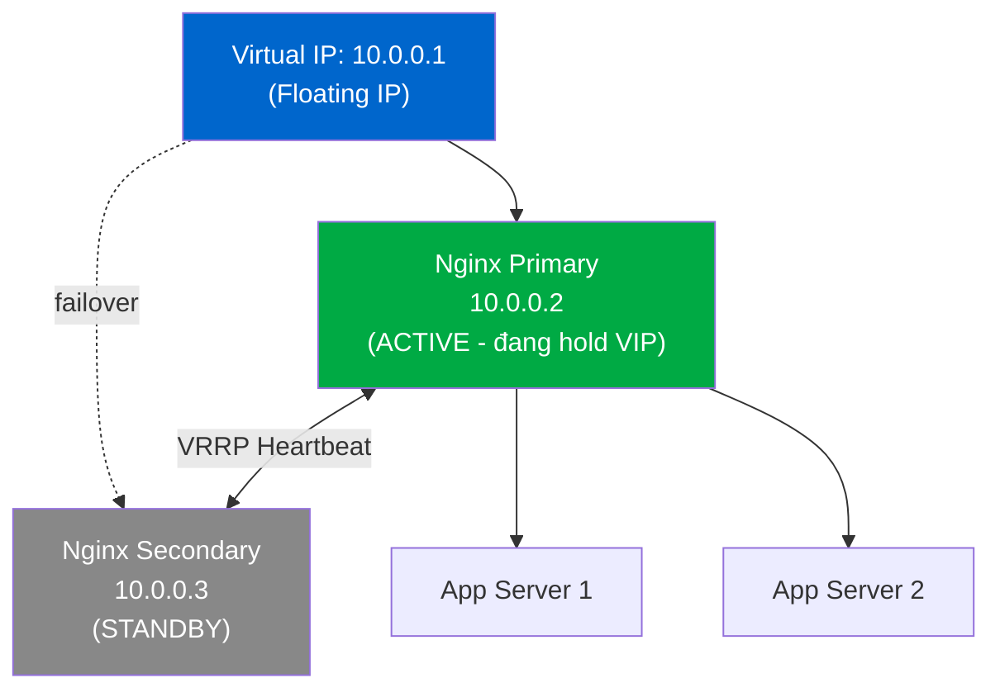

**Keepalived config (Primary):**

```
vrrp_instance VI_1 {
    state MASTER
    interface eth0
    virtual_router_id 51
    priority 200          # Higher = Primary
    advert_int 1

    virtual_ipaddress {
        10.0.0.1/24       # VIP - floating IP
    }

    track_script {
        chk_nginx
    }
}
```

Khi Primary down, Secondary tự động nhận VIP trong vài giây → **zero-downtime failover**.

## 3. Khi Nào Áp Dụng Load Balancing?

### Dấu Hiệu Cần Load Balancing

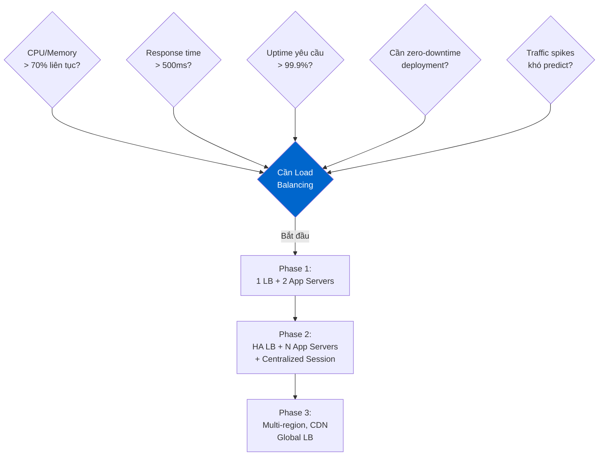

### Các Mức Độ Scaling

| Giai đoạn     | Scale              | Traffic          | Kiến trúc                    |
| ------------- | ------------------ | ---------------- | ---------------------------- |
| MVP / Startup | Vertical           | < 100 req/s      | Single server (no LB needed) |
| Growth        | Horizontal Phase 1 | 100-1000 req/s   | LB + 2-3 servers             |
| Scale         | Horizontal Phase 2 | 1000-10000 req/s | HA LB + auto-scaling groups  |
| Enterprise    | Global             | > 10000 req/s    | Multi-region, CDN, GSLB      |

> **ShopX thực tế:** Bắt đầu với 1 server, thêm LB khi traffic đạt 500 req/s và response time bắt đầu tăng.

## 4. Nginx: Tổng Quan & Kiến Trúc

### 4.1 Lịch Sử & Đặc Điểm

**Nginx** (đọc là "engine-x") được tạo bởi **Igor Sysoev** năm 2004, ban đầu để giải quyết **C10K Problem** — thách thức xử lý 10,000 kết nối đồng thời trên Linux khi Apache không làm được.

**Năm 2024:** Nginx phục vụ **34%** website toàn cầu, bao gồm Netflix, Airbnb, Dropbox, WordPress.com, GitHub.

**Các role của Nginx:**

- **Web server:** Phục vụ static files (HTML, CSS, JS, images)
- **Reverse proxy:** Nhận request từ client, forward đến backend
- **Load balancer:** Phân phối request ra nhiều backend
- **HTTP cache:** Cache response từ backend
- **SSL/TLS terminator:** Xử lý encryption tập trung
- **API gateway** (cơ bản): Rate limiting, auth forwarding

### 4.2 Kiến Trúc Event-Driven

Đây là lý do Nginx nhanh hơn Apache trong high-concurrency scenarios.

#### Apache: Process/Thread per Connection

```
Connection 1 → Thread 1 (blocking I/O wait)
Connection 2 → Thread 2 (blocking I/O wait)
Connection 3 → Thread 3 (blocking I/O wait)
...
Connection 1000 → Thread 1000 (1000 threads!)

❌ RAM: 1000 threads × ~8MB stack = 8GB!
❌ Context switching overhead
```

#### Nginx: Asynchronous Event-Driven

```
1 Master Process
├── Worker 1 (1 CPU core)
│   ├── Connection 1 (processing)
│   ├── Connection 2 (waiting for DB → event loop handles this)
│   ├── Connection 3 (sending response)
│   └── ... 10,000+ connections
└── Worker 2 (1 CPU core)
    └── ... 10,000+ connections

✅ RAM: 2 workers × ~few MB = minimal
✅ No context switching between connections
```

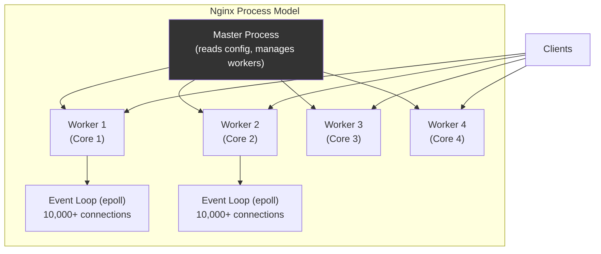

**Nginx config cơ bản:**

```nginx
worker_processes auto;          # = số CPU cores
worker_rlimit_nofile 65535;     # max file descriptors per worker

events {
    worker_connections 4096;    # connections per worker
    use epoll;                  # Linux event mechanism (default)
    multi_accept on;            # accept multiple connections at once
}
```

**Tính toán capacity:**

```
Max connections = worker_processes × worker_connections
= 4 × 4096 = 16,384 simultaneous connections per Nginx instance
```

### 4.3 Nginx vs Apache vs HAProxy vs AWS ALB

#### Bảng So Sánh Tổng Quan

| Tiêu chí                 | **Nginx**               | **Apache**              | **HAProxy**        | **AWS ALB**            |
| ------------------------ | ----------------------- | ----------------------- | ------------------ | ---------------------- |
| **Primary role**         | Web server + LB + Proxy | Web server              | Pure Load Balancer | Managed LB             |
| **Architecture**         | Event-driven, async     | Process/Thread per conn | Event-driven       | Managed (black box)    |
| **Concurrency**          | Rất cao (10K+/worker)   | Trung bình              | Rất cao            | Unlimited (auto-scale) |
| **Static files**         | ✅ Rất nhanh            | ✅ Tốt                  | ❌ Không hỗ trợ    | ❌ Không hỗ trợ        |
| **L7 LB**                | ✅                      | ✅ (mod_proxy)          | ✅ Rất mạnh        | ✅                     |
| **L4 LB**                | ✅ (stream module)      | ❌                      | ✅ Tốt nhất        | ❌ (Dùng NLB)          |
| **SSL termination**      | ✅                      | ✅                      | ✅                 | ✅                     |
| **Active health check**  | ❌ (Plus only)          | ❌                      | ✅ Free            | ✅                     |
| **Caching**              | ✅                      | ✅ (mod_cache)          | ❌                 | ❌                     |
| **gRPC**                 | ✅                      | ❌                      | ✅                 | ✅                     |
| **WebSocket**            | ✅                      | ✅ (mod_proxy_wstunnel) | ✅                 | ✅                     |
| **Config complexity**    | Trung bình              | Cao                     | Cao                | Thấp (UI/API)          |
| **Hot reload**           | ✅ Zero-downtime        | ❌                      | ✅                 | ✅                     |
| **Cost**                 | Free / Plus $$$         | Free                    | Free               | Pay-per-use            |
| **Operational overhead** | Trung bình              | Cao                     | Trung bình         | Thấp                   |
| **Customization**        | Cao                     | Cao                     | Rất cao            | Thấp                   |

#### Khi Nào Dùng Gì?

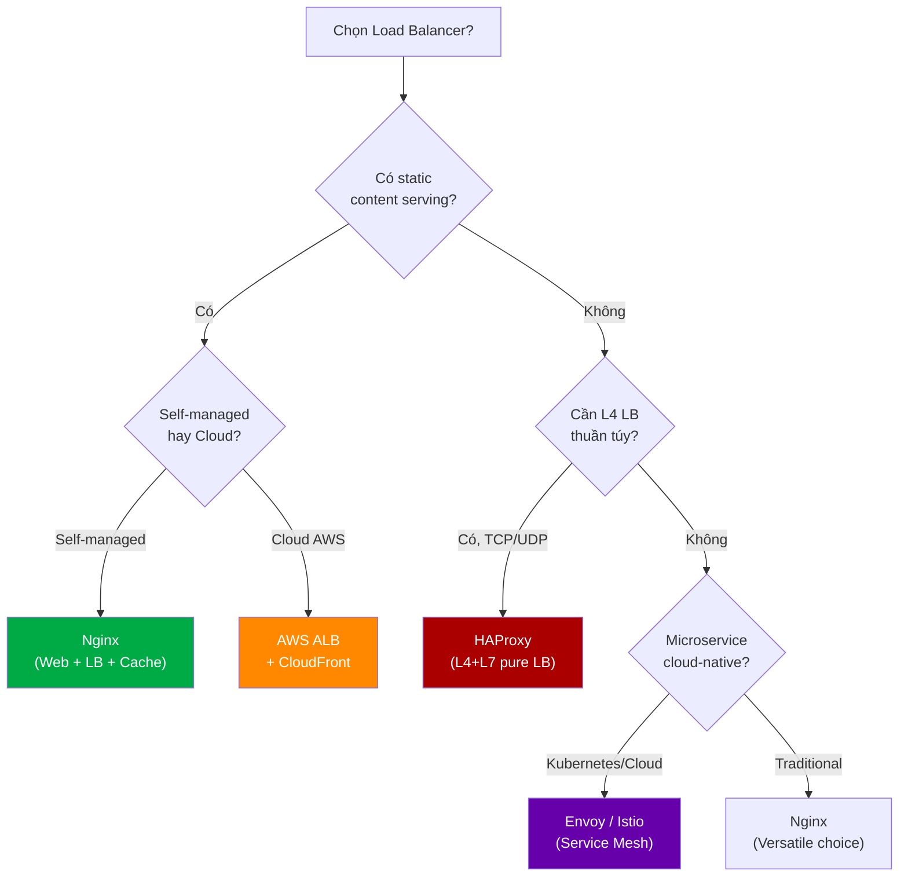

#### Nginx vs HAProxy (Chi Tiết)

| Aspect                  | Nginx                                          | HAProxy                    |
| ----------------------- | ---------------------------------------------- | -------------------------- |
| **Pure LB performance** | Tốt                                            | Tốt hơn một chút           |
| **Static file serving** | ✅ Best-in-class                               | ❌ Không                   |
| **Config syntax**       | Dễ đọc hơn                                     | Phức tạp hơn, powerful hơn |
| **Active health check** | Chỉ Nginx Plus                                 | ✅ Free                    |
| **ACL/Routing rules**   | Tốt                                            | Rất mạnh mẽ                |
| **Stats/Monitoring**    | Cơ bản (Plus = tốt hơn)                        | Built-in stats page        |
| **Pattern phổ biến**    | Nginx ở edge (static + TLS) + HAProxy internal | HAProxy pure LB            |

> **Best practice tại nhiều công ty:** Nginx ở edge (TLS termination, static files, rate limiting), HAProxy cho internal microservice routing hoặc database load balancing.

## 5. Nginx Load Balancing: Tính Năng & Cấu Hình

### 5.1 Upstream Module

`upstream` block là trái tim của load balancing trong Nginx. Nó định nghĩa **pool of backend servers**.

```nginx
# /etc/nginx/nginx.conf hoặc /etc/nginx/conf.d/shopx.conf

upstream shopx_api_backend {
    # Thuật toán (mặc định là round-robin nếu không khai báo)
    least_conn;

    # Server definitions
    server app1.shopx.internal:8080 weight=3 max_fails=3 fail_timeout=30s;
    server app2.shopx.internal:8080 weight=3 max_fails=3 fail_timeout=30s;
    server app3.shopx.internal:8080 weight=1 max_fails=3 fail_timeout=30s;

    # Backup server (chỉ dùng khi tất cả primary down)
    server backup.shopx.internal:8080 backup;

    # Connection pooling (giữ TCP connection để tái dùng)
    keepalive 32;
    keepalive_requests 100;
    keepalive_timeout 60s;
}

server {
    listen 80;
    server_name api.shopx.com;

    location /api/ {
        proxy_pass http://shopx_api_backend;

        # Cần thiết cho keepalive
        proxy_http_version 1.1;
        proxy_set_header Connection "";

        # Forward headers
        proxy_set_header Host $host;
        proxy_set_header X-Real-IP $remote_addr;
        proxy_set_header X-Forwarded-For $proxy_add_x_forwarded_for;
        proxy_set_header X-Forwarded-Proto $scheme;

        # Timeouts
        proxy_connect_timeout 5s;
        proxy_read_timeout 30s;
        proxy_send_timeout 30s;
    }
}
```

**Các parameter quan trọng của `server` directive:**

| Parameter         | Ý nghĩa                                | Default       |
| ----------------- | -------------------------------------- | ------------- |
| `weight=N`        | Trọng số (weighted round-robin)        | 1             |
| `max_fails=N`     | Số lần fail trước khi mark "down"      | 1             |
| `fail_timeout=Ns` | Thời gian mark "down" và reset counter | 10s           |
| `backup`          | Chỉ dùng khi tất cả server khác down   | -             |
| `down`            | Đánh dấu server offline vĩnh viễn      | -             |
| `max_conns=N`     | Giới hạn số connections đến server     | 0 (unlimited) |
| `resolve`         | Dynamic DNS resolution (Nginx Plus)    | -             |

### 5.2 Các Thuật Toán trong Nginx

```nginx
# 1. Round Robin (mặc định)
upstream rr_backend {
    server app1.internal;
    server app2.internal;
}

# 2. Weighted Round Robin
upstream weighted_backend {
    server app1.internal weight=5;  # 5/8 = 62.5% traffic
    server app2.internal weight=3;  # 3/8 = 37.5% traffic
}

# 3. Least Connections
upstream least_conn_backend {
    least_conn;
    server app1.internal;
    server app2.internal;
}

# 4. IP Hash (sticky by client IP)
upstream ip_hash_backend {
    ip_hash;
    server app1.internal;
    server app2.internal;
}

# 5. Generic Hash (bất kỳ key nào)
upstream hash_uri_backend {
    hash $request_uri consistent;  # consistent hashing
    server cache1.internal;
    server cache2.internal;
    server cache3.internal;
}

# 6. Hash theo cookie (user-based affinity)
upstream hash_cookie_backend {
    hash $cookie_user_id consistent;
    server app1.internal;
    server app2.internal;
}

# 7. Random (Nginx >= 1.15.1)
upstream random_backend {
    random;
    server app1.internal;
    server app2.internal;
}

# 8. Power of Two Choices (Nginx >= 1.15.1)
upstream p2c_backend {
    random two least_conn;
    server app1.internal;
    server app2.internal;
    server app3.internal;
}

# 9. Least Time - NGINX PLUS ONLY
# upstream least_time_backend {
#     least_time header;
#     server app1.internal;
# }
```

### 5.3 Health Check trong Nginx

#### Passive Health Check (Open Source)

```nginx
upstream shopx_backend {
    server app1.shopx.internal max_fails=3 fail_timeout=30s;
    server app2.shopx.internal max_fails=3 fail_timeout=30s;
    server app3.shopx.internal max_fails=3 fail_timeout=30s;
}

server {
    location / {
        proxy_pass http://shopx_backend;

        # Retry on errors (không retry POST để tránh duplicate)
        proxy_next_upstream error timeout http_500 http_502 http_503 http_504;
        proxy_next_upstream_tries 3;
        proxy_next_upstream_timeout 10s;
    }
}
```

**Giải thích `proxy_next_upstream`:**

```
error          = Lỗi kết nối TCP
timeout        = Kết nối timeout
http_500/502/503/504 = HTTP error codes
```

#### Active Health Check (Nginx Plus)

```nginx
upstream shopx_backend {
    zone backend 64k;   # Shared memory để workers đồng bộ state
    server app1.shopx.internal;
    server app2.shopx.internal;
    server app3.shopx.internal;
}

# Health check match condition
match shopx_health {
    status 200;
    header Content-Type = application/json;
    body ~ '"status":"healthy"';   # Response body phải chứa này
}

server {
    location / {
        proxy_pass http://shopx_backend;

        # Active health check
        health_check interval=10s      # Check mỗi 10 giây
                     fails=3           # 3 lần fail → mark down
                     passes=2          # 2 lần pass → mark up lại
                     uri=/health       # Endpoint để check
                     match=shopx_health;  # Match condition
    }
}
```

#### Alternative cho Open Source: nginx_upstream_check_module

Module third-party (được phát triển bởi Taobao team) hỗ trợ active health check cho Nginx open source:

```nginx
upstream shopx_backend {
    server app1.shopx.internal;
    server app2.shopx.internal;

    # nginx_upstream_check_module
    check interval=5000 rise=2 fall=3 timeout=1000 type=http;
    check_http_send "HEAD /health HTTP/1.0\r\n\r\n";
    check_http_expect_alive http_2xx;
}
```

### 5.4 SSL/TLS Termination

SSL termination tại load balancer là best practice: backend servers không cần quản lý SSL.

```
Client ←[HTTPS/TLS]→ Nginx LB ←[HTTP]→ App Servers
```

**Lợi ích:**

- Quản lý certificate tập trung (1 chỗ thay vì N servers)
- App servers không tốn CPU cho encryption
- Dễ update/renew certificate

```nginx
server {
    listen 443 ssl;
    http2 on;              # Bật HTTP/2
    server_name shopx.com www.shopx.com;

    # Certificate paths
    ssl_certificate     /etc/ssl/shopx.com/fullchain.pem;
    ssl_certificate_key /etc/ssl/shopx.com/privkey.pem;

    # Protocol & Cipher (Mozilla Modern Config - 2024)
    ssl_protocols TLSv1.2 TLSv1.3;
    ssl_ciphers ECDHE-ECDSA-AES128-GCM-SHA256:ECDHE-RSA-AES128-GCM-SHA256:ECDHE-ECDSA-AES256-GCM-SHA384:ECDHE-RSA-AES256-GCM-SHA384:ECDHE-ECDSA-CHACHA20-POLY1305:ECDHE-RSA-CHACHA20-POLY1305:DHE-RSA-AES128-GCM-SHA256:DHE-RSA-AES256-GCM-SHA384;
    ssl_prefer_server_ciphers off;

    # Session resumption (giảm TLS handshake overhead)
    ssl_session_cache shared:SSL:10m;
    ssl_session_timeout 1d;
    ssl_session_tickets off;  # Tắt vì security concern

    # OCSP Stapling (giảm latency)
    ssl_stapling on;
    ssl_stapling_verify on;
    ssl_trusted_certificate /etc/ssl/shopx.com/chain.pem;
    resolver 8.8.8.8 8.8.4.4 valid=300s;

    # Security headers
    add_header Strict-Transport-Security "max-age=63072000; includeSubDomains; preload" always;
    add_header X-Frame-Options DENY;
    add_header X-Content-Type-Options nosniff;

    location / {
        proxy_pass http://shopx_backend;
        # Thông báo cho backend biết request đến qua HTTPS
        proxy_set_header X-Forwarded-Proto https;
    }
}

# Redirect HTTP → HTTPS
server {
    listen 80;
    server_name shopx.com www.shopx.com;
    return 301 https://$host$request_uri;
}
```

### 5.5 Connection Keepalive & Pooling

Mỗi HTTP request tạo một TCP connection là cực kỳ tốn kém. Keepalive giữ connection mở để tái dùng.

```
WITHOUT keepalive:
  Client → [TCP SYN] → Nginx → [TCP SYN] → Backend   (3-way handshake)
  Nginx ← [Response] ← Backend
  [TCP FIN] (connection closed)
  ... next request = new TCP handshake = overhead!

WITH keepalive:
  Client → [TCP SYN] → Nginx → [TCP SYN] → Backend   (1 lần)
  Nginx ← [Response 1] ← Backend
  Nginx → [Request 2] → Backend (reuse connection!)
  Nginx ← [Response 2] ← Backend
  ...
```

**Config:**

```nginx
upstream shopx_backend {
    server app1.shopx.internal:8080;
    server app2.shopx.internal:8080;

    # Connection pool: giữ tối đa 32 idle connections per worker
    keepalive 32;

    # Số request tối đa qua 1 keepalive connection (sau đó close)
    keepalive_requests 100;

    # Thời gian giữ idle connection
    keepalive_timeout 60s;
}

server {
    location /api/ {
        proxy_pass http://shopx_backend;

        # QUAN TRỌNG: Phải set để keepalive hoạt động
        proxy_http_version 1.1;
        proxy_set_header Connection "";  # Xóa "Connection: close" header
    }
}
```

> **Thiếu hai dòng `proxy_http_version` và `proxy_set_header Connection ""`** là lỗi phổ biến nhất khiến keepalive không hoạt động và gây ra hàng nghìn TIME_WAIT connections.

### 5.6 Rate Limiting & Connection Limiting

**Rate limiting** bảo vệ backend khỏi DDoS và abuse.

```nginx
# Định nghĩa rate limit zones trong http block
http {
    # Limit theo IP: 10 requests/second per IP
    limit_req_zone $binary_remote_addr zone=shopx_api_limit:10m rate=10r/s;

    # Limit cho checkout: 2 requests/second per IP (nghiêm ngặt hơn)
    limit_req_zone $binary_remote_addr zone=shopx_checkout_limit:10m rate=2r/s;

    # Connection limit: max 100 concurrent connections per IP
    limit_conn_zone $binary_remote_addr zone=shopx_conn_limit:10m;

    server {
        # API endpoints: rate limit với burst
        location /api/ {
            limit_req zone=shopx_api_limit burst=20 nodelay;
            limit_conn shopx_conn_limit 100;
            limit_req_status 429;      # HTTP 429 Too Many Requests

            proxy_pass http://shopx_api_backend;
        }

        # Checkout: rate limit nghiêm hơn
        location /api/checkout {
            limit_req zone=shopx_checkout_limit burst=5 nodelay;
            limit_req_status 429;

            proxy_pass http://shopx_checkout_backend;
        }

        # Static files: không cần rate limit
        location /static/ {
            root /var/www/shopx;
            expires 30d;
            add_header Cache-Control "public, immutable";
        }
    }
}
```

**Giải thích `burst` và `nodelay`:**

```
rate=10r/s, burst=20, nodelay:

- Bình thường: 10 req/s pass through
- Burst: Cho phép 20 req vượt trên ngưỡng được xử lý NGAY (nodelay)
- Sau burst: Request tiếp theo bị delay hoặc reject (429)

Ví dụ: User F5 20 lần = tất cả pass
        F5 lần thứ 21 = 429 Too Many Requests
```

### 5.7 Caching

Nginx có thể cache response từ backend, giảm tải đáng kể cho app servers.

```nginx
http {
    # Cache storage: 10GB trên disk, 100MB metadata in RAM
    proxy_cache_path /var/cache/nginx/shopx
                     levels=1:2                    # Directory structure
                     keys_zone=shopx_cache:100m    # Metadata zone in RAM
                     max_size=10g                  # Max disk usage
                     inactive=60m                  # Xóa nếu không access trong 60m
                     use_temp_path=off;            # Ghi thẳng, không qua temp dir

    upstream shopx_backend {
        server app1.shopx.internal:8080;
        server app2.shopx.internal:8080;
    }

    server {
        # Product pages: cache 10 phút
        location /api/products/ {
            proxy_cache shopx_cache;
            proxy_cache_key "$scheme$request_method$host$request_uri";
            proxy_cache_valid 200 10m;      # Cache 200 OK trong 10 phút
            proxy_cache_valid 404 1m;       # Cache 404 trong 1 phút
            proxy_cache_use_stale error timeout updating;  # Dùng stale khi backend down
            proxy_cache_background_update on;  # Refresh in background
            proxy_cache_lock on;               # Chỉ 1 request refresh cache (ngăn thundering herd)

            # Thêm header để debug
            add_header X-Cache-Status $upstream_cache_status;

            proxy_pass http://shopx_backend;
        }

        # User-specific pages: KHÔNG cache
        location /api/cart/ {
            proxy_no_cache 1;
            proxy_cache_bypass 1;
            proxy_pass http://shopx_backend;
        }

        # API có authentication: không cache
        location /api/user/ {
            proxy_no_cache $http_authorization;
            proxy_cache_bypass $http_authorization;
            proxy_pass http://shopx_backend;
        }
    }
}
```

**Cache status values (X-Cache-Status header):**
| Value | Ý nghĩa |
|---|---|
| `HIT` | Response từ cache |
| `MISS` | Cache miss, lấy từ backend |
| `BYPASS` | Cache bị bypass |
| `EXPIRED` | Cache expired, lấy từ backend |
| `UPDATING` | Cache đang update (dùng stale response) |
| `STALE` | Backend lỗi, dùng cache cũ |

### 5.8 Gzip Compression

Nén response giảm bandwidth 60-80% cho text content.

```nginx
http {
    gzip on;
    gzip_vary on;              # Vary: Accept-Encoding header
    gzip_proxied any;          # Compress proxied responses
    gzip_comp_level 6;         # 1-9, 6 là balance tốt giữa speed/ratio
    gzip_min_length 1000;      # Không nén file nhỏ < 1KB
    gzip_buffers 16 8k;

    gzip_types
        text/plain
        text/css
        text/javascript
        application/javascript
        application/json
        application/xml
        application/rss+xml
        image/svg+xml
        font/woff
        font/woff2;

    # KHÔNG nén: image/jpeg, image/png, video/* (đã nén rồi)
}
```

### 5.9 Logging & Observability

Log đúng cách là cực kỳ quan trọng trong production để debug và monitor.

```nginx
http {
    # Custom log format với upstream info
    log_format detailed '$remote_addr - $remote_user [$time_local] '
                        '"$request" $status $body_bytes_sent '
                        '"$http_referer" "$http_user_agent" '
                        'rt=$request_time '                    # Total request time
                        'uct="$upstream_connect_time" '        # Upstream connect time
                        'uht="$upstream_header_time" '         # Upstream header time
                        'urt="$upstream_response_time" '       # Upstream response time
                        'ua="$upstream_addr" '                 # Upstream server address
                        'us="$upstream_status" '               # Upstream status
                        'cs=$upstream_cache_status';           # Cache status

    # JSON format cho log aggregation (ELK, Datadog)
    log_format json_combined escape=json
        '{'
            '"time":"$time_iso8601",'
            '"remote_addr":"$remote_addr",'
            '"method":"$request_method",'
            '"uri":"$request_uri",'
            '"status":$status,'
            '"bytes_sent":$body_bytes_sent,'
            '"request_time":$request_time,'
            '"upstream_response_time":"$upstream_response_time",'
            '"upstream_addr":"$upstream_addr",'
            '"upstream_status":"$upstream_status",'
            '"user_agent":"$http_user_agent",'
            '"cache_status":"$upstream_cache_status"'
        '}';

    server {
        access_log /var/log/nginx/shopx_access.log json_combined;
        error_log  /var/log/nginx/shopx_error.log warn;

        # Không log health checks
        location = /health {
            access_log off;
            return 200 "OK";
        }

        # Không log static files (giảm I/O)
        location /static/ {
            access_log off;
            root /var/www/shopx;
        }
    }
}
```

**Metrics quan trọng cần monitor:**

```
- upstream_response_time: Thời gian backend xử lý
- request_time: Tổng thời gian (bao gồm thời gian gửi response về client)
- upstream_status: Status từ backend (5xx = backend lỗi)
- upstream_addr: Server nào đang xử lý request (để debug)
- $upstream_cache_status: Cache effectiveness
```

## 6. Case Study: Hệ Thống E-Commerce ShopX

### 6.1 Kiến Trúc Tổng Thể

ShopX là hệ thống e-commerce phục vụ 100,000 users đồng thời trong peak hours, với các service chính:

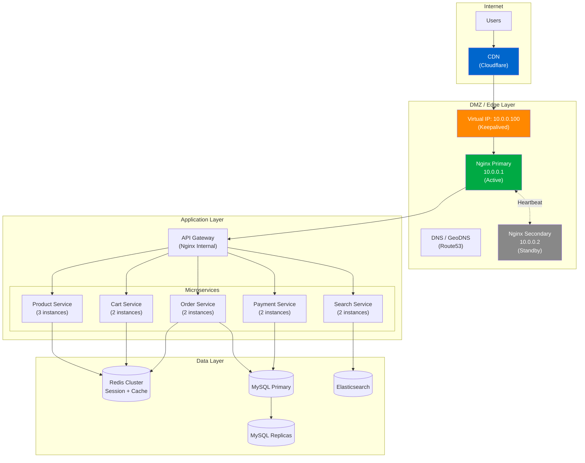

### 6.2 Traffic Flow Diagram

**User mua hàng — Full request flow:**

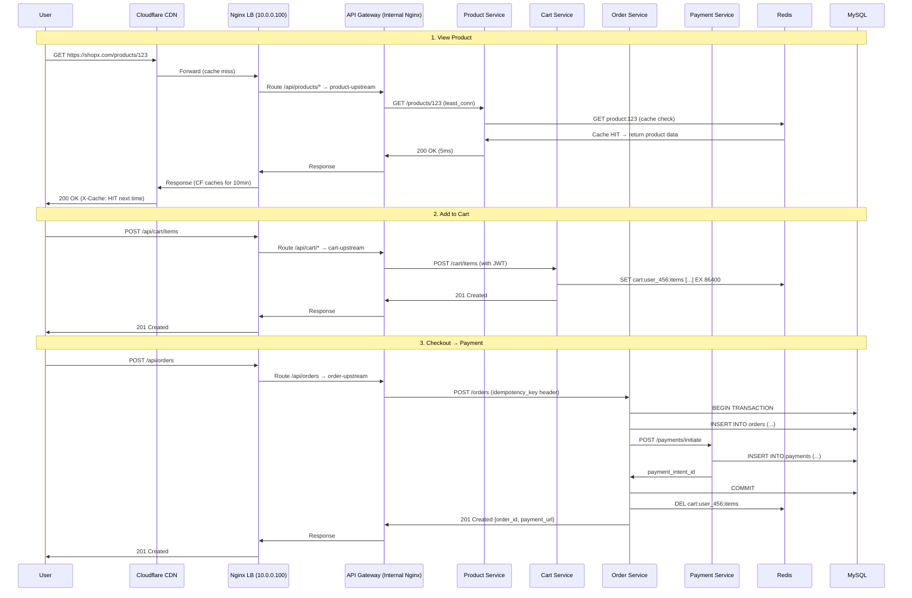

### 6.3 Cấu Hình Nginx Production

#### Edge Nginx (Public-facing)

```nginx
# /etc/nginx/nginx.conf
user www-data;
worker_processes auto;
worker_rlimit_nofile 65535;
pid /run/nginx.pid;

events {
    worker_connections 4096;
    use epoll;
    multi_accept on;
}

http {
    # Basic settings
    sendfile on;
    tcp_nopush on;
    tcp_nodelay on;
    keepalive_timeout 65;
    keepalive_requests 1000;
    types_hash_max_size 2048;
    server_tokens off;           # Ẩn Nginx version

    include /etc/nginx/mime.types;
    default_type application/octet-stream;

    # --- Rate Limiting Zones ---
    limit_req_zone $binary_remote_addr zone=api_global:20m rate=100r/s;
    limit_req_zone $binary_remote_addr zone=checkout:10m rate=5r/s;
    limit_req_zone $binary_remote_addr zone=search:10m rate=30r/s;
    limit_conn_zone $binary_remote_addr zone=conn_per_ip:10m;

    # --- Cache ---
    proxy_cache_path /var/cache/nginx/shopx
                     levels=1:2
                     keys_zone=shopx_cache:200m
                     max_size=20g
                     inactive=30m
                     use_temp_path=off;

    # --- Gzip ---
    gzip on;
    gzip_vary on;
    gzip_proxied any;
    gzip_comp_level 6;
    gzip_min_length 1000;
    gzip_types text/plain text/css application/json application/javascript
               text/xml application/xml image/svg+xml;

    # --- Logging ---
    log_format json_combined escape=json
        '{"time":"$time_iso8601",'
        '"remote_addr":"$remote_addr",'
        '"method":"$request_method",'
        '"uri":"$request_uri",'
        '"status":$status,'
        '"bytes_sent":$body_bytes_sent,'
        '"request_time":$request_time,'
        '"upstream_response_time":"$upstream_response_time",'
        '"upstream_addr":"$upstream_addr",'
        '"upstream_status":"$upstream_status",'
        '"cache":"$upstream_cache_status"}';

    include /etc/nginx/conf.d/*.conf;
}
```

```nginx
# /etc/nginx/conf.d/shopx-upstreams.conf

# API Gateway internal Nginx instances
upstream shopx_api_gateway {
    least_conn;
    server api-gw-1.shopx.internal:8080 weight=1 max_fails=3 fail_timeout=30s;
    server api-gw-2.shopx.internal:8080 weight=1 max_fails=3 fail_timeout=30s;

    # Connection pooling
    keepalive 64;
    keepalive_requests 200;
    keepalive_timeout 60s;
}

# Static asset servers
upstream shopx_static {
    server static-1.shopx.internal:8080;
    server static-2.shopx.internal:8080;
    keepalive 32;
}
```

```nginx
# /etc/nginx/conf.d/shopx-main.conf

server {
    listen 443 ssl;
    http2 on;
    server_name shopx.com www.shopx.com;

    # SSL config
    ssl_certificate     /etc/letsencrypt/live/shopx.com/fullchain.pem;
    ssl_certificate_key /etc/letsencrypt/live/shopx.com/privkey.pem;
    ssl_protocols TLSv1.2 TLSv1.3;
    ssl_ciphers ECDHE-ECDSA-AES128-GCM-SHA256:ECDHE-RSA-AES128-GCM-SHA256:ECDHE-ECDSA-AES256-GCM-SHA384:ECDHE-RSA-AES256-GCM-SHA384:ECDHE-ECDSA-CHACHA20-POLY1305:ECDHE-RSA-CHACHA20-POLY1305;
    ssl_prefer_server_ciphers off;
    ssl_session_cache shared:SSL:20m;
    ssl_session_timeout 1d;
    ssl_session_tickets off;
    ssl_stapling on;
    ssl_stapling_verify on;
    resolver 8.8.8.8 8.8.4.4 valid=300s;

    # Security headers
    add_header Strict-Transport-Security "max-age=63072000; includeSubDomains; preload" always;
    add_header X-Frame-Options SAMEORIGIN always;
    add_header X-Content-Type-Options nosniff always;
    add_header Referrer-Policy strict-origin-when-cross-origin always;

    # Connection limit per IP
    limit_conn conn_per_ip 100;

    # Logging
    access_log /var/log/nginx/shopx_access.log json_combined;
    error_log  /var/log/nginx/shopx_error.log warn;

    # --- Static Files ---
    location /static/ {
        proxy_cache shopx_cache;
        proxy_cache_valid 200 30d;
        proxy_cache_use_stale error timeout;

        add_header X-Cache-Status $upstream_cache_status;
        add_header Cache-Control "public, max-age=2592000, immutable";

        access_log off;   # Không log static files

        proxy_pass http://shopx_static;
        proxy_http_version 1.1;
        proxy_set_header Connection "";
    }

    # --- API: Products (cacheable) ---
    location /api/v1/products {
        limit_req zone=api_global burst=50 nodelay;

        proxy_cache shopx_cache;
        proxy_cache_key "$request_method$request_uri";
        proxy_cache_valid 200 5m;
        proxy_cache_bypass $http_cache_control;
        proxy_cache_use_stale error timeout updating;
        proxy_cache_background_update on;
        proxy_cache_lock on;

        add_header X-Cache-Status $upstream_cache_status;

        proxy_pass http://shopx_api_gateway;
        proxy_http_version 1.1;
        proxy_set_header Connection "";
        proxy_set_header Host $host;
        proxy_set_header X-Real-IP $remote_addr;
        proxy_set_header X-Forwarded-For $proxy_add_x_forwarded_for;
        proxy_set_header X-Forwarded-Proto $scheme;

        proxy_connect_timeout 5s;
        proxy_read_timeout 30s;

        proxy_next_upstream error timeout http_500 http_502 http_503;
        proxy_next_upstream_tries 2;
    }

    # --- API: Search ---
    location /api/v1/search {
        limit_req zone=search burst=10 nodelay;

        proxy_pass http://shopx_api_gateway;
        proxy_http_version 1.1;
        proxy_set_header Connection "";
        proxy_set_header Host $host;
        proxy_set_header X-Real-IP $remote_addr;
        proxy_set_header X-Forwarded-For $proxy_add_x_forwarded_for;
        proxy_set_header X-Forwarded-Proto $scheme;

        proxy_connect_timeout 5s;
        proxy_read_timeout 10s;
    }

    # --- API: Checkout (strict rate limit, no cache) ---
    location /api/v1/checkout {
        limit_req zone=checkout burst=2 nodelay;

        proxy_no_cache 1;
        proxy_cache_bypass 1;

        proxy_pass http://shopx_api_gateway;
        proxy_http_version 1.1;
        proxy_set_header Connection "";
        proxy_set_header Host $host;
        proxy_set_header X-Real-IP $remote_addr;
        proxy_set_header X-Forwarded-For $proxy_add_x_forwarded_for;
        proxy_set_header X-Forwarded-Proto $scheme;

        proxy_connect_timeout 5s;
        proxy_read_timeout 60s;  # Checkout có thể chậm hơn
    }

    # --- API: General ---
    location /api/ {
        limit_req zone=api_global burst=20 nodelay;

        proxy_pass http://shopx_api_gateway;
        proxy_http_version 1.1;
        proxy_set_header Connection "";
        proxy_set_header Host $host;
        proxy_set_header X-Real-IP $remote_addr;
        proxy_set_header X-Forwarded-For $proxy_add_x_forwarded_for;
        proxy_set_header X-Forwarded-Proto $scheme;

        proxy_connect_timeout 5s;
        proxy_read_timeout 30s;
        proxy_send_timeout 30s;

        proxy_next_upstream error timeout http_500 http_502 http_503;
        proxy_next_upstream_tries 2;
        proxy_next_upstream_timeout 10s;
    }

    # --- WebSocket (Live notifications) ---
    location /ws/ {
        proxy_pass http://shopx_api_gateway;
        proxy_http_version 1.1;
        proxy_set_header Upgrade $http_upgrade;
        proxy_set_header Connection "upgrade";
        proxy_set_header Host $host;
        proxy_set_header X-Real-IP $remote_addr;
        proxy_read_timeout 3600s;  # WebSocket long-lived
        proxy_send_timeout 3600s;
    }

    # --- SPA Frontend ---
    location / {
        proxy_pass http://shopx_api_gateway;
        proxy_http_version 1.1;
        proxy_set_header Connection "";
        proxy_set_header Host $host;
        proxy_set_header X-Real-IP $remote_addr;
        proxy_set_header X-Forwarded-For $proxy_add_x_forwarded_for;

        # Fallback cho React Router (SPA)
        try_files $uri $uri/ @fallback;
    }

    location @fallback {
        proxy_pass http://shopx_api_gateway;
    }

    # Health check endpoint (không cache, không rate limit)
    location = /health {
        access_log off;
        return 200 '{"status":"ok","service":"nginx-edge"}';
        add_header Content-Type application/json;
    }
}

# HTTP → HTTPS redirect
server {
    listen 80;
    server_name shopx.com www.shopx.com;
    return 301 https://$host$request_uri;
}
```

#### Internal API Gateway Nginx

```nginx
# /etc/nginx/conf.d/internal-upstreams.conf (trên API Gateway servers)

upstream product_service {
    least_conn;
    server product-svc-1.shopx.internal:3000 max_fails=3 fail_timeout=20s;
    server product-svc-2.shopx.internal:3000 max_fails=3 fail_timeout=20s;
    server product-svc-3.shopx.internal:3000 max_fails=3 fail_timeout=20s;
    keepalive 32;
}

upstream cart_service {
    least_conn;
    server cart-svc-1.shopx.internal:3001 max_fails=3 fail_timeout=20s;
    server cart-svc-2.shopx.internal:3001 max_fails=3 fail_timeout=20s;
    keepalive 16;
}

upstream order_service {
    # Order service: ít instance hơn, xử lý lâu hơn
    least_conn;
    server order-svc-1.shopx.internal:3002 max_fails=2 fail_timeout=30s;
    server order-svc-2.shopx.internal:3002 max_fails=2 fail_timeout=30s;
    keepalive 16;
}

upstream payment_service {
    # Payment: chỉ 2 instance, không retry để tránh double charge
    server payment-svc-1.shopx.internal:3003 max_fails=1 fail_timeout=60s;
    server payment-svc-2.shopx.internal:3003 max_fails=1 fail_timeout=60s;
    keepalive 8;
}

upstream search_service {
    # Hash theo query để cache locality
    hash $arg_q consistent;
    server search-svc-1.shopx.internal:3004 max_fails=3 fail_timeout=20s;
    server search-svc-2.shopx.internal:3004 max_fails=3 fail_timeout=20s;
    keepalive 16;
}
```

```nginx
# /etc/nginx/conf.d/internal-routing.conf

server {
    listen 8080;
    server_name api-gateway.shopx.internal;

    # Route theo URL path đến service tương ứng
    location /api/v1/products {
        proxy_pass http://product_service;
        include /etc/nginx/proxy_params.conf;
        proxy_read_timeout 10s;
    }

    location /api/v1/cart {
        proxy_pass http://cart_service;
        include /etc/nginx/proxy_params.conf;
        proxy_read_timeout 10s;
    }

    location /api/v1/orders {
        proxy_pass http://order_service;
        include /etc/nginx/proxy_params.conf;
        proxy_read_timeout 60s;

        # KHÔNG retry POST /orders (idempotency cần handle ở app layer)
        proxy_next_upstream off;
    }

    location /api/v1/payments {
        proxy_pass http://payment_service;
        include /etc/nginx/proxy_params.conf;
        proxy_read_timeout 30s;

        # KHÔNG retry payment requests
        proxy_next_upstream off;
    }

    location /api/v1/search {
        proxy_pass http://search_service;
        include /etc/nginx/proxy_params.conf;
        proxy_read_timeout 5s;
    }
}
```

```nginx
# /etc/nginx/proxy_params.conf (shared config)

proxy_http_version 1.1;
proxy_set_header Connection "";
proxy_set_header Host $host;
proxy_set_header X-Real-IP $remote_addr;
proxy_set_header X-Forwarded-For $proxy_add_x_forwarded_for;
proxy_set_header X-Forwarded-Proto $scheme;
proxy_set_header X-Request-ID $request_id;   # Tracing

proxy_connect_timeout 5s;
proxy_send_timeout 30s;

proxy_next_upstream error timeout http_502 http_503;
proxy_next_upstream_tries 2;
proxy_next_upstream_timeout 10s;
```

### 6.4 Flash Sale Scenario

**Tình huống:** ShopX tổ chức Flash Sale lúc 12:00, dự kiến traffic tăng 10x trong 5 phút đầu.

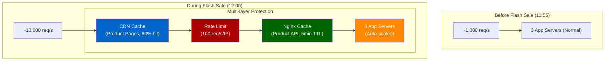

**Traffic breakdown trong Flash Sale:**

```
10,000 req/s vào CDN
  └── 8,000 req/s CDN cache HIT (static, product page HTML) → 0 load vào Nginx
  └── 2,000 req/s CDN cache MISS → vào Nginx
         └── 1,500 req/s Nginx cache HIT (product API) → 0 load vào App
         └──   500 req/s thực sự vào App servers
                  ÷ 6 servers = ~83 req/s/server (manageable!)
```

**Config đặc biệt cho Flash Sale:**

```nginx
# Tăng cache TTL trước Flash Sale
location /api/v1/products/flash-sale {
    proxy_cache shopx_cache;
    proxy_cache_valid 200 60s;           # Tăng từ 5m lên 60s (để update giá)
    proxy_cache_lock on;                  # Prevent thundering herd
    proxy_cache_lock_timeout 3s;
    proxy_cache_use_stale updating;       # Dùng stale khi đang refresh

    # Rate limit nghiêm hơn cho Flash Sale items
    limit_req zone=flash_sale burst=5 nodelay;

    proxy_pass http://shopx_api_gateway;
}

# Cần thêm zone cho Flash Sale
limit_req_zone $binary_remote_addr zone=flash_sale:20m rate=3r/s;
```

## 7. Best Practices

### 7.1 Configuration Best Practices

```nginx
# ✅ BEST PRACTICE: Luôn set worker_processes = auto
worker_processes auto;

# ✅ BEST PRACTICE: Tăng file descriptor limit
worker_rlimit_nofile 65535;

# ✅ BEST PRACTICE: Ẩn Nginx version
server_tokens off;

# ✅ BEST PRACTICE: Luôn dùng HTTP/1.1 và clear Connection header với upstream
proxy_http_version 1.1;
proxy_set_header Connection "";

# ✅ BEST PRACTICE: Forward real client IP
proxy_set_header X-Real-IP $remote_addr;
proxy_set_header X-Forwarded-For $proxy_add_x_forwarded_for;

# ✅ BEST PRACTICE: Set timeouts hợp lý (không quá dài, không quá ngắn)
proxy_connect_timeout 5s;
proxy_read_timeout 30s;

# ✅ BEST PRACTICE: Dùng backup server
upstream my_backend {
    server primary1.internal;
    server primary2.internal;
    server backup1.internal backup;  # Chỉ dùng khi tất cả primary down
}

# ✅ BEST PRACTICE: Request ID cho tracing
add_header X-Request-ID $request_id always;
proxy_set_header X-Request-ID $request_id;
```

### 7.2 Security Best Practices

```nginx
# ✅ Chỉ accept TLS 1.2+
ssl_protocols TLSv1.2 TLSv1.3;

# ✅ HSTS header
add_header Strict-Transport-Security "max-age=63072000; includeSubDomains; preload" always;

# ✅ Giới hạn request body size (prevent large request DoS)
client_max_body_size 10m;

# ✅ Không expose internal IPs trong error responses
proxy_hide_header X-Powered-By;
proxy_hide_header Server;

# ✅ Rate limiting để prevent DDoS/brute force
limit_req_zone $binary_remote_addr zone=login:10m rate=5r/m;

# ✅ Block common attack patterns
location ~* \.(git|svn|htaccess|env)$ {
    deny all;
}
```

### 7.3 Operational Best Practices

```bash
# ✅ Luôn test config trước khi reload
nginx -t && systemctl reload nginx

# ✅ Không bao giờ restart trong production (dùng reload - zero-downtime)
systemctl reload nginx    # ĐÚNG
systemctl restart nginx   # SAI - drops all active connections!

# ✅ Kiểm tra syntax trước khi deploy
nginx -T    # Print full config (bao gồm includes)
nginx -t    # Test syntax only

# ✅ Monitor với log parsing
tail -f /var/log/nginx/access.log | grep '"status":5'  # Monitor 5xx errors

# ✅ Cấu hình log rotation
# /etc/logrotate.d/nginx
/var/log/nginx/*.log {
    daily
    missingok
    rotate 14
    compress
    delaycompress
    notifempty
    sharedscripts
    postrotate
        nginx -s reopen  # Send USR1 signal to reopen log files
    endscript
}
```

### 7.4 Capacity Planning

| Workload                 | Algorithm                    | Rationale                        |
| ------------------------ | ---------------------------- | -------------------------------- |
| Static API, đồng đều     | Round Robin                  | Simple, hiệu quả                 |
| Mixed APIs (fast + slow) | Least Connections            | Tránh slow request block worker  |
| Cache server pool        | Consistent Hash bởi URL      | Maximize cache hit rate          |
| Checkout, payment        | Least Connections            | Quan trọng hơn để tránh overload |
| WebSocket                | IP Hash hoặc Consistent Hash | Keep persistent connection       |
| Image processing         | Least Connections            | Variable processing time         |

## 8. Anti-Patterns

### 8.1 Anti-Pattern: Thiếu `proxy_http_version 1.1`

```nginx
# ❌ SAI: Gây TIME_WAIT connection flood
upstream backend {
    keepalive 32;  # Cấu hình keepalive nhưng...
    server app1.internal;
}

location / {
    proxy_pass http://backend;
    # THIẾU: proxy_http_version 1.1;
    # THIẾU: proxy_set_header Connection "";
    # → HTTP 1.0 không support keepalive → mỗi request = TCP connection mới → TIME_WAIT flood
}

# ✅ ĐÚNG:
location / {
    proxy_pass http://backend;
    proxy_http_version 1.1;
    proxy_set_header Connection "";
}
```

**Triệu chứng:** `ss -s` hiển thị hàng nghìn TIME_WAIT, 502 errors xuất hiện dưới tải cao.

### 8.2 Anti-Pattern: Retry Không An Toàn

```nginx
# ❌ SAI: Retry POST request → có thể gây duplicate order!
location /api/orders {
    proxy_next_upstream error timeout http_500;
    proxy_pass http://order_service;
}

# ✅ ĐÚNG: Không retry non-idempotent requests
location /api/orders {
    proxy_next_upstream off;   # Không retry
    proxy_pass http://order_service;
    # Handle ở application layer với idempotency key
}

# ✅ HOẶC: Chỉ retry các safe conditions
location /api/products {
    # Chỉ retry khi timeout/connection error, không retry http_500
    proxy_next_upstream error timeout;
    proxy_pass http://product_service;
}
```

### 8.3 Anti-Pattern: Timeout Quá Dài / Quá Ngắn

```nginx
# ❌ SAI: Timeout quá dài → slow request chiếm connection lâu
proxy_read_timeout 300s;  # 5 phút! → Khi backend chậm, connections bị giữ quá lâu

# ❌ SAI: Timeout quá ngắn → false positive timeouts
proxy_read_timeout 1s;   # → Checkout chậm 2s bị timeout oan

# ✅ ĐÚNG: Set timeout phù hợp theo từng endpoint
location /api/products { proxy_read_timeout 10s; }
location /api/search   { proxy_read_timeout 5s; }
location /api/checkout { proxy_read_timeout 60s; }
location /api/payments { proxy_read_timeout 30s; }
```

### 8.4 Anti-Pattern: Dùng IP Hash Mà Không Có Session Store

```nginx
# ❌ SAI: Dùng ip_hash để "fix" session
upstream backend {
    ip_hash;
    server app1.internal;
    server app2.internal;
}
# Vấn đề:
# 1. Corporate users cùng IP → tất cả vào 1 server → mất cân bằng
# 2. Thêm server → nhiều user bị redirect → session mất
# 3. Server down → session mất

# ✅ ĐÚNG: Dùng centralized session store
# 1. Dùng Redis Cluster cho session storage
# 2. Dùng JWT (stateless) cho API authentication
# 3. Dùng round-robin / least_conn bình thường
upstream backend {
    least_conn;
    server app1.internal;
    server app2.internal;
}
```

### 8.5 Anti-Pattern: Cache Response Có Authentication

```nginx
# ❌ SAI: Cache user-specific data
location /api/user/profile {
    proxy_cache my_cache;
    proxy_cache_valid 200 10m;
    proxy_pass http://backend;
    # → User A thấy profile của User B!
}

# ✅ ĐÚNG: Không cache authenticated responses
location /api/user/ {
    proxy_no_cache 1;
    proxy_cache_bypass 1;
    proxy_pass http://backend;
}

# ✅ Hoặc cache theo user-specific key
location /api/user/public-profile/ {
    proxy_cache my_cache;
    proxy_cache_key "$uri";          # URL đã include user ID
    proxy_cache_valid 200 5m;
    proxy_pass http://backend;
}
```

### 8.6 Anti-Pattern: Single Point of Failure ở Load Balancer

```
# ❌ SAI: Chỉ 1 Nginx instance
Internet → Nginx (SPOF!) → App Servers

# ✅ ĐÚNG: HA với Keepalived
Internet → Virtual IP → [Nginx Primary (Active) | Nginx Secondary (Standby)]
                      ↕ VRRP Heartbeat
```

### 8.7 Anti-Pattern: Không Monitor Upstream Response Time

```nginx
# ❌ SAI: Chỉ log basic access
log_format simple '$remote_addr "$request" $status $body_bytes_sent';

# ✅ ĐÚNG: Log upstream metrics để debug bottleneck
log_format detailed '$remote_addr "$request" $status '
                    'rt=$request_time '
                    'uct=$upstream_connect_time '
                    'urt=$upstream_response_time '
                    'ua=$upstream_addr';
```

## 9. Real-World: Bài Học từ Netflix & Amazon

### 9.1 Netflix: Two-Tier Load Balancing

Netflix phục vụ hơn **65 triệu concurrent streams** ở peak. Kiến trúc load balancing của họ:

**Tier 1: DNS-based Round Robin**

- AWS Route53 phân phối traffic qua nhiều Availability Zones
- Client nhận danh sách IP từ DNS, tự kết nối đến một trong số đó

**Tier 2: ELB trong từng AZ**

- Sau khi vào AZ, ELB thực hiện round-robin đến EC2 instances trong AZ đó
- Stateless services cho phép routing đến bất kỳ instance nào

**Bài học quan trọng từ AWS outage 2011:**

- Netflix có 3 AZ, mỗi AZ có nhiều instances
- Khi 1 AZ down → 2 AZ còn lại phải xử lý 50% traffic thêm
- **Lesson:** Mỗi AZ phải có capacity để xử lý 150% normal load (N+1 headroom)
- **Lesson:** Stateless service là yêu cầu bắt buộc → bất kỳ instance nào có thể serve bất kỳ request nào

**Chaos Monkey:** Netflix cố tình terminate EC2 instances ngẫu nhiên trong production để đảm bảo hệ thống recover tự động. Load balancer phải detect và route around failures trong vài giây.

### 9.2 Amazon: Shuffle Sharding

Amazon phát triển kỹ thuật **Shuffle Sharding** cho load balancing:

**Vấn đề:** Nếu customer A và customer B dùng chung worker pool, một "noisy neighbor" customer A có thể ảnh hưởng customer B.

**Giải pháp:** Mỗi customer được assign một **subset nhỏ** của worker pool (shard). Overlap giữa các shard rất ít.

```
Total workers: W1, W2, W3, W4, W5, W6, W7, W8

Customer A's shard: W1, W3, W6, W8  (4 workers)
Customer B's shard: W2, W4, W5, W7  (4 workers)
Customer C's shard: W1, W2, W5, W8  (overlap với A và B nhưng ít)

→ Nếu Customer A gây overload: chỉ W1, W3, W6, W8 bị ảnh hưởng
→ Customer B (dùng W2, W4, W5, W7) không bị ảnh hưởng
```

**Áp dụng cho ShopX:**

```nginx
# Chia merchant thành các pool riêng
upstream shopx_merchant_pool_a {
    server worker1.internal;
    server worker3.internal;
    server worker6.internal;
    server worker8.internal;
}

upstream shopx_merchant_pool_b {
    server worker2.internal;
    server worker4.internal;
    server worker5.internal;
    server worker7.internal;
}

# Route merchant theo ID
map $http_x_merchant_id $merchant_upstream {
    ~^[0-4]  shopx_merchant_pool_a;
    default  shopx_merchant_pool_b;
}

location /api/merchant/ {
    proxy_pass http://$merchant_upstream;
}
```

### 9.3 Airbnb: Blue-Green Deployment với Nginx

Airbnb dùng Nginx để thực hiện **zero-downtime blue-green deployment**:

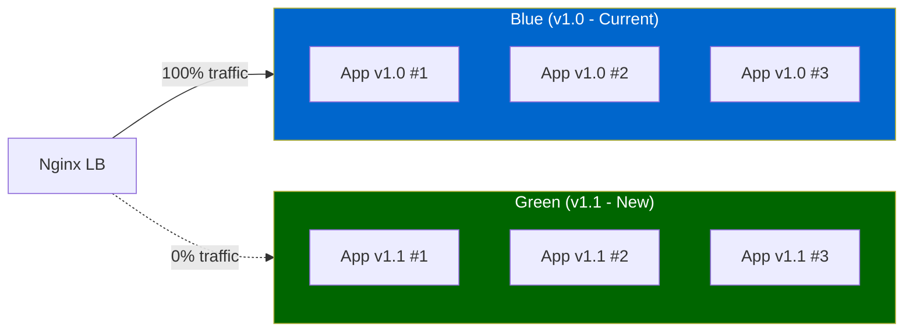

```nginx
# Phase 1: Deploy green, test với 5% traffic (Canary)
upstream shopx_backend {
    server blue1.internal weight=95;
    server blue2.internal weight=95;
    server green1.internal weight=5;  # 5% canary
}

# Phase 2: Monitor metrics, nếu OK → tăng dần
upstream shopx_backend {
    server blue1.internal weight=50;
    server green1.internal weight=50;
}

# Phase 3: Full cutover
upstream shopx_backend {
    server green1.internal;
    server green2.internal;
    server green3.internal;
    # Blue servers removed
}

# Rollback nếu cần:
upstream shopx_backend {
    server blue1.internal;  # Instant rollback: nginx -s reload
    server blue2.internal;
    server blue3.internal;
}
```

## 10. Troubleshooting Guide

### 10.1 Sơ Đồ Troubleshooting

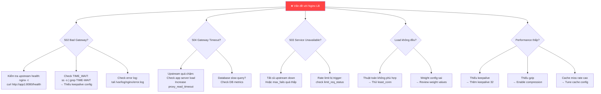

### 10.2 Các Lệnh Debug Quan Trọng

```bash
# Kiểm tra syntax
nginx -t

# Print full resolved config (bao gồm includes)
nginx -T

# Xem process và worker
ps aux | grep nginx

# Reload (zero-downtime, KHÔNG restart)
nginx -s reload

# Xem connection stats
ss -s
ss -tnp | grep nginx  # Active connections đến upstream

# Xem real-time request
tail -f /var/log/nginx/access.log

# Đếm 5xx errors trong 1 phút qua
awk '$9 >= 500' /var/log/nginx/access.log | wc -l

# Top upstream servers bị chậm nhất
awk '{print $NF, $7}' /var/log/nginx/access.log | sort -rn | head -20

# Upstream response time trung bình
awk '{sum+=$NF; count++} END {print sum/count}' /var/log/nginx/access.log

# Test từng upstream thủ công
curl -v http://app1.shopx.internal:8080/health
curl -v http://app2.shopx.internal:8080/health

# Kiểm tra certificate
openssl s_client -connect shopx.com:443 -servername shopx.com

# Benchmark load
ab -n 10000 -c 100 http://shopx.com/api/v1/products

# Xem cache status
grep "HIT\|MISS\|BYPASS" /var/log/nginx/access.log | awk '{print $NF}' | sort | uniq -c | sort -rn
```

### 10.3 Common Issues & Fix

| Symptom               | Root Cause                                                         | Fix                            |
| --------------------- | ------------------------------------------------------------------ | ------------------------------ |
| Hàng nghìn TIME_WAIT  | Thiếu `proxy_http_version 1.1` và `proxy_set_header Connection ""` | Thêm 2 directive này           |
| 502 dưới load         | Upstream capacity không đủ hoặc max_fails quá thấp                 | Scale up hoặc tăng `max_fails` |
| 504 thường xuyên      | `proxy_read_timeout` quá ngắn                                      | Tăng timeout phù hợp với SLA   |
| Load không đều        | Round robin với request thời gian không đều                        | Đổi sang `least_conn`          |
| Session mất           | Đổi server giữa request                                            | Dùng Redis session store       |
| SSL handshake chậm    | Thiếu `ssl_session_cache`                                          | Bật session cache              |
| Cache không hoạt động | Thiếu `proxy_cache` trong location                                 | Thêm `proxy_cache zone_name`   |
| Nginx báo full        | `worker_connections` quá thấp                                      | Tăng lên 4096 hoặc hơn         |

## 11. Tổng Kết & Checklist Production

### Kiến Trúc Tổng Quan đã Học

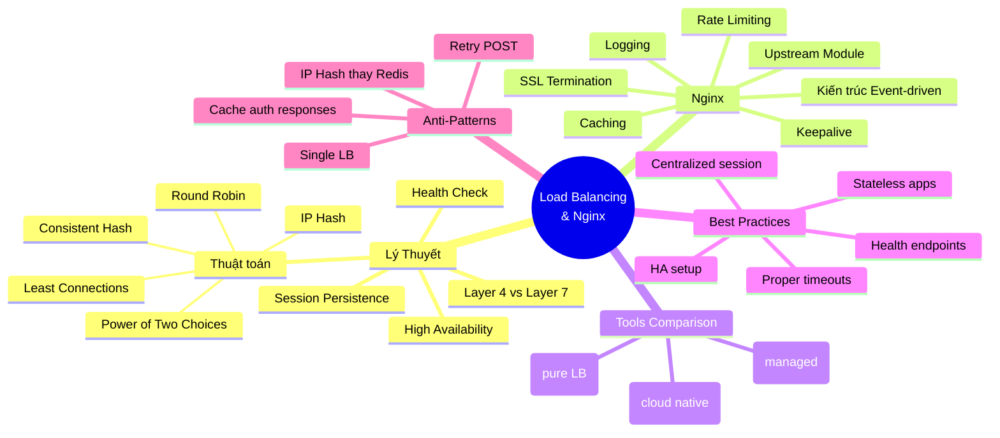

### ✅ Production Checklist

**Infrastructure:**

- [ ] Nginx HA setup với Keepalived + Virtual IP
- [ ] Backup servers được cấu hình
- [ ] Health check endpoint `/health` trả về JSON với DB/Redis status
- [ ] `worker_processes auto;` và `worker_rlimit_nofile 65535;`

**Load Balancing:**

- [ ] Chọn thuật toán phù hợp với workload
- [ ] `keepalive` được cấu hình trong upstream
- [ ] `proxy_http_version 1.1;` và `proxy_set_header Connection "";` được set
- [ ] `max_fails` và `fail_timeout` được cấu hình hợp lý
- [ ] Backup server cho critical services

**SSL/TLS:**

- [ ] TLS 1.2+ only
- [ ] HSTS header được set
- [ ] OCSP Stapling được bật
- [ ] `ssl_session_cache` được bật
- [ ] Certificate auto-renewal (Let's Encrypt + Certbot)

**Security:**

- [ ] `server_tokens off`
- [ ] Rate limiting cho mọi endpoint công khai
- [ ] Request body size limit
- [ ] Security headers (X-Frame-Options, CSP, ...)
- [ ] Block `.git`, `.env` paths

**Performance:**

- [ ] Gzip bật cho text content
- [ ] Caching cho static assets và public API
- [ ] `proxy_next_upstream` được cấu hình đúng (không retry POST)

**Observability:**

- [ ] Log format bao gồm `$upstream_response_time` và `$upstream_addr`
- [ ] Log rotation được setup
- [ ] Health check logs được tắt (`access_log off`)
- [ ] Monitoring alerts cho 5xx error rate, upstream response time

**Operations:**

- [ ] Deploy workflow dùng `nginx -t && systemctl reload nginx` (không restart)
- [ ] Canary/Blue-Green deployment process được document
- [ ] Runbook cho các sự cố phổ biến

## 12. Nginx với Docker & Docker Compose

Docker đã thay đổi cách chúng ta deploy Nginx: thay vì cài trực tiếp trên VM, Nginx được đóng gói thành container, dễ dàng scale và quản lý.

### 12.1 Nginx Container Cơ Bản

**Official Nginx Docker Image** có hai variant chính:

| Image                    | Base OS      | Size   | Dùng khi                               |
| ------------------------ | ------------ | ------ | -------------------------------------- |
| `nginx:1.27`             | Debian       | ~187MB | Default, đầy đủ tooling                |
| `nginx:1.27-alpine`      | Alpine Linux | ~43MB  | Production, nhỏ hơn, ít attack surface |
| `nginx:1.27-alpine-slim` | Alpine       | ~11MB  | Cực kỳ nhỏ, minimal                    |

**Chạy Nginx container đơn giản nhất:**

```bash
# Chạy với config mặc định
docker run -d -p 80:80 --name nginx-test nginx:1.27-alpine

# Mount config tùy chỉnh
docker run -d \
  -p 80:80 \
  -p 443:443 \
  -v $(pwd)/nginx.conf:/etc/nginx/nginx.conf:ro \
  -v $(pwd)/conf.d:/etc/nginx/conf.d:ro \
  -v $(pwd)/certs:/etc/ssl/certs:ro \
  --name shopx-nginx \
  nginx:1.27-alpine
```

**Cấu trúc thư mục config khi dùng Docker:**

```
shopx/
├── nginx/
│   ├── nginx.conf           # Main config
│   ├── conf.d/
│   │   ├── shopx-main.conf  # Site config
│   │   └── upstreams.conf   # Upstream definitions
│   └── ssl/
│       ├── shopx.crt
│       └── shopx.key
├── docker-compose.yml
└── app/
    └── ... (application code)
```

**Test config bên trong container:**

```bash
# Test syntax
docker exec shopx-nginx nginx -t

# Reload zero-downtime
docker exec shopx-nginx nginx -s reload

# Xem logs
docker logs -f shopx-nginx

# Xem log file
docker exec shopx-nginx tail -f /var/log/nginx/access.log
```

### 12.2 ShopX trên Docker Compose

Đây là setup đầy đủ cho môi trường development và staging của ShopX.

**Cấu trúc project:**

```
shopx/
├── docker-compose.yml
├── docker-compose.prod.yml      # Production overrides
├── nginx/
│   ├── Dockerfile
│   ├── nginx.conf
│   └── conf.d/
│       ├── shopx.conf
│       └── upstreams.conf
├── app/
│   ├── Dockerfile
│   └── src/
├── product-service/
│   ├── Dockerfile
│   └── src/
└── .env
```

**`docker-compose.yml` — Development:**

```yaml
version: "3.9"

services:
  # ─── Load Balancer ─────────────────────────────
  nginx:
    build:
      context: ./nginx
      dockerfile: Dockerfile
    image: shopx-nginx:latest
    container_name: shopx-nginx
    ports:
      - "80:80"
      - "443:443"
    volumes:
      - ./nginx/conf.d:/etc/nginx/conf.d:ro
      - ./nginx/ssl:/etc/ssl/nginx:ro
      - nginx_cache:/var/cache/nginx
      - nginx_logs:/var/log/nginx
    depends_on:
      - api-gateway
    networks:
      - shopx-frontend
      - shopx-backend
    restart: unless-stopped
    healthcheck:
      test: ["CMD", "nginx", "-t"]
      interval: 30s
      timeout: 10s
      retries: 3

  # ─── API Gateway (Internal Nginx) ──────────────
  api-gateway:
    image: nginx:1.27-alpine
    container_name: shopx-api-gateway
    volumes:
      - ./nginx/api-gateway.conf:/etc/nginx/nginx.conf:ro
    depends_on:
      product-service:
        condition: service_healthy
      cart-service:
        condition: service_healthy
      order-service:
        condition: service_healthy
    networks:
      - shopx-backend
    restart: unless-stopped

  # ─── Application Services ───────────────────────
  product-service:
    build:
      context: ./product-service
      target: production # Multi-stage build target
    image: shopx-product:latest
    deploy:
      replicas: 3 # 3 instances
      resources:
        limits:
          cpus: "0.5"
          memory: 512M
        reservations:
          cpus: "0.25"
          memory: 256M
    environment:
      - NODE_ENV=production
      - PORT=3000
      - DB_HOST=mysql
      - REDIS_HOST=redis
    networks:
      - shopx-backend
      - shopx-data
    healthcheck:
      test: ["CMD", "wget", "-qO-", "http://localhost:3000/health"]
      interval: 10s
      timeout: 5s
      retries: 3
      start_period: 30s
    restart: unless-stopped
    # Không expose port ra ngoài — chỉ qua Nginx

  cart-service:
    build:
      context: ./cart-service
      target: production
    image: shopx-cart:latest
    deploy:
      replicas: 2
    environment:
      - NODE_ENV=production
      - PORT=3001
      - REDIS_HOST=redis
    networks:
      - shopx-backend
      - shopx-data
    healthcheck:
      test: ["CMD", "wget", "-qO-", "http://localhost:3001/health"]
      interval: 10s
      timeout: 5s
      retries: 3
      start_period: 20s
    restart: unless-stopped

  order-service:
    build:
      context: ./order-service
      target: production
    image: shopx-order:latest
    deploy:
      replicas: 2
    environment:
      - NODE_ENV=production
      - PORT=3002
      - DB_HOST=mysql
      - REDIS_HOST=redis
      - PAYMENT_SERVICE_URL=http://payment-service:3003
    networks:
      - shopx-backend
      - shopx-data
    healthcheck:
      test: ["CMD", "wget", "-qO-", "http://localhost:3002/health"]
      interval: 10s
      timeout: 5s
      retries: 3
      start_period: 30s
    restart: unless-stopped

  payment-service:
    build:
      context: ./payment-service
      target: production
    image: shopx-payment:latest
    deploy:
      replicas: 2
    environment:
      - NODE_ENV=production
      - PORT=3003
      - DB_HOST=mysql
      - STRIPE_SECRET_KEY=${STRIPE_SECRET_KEY} # Từ .env, không hardcode
    networks:
      - shopx-backend
      - shopx-data
    healthcheck:
      test: ["CMD", "wget", "-qO-", "http://localhost:3003/health"]
      interval: 10s
      timeout: 5s
      retries: 3
    restart: unless-stopped

  # ─── Data Layer ─────────────────────────────────
  redis:
    image: redis:7-alpine
    container_name: shopx-redis
    command: redis-server --appendonly yes --maxmemory 512mb --maxmemory-policy allkeys-lru
    volumes:
      - redis_data:/data
    networks:
      - shopx-data
    healthcheck:
      test: ["CMD", "redis-cli", "ping"]
      interval: 10s
      timeout: 5s
      retries: 3
    restart: unless-stopped

  mysql:
    image: mysql:8.0
    container_name: shopx-mysql
    environment:
      - MYSQL_ROOT_PASSWORD=${DB_ROOT_PASSWORD}
      - MYSQL_DATABASE=shopx
      - MYSQL_USER=${DB_USER}
      - MYSQL_PASSWORD=${DB_PASSWORD}
    volumes:
      - mysql_data:/var/lib/mysql
      - ./mysql/init:/docker-entrypoint-initdb.d:ro
    networks:
      - shopx-data
    healthcheck:
      test: ["CMD", "mysqladmin", "ping", "-h", "localhost"]
      interval: 10s
      timeout: 5s
      retries: 5
    restart: unless-stopped

networks:
  shopx-frontend:
    driver: bridge
  shopx-backend:
    driver: bridge
    internal: true # Không có internet access
  shopx-data:
    driver: bridge
    internal: true # Isolated data layer

volumes:
  nginx_cache:
  nginx_logs:
  redis_data:
  mysql_data:
```

**Nginx config cho Docker Compose — tận dụng DNS của Docker:**

```nginx
# nginx/conf.d/upstreams.conf
# Docker Compose tự tạo DNS record từ service name
# "product-service" → resolve đến tất cả container replicas

upstream product_service {
    # Docker's internal DNS tự load balance giữa các replicas
    # Khi dùng deploy.replicas: 3, Docker tạo 3 containers
    # với tên: shopx_product-service_1, shopx_product-service_2, ...
    least_conn;
    server product-service:3000 max_fails=3 fail_timeout=20s;
    keepalive 16;
}

upstream cart_service {
    least_conn;
    server cart-service:3001 max_fails=3 fail_timeout=20s;
    keepalive 8;
}

upstream order_service {
    least_conn;
    server order-service:3002 max_fails=2 fail_timeout=30s;
    keepalive 8;
}

upstream payment_service {
    server payment-service:3003 max_fails=1 fail_timeout=60s;
    keepalive 4;
}
```

> **Quan trọng về Docker DNS:** Khi `product-service` có `replicas: 3`, Docker DNS trả về IP của một trong 3 container theo round-robin. Nginx sẽ resolve DNS này và forward request. Tuy nhiên, Nginx cache DNS result theo mặc định — điều này có thể gây vấn đề khi scale. Xem phần tiếp theo.

### 12.3 Scale với Docker Compose Replicas

**Vấn đề với DNS caching trong Nginx + Docker:**

```mermaid
sequenceDiagram
    participant Nginx
    participant DockerDNS as Docker DNS
    participant P1 as product-svc replica 1
    participant P2 as product-svc replica 2
    participant P3 as product-svc replica 3 (NEW)

    Nginx->>DockerDNS: Resolve "product-service" → 172.18.0.5
    DockerDNS->>Nginx: IP: 172.18.0.5 (replica 1)
    Note over Nginx: Cache DNS result!

    Note over P3: Scale up: docker compose up --scale product-service=3
    DockerDNS-->>P3: New container gets 172.18.0.7

    Nginx->>DockerDNS: (Still using cached 172.18.0.5)
    Note over P3: replica 3 KHÔNG nhận được traffic!
```

**Giải pháp 1: Dùng `resolver` directive (Best Practice):**

```nginx
# nginx/conf.d/upstreams.conf
# Yêu cầu Nginx resolve lại DNS định kỳ

resolver 127.0.0.11 valid=5s ipv6=off;  # 127.0.0.11 là Docker's internal DNS server

upstream product_service {
    least_conn;
    # Dùng variable để force re-resolve
    server product-service:3000 resolve;   # Nginx Plus
    keepalive 16;
}

# Hoặc với Open Source Nginx dùng variable:
server {
    set $product_upstream "product-service:3000";

    location /api/v1/products {
        proxy_pass http://$product_upstream;  # Variable → re-resolve mỗi request
    }
}
```

**Giải pháp 2: Scale và reload Nginx:**

```bash
# Scale service lên 5 replicas
docker compose up --scale product-service=5 -d

# Reload Nginx để pick up new containers
docker exec shopx-nginx nginx -s reload
```

**Giải pháp 3: Dùng Docker Swarm mode (built-in LB):**

```yaml
# docker-compose.yml với Swarm mode
version: "3.9"
services:
  product-service:
    image: shopx-product:latest
    deploy:
      replicas: 5
      update_config:
        parallelism: 2 # Update 2 container tại 1 lúc
        delay: 10s # Chờ 10s giữa mỗi batch
        failure_action: rollback
        order: start-first # Start new trước khi stop old
      rollback_config:
        parallelism: 1
        delay: 5s
      restart_policy:
        condition: on-failure
        max_attempts: 3
      resources:
        limits:
          cpus: "0.5"
          memory: 512M
```

**Commands với Docker Swarm:**

```bash
# Init swarm (single node)
docker swarm init

# Deploy stack
docker stack deploy -c docker-compose.yml shopx

# Scale service
docker service scale shopx_product-service=5

# Rolling update (zero-downtime)
docker service update \
  --image shopx-product:v2.0 \
  --update-parallelism 2 \
  --update-delay 10s \
  shopx_product-service

# Xem service status
docker service ps shopx_product-service
```

### 12.4 Multi-stage Dockerfile cho Nginx

**`nginx/Dockerfile` — Production-ready:**

```dockerfile
# Stage 1: Build custom Nginx với modules cần thiết
FROM nginx:1.27-alpine AS base

# Cài thêm các tools cần thiết
RUN apk add --no-cache \
    curl \
    openssl \
    tzdata

# Set timezone
ENV TZ=Asia/Ho_Chi_Minh

# Stage 2: Production image
FROM base AS production

# Copy config
COPY nginx.conf /etc/nginx/nginx.conf
COPY conf.d/ /etc/nginx/conf.d/

# Tạo thư mục cần thiết
RUN mkdir -p /var/cache/nginx/shopx \
             /var/log/nginx \
    && chown -R nginx:nginx /var/cache/nginx \
    && chmod -R 755 /var/cache/nginx

# Test config validity
RUN nginx -t

# Expose ports
EXPOSE 80 443

# Health check
HEALTHCHECK --interval=30s --timeout=10s --start-period=5s --retries=3 \
    CMD curl -f http://localhost/health || exit 1

# Run as non-root (nginx user)
USER nginx

CMD ["nginx", "-g", "daemon off;"]
```

**`app/Dockerfile` — Node.js app với multi-stage:**

```dockerfile
# Stage 1: Dependencies
FROM node:20-alpine AS deps
WORKDIR /app
COPY package*.json ./
RUN npm ci --only=production && npm cache clean --force

# Stage 2: Build (nếu có TypeScript/build step)
FROM node:20-alpine AS builder
WORKDIR /app
COPY package*.json ./
RUN npm ci
COPY . .
RUN npm run build

# Stage 3: Production
FROM node:20-alpine AS production
WORKDIR /app

# Không chạy với root
RUN addgroup -g 1001 -S nodejs \
    && adduser -S nodejs -u 1001

# Copy từ stages trước
COPY --from=deps /app/node_modules ./node_modules
COPY --from=builder /app/dist ./dist
COPY package*.json ./

USER nodejs
EXPOSE 3000

HEALTHCHECK --interval=10s --timeout=5s --start-period=30s --retries=3 \
    CMD wget -qO- http://localhost:3000/health || exit 1

CMD ["node", "dist/server.js"]
```

**Buid và deploy:**

```bash
# Build tất cả images
docker compose build

# Build với cache busting
docker compose build --no-cache

# Tag và push lên registry
docker tag shopx-nginx:latest registry.shopx.io/shopx-nginx:v1.2.0
docker push registry.shopx.io/shopx-nginx:v1.2.0

# Deploy production với file override
docker compose -f docker-compose.yml -f docker-compose.prod.yml up -d
```

**`docker-compose.prod.yml` — Production overrides:**

```yaml
version: "3.9"
services:
  nginx:
    image: registry.shopx.io/shopx-nginx:${NGINX_VERSION:-latest}
    logging:
      driver: "json-file"
      options:
        max-size: "100m"
        max-file: "5"

  product-service:
    image: registry.shopx.io/shopx-product:${APP_VERSION:-latest}
    deploy:
      replicas: 5 # Production: nhiều replicas hơn

  mysql:
    # Production: dùng external DB (RDS), không dùng local container
    image: "null" # Override để không start MySQL container
```

## 13. Nginx trên Kubernetes

Kubernetes (K8s) là nơi Nginx đóng vai trò khác — không phải là một container đơn lẻ mà là một **Ingress Controller** điều phối traffic cho toàn bộ cluster.

### 13.1 Ingress Controller vs Gateway API

**Kubernetes networking có 3 lớp:**

```mermaid
graph TB
    subgraph External["External Traffic"]
        User["Users / Internet"]
    end

    subgraph K8s["Kubernetes Cluster"]
        subgraph Ingress_Layer["Layer 1: Ingress / Gateway (North-South traffic)"]
            IC["Nginx Ingress Controller\n(hoặc NGINX Gateway Fabric)"]
        end

        subgraph Service_Layer["Layer 2: Service (East-West traffic)"]
            SvcA["Service A\n(ClusterIP)"]
            SvcB["Service B\n(ClusterIP)"]
            SvcC["Service C\n(ClusterIP)"]
        end

        subgraph Pod_Layer["Layer 3: Pods"]
            P1["Pod A-1"]
            P2["Pod A-2"]
            P3["Pod B-1"]
            P4["Pod C-1"]
            P5["Pod C-2"]
        end
    end

    User --> IC
    IC --> SvcA & SvcB & SvcC
    SvcA --> P1 & P2
    SvcB --> P3
    SvcC --> P4 & P5

    style IC fill:#0066cc,color:#fff
    style User fill:#333,color:#fff
```

**Ingress API vs Gateway API — Lịch sử và tương lai:**

|                     | **Ingress API** (cũ)     | **Gateway API** (mới)                                  |
| ------------------- | ------------------------ | ------------------------------------------------------ |
| Status              | ⚠️ Deprecated (Nov 2025) | ✅ GA, đang phát triển mạnh                            |
| API Group           | `networking.k8s.io/v1`   | `gateway.networking.k8s.io/v1`                         |
| Resources           | `Ingress`                | `GatewayClass`, `Gateway`, `HTTPRoute`, `GRPCRoute`... |
| Role separation     | Không có                 | ✅ Infrastructure / Operator / Developer               |
| Multi-protocol      | HTTP/HTTPS only          | HTTP, TCP, UDP, gRPC, TLS                              |
| Traffic split       | Annotation hacks         | ✅ Native `backendRefs` với weight                     |
| Header manipulation | Annotation hacks         | ✅ Native `RequestHeaderModifier`                      |
| Extensibility       | Thấp                     | Cao (Policy attachment)                                |
| Controller          | ingress-nginx (RETIRED)  | NGINX Gateway Fabric, Envoy, Istio...                  |

> **Quan trọng (Nov 2025):** Kubernetes SIG Network đã chính thức **retire ingress-nginx**. Nếu bạn đang dùng ingress-nginx, cần lên kế hoạch migrate sang **NGINX Gateway Fabric** hoặc các controller Gateway API khác trước March 2026.

### 13.2 Cài Đặt NGINX Ingress Controller

> Phần này vẫn relevant cho các hệ thống đang chạy ingress-nginx và chưa migrate.

**Cài qua Helm (cách phổ biến nhất):**

```bash
# Thêm Helm repo
helm repo add ingress-nginx https://kubernetes.github.io/ingress-nginx
helm repo update

# Cài vào namespace riêng
helm install ingress-nginx ingress-nginx/ingress-nginx \
  --namespace ingress-nginx \
  --create-namespace \
  --set controller.replicaCount=2 \
  --set controller.resources.requests.cpu=100m \
  --set controller.resources.requests.memory=90Mi \
  --set controller.resources.limits.cpu=500m \
  --set controller.resources.limits.memory=256Mi \
  --set controller.autoscaling.enabled=true \
  --set controller.autoscaling.minReplicas=2 \
  --set controller.autoscaling.maxReplicas=10 \
  --set controller.metrics.enabled=true \
  --set controller.podAntiAffinity.enabled=true  # Spread across nodes

# Kiểm tra cài đặt
kubectl get pods -n ingress-nginx
kubectl get svc -n ingress-nginx

# Lấy external IP (Cloud LoadBalancer)
kubectl get svc ingress-nginx-controller -n ingress-nginx
```

**`values-production.yaml` — Production Helm values:**

```yaml
controller:
  # HA: ít nhất 2 replicas
  replicaCount: 3

  # Anti-affinity: spread across nodes
  affinity:
    podAntiAffinity:
      requiredDuringSchedulingIgnoredDuringExecution:
        - labelSelector:
            matchExpressions:
              - key: app.kubernetes.io/name
                operator: In
                values:
                  - ingress-nginx
          topologyKey: kubernetes.io/hostname

  # Resource limits
  resources:
    requests:
      cpu: 200m
      memory: 256Mi
    limits:
      cpu: 1000m
      memory: 512Mi

  # Autoscaling
  autoscaling:
    enabled: true
    minReplicas: 3
    maxReplicas: 20
    targetCPUUtilizationPercentage: 70
    targetMemoryUtilizationPercentage: 80

  # Config Nginx
  config:
    worker-processes: "auto"
    worker-connections: "4096"
    keepalive-requests: "100"
    upstream-keepalive-connections: "32"
    proxy-connect-timeout: "5"
    proxy-read-timeout: "60"
    proxy-send-timeout: "60"
    use-gzip: "true"
    gzip-level: "6"
    gzip-types: "application/json application/javascript text/css text/plain"
    log-format-upstream: >
      {"time":"$time_iso8601","remote_addr":"$remote_addr",
      "method":"$request_method","uri":"$request_uri",
      "status":$status,"bytes_sent":$body_bytes_sent,
      "request_time":$request_time,
      "upstream_response_time":"$upstream_response_time",
      "upstream_addr":"$upstream_addr",
      "ingress":"$ingress_name","service":"$service_name"}

  # Metrics cho Prometheus
  metrics:
    enabled: true
    serviceMonitor:
      enabled: true
      namespace: monitoring

  # Pod disruption budget
  podDisruptionBudget:
    enabled: true
    minAvailable: 2
```

```bash
# Deploy với values file
helm install ingress-nginx ingress-nginx/ingress-nginx \
  --namespace ingress-nginx \
  --create-namespace \
  -f values-production.yaml
```

### 13.3 Ingress Resource & Routing

**ShopX Kubernetes Ingress — định nghĩa routing:**

```yaml
# shopx-ingress.yaml
apiVersion: networking.k8s.io/v1
kind: Ingress
metadata:
  name: shopx-ingress
  namespace: shopx-production
  annotations:
    # Chỉ định controller
    kubernetes.io/ingress.class: "nginx"

    # SSL redirect
    nginx.ingress.kubernetes.io/ssl-redirect: "true"
    nginx.ingress.kubernetes.io/force-ssl-redirect: "true"

    # Rate limiting
    nginx.ingress.kubernetes.io/limit-rps: "100"
    nginx.ingress.kubernetes.io/limit-connections: "50"

    # Proxy settings
    nginx.ingress.kubernetes.io/proxy-connect-timeout: "5"
    nginx.ingress.kubernetes.io/proxy-read-timeout: "30"
    nginx.ingress.kubernetes.io/proxy-send-timeout: "30"

    # Upload size limit
    nginx.ingress.kubernetes.io/proxy-body-size: "10m"

    # Keepalive
    nginx.ingress.kubernetes.io/upstream-keepalive-connections: "32"

    # CORS (nếu cần)
    nginx.ingress.kubernetes.io/enable-cors: "true"
    nginx.ingress.kubernetes.io/cors-allow-origin: "https://shopx.com"

    # TLS cert từ cert-manager
    cert-manager.io/cluster-issuer: "letsencrypt-prod"

spec:
  ingressClassName: nginx
  tls:
    - hosts:
        - shopx.com
        - api.shopx.com
      secretName: shopx-tls-cert

  rules:
    # Main site
    - host: shopx.com
      http:
        paths:
          - path: /api/v1/products
            pathType: Prefix
            backend:
              service:
                name: product-service
                port:
                  number: 3000
          - path: /api/v1/cart
            pathType: Prefix
            backend:
              service:
                name: cart-service
                port:
                  number: 3001
          - path: /api/v1/orders
            pathType: Prefix
            backend:
              service:
                name: order-service
                port:
                  number: 3002
          - path: /api/v1/payments
            pathType: Prefix
            backend:
              service:
                name: payment-service
                port:
                  number: 3003
          - path: /
            pathType: Prefix
            backend:
              service:
                name: frontend-service
                port:
                  number: 80
```

**Ingress riêng cho Checkout — rate limit khác:**

```yaml
# shopx-checkout-ingress.yaml
apiVersion: networking.k8s.io/v1
kind: Ingress
metadata:
  name: shopx-checkout-ingress
  namespace: shopx-production
  annotations:
    kubernetes.io/ingress.class: "nginx"
    nginx.ingress.kubernetes.io/ssl-redirect: "true"
    # Rate limit nghiêm hơn cho checkout
    nginx.ingress.kubernetes.io/limit-rps: "5"
    nginx.ingress.kubernetes.io/limit-connections: "10"
    nginx.ingress.kubernetes.io/proxy-read-timeout: "60"
    # Không cache checkout
    nginx.ingress.kubernetes.io/proxy-buffering: "off"
spec:
  ingressClassName: nginx
  rules:
    - host: shopx.com
      http:
        paths:
          - path: /api/v1/checkout
            pathType: Exact
            backend:
              service:
                name: checkout-service
                port:
                  number: 3004
```

### 13.4 Canary Deployment với Nginx Ingress

Nginx Ingress hỗ trợ canary deployment thông qua annotations — đây là một trong những tính năng mạnh nhất.

**Scenario ShopX:** Deploy v2.0 của Product Service, bắt đầu với 10% traffic.

```mermaid
graph LR
    User["Users"] --> IC["Nginx\nIngress Controller"]
    IC -->|90% traffic| SvcV1["product-service-v1\n(stable)"]
    IC -->|10% traffic| SvcV2["product-service-v2\n(canary)"]

    SvcV1 --> PodV1_1["Pod v1.0 #1"]
    SvcV1 --> PodV1_2["Pod v1.0 #2"]
    SvcV1 --> PodV1_3["Pod v1.0 #3"]

    SvcV2 --> PodV2_1["Pod v2.0 #1"]

    style IC fill:#0066cc,color:#fff
    style SvcV2 fill:#ff8800,color:#fff
    style PodV2_1 fill:#ff8800,color:#fff
```

**Bước 1: Deploy stable version (đang chạy):**

```yaml
# product-service-v1.yaml
apiVersion: apps/v1
kind: Deployment
metadata:
  name: product-service-v1
  namespace: shopx-production
spec:
  replicas: 3
  selector:
    matchLabels:
      app: product-service
      version: v1
  template:
    metadata:
      labels:
        app: product-service
        version: v1
    spec:
      containers:
        - name: product-service
          image: registry.shopx.io/product-service:1.0.0
          ports:
            - containerPort: 3000
          resources:
            requests:
              cpu: 200m
              memory: 256Mi
            limits:
              cpu: 500m
              memory: 512Mi
apiVersion: v1
kind: Service
metadata:
  name: product-service-v1
  namespace: shopx-production
spec:
  selector:
    app: product-service
    version: v1
  ports:
    - port: 3000
      targetPort: 3000
```

**Bước 2: Main Ingress (stable):**

```yaml
# main-ingress.yaml
apiVersion: networking.k8s.io/v1
kind: Ingress
metadata:
  name: product-service-main
  namespace: shopx-production
  annotations:
    kubernetes.io/ingress.class: "nginx"
spec:
  ingressClassName: nginx
  rules:
    - host: shopx.com
      http:
        paths:
          - path: /api/v1/products
            pathType: Prefix
            backend:
              service:
                name: product-service-v1
                port:
                  number: 3000
```

**Bước 3: Deploy canary (v2.0):**

```yaml
# product-service-v2.yaml
apiVersion: apps/v1
kind: Deployment
metadata:
  name: product-service-v2
  namespace: shopx-production
spec:
  replicas: 1              # Ít replicas hơn
  selector:
    matchLabels:
      app: product-service
      version: v2
  template:
    metadata:
      labels:
        app: product-service
        version: v2
    spec:
      containers:
        - name: product-service
          image: registry.shopx.io/product-service:2.0.0
apiVersion: v1
kind: Service
metadata:
  name: product-service-v2
  namespace: shopx-production
spec:
  selector:
    app: product-service
    version: v2
  ports:
    - port: 3000
      targetPort: 3000
```

**Bước 4: Canary Ingress (10% traffic):**

```yaml
# canary-ingress.yaml
apiVersion: networking.k8s.io/v1
kind: Ingress
metadata:
  name: product-service-canary
  namespace: shopx-production
  annotations:
    kubernetes.io/ingress.class: "nginx"
    # QUAN TRỌNG: đánh dấu đây là canary ingress
    nginx.ingress.kubernetes.io/canary: "true"
    # 10% traffic → canary
    nginx.ingress.kubernetes.io/canary-weight: "10"
    # Hoặc route theo header (QA team test canary)
    nginx.ingress.kubernetes.io/canary-by-header: "X-Canary-Version"
    nginx.ingress.kubernetes.io/canary-by-header-value: "v2"
spec:
  ingressClassName: nginx
  rules:
    - host: shopx.com
      http:
        paths:
          - path: /api/v1/products
            pathType: Prefix
            backend:
              service:
                name: product-service-v2
                port:
                  number: 3000
```

**Bước 5: Tăng dần traffic (Progressive Delivery):**

```bash
# Kiểm tra metrics v2 sau 30 phút
# Nếu OK → tăng lên 30%
kubectl annotate ingress product-service-canary \
  nginx.ingress.kubernetes.io/canary-weight="30" \
  --overwrite -n shopx-production

# Sau 1 giờ, tăng 50%
kubectl annotate ingress product-service-canary \
  nginx.ingress.kubernetes.io/canary-weight="50" \
  --overwrite -n shopx-production

# Full cutover
# 1. Update main ingress → point to v2
kubectl patch ingress product-service-main \
  --type json \
  -p '[{"op":"replace","path":"/spec/rules/0/http/paths/0/backend/service/name","value":"product-service-v2"}]' \
  -n shopx-production

# 2. Xóa canary ingress
kubectl delete ingress product-service-canary -n shopx-production

# 3. Scale down v1
kubectl scale deployment product-service-v1 --replicas=0 -n shopx-production
```

**Rollback tức thì khi phát hiện vấn đề:**

```bash
# Xóa canary ingress (instant rollback → 100% về v1)
kubectl delete ingress product-service-canary -n shopx-production

# Hoặc set weight về 0
kubectl annotate ingress product-service-canary \
  nginx.ingress.kubernetes.io/canary-weight="0" \
  --overwrite -n shopx-production
```

### 13.5 NGINX Gateway Fabric (Thế hệ mới)

**NGINX Gateway Fabric** là implementation của Kubernetes Gateway API bởi F5/NGINX, thay thế cho ingress-nginx.

**Cài đặt:**

```bash
# Cài Gateway API CRDs
kubectl apply -f https://github.com/kubernetes-sigs/gateway-api/releases/download/v1.2.0/standard-install.yaml

# Cài NGINX Gateway Fabric
helm install ngf oci://ghcr.io/nginxinc/charts/nginx-gateway-fabric \
  --namespace nginx-gateway \
  --create-namespace \
  --set service.type=LoadBalancer
```

**Định nghĩa GatewayClass và Gateway:**

```yaml
# gateway.yaml
apiVersion: gateway.networking.k8s.io/v1
kind: GatewayClass
metadata:
  name: nginx
spec:
  controllerName: gateway.nginx.org/nginx-gateway-controller
apiVersion: gateway.networking.k8s.io/v1
kind: Gateway
metadata:
  name: shopx-gateway
  namespace: nginx-gateway
spec:
  gatewayClassName: nginx
  listeners:
    - name: http
      port: 80
      protocol: HTTP
      allowedRoutes:
        namespaces:
          from: Selector
          selector:
            matchLabels:
              gateway-access: "true"
    - name: https
      port: 443
      protocol: HTTPS
      tls:
        mode: Terminate
        certificateRefs:
          - kind: Secret
            name: shopx-tls-cert
            namespace: shopx-production
      allowedRoutes:
        namespaces:
          from: Selector
          selector:
            matchLabels:
              gateway-access: "true"
```

**HTTPRoute — thay thế Ingress:**

```yaml
# shopx-httproute.yaml
apiVersion: gateway.networking.k8s.io/v1
kind: HTTPRoute
metadata:
  name: shopx-routes
  namespace: shopx-production
spec:
  parentRefs:
    - name: shopx-gateway
      namespace: nginx-gateway
  hostnames:
    - "shopx.com"
  rules:
    # Products API
    - matches:
        - path:
            type: PathPrefix
            value: /api/v1/products
      backendRefs:
        - name: product-service
          port: 3000
          weight: 100

    # Cart API với timeout
    - matches:
        - path:
            type: PathPrefix
            value: /api/v1/cart
      filters:
        - type: RequestHeaderModifier
          requestHeaderModifier:
            add:
              - name: X-Request-ID
                value: "${request_id}"
      backendRefs:
        - name: cart-service
          port: 3001

    # Canary deployment (native, không cần annotation hack)
    - matches:
        - path:
            type: PathPrefix
            value: /api/v1/products
      backendRefs:
        - name: product-service-v1
          port: 3000
          weight: 90 # 90%
        - name: product-service-v2
          port: 3000
          weight: 10 # 10% canary — NATIVE, không cần annotation!
```

### 13.6 ShopX trên Kubernetes

**Kiến trúc đầy đủ ShopX trên K8s:**

```mermaid
graph TB
    Internet --> LB_Cloud["Cloud Load Balancer\n(AWS NLB / GCP LB)"]
    LB_Cloud --> IC["NGINX Gateway Fabric\n(2+ replicas, HA)"]

    subgraph K8s["Kubernetes Cluster"]
        IC --> HTTPRoute["HTTPRoute Resources\n(path-based routing)"]

        HTTPRoute --> ProductSvc["product-service\nService (ClusterIP)"]
        HTTPRoute --> CartSvc["cart-service\nService (ClusterIP)"]
        HTTPRoute --> OrderSvc["order-service\nService (ClusterIP)"]

        ProductSvc --> ProductPods["product-service Pods\n(HPA: 3-10 replicas)"]
        CartSvc --> CartPods["cart-service Pods\n(HPA: 2-5 replicas)"]
        OrderSvc --> OrderPods["order-service Pods\n(HPA: 2-4 replicas)"]

        ProductPods & CartPods & OrderPods --> RedisCluster[("Redis Cluster\nStatefulSet)")]
        OrderPods --> MySQL[("MySQL\n(External: RDS)")]
    end

    style IC fill:#0066cc,color:#fff
    style HTTPRoute fill:#006600,color:#fff
    style LB_Cloud fill:#ff8800,color:#fff
```

**HorizontalPodAutoscaler cho Product Service:**

```yaml
# hpa-product-service.yaml
apiVersion: autoscaling/v2
kind: HorizontalPodAutoscaler
metadata:
  name: product-service-hpa
  namespace: shopx-production
spec:
  scaleTargetRef:
    apiVersion: apps/v1
    kind: Deployment
    name: product-service
  minReplicas: 3
  maxReplicas: 20
  metrics:
    - type: Resource
      resource:
        name: cpu
        target:
          type: Utilization
          averageUtilization: 70
    - type: Resource
      resource:
        name: memory
        target:
          type: Utilization
          averageUtilization: 80
  behavior:
    scaleUp:
      stabilizationWindowSeconds: 60 # Chờ 60s trước khi scale up thêm
      policies:
        - type: Pods
          value: 4 # Scale up tối đa 4 pods mỗi 60s
          periodSeconds: 60
    scaleDown:
      stabilizationWindowSeconds: 300 # Chờ 5 phút trước khi scale down
      policies:
        - type: Pods
          value: 1 # Scale down từ từ (1 pod mỗi 60s)
          periodSeconds: 60
```

## 14. Case Study Chuyên Sâu & Anti-Patterns Nâng Cao

### 14.1 Thundering Herd Problem

**Thundering Herd** là một trong những vấn đề nguy hiểm nhất trong hệ thống có load balancer, thường xảy ra sau sự cố.

**Scenario điển hình:**

```mermaid
sequenceDiagram
    participant C as 10,000 Clients
    participant LB as Nginx LB
    participant App as App Servers
    participant DB as Database

    Note over App: App servers restart sau deploy
    Note over C: Tất cả clients retry đồng thời
    C->>LB: 10,000 requests/second (spike!)
    LB->>App: Forward tất cả
    App->>DB: 10,000 DB queries (cache cold!)
    DB-->>App: ❌ DB quá tải, timeout
    App-->>LB: ❌ 503 errors
    LB-->>C: ❌ Errors
    Note over C: Clients RETRY NGAY LẬP TỨC
    C->>LB: 20,000 requests/second (worse!)
    Note over App,DB: Cascading failure!
```

**Nguyên nhân gây Thundering Herd:**

1. **Cache expiry đồng thời:** Nhiều cache key hết hạn cùng lúc → mọi request vào DB
2. **Server restart:** App servers restart → connection pool re-establish → spike
3. **Client retry không có jitter:** Tất cả client retry sau 5s → synchronized spike
4. **Flash sale:** Hàng triệu user hit "buy" cùng 1 giây

**Giải pháp phía Nginx:**

**Giải pháp 1: `proxy_cache_lock` — Ngăn cache stampede:**

```nginx
location /api/v1/products {
    proxy_cache shopx_cache;
    proxy_cache_valid 200 5m;

    # CHỈ CHO PHÉP 1 REQUEST đi vào backend để refresh cache
    # Các request khác chờ (hoặc dùng stale response)
    proxy_cache_lock on;
    proxy_cache_lock_timeout 5s;          # Nếu chờ quá 5s → bypass lock
    proxy_cache_lock_age 10s;             # Nếu request đang lock > 10s → unlock

    # Dùng cache cũ khi đang refresh
    proxy_cache_use_stale updating error timeout;
    proxy_cache_background_update on;     # Refresh in background, không block user

    proxy_pass http://shopx_backend;
}
```

**Giải pháp 2: `limit_req` với burst — Chặn spike:**

```nginx
# Global rate limit
limit_req_zone $binary_remote_addr zone=api:20m rate=100r/s;
limit_req_zone $server_name zone=global:10m rate=10000r/s;  # Global cap

location /api/ {
    # Per-IP limit với burst nhỏ
    limit_req zone=api burst=20 nodelay;
    # Global limit để bảo vệ backend
    limit_req zone=global burst=500 delay=200;

    proxy_pass http://shopx_backend;
}
```

**Giải pháp 3: Queue ở application layer:**

```mermaid
graph LR
    Nginx["Nginx\n(Rate limit)"] --> Queue["Message Queue\n(Redis/SQS)"]
    Queue --> Worker1["Worker 1"]
    Queue --> Worker2["Worker 2"]
    Queue --> Worker3["Worker 3"]
    Worker1 & Worker2 & Worker3 --> DB[("Database")]

    style Queue fill:#ff4444,color:#fff
```

**Giải pháp 4: Jitter ở client (bài học từ Pokémon GO):**

```javascript
// ❌ SAI: Retry ngay lập tức hoặc fixed interval
async function fetchWithRetry(url) {
  for (let i = 0; i < 3; i++) {
    try {
      return await fetch(url);
    } catch (e) {
      await sleep(5000); // Fixed 5s → synchronized spike!
    }
  }
}

// ✅ ĐÚNG: Exponential backoff với jitter (Full Jitter)
async function fetchWithRetry(url, maxRetries = 3) {
  for (let attempt = 0; attempt < maxRetries; attempt++) {
    try {
      return await fetch(url);
    } catch (e) {
      if (attempt === maxRetries - 1) throw e;

      const baseDelay = Math.min(1000 * Math.pow(2, attempt), 30000);
      // Full jitter: random delay trong [0, baseDelay]
      const jitter = Math.random() * baseDelay;
      await sleep(jitter);
    }
  }
}
// attempt 0: 0-1s
// attempt 1: 0-2s
// attempt 2: 0-4s
// → Không synchronized!
```

### 14.2 Cascading Failure & Circuit Breaker

**Cascading Failure:** Một service chậm khiến các service upstream cũng chậm/fail theo chuỗi.

```mermaid
graph LR
    LB["Nginx LB"] --> OrderSvc["Order Service\n(100 connections)"]
    OrderSvc --> PaymentSvc["Payment Service\n(SLOW - 30s response)"]

    Note1["Tất cả 100 connections\ncủa Order Service\nđang chờ Payment!"] -.-> OrderSvc
    Note2["Order Service không còn\ncapacity nhận request mới"] -.-> LB
    Note3["LB trả 502 cho users"] -.-> LB

    style PaymentSvc fill:#ff4444,color:#fff
    style OrderSvc fill:#ff8800,color:#fff
```

**Circuit Breaker pattern với Nginx:**

Nginx không có native circuit breaker, nhưng `proxy_next_upstream` + `max_fails` là passive version:

```nginx
upstream payment_service {
    server payment-svc-1.internal:3003 max_fails=2 fail_timeout=30s;
    server payment-svc-2.internal:3003 max_fails=2 fail_timeout=30s;

    # Sau 2 lần fail → circuit open cho 30s
    # Sau 30s → circuit half-open (thử 1 request)
}

location /api/v1/payments {
    proxy_pass http://payment_service;

    # Timeout ngắn để fail fast (không để request treo lâu)
    proxy_connect_timeout 3s;
    proxy_read_timeout 10s;   # Payment phải respond trong 10s

    # Không retry payment (tránh double charge)
    proxy_next_upstream off;

    # Custom error page khi circuit open
    error_page 502 503 = @payment_fallback;
}

location @payment_fallback {
    # Trả về 503 với message thân thiện, không crash hệ thống
    return 503 '{"error":"Payment service temporarily unavailable. Please try again.","retry_after":30}';
    add_header Content-Type application/json;
    add_header Retry-After 30;
}
```

**Full circuit breaker:** Cần dùng ở application layer (Hystrix, Resilience4j, hoặc service mesh như Istio).

### 14.3 Pokémon GO Launch Incident (Google SRE)

Đây là một trong những case study nổi tiếng nhất về Thundering Herd và load balancing, được ghi nhận trong **Google SRE Workbook**.

**Bối cảnh:** Khi Pokémon GO launch, traffic vượt xa mọi dự đoán. Niantic dùng Nginx backends cho SSL termination + Google Cloud Load Balancer.

**Chuỗi sự kiện:**

1. Traffic cao → một số backend Nginx bắt đầu slow
2. Khi backend slow, Google Cloud LB coi chúng là unhealthy và restarts
3. Nginx backends restart → trả về error responses nhanh (không phải slow)
4. Client app thấy errors nhanh → **synchronized retry ngay lập tức**
5. Synchronized retries → **spike 20x global RPS peak**
6. Spike gây overload → nhiều backends fail hơn
7. Vòng lặp cascading failure

**Root causes:**

- Client retry không có jitter → synchronized spike
- Nginx backends buffer HTTP requests → resource exhaustion khi client slow
- SSL termination tại Nginx → double round-trip overhead

**Bài học và fix:**

```
Client-side:
  ✅ Thêm jitter vào retry (Full Jitter algorithm)
  ✅ Truncated exponential backoff

Server-side (Nginx):
  ✅ Đưa SSL termination lên Google Frontend (GFE)
       → Loại bỏ double round-trip
       → Không cần buffer HTTP requests tại Nginx nữa
  ✅ Tách Nginx buffering khỏi SSL termination layer

Infrastructure:
  ✅ Load test với traffic vượt 2x dự kiến
  ✅ Measure load as close to client as possible
  ✅ Qualify GFE backends trước launch lớn
```

**Áp dụng cho ShopX:**

```nginx
# ✅ Giảm buffer size để fail fast thay vì giữ kết nối slow client
proxy_request_buffering off;       # Không buffer request body (stream thẳng)
proxy_buffering on;                # Vẫn buffer response (từ fast backend)
proxy_buffers 8 16k;
proxy_buffer_size 32k;

# ✅ Timeout aggressive để tránh resource exhaustion
proxy_connect_timeout 3s;
proxy_read_timeout 30s;

# ✅ Giới hạn số connections đến từng upstream
upstream shopx_payment {
    server payment-svc:3003 max_conns=50;  # Max 50 concurrent connections
    server payment-backup:3003 max_conns=50 backup;
    keepalive 10;
}
```

### 14.4 Anti-Pattern: Retry Storm

**Scenario:** Backend chậm → Nginx timeout → retry → backend càng chậm hơn.

```mermaid
sequenceDiagram
    participant U as 1000 Users
    participant LB as Nginx
    participant App as App Server (90% capacity)

    U->>LB: 1000 requests
    LB->>App: 1000 requests (App at 90% load)
    Note over App: Responses slow (5s)
    LB-->>App: proxy_read_timeout (3s)! ❌
    LB->>App: RETRY 1000 requests!
    Note over App: Now 2000 concurrent! App crashes
    LB->>App: RETRY AGAIN (2000 more)!
    Note over App: ❌ Complete failure
```

**Fix:**

```nginx
upstream shopx_api {
    server app1.internal max_fails=3 fail_timeout=30s;
    server app2.internal max_fails=3 fail_timeout=30s;
}

location /api/ {
    proxy_pass http://shopx_api;

    # Chỉ retry khi có lý do chắc chắn (không phải slow response)
    proxy_next_upstream error timeout;
    # KHÔNG retry http_500 (có thể server đang xử lý)

    # Timeout đủ dài cho các operation hợp lệ
    proxy_read_timeout 30s;

    # Giới hạn số lần retry
    proxy_next_upstream_tries 2;          # Chỉ retry 1 lần
    proxy_next_upstream_timeout 10s;      # Tổng thời gian retry

    # Cho phép burst nhưng queue request khi backend đầy
    # thay vì reject ngay
    limit_req zone=api burst=100 delay=50;
}
```

### 14.5 Anti-Pattern: Consistent Hash không dùng `consistent`

**Vấn đề:** Thêm 1 server vào cache pool → 75% cache keys bị invalidate đồng thời → Cache Stampede.

```nginx
# ❌ SAI: Regular hash
upstream cache_servers {
    hash $request_uri;      # Không có "consistent"
    server cache1.internal;
    server cache2.internal;
    server cache3.internal;
    # Thêm cache4 → 75% key remapped → stampede!
}

# ✅ ĐÚNG: Consistent hash
upstream cache_servers {
    hash $request_uri consistent;    # Consistent hashing
    server cache1.internal;
    server cache2.internal;
    server cache3.internal;
    # Thêm cache4 → chỉ ~25% key remapped → safe
}
```

**Kết hợp với `proxy_cache_lock` để bảo vệ thêm:**

```nginx
location /api/v1/products {
    proxy_pass http://cache_servers;
    proxy_cache_lock on;
    proxy_cache_lock_timeout 5s;
    proxy_cache_use_stale updating;
    # → Dù có cache miss, chỉ 1 request đi vào backend
}
```

### 14.6 Anti-Pattern: Bỏ qua Slow Start sau Deploy

**Vấn đề:** Server mới vừa start thường chưa warm up (JVM JIT, connection pool, local cache chưa sẵn sàng). Nếu nhận full traffic ngay → slow response → mark as down → restart → vòng lặp.

```mermaid
graph LR
    LB["Nginx LB"] --> OldServer["Old Server\n(warm, fast)"]
    LB --> NewServer["New Server\n(cold, slow)"]

    NewServer --> JVM["JVM cold start\n(Slow for 30s)"]
    JVM --> Fail["max_fails → mark DOWN"]
    Fail --> Restart["Server restart"]
    Restart --> NewServer
```

**Giải pháp 1: Nginx Plus — Slow Start:**

```nginx
# NGINX Plus only
upstream shopx_backend {
    server app1.internal slow_start=60s;   # Tăng dần traffic trong 60s
    server app2.internal;
    server app3.internal;
}
```

**Giải pháp 2: Open Source — Manual Weight Ramp:**

```bash
#!/bin/bash
# deploy-with-rampup.sh

# Deploy new server
docker pull registry.shopx.io/app:v2.0
docker run -d --name app-new registry.shopx.io/app:v2.0

# Bắt đầu với weight thấp
sed -i 's/server app-new.internal/server app-new.internal weight=1/' /etc/nginx/conf.d/upstream.conf
nginx -s reload
echo "New server: weight=1 (2.5% traffic)"
sleep 30

# Tăng dần
sed -i 's/weight=1/weight=5/' /etc/nginx/conf.d/upstream.conf
nginx -s reload
echo "New server: weight=5 (12.5% traffic)"
sleep 30

# Full weight
sed -i 's/weight=5/weight=10/' /etc/nginx/conf.d/upstream.conf
nginx -s reload
echo "New server: full weight"
```

**Giải pháp 3: Health check với `start_period` (Docker):**

```yaml
# docker-compose.yml
services:
  app:
    image: shopx-app:v2.0
    healthcheck:
      test: ["CMD", "curl", "-f", "http://localhost:3000/health"]
      interval: 5s
      timeout: 3s
      retries: 3
      start_period: 60s # Không count failures trong 60s đầu
```

**Giải pháp 4: Rolling Update Strategy (Kubernetes):**

```yaml
# deployment.yaml
spec:
  strategy:
    type: RollingUpdate
    rollingUpdate:
      maxSurge: 1 # Thêm 1 pod mới trước khi remove old
      maxUnavailable: 0 # Không giảm capacity trong quá trình deploy

  template:
    spec:
      containers:
        - name: app
          readinessProbe: # Chỉ nhận traffic khi ready
            httpGet:
              path: /health
              port: 3000
            initialDelaySeconds: 30 # Chờ 30s trước khi check
            periodSeconds: 5
            successThreshold: 2 # Phải pass 2 lần liên tiếp
          livenessProbe:
            httpGet:
              path: /health
              port: 3000
            initialDelaySeconds: 60
            periodSeconds: 10
            failureThreshold: 3
```

## Tổng Kết Toàn Bộ

Sau khi đi qua toàn bộ tài liệu này, đây là bức tranh tổng thể về Load Balancing và Nginx:

```mermaid
mindmap
  root((Load Balancing<br>& Nginx<br>Toàn Diện))
    Lý Thuyết Cốt Lõi
      L4 vs L7 LB
      6 Thuật toán
        Round Robin
        Least Conn
        IP Hash
        Consistent Hash
        Power of Two
        Least Time
      Session Persistence
      Health Check
      HA với Keepalived
    Nginx Thực Chiến
      Upstream Module
      SSL Termination
      Caching
      Rate Limiting
      Keepalive Pool
      Logging JSON
    Docker & K8s
      Docker Compose replicas
      DNS resolver trick
      Swarm mode
      Ingress Controller
      Gateway API
      Canary với annotations
      HPA autoscaling
    Kiến Trúc ShopX
      Edge Nginx
      Internal API GW
      Microservice routing
      Flash Sale config
      Blue-Green deploy
    Advanced Problems
      Thundering Herd
      Cache Stampede
      Cascading Failure
      Retry Storm
      Slow Start
      Pokemon GO incident
    Best Practices
      Stateless services
      Redis session
      Proper timeouts
      proxy_cache_lock
      Jitter on retry
      Readiness probes
```

## Tài Liệu Tham Khảo

- [Official Nginx Documentation](https://nginx.org/en/docs/)
- [Nginx Load Balancing Guide](https://docs.nginx.com/nginx/admin-guide/load-balancer/http-load-balancer/)
- [NGINX Gateway Fabric (mới nhất)](https://kubernetes.nginx.org/)
- [Kubernetes Gateway API](https://gateway-api.sigs.k8s.io/)
- [ingress-nginx Retirement Notice](https://kubernetes.dev/blog/2025/11/12/ingress-nginx-retirement/)
- [Mozilla SSL Configuration Generator](https://ssl-config.mozilla.org/)
- [Netflix TechBlog — Lessons from AWS Outage](https://netflixtechblog.com/)
- [Google SRE Workbook — Managing Load](https://sre.google/workbook/managing-load/)
- [AWS Architecture Blog — Shuffle Sharding](https://aws.amazon.com/blogs/architecture/)
- [Redis Blog — Thundering Herd Problem](https://redis.io/blog/how-to-tame-the-thundering-herd-problem/)
- [NGINX Blog — Mitigating Thundering Herd at PBS](https://blog.nginx.org/blog/mitigating-thundering-herd-problem-pbs-nginx)
- [High Performance Browser Networking — Ilya Grigorik](https://hpbn.co/)
