# Monolith, Modular Monolith & Microservices

## Mục lục

1. [Tổng quan & Triết lý chọn kiến trúc](#1-tổng-quan--triết-lý-chọn-kiến-trúc)
2. [Monolithic Architecture](#2-monolithic-architecture)
3. [Modular Monolith Architecture](#3-modular-monolith-architecture)
4. [Domain-Driven Design (DDD)](#4-domain-driven-design-ddd)
5. [Microservices Architecture](#5-microservices-architecture)
6. [Event-Driven Architecture (EDA)](#6-event-driven-architecture-eda)
7. [So sánh tổng hợp 3 kiến trúc](#7-so-sánh-tổng-hợp-3-kiến-trúc)
8. [Hướng dẫn chọn kiến trúc](#8-hướng-dẫn-chọn-kiến-trúc)
9. [Case Study: Netflix](#9-case-study-netflix)
10. [Case Study: Uber (DOMA)](#10-case-study-uber-doma)

## 1. Tổng quan & Triết lý chọn kiến trúc

Không có kiến trúc nào là "tốt nhất" trong mọi tình huống. Kiến trúc là **công cụ giải quyết vấn đề**, không phải đích đến. Câu hỏi đúng không phải là _"Microservices có phù hợp hay không?"_ mà là _"Vấn đề nào đang cần giải quyết, và kiến trúc nào phù hợp nhất với context hiện tại?"_

### 1.1. Ba trục đánh giá kiến trúc

| Trục         | Câu hỏi                                                       |
| ------------ | ------------------------------------------------------------- |
| **Tổ chức**  | Team có bao nhiêu người? Có thể chia team độc lập không?      |
| **Kỹ thuật** | Hệ thống cần scale phần nào? Độ phức tạp domain ra sao?       |
| **Vận hành** | Team có đủ năng lực DevOps/SRE? Infrastructure sẵn sàng chưa? |

### 1.2. Hệ thống mẫu: ShopFlow E-Commerce

Xuyên suốt tài liệu này, chúng ta sẽ dùng hệ thống **ShopFlow** – một nền tảng thương mại điện tử – để minh hoạ mọi quyết định kiến trúc.

**Các domain chính của ShopFlow:**

- **Catalog:** Quản lý sản phẩm, danh mục, tìm kiếm
- **Inventory:** Quản lý tồn kho, kho hàng
- **Order:** Đặt hàng, xử lý đơn hàng
- **Payment:** Thanh toán, hoàn tiền
- **User:** Người dùng, xác thực, phân quyền
- **Notification:** Email, SMS, push notification
- **Shipping:** Vận chuyển, tracking
- **Review:** Đánh giá sản phẩm

## 2. Monolithic Architecture

### 2.1. Định nghĩa

Monolithic Architecture là kiến trúc trong đó **toàn bộ ứng dụng được xây dựng và triển khai như một đơn vị duy nhất**. Tất cả các chức năng – UI, business logic, data access – đều nằm trong cùng một codebase và được deploy cùng nhau.

> **Quan niệm sai lầm phổ biến:** "Monolith = bad." Thực tế, phần lớn các startup thành công đều bắt đầu với monolith. Amazon, Netflix, Uber đều đã từng là monolith trước khi chuyển sang microservices.

### 2.2. Cách tổ chức code

Monolith truyền thống thường tổ chức code theo **kiến trúc phân tầng (Layered Architecture)**:

```
shopflow/
├── presentation/          # Controllers, Views, DTOs
│   ├── ProductController.java
│   ├── OrderController.java
│   └── UserController.java
├── business/              # Services, Business Logic
│   ├── ProductService.java
│   ├── OrderService.java
│   └── PaymentService.java
├── persistence/           # Repositories, DAOs
│   ├── ProductRepository.java
│   ├── OrderRepository.java
│   └── UserRepository.java
└── domain/                # Entities, Models
    ├── Product.java
    ├── Order.java
    └── User.java
```

**Vấn đề cốt lõi:** Trong monolith truyền thống, các layer giao tiếp **tự do** với nhau. `OrderService` có thể gọi thẳng `ProductRepository` mà không qua `ProductService`. Không có ranh giới rõ ràng giữa các business domain.

### 2.3. Sơ đồ kiến trúc

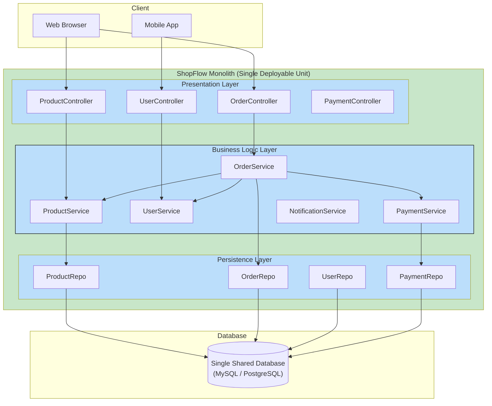
```mermaid
flowchart TB
    subgraph Client["Client"]
        WEB["Web Browser"]
        MOB["Mobile App"]
    end

    subgraph Presentation["Presentation Layer"]
        PC["ProductController"]
        OC["OrderController"]
        UC["UserController"]
        PAC["PaymentController"]
    end

    subgraph Business["Business Logic Layer"]
        PS["ProductService"]
        OS["OrderService"]
        US["UserService"]
        PAS["PaymentService"]
        NS["NotificationService"]
    end

    subgraph Persistence["Persistence Layer"]
        PR["ProductRepo"]
        OR["OrderRepo"]
        UR["UserRepo"]
        PAR["PaymentRepo"]
    end

    subgraph Monolith["ShopFlow Monolith (Single Deployable Unit)"]
        direction TB
            Presentation
            Business
            Persistence
    end

    subgraph DB["Database"]
        SINGLE_DB[("Single Shared Database\n(MySQL / PostgreSQL)")]
    end

    WEB --> PC & OC
    MOB --> UC
    PC --> PS
    OC --> OS
    UC --> US
    PS --> PR
    OS --> OR & PS & US & PAS
    PAS --> PAR
    PR --> SINGLE_DB
    OR --> SINGLE_DB
    UR --> SINGLE_DB
    PAR --> SINGLE_DB

    style Presentation fill:#BBDEFB
    style Business fill:#BBDEFB,stroke:#000000
    style Persistence fill:#BBDEFB
    style Monolith fill:#C8E6C9
```

### 2.4. Database

- **Một database duy nhất** (thường là RDBMS — MySQL, PostgreSQL)
- Tất cả services/modules đều đọc/ghi cùng một DB
- Schema chia sẻ → dễ JOIN dữ liệu giữa các domain
- **Rủi ro:** Một migration schema ảnh hưởng toàn hệ thống; bottleneck ở DB là bottleneck của toàn app

### 2.5. Cách triển khai

```
[Code] → [Build] → [Single JAR/WAR/Binary] → [Deploy lên 1 server hoặc cluster]
```

- Scale bằng cách **nhân bản toàn bộ ứng dụng** (horizontal scaling)
- Nếu chỉ `OrderService` chịu tải cao, vẫn phải scale **toàn bộ monolith**
- Một thay đổi nhỏ (fix bug ở `Notification`) → phải deploy lại **toàn bộ ứng dụng**

### 2.6. Ưu điểm

| Ưu điểm                       | Giải thích                                          |
| ----------------------------- | --------------------------------------------------- |
| **Đơn giản để bắt đầu**       | Một codebase, một repo, một pipeline CI/CD          |
| **Debug dễ dàng**             | Stack trace liên tục, không cần distributed tracing |
| **Transaction ACID tự nhiên** | Giao dịch xuyên domain trong cùng DB transaction    |
| **Không có network latency**  | Gọi hàm trực tiếp, không qua network                |
| **Phát triển nhanh ban đầu**  | Không cần lo về API contracts, service discovery    |
| **Testing dễ**                | Integration test đơn giản, chạy trong cùng process  |

### 2.7. Nhược điểm

| Nhược điểm                  | Biểu hiện thực tế                                            |
| --------------------------- | ------------------------------------------------------------ |
| **Khó scale độc lập**       | Catalog cần scale × 10, phải scale cả Payment × 10           |
| **Deploy rủi ro cao**       | Fix 1 bug → rebuild + redeploy toàn bộ, downtime             |
| **Codebase phình to**       | Sau 3-5 năm, codebase hàng triệu dòng, khó hiểu              |
| **Tight coupling ngầm**     | `OrderService` gọi thẳng vào `UserRepository` → phụ thuộc ẩn |
| **Tech stack cứng nhắc**    | Toàn bộ app phải dùng cùng ngôn ngữ, framework               |
| **Bottleneck team**         | 50 developers cùng commit vào 1 repo → conflict liên tục     |
| **Single point of failure** | Memory leak ở `Recommendation` → crash toàn app              |

### 2.8. Khi nào nên dùng Monolith?

✅ **Nên dùng khi:**

- Team ≤ 3-5 developers
- Dự án MVP hoặc proof-of-concept
- Domain chưa được hiểu rõ (chưa biết cách chia service)
- Startup cần tốc độ go-to-market
- Hệ thống nội bộ ít traffic

❌ **Không nên dùng khi:**

- Team > 10-20 người, nhiều team song song
- Cần scale các phần khác nhau của hệ thống
- Yêu cầu deploy độc lập giữa các feature
- Cần đa dạng tech stack

### 2.9. ShopFlow với Monolith

```
Giai đoạn 0-6 tháng (MVP):
- 3 developers, 1 codebase, 1 PostgreSQL database
- Tất cả chức năng: Catalog, Order, Payment, User, Notification
- Deploy lên 1 EC2 instance, 1 RDS instance
- Đơn giản, nhanh, đủ dùng
```

## 3. Modular Monolith Architecture

### 3.1. Định nghĩa

Modular Monolith (hay "Modulith") là kiến trúc trong đó ứng dụng **vẫn được deploy như một đơn vị duy nhất**, nhưng codebase được **tổ chức thành các module riêng biệt với ranh giới rõ ràng**. Mỗi module đại diện cho một bounded context và chỉ giao tiếp với module khác qua **public interface** được định nghĩa tường minh.

> **Triết lý cốt lõi:** "Logical separation BEFORE physical separation." Ranh giới tốt trong code là nền tảng để sau này tách thành microservices nếu cần.

### 3.2. Nguyên tắc thiết kế Module

**Một module tốt phải đảm bảo:**

1. **High Cohesion:** Tất cả code trong module liên quan chặt chẽ với nhau (cùng business domain)
2. **Low Coupling:** Module chỉ giao tiếp ra ngoài qua interface, không expose internal implementation
3. **Data Ownership:** Mỗi module sở hữu data của mình, không cho module khác truy cập trực tiếp
4. **Explicit Contract:** API giữa modules được định nghĩa rõ ràng và có versioning

### 3.3. Cách tổ chức code

```
shopflow/
├── modules/
│   ├── catalog/                    # Module: Catalog
│   │   ├── api/                    # Public interface (được expose ra ngoài)
│   │   │   ├── CatalogFacade.java  # Entry point duy nhất từ bên ngoài
│   │   │   ├── ProductDTO.java     # DTOs public
│   │   │   └── ProductQuery.java
│   │   ├── domain/                 # Private: Domain models, business logic
│   │   │   ├── Product.java
│   │   │   ├── Category.java
│   │   │   └── ProductDomainService.java
│   │   ├── infrastructure/         # Private: DB, external calls
│   │   │   ├── ProductRepository.java
│   │   │   └── ElasticsearchAdapter.java
│   │   └── CatalogModuleConfig.java
│   │
│   ├── order/                      # Module: Order
│   │   ├── api/
│   │   │   ├── OrderFacade.java
│   │   │   └── OrderDTO.java
│   │   ├── domain/
│   │   │   ├── Order.java
│   │   │   ├── OrderItem.java
│   │   │   └── OrderDomainService.java
│   │   ├── infrastructure/
│   │   │   └── OrderRepository.java
│   │   └── OrderModuleConfig.java
│   │
│   ├── payment/                    # Module: Payment
│   │   ├── api/
│   │   │   └── PaymentFacade.java
│   │   ├── domain/ ...
│   │   └── infrastructure/ ...
│   │
│   ├── inventory/                  # Module: Inventory
│   ├── user/                       # Module: User
│   └── notification/               # Module: Notification
│
├── shared/                         # Shared Kernel (dùng chung, không phải domain)
│   ├── events/                     # Internal domain events
│   │   ├── OrderPlacedEvent.java
│   │   └── PaymentCompletedEvent.java
│   └── types/                      # Primitive types chung (Money, UserId, ...)
│
└── application/                    # Orchestration layer (glue code)
    └── ShopFlowApplication.java
```

**Quy tắc vàng:**

```
✅ order.api → catalog.api        (OK: gọi qua public facade)
✅ order.domain → order.infrastructure (OK: trong cùng module)
❌ order.domain → catalog.domain  (Vi phạm: bypass interface)
❌ order.infrastructure → catalog.infrastructure (Vi phạm: cross-module DB access)
```

### 3.4. Sơ đồ kiến trúc

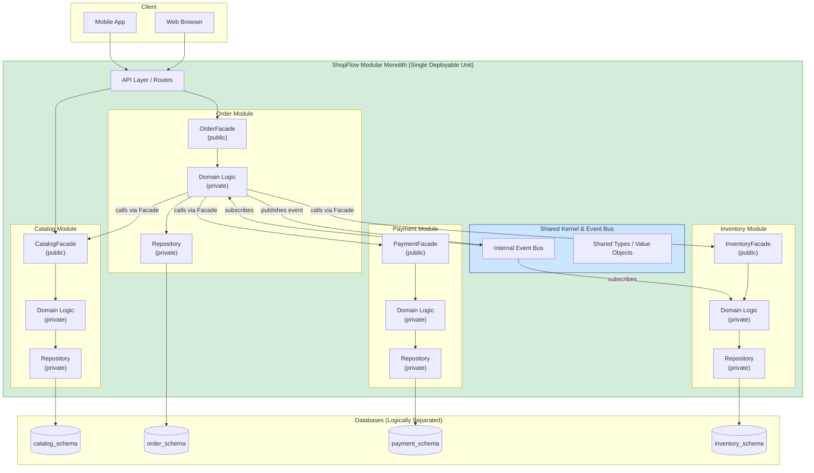
```mermaid
graph TB
    subgraph Client
        WEB[Web Browser]
        MOB[Mobile App]
    end

    subgraph ModularMonolith["ShopFlow Modular Monolith (Single Deployable Unit)"]
        direction TB

        API_GW[API Layer / Routes]

        subgraph CatalogModule["Catalog Module"]
            CAT_API["CatalogFacade\n(public)"]
            CAT_DOM["Domain Logic\n(private)"]
            CAT_REPO["Repository\n(private)"]
        end

        subgraph OrderModule["Order Module"]
            ORD_API["OrderFacade\n(public)"]
            ORD_DOM["Domain Logic\n(private)"]
            ORD_REPO["Repository\n(private)"]
        end

        subgraph PaymentModule["Payment Module"]
            PAY_API["PaymentFacade\n(public)"]
            PAY_DOM["Domain Logic\n(private)"]
            PAY_REPO["Repository\n(private)"]
        end

        subgraph InventoryModule["Inventory Module"]
            INV_API["InventoryFacade\n(public)"]
            INV_DOM["Domain Logic\n(private)"]
            INV_REPO["Repository\n(private)"]
        end

        subgraph SharedKernel["Shared Kernel & Event Bus"]
            EVENTS[Internal Event Bus]
            TYPES[Shared Types / Value Objects]
        end
    end

    subgraph DB["Databases (Logically Separated)"]
        CAT_DB[(catalog_schema)]
        ORD_DB[(order_schema)]
        PAY_DB[(payment_schema)]
        INV_DB[(inventory_schema)]
    end

    WEB --> API_GW
    MOB --> API_GW
    API_GW --> CAT_API
    API_GW --> ORD_API

    ORD_API --> ORD_DOM
    ORD_DOM --> ORD_REPO
    ORD_DOM -->|"calls via Facade"| CAT_API
    ORD_DOM -->|"calls via Facade"| PAY_API
    ORD_DOM -->|"calls via Facade"| INV_API
    ORD_DOM -->|"publishes event"| EVENTS

    CAT_API --> CAT_DOM --> CAT_REPO
    PAY_API --> PAY_DOM --> PAY_REPO
    INV_API --> INV_DOM --> INV_REPO

    EVENTS -->|"subscribes"| ORD_DOM
    EVENTS -->|"subscribes"| INV_DOM

    CAT_REPO --> CAT_DB
    ORD_REPO --> ORD_DB
    PAY_REPO --> PAY_DB
    INV_REPO --> INV_DB

    style ModularMonolith fill:#d4edda,stroke:#28a745
    style SharedKernel fill:#cce5ff,stroke:#004085
```

### 3.5. Database trong Modular Monolith

Có 3 cấp độ phân tách DB, tùy mức độ kiến trúc:

| Cấp độ                 | Cách làm                                      | Khi nào dùng                   |
| ---------------------- | --------------------------------------------- | ------------------------------ |
| **Logical separation** | Cùng DB, khác schema: `catalog.*`, `order.*`  | Bắt đầu với modulith           |
| **Separate schemas**   | Mỗi module có schema riêng, enforce bằng code | Khi muốn chuẩn bị tách service |
| **Separate databases** | Mỗi module có DB riêng nhưng vẫn 1 process    | Sẵn sàng cao nhất để extract   |

**Ví dụ với ShopFlow (Logical Separation):**

```sql
-- catalog schema
CREATE TABLE catalog.products (id, name, price, category_id, ...);
CREATE TABLE catalog.categories (id, name, parent_id, ...);

-- order schema
CREATE TABLE order.orders (id, user_id, status, total_amount, ...);
CREATE TABLE order.order_items (id, order_id, product_id, quantity, price, ...);

-- inventory schema
CREATE TABLE inventory.stock (id, product_id, quantity, warehouse_id, ...);
```

**Quy tắc:** `Order module` KHÔNG được `JOIN` trực tiếp với `catalog.products`. Muốn lấy thông tin product, phải gọi `CatalogFacade.getProduct(productId)`.

### 3.6. Kỹ thuật enforce module boundaries

**1. Package-private trong Java:**

```java
// CatalogFacade.java - public interface
public class CatalogFacade {
    public ProductDTO getProduct(String productId) { ... }
}

// ProductDomainService.java - package-private, không ai ngoài catalog module thấy được
class ProductDomainService {   // không có "public" keyword
    Product applyDiscount(Product p, Discount d) { ... }
}
```

**2. ArchUnit (Enforce bằng automated tests):**

```java
@Test
void modulesShouldNotAccessEachOtherInternals() {
    noClasses()
        .that().resideInAPackage("..order.domain..")
        .should().accessClassesThat()
        .resideInAPackage("..catalog.domain..")
        .check(importedClasses);
}
```

**3. Spring Modulith (Java/Spring ecosystem):**

```java
@SpringBootApplication
public class ShopFlowApplication implements ApplicationModuleInitializer {
    // Spring Modulith tự động enforce module boundaries
    // và generate documentation về module dependencies
}
```

**4. Internal Event Bus (giảm coupling):**

```java
// Thay vì Order gọi thẳng InventoryFacade để giảm tồn kho:
// Order domain publish event
eventBus.publish(new OrderPlacedEvent(orderId, items));

// Inventory module subscribe và xử lý
@EventListener
void onOrderPlaced(OrderPlacedEvent event) {
    inventoryService.reserveStock(event.getItems());
}
```

### 3.7. Cách triển khai

```
[Code] → [Build] → [Single JAR/Container] → [Deploy]
```

Giống monolith về mặt operational, nhưng **codebase có cấu trúc tốt hơn nhiều**.

**Scale:** Vẫn scale toàn bộ process, nhưng do boundaries rõ ràng, dễ **extract module thành microservice** khi cần.

### 3.8. Ưu điểm

| Ưu điểm                  | Giải thích                                                |
| ------------------------ | --------------------------------------------------------- |
| **Đơn giản operational** | Vẫn 1 deployment unit, 1 pipeline CI/CD                   |
| **Ranh giới rõ ràng**    | Module isolation giúp team làm việc song song             |
| **Transaction ACID**     | Vẫn dùng được DB transaction xuyên module (khi cần)       |
| **Dễ refactor**          | Ranh giới rõ → biết chính xác impact của thay đổi         |
| **Bước đệm**             | Dễ extract thành microservice sau này (boundaries đã sẵn) |
| **Debug & Test**         | Dễ hơn microservices, không cần distributed tracing       |
| **Performance**          | In-process calls nhanh hơn network calls                  |

### 3.9. Nhược điểm

| Nhược điểm                | Giải thích                                                    |
| ------------------------- | ------------------------------------------------------------- |
| **Vẫn scale toàn bộ**     | Catalog cần scale, vẫn phải scale cả Payment                  |
| **Tech stack đồng nhất**  | Không thể dùng Node.js cho 1 module, Python cho module khác   |
| **Deploy all-or-nothing** | Một thay đổi nhỏ vẫn phải redeploy toàn bộ                    |
| **Cần kỷ luật code**      | Nếu team không tuân thủ, boundaries bị xói mòn theo thời gian |
| **Giới hạn team scale**   | Khó hơn khi có 50+ developers trên cùng codebase              |

### 3.10. Khi nào nên dùng Modular Monolith?

✅ **Nên dùng khi:**

- Team 5-20 người
- Domain đang được explore/learn (chưa chắc về boundaries)
- Startup growth stage cần cân bằng speed và maintainability
- Dự án có ngân sách infrastructure hạn chế
- **Martin Fowler's "MonolithFirst":** Nếu không chắc về boundaries, bắt đầu với modular monolith

❌ **Không nên (hoặc cần xem xét migrate) khi:**

- Một module cụ thể cần scale độc lập về resources (CPU/RAM riêng)
- Có yêu cầu SLA khác nhau giữa các domain
- Team > 30 người, nhiều team squad độc lập
- Cần deploy các module ở tốc độ khác nhau (Payment: 1 lần/tuần, Catalog: nhiều lần/ngày)

### 3.11. ShopFlow với Modular Monolith

```
Giai đoạn 6-18 tháng (Growth):
- 10 developers, chia thành 3-4 team nhỏ
- Mỗi team own 1-2 module
- 1 codebase có cấu trúc modular rõ ràng
- 1 PostgreSQL với multiple schemas
- Vẫn deploy 1 container, nhưng CI/CD check module boundaries
- Traffic ~10k requests/day → đủ dùng
```

### 3.12. Rủi ro khi không có module rõ ràng

Khi code không có ranh giới rõ:

```
❌ Distributed monolith (worst of both worlds):
   - Chia thành nhiều service VẬT LÝ
   - Nhưng vẫn tight coupling: ServiceA → ServiceB → ServiceC → ServiceA
   - Một thay đổi phải deploy đồng thời tất cả services
   - Có complexity của microservices, không có benefit nào

❌ Big Ball of Mud:
   - Sau 3 năm không có module boundaries
   - OrderService import từ 20 classes khác nhau
   - Không ai hiểu ảnh hưởng của 1 thay đổi
   - Thêm feature = sợ break toàn bộ system
```

## 4. Domain-Driven Design (DDD)

DDD là phương pháp luận được Eric Evans đề xuất (2003) để thiết kế phần mềm phức tạp bằng cách **đặt business domain vào trung tâm** của mọi quyết định kỹ thuật. DDD là nền tảng lý thuyết cho cả Modular Monolith và Microservices.

### 4.1. Hai cấp độ của DDD

```
┌─────────────────────────────────────────────────────────────┐
│                    STRATEGIC DDD                            │
│   (Trả lời: TẠI SAO và Ở ĐÂU áp dụng?)                      │
│   → Chia hệ thống, định nghĩa boundaries                    │
│   → Bounded Contexts, Subdomains, Context Maps              │
└─────────────────────────────────────────────────────────────┘
                            │
                            ▼
┌─────────────────────────────────────────────────────────────┐
│                    TACTICAL DDD                             │
│   (Trả lời: NHƯ THẾ NÀO implement bên trong?)               │
│   → Thiết kế domain model chi tiết trong 1 bounded context  │
│   → Entities, Value Objects, Aggregates, Domain Events      │
└─────────────────────────────────────────────────────────────┘
```

### 4.2. Strategic DDD

#### 4.2.1. Ubiquitous Language (Ngôn ngữ chung)

Developers và domain experts dùng **cùng một từ ngữ** để nói về business. Tránh tình trạng developer gọi là `ProductRecord`, business gọi là `SKU`, analyst gọi là `Item`.

```
ShopFlow Ubiquitous Language:
- "Order" = đơn hàng đã được customer confirm
- "Cart" = giỏ hàng chưa confirm
- "SKU" = Stock Keeping Unit (đơn vị tồn kho)
- "Fulfillment" = quá trình xử lý và giao hàng
- "Reserve" = tạm giữ hàng khi customer order (chưa trừ stock thật)
```

#### 4.2.2. Domain, Subdomain và Bounded Context

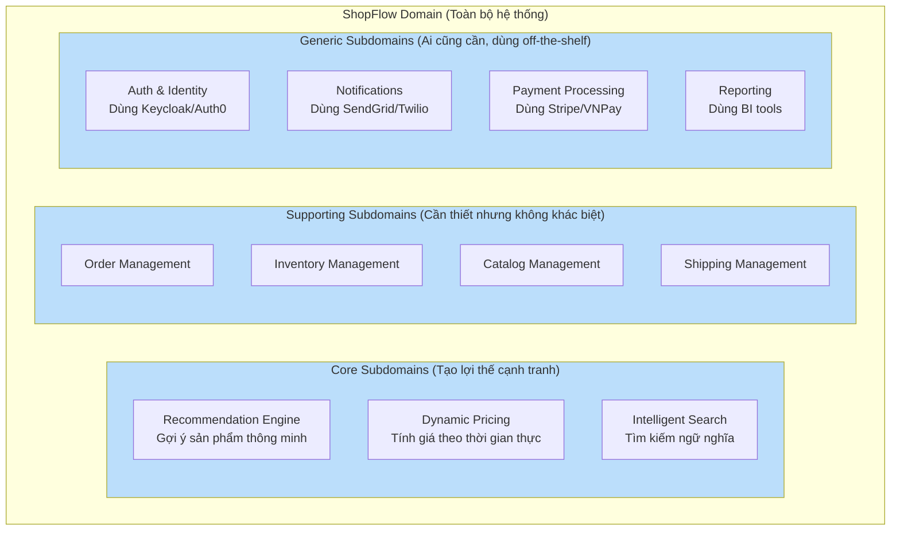
```mermaid
graph TB
    subgraph Domain["ShopFlow Domain (Toàn bộ hệ thống)"]
        subgraph CoreSD["Core Subdomains (Tạo lợi thế cạnh tranh)"]
            REC[Recommendation Engine\nGợi ý sản phẩm thông minh]
            PRICING[Dynamic Pricing\nTính giá theo thời gian thực]
            SEARCH[Intelligent Search\nTìm kiếm ngữ nghĩa]
        end

        subgraph SupportSD["Supporting Subdomains (Cần thiết nhưng không khác biệt)"]
            ORD[Order Management]
            INV[Inventory Management]
            CAT[Catalog Management]
            SHIP[Shipping Management]
        end

        subgraph GenericSD["Generic Subdomains (Ai cũng cần, dùng off-the-shelf)"]
            AUTH[Auth & Identity\nDùng Keycloak/Auth0]
            NOTIF[Notifications\nDùng SendGrid/Twilio]
            PAY[Payment Processing\nDùng Stripe/VNPay]
            REPORT[Reporting\nDùng BI tools]
        end
    end

    style CoreSD fill:#BBDEFB
    style SupportSD fill:#BBDEFB
    style GenericSD fill:#BBDEFB
```

**Giải thích 3 loại Subdomain:**

| Loại           | Ý nghĩa                                        | Chiến lược đầu tư                        | Ví dụ ShopFlow                         |
| -------------- | ---------------------------------------------- | ---------------------------------------- | -------------------------------------- |
| **Core**       | Tạo lợi thế cạnh tranh, là "trái tim" business | Build in-house, team tốt nhất, DDD chuẩn | Recommendation engine, Dynamic pricing |
| **Supporting** | Cần thiết để Core hoạt động                    | Build in-house nhưng không cần "perfect" | Order management, Inventory            |
| **Generic**    | Ai cũng cần, không tạo khác biệt               | Buy / outsource / dùng open-source       | Auth (Keycloak), Payment (Stripe)      |

**Quy tắc đầu tư:** Đầu tư nhiều vào Core, vừa phải vào Supporting, outsource Generic.

#### 4.2.3. Bounded Context

Một Bounded Context là **ranh giới ngữ nghĩa** trong đó một model domain được định nghĩa và áp dụng nhất quán.

```
⚠️ Cùng từ "Product" nhưng ý nghĩa khác nhau trong mỗi context:

Catalog BC:   Product = {id, name, description, images, category, specifications}
Inventory BC: Product = {sku, warehouseLocation, quantity, reorderPoint}
Order BC:     Product = {productId, priceAtOrderTime, quantity, discount}
Pricing BC:   Product = {productId, basePrice, priceRules, marketSegment}
```

Mỗi Bounded Context có **model riêng** và **database/schema riêng**. Đây là cơ sở để chia module trong Modular Monolith và chia service trong Microservices.

#### 4.2.4. Context Map – Mối quan hệ giữa các Bounded Contexts

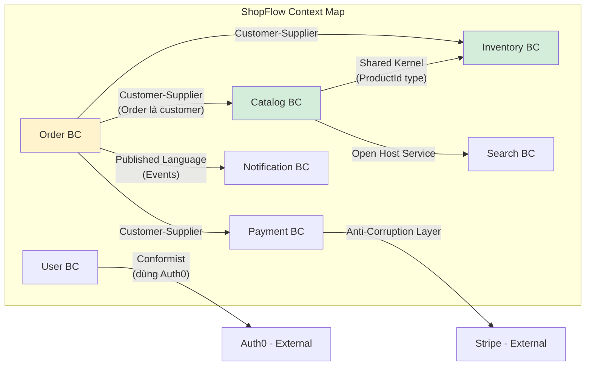
```mermaid
graph LR
    subgraph ShopFlow["ShopFlow Context Map"]
        ORDER[Order BC]
        CATALOG[Catalog BC]
        INVENTORY[Inventory BC]
        PAYMENT[Payment BC]
        NOTIFICATION[Notification BC]
        SEARCH[Search BC]
        USER[User BC]
    end

    ORDER -->|"Customer-Supplier\n(Order là customer)"| CATALOG
    ORDER -->|"Customer-Supplier"| INVENTORY
    ORDER -->|"Customer-Supplier"| PAYMENT
    ORDER -->|"Published Language\n(Events)"| NOTIFICATION
    CATALOG -->|"Shared Kernel\n(ProductId type)"| INVENTORY
    USER -->|"Conformist\n(dùng Auth0)"| AUTH_EXTERNAL[Auth0 - External]
    PAYMENT -->|"Anti-Corruption Layer"| PAYMENT_EXT[Stripe - External]
    CATALOG -->|"Open Host Service"| SEARCH

    style ORDER fill:#fff3cd
    style CATALOG fill:#d4edda
    style INVENTORY fill:#d4edda
```

**Các loại quan hệ trong Context Map:**

| Quan hệ                         | Ý nghĩa                                                                        |
| ------------------------------- | ------------------------------------------------------------------------------ |
| **Customer-Supplier**           | Upstream (Supplier) cung cấp API, Downstream (Customer) tiêu thụ               |
| **Shared Kernel**               | Hai contexts chia sẻ một phần model (dùng khi coupling là chấp nhận được)      |
| **Anti-Corruption Layer (ACL)** | Tạo layer dịch giữa context của mình và external system để bảo vệ domain model |
| **Published Language**          | Context publish events theo một schema chuẩn, ai muốn dùng thì subscribe       |
| **Conformist**                  | Downstream chấp nhận dùng model của Upstream mà không có quyền influence       |

### 4.3. Tactical DDD

#### 4.3.1. Entity

Object có **identity** (ID) và **lifecycle** (có thể thay đổi theo thời gian).

```java
// Entity: Order - có identity (orderId), state thay đổi theo lifecycle
public class Order {
    private final OrderId id;           // Identity
    private OrderStatus status;         // State có thể thay đổi
    private List<OrderItem> items;
    private Money totalAmount;

    // Business behavior thay vì chỉ getter/setter
    public void confirm() {
        if (this.status != OrderStatus.PENDING) {
            throw new IllegalStateException("Can only confirm pending orders");
        }
        this.status = OrderStatus.CONFIRMED;
        // raise domain event
    }
}
```

#### 4.3.2. Value Object

Object KHÔNG có identity, chỉ được định nghĩa bởi **giá trị** của nó. Immutable.

```java
// Value Object: Money - không có ID, chỉ có value
public final class Money {
    private final BigDecimal amount;
    private final Currency currency;

    // Immutable - mọi operation trả về object mới
    public Money add(Money other) {
        assertSameCurrency(other);
        return new Money(this.amount.add(other.amount), this.currency);
    }

    // Equality dựa trên value, không phải reference
    @Override
    public boolean equals(Object o) {
        Money money = (Money) o;
        return amount.equals(money.amount) && currency.equals(money.currency);
    }
}
```

#### 4.3.3. Aggregate và Aggregate Root

**Aggregate** là cụm của các Entity và Value Objects được xem như **một đơn vị nhất quán**. **Aggregate Root** là Entity duy nhất có thể được access từ bên ngoài.

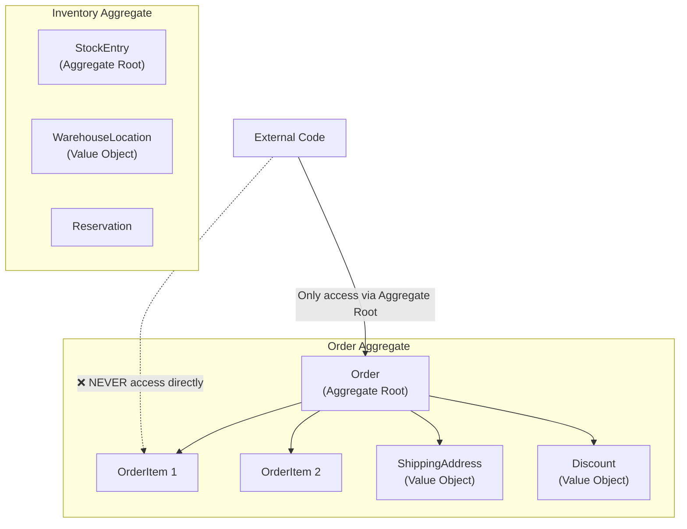
```mermaid
graph TB
    subgraph OrderAggregate["Order Aggregate"]
        OR["Order\n(Aggregate Root)"]
        OI1[OrderItem 1]
        OI2[OrderItem 2]
        ADDR["ShippingAddress\n(Value Object)"]
        DISC["Discount\n(Value Object)"]
    end

    subgraph InventoryAggregate["Inventory Aggregate"]
        STOCK["StockEntry\n(Aggregate Root)"]
        LOC["WarehouseLocation\n(Value Object)"]
        RES[Reservation]
    end

    OUTSIDE[External Code] -->|"Only access via Aggregate Root"| OR
    OUTSIDE -.->|"❌ NEVER access directly"| OI1
    OR --> OI1
    OR --> OI2
    OR --> ADDR
    OR --> DISC
```

**Quy tắc thiết kế Aggregate:**

1. External code chỉ reference Aggregate Root, không reference internal entities trực tiếp.
2. Một DB transaction chỉ nên thay đổi một Aggregate (đảm bảo consistency boundary).
3. Communicate với Aggregate khác qua **Domain Events**, không qua direct reference.

#### 4.3.4. Domain Events

Events mô tả điều gì đó đã xảy ra trong domain – immutable fact, past tense.

```java
// Domain Event: OrderPlaced - immutable fact, past tense
public class OrderPlacedEvent {
    private final OrderId orderId;
    private final UserId customerId;
    private final List<OrderItemData> items;
    private final Money totalAmount;
    private final Instant occurredAt;

    // Only constructor, no setters - immutable
}

// Trong Aggregate Root - raise event khi state thay đổi
public class Order {
    private List<DomainEvent> events = new ArrayList<>();

    public void place() {
        // business validation...
        this.status = OrderStatus.PLACED;
        events.add(new OrderPlacedEvent(this.id, this.customerId, this.items, this.total));
    }

    public List<DomainEvent> pullEvents() {
        List<DomainEvent> toReturn = new ArrayList<>(events);
        events.clear();
        return toReturn;
    }
}
```

#### 4.3.5. Repository

Abstraction để **persist và retrieve Aggregate**, che giấu storage details.

```java
// Repository interface (trong domain layer)
public interface OrderRepository {
    void save(Order order);
    Optional<Order> findById(OrderId id);
    List<Order> findByCustomer(UserId customerId);
}

// Repository implementation (trong infrastructure layer)
public class PostgresOrderRepository implements OrderRepository {
    @Override
    public void save(Order order) {
        // Map domain object to DB entity, then save
    }
}
```

### 4.4. DDD trong ShopFlow: Phân rã thực tế

```
ShopFlow Bounded Contexts → Modules (Modular Monolith) → Services (Microservices):

Catalog BC:
  Core: ProductAggregate, CategoryAggregate
  Value Objects: ProductName, Price, Specifications
  Events: ProductCreated, PriceChanged, ProductDiscontinued

Order BC:
  Core: OrderAggregate (root), OrderItem
  Value Objects: Money, ShippingAddress, Discount
  Events: OrderPlaced, OrderConfirmed, OrderCancelled, OrderShipped

Inventory BC:
  Core: StockEntryAggregate
  Value Objects: Quantity, WarehouseLocation
  Events: StockReserved, StockReleased, StockReplenished, LowStockAlert

Payment BC:
  Core: PaymentAggregate
  Value Objects: Money, CardInfo (masked)
  Events: PaymentInitiated, PaymentCaptured, PaymentFailed, RefundIssued
```

## 5. Microservices Architecture

### 5.1. Định nghĩa

Microservices Architecture là kiến trúc trong đó ứng dụng được chia thành **tập hợp các service nhỏ, độc lập, loosely coupled**, mỗi service:

- Chạy trong **process riêng**
- Có **database riêng** (Database per Service pattern)
- Giao tiếp qua **network** (REST/gRPC/messaging)
- Được **deploy độc lập**
- Do **một team nhỏ** (two-pizza team) sở hữu và chịu trách nhiệm

> **"Microservices = Physical separation của Bounded Contexts"**  
> Modular Monolith = logical separation  
> Microservices = logical + physical separation

### 5.2. Cách tổ chức code và triển khai

Mỗi service là một **independent repository và deployable unit**:

```
shopflow-catalog-service/
├── src/
│   ├── domain/
│   ├── application/
│   └── infrastructure/
├── Dockerfile
├── docker-compose.yml
└── k8s/
    ├── deployment.yaml
    └── service.yaml

shopflow-order-service/      (repo riêng)
shopflow-payment-service/    (repo riêng)
shopflow-inventory-service/  (repo riêng)
...
```

### 5.3. Sơ đồ kiến trúc Microservices

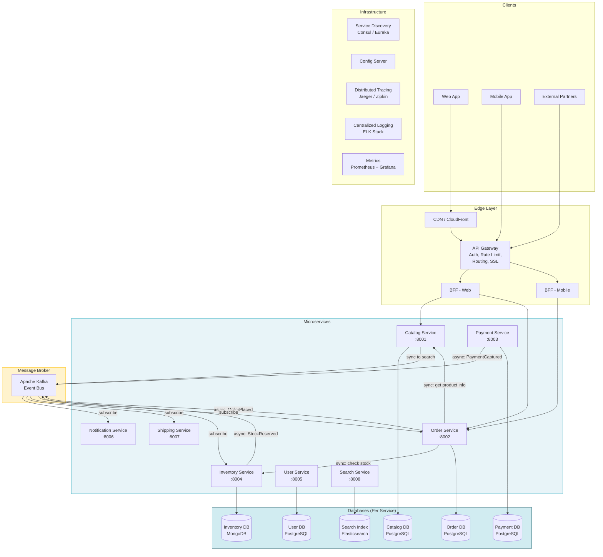
```mermaid
graph TB
    subgraph Clients
        WEB[Web App]
        MOB[Mobile App]
        EXT[External Partners]
    end

    subgraph EdgeLayer["Edge Layer"]
        CDN[CDN / CloudFront]
        APIGW[API Gateway\nAuth, Rate Limit,\nRouting, SSL]
        BFF_WEB[BFF - Web]
        BFF_MOB[BFF - Mobile]
    end

    subgraph Services["Microservices"]
        CAT_SVC[Catalog Service\n:8001]
        ORD_SVC[Order Service\n:8002]
        PAY_SVC[Payment Service\n:8003]
        INV_SVC[Inventory Service\n:8004]
        USR_SVC[User Service\n:8005]
        NOTIF_SVC[Notification Service\n:8006]
        SHIP_SVC[Shipping Service\n:8007]
        SEARCH_SVC[Search Service\n:8008]
    end

    subgraph Messaging["Message Broker"]
        KAFKA[Apache Kafka\nEvent Bus]
    end

    subgraph Databases["Databases (Per Service)"]
        CAT_DB[(Catalog DB\nPostgreSQL)]
        ORD_DB[(Order DB\nPostgreSQL)]
        PAY_DB[(Payment DB\nPostgreSQL)]
        INV_DB[(Inventory DB\nMongoDB)]
        USR_DB[(User DB\nPostgreSQL)]
        SEARCH_DB[(Search Index\nElasticsearch)]
    end

    subgraph Infra["Infrastructure"]
        SD[Service Discovery\nConsul / Eureka]
        CONFIG[Config Server]
        TRACE[Distributed Tracing\nJaeger / Zipkin]
        LOG[Centralized Logging\nELK Stack]
        METRIC[Metrics\nPrometheus + Grafana]
    end

    WEB --> CDN --> APIGW
    MOB --> APIGW
    EXT --> APIGW
    APIGW --> BFF_WEB
    APIGW --> BFF_MOB
    BFF_WEB --> CAT_SVC
    BFF_WEB --> ORD_SVC
    BFF_MOB --> ORD_SVC

    ORD_SVC -->|"sync: check stock"| INV_SVC
    ORD_SVC -->|"sync: get product info"| CAT_SVC
    ORD_SVC -->|"async: OrderPlaced"| KAFKA
    PAY_SVC -->|"async: PaymentCaptured"| KAFKA
    INV_SVC -->|"async: StockReserved"| KAFKA
    KAFKA -->|"subscribe"| NOTIF_SVC
    KAFKA -->|"subscribe"| SHIP_SVC
    KAFKA -->|"subscribe"| INV_SVC
    KAFKA -->|"subscribe"| ORD_SVC

    CAT_SVC --> CAT_DB
    ORD_SVC --> ORD_DB
    PAY_SVC --> PAY_DB
    INV_SVC --> INV_DB
    USR_SVC --> USR_DB
    SEARCH_SVC --> SEARCH_DB
    CAT_SVC -->|"sync to search"| KAFKA

    style Services fill:#e8f4f8,stroke:#17a2b8
    style Messaging fill:#fff3cd,stroke:#ffc107
    style Databases fill:#d1ecf1,stroke:#0c5460
```

### 5.4. Database per Service Pattern

**Đây là nguyên tắc cốt lõi và khó nhất của Microservices.**

```
Monolith / Modular Monolith:          Microservices:
┌──────────────────────┐              ┌───────────────┐  ┌─────────────────┐
│    Order Service     │              │ Order Service │  │ Payment Service │
│    Payment Service   │              └───────┬───────┘  └────────┬────────┘
│    Catalog Service   │                      │                   │
└──────────────────────┘                      ▼                   ▼
            │                         ┌──────────────┐    ┌──────────────┐
            ▼                         │ Order DB     │    │ Payment DB   │
    ┌──────────────┐                  │ (PostgreSQL) │    │ (PostgreSQL) │
    │ Shared DB    │                  └──────────────┘    └──────────────┘
    │ (PostgreSQL) │
    └──────────────┘                Mỗi service chọn DB tốt nhất cho use case:
                                    - Catalog: PostgreSQL (relational)
                                    - Search: Elasticsearch
                                    - Inventory: MongoDB (flexible schema)
                                    - Session: Redis
```

**Hệ quả:** Không thể JOIN dữ liệu giữa services. Thay vào đó phải dùng:

- **API Composition:** Gọi nhiều services và merge kết quả ở tầng trên
- **CQRS + Read Model:** Tạo materialized view tổng hợp dữ liệu từ nhiều services
- **Saga Pattern:** Xử lý distributed transaction

### 5.5. Giao tiếp giữa Services

#### 5.5.1. Synchronous (Đồng bộ)

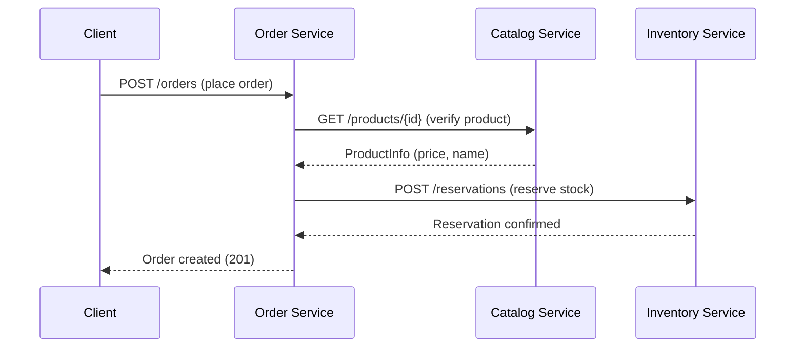
```mermaid
sequenceDiagram
    participant Client
    participant OrderSvc as Order Service
    participant CatalogSvc as Catalog Service
    participant InventorySvc as Inventory Service

    Client->>OrderSvc: POST /orders (place order)
    OrderSvc->>CatalogSvc: GET /products/{id} (verify product)
    CatalogSvc-->>OrderSvc: ProductInfo (price, name)
    OrderSvc->>InventorySvc: POST /reservations (reserve stock)
    InventorySvc-->>OrderSvc: Reservation confirmed
    OrderSvc-->>Client: Order created (201)
```

**Dùng khi:** Cần kết quả ngay để tiếp tục xử lý, client đang đợi response.

**Giao thức:**

- **REST/HTTP:** Đơn giản, phổ biến, dễ debug
- **gRPC:** Hiệu năng cao hơn, strongly-typed contracts (Protobuf), tốt cho internal service-to-service

#### 5.5.2. Asynchronous (Bất đồng bộ)

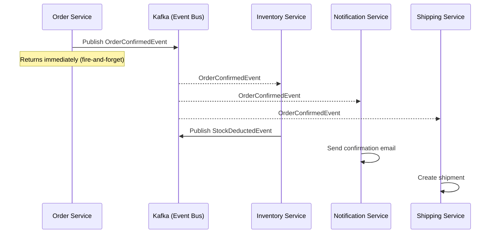
```mermaid
sequenceDiagram
    participant OrderSvc as Order Service
    participant Kafka as Kafka (Event Bus)
    participant InventorySvc as Inventory Service
    participant NotifSvc as Notification Service
    participant ShipSvc as Shipping Service

    OrderSvc->>Kafka: Publish OrderConfirmedEvent
    Note over OrderSvc: Returns immediately (fire-and-forget)
    Kafka-->>InventorySvc: OrderConfirmedEvent
    Kafka-->>NotifSvc: OrderConfirmedEvent
    Kafka-->>ShipSvc: OrderConfirmedEvent
    InventorySvc->>Kafka: Publish StockDeductedEvent
    NotifSvc->>NotifSvc: Send confirmation email
    ShipSvc->>ShipSvc: Create shipment
```

**Dùng khi:** Nhiều services cần react đến cùng event, không cần kết quả ngay, muốn giảm coupling.

### 5.6. API Gateway và BFF Pattern

```
Không có Gateway (bad):
Client → trực tiếp gọi từng microservice (quản lý rắc rối, expose internal topology)

API Gateway (basic):
Client → API Gateway → Microservices (routing, auth, rate limiting)

BFF - Backends for Frontends (tốt nhất):
Web App  → BFF-Web  → [Catalog, Order, User Services]   (optimized cho Web)
Mobile   → BFF-Mobile → [Order, User Services]          (optimized cho Mobile - ít data hơn)
Partners → BFF-Partner → [Catalog, Order Services]      (different auth, different data)
```

**Lý do cần BFF:** Web cần 15 fields từ Product, Mobile chỉ cần 5 fields. Thay vì để client gọi API rồi filter, BFF làm việc đó, tối ưu cho từng loại client.

### 5.7. Service Discovery

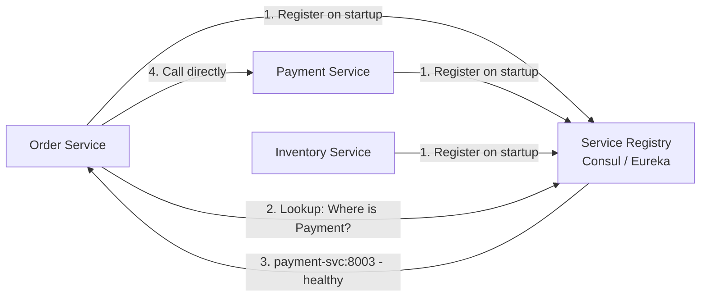
```mermaid
graph LR
    ORD[Order Service] -->|"1. Register on startup"| SD[Service Registry\nConsul / Eureka]
    PAY[Payment Service] -->|"1. Register on startup"| SD
    INV[Inventory Service] -->|"1. Register on startup"| SD

    ORD -->|"2. Lookup: Where is Payment?"| SD
    SD -->|"3. payment-svc:8003 - healthy"| ORD
    ORD -->|"4. Call directly"| PAY
```

### 5.8. Resilience Patterns

#### Circuit Breaker

```
Normal:         Order → Payment → (200 OK)

Payment slow:   Order → Payment → (timeout after 3s)
                [After 5 consecutive failures, Circuit OPENS]

Circuit OPEN:   Order → Circuit Breaker → Fallback response (không gọi Payment nữa)
                [Sau 30s, thử lại - Circuit HALF-OPEN]

Recovery:       Circuit HALF-OPEN → Payment OK → Circuit CLOSES
```

#### Bulkhead

Cô lập resources cho từng service, tránh cascade failure:

```
Thread pool cho Payment: 20 threads
Thread pool cho Catalog: 30 threads
Thread pool cho Inventory: 10 threads
```

→ Payment bị chậm chỉ ảnh hưởng 20 threads, không block Catalog hay Inventory

### 5.9. Kỹ thuật phân rã thành Microservices

1. **Decompose by Business Capability:** Mỗi service = một business capability

Business capability là những gì doanh nghiệp làm để tạo ra giá trị (ví dụ: quản lý đơn hàng, xử lý thanh toán). Mẫu "Decompose by business capability" khuyến nghị mỗi dịch vụ đại diện cho một khả năng kinh doanh và do một đội nhỏ chịu trách nhiệm.

Sử dụng khi mô hình tổ chức của bạn rõ ràng theo chức năng, khả năng. Các capability ổn định giúp kiến trúc ổn định và các nhóm có thể làm việc độc lập.

```
Catalog Service: Quản lý sản phẩm, danh mục
Order Service: Đặt hàng, quản lý đơn
Payment Service: Xử lý thanh toán
```

2. **Decompose by Bounded Context (DDD):** Dùng Bounded Contexts làm service boundaries

Domain-Driven Design (DDD) xác định "bounded context" – phạm vi mà một mô hình miền áp dụng Microservices nên được thiết kế theo các subdomain của miền ứng dụng. Mẫu "Decompose by subdomain" chỉ ra rằng một domain bao gồm nhiều subdomain:

- Core (giá trị cốt lõi)
- Supporting (hỗ trợ)
- Generic (chung)

_Mỗi subdomain tương ứng với một dịch vụ._

Được ưa chuộng khi sử dụng DDD, đặc biệt là những hệ thống có miền phức tạp. Phân rã theo subdomain giúp kiến trúc ổn định, dịch vụ có cohesion cao và nhóm phát triển được tổ chức quanh giá trị kinh doanh.

```
Một Bounded Context = một Microservice candidate
(Nhưng có thể là nhiều services nếu bounded context quá lớn)
```

3. **Strangler Fig Pattern:** Migrate dần từ monolith

```
Bước 1: Identify module "đau nhất" (cần scale nhất, thay đổi nhiều nhất)
Bước 2: Extract module đó thành service riêng
Bước 3: Route traffic qua API Gateway
Bước 4: Lặp lại với module tiếp theo
Bước 5: Monolith "chết dần" như cây bị dây leo thắt
```

### 5.10. Ưu điểm

| Ưu điểm             | Giải thích                                                       |
| ------------------- | ---------------------------------------------------------------- |
| **Scale độc lập**   | Chỉ scale service nào cần (Catalog × 20, Payment × 2)            |
| **Deploy độc lập**  | Fix bug Order không ảnh hưởng Payment                            |
| **Tech diversity**  | Search dùng Elasticsearch + Python, Order dùng PostgreSQL + Java |
| **Fault isolation** | Recommendation chết không làm sập toàn bộ                        |
| **Team autonomy**   | Mỗi team own service của mình, tự quyết tech stack               |
| **Cloud-native**    | Phù hợp với container, Kubernetes, cloud auto-scaling            |

### 5.11. Nhược điểm

| Nhược điểm                        | Chi phí thực tế                                                |
| --------------------------------- | -------------------------------------------------------------- |
| **Distributed system complexity** | Phải xử lý network failures, eventual consistency, latency     |
| **Operational overhead**          | N services = N pipelines CI/CD, N monitoring dashboards        |
| **Distributed transactions**      | Không có ACID cross-service, phải dùng Saga pattern            |
| **Testing khó**                   | Integration test phức tạp, cần contract testing                |
| **Service mesh**                  | Cần thêm Istio/Linkerd để manage inter-service communication   |
| **Data consistency**              | Eventual consistency thay vì strong consistency                |
| **Observability**                 | Phải có distributed tracing, centralized logging (ELK, Jaeger) |
| **Latency tăng**                  | Network calls thay vì in-process calls                         |

### 5.12. Khi nào nên dùng Microservices?

✅ **Nên dùng khi:**

- Team > 20-30 người, cần nhiều team làm việc độc lập
- Các phần hệ thống có nhu cầu scale khác nhau rõ rệt
- Cần deploy tốc độ cao, nhiều lần/ngày
- SLA khác nhau giữa các domain (Payment cần 99.99%, Recommendation 99.9%)
- Đang migrate legacy system (Strangler Fig)
- Team có đủ năng lực DevOps/SRE
- Cần technology diversity (ML service bằng Python, core bằng Java)

❌ **Không nên dùng khi:**

- Team nhỏ (< 10 người)
- Domain boundaries chưa rõ ràng
- Không có DevOps culture và tooling
- Startup giai đoạn đầu
- Hệ thống đơn giản, traffic thấp

### 5.13. ShopFlow với Microservices

```
Giai đoạn 18+ tháng (Scale):
- 5-8 squad teams (mỗi team 4-6 người)
- 8-10 microservices
- Kubernetes cluster, Kafka cluster
- Mỗi service có CI/CD pipeline riêng
- Monitoring: Grafana, Jaeger, ELK
- Traffic: 1M+ requests/day
```

## 6. Event-Driven Architecture (EDA)

EDA không phải là một kiến trúc hệ thống độc lập như Monolith hay Microservices, mà là một **pattern giao tiếp** được áp dụng trong hệ thống – đặc biệt trong Microservices và Modular Monolith – để giảm coupling và tăng khả năng phản ứng theo thời gian thực.

### 6.1. Định nghĩa và Khái niệm cơ bản

**Event-Driven Architecture (EDA)** là mô hình kiến trúc trong đó các thành phần của hệ thống **giao tiếp chủ yếu thông qua việc sản xuất (publish) và tiêu thụ (consume) các sự kiện (events)**, thay vì gọi nhau trực tiếp.

#### Phân biệt Event, Command và Query

| Khái niệm   | Ý nghĩa                                 | Ví dụ                            | Tính chất                              |
| ----------- | --------------------------------------- | -------------------------------- | -------------------------------------- |
| **Event**   | Điều gì đó ĐÃ XẢY RA (past tense, fact) | `OrderPlaced`, `PaymentCaptured` | Immutable, published to all interested |
| **Command** | Yêu cầu một hành động XẢY RA            | `PlaceOrder`, `CapturePayment`   | Directed to specific receiver          |
| **Query**   | Hỏi trạng thái hiện tại                 | `GetOrderById`, `ListProducts`   | Read-only                              |

```
Event:   "Đơn hàng #123 đã được đặt lúc 10:30"  → Fact, immutable, ai cần thì dùng
Command: "Hãy trừ tồn kho cho đơn #123"         → Directed to Inventory Service
Query:   "Trạng thái của đơn #123 là gì?"       → Read-only
```

#### Anatomy of an Event

```json
{
  "eventId": "evt-uuid-abc123", // Unique ID
  "eventType": "order.placed", // What happened
  "version": "1.0", // Schema version
  "timestamp": "2026-01-15T10:30:00Z", // When it happened
  "source": "order-service", // Who raised it
  "correlationId": "req-xyz789", // Tracing ID
  "data": {
    "orderId": "ord-456",
    "customerId": "usr-789",
    "items": [{ "productId": "prod-001", "quantity": 2, "price": 150000 }],
    "totalAmount": 300000,
    "currency": "VND"
  }
}
```

### 6.2. Tại sao cần EDA?

**Vấn đề với synchronous communication trong Microservices:**

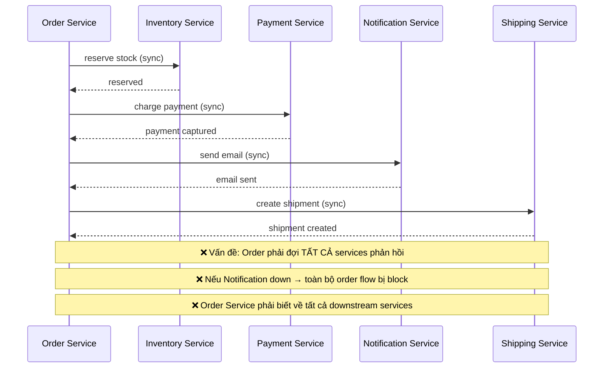
```mermaid
sequenceDiagram
    participant O as Order Service
    participant I as Inventory Service
    participant P as Payment Service
    participant N as Notification Service
    participant S as Shipping Service

    O->>I: reserve stock (sync)
    I-->>O: reserved
    O->>P: charge payment (sync)
    P-->>O: payment captured
    O->>N: send email (sync)
    N-->>O: email sent
    O->>S: create shipment (sync)
    S-->>O: shipment created

    Note over O,S: ❌ Vấn đề: Order phải đợi TẤT CẢ services phản hồi
    Note over O,S: ❌ Nếu Notification down → toàn bộ order flow bị block
    Note over O,S: ❌ Order Service phải biết về tất cả downstream services
```

**Giải pháp với EDA:**

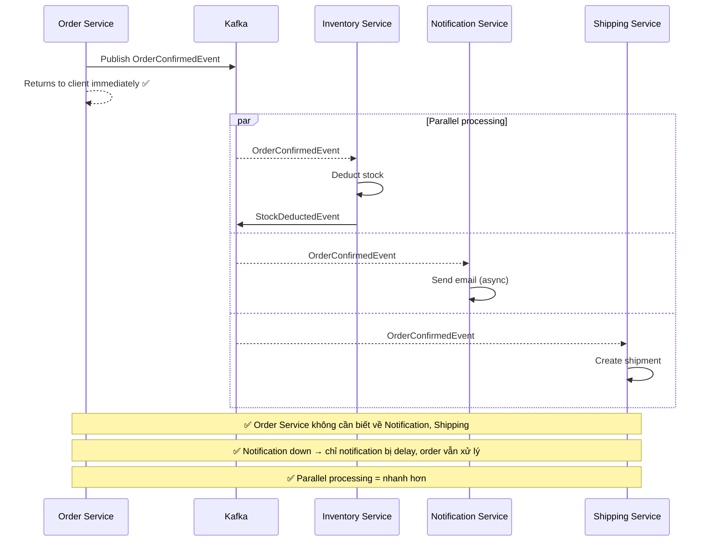
```mermaid
sequenceDiagram
    participant O as Order Service
    participant K as Kafka
    participant I as Inventory Service
    participant N as Notification Service
    participant S as Shipping Service

    O->>K: Publish OrderConfirmedEvent
    O-->>O: Returns to client immediately ✅

    par Parallel processing
        K-->>I: OrderConfirmedEvent
        I->>I: Deduct stock
        I->>K: StockDeductedEvent
    and
        K-->>N: OrderConfirmedEvent
        N->>N: Send email (async)
    and
        K-->>S: OrderConfirmedEvent
        S->>S: Create shipment
    end

    Note over O,S: ✅ Order Service không cần biết về Notification, Shipping
    Note over O,S: ✅ Notification down → chỉ notification bị delay, order vẫn xử lý
    Note over O,S: ✅ Parallel processing = nhanh hơn
```

### 6.3. Thành phần của EDA

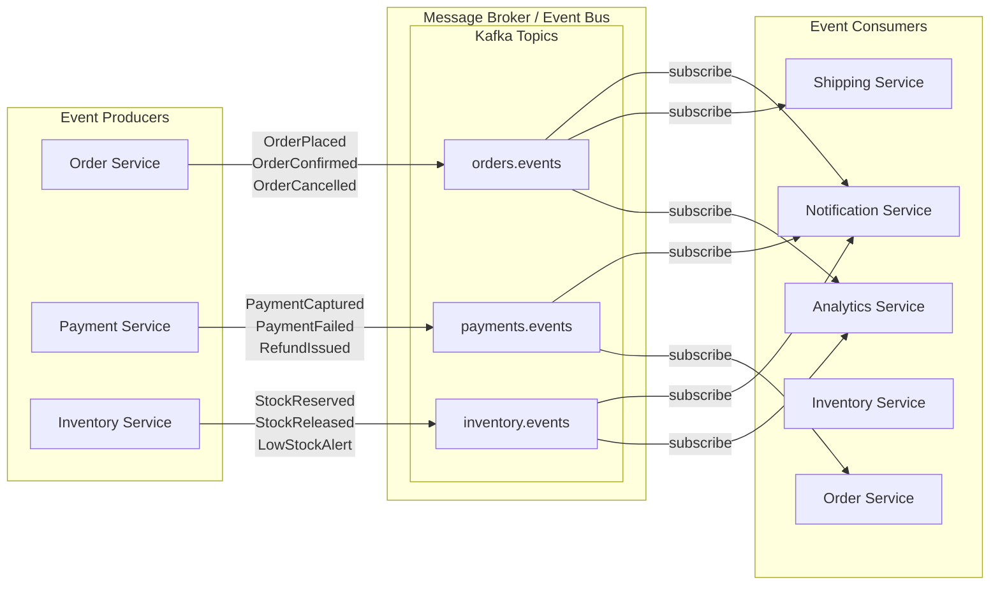
```mermaid
graph LR
    subgraph Producers["Event Producers"]
        P1[Order Service]
        P2[Payment Service]
        P3[Inventory Service]
    end

    subgraph Broker["Message Broker / Event Bus"]
        subgraph Topics["Kafka Topics"]
            T1[orders.events]
            T2[payments.events]
            T3[inventory.events]
        end
    end

    subgraph Consumers["Event Consumers"]
        C1[Notification Service]
        C2[Shipping Service]
        C3[Analytics Service]
        C4[Inventory Service]
        C5[Order Service]
    end

    P1 -->|"OrderPlaced\nOrderConfirmed\nOrderCancelled"| T1
    P2 -->|"PaymentCaptured\nPaymentFailed\nRefundIssued"| T2
    P3 -->|"StockReserved\nStockReleased\nLowStockAlert"| T3

    T1 -->|"subscribe"| C1
    T1 -->|"subscribe"| C2
    T1 -->|"subscribe"| C3
    T2 -->|"subscribe"| C1
    T2 -->|"subscribe"| C5
    T3 -->|"subscribe"| C1
    T3 -->|"subscribe"| C3
```

| Thành phần              | Vai trò                                     | Ví dụ                                      |
| ----------------------- | ------------------------------------------- | ------------------------------------------ |
| **Event Producer**      | Tạo ra và publish event khi có state change | Order Service publish `OrderPlaced`        |
| **Event Broker/Bus**    | Nhận, lưu trữ và phân phối events           | Apache Kafka, RabbitMQ, AWS EventBridge    |
| **Event Channel/Topic** | Kênh phân phối event theo loại              | `orders.events`, `payments.events`         |
| **Event Consumer**      | Subscribe và xử lý event                    | Notification Service consume `OrderPlaced` |

### 6.4. Hai topology của EDA

#### 6.4.1. Broker Topology (Choreography)

Không có điều phối trung tâm. Mỗi service tự biết mình cần react với event gì.

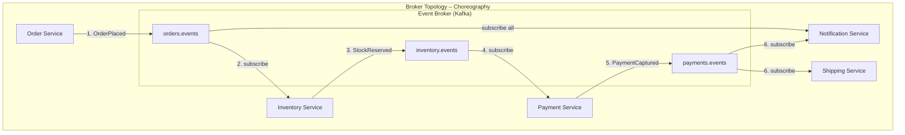
```mermaid
graph TB
    subgraph BrokerTopology["Broker Topology – Choreography"]
        subgraph Broker["Event Broker (Kafka)"]
            OTOPIC[orders.events]
            ITOPIC[inventory.events]
            PTOPIC[payments.events]
        end

        ORD[Order Service]
        INV[Inventory Service]
        PAY[Payment Service]
        NOTIF[Notification Service]
        SHIP[Shipping Service]

        ORD -->|"1. OrderPlaced"| OTOPIC
        OTOPIC -->|"2. subscribe"| INV
        INV -->|"3. StockReserved"| ITOPIC
        ITOPIC -->|"4. subscribe"| PAY
        PAY -->|"5. PaymentCaptured"| PTOPIC
        PTOPIC -->|"6. subscribe"| NOTIF
        PTOPIC -->|"6. subscribe"| SHIP
        OTOPIC -->|"subscribe all"| NOTIF
    end
```

**ShopFlow ví dụ – Đặt hàng với Choreography:**

```
1. Customer đặt hàng → Order Service publish "OrderPlaced"
2. Inventory Service consume "OrderPlaced" → reserve stock → publish "StockReserved"
3. Payment Service consume "StockReserved" → charge payment → publish "PaymentCaptured"
4. Order Service consume "PaymentCaptured" → update status CONFIRMED → publish "OrderConfirmed"
5. Notification Service consume "OrderConfirmed" → send email
6. Shipping Service consume "OrderConfirmed" → create shipment
```

#### 6.4.2. Mediator Topology (Orchestration)

Có một "nhạc trưởng" (Mediator/Orchestrator) điều phối toàn bộ flow.

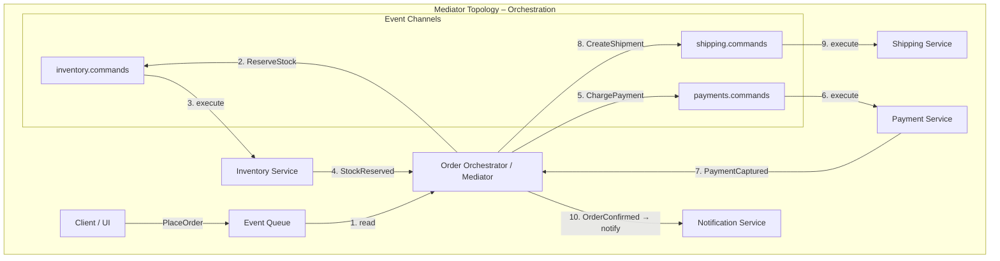
```mermaid
graph TB
    subgraph MediatorTopology["Mediator Topology – Orchestration"]
        CLIENT[Client / UI]
        QUEUE[Event Queue]
        MED[Order Orchestrator / Mediator]

        subgraph Channels["Event Channels"]
            IC[inventory.commands]
            PC[payments.commands]
            SC[shipping.commands]
        end

        INV[Inventory Service]
        PAY[Payment Service]
        SHIP[Shipping Service]
        NOTIF[Notification Service]

        CLIENT -->|"PlaceOrder"| QUEUE
        QUEUE -->|"1. read"| MED
        MED -->|"2. ReserveStock"| IC
        IC -->|"3. execute"| INV
        INV -->|"4. StockReserved"| MED
        MED -->|"5. ChargePayment"| PC
        PC -->|"6. execute"| PAY
        PAY -->|"7. PaymentCaptured"| MED
        MED -->|"8. CreateShipment"| SC
        SC -->|"9. execute"| SHIP
        MED -->|"10. OrderConfirmed → notify"| NOTIF
    end
```

**Mediator theo dõi trạng thái từng bước, handle timeout và compensation nếu thất bại.**

#### 6.4.3. So sánh Choreography vs Orchestration

| Tiêu chí             | Choreography (Broker)              | Orchestration (Mediator)                     |
| -------------------- | ---------------------------------- | -------------------------------------------- |
| **Điều phối**        | Phi tập trung                      | Tập trung (Orchestrator)                     |
| **Coupling**         | Thấp (services không biết về nhau) | Trung bình (services phụ thuộc orchestrator) |
| **Visibility**       | Khó trace toàn bộ flow             | Dễ trace (orchestrator có toàn cảnh)         |
| **Complexity**       | Logic phân tán khắp services       | Logic tập trung ở orchestrator               |
| **Failure handling** | Khó (ai biết state tổng thể?)      | Dễ (orchestrator quản lý state)              |
| **Điểm lỗi đơn**     | Không                              | Có (orchestrator là SPOF)                    |
| **Mở rộng**          | Dễ thêm consumer mới               | Phải sửa orchestrator                        |
| **Phù hợp**          | Simple flows, decoupled systems    | Complex workflows, cần control               |

### 6.5. Các EDA Patterns quan trọng

#### 6.5.1. Event Notification

Pattern đơn giản nhất: Service chỉ **thông báo** rằng điều gì đó đã xảy ra. Event chứa ít thông tin.

```java
// Event chỉ thông báo - receiver phải gọi thêm để lấy data
{
  "eventType": "order.placed",
  "orderId": "ord-123" // Chỉ ID, không có full data
}

// Consumer phải gọi thêm:
void onOrderPlaced(OrderPlacedEvent e) {
    Order order = orderService.getOrder(e.getOrderId()); // Extra call
    // process...
}
```

**Dùng khi:** Cần notify nhưng không muốn coupling vào data format. Consumer tự quyết định cần data gì.

#### 6.5.2. Event-Carried State Transfer (ECST)

Event **mang đầy đủ dữ liệu** cần thiết, consumer không cần gọi lại.

```java
// Event mang đầy đủ thông tin - consumer không cần gọi thêm
{
  "eventType": "order.placed",
  "orderId": "ord-123",
  "customerId": "usr-456",
  "customerEmail": "user@example.com",
  "items": [
    {"productId": "prod-001", "name": "iPhone 15", "quantity": 1, "price": 25000000}
  ],
  "totalAmount": 25000000,
  "shippingAddress": { ... }
}
```

**Dùng khi:** Consumer cần data ngay, không muốn extra round-trip. **Trade-off:** payload lớn hơn, data có thể cũ.

#### 6.5.3. CQRS – Command Query Responsibility Segregation

**Tách biệt hoàn toàn** model ghi (Command) và model đọc (Query).

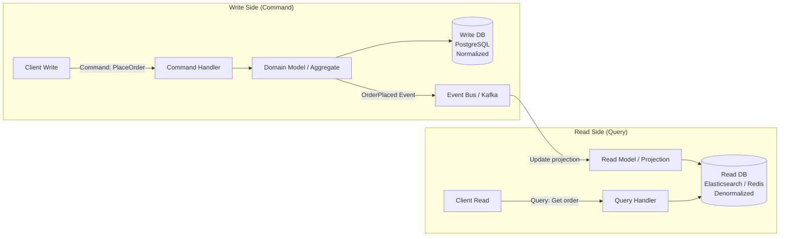
```mermaid
graph LR
    subgraph Write["Write Side (Command)"]
        UI_W[Client Write]
        CMD[Command Handler]
        DOM[Domain Model / Aggregate]
        WDB[(Write DB\nPostgreSQL\nNormalized)]
        EVBUS[Event Bus / Kafka]
    end

    subgraph Read["Read Side (Query)"]
        UI_R[Client Read]
        QRY[Query Handler]
        RM[Read Model / Projection]
        RDB[(Read DB\nElasticsearch / Redis\nDenormalized)]
    end

    UI_W -->|"Command: PlaceOrder"| CMD
    CMD --> DOM
    DOM --> WDB
    DOM -->|"OrderPlaced Event"| EVBUS
    EVBUS -->|"Update projection"| RM
    RM --> RDB
    UI_R -->|"Query: Get order"| QRY
    QRY --> RDB
```

**Vấn đề CQRS giải quyết cho ShopFlow:**

```
Vấn đề: "Order History" page cần dữ liệu từ Order, Product, Payment, Shipping
→ Với single model: phải JOIN 4 tables / gọi 4 services

Giải pháp CQRS:
Write: Order Service nhận PlaceOrder command → cập nhật Order DB riêng
Read: "OrderHistoryProjection" subscribe các events (OrderPlaced, PaymentCaptured, ShipmentCreated)
      → build denormalized view: {orderId, productNames, paymentStatus, trackingCode, ...}
      → lưu vào Redis/Elasticsearch
      → Query chỉ cần đọc 1 source, cực nhanh
```

**Khi nào dùng CQRS:**

- Read/Write ratio chênh lệch lớn (read >> write)
- Cần optimize read performance riêng biệt (search, reporting)
- Domain phức tạp, command và query logic khác nhau

**Khi nào KHÔNG dùng CQRS:**

- Simple CRUD application
- Team nhỏ, chi phí complexity cao hơn benefit
- Không cần eventual consistency

#### 6.5.4. Event Sourcing

Thay vì lưu **trạng thái hiện tại**, lưu **toàn bộ lịch sử events**. Trạng thái hiện tại được tính bằng cách replay events.

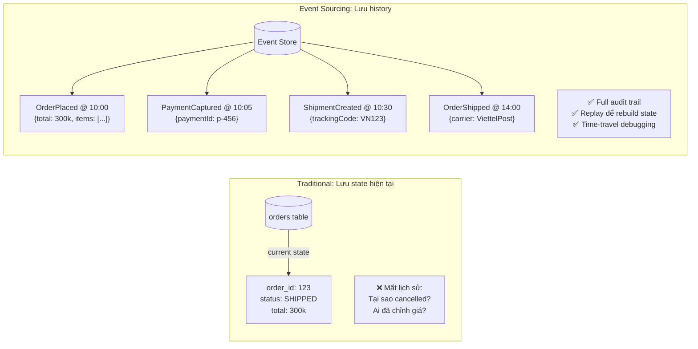
```mermaid
graph LR
    subgraph TraditionalDB["Traditional: Lưu state hiện tại"]
        direction TB
        TDB[(orders table)]
        TDB -->|"current state"| T1["order_id: 123\nstatus: SHIPPED\ntotal: 300k"]
        note1["❌ Mất lịch sử:\nTại sao cancelled?\nAi đã chỉnh giá?"]
    end

    subgraph EventStore["Event Sourcing: Lưu history"]
        direction TB
        ES[(Event Store)]
        ES --> E1["OrderPlaced @ 10:00\n{total: 300k, items: [...]}"]
        ES --> E2["PaymentCaptured @ 10:05\n{paymentId: p-456}"]
        ES --> E3["ShipmentCreated @ 10:30\n{trackingCode: VN123}"]
        ES --> E4["OrderShipped @ 14:00\n{carrier: ViettelPost}"]
        note2["✅ Full audit trail\n✅ Replay để rebuild state\n✅ Time-travel debugging"]
    end
```

**Rebuild current state từ events:**

```java
public Order rehydrate(List<DomainEvent> events) {
    Order order = new Order();
    for (DomainEvent event : events) {
        if (event instanceof OrderPlacedEvent e) order.apply(e);
        if (event instanceof PaymentCapturedEvent e) order.apply(e);
        if (event instanceof OrderShippedEvent e) order.apply(e);
    }
    return order;  // Current state
}
```

**Khi nào dùng Event Sourcing:**

- Cần audit trail đầy đủ (ngân hàng, y tế, e-commerce)
- Cần khả năng "time-travel" – xem state tại thời điểm bất kỳ
- Kết hợp với CQRS để build nhiều read models từ cùng event stream

**Khi nào KHÔNG dùng Event Sourcing:**

- Simple CRUD, không cần audit
- Team chưa có kinh nghiệm – rất tăng complexity
- Domain thay đổi schema events liên tục (schema evolution khó)

#### 6.5.5. Saga Pattern – Distributed Transactions

Khi một business operation span nhiều services và cần đảm bảo data consistency, không thể dùng ACID transaction. Saga giải quyết bằng cách chia thành **chuỗi local transactions**, mỗi bước có **compensating transaction** để rollback.

**ShopFlow: Đặt hàng Saga**

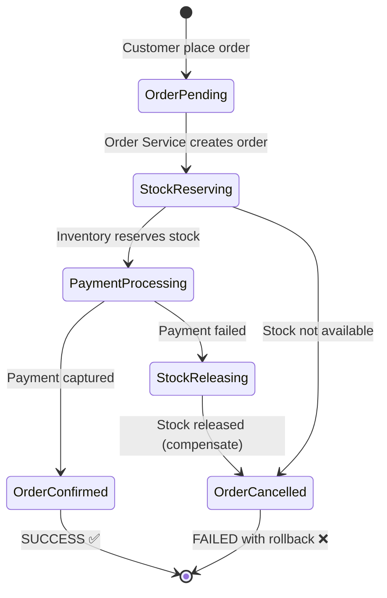
```mermaid
stateDiagram-v2
    [*] --> OrderPending: Customer place order

    OrderPending --> StockReserving: Order Service creates order
    StockReserving --> PaymentProcessing: Inventory reserves stock
    PaymentProcessing --> OrderConfirmed: Payment captured
    OrderConfirmed --> [*]: SUCCESS ✅

    StockReserving --> OrderCancelled: Stock not available
    PaymentProcessing --> StockReleasing: Payment failed
    StockReleasing --> OrderCancelled: Stock released (compensate)
    OrderCancelled --> [*]: FAILED with rollback ❌
```

**Choreography-based Saga (dùng events):**

```
Happy Path:
1. OrderService: Order(PENDING) → publish "OrderPlaced"
2. InventoryService: consume "OrderPlaced" → reserve stock → publish "StockReserved"
3. PaymentService: consume "StockReserved" → charge payment → publish "PaymentCaptured"
4. OrderService: consume "PaymentCaptured" → Order(CONFIRMED) → publish "OrderConfirmed"
5. ShippingService: consume "OrderConfirmed" → create shipment

Failure Path (Payment failed):
3. PaymentService: consume "StockReserved" → charge failed → publish "PaymentFailed"
4. InventoryService: consume "PaymentFailed" → release stock (COMPENSATE)
5. OrderService: consume "PaymentFailed" → Order(CANCELLED) → notify customer
```

**Orchestration-based Saga (dùng Orchestrator):**

```java
// Order Saga Orchestrator
public class PlaceOrderSaga {

    public void execute(OrderId orderId) {
        try {
            // Step 1: Reserve stock
            inventoryClient.reserve(orderId);

            // Step 2: Capture payment
            paymentClient.capture(orderId);

            // Step 3: Confirm order
            orderClient.confirm(orderId);

        } catch (PaymentFailedException e) {
            // Compensate: release stock
            inventoryClient.release(orderId);
            orderClient.cancel(orderId, "Payment failed");

        } catch (StockUnavailableException e) {
            orderClient.cancel(orderId, "Out of stock");
        }
    }
}
```

**So sánh Choreography vs Orchestration trong Saga:**

| Tiêu chí          | Choreography                   | Orchestration                   |
| ----------------- | ------------------------------ | ------------------------------- |
| **Phù hợp**       | Workflows tuyến tính, đơn giản | Workflows phức tạp, nhiều nhánh |
| **Debug**         | Khó (logic phân tán)           | Dễ (orchestrator có toàn cảnh)  |
| **Thêm step mới** | Dễ (thêm consumer)             | Phải sửa orchestrator           |
| **Ví dụ tools**   | Kafka, RabbitMQ                | Temporal, Cadence, Camunda      |

### 6.6. Xử lý vấn đề mất dữ liệu trong EDA

Trong hệ thống distributed, event có thể bị mất tại 3 điểm:

```
[Producer] → (1. Mất khi gửi vào broker) → [Broker] → (2. Mất khi gửi đến consumer) → [Consumer] → (3. Mất khi lưu vào DB)
```

**Giải pháp cho từng điểm:**

| Điểm mất          | Giải pháp                               | Cách hoạt động                                                                                |
| ----------------- | --------------------------------------- | --------------------------------------------------------------------------------------------- |
| Producer → Broker | **Synchronous Send** + Persisted queues | Broker lưu event vào disk, ack khi đã persist                                                 |
| Broker → Consumer | **Client Acknowledge Mode**             | Event không xóa khỏi queue cho đến khi consumer ack. Nếu consumer crash, event được redeliver |
| Consumer → DB     | **Last Participant Support (LPS)**      | Dùng ACID transaction: lưu DB và ack broker trong cùng một transaction                        |

**Outbox Pattern – Giải pháp toàn diện:**

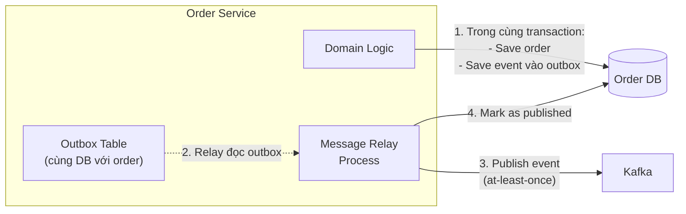
```mermaid
graph LR
    subgraph OrderService["Order Service"]
        DOM[Domain Logic]
        OUTBOX["Outbox Table\n(cùng DB với order)"]
        RELAY[Message Relay\nProcess]
    end

    ORD_DB[(Order DB)]
    KAFKA[Kafka]

    DOM -->|"1. Trong cùng transaction:\n- Save order\n- Save event vào outbox"| ORD_DB
    OUTBOX -.->|"2. Relay đọc outbox"| RELAY
    RELAY -->|"3. Publish event\n(at-least-once)"| KAFKA
    RELAY -->|"4. Mark as published"| ORD_DB
```

**Tại sao cần Outbox Pattern:**

```
Vấn đề: "Save order" thành công nhưng "Publish event to Kafka" thất bại
→ Order đã được tạo nhưng Inventory, Payment không biết

Giải pháp Outbox:
- Save order + save event vào outbox table TRONG CÙNG DB TRANSACTION
→ Nếu transaction fail: cả 2 cùng rollback (đảm bảo atomicity)
→ Nếu thành công: Relay sẽ đảm bảo event được publish (retry nếu Kafka down)
```

### 6.7. Idempotency – Xử lý duplicate events

Với at-least-once delivery, consumer có thể nhận cùng event nhiều lần. Consumer phải **idempotent** (xử lý nhiều lần = xử lý một lần).

```java
// ❌ NOT idempotent
void onPaymentCaptured(PaymentCapturedEvent e) {
    orderRepository.updateStatus(e.getOrderId(), PAID); // OK if called twice
    inventoryRepository.deductStock(e.getItems());      // ❌ Deducts TWICE if called twice!
}

// ✅ Idempotent với deduplication
void onPaymentCaptured(PaymentCapturedEvent e) {
    if (processedEventRepository.exists(e.getEventId())) {
        return; // Already processed, skip
    }

    // Process in transaction
    transaction.begin();
    inventoryRepository.deductStock(e.getItems());
    processedEventRepository.save(e.getEventId()); // Mark as processed
    transaction.commit();
}
```

### 6.8. Message Brokers – So sánh

| Tiêu chí           | Apache Kafka                             | RabbitMQ                      | AWS SQS/SNS           |
| ------------------ | ---------------------------------------- | ----------------------------- | --------------------- |
| **Model**          | Log-based, pull                          | Queue-based, push             | Queue/Topic, managed  |
| **Throughput**     | Cực cao (triệu/s)                        | Cao (100k/s)                  | Trung bình            |
| **Retention**      | Có (event store)                         | Không (sau khi consume)       | Có (SQS: 14 ngày)     |
| **Replay**         | ✅ Có thể replay                         | ❌ Không                      | ❌ Không              |
| **Ordering**       | ✅ Per partition                         | ✅ Per queue                  | ⚠️ SQS FIFO only      |
| **Ops complexity** | Cao (cluster, Zookeeper)                 | Trung bình                    | Thấp (managed)        |
| **Dùng khi**       | Event streaming, high throughput, replay | Task queues, routing phức tạp | AWS ecosystem, simple |

### 6.9. EDA trong ShopFlow: Flow thực tế

#### Flow 1: Customer đặt hàng (Choreography)

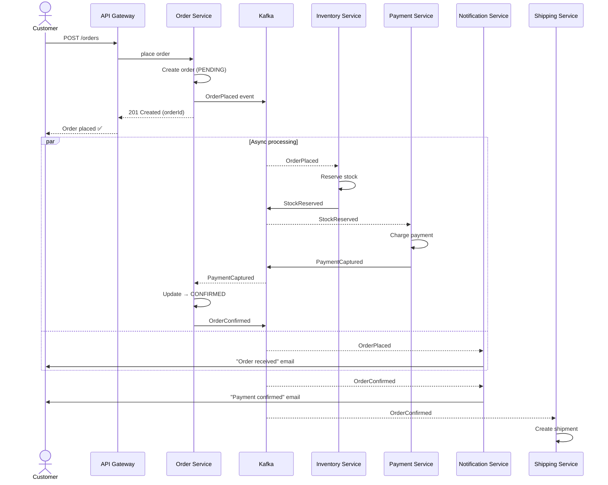
```mermaid
sequenceDiagram
    actor Customer
    participant API as API Gateway
    participant OrderSvc as Order Service
    participant Kafka as Kafka
    participant InvSvc as Inventory Service
    participant PaySvc as Payment Service
    participant NotifSvc as Notification Service
    participant ShipSvc as Shipping Service

    Customer->>API: POST /orders
    API->>OrderSvc: place order
    OrderSvc->>OrderSvc: Create order (PENDING)
    OrderSvc->>Kafka: OrderPlaced event
    OrderSvc-->>API: 201 Created (orderId)
    API-->>Customer: Order placed ✅

    par Async processing
        Kafka-->>InvSvc: OrderPlaced
        InvSvc->>InvSvc: Reserve stock
        InvSvc->>Kafka: StockReserved
        Kafka-->>PaySvc: StockReserved
        PaySvc->>PaySvc: Charge payment
        PaySvc->>Kafka: PaymentCaptured
        Kafka-->>OrderSvc: PaymentCaptured
        OrderSvc->>OrderSvc: Update → CONFIRMED
        OrderSvc->>Kafka: OrderConfirmed
    and
        Kafka-->>NotifSvc: OrderPlaced
        NotifSvc->>Customer: "Order received" email
    end

    Kafka-->>NotifSvc: OrderConfirmed
    NotifSvc->>Customer: "Payment confirmed" email
    Kafka-->>ShipSvc: OrderConfirmed
    ShipSvc->>ShipSvc: Create shipment
```

#### Flow 2: Payment thất bại (Saga Compensation)

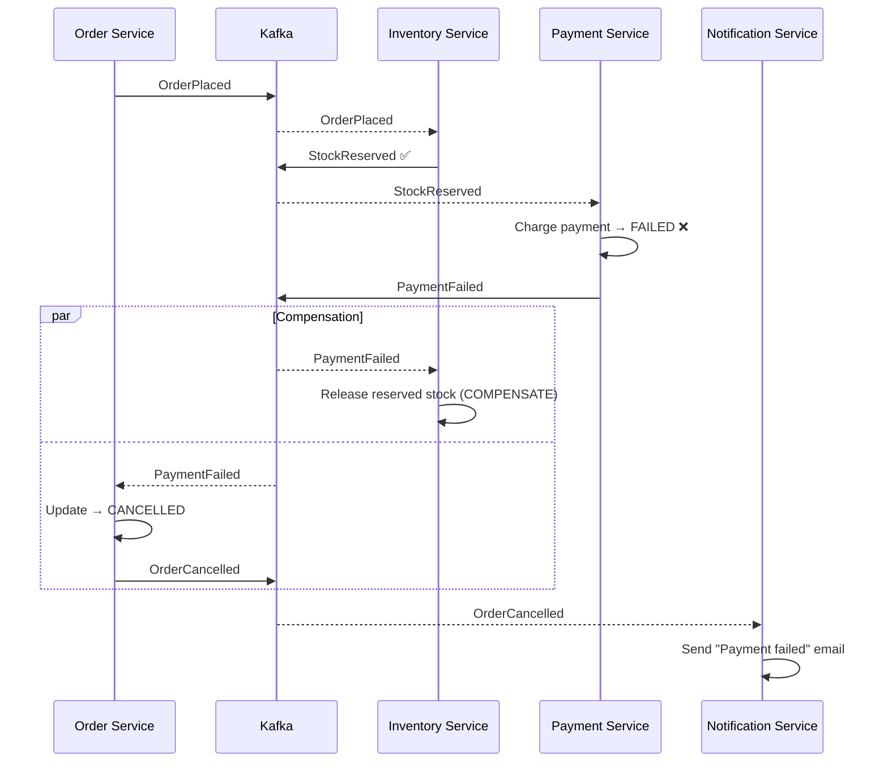
```mermaid
sequenceDiagram
    participant OrderSvc as Order Service
    participant Kafka as Kafka
    participant InvSvc as Inventory Service
    participant PaySvc as Payment Service
    participant NotifSvc as Notification Service

    OrderSvc->>Kafka: OrderPlaced
    Kafka-->>InvSvc: OrderPlaced
    InvSvc->>Kafka: StockReserved ✅
    Kafka-->>PaySvc: StockReserved
    PaySvc->>PaySvc: Charge payment → FAILED ❌
    PaySvc->>Kafka: PaymentFailed

    par Compensation
        Kafka-->>InvSvc: PaymentFailed
        InvSvc->>InvSvc: Release reserved stock (COMPENSATE)
    and
        Kafka-->>OrderSvc: PaymentFailed
        OrderSvc->>OrderSvc: Update → CANCELLED
        OrderSvc->>Kafka: OrderCancelled
    end

    Kafka-->>NotifSvc: OrderCancelled
    NotifSvc->>NotifSvc: Send "Payment failed" email
```

### 6.10. EDA kết hợp với các kiến trúc khác

| Kiến trúc            | Vai trò của EDA                                       | Ví dụ                                       |
| -------------------- | ----------------------------------------------------- | ------------------------------------------- |
| **Modular Monolith** | Internal event bus giảm coupling giữa modules         | Spring ApplicationEventPublisher            |
| **Microservices**    | Giao tiếp async giữa services, giảm temporal coupling | Kafka giữa Order và Inventory services      |
| **CQRS**             | Events là "glue" giữa Write side và Read side         | OrderPlaced → update OrderHistoryProjection |
| **Event Sourcing**   | Events là nguồn sự thật duy nhất                      | Event Store thay thế traditional DB         |

### 6.11. Ưu điểm của EDA

| Ưu điểm                  | Giải thích                                            |
| ------------------------ | ----------------------------------------------------- |
| **Loose coupling**       | Producer không biết consumer là ai, chỉ publish event |
| **Scalability**          | Consumer scale độc lập với producer                   |
| **Resilience**           | Consumer chậm / down không block producer             |
| **Real-time processing** | Phản ứng ngay khi event xảy ra                        |
| **Extensibility**        | Thêm consumer mới mà không sửa producer               |
| **Audit trail**          | Event log là lịch sử đầy đủ của hệ thống              |

### 6.12. Nhược điểm của EDA

| Nhược điểm                 | Giải thích                                                   |
| -------------------------- | ------------------------------------------------------------ |
| **Eventual consistency**   | Không có strong consistency giữa các services                |
| **Khó debug**              | Flow không tuyến tính, cần distributed tracing               |
| **Khó test**               | Asynchronous flows khó simulate end-to-end                   |
| **Độ trễ tiềm ẩn**         | Có thể có lag giữa publish và consume                        |
| **Schema evolution**       | Thay đổi event schema → phải maintain backward compatibility |
| **Duplicate events**       | At-least-once delivery → consumer phải idempotent            |
| **Operational complexity** | Cần quản lý Kafka cluster, monitoring consumer lag           |

### 6.13. Khi nào nên dùng EDA?

✅ **Nên dùng khi:**

- Nhiều services cần react đến cùng sự kiện (fan-out)
- Cần decoupling cao giữa producer và consumer
- Xử lý long-running processes (order fulfillment workflow)
- Cần audit trail, event history
- Real-time analytics, notification systems
- Cần scale consumer độc lập với producer

❌ **Không nên dùng khi:**

- Cần response ngay (check account balance khi chuyển tiền)
- Simple request-response, tight workflow
- Team chưa có kinh nghiệm distributed systems
- Business logic đơn giản, không cần async
- Cần strong consistency (không chấp nhận eventual consistency)

## 7. So sánh tổng hợp 3 kiến trúc

### 7.1. Bảng so sánh chi tiết

| Tiêu chí                      | Monolith                   | Modular Monolith              | Microservices          |
| ----------------------------- | -------------------------- | ----------------------------- | ---------------------- |
| **Đơn vị deploy**             | 1 unit toàn bộ             | 1 unit toàn bộ                | N units độc lập        |
| **Codebase**                  | 1 repo, không ranh giới    | 1 repo, module rõ ràng        | N repos riêng biệt     |
| **Database**                  | 1 DB dùng chung            | 1 DB, schema riêng            | N databases riêng      |
| **Giao tiếp**                 | In-process (function call) | In-process (qua facade/event) | Network (HTTP/gRPC/MQ) |
| **Scale**                     | Scale toàn bộ              | Scale toàn bộ                 | Scale từng service     |
| **Tech stack**                | Đồng nhất                  | Đồng nhất                     | Đa dạng                |
| **Team size**                 | 1-10 người                 | 5-20 người                    | 20+ người              |
| **Độ phức tạp vận hành**      | Thấp                       | Thấp                          | Cao                    |
| **Distributed tracing**       | Không cần                  | Không cần                     | Bắt buộc               |
| **Service discovery**         | Không cần                  | Không cần                     | Bắt buộc               |
| **CI/CD**                     | 1 pipeline                 | 1 pipeline                    | N pipelines            |
| **Transaction**               | ACID tự nhiên              | ACID (cross-module)           | Saga pattern           |
| **Debug**                     | Dễ                         | Dễ                            | Khó (distributed)      |
| **Fault isolation**           | Không                      | Một phần                      | Cao                    |
| **Time-to-market ban đầu**    | Nhanh nhất                 | Nhanh                         | Chậm                   |
| **Long-term maintainability** | Thấp                       | Trung bình                    | Cao (nếu làm đúng)     |
| **Cost (infra)**              | Thấp                       | Thấp                          | Cao                    |
| **Phù hợp**                   | MVP, startup               | Growth stage                  | Scale stage            |

### 7.2. Sơ đồ tiến hóa kiến trúc

```mermaid
graph LR
    subgraph Stage1["Stage 1: MVP (0-12 tháng)"]
        M[Monolith]
    end

    subgraph Stage2["Stage 2: Growth (6-24 tháng)"]
        MM[Modular Monolith]
    end

    subgraph Stage3["Stage 3: Scale (18+ tháng)"]
        MS[Microservices]
    end

    M -->|"Add module boundaries\nRefactor codebase"| MM
    MM -->|"Extract hot modules\n(Strangler Fig)"| MS

    M -.->|"❌ Skip: Thường sai lầm\n(distributed monolith)"| MS

    note1["Team: 3-5\nTraffic: Low\nFocus: Speed"]
    note2["Team: 10-20\nTraffic: Medium\nFocus: Structure"]
    note3["Team: 30+\nTraffic: High\nFocus: Scale & Deploy"]

    style Stage1 fill:#fff3cd,stroke:#ffc107
    style Stage2 fill:#d4edda,stroke:#28a745
    style Stage3 fill:#cce5ff,stroke:#004085
```

### 7.3. Vấn đề "Distributed Monolith" – Anti-pattern nguy hiểm nhất

```
Distributed Monolith xảy ra khi:
1. Team chia thành nhiều services (vật lý)
2. Nhưng services vẫn tight coupling:
   - Service A → Service B → Service C → Service A (circular)
   - Phải deploy tất cả cùng lúc (không độc lập)
   - Database sharing ẩn (direct SQL cross-service)
   - Shared code không có boundary rõ ràng

Kết quả: Worst of both worlds
❌ Phức tạp của Microservices (distributed, network calls)
❌ Tight coupling của Monolith (không thể deploy độc lập)
✅ Không có benefit nào

Phòng tránh:
→ Đảm bảo logical boundaries TRƯỚC khi physical split
→ Enforce database per service
→ Contract testing giữa services
→ Independent deployment là tiêu chí số 1
```

## 8. Hướng dẫn chọn kiến trúc

### 8.1. Decision Tree

```mermaid
graph TD
    START([Bắt đầu dự án mới?]) --> Q1

    Q1{Team size?}
    Q1 -->|"< 10 người"| Q2
    Q1 -->|"10-30 người"| Q3
    Q1 -->|"> 30 người"| Q4

    Q2{Domain boundaries\nrõ ràng chưa?}
    Q2 -->|"Chưa rõ / MVP"| MONOLITH[Monolith]
    Q2 -->|"Tương đối rõ"| MODULAR[Modular Monolith]

    Q3{Các phần cần\nscale khác nhau?}
    Q3 -->|"Không"| MODULAR
    Q3 -->|"Có, rõ rệt"| Q5

    Q4{DevOps maturity?}
    Q4 -->|"Thấp"| MODULAR
    Q4 -->|"Cao"| MICROSERVICES[Microservices]

    Q5{Có đủ DevOps\n& monitoring tools?}
    Q5 -->|"Chưa"| MODULAR
    Q5 -->|"Sẵn sàng"| MICROSERVICES

    MONOLITH --> NOTE1["✅ Nhanh, đơn giản\n⚠️ Plan refactor sớm"]
    MODULAR --> NOTE2["✅ Balance tốt\n✅ Dễ migrate sau"]
    MICROSERVICES --> NOTE3["✅ Scale tốt\n⚠️ Cần đầu tư infra nhiều"]

    style MONOLITH fill:#fff3cd
    style MODULAR fill:#d4edda
    style MICROSERVICES fill:#cce5ff
```

### 8.2. Tại sao Microservices không phải lúc nào cũng là lựa chọn tốt?

**Microservices có "distributed tax" phải trả:**

```
1. Latency tax:        Function call (ns) → Network call (ms) = 1,000,000x slower
2. Reliability tax:    P(system up) = P(service1) × P(service2) × ... × P(serviceN)
                       10 services × 99.9% each = 99% overall (thay vì 99.9%)
3. Operational tax:    N services × (deploy + monitor + alert + oncall)
4. Development tax:    Contract testing, service mocks, integration test environment
5. Data consistency tax: ACID → Eventual consistency → Saga pattern complexity
```

**"MonolithFirst" – Martin Fowler:**

> "Don't start with microservices. Start with a monolith, design it modularly, and split into services only when the monolith's deployment and scale become a bottleneck."

**Microservices phù hợp khi đã có:**

- [x] Đội DevOps/SRE chuyên nghiệp
- [x] Container orchestration (Kubernetes)
- [x] Service mesh (Istio/Linkerd)
- [x] Distributed tracing (Jaeger)
- [x] Centralized logging (ELK)
- [x] Contract testing (Pact)
- [x] Feature flags và canary deployment

## 9. Case Study: Netflix

### 9.1. Tổng quan và lịch sử

Netflix là một trong những case study điển hình nhất về hành trình từ Monolith đến Microservices. Phục vụ **300+ triệu subscribers** tại 190 quốc gia, xử lý hơn **15% global internet traffic**, và xử lý **2+ trillion events/ngày**.

**Timeline kiến trúc:**

```
2007: Monolith
      - Một ứng dụng Java lớn
      - DVD streaming bắt đầu
      - Database: Oracle

2008: Điểm ngoặt – Database corruption 3 ngày downtime
      - "Single point of failure phải được loại bỏ"
      - Quyết định migrate lên AWS và microservices

2009: Bắt đầu migration
      - Chuyển lên AWS cloud
      - Bắt đầu tách thành services nhỏ

2010-2015: 7 năm migration
      - Tách dần từng service
      - Phát triển tooling nội bộ: Eureka, Hystrix, Zuul, Ribbon
      - Open-source "Netflix OSS" stack

2016: Hoàn thành migration
      - 700+ microservices
      - 100% trên AWS
      - Phát triển Chaos Engineering (Chaos Monkey)

2020+: Maturity
      - Thousands of microservices
      - Custom container orchestration: Titus
      - 2+ trillion events/day qua Kafka
      - GraphQL Federation (DGS Framework)
```

### 9.2. Kiến trúc Tổng thể Netflix

```mermaid
graph TB
    subgraph Clients["Clients (500M+ devices)"]
        TV[Smart TV / TV OS]
        MOB[iOS / Android]
        WEB[Web Browser]
        GAME[Game Console]
    end

    subgraph Edge["Edge Layer"]
        DNS[DNS - Route 53\nGeo-routing]
        CDN[Open Connect CDN\n1000+ ISP locations\n8000+ OCAs]
        APIGW[API Gateway\nZuul 2.0\nAuth, Rate Limit, Routing]
    end

    subgraph ControlPlane["Control Plane (AWS)"]
        direction TB

        subgraph Discovery["Service Discovery"]
            EUREKA[Eureka\nService Registry]
        end

        subgraph CoreServices["Core Microservices"]
            direction LR
            AUTH_SVC[Auth Service\nIdentity]
            USER_SVC[User Service\nProfile, Preferences]
            REC_SVC[Recommendation\nML Engine]
            SEARCH_SVC[Search Service\nElastic]
            CATALOG_SVC[Catalog Service\nContent Metadata]
            STREAM_SVC[Streaming Service\nPlayback Control]
            BILLING_SVC[Billing Service]
            STUDIO_SVC[Studio / Production]
        end

        subgraph Resilience["Resilience Layer"]
            HYSTRIX[Hystrix\nCircuit Breaker]
            RIBBON[Ribbon\nClient-side Load Balancing]
        end

        subgraph Orchestration["Container Orchestration"]
            TITUS[Titus\nNetflix custom K8s-like]
        end
    end

    subgraph DataPlane["Data Plane (Open Connect)"]
        OCA[Open Connect Appliances\nEdge cache servers\nAt ISP locations]
    end

    subgraph DataLayer["Data & Streaming"]
        KAFKA[Kafka / Keystone\nEvent streaming pipeline\n2T events/day]
        CASSANDRA["Cassandra\nUser data, viewing history\n(Global, multi-region)"]
        MYSQL[MySQL\nBilling, Account]
        ES[Elasticsearch\nSearch index]
        REDIS[Redis / EVCache\nCaching layer]
        S3[S3\nContent storage\nEvent backup]
        ICEBERG[Apache Iceberg\nData lake]
    end

    subgraph Observability["Observability"]
        ATLAS[Atlas\nTime-series metrics]
        EDGAR[Edgar\nDistributed Tracing]
        MANTIS[Mantis\nReal-time streaming jobs]
    end

    subgraph Deployment["Deployment"]
        SPINNAKER["Spinnaker\nMulti-cloud CD platform\n(open-sourced by Netflix)"]
    end

    TV --> DNS
    MOB --> DNS
    WEB --> DNS
    GAME --> DNS

    DNS -->|"Metadata requests"| APIGW
    DNS -->|"Video streams"| CDN

    CDN --> OCA
    APIGW --> EUREKA
    EUREKA --> AUTH_SVC
    EUREKA --> USER_SVC
    EUREKA --> REC_SVC
    EUREKA --> CATALOG_SVC
    EUREKA --> STREAM_SVC

    STREAM_SVC -->|"Select nearest OCA"| OCA

    CoreServices -->|"Events"| KAFKA
    KAFKA --> MANTIS
    KAFKA --> ATLAS
    KAFKA --> S3
    KAFKA --> ICEBERG

    USER_SVC --> CASSANDRA
    BILLING_SVC --> MYSQL
    SEARCH_SVC --> ES
    CATALOG_SVC --> REDIS
    REC_SVC --> CASSANDRA

    SPINNAKER --> TITUS
    TITUS --> CoreServices

    style ControlPlane fill:#e8f4f8,stroke:#17a2b8
    style DataPlane fill:#d4edda,stroke:#28a745
    style DataLayer fill:#fff3cd,stroke:#ffc107
```

### 9.3. Phân tách Control Plane và Data Plane

```
CONTROL PLANE (AWS):
- Mọi tương tác trước khi xem video: browse, search, login, recommendations
- Chạy trên AWS → scalable, managed
- Low-latency API calls

DATA PLANE (Open Connect – Netflix CDN):
- Khi user click "Play" → video stream đến từ Open Connect
- 8,000+ Open Connect Appliances (OCAs) đặt tại ISP
- Video được pre-cached gần user → giảm latency, băng thông
- Mỗi OCA chứa 100TB+ content
- Netflix kiểm soát toàn bộ từ encoding đến delivery
```

### 9.4. EDA tại Netflix: Kafka và Keystone Pipeline

```mermaid
graph LR
    subgraph Producers["Event Producers"]
        PLAY[User plays video]
        PAUSE[User pauses]
        SEARCH[User searches]
        SIGNUP[User signs up]
        DEVICES[All devices\n~500M]
    end

    subgraph KeystoneV2["Keystone Pipeline (Kafka-based)"]
        FRONT_KAFKA[Fronting Kafka\nClusters\nEvent ingest layer]
        PROC_KAFKA[Processing Kafka\nClusters]
        FLINK[Apache Flink\n20,000+ jobs\n100M events/sec]
    end

    subgraph Sinks["Event Consumers / Sinks"]
        S3_SINK[S3 / HDFS\nBatch Analytics]
        ICEBERG_SINK[Apache Iceberg\nData Lake]
        ES_SINK[Elasticsearch\nSearch updates]
        CASS_SINK[Cassandra\nReal-time updates]
        ATLAS_SINK[Atlas Metrics]
        REC[Recommendation\nEngine ML update]
    end

    PLAY --> FRONT_KAFKA
    PAUSE --> FRONT_KAFKA
    SEARCH --> FRONT_KAFKA
    SIGNUP --> FRONT_KAFKA
    DEVICES --> FRONT_KAFKA

    FRONT_KAFKA --> PROC_KAFKA
    PROC_KAFKA --> FLINK
    FLINK --> S3_SINK
    FLINK --> ICEBERG_SINK
    FLINK --> ES_SINK
    FLINK --> CASS_SINK
    FLINK --> ATLAS_SINK
    FLINK --> REC
```

**Netflix Event Pipeline thực tế:**

- **Keystone Pipeline:** 2+ trillion events/day
- **Fronting Kafka clusters:** Chỉ nhận events, không xử lý (ingest layer)
- **Processing Kafka clusters:** Distribute events đến consumers
- **Apache Flink:** 20,000+ streaming jobs, xử lý 100M events/second
- **Streaming SQL:** 1,200 SQL processors được tạo trong năm đầu sau khi ra mắt, bởi non-infrastructure teams
- **Change Data Capture (CDC):** MySQL → Kafka → Elasticsearch (sync search index)

### 9.5. Netflix OSS – Tooling nội bộ trở thành industry standard

| Tool             | Chức năng                                      | Hiện tại                         |
| ---------------- | ---------------------------------------------- | -------------------------------- |
| **Zuul**         | API Gateway, routing, rate limiting            | Zuul 2.0 vẫn dùng                |
| **Eureka**       | Service discovery và registry                  | Industry standard                |
| **Hystrix**      | Circuit breaker                                | Deprecated, dùng Resilience4j    |
| **Ribbon**       | Client-side load balancing                     | Deprecated, dùng Spring Cloud LB |
| **Titus**        | Container orchestration (custom K8s)           | Vẫn dùng nội bộ                  |
| **Spinnaker**    | Multi-cloud CD platform                        | Open-sourced, dùng rộng rãi      |
| **Chaos Monkey** | Random service termination (Chaos Engineering) | Phần của Simian Army             |
| **Atlas**        | Time-series metrics platform                   | Dùng nội bộ                      |

### 9.6. Key Architectural Decisions và Lessons Learned

1. **Database per Service:**
   - Cassandra cho user data và viewing history (global, multi-region)
   - MySQL cho billing (ACID compliance)
   - Elasticsearch cho search
   - Redis/EVCache cho caching (giảm 95% tải lên origin DB)

2. **Chaos Engineering:**
   - "If it hurts, do it more often" – tự cố ý kill services random trong production
   - Build systems that expect failures → higher resilience

3. **7-Year Migration:**
   - Không rush từ monolith sang microservices
   - Tổ chức thay đổi song song với kỹ thuật

4. **GraphQL Federation (DGS):**
   - Clients (web, mobile, TV) có data shape khác nhau
   - DGS Framework: GraphQL federation + Spring Boot
   - Mỗi microservice expose GraphQL subgraph
   - Gateway aggregate thành unified API

## 10. Case Study: Uber (DOMA)

### 10.1. Tổng quan

Uber là case study đặc biệt vì họ không chỉ migrate lên microservices mà còn phải **thiết kế lại** kiến trúc microservices khi nó trở nên quá phức tạp. Kết quả là **Domain-Oriented Microservice Architecture (DOMA)** – bài học về việc "split quá nhiều cũng là vấn đề."

#### Timeline

```
2008: Thành lập
2009: Monolith đầu tiên
      - Ứng dụng Python đơn giản
      - Phục vụ một thành phố

2011-2014: Scaling Monolith
      - Node.js cho dispatch
      - Mở rộng quốc tế
      - Monolith bắt đầu "đau"

2014-2018: Explosion of Microservices
      - Tách thành hàng trăm microservices
      - Phát triển nhanh: mỗi team tự tạo service
      - 2,200+ microservices vào năm 2018

2018-2020: DOMA – Kiểm soát độ phức tạp
      - 60+ engineers làm việc 2 năm
      - Nhóm 2,200 services thành 75 domains
      - Publish DOMA paper (2020)

2020+: Mature DOMA
      - Layers, gateways, extensions
      - Kafka cho event streaming
      - Cadence cho workflow orchestration
```

### 10.2. Vấn đề với 2,200 Microservices

```
Triệu chứng của "Microservices Hell":
❌ Dependency hell: ServiceA → B → C → D → A (circular)
❌ Latency spike ở service thứ N làm cascade lên trên
❌ Để build 1 feature phải sửa 5-10 services của 5-10 teams khác nhau
❌ "Networked monolith": services phải deploy cùng nhau dù là separate services
❌ Không ai hiểu toàn bộ system flow
❌ Debug = nightmare (trace qua 15 services)
```

### 10.3. DOMA – Domain-Oriented Microservice Architecture

DOMA tổ chức 2,200 microservices thành **75 domains**, mỗi domain có **1 gateway** là entry point duy nhất.

```mermaid
graph TB
    subgraph DOMA["Uber DOMA Architecture"]
        subgraph AppLayer["Application Layer\n(User-facing products)"]
            RIDER[Rider App Domain\nGateway: rider-api]
            DRIVER[Driver App Domain\nGateway: driver-api]
            EATS[Uber Eats Domain\nGateway: eats-api]
            FREIGHT[Freight Domain\nGateway: freight-api]
        end

        subgraph ProductLayer["Product Layer\n(Business logic per product)"]
            RIDES[Rides Domain\nGateway: rides-core]
            DISPATCH[Dispatch Domain\nGateway: dispatch-core]
            PRICING[Dynamic Pricing Domain\nGateway: pricing-core]
            MAPS[Maps/Geo Domain\nGateway: maps-core]
        end

        subgraph BizLayer["Business Layer\n(Cross-product business logic)"]
            PAYMENTS[Payments Domain\nGateway: payments-biz]
            IDENTITY[Identity Domain\nGateway: identity-biz]
            SAFETY[Safety Domain\nGateway: safety-biz]
            NOTIF[Notifications Domain\nGateway: notifications-biz]
        end

        subgraph InfraLayer["Infrastructure Layer\n(Platform capabilities)"]
            STORAGE[Storage Domain\nDatabases, Caching]
            MESSAGING[Messaging Domain\nKafka, queues]
            OBSERV[Observability Domain\nTracing, Metrics, Logging]
            COMPUTE[Compute Domain\nContainer, Scheduling]
        end
    end

    RIDER -->|"via gateway only"| RIDES
    DRIVER -->|"via gateway only"| DISPATCH
    RIDES -->|"via gateway only"| PRICING
    RIDES -->|"via gateway only"| DISPATCH
    RIDES -->|"via gateway only"| MAPS
    PRICING -->|"via gateway only"| PAYMENTS
    DISPATCH -->|"via gateway only"| IDENTITY

    BizLayer -->|"via gateway only"| InfraLayer
    ProductLayer -->|"via gateway only"| BizLayer
    AppLayer -->|"via gateway only"| ProductLayer

    style AppLayer fill:#fff3cd,stroke:#ffc107
    style ProductLayer fill:#d4edda,stroke:#28a745
    style BizLayer fill:#cce5ff,stroke:#004085
    style InfraLayer fill:#f8d7da,stroke:#721c24
```

### 10.4. 4 Nguyên tắc cốt lõi của DOMA

#### Nguyên tắc 1: Domains (thay vì single services)

```
Trước DOMA:             Sau DOMA:
Service A               Domain: Dispatch
Service B       →       ├── dispatch-matching-service
Service C               ├── dispatch-geofence-service
Service D               ├── dispatch-supply-service
...                     └── GATEWAY: dispatch-core
                            (entry point duy nhất từ bên ngoài)
```

Mỗi domain chứa 1 đến hàng chục microservices. External code chỉ được gọi qua **domain gateway**. Internal services communicate trực tiếp trong domain.

#### Nguyên tắc 2: Layers (Dependency management at scale)

```
Layer dependencies (chỉ được phép gọi xuống, không gọi lên):

Application Layer  →  Product Layer  →  Business Layer  →  Infrastructure Layer

(NO circular dependencies between layers)
```

Mỗi domain thuộc về một layer. Layer xác định domain nào được phép gọi domain nào. Điều này giải quyết circular dependency và dependency hell.

#### Nguyên tắc 3: Gateways

```
External code → Domain Gateway → Internal services

Lợi ích:
1. Single entry point: Dễ apply cross-cutting concerns (auth, logging, rate limit)
2. API versioning: Gateway có thể maintain v1 và v2 API
3. Internal refactoring: Đổi internal services không break external consumers
4. Visibility: Tất cả traffic vào domain đi qua gateway → dễ monitor
```

#### Nguyên tắc 4: Extensions (Extensibility without modification)

```
Vấn đề: Uber có nhiều sản phẩm (Rides, Eats, Freight) cần customize hành vi của core services
Nếu mỗi product tự modify core service → core service phình to, nhiều conditional logic

Giải pháp Extensions:
- Core service định nghĩa extension points (interfaces/hooks)
- Product teams implement extensions, register vào core
- Core gọi extension khi cần → custom behavior mà không sửa core

Ví dụ: "Driver Go Online" flow:
Core: standard validation steps
Extension point: "pre-online checks"
Eats team: implement "check restaurant partner status" extension
Rides team: implement "check vehicle inspection status" extension
```

### 10.5. Kiến trúc kỹ thuật của Uber

```mermaid
graph TB
    subgraph ClientTier["Client Tier"]
        RIDER_APP[Rider App]
        DRIVER_APP[Driver App]
    end

    subgraph EdgeTier["Edge Tier"]
        LB[Load Balancer]
        API_GW[API Gateway\nRoute 53 + ELB]
    end

    subgraph ServiceTier["Service Tier (DOMA)"]
        direction LR

        subgraph RideDomain["Rides Domain"]
            RIDE_GW[rides-core\n<<Gateway>>]
            MATCH_SVC[Matching Service\nH3 geospatial indexing]
            PRICE_SVC[Dynamic Pricing\nML surge pricing]
            GEO_SVC[Geo Service\nH3 hexagonal grid]
        end

        subgraph DispatchDomain["Dispatch Domain"]
            DISP_GW[dispatch-core\n<<Gateway>>]
            ETA_SVC[ETA Service]
            SUPPLY_SVC[Supply Service\nDriver availability]
        end

        subgraph PaymentDomain["Payment Domain"]
            PAY_GW[payments-biz\n<<Gateway>>]
            BILLING_SVC[Billing Service]
            REFUND_SVC[Refund Service]
        end
    end

    subgraph DataTier["Data Tier"]
        KAFKA[Apache Kafka\n~1 Trillion events/day]
        CADENCE[Cadence\nWorkflow Orchestration]
        MYSQL_RDBMS[MySQL / TiDB\nTransactional data]
        CASSANDRA[Cassandra\nTime-series, geo data]
        REDIS[Redis\nCaching, sessions]
        SCHEMALESS[Schemaless\nUber's custom sharded MySQL]
    end

    subgraph Observability["Observability"]
        JAEGER[Jaeger\nDistributed Tracing]
        M3[M3\nTime-series metrics]
        KIBANA[Kibana / Elastic\nLog aggregation]
    end

    RIDER_APP --> API_GW
    DRIVER_APP --> API_GW
    API_GW --> RIDE_GW
    RIDE_GW --> MATCH_SVC
    RIDE_GW --> PRICE_SVC
    MATCH_SVC --> GEO_SVC
    MATCH_SVC --> DISP_GW
    MATCH_SVC --> Kafka

    KAFKA --> CADENCE
    CADENCE --> PAY_GW

    MATCH_SVC --> CASSANDRA
    PRICE_SVC --> REDIS
    PAY_GW --> MYSQL_RDBMS
    GEO_SVC --> REDIS
```

### 10.6. Kafka tại Uber

Uber xử lý **~1 trillion events/day** qua Kafka, được dùng cho:

- **Real-time location tracking:** Drivers gửi GPS updates mỗi 4 giây → Kafka → Dispatch Service
- **Surge pricing events:** Demand/supply changes → Kafka → Pricing Service
- **Trip lifecycle events:** TripStarted, TripCompleted → Kafka → Billing, Notification, Analytics
- **Fraud detection:** Payment events → Kafka → ML fraud detection (real-time)
- **Driver earnings:** Events → Kafka → Earnings calculation service

### 10.7. Cadence – Workflow Orchestration

Uber phát triển **Cadence** (open-source) để orchestrate long-running workflows:

```
Ví dụ: Trip Lifecycle Workflow

1. RideRequested → tạo workflow instance
2. Wait for DriverAssigned (timeout: 10 minutes)
3. If timeout: cancel request, refund preauth, notify rider
4. DriverAssigned → Wait for TripStarted
5. TripStarted → Wait for TripCompleted (timeout: 4 hours)
6. TripCompleted → Calculate fare → Charge payment
7. If payment fails: retry 3 times, then notify driver/rider
8. Payment success → Update driver earnings → Send receipts
```

Cadence đảm bảo workflow hoàn thành **dù có failures** (persist state, retry, timeout handling). Đây chính là Saga Orchestration ở scale của Uber.

### 10.8. H3 Geospatial Indexing

Uber custom-built **H3** – hexagonal hierarchical spatial index – để giải quyết bài toán:

```
Vấn đề: 1 triệu tài xế online, tìm tài xế gần nhất cho 100K riders đồng thời

Giải pháp H3:
- Chia bản đồ thế giới thành lưới hexagon ở nhiều resolution
- Resolution 9: hex ~0.1 km²  (tìm tài xế gần nhất)
- Resolution 7: hex ~5.1 km²  (surge pricing zone)
- Resolution 5: hex ~252 km²  (city-level analytics)

Location update: Driver ở hex "891f1d48177ffff" → Redis hash
Matching: Rider tại hex "891f1d48177ffff" → tìm tất cả drivers trong hex đó và neighboring hexes
→ O(1) lookup thay vì O(N) scan toàn bộ tài xế
```

### 10.9. Key Lessons từ Uber

1. **Chia quá nhiều services cũng là vấn đề:** 2,200 services → DOMA
2. **Logical boundaries quan trọng hơn physical boundaries:** Domain organization > service count
3. **Gateways là chìa khóa:** Mỗi domain có 1 public gateway → manage coupling
4. **Event-driven cho real-time:** Kafka cho location, pricing, events (~1T events/day)
5. **Workflow orchestration riêng biệt:** Cadence cho complex, long-running flows
6. **Custom tooling đôi khi cần thiết:** H3 (spatial indexing), Schemaless (sharded MySQL), Cadence (workflow)
7. **Organizational change song hành với technical change:** DOMA yêu cầu 60+ engineers trong 2 năm

## Tổng kết

### Bảng tóm tắt quyết định kiến trúc

| Câu hỏi                    | Monolith | Modular Monolith | Microservices |
| -------------------------- | -------- | ---------------- | ------------- |
| Team mới, domain chưa rõ?  | ✅       | ✅               | ❌            |
| Cần go-to-market nhanh?    | ✅       | ✅               | ❌            |
| Domain boundaries rõ?      | -        | ✅               | ✅ (required) |
| Cần scale một phần cụ thể? | ❌       | ⚠️               | ✅            |
| Có đủ DevOps maturity?     | ✅       | ✅               | Required      |
| Nhiều team song song (5+)? | ❌       | ⚠️               | ✅            |
| Budget infra hạn chế?      | ✅       | ✅               | ❌            |
| Cần technology diversity?  | ❌       | ❌               | ✅            |

### Nguyên tắc cuối cùng

> **"Make it work, make it right, make it fast – in that order."** — Kent Beck

Với kiến trúc: **Make it simple (Monolith), make it structured (Modular Monolith), make it distributed (Microservices) – chỉ khi thực sự cần thiết.**

Cả Netflix lẫn Uber đều dành **nhiều năm** để làm đúng việc này. Họ không bắt đầu với kiến trúc phức tạp – họ đến đó vì sự cần thiết thực sự. Đó là bài học quan trọng nhất.
