# Microservices Best Practices

## Mục lục

1. [API Design & Communication Patterns](#1-api-design--communication-patterns)
2. [API Gateway & Service Mesh](#2-api-gateway--service-mesh)
3. [Resilience Patterns](#3-resilience-patterns)
4. [Security Patterns](#4-security-patterns)
5. [Observability – Ba trụ cột](#5-observability--ba-trụ-cột)
6. [Data Management trong Microservices](#6-data-management-trong-microservices)
7. [Testing Strategy](#7-testing-strategy)
8. [CI/CD & Deployment Patterns](#8-cicd--deployment-patterns)
9. [Infrastructure & Container Orchestration](#9-infrastructure--container-orchestration)
10. [Anti-patterns cần tránh](#10-anti-patterns-cần-tránh)
11. [Checklist Production Readiness](#11-checklist-production-readiness)

## 1. API Design & Communication Patterns

### 1.1. Nguyên tắc thiết kế API

API là **contract** giữa service và consumer. Một khi đã publish, thay đổi API phải tuân theo nguyên tắc **backward compatibility** – consumer cũ không được break.

#### Semantic Versioning cho API

```
URL versioning (phổ biến nhất):
GET /api/v1/orders/{id}
GET /api/v2/orders/{id}   ← v2 có thêm field, không remove field của v1

Header versioning:
GET /api/orders/{id}
Accept: application/vnd.shopflow.v2+json

Query param (ít dùng):
GET /api/orders/{id}?version=2
```

**Quy tắc backward compatibility:**

```
✅ ALLOWED (non-breaking changes):
   - Thêm optional fields vào response
   - Thêm optional request parameters
   - Thêm new endpoints
   - Thêm new enum values (cẩn thận)

❌ BREAKING CHANGES (phải bump major version):
   - Xóa fields từ response
   - Rename fields
   - Đổi kiểu dữ liệu (string → int)
   - Thay đổi endpoint URL
   - Thay đổi required fields
```

#### REST API Design Best Practices

```
Resource naming (danh từ số nhiều):
✅ GET    /orders            → list orders
✅ POST   /orders            → create order
✅ GET    /orders/{id}       → get order by id
✅ PUT    /orders/{id}       → replace order
✅ PATCH  /orders/{id}       → partial update
✅ DELETE /orders/{id}       → delete order
✅ GET    /orders/{id}/items → nested resource

❌ AVOID:
   GET /getOrders
   POST /createOrder
   GET /orders/getById?id=123
```

**HTTP Status Codes – dùng đúng:**

| Code                        | Ý nghĩa                  | Khi dùng                              |
| --------------------------- | ------------------------ | ------------------------------------- |
| `200 OK`                    | Success                  | GET, PUT thành công                   |
| `201 Created`               | Resource created         | POST tạo resource mới                 |
| `204 No Content`            | Success, no body         | DELETE thành công                     |
| `400 Bad Request`           | Client error             | Validation failed                     |
| `401 Unauthorized`          | Not authenticated        | Missing/invalid token                 |
| `403 Forbidden`             | Not authorized           | Token valid nhưng không có quyền      |
| `404 Not Found`             | Resource không tồn tại   |                                       |
| `409 Conflict`              | State conflict           | Order đã confirmed, không cancel được |
| `422 Unprocessable Entity`  | Semantic validation fail | Business rule violation               |
| `429 Too Many Requests`     | Rate limit exceeded      |                                       |
| `500 Internal Server Error` | Server error             | Unexpected exception                  |
| `503 Service Unavailable`   | Service down             | Circuit open, maintenance             |

**Chuẩn hóa Error Response:**

```json
{
  "error": {
    "code": "ORDER_ALREADY_CONFIRMED",
    "message": "Cannot cancel an order that has already been confirmed",
    "details": [
      {
        "field": "orderId",
        "reason": "Order #ord-123 is in CONFIRMED status"
      }
    ],
    "traceId": "4bf92f3577b34da6",
    "timestamp": "2024-01-15T10:30:00Z",
    "path": "/api/v1/orders/ord-123/cancel"
  }
}
```

#### Pagination

**Cursor-based (recommended cho large datasets):**

```
GET /orders?after=cursor_abc123&limit=20
Response: {
  "data": [...],
  "pagination": {
    "nextCursor": "cursor_def456",
    "hasMore": true,
    "limit": 20
  }
}
```

**Offset-based (simple, nhưng có vấn đề khi data thay đổi):**

```
GET /orders?page=2&pageSize=20
Response: {
  "data": [...],
  "pagination": {
    "page": 2,
    "pageSize": 20,
    "total": 150,
    "totalPages": 8
  }
}
```

### 1.2. Synchronous vs Asynchronous Communication

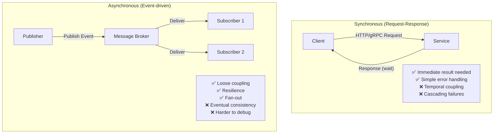

**Decision Matrix – Khi nào dùng gì:**

| Tình huống                             | Sync | Async | Lý do                               |
| -------------------------------------- | ---- | ----- | ----------------------------------- |
| Check tồn kho khi checkout             | ✅   | ❌    | Cần kết quả ngay để tiếp tục        |
| Gửi email xác nhận đơn hàng            | ❌   | ✅    | Không block order flow              |
| Cập nhật inventory sau thanh toán      | ❌   | ✅    | Eventual consistency chấp nhận được |
| Lấy giá sản phẩm                       | ✅   | ❌    | Blocking query                      |
| Analytics event tracking               | ❌   | ✅    | Fire-and-forget, no response needed |
| Cần nhiều services phản ứng cùng event | ❌   | ✅    | Fan-out pattern                     |
| Xác thực thanh toán với ngân hàng      | ✅   | ❌    | Cần kết quả xác nhận rõ ràng        |

### 1.3. gRPC vs REST

| Tiêu chí            | REST/HTTP                  | gRPC                                                                   |
| ------------------- | -------------------------- | ---------------------------------------------------------------------- |
| **Protocol**        | HTTP/1.1 hoặc HTTP/2       | HTTP/2                                                                 |
| **Data format**     | JSON (human-readable)      | Protobuf (binary, compact)                                             |
| **Performance**     | Tốt                        | Thường nhanh hơn nhờ Protobuf và HTTP/2                                |
| **Streaming**       | Hạn chế (SSE/WebSocket)    | ✅ Client, Server và Bidirectional Streaming                           |
| **Type safety**     | Cần OpenAPI/Swagger        | ✅ Schema `.proto`, sinh code tự động                                  |
| **Browser support** | ✅ Native                  | ❌ Cần gRPC-Web                                                        |
| **Debug**           | Dễ (curl, Postman)         | Khó hơn (binary, grpcurl...)                                           |
| **Use case**        | Public API, Web/Mobile API | Internal microservices, service-to-service, hệ thống cần hiệu năng cao |

**ShopFlow pattern:**

```
External (Client → API Gateway):  REST/JSON
                                  (human-readable, browser-friendly)

Internal (Service → Service):     gRPC (where latency matters)
                                  e.g., Dispatch → Pricing (high-frequency)
```

## 2. API Gateway & Service Mesh

### 2.1. API Gateway – North-South Traffic

API Gateway xử lý **traffic từ external clients vào cluster** (north-south).

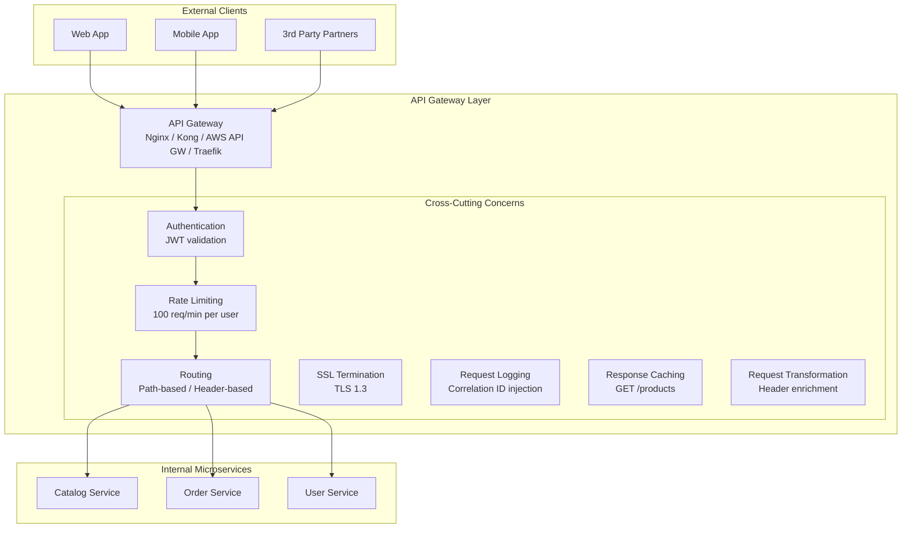

**Trách nhiệm của API Gateway:**

- ✅ Authentication (validate JWT token)
- ✅ Rate limiting / throttling
- ✅ SSL/TLS termination
- ✅ Request routing
- ✅ Inject Correlation ID (tracing)
- ✅ Request/Response transformation
- ✅ Response caching (GET requests)
- ✅ API versioning routing
- ❌ Business logic (không đặt business logic ở đây)
- ❌ Data aggregation (dùng BFF thay thế)

**Phổ biến tools:**

| Tool                | Phù hợp                 | Đặc điểm                     |
| ------------------- | ----------------------- | ---------------------------- |
| **Kong**            | Enterprise, self-hosted | Plugin ecosystem phong phú   |
| **AWS API Gateway** | AWS-native              | Fully managed, serverless    |
| **Nginx + Lua**     | Performance-critical    | Low-level control            |
| **Traefik**         | Kubernetes-native       | Auto-discovery từ K8s labels |
| **Envoy**           | Service mesh foundation | High-performance, Lyft/Istio |

### 2.2. BFF – Backends for Frontends

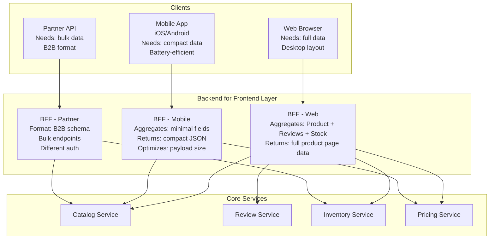

**Khi nào dùng BFF:**

- Nhiều loại client (web, mobile, TV) cần data shape khác nhau
- Cần API aggregation (tổng hợp nhiều services thành 1 response)
- Muốn tối ưu payload size cho mobile (giảm bandwidth)

**GraphQL như một dạng BFF thống nhất:**

```graphql
# Client tự định nghĩa data shape → không cần nhiều BFF endpoints
query ProductPage($productId: ID!) {
  product(id: $productId) {
    id
    name
    price
    # Mobile chỉ lấy 3 fields này ↑
    description # Web cũng lấy thêm
    images {
      url
    } # Web cũng lấy thêm
    reviews(first: 5) {
      # Web cũng lấy thêm
      rating
      comment
    }
    stock {
      available
    } # Cả 2 đều lấy
  }
}
```

### 2.3. Service Mesh – East-West Traffic

Service Mesh quản lý **traffic giữa các services trong cluster** (east-west). Dùng **sidecar proxy** (Envoy) đặt cạnh mỗi service pod.

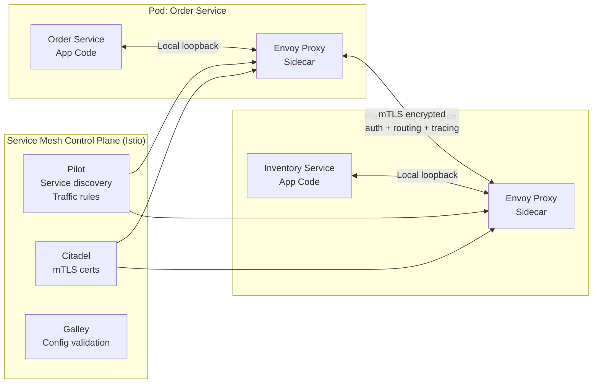

**Service Mesh cung cấp (không cần sửa app code):**

| Capability             | Giải thích                                                  |
| ---------------------- | ----------------------------------------------------------- |
| **mTLS**               | Mã hóa và authenticate tất cả inter-service traffic tự động |
| **Traffic management** | Canary, A/B testing, traffic splitting, retries             |
| **Observability**      | Distributed traces, metrics, access logs tự động            |
| **Circuit breaking**   | Automatic failure detection và isolation                    |
| **Service discovery**  | Automatic load balancing                                    |

**API Gateway vs Service Mesh – Không thay thế nhau:**

```
API Gateway = Border control (North-South)
              External traffic vào cluster

Service Mesh = Internal police (East-West)
               Traffic giữa services

Dùng cả hai:
External Client → API Gateway → [Service Mesh] → Services
```

## 3. Resilience Patterns

Trong hệ thống distributed, **failure là điều chắc chắn xảy ra** – không phải "nếu" mà là "khi nào". Resilience patterns giúp hệ thống tiếp tục hoạt động (dù bị degraded) khi có component failures.

### 3.1. Circuit Breaker

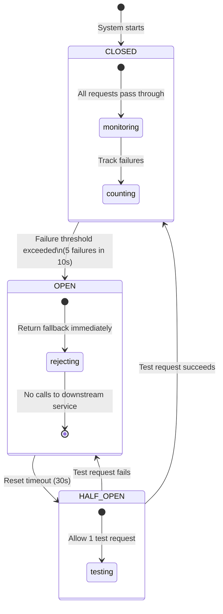

**ShopFlow: Order Service gọi Payment Service:**

```java
// Resilience4j CircuitBreaker config
CircuitBreakerConfig config = CircuitBreakerConfig.custom()
    .failureRateThreshold(50)           // Open khi 50% requests fail
    .waitDurationInOpenState(Duration.ofSeconds(30))   // Thời gian OPEN trước khi thử lại
    .slidingWindowSize(10)              // Track 10 requests gần nhất
    .minimumNumberOfCalls(5)            // Cần ít nhất 5 calls để tính %
    .permittedNumberOfCallsInHalfOpenState(3)  // 3 test calls khi HALF_OPEN
    .build();

// Usage
@CircuitBreaker(name = "payment-service", fallbackMethod = "paymentFallback")
public PaymentResult chargePayment(PaymentRequest request) {
    return paymentServiceClient.charge(request);
}

// Fallback khi circuit OPEN
public PaymentResult paymentFallback(PaymentRequest request, Exception ex) {
    // Option 1: Queue for retry (async)
    pendingPaymentQueue.enqueue(request);
    return PaymentResult.pending("Payment queued for processing");

    // Option 2: Return cached/default result
    // Option 3: Fail fast với meaningful error message
}
```

### 3.2. Retry Pattern với Exponential Backoff

```
Retry naively (sai):
Attempt 1: FAIL → retry immediately
Attempt 2: FAIL → retry immediately  ← Gây "thundering herd" khi nhiều services cùng retry
Attempt 3: FAIL → retry immediately

Retry với Exponential Backoff + Jitter (đúng):
Attempt 1 at t=0:    FAIL
Attempt 2 at t=1s:   FAIL   (base delay = 1s)
Attempt 3 at t=3s:   FAIL   (2^1 × 1s + jitter = ~2-4s)
Attempt 4 at t=7s:   FAIL   (2^2 × 1s + jitter = ~3-8s)
Attempt 5 at t=15s:  SUCCESS (2^3 × 1s + jitter = ~6-16s)
```

```java
RetryConfig config = RetryConfig.custom()
    .maxAttempts(3)
    .waitDuration(Duration.ofMillis(1000))
    .intervalFunction(IntervalFunction.ofExponentialRandomBackoff(
        1000,   // initial interval (ms)
        2.0,    // multiplier
        0.5     // randomization factor (jitter)
    ))
    // Chỉ retry những exception có thể recover
    .retryOnException(e -> e instanceof ConnectTimeoutException
                       || e instanceof ServiceUnavailableException)
    // KHÔNG retry nếu là business error
    .ignoreExceptions(OrderNotFoundException.class, ValidationException.class)
    .build();
```

**Quy tắc retry:**

- ✅ **Retry:** Network timeout, 503 Service Unavailable, 429 Rate Limited
- ❌ **Không retry:** 400 Bad Request, 401 Unauthorized, 404 Not Found, 409 Conflict

### 3.3. Bulkhead Pattern

Cô lập resources, tránh cascade failure:

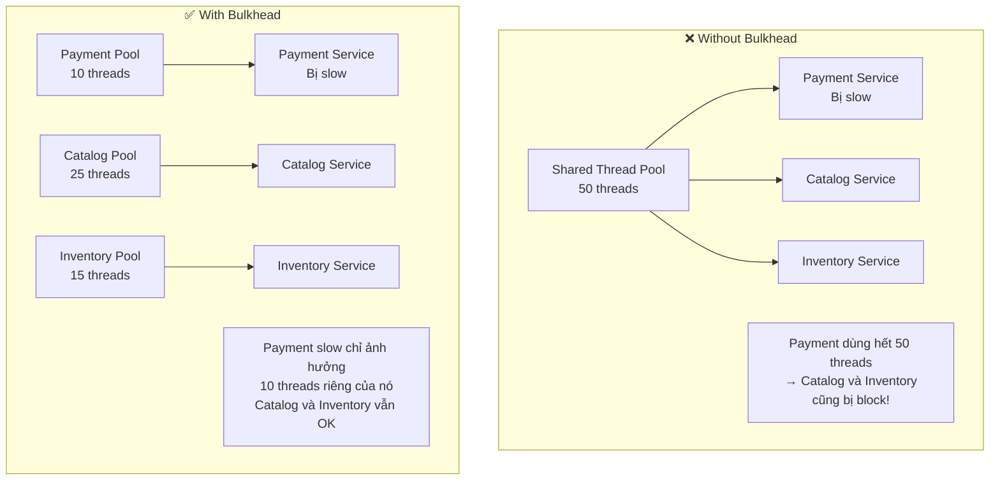

### 3.4. Timeout

**Mọi external call PHẢI có timeout.** Không có timeout = một service slow có thể làm cạn thread pool của toàn bộ caller.

```java
// ❌ SAI: Không có timeout
HttpResponse response = httpClient.get("/payment/charge");

// ✅ ĐÚNG: Timeout cụ thể ở mỗi level
RestTemplate restTemplate = new RestTemplate();
restTemplate.setRequestFactory(new SimpleClientHttpRequestFactory() {{
    setConnectTimeout(2000);    // Connection timeout: 2s (mạng chậm / service down)
    setReadTimeout(5000);       // Read timeout: 5s (service xử lý chậm)
}});
```

Timeout hierarchy (outer timeout > sum of inner timeouts):

```
API Gateway timeout:     10s
└── Order Service:        8s
    │── Inventory call:   3s (retry 1x = 6s max)
    │── Payment call:     4s
    └── Timeout budget:   2s remaining
```

### 3.5. Rate Limiting

```
Rate Limiting tại API Gateway:
- Per IP: 100 requests/minute (anonymous users)
- Per User: 1000 requests/minute (authenticated)
- Per Partner API Key: 10,000 requests/minute
- Per Endpoint: POST /orders: 50/minute (prevent order flooding)

Algorithms:
- Token Bucket:  Cho phép burst, phổ biến (AWS API Gateway, Kong)
- Sliding Window: Chính xác hơn, không cho burst
- Fixed Window:   Đơn giản nhất, có vấn đề ở boundary

Response khi bị rate limit:
- HTTP 429 Too Many Requests
- Retry-After: 60
- X-RateLimit-Limit: 100
- X-RateLimit-Remaining: 0
- X-RateLimit-Reset: 1705316400
```

### 3.6. Graceful Degradation & Fallback

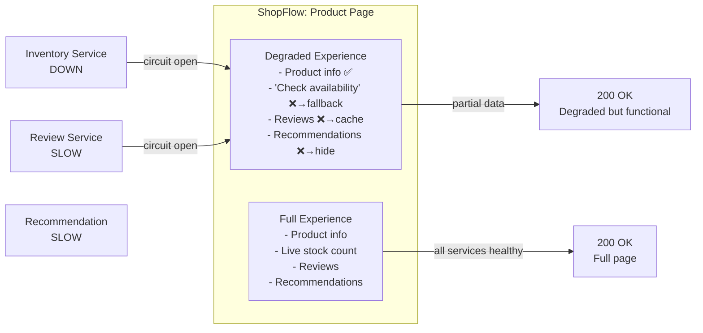

**Chiến lược Fallback:**

| Service                     | Fallback Strategy                                            |
| --------------------------- | ------------------------------------------------------------ |
| Inventory Service down      | Show "Check availability" button, không show số lượng cụ thể |
| Recommendation Service down | Show bestsellers (pre-computed, cached)                      |
| Review Service timeout      | Show cached reviews từ Redis (có thể stale 1 giờ)            |
| Payment Service down        | Queue request, retry sau; hiển thị "Processing..."           |
| Search Service down         | Fallback về basic SQL search (chậm hơn nhưng vẫn hoạt động)  |

## 4. Security Patterns

### 4.1. Authentication & Authorization Flow

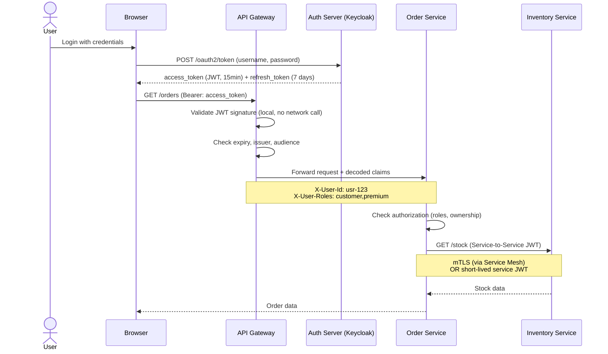

### 4.2. JWT Structure & Best Practices

```json
// JWT Header
{
  "alg": "RS256",     // Asymmetric: private key sign, public key verify
  "typ": "JWT",
  "kid": "key-2024"   // Key ID (for key rotation)
}

// JWT Payload (Claims)
{
  "sub": "usr-123",              // Subject: User ID
  "iss": "https://auth.shopflow.com",  // Issuer
  "aud": ["shopflow-api"],       // Audience: chỉ cho shopflow-api
  "exp": 1705316400,             // Expiry: 15 minutes
  "iat": 1705315500,             // Issued at
  "jti": "token-uuid-abc",       // JWT ID (prevent replay attacks)
  "roles": ["customer", "premium"],
  "email": "user@example.com"
  // ❌ KHÔNG đặt: password, credit card, sensitive PII
}
```

**JWT Best Practices:**

```
Access Token:
  - Short-lived: 15 phút (không thể revoke trực tiếp)
  - Signed bằng RS256 (asymmetric): private key ở Auth Server, public key ở mọi service → verify locally không cần gọi Auth Server

Refresh Token:
  - Long-lived: 7-30 ngày
  - Stored securely (httpOnly cookie, không localStorage)
  - Có thể revoke trong DB
  - Rotate khi dùng (refresh token rotation)

Token Revocation:
  - Short TTL giảm exposure window
  - Blacklist trong Redis cho critical cases (logout, compromise)
  - Check blacklist tại API Gateway
```

### 4.3. Service-to-Service Authentication

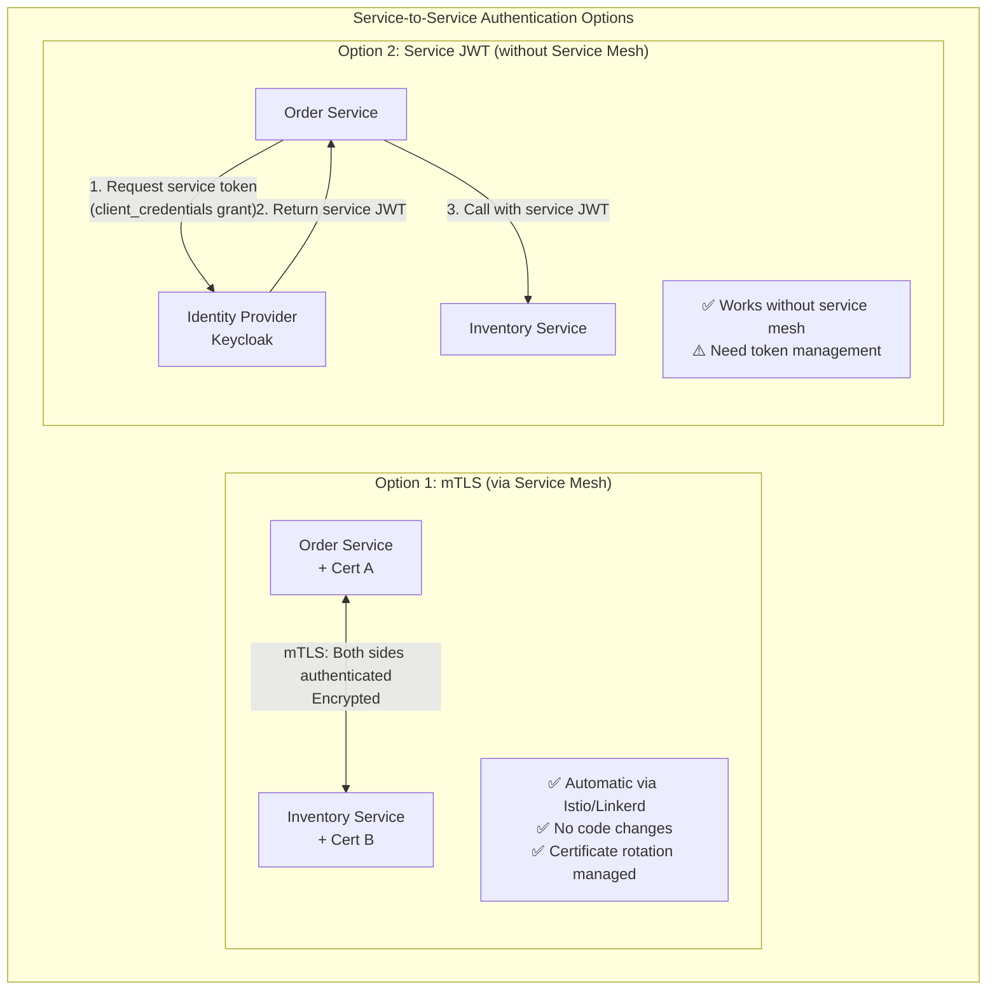

### 4.4. Authorization Patterns

```
Authorization Levels:

Level 1 - API Gateway (Coarse-grained):
  - Is user authenticated? (valid JWT)
  - Is user allowed to access this endpoint? (role-based)
  - Rate limiting per user/role

Level 2 - Service Level (Fine-grained):
  - Order Service: Can user #123 access order #456? → Check if order.customerId == userId
  - Admin API: user must have 'admin' role
  - Premium features: user must have 'premium' subscription

Level 3 - Data Level (Row-level security):
  - User can only see their own orders
  - Seller can only see orders for their products
```

**RBAC vs ABAC:**

```java
// RBAC - Role-Based Access Control
// Simple: user có role → được làm gì
@PreAuthorize("hasRole('ADMIN')")
public void deleteProduct(String productId) { ... }

// ABAC - Attribute-Based Access Control
// Complex: decision dựa trên nhiều attributes (user, resource, environment)
public boolean canAccessOrder(User user, Order order, Context ctx) {
    return user.getId().equals(order.getCustomerId())      // Ownership
        || user.hasRole("ADMIN")                           // Admin override
        || (user.hasRole("SUPPORT") && !ctx.isWeekend());  // Support weekdays only
}
```

### 4.5. Secret Management

```
❌ NEVER:
- Hardcode secrets trong code
- Commit secrets vào Git (kể cả private repo)
- Store secrets trong environment variables plain text
- Đặt secrets trong Docker image

✅ CORRECT:
- HashiCorp Vault: enterprise secret management
- AWS Secrets Manager / Parameter Store
- Kubernetes Secrets (encrypted at rest)
- External Secrets Operator (sync từ Vault/AWS vào K8s)

Flow:
1. Secret lưu trong Vault
2. Service startup → authenticate với Vault (via K8s ServiceAccount)
3. Vault trả về secret → inject vào environment (không persist)
4. Secret rotation: Vault rotate → service tự renew (lease)
```

### 4.6. Defense in Depth

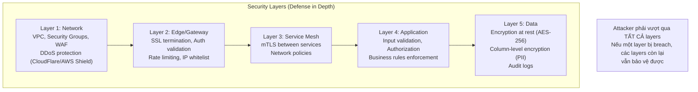

## 5. Observability – Ba trụ cột

> "You can't manage what you can't measure."

Observability là khả năng **hiểu trạng thái bên trong hệ thống** chỉ từ các outputs bên ngoài. Trong microservices, một request có thể đi qua 10+ services – không có observability, debug gần như bất khả thi.

```
Monitoring = Biết HỆ THỐNG đang làm gì (pre-defined dashboards)
Observability = Hiểu TẠI SAO hệ thống hoạt động như vậy (answer any question)
```

### 5.1. Pillar 1: Logging

**Structured Logging (JSON format):**

```json
// ❌ Plain text logs: không thể query hiệu quả
"2024-01-15 10:30:45 ERROR Payment failed for order 123"

// ✅ Structured JSON logs: queryable, filterable
{
  "timestamp": "2024-01-15T10:30:45.123Z",
  "level": "ERROR",
  "service": "payment-service",
  "version": "2.3.1",
  "environment": "production",
  "traceId": "4bf92f3577b34da6", // Distributed tracing correlation
  "spanId": "00f067aa0ba902b7",
  "userId": "usr-456",
  "orderId": "ord-123",
  "event": "payment.charge.failed",
  "message": "Payment charge failed: insufficient funds",
  "error": {
    "type": "PaymentDeclinedException",
    "code": "INSUFFICIENT_FUNDS",
    "provider": "stripe",
    "providerCode": "card_declined"
  },
  "duration_ms": 342,
  "httpStatus": 402
}
```

**Log Levels – dùng đúng:**

| Level   | Khi nào dùng                  | Ví dụ                                    |
| ------- | ----------------------------- | ---------------------------------------- |
| `TRACE` | Extremely detailed (dev only) | SQL query, method entry/exit             |
| `DEBUG` | Detailed debugging info       | Request payload, variable values         |
| `INFO`  | Normal business events        | Order placed, payment processed          |
| `WARN`  | Unexpected but recoverable    | Retry attempt, cache miss, slow query    |
| `ERROR` | Errors requiring attention    | Payment failed, DB connection lost       |
| `FATAL` | Application cannot continue   | Startup failure, critical config missing |

```
Production log level: INFO (DEBUG quá nhiều → performance impact, cost)
Temporary debug: Set DEBUG cho specific service qua config server, auto-revert sau 30 phút
```

**Centralized Logging Stack:**

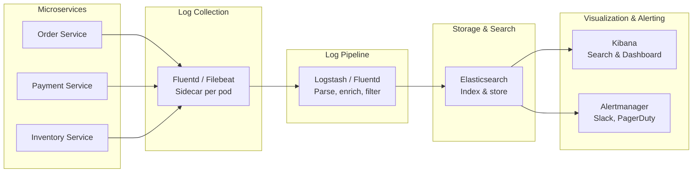

**Loki (thay thế nhẹ hơn ELK):**

```
Loki + Promtail + Grafana
- Không index log content (chỉ index labels) → rẻ hơn nhiều
- Labels: {service="order", env="prod", level="error"}
- Query: {service="order", level="error"} |= "payment"
- Phù hợp: teams ít budget, muốn Grafana unified
```

### 5.2. Pillar 2: Metrics

Metrics là **numerical measurements** theo thời gian. Dùng để detect vấn đề, set SLA, capacity planning.

**The Four Golden Signals (Google SRE Book):**

```
1. LATENCY    – Thời gian xử lý request
               P50, P95, P99 (không chỉ average!)
               p99 latency = 99% requests xử lý trong X ms

2. TRAFFIC    – Demand trên hệ thống
               Requests per second (RPS), messages/second

3. ERRORS     – Rate of failed requests
               HTTP 5xx rate, exception rate

4. SATURATION – Mức độ "đầy" của hệ thống
               CPU %, Memory %, Queue depth, Thread pool utilization
```

**RED Method (cho request-based services):**

```
Rate     – Requests per second
Errors   – Error rate
Duration – Latency distribution
```

**USE Method (cho infrastructure/resources):**

```
Utilization – % thời gian resource đang busy
Saturation  – Queue depth, pending work
Errors      – Error count
```

**Prometheus + Grafana Stack:**

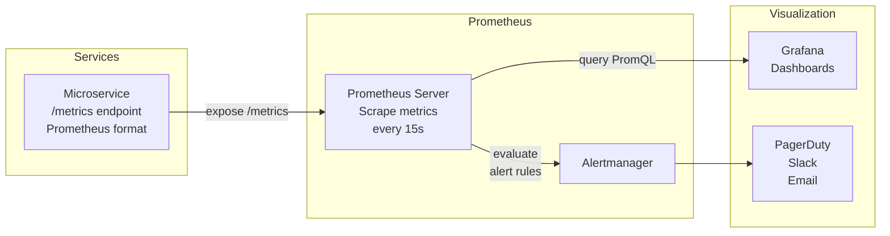

**Custom Metrics cho ShopFlow:**

```java
// Micrometer (Spring Boot) – auto-exports to Prometheus
@Component
public class OrderMetrics {
    private final Counter ordersPlaced;
    private final Counter ordersFailed;
    private final Timer checkoutDuration;
    private final Gauge pendingOrders;

    public OrderMetrics(MeterRegistry registry) {
        ordersPlaced = Counter.builder("orders.placed.total")
            .tag("payment_method", "card")
            .description("Total orders placed")
            .register(registry);

        checkoutDuration = Timer.builder("order.checkout.duration")
            .description("Checkout process duration")
            .register(registry);
    }

    public void recordOrderPlaced(String paymentMethod) {
        ordersPlaced.increment();
    }

    public void recordCheckoutDuration(Duration duration) {
        checkoutDuration.record(duration);
    }
}
```

**SLI / SLO / SLA:**

```
SLI (Service Level Indicator): Metric đo lường thực tế
  - "Order Service p99 latency = 245ms"
  - "Error rate = 0.01%"

SLO (Service Level Objective): Target mình đặt ra
  - "p99 latency < 500ms"
  - "Error rate < 0.1%"
  - "Availability > 99.9%"

SLA (Service Level Agreement): Cam kết với customer (SLO + consequences)
  - "We guarantee 99.9% availability. If we fail, customer gets credit."

Error Budget = 100% - SLO
  99.9% SLO → Error Budget = 0.1% = 8.7 giờ downtime/năm
  Nếu còn Error Budget → ship features
  Nếu hết Error Budget → freeze deploy, focus on reliability
```

### 5.3. Pillar 3: Distributed Tracing

Khi một request đi qua 5-10 services, cần tracing để thấy **full path** và **latency breakdown**.

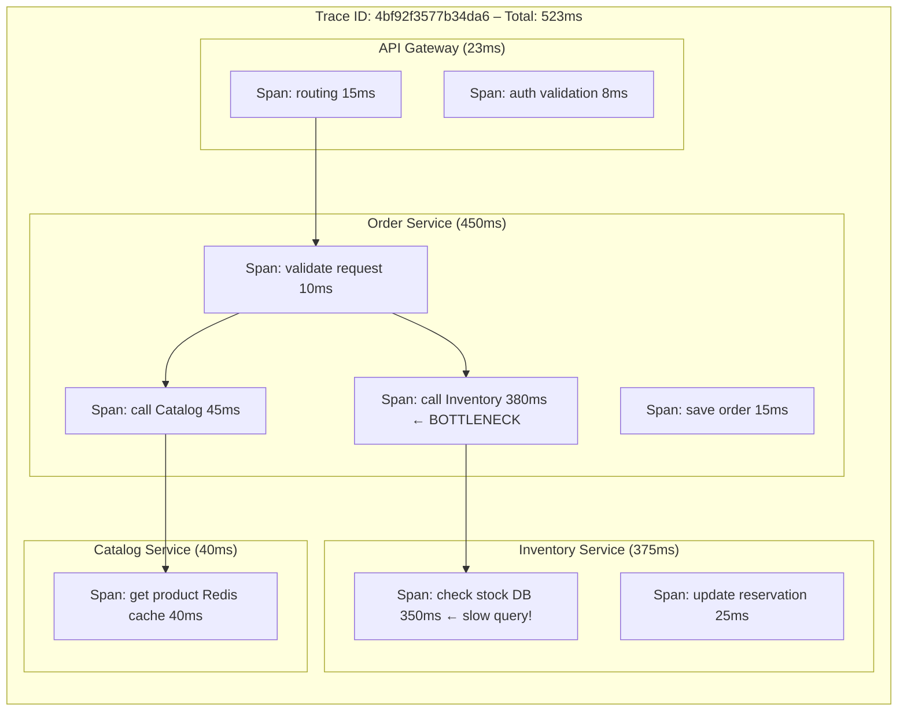

**OpenTelemetry – The Standard:**

```java
// OpenTelemetry: vendor-neutral instrumentation
// Instrument once → export to Jaeger, Zipkin, Datadog, etc.

@RestController
public class OrderController {
    private final Tracer tracer;
    private final OrderService orderService;

    @PostMapping("/orders")
    public ResponseEntity<OrderResponse> placeOrder(@RequestBody OrderRequest req) {
        // Start new span (child of incoming trace)
        Span span = tracer.spanBuilder("placeOrder")
            .setAttribute("order.customer_id", req.getCustomerId())
            .setAttribute("order.item_count", req.getItems().size())
            .startSpan();

        try (Scope scope = span.makeCurrent()) {
            Order order = orderService.place(req);
            span.setAttribute("order.id", order.getId());
            span.setStatus(StatusCode.OK);
            return ResponseEntity.ok(new OrderResponse(order));
        } catch (Exception e) {
            span.recordException(e);
            span.setStatus(StatusCode.ERROR, e.getMessage());
            throw e;
        } finally {
            span.end();
        }
    }
}
```

**Correlation ID – Propagate across services:**

```
Request arrives at API Gateway:
  Generate: X-Correlation-ID: req-uuid-abc123
  Log: {"traceId": "req-uuid-abc123", "event": "request_received"}

API Gateway → Order Service:
  Header: X-Correlation-ID: req-uuid-abc123
  Log: {"traceId": "req-uuid-abc123", "event": "order_processing"}

Order Service → Inventory Service:
  Header: X-Correlation-ID: req-uuid-abc123
  Log: {"traceId": "req-uuid-abc123", "event": "stock_check"}

Result: Search logs by traceId → see ENTIRE REQUEST JOURNEY across all services
```

### 5.4. Health Checks & Readiness

```java
// Spring Boot Actuator / Custom health endpoint
@Component
public class OrderServiceHealthIndicator implements HealthIndicator {

    @Override
    public Health health() {
        // Check all critical dependencies
        boolean dbOk = checkDatabase();
        boolean kafkaOk = checkKafka();
        boolean paymentSvcOk = checkPaymentServiceConnectivity();

        if (dbOk && kafkaOk) {
            return Health.up()
                .withDetail("database", "UP")
                .withDetail("kafka", kafkaOk ? "UP" : "DEGRADED")
                .withDetail("payment-service", paymentSvcOk ? "UP" : "DEGRADED")
                .build();
        }
        return Health.down()
            .withDetail("database", dbOk ? "UP" : "DOWN")
            .withDetail("reason", "Database unreachable")
            .build();
    }
}

// Kubernetes probes:
// /actuator/health/liveness  → Is app alive? (restart if fail)
// /actuator/health/readiness → Ready to receive traffic? (remove from LB if fail)
// /actuator/health           → Overall health (for monitoring)
```

## 6. Data Management trong Microservices

### 6.1. Database per Service – Implementation

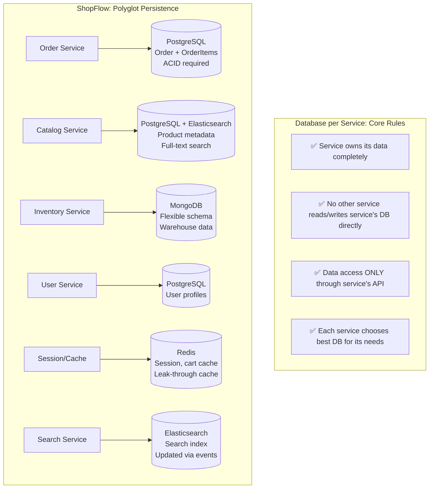

### 6.2. Handling Cross-Service Queries

**Vấn đề:** Order History page cần: orderId, productName, paymentStatus, trackingCode từ 4 services khác nhau.

#### Approach 1: API Composition (BFF layer)

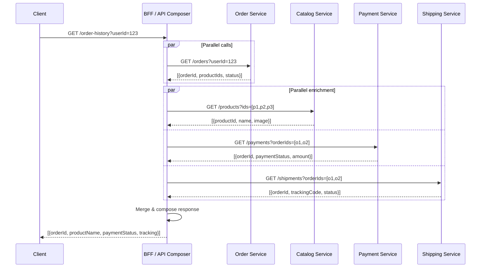

**Khi dùng:** Đọc data không quá phức tạp, latency chấp nhận được.

#### Approach 2: CQRS Read Model (materialized view)

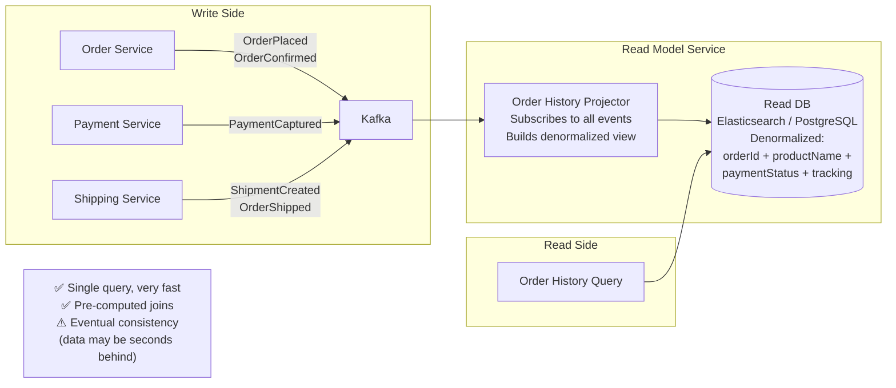

**Khi dùng:** High read frequency, complex queries, acceptable eventual consistency.

### 6.3. Data Consistency Patterns

#### Distributed Transactions – Tại sao không dùng 2PC

```
2PC (Two-Phase Commit) trong microservices:
Phase 1 (Prepare): Coordinator hỏi tất cả participants: "Ready?"
Phase 2 (Commit):  Nếu tất cả ready → Coordinator gửi Commit

Vấn đề:
❌ Blocking protocol: Participants phải lock resources trong suốt 2 phases
❌ Coordinator SPOF: Coordinator crash giữa phase 1 và 2 → participants bị block vĩnh viễn
❌ Network partitions → deadlocks
❌ Không scale được với distributed systems

→ Thay bằng Saga pattern (eventual consistency)
```

#### Eventual Consistency – Accepted trong Microservices

```
Immediate Consistency (ACID):
User places order → DB updated → User sees updated data immediately
[100% consistent, có thể không scale được]

Eventual Consistency (BASE):
User places order → Order DB updated immediately ✅
              ↓
         Kafka event
              ↓
       Inventory updated (2ms later)
       Notification sent (100ms later)
       Analytics updated (1s later)
       Search index updated (5s later)

[Tất cả cuối cùng sẽ consistent, nhưng không ngay lập tức]
[Acceptable cho phần lớn business scenarios]
```

## 7. Testing Strategy

### 7.1. Test Pyramid cho Microservices

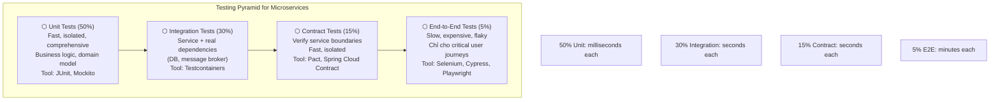

### 7.2. Unit Tests

```java
// Test domain logic trong isolation – không cần Spring context, không cần DB
class OrderDomainTest {

    @Test
    void should_calculate_total_correctly_with_discount() {
        // Given
        Order order = new Order(customerId("usr-123"));
        order.addItem(productId("prod-001"), quantity(2), price(Money.of(100_000, VND)));
        order.addItem(productId("prod-002"), quantity(1), price(Money.of(50_000, VND)));
        Discount discount = Discount.percentage(10); // 10%

        // When
        Money total = order.calculateTotal(discount);

        // Then
        assertThat(total).isEqualTo(Money.of(225_000, VND)); // (200k + 50k) × 0.9
    }

    @Test
    void should_raise_OrderPlaced_event_when_placed() {
        // Given
        Order order = new Order(customerId("usr-123"));
        order.addItem(productId("prod-001"), quantity(1), price(Money.of(100_000, VND)));

        // When
        order.place();

        // Then
        assertThat(order.pullEvents())
            .hasSize(1)
            .first()
            .isInstanceOf(OrderPlacedEvent.class);
    }

    @Test
    void should_reject_cancel_when_order_already_shipped() {
        // Given
        Order order = Order.reconstitute(/* events: Placed, Confirmed, Shipped */);

        // When / Then
        assertThatThrownBy(() -> order.cancel())
            .isInstanceOf(InvalidOrderStateException.class)
            .hasMessageContaining("Cannot cancel shipped order");
    }
}
```

### 7.3. Integration Tests với Testcontainers

```java
// Test service + real database (PostgreSQL in Docker container)
@SpringBootTest
@Testcontainers
class OrderRepositoryIntegrationTest {

    @Container
    static PostgreSQLContainer<?> postgres = new PostgreSQLContainer<>("postgres:15")
            .withDatabaseName("shopflow_order_test")
            .withInitScript("init-test-schema.sql");

    @Container
    static KafkaContainer kafka = new KafkaContainer(
            DockerImageName.parse("confluentinc/cp-kafka:7.4.0"));

    @DynamicPropertySource
    static void configure(DynamicPropertyRegistry registry) {
        registry.add("spring.datasource.url", postgres::getJdbcUrl);
        registry.add("spring.kafka.bootstrap-servers", kafka::getBootstrapServers);
    }

    @Autowired
    private OrderRepository orderRepository;

    @Test
    void should_persist_and_retrieve_order_with_all_items() {
        // Given
        Order order = new Order(customerId("usr-123"));
        order.addItem(productId("prod-001"), quantity(2), price(Money.of(100_000, VND)));
        order.place();

        // When
        orderRepository.save(order);
        Order retrieved = orderRepository.findById(order.getId()).orElseThrow();

        // Then
        assertThat(retrieved.getItems()).hasSize(1);
        assertThat(retrieved.getStatus()).isEqualTo(OrderStatus.PLACED);
    }
}
```

### 7.4. Consumer-Driven Contract Testing với Pact

```
Vấn đề: Order Service gọi Inventory Service
         Inventory team thay đổi response format → Order Service break

Solution: Contract Testing (Pact)
         - Order Service (consumer) định nghĩa CONTRACT:
           "Tôi expect GET /stock/{productId} trả về {available: boolean, quantity: int}"
         - Inventory Service (provider) chạy test verify contract:
           "API của tôi có meet contract này không?"
         - Nếu Inventory thay đổi → contract test fail → know BEFORE deploy
```

```java
// ===== CONSUMER SIDE (Order Service) =====
@ExtendWith(PactConsumerTestExt.class)
@PactTestFor(providerName = "inventory-service")
class InventoryServiceContractTest {

    @Pact(consumer = "order-service")
    public RequestResponsePact checkStockPact(PactDslWithProvider builder) {
        return builder
            .given("product prod-001 has 10 units in stock")
            .uponReceiving("check stock for product prod-001")
                .path("/api/v1/stock/prod-001")
                .method("GET")
                .headers(Map.of("Authorization", "Bearer valid-token"))
            .willRespondWith()
                .status(200)
                .body(LambdaDsl.newJsonBody(body -> body
                    .stringType("productId", "prod-001")
                    .booleanType("available", true)
                    .integerType("quantity", 10)
                ).build())
            .toPact();
    }

    @Test
    @PactTestFor(pactMethod = "checkStockPact")
    void should_get_stock_info_from_inventory_service(MockServer mockServer) {
        InventoryClient client = new InventoryClient(mockServer.getUrl());
        StockInfo stock = client.checkStock("prod-001");

        assertThat(stock.isAvailable()).isTrue();
        assertThat(stock.getQuantity()).isEqualTo(10);
    }
}

// ===== PROVIDER SIDE (Inventory Service) =====
@Provider("inventory-service")
@PactBroker(url = "https://pact-broker.shopflow.internal")
class InventoryServiceContractVerificationTest {

    @BeforeEach
    void setupTarget(PactVerificationContext context) {
        context.setTarget(new HttpTestTarget("localhost", 8004));
    }

    @State("product prod-001 has 10 units in stock")
    void setupProductInStock() {
        // Insert test data into test DB
        stockRepository.save(new Stock("prod-001", 10));
    }

    @TestTemplate
    @ExtendWith(PactVerificationInvocationContextProvider.class)
    void verifyPact(PactVerificationContext context) {
        context.verifyInteraction();
    }
}
```

### 7.5. End-to-End Tests

```java
// Chỉ test critical user journeys
// Chạy trong staging environment với real services
@E2ETest
class CheckoutJourneyE2ETest {

    @Test
    void customer_should_be_able_to_place_order_and_receive_confirmation() {
        // 1. Browse product
        given()
            .when().get("/api/v1/products/prod-001")
            .then().statusCode(200)
                   .body("name", equalTo("iPhone 15"));

        // 2. Add to cart
        given()
            .body("""{"productId": "prod-001", "quantity": 1}""")
            .when().post("/api/v1/cart/items")
            .then().statusCode(200);

        // 3. Place order
        String orderId = given()
            .body("""{"paymentMethod": "CARD", "cardToken": "tok_visa"}""")
            .when().post("/api/v1/orders")
            .then().statusCode(201)
                   .extract().jsonPath().getString("orderId");

        // 4. Wait for async processing (eventual consistency)
        await().atMost(5, SECONDS).until(() -> {
            String status = given()
                .when().get("/api/v1/orders/" + orderId)
                .then().extract().jsonPath().getString("status");
            return "CONFIRMED".equals(status);
        });

        // 5. Verify email notification sent (check via test email service)
        assertThat(testEmailInbox.getEmails())
            .anyMatch(e -> e.getSubject().contains("Order Confirmed"));
    }
}
```

## 8. CI/CD & Deployment Patterns

### 8.1. Per-Service CI/CD Pipeline

```mermaid
graph LR
    subgraph Trigger
        GIT[Git Push\nto feature branch]
    end

    subgraph CI["Continuous Integration"]
        CHECKOUT[Checkout code]
        BUILD[Build\n./mvnw package]
        UNIT_TEST[Unit Tests\nmvn test]
        INT_TEST[Integration Tests\nTestcontainers]
        CONTRACT[Contract Tests\nPact verify]
        SCAN[Security Scan\nSonarQube + OWASP\nSnyk]
        DOCKER[Build Docker Image\nmulti-stage Dockerfile]
        PUSH[Push to Registry\nECR / GCR / Harbor]
    end

    subgraph CD["Continuous Delivery"]
        DEV_DEPLOY[Deploy to Dev\nauto-trigger]
        DEV_SMOKE[Smoke Tests\nDev env]
        STAGING_DEPLOY[Deploy to Staging\nManual approval]
        STAGING_E2E[E2E Tests\nStaging env]
        PROD_DEPLOY[Deploy to Production\nBlue-Green / Canary]
        MONITOR[Monitor\nAuto rollback if error spike]
    end

    GIT --> CHECKOUT --> BUILD --> UNIT_TEST --> INT_TEST
    INT_TEST --> CONTRACT --> SCAN --> DOCKER --> PUSH
    PUSH --> DEV_DEPLOY --> DEV_SMOKE
    DEV_SMOKE --> STAGING_DEPLOY --> STAGING_E2E
    STAGING_E2E --> PROD_DEPLOY --> MONITOR
```

**Multi-stage Dockerfile (best practice):**

```dockerfile
# Stage 1: Build
FROM maven:3.9-eclipse-temurin-17 AS builder
WORKDIR /build
COPY pom.xml .
# Cache dependencies layer
RUN mvn dependency:go-offline -q
COPY src ./src
RUN mvn package -DskipTests -q

# Stage 2: Runtime (minimal image)
FROM eclipse-temurin:17-jre-alpine
WORKDIR /app
# Non-root user (security best practice)
RUN addgroup -S shopflow && adduser -S shopflow -G shopflow
USER shopflow
COPY --from=builder /build/target/order-service.jar ./app.jar
# Health check
HEALTHCHECK --interval=30s --timeout=10s --retries=3 \
  CMD wget -q --spider http://localhost:8080/actuator/health || exit 1
EXPOSE 8080
ENTRYPOINT ["java", \
  "-XX:MaxRAMPercentage=75.0", \
  "-XX:+UseG1GC", \
  "-jar", "app.jar"]
```

### 8.2. Deployment Strategies

#### Rolling Update (mặc định trong Kubernetes)

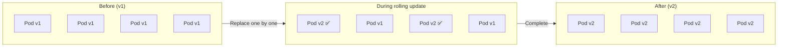

```yaml
# Kubernetes Rolling Update
spec:
  replicas: 4
  strategy:
    type: RollingUpdate
    rollingUpdate:
      maxSurge: 1 # Tối đa 1 pod extra khi rolling
      maxUnavailable: 0 # Không cho phép pod nào unavailable
```

**Phù hợp:** Stateless services, không cần zero-downtime cực đoan.

#### Blue-Green Deployment

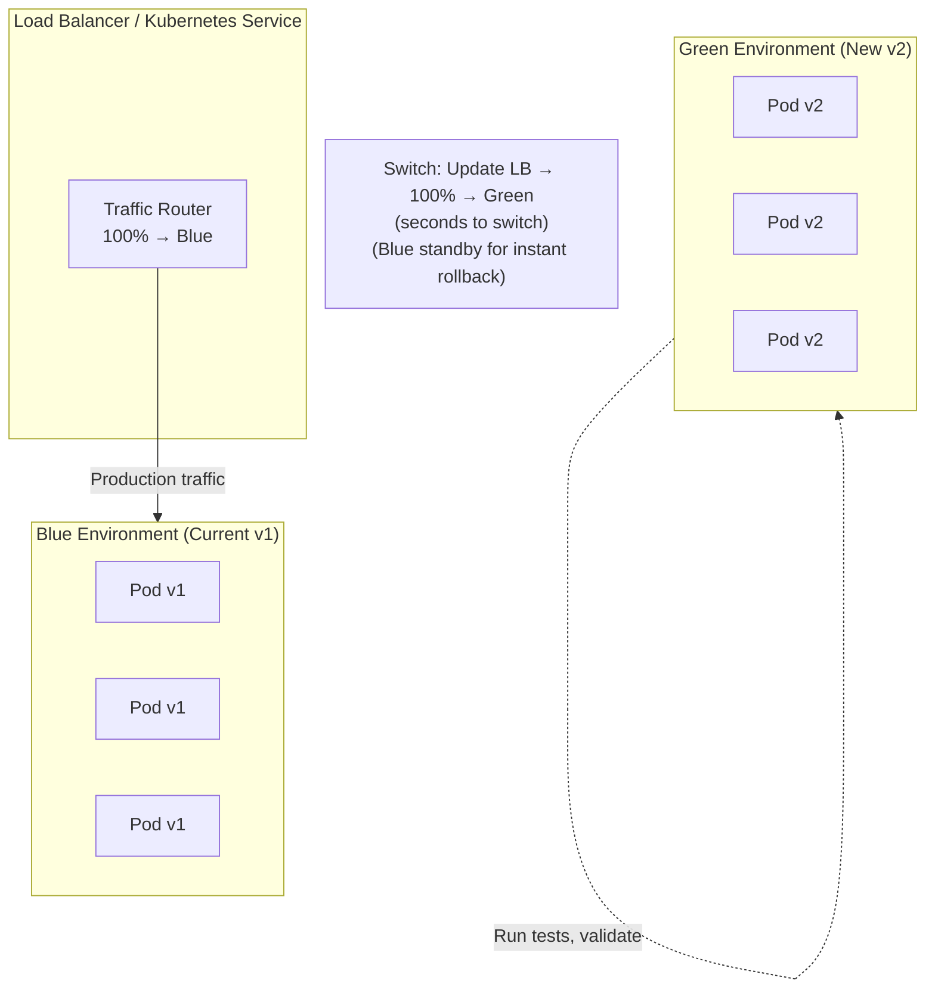

```
Pros:
✅ Zero-downtime
✅ Instant rollback (switch traffic back to Blue)
✅ Full testing trên Green trước khi switch

Cons:
❌ Double infrastructure cost
❌ Database migration phải backward compatible
```

#### Canary Deployment

```mermaid
graph LR
    LB[Load Balancer]
    V1[v1 Pods\n95% traffic]
    V2[v2 Pods\n5% traffic]

    LB -->|"95%"| V1
    LB -->|"5%"| V2

    note["Monitor error rate, latency\nfor Canary (v2) vs Stable (v1)\n\nIf OK: Gradually increase %\nv2: 5% → 20% → 50% → 100%\n\nIf errors spike: rollback instantly"]
```

```yaml
# Istio traffic splitting (Canary với Service Mesh)
apiVersion: networking.istio.io/v1alpha3
kind: VirtualService
metadata:
  name: order-service
spec:
  http:
    - route:
        - destination:
            host: order-service
            subset: v1
          weight: 95
        - destination:
            host: order-service
            subset: v2 # canary
          weight: 5
```

**Khi dùng Canary:** High-risk changes (new algorithm, new DB), need progressive validation.

#### Feature Flags (kết hợp với deployment)

```java
// Feature flags cho phép deploy code mà không activate feature
@Service
public class CheckoutService {
    private final FeatureFlagClient featureFlags;

    public CheckoutResult checkout(CheckoutRequest req) {
        if (featureFlags.isEnabled("new-pricing-engine", req.getUserId())) {
            // New algorithm (controlled rollout: 5% → 50% → 100%)
            return newPricingEngine.calculate(req);
        } else {
            // Old algorithm
            return legacePricingEngine.calculate(req);
        }
    }
}
```

**Tools:** LaunchDarkly, Unleash (self-hosted), AWS CloudWatch Evidently.

### 8.3. Database Migrations với Zero-Downtime

```
Challenge: Deploy new service version với DB schema change
           Không thể stop service trong lúc migrate (production!)

Strategy: Expand-Contract (a.k.a. Blue-Green DB migrations)

Step 1 - EXPAND (backward compatible):
  Deploy v1.1: Thêm column mới (nullable), copy data
  Code v1.1: Đọc từ column mới NẾU có, fallback old column
  Migration: ALTER TABLE orders ADD COLUMN new_status VARCHAR(50) NULL;
  → v1.0 và v1.1 cùng chạy được

Step 2 - MIGRATE:
  Background job copy data: UPDATE orders SET new_status = old_status WHERE new_status IS NULL;
  Monitor progress

Step 3 - CONTRACT:
  Deploy v1.2: Chỉ đọc từ column mới, không đọc old column
  Migration: Make new_status NOT NULL, drop old column
  → Chỉ chạy v1.2 trở lên
```

**Tools:** Flyway, Liquibase (track và apply migrations).

## 9. Infrastructure & Container Orchestration

### 9.1. Kubernetes Architecture cho ShopFlow

```mermaid
graph TB
    subgraph K8s_Cluster["Kubernetes Cluster (Production)"]
        subgraph Namespaces["Namespaces"]
            subgraph ShopFlowNS["shopflow (production)"]
                ORD_DEP[order-service\nDeployment: 3 replicas\nHPA: 3-10 replicas]
                PAY_DEP[payment-service\nDeployment: 2 replicas\n99.99% SLA]
                CAT_DEP[catalog-service\nDeployment: 5 replicas\nHigh traffic]
                INV_DEP[inventory-service\nDeployment: 2 replicas]
            end
            subgraph InfrastruNS["infrastructure"]
                KAFKA_DEP[Kafka\nStatefulSet: 3 brokers]
                PG[PostgreSQL\nStatefulSet per service]
                REDIS_DEP[Redis\nStatefulSet: 1 master + 2 replicas]
            end
            subgraph MonitorNS["monitoring"]
                PROM_DEP[Prometheus]
                GRAF_DEP[Grafana]
                JAE_DEP[Jaeger]
            end
        end

        subgraph ControlPlane2["Control Plane"]
            API_SRV[kube-apiserver]
            ETCD[etcd]
            SCHEDULER[Scheduler]
            CM[Controller Manager]
        end

        subgraph NodeGroup1["Node Group: General (t3.large × 10)"]
            N1[Node 1]
            N2[Node 2]
            N3[Node 3]
        end

        subgraph NodeGroup2["Node Group: Memory-Optimized (r5.xlarge × 3)\n(Kafka, Redis)"]
            N4[Node 4]
            N5[Node 5]
        end
    end

    subgraph External["External"]
        INGRESS[Ingress Controller\nNginx / Traefik / ALB]
        CDN_EXT[CloudFront CDN]
        DNS_EXT[Route 53]
    end

    DNS_EXT --> CDN_EXT --> INGRESS --> ORD_DEP
    INGRESS --> CAT_DEP
```

### 9.2. Resource Management & Auto-scaling

```yaml
# Kubernetes Deployment với resources và HPA
apiVersion: apps/v1
kind: Deployment
metadata:
  name: order-service
  namespace: shopflow
spec:
  replicas: 3
  selector:
    matchLabels:
      app: order-service
  template:
    metadata:
      labels:
        app: order-service
        version: "2.3.1"
    spec:
      containers:
        - name: order-service
          image: shopflow/order-service:2.3.1
          ports:
            - containerPort: 8080
          # Resource requests & limits (ALWAYS set these!)
          resources:
            requests:
              memory: "256Mi" # Guaranteed allocation
              cpu: "250m" # 0.25 CPU
            limits:
              memory: "512Mi" # Max usage (OOMKill if exceeded)
              cpu: "500m" # Max CPU
          # Liveness: Is the app alive?
          livenessProbe:
            httpGet:
              path: /actuator/health/liveness
              port: 8080
            initialDelaySeconds: 30
            periodSeconds: 10
            failureThreshold: 3
          # Readiness: Ready to receive traffic?
          readinessProbe:
            httpGet:
              path: /actuator/health/readiness
              port: 8080
            initialDelaySeconds: 20
            periodSeconds: 5
            failureThreshold: 2
          env:
            - name: DB_PASSWORD
              valueFrom:
                secretKeyRef:
                  name: order-service-secrets
                  key: db-passwor
# Horizontal Pod Autoscaler
apiVersion: autoscaling/v2
kind: HorizontalPodAutoscaler
metadata:
  name: order-service-hpa
spec:
  scaleTargetRef:
    apiVersion: apps/v1
    kind: Deployment
    name: order-service
  minReplicas: 3
  maxReplicas: 20
  metrics:
    - type: Resource
      resource:
        name: cpu
        target:
          type: Utilization
          averageUtilization: 70 # Scale up khi CPU > 70%
    - type: Resource
      resource:
        name: memory
        target:
          type: Utilization
          averageUtilization: 80
```

### 9.3. GitOps với ArgoCD

```mermaid
graph LR
    subgraph DevProcess["Developer Workflow"]
        DEV[Developer]
        PR[Pull Request]
        GITREPO[Git Repository\nApp Code]
        HELMREPO[Git Repository\nHelm Charts / K8s Manifests]
    end

    subgraph CI_Process["CI Pipeline (GitHub Actions)"]
        BUILD2[Build & Test]
        IMAGE[Push Docker Image]
        UPDATE[Update image tag\nin Helm chart repo]
    end

    subgraph GitOps["GitOps (ArgoCD)"]
        ARGO[ArgoCD\nWatch Helm repo]
        K8S[Kubernetes Cluster]
    end

    DEV --> PR --> GITREPO
    GITREPO --> BUILD2 --> IMAGE --> UPDATE --> HELMREPO
    ARGO -->|"Continuously sync\nevery 3 minutes"| HELMREPO
    ARGO -->|"Apply changes\nif drift detected"| K8S

    note["Git = Source of Truth\nArgoCD reconciles K8s state\nwith Git state\nAutomatic drift detection"]
```

## 10. Anti-patterns cần tránh

### 10.1. The Distributed Monolith

```
Triệu chứng:
❌ Services gọi nhau theo chuỗi dài: A → B → C → D → A (circular)
❌ Phải deploy tất cả services cùng lúc
❌ Shared database giữa services
❌ Tight version coupling: "chỉ hoạt động khi tất cả cùng version X"

Nguyên nhân:
- Chia services mà không chia domain boundaries
- Không enforce data ownership
- Không có contract testing

Giải pháp:
→ Refactor về domain boundaries (Bounded Contexts)
→ Enforce Database per Service
→ Asynchronous communication where possible
→ Contract testing
```

### 10.2. Chatty Services (Quá nhiều network calls)

```
❌ Anti-pattern:
GET /order-summary → gọi 15 API riêng lẻ để lấy từng field

✅ Solutions:
1. API Composition / BFF: Aggregate ở tầng trên
2. Event-Carried State Transfer: Events mang đủ data
3. CQRS Read Model: Pre-compute denormalized view
4. GraphQL: Client chỉ query data cần thiết
```

### 10.3. Shared Libraries với Business Logic

```
❌ Anti-pattern:
shared-library/
├── OrderValidator.java      ← business logic
├── PricingEngine.java       ← business logic
└── InventoryChecker.java    ← business logic

Vấn đề: Mọi services phụ thuộc shared-lib
        Update lib → phải update và redeploy tất cả services
        Tạo tight coupling không qua API

✅ Acceptable shared libraries:
- Logging utilities
- Tracing helpers (correlation ID)
- Common DTOs (chỉ data structures, không business logic)
- Security utilities (JWT validation)
- HTTP client wrappers
```

### 10.4. Too Granular Microservices

```
❌ Over-decomposition:
UserEmailService (chỉ lưu email)
UserPhoneService (chỉ lưu phone)
UserAddressService (chỉ lưu address)

Vấn đề:
- 3 network calls thay vì 1
- 3 databases để maintain
- Transaction "save user profile" phải span 3 services → saga complexity
- Tổng overhead > total value

✅ Right-sizing:
UserService (email + phone + address + profile)
→ Một business capability = một service
→ "Two-pizza team" rule: 6-10 người có thể own và maintain
```

### 10.5. Missing Observability

```
❌ Deploy microservices without:
- Centralized logging
- Distributed tracing
- Metrics + alerting

Kết quả:
"Something is slow, but we don't know which service"
"Payment failed for user 123, but we can't trace what happened"
"Production incident took 4 hours to debug"

✅ Minimum Viable Observability:
- Structured JSON logs với correlation ID
- Health check endpoint (/health)
- Basic metrics (latency, error rate, throughput)
- Distributed tracing (OpenTelemetry → Jaeger)
Implement BEFORE going to production
```

### 10.6. Versioning Problems

```
❌ Breaking change deployed without versioning:
Old: GET /orders → returns {id, status, amount}
New: GET /orders → returns {orderId, orderStatus, totalAmount}  ← renamed fields!
Consumer (mobile app) → crashes because field names changed

✅ API Evolution Strategy:
Option 1: URL versioning
  /api/v1/orders (keep old)
  /api/v2/orders (new schema)
  Deprecate v1 after 6 months with notice

Option 2: Additive changes only
  /api/v1/orders → returns {id, status, amount, orderId, orderStatus, totalAmount}
  Both old and new field names → graceful migration period

Option 3: Content negotiation
  Accept: application/vnd.shopflow.v2+json
```

## 11. Checklist Production Readiness

Trước khi một microservice lên production, checklist này phải được đánh dấu hoàn thành:

### 11.1. API & Contract

- [ ] API có versioning rõ ràng (v1, v2)
- [ ] Error responses theo chuẩn (error code, message, traceId)
- [ ] Pagination cho tất cả list endpoints
- [ ] Request validation với meaningful error messages
- [ ] API documentation (OpenAPI/Swagger)
- [ ] Contract tests với tất cả consumers (Pact)
- [ ] Backward compatibility verified

### 11.2. Resilience

- [ ] Timeout cho tất cả external calls
- [ ] Circuit breaker cho mọi downstream dependency
- [ ] Retry logic với exponential backoff (chỉ cho idempotent operations)
- [ ] Bulkhead (thread pool isolation per dependency)
- [ ] Graceful degradation / fallback defined
- [ ] Graceful shutdown (SIGTERM handler, drain connections)
- [ ] Rate limiting tại API Gateway

### 11.3. Security

- [ ] Authentication (JWT validation tại Gateway)
- [ ] Authorization (role/ownership check tại service)
- [ ] Input validation (SQL injection, XSS prevention)
- [ ] Secrets in Vault / Secrets Manager (không hardcode)
- [ ] TLS 1.2+ cho tất cả connections
- [ ] mTLS giữa services (via Service Mesh hoặc explicit)
- [ ] Dependency vulnerability scan (Snyk / OWASP)
- [ ] No sensitive data in logs (PII masking)
- [ ] Security headers (CORS, Content-Security-Policy)

### 11.4. Observability

- [ ] Structured JSON logging với correlation ID
- [ ] Log level configurable without restart
- [ ] /health (liveness + readiness) endpoint
- [ ] Metrics exposed (/metrics Prometheus format)
- [ ] Distributed tracing (OpenTelemetry instrumentation)
- [ ] Dashboard in Grafana (latency, error rate, throughput)
- [ ] Alerts configured (error rate > 1%, p99 > 500ms)
- [ ] Runbook per alert (what to do when alert fires)

### 11.5. Data

- [ ] Database connection pooling configured
- [ ] DB migrations managed (Flyway/Liquibase)
- [ ] DB migration tested backward compatible
- [ ] Backup policy defined và tested
- [ ] Read replica cho heavy read queries
- [ ] Idempotent event handlers (Kafka consumers)
- [ ] Outbox pattern cho reliable event publishing

### 11.6. Deployment

- [ ] Docker image built từ multi-stage Dockerfile (non-root user)
- [ ] Resource requests & limits set (CPU/Memory)
- [ ] HPA configured (min/max replicas, scale trigger)
- [ ] Liveness & Readiness probes configured
- [ ] Pod Disruption Budget (PDB) set (availability during maintenance)
- [ ] Rolling update hoặc Blue-Green / Canary strategy defined
- [ ] Rollback procedure documented và tested
- [ ] Feature flags cho high-risk features
- [ ] CI/CD pipeline hoàn chỉnh (unit → integration → contract → staging → prod)
- [ ] GitOps configured (ArgoCD / Flux)

### 11.7. Testing

- [ ] Unit test coverage > 80% cho business logic
- [ ] Integration tests với Testcontainers
- [ ] Contract tests (Pact) cho tất cả service dependencies
- [ ] Performance test / load test (k6, Gatling)
- [ ] Chaos testing (kill random pods, inject latency)
- [ ] Disaster recovery drill (DB restore, full outage recovery)

### 11.8. Operations

- [ ] Runbook: How to deploy, rollback, scale
- [ ] On-call rotation defined
- [ ] Incident response playbook
- [ ] SLO/SLA defined và monitored
- [ ] Error budget tracking
- [ ] Capacity planning (projected growth 6 months)
- [ ] Cost monitoring (AWS Cost Explorer / cloud billing alerts)

## Tổng kết – Production Microservices Philosophy

```
KHÔNG có silver bullet trong kiến trúc microservices.
Mỗi pattern có trade-off. Decision phụ thuộc context.

Nguyên tắc core:

1. Design for failure
   "Everything fails all the time" – Werner Vogels, AWS CTO
   → Circuit breakers, retries, timeouts, fallbacks là bắt buộc

2. Automate everything
   Manual deployments → human error
   → CI/CD, GitOps, Infrastructure as Code

3. Observe before you optimize
   "Premature optimization is the root of all evil"
   → Implement observability TRƯỚC khi optimize
   → Data-driven decisions, không gut feeling

4. Keep it simple
   "A two-service system with good observability beats a six-service system nobody can explain"
   → Chỉ thêm complexity khi pain vượt qua cost

5. Organizational alignment
   Conway's Law: "Organizations produce systems mirroring their communication structures"
   → Microservices chỉ work khi teams structure match service structure
   → Kỹ thuật và tổ chức phải thay đổi song song
```
