# Microservices Advanced Patterns & Deep Dives

## Mục lục

1. [Apache Kafka – Deep Dive](#1-apache-kafka--deep-dive)
2. [Caching Strategies](#2-caching-strategies)
3. [Migration Patterns – Monolith to Microservices](#3-migration-patterns--monolith-to-microservices)
4. [Performance Patterns](#4-performance-patterns)
5. [Service Mesh Deep Dive – Istio](#5-service-mesh-deep-dive--istio)
6. [Microservices Governance](#6-microservices-governance)
7. [Multi-Region & Disaster Recovery](#7-multi-region--disaster-recovery)
8. [Tổng hợp Pattern Reference Card](#8-tổng-hợp-pattern-reference-card)

## 1. Apache Kafka – Deep Dive

Kafka là **distributed event streaming platform** được dùng rộng rãi trong Microservices làm message broker. Hiểu đúng internals của Kafka giúp thiết kế hệ thống đúng và tránh các production pitfalls.

### 1.1. Kiến trúc Kafka

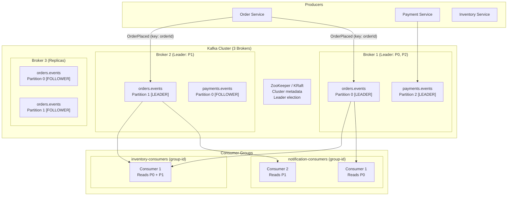

### 1.2. Core Concepts

#### Topic, Partition và Offset

```
Topic "orders.events":
├── Partition 0:  [msg@0] [msg@1] [msg@2] [msg@3] ... [msg@1000]
│                  ^offset 0                               ^offset 1000
├── Partition 1:  [msg@0] [msg@1] [msg@2] ...
└── Partition 2:  [msg@0] [msg@1] ...

Đặc điểm của Partition (append-only log):
- Messages được append vào cuối partition (immutable log)
- Mỗi message có offset duy nhất trong partition (monotonically increasing)
- Message được GIỮ theo retention policy (không xóa sau khi consumed)
  → Mặc định: 7 ngày hoặc 1GB per partition
- Consumers có thể replay từ bất kỳ offset nào
```

**Partition key quyết định message đi vào partition nào:**

```java
// Kafka Producer: specify partition key
ProducerRecord<String, String> record = new ProducerRecord<>(
    "orders.events",           // topic
    orderId,                   // KEY → deterministic partition selection
    orderEventJson             // VALUE
);

/*
Nếu key = "ord-123" → Hash(key) % numPartitions = Partition 1
Nếu key = "ord-456" → Hash(key) % numPartitions = Partition 0

Tác dụng của partition key:
✅ Ordering guarantee: Tất cả events của order "ord-123" ĐI VÀO CÙNG PARTITION
   → Consumer đọc theo thứ tự đúng (OrderPlaced → PaymentCaptured → OrderShipped)
✅ Stateful processing: Consumer biết toàn bộ lifecycle của 1 entity

❌ Không có key (null key): Round-robin → events của cùng order có thể ở khác partition
   → Không đảm bảo ordering
*/
```

#### Replication – Fault Tolerance

```
Topic "orders.events", replication-factor=3:

Broker 1: Partition 0 [LEADER]  ←── Producers write here
Broker 2: Partition 0 [FOLLOWER] ←── Replicates from Leader
Broker 3: Partition 0 [FOLLOWER] ←── Replicates from Leader

Producer acks config:
- acks=0:   Fire and forget (fastest, can lose messages)
- acks=1:   Leader acknowledges (balanced)
- acks=all: ALL in-sync replicas (ISR) acknowledge (safest, slowest)

min.insync.replicas=2: Cần ít nhất 2 replicas (Leader + 1 Follower) xác nhận TRƯỚC KHI ack producer

Khi Broker 1 (Leader) chết:
→ ZooKeeper / KRaft phát hiện → tự động elect leader mới từ ISR
→ Broker 2 hoặc 3 trở thành Leader
→ Producers và Consumers tự động reconnect
```

#### Consumer Groups & Partition Assignment

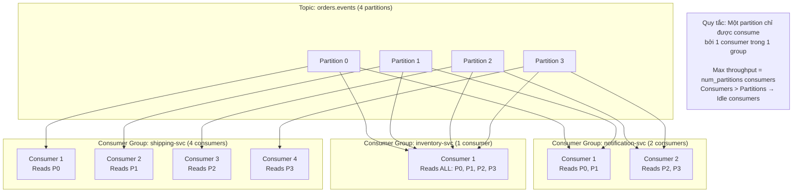

**Key insight về Consumer Groups:**

- Mỗi Consumer Group nhận **toàn bộ** messages (fan-out)
- Trong một group, partitions được **phân chia** giữa consumers (parallel processing)
- 2 group khác nhau đọc độc lập, không ảnh hưởng nhau

### 1.3. Offset Management – Đảm bảo At-Least-Once

```
Offset tracking per (group.id, topic, partition):
Stored in internal Kafka topic: __consumer_offsets

Scenario: Consumer Group "inventory-svc", Topic "orders.events", Partition 0
Messages: [offset 0] [offset 1] [offset 2] [offset 3] [offset 4]

Consumer reads offsets 0, 1, 2 → processes them → commits offset 3
(commit offset = "next offset to read" = last processed + 1)

Next time consumer starts (or after crash):
→ Reads committed offset: 3
→ Starts reading from offset 3
→ No message lost, no duplicate (if processed exactly once)
```

**Auto-commit vs Manual commit:**

```java
// ❌ Auto-commit (enable.auto.commit=true) - DEFAULT, DANGEROUS:
consumer.poll(Duration.ofMillis(1000)); // Returns records 0,1,2
// Auto-commit interval: 5s
// 3s later: consumer CRASHES before processing completes
// Auto-commit chạy: commit offset 3 (dù chưa process xong)
// → Restart: starts from offset 3 → MESSAGES 0,1,2 LOST!

// ✅ Manual commit AFTER processing (At-Least-Once):
while (true) {
    ConsumerRecords<String, OrderEvent> records = consumer.poll(Duration.ofMillis(1000));

    for (ConsumerRecord<String, OrderEvent> record : records) {
        try {
            processOrderEvent(record.value());  // Process first
        } catch (RetryableException e) {
            // Don't commit → will retry on next poll
            break;
        }
    }

    consumer.commitSync();  // Commit AFTER all records processed
    // → If crash before commit: restart from last committed offset
    // → Possible duplicate (same records delivered again)
    // → Consumer MUST be idempotent!
}
```

**Delivery Semantics:**

| Semantic          | Cách đạt được                            | Trade-off                                 |
| ----------------- | ---------------------------------------- | ----------------------------------------- |
| **At-most-once**  | Commit trước khi process                 | Không duplicate, CÓ THỂ mất message       |
| **At-least-once** | Commit sau khi process                   | Không mất, CÓ THỂ duplicate               |
| **Exactly-once**  | Kafka Transactions + idempotent producer | Không mất, không duplicate (phức tạp hơn) |

**Production recommendation:** At-least-once + idempotent consumers.

### 1.4. Producer Best Practices

```java
Properties props = new Properties();
props.put(ProducerConfig.BOOTSTRAP_SERVERS_CONFIG, "kafka:9092");
props.put(ProducerConfig.KEY_SERIALIZER_CLASS_CONFIG, StringSerializer.class);
props.put(ProducerConfig.VALUE_SERIALIZER_CLASS_CONFIG, JsonSerializer.class);

// Durability: ALL ISR must ack
props.put(ProducerConfig.ACKS_CONFIG, "all");

// Idempotent producer: Prevent duplicate messages if network retry
props.put(ProducerConfig.ENABLE_IDEMPOTENCE_CONFIG, true);

// Retry on transient failures
props.put(ProducerConfig.RETRIES_CONFIG, Integer.MAX_VALUE);
props.put(ProducerConfig.MAX_IN_FLIGHT_REQUESTS_PER_CONNECTION, 5); // With idempotence

// Batching for throughput
props.put(ProducerConfig.BATCH_SIZE_CONFIG, 16384);        // 16KB batch
props.put(ProducerConfig.LINGER_MS_CONFIG, 5);             // Wait 5ms to fill batch

// Compression
props.put(ProducerConfig.COMPRESSION_TYPE_CONFIG, "snappy"); // Good balance speed/ratio
```

### 1.5. Consumer Best Practices

```java
Properties props = new Properties();
props.put(ConsumerConfig.GROUP_ID_CONFIG, "inventory-service");
props.put(ConsumerConfig.AUTO_OFFSET_RESET_CONFIG, "earliest"); // Start from beginning if no offset
props.put(ConsumerConfig.ENABLE_AUTO_COMMIT_CONFIG, false);     // Manual commit!

// Poll configuration
props.put(ConsumerConfig.MAX_POLL_RECORDS_CONFIG, 500);         // Records per poll
props.put(ConsumerConfig.MAX_POLL_INTERVAL_MS_CONFIG, 300000);  // 5 min max processing time
props.put(ConsumerConfig.SESSION_TIMEOUT_MS_CONFIG, 30000);     // Heartbeat timeout
props.put(ConsumerConfig.HEARTBEAT_INTERVAL_MS_CONFIG, 3000);   // Heartbeat interval (< session/3)
```

### 1.6. Kafka vs Alternatives

| Tiêu chí           | Apache Kafka                                        | RabbitMQ                  | AWS SQS / SNS       | Redis Streams            |
| ------------------ | --------------------------------------------------- | ------------------------- | ------------------- | ------------------------ |
| **Model**          | Distributed log (pull)                              | Message queue (push)      | Managed queue/topic | In-memory log            |
| **Throughput**     | Cực cao (millions/sec)                              | Cao (100K/sec)            | Trung bình          | Cao                      |
| **Retention**      | ✅ Configurable (7 days+)                           | ❌ Deleted on consume     | ✅ 14 days (SQS)    | ✅ Configurable          |
| **Replay**         | ✅ Replay từ bất kỳ offset                          | ❌ Không                  | ❌ Không            | ✅ Có                    |
| **Ordering**       | ✅ Per partition                                    | ✅ Per queue              | ⚠️ SQS FIFO only    | ✅ Per stream            |
| **Fan-out**        | ✅ Native (consumer groups)                         | ✅ Exchange/bindings      | ✅ SNS → SQS        | ✅ Consumer groups       |
| **Ops complexity** | Cao (cluster, ZooKeeper)                            | Trung bình                | Thấp (managed)      | Thấp                     |
| **Best for**       | Event streaming, high-throughput, replay, audit log | Task queues, RPC, routing | AWS ecosystem       | Cache + simple streaming |

**Khi nào dùng Kafka:**

- ✅ Cần replay events (Event Sourcing, debug, replay cho new service)
- ✅ Throughput cao (hàng triệu events/giây)
- ✅ Nhiều consumers cần cùng events (fan-out)
- ✅ Events cần được giữ lại (audit log, analytics)
- ✅ Ordering quan trọng (per entity lifecycle)

**Khi nào dùng RabbitMQ:**

- ✅ Complex routing logic (topic exchanges, header exchanges)
- ✅ Task queues với priority
- ✅ RPC pattern (request-reply)
- ✅ Đơn giản, team chưa có Kafka experience

### 1.7. Kafka Schema Registry – Tránh Breaking Changes

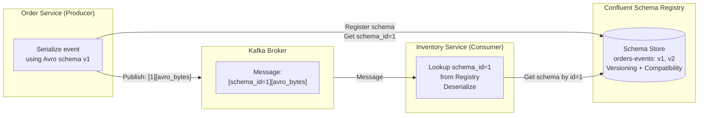

**Tại sao cần Schema Registry:**

```
Vấn đề: Producer publish JSON event, Consumer parse
         Producer thêm field "discountAmount" → Consumer (cũ) không biết
         Producer đổi "amount" thành "totalAmount" → Consumer CRASH!

Giải pháp: Avro schema + Schema Registry
- Schema được register và version
- Compatibility rules: BACKWARD, FORWARD, FULL
- BACKWARD: Consumer mới đọc được messages cũ (thêm field với default)
- Tự động validate schema trước khi publish
```

### 1.8. Kafka trong ShopFlow: Topology hoàn chỉnh

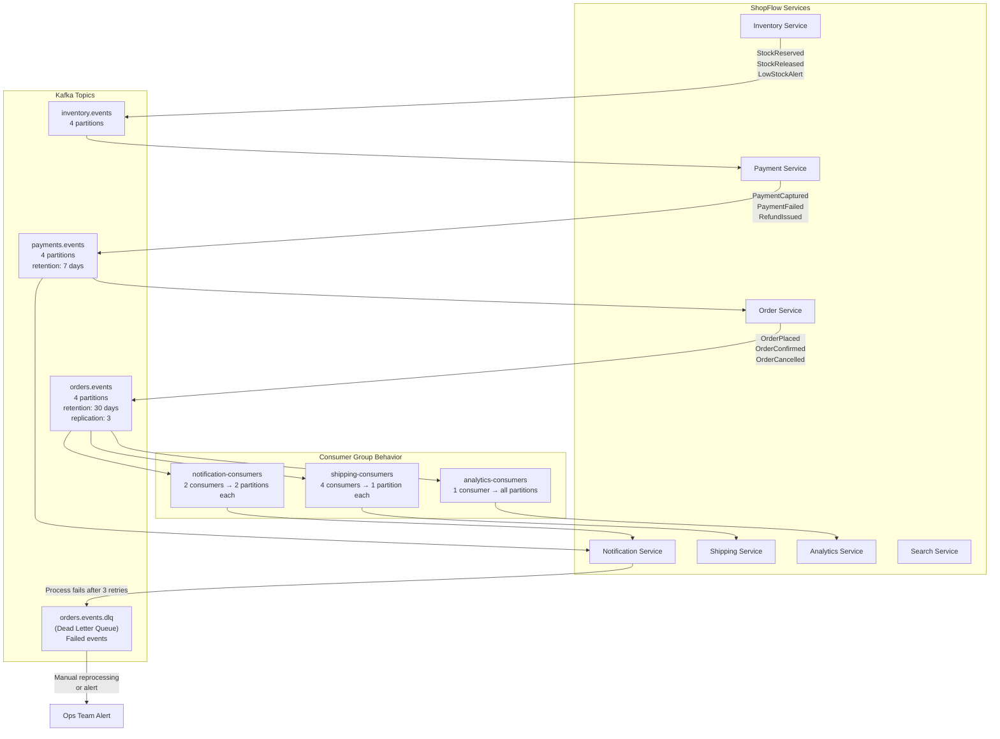

## 2. Caching Strategies

Caching là một trong những kỹ thuật quan trọng nhất để tối ưu performance. **"There are only two hard things in Computer Science: cache invalidation and naming things."** – Phil Karlton

### 2.1. Các tầng Caching

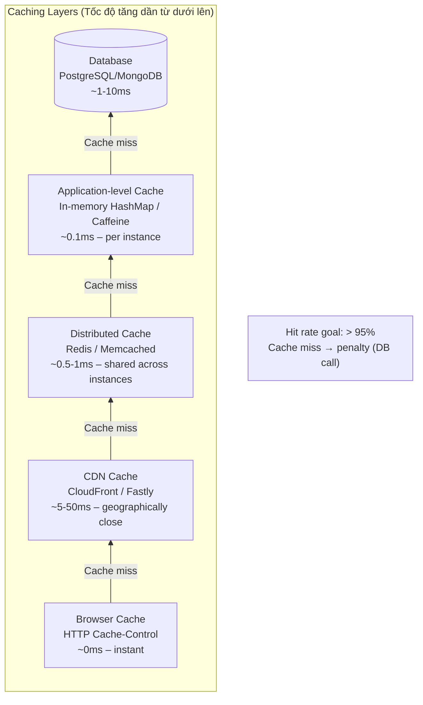

### 2.2. Cache-Aside (Lazy Loading) – Pattern phổ biến nhất

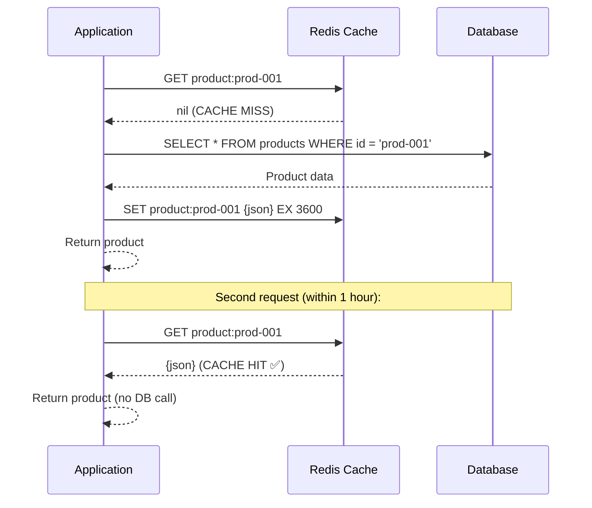

**Implementation:**

```java
@Service
public class ProductService {
    private final ProductRepository repository;
    private final RedisTemplate<String, Product> redis;
    private static final Duration TTL = Duration.ofHours(1);

    public Product getProduct(String productId) {
        String key = "product:" + productId;

        // 1. Check cache
        Product cached = redis.opsForValue().get(key);
        if (cached != null) {
            return cached;  // Cache HIT
        }

        // 2. Cache MISS → fetch from DB
        Product product = repository.findById(productId)
            .orElseThrow(() -> new ProductNotFoundException(productId));

        // 3. Populate cache
        redis.opsForValue().set(key, product, TTL);
        return product;
    }

    // Cache invalidation on update
    public Product updateProduct(String productId, ProductUpdateRequest req) {
        Product updated = repository.save(/* apply changes */);

        // Invalidate cache
        redis.delete("product:" + productId);
        // Next read will populate fresh data
        return updated;
    }
}
```

**Ưu / Nhược điểm:**

|     | Cache-Aside                                                       |
| --- | ----------------------------------------------------------------- |
| ✅  | DB là source of truth – cache failure không ảnh hưởng correctness |
| ✅  | Chỉ cache data được read – tiết kiệm memory                       |
| ✅  | Dễ implement, phổ biến nhất                                       |
| ❌  | Cache miss penalty (cold start)                                   |
| ❌  | Race condition: 2 threads cùng miss, cùng write vào cache         |
| ❌  | Stale data giữa write và invalidation                             |

### 2.3. Write-Through – Consistency-first

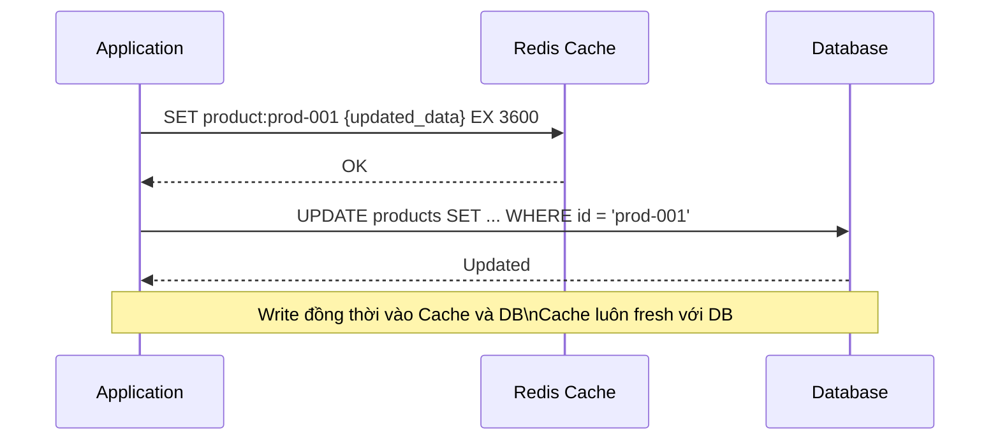

```java
public Product updateProduct(String productId, ProductUpdateRequest req) {
    // 1. Update DB
    Product updated = repository.save(/* apply changes */);

    // 2. Immediately update cache (write-through)
    redis.opsForValue().set("product:" + productId, updated, Duration.ofHours(1));

    return updated;
}
```

**Phù hợp:** Data thường xuyên được đọc ngay sau khi write (shopping cart, user profile).

### 2.4. Write-Behind (Write-Back) – Performance-first

```
Application → Write to Cache ONLY (fast return)
                    ↓ (async, batched)
             Cache → Write to DB (seconds later)

Pros: Cực nhanh, batch writes vào DB (giảm DB load)
Cons: Risk of data loss nếu cache crash trước khi flush vào DB
      KHÔNG dùng cho data critical (payment, order)

Use case: Analytics counters, view counts, IoT sensor data
```

### 2.5. Read-Through

```
Application → Cache → (on miss) → DB
            Cache tự populate (transparent)
            Application không cần logic cache/DB

Khác Cache-Aside: Cache library tự xử lý miss (như Caffeine + loader function)
```

### 2.6. So sánh các caching patterns

| Pattern           | Write flow                     | Read flow                  | Consistency             | Best for                        |
| ----------------- | ------------------------------ | -------------------------- | ----------------------- | ------------------------------- |
| **Cache-Aside**   | App → DB, rồi invalidate cache | App checks cache first     | Eventual                | Read-heavy, general purpose     |
| **Write-Through** | App → Cache → DB (đồng bộ)     | App checks cache first     | Strong                  | High read frequency after write |
| **Write-Behind**  | App → Cache → DB (async)       | App checks cache first     | Eventual (risk of loss) | Write-heavy, non-critical       |
| **Read-Through**  | App → DB trực tiếp             | App → Cache → DB (on miss) | Eventual                | Transparent caching             |

### 2.7. Cache Invalidation Strategies

```
1. TTL-based Expiration (đơn giản nhất):
   SET key value EX 3600  → tự expire sau 1 giờ
   Vấn đề: Stale data tối đa = TTL duration

2. Event-driven Invalidation (chính xác hơn):
   ProductUpdated event → consume → DELETE "product:prod-001"
   Vấn đề: Race condition – new reader lấy stale data giữa update và invalidation

3. Cache Versioning:
   Key: "product:prod-001:v5"  → version tăng khi update
   Vấn đề: Old keys vẫn tồn tại → cần cleanup

4. Write-Through: Không cần invalidate (cache luôn fresh)
   Vấn đề: Write latency tăng
```

### 2.8. Cache Stampede (Thundering Herd) – Vấn đề quan trọng

```
Vấn đề:
- Cache key "popular-products" expire sau 1h
- 1000 concurrent requests đến cùng lúc khi key expire
- 1000 requests cùng miss → 1000 DB queries cùng lúc → DB overload

Giải pháp 1: Probabilistic Early Expiration
- Khi TTL còn < 10% → 1% probability expire sớm, trigger cache refresh
- Không cần lock, staggered refresh

Giải pháp 2: Redis Lock (Mutex / Semaphore)
```

```java
public Product getProductWithStampedePrevention(String productId) {
    String key = "product:" + productId;
    String lockKey = "lock:product:" + productId;

    // 1. Try cache first (fast path)
    Product cached = redis.opsForValue().get(key);
    if (cached != null) return cached;

    // 2. Cache miss → Try to acquire lock
    Boolean locked = redis.opsForValue()
        .setIfAbsent(lockKey, "1", Duration.ofSeconds(10));

    if (Boolean.TRUE.equals(locked)) {
        try {
            // Lock acquired → fetch from DB, populate cache
            Product product = repository.findById(productId).orElseThrow();
            redis.opsForValue().set(key, product, Duration.ofHours(1));
            return product;
        } finally {
            redis.delete(lockKey); // Release lock
        }
    } else {
        // Another thread is fetching → wait and retry
        Thread.sleep(100);
        return getProductWithStampedePrevention(productId); // Retry
    }
}
```

### 2.9. Caching trong ShopFlow

```
Layer 1 – Browser Cache:
  Static assets (JS, CSS, images): Cache-Control: max-age=31536000, immutable
  API responses (product list): Cache-Control: max-age=60, stale-while-revalidate=30

Layer 2 – CDN Cache (CloudFront):
  GET /products/{id}:  Cache 5 phút (public data, low freshness requirement)
  GET /categories:     Cache 1 giờ
  POST /orders:        KHÔNG cache (mutation)
  GET /cart:           KHÔNG cache (user-specific, auth required)

Layer 3 – Distributed Cache (Redis):
  Product data:          key=product:{id}     TTL=1h    Pattern=Cache-Aside
  Category tree:         key=categories:all   TTL=6h    Pattern=Cache-Aside
  Product search result: key=search:{hash}    TTL=5m    Pattern=Cache-Aside
  User session:          key=session:{token}  TTL=30m   Pattern=Write-Through
  Shopping cart:         key=cart:{userId}    TTL=7d    Pattern=Write-Through
  Rate limit counter:    key=rl:{ip}:{minute} TTL=60s   Pattern=Atomic Increment
  Flash sale stock:      key=flash:{id}       No TTL    Pattern=DECR atomic

Layer 4 – Application Cache (Caffeine in-memory):
  Config values:        5 phút, per-instance
  Feature flags:        30 giây (cần fresh)
  Exchange rates:       1 giờ (rarely changes)
```

## 3. Migration Patterns – Monolith to Microservices

### 3.1. Nguyên tắc cơ bản

> **"Never do a big bang rewrite."** – Martin Fowler  
> Tất cả thành công đều là incremental migration. Mọi big bang rewrite đều thất bại hoặc tốn 3x thời gian dự kiến.

```
Big Bang Rewrite (❌ AVOID):
Month 1-18: Rewrite toàn bộ hệ thống mới song song
Month 18:   Switch traffic 100% sang hệ thống mới
Problems:
  - Business rules ẩn không được document → bị miss
  - Old system vẫn phải maintain trong 18 tháng
  - New system chưa battle-tested
  - High risk: all-or-nothing

Incremental Migration (✅ CORRECT):
Month 1-2:  Extract Service A (low risk)
Month 3-4:  Extract Service B
Month 5-6:  Extract Service C
...
Each step: Small, testable, rollback-able
```

### 3.2. Strangler Fig Pattern

Named after a fig tree species that grows around a host tree and eventually replaces it. **Martin Fowler** popularized this pattern for software migration.

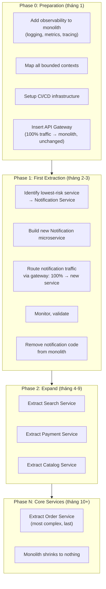

**Bước 1: Insert API Gateway (zero risk)**

```
Before:
Client → Monolith (handles everything)

After (same behavior, different routing):
Client → API Gateway → Monolith (100% traffic forwarded)

Impact: Zero (gateway transparent proxy)
Purpose: Preparation for traffic splitting
```

**Bước 2: Extract module thành service**

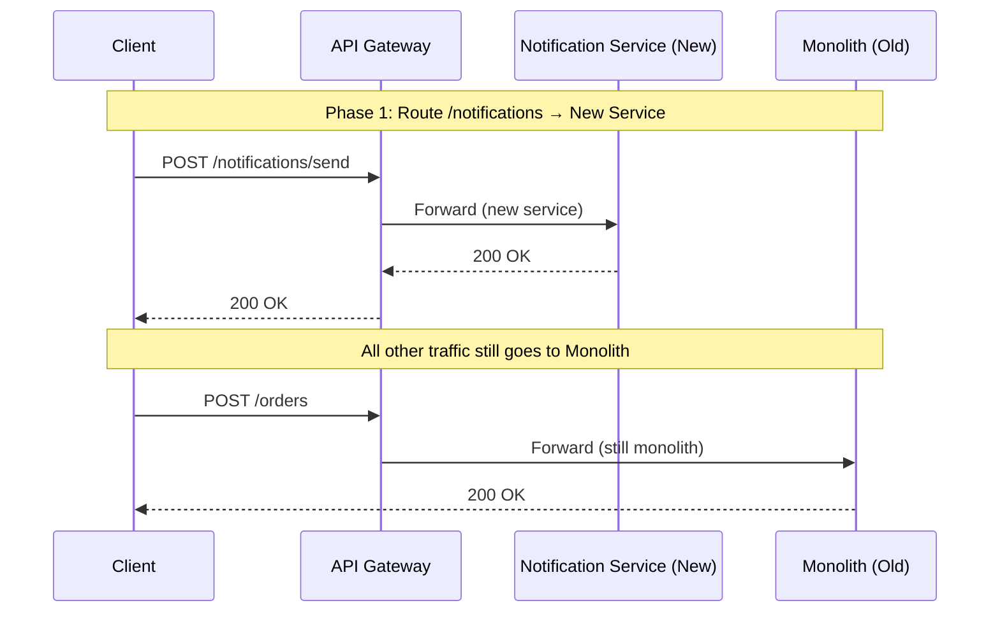

**Bước 3: Data Migration**

```
Vấn đề lớn nhất khi migrate: Database coupling

Shared DB phase (temporary acceptable):
┌──────────────────┐     ┌──────────────────┐
│ Notification Svc │     │    Monolith      │
└────────┬─────────┘     └────────┬─────────┘
         │                        │
         └──────────┬─────────────┘
                    ▼
              ┌───────────┐
              │ Shared DB │  ← TEMPORARY - acceptable during migration
              └───────────┘

Dần dần tách ra:
Step 1: Notification Service tạo schema riêng trong shared DB
Step 2: Copy/migrate data sang schema mới
Step 3: Notification Service đọc/ghi từ schema riêng
Step 4: Remove notification tables khỏi monolith
Step 5: Tách thành separate DB instance
```

### 3.3. Anti-Corruption Layer (ACL)

Khi microservice mới phải giao tiếp với monolith (hoặc legacy system), ACL tạo ra **translation layer** bảo vệ domain model của service mới khỏi bị "ô nhiễm" bởi legacy model.

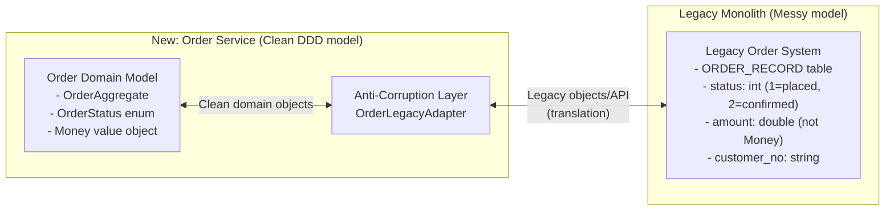

```java
// ACL: Translate between new domain and legacy system
@Component
public class OrderLegacyAdapter {
    private final LegacyOrderClient legacyClient;

    // Translate LEGACY → NEW domain model
    public Order fromLegacy(LegacyOrderRecord record) {
        OrderStatus status = switch (record.getStatusCode()) {
            case 1 -> OrderStatus.PLACED;
            case 2 -> OrderStatus.CONFIRMED;
            case 5 -> OrderStatus.SHIPPED;
            default -> throw new IllegalStateException("Unknown status: " + record.getStatusCode());
        };

        return Order.reconstitute(
            OrderId.of(record.getOrderNo()),
            CustomerId.of(record.getCustomerNo()),
            Money.of(BigDecimal.valueOf(record.getAmount()), Currency.VND),
            status
        );
    }

    // Translate NEW domain model → LEGACY
    public LegacyOrderRecord toLegacy(Order order) {
        return LegacyOrderRecord.builder()
            .orderNo(order.getId().getValue())
            .statusCode(mapStatusToLegacyCode(order.getStatus()))
            .amount(order.getTotal().getAmount().doubleValue())
            .build();
    }
}
```

### 3.4. Branch by Abstraction

Khi không thể tách ngay thành separate service, **Branch by Abstraction** cho phép thay thế implementation dần dần trong cùng codebase.

```java
// Step 1: Extract interface (abstraction)
public interface NotificationSender {
    void sendOrderConfirmation(Order order);
    void sendPaymentReceipt(Payment payment);
}

// Step 2: Implement với legacy code (existing behavior)
@Primary
@ConditionalOnProperty(name = "notification.impl", havingValue = "legacy")
public class LegacyNotificationSender implements NotificationSender {
    public void sendOrderConfirmation(Order order) {
        // Old inline implementation
        legacyMailer.send(order.getEmail(), "Order Confirmed", buildLegacyTemplate(order));
    }
}

// Step 3: New implementation (calls new microservice)
@ConditionalOnProperty(name = "notification.impl", havingValue = "microservice")
public class MicroserviceNotificationSender implements NotificationSender {
    private final NotificationServiceClient client;

    public void sendOrderConfirmation(Order order) {
        client.post("/notifications/order-confirmed", new OrderConfirmedRequest(order));
    }
}

// Step 4: Feature flag switch (config)
# application.properties
notification.impl=legacy    # Start here
notification.impl=microservice   # Switch when ready
```

### 3.5. Chọn service nào tách trước?

**Strangler Fig Migration Priority Matrix:**

| Criteria                  | Điểm | Giải thích                                          |
| ------------------------- | ---- | --------------------------------------------------- |
| **Độc lập cao**           | +3   | Ít dependencies với domain khác                     |
| **Data isolation dễ**     | +3   | Schema dễ tách, ít shared data                      |
| **Low business risk**     | +3   | Không critical (notification OK, payment HIGH RISK) |
| **High change frequency** | +2   | Team thay đổi nhiều → cần deploy độc lập            |
| **Clear bounded context** | +2   | DDD boundaries rõ ràng                              |
| **High scale need**       | +1   | Cần scale riêng                                     |

**ShopFlow extraction order:**

```
Priority 1 (tháng 1-2): Notification Service
  ✅ Hoàn toàn stateless (send và forget)
  ✅ Không có DB coupling
  ✅ Business risk: Thấp (email delay không critical)
  ✅ Clear boundary

Priority 2 (tháng 3-4): Search Service
  ✅ Read-only (không write business data)
  ✅ Đã có separate Elasticsearch
  ✅ Cần scale riêng (search load ≠ order load)

Priority 3 (tháng 5-7): Catalog Service
  ✅ Relatively independent
  ⚠️ Shared với Inventory (cần ACL)

Priority 4 (tháng 8-10): Payment Service
  ⚠️ Business critical → extra caution
  ⚠️ PCI compliance → separate team/repo
  → Need: contract tests, thorough testing

Priority 5 (tháng 11-14): Order Service
  ⚠️ Most complex, most dependencies
  ⚠️ Saga pattern needed for distributed tx
  → Last because needs other services ready first
```

### 3.6. Database Migration Strategies

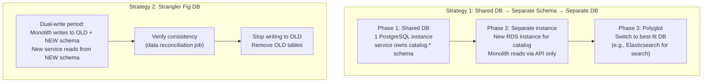

**Dual-write pattern (quan trọng):**

```java
// Dual-write: Writes go to BOTH old and new location
// Ensures no data loss during migration window
public void saveOrder(Order order) {
    // Write to OLD (monolith DB) - still used by monolith
    legacyOrderRepository.save(tolegacyRecord(order));

    // Write to NEW (microservice DB) - new service reads here
    orderRepository.save(order);

    // After validation period: Remove legacy write
}

// Reconciliation job: Verify both are in sync
@Scheduled(fixedRate = 300_000) // Every 5 minutes
public void reconcileOrders() {
    List<String> discrepancies = comparer.findDiscrepancies(
        legacyOrderRepository.findRecentOrders(),
        orderRepository.findRecentOrders()
    );
    if (!discrepancies.isEmpty()) {
        alertService.notify("Order data discrepancy detected: " + discrepancies);
    }
}
```

## 4. Performance Patterns

### 4.1. Asynchronous Request Processing

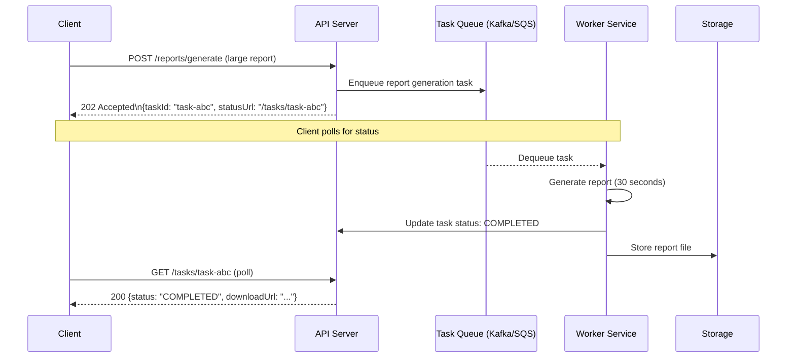

**Khi dùng async processing:**

- Long-running tasks (report generation, image processing, ML inference)
- Batch operations (import 10,000 products)
- Operations where user doesn't need immediate result

### 4.2. Database Query Optimization Patterns

#### N+1 Query Problem

```java
// ❌ N+1 Problem: 1 query cho orders + N queries cho mỗi customer
List<Order> orders = orderRepository.findAll();           // Query 1
for (Order order : orders) {
    Customer customer = customerRepo.findById(order.getCustomerId()); // Query 2,3,4...N+1
    System.out.println(order.getId() + " by " + customer.getName());
}
// 100 orders = 101 queries!

// ✅ Eager loading: JOIN trong 1 query
List<Order> orders = orderRepository.findAllWithCustomers();
// SQL: SELECT o.*, c.* FROM orders o JOIN customers c ON c.id = o.customer_id
// 1 query, done.

// ✅ Hoặc batch loading với DataLoader (GraphQL)
// ✅ Hoặc denormalized snapshot: Store customerName in order table
```

#### Read Replicas

```
Single DB (problem):
All read queries → Primary DB (overloaded)
Write queries    → Primary DB

With Read Replicas:
Write queries           → Primary DB (strong consistency)
Heavy read queries      → Read Replica 1 (eventual consistency ~ms lag)
Analytics/reports       → Read Replica 2 (can be seconds behind)
```

#### Connection Pooling

```java
// HikariCP (best Java connection pool)
@Bean
public DataSource dataSource() {
    HikariConfig config = new HikariConfig();
    config.setJdbcUrl("jdbc:postgresql://db:5432/shopflow");
    config.setMaximumPoolSize(20);         // Max connections
    config.setMinimumIdle(5);              // Min idle connections
    config.setConnectionTimeout(30000);    // 30s to get connection
    config.setIdleTimeout(600000);         // 10min idle before close
    config.setMaxLifetime(1800000);        // 30min max connection life
    // Health check
    config.setConnectionTestQuery("SELECT 1");
    return new HikariDataSource(config);
}
```

### 4.3. Load Shedding & Backpressure

```
Load Shedding: Chủ động từ chối requests khi hệ thống quá tải
→ Trả 503 Service Unavailable với Retry-After header
→ Bảo vệ system khỏi complete collapse

Backpressure: Slow down producers khi consumers không xử lý kịp
→ Kafka: Consumer lag tăng → Alert → Scale up consumers
→ HTTP: 429 Too Many Requests
→ gRPC: Flow control built-in

Circuit Breaker + Load Shedding = Resilient system:
- Normal: Accept all traffic
- High load: Shed 20% low-priority requests
- Overload: Circuit breaker opens, return fallback
```

### 4.4. Saga Pattern – Performance Considerations

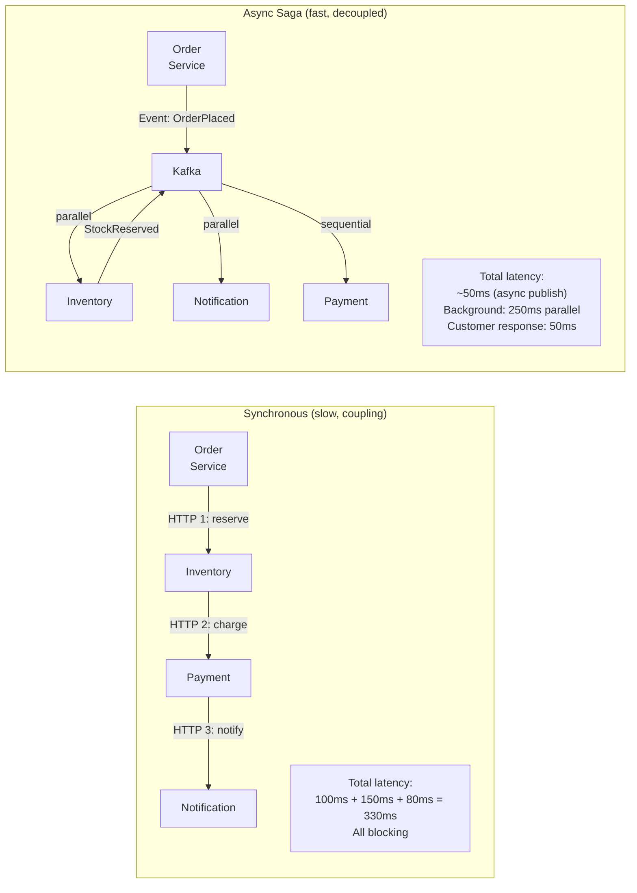

## 5. Service Mesh Deep Dive – Istio

### 5.1. Kiến trúc Istio

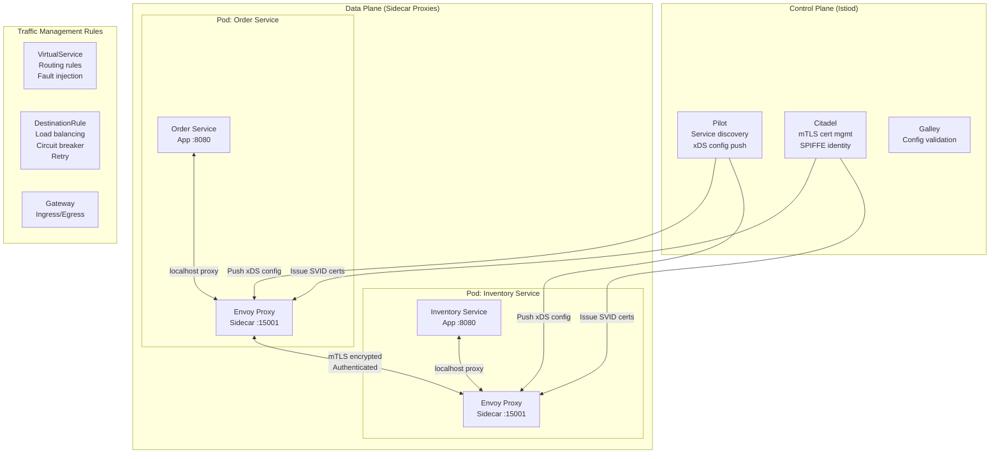

### 5.2. Traffic Management với Istio

**Canary deployment:**

```yaml
# VirtualService: 95% v1, 5% canary v2
apiVersion: networking.istio.io/v1alpha3
kind: VirtualService
metadata:
  name: order-service
spec:
  hosts:
    - order-service
  http:
    - match:
        - headers:
            x-canary-user: # Specific users get v2
              exact: "true"
      route:
        - destination:
            host: order-service
            subset: v2
    - route: # Everyone else gets v1
        - destination:
            host: order-service
            subset: v1
          weight: 95
        - destination:
            host: order-service
            subset: v2
          weight:
# DestinationRule: Define subsets (v1/v2)
apiVersion: networking.istio.io/v1alpha3
kind: DestinationRule
metadata:
  name: order-service
spec:
  host: order-service
  trafficPolicy:
    connectionPool:
      http:
        http1MaxPendingRequests: 100
        http2MaxRequests: 1000
    outlierDetection: # Circuit breaker
      consecutive5xxErrors: 5
      interval: 30s
      baseEjectionTime: 30s
  subsets:
    - name: v1
      labels:
        version: v1
    - name: v2
      labels:
        version: v2
```

**Fault injection (Chaos Engineering):**

```yaml
# Inject 5s delay for 10% of requests → test timeout behavior
apiVersion: networking.istio.io/v1alpha3
kind: VirtualService
metadata:
  name: payment-service-fault-test
spec:
  hosts:
    - payment-service
  http:
    - fault:
        delay:
          percentage:
            value: 10.0 # 10% of requests
          fixedDelay: 5s # 5 second delay
        abort:
          percentage:
            value: 5.0 # 5% of requests
          httpStatus: 503 # Return 503
      route:
        - destination:
            host: payment-service
```

## 6. Microservices Governance

Khi số lượng services tăng lên, cần governance để tránh chaos.

### 6.1. Service Catalog – "Where is what"

```
Internal Developer Portal (Backstage.io):
┌───────────────────────────────────────────────────────────┐
│ Service: order-service                                    │
│ Owner: Order Squad (team-order@shopflow.com)              │
│ Tech: Java 17, Spring Boot 3, PostgreSQL                  │
│ Repo: github.com/shopflow/order-service                   │
│ Docs: confluence.shopflow.com/order-service               │
│ API: api-docs.shopflow.com/order-service/v1               │
│ Dashboard: grafana.shopflow.com/d/order-service           │
│ Alerts: pagerduty.com/service/order-service               │
│ Runbook: wiki.shopflow.com/runbook/order-service          │
│ Dependencies: inventory-service, payment-service, kafka   │
│ SLO: p99 < 500ms, availability > 99.9%                    │
│ Deployment: Kubernetes, 3-10 replicas, auto-scaling       │
└───────────────────────────────────────────────────────────┘
```

### 6.2. API Standards Enforcement

```
Tất cả services PHẢI tuân theo:

URL Conventions:
  /api/v{N}/resources               → resource endpoints
  /actuator/health                  → health check
  /actuator/metrics                 → Prometheus metrics
  /api-docs                         → OpenAPI spec

Headers (mandatory):
  X-Correlation-ID: {uuid}          → Tracing
  X-Service-Name: {service}         → Caller identity
  Content-Type: application/json    → Always JSON

Authentication:
  Authorization: Bearer {jwt}       → All protected endpoints

Error format: Standard JSON error schema (defined in shared spec)
Logging format: Standard JSON log schema

Enforcement:
  - OpenAPI linting in CI pipeline (Spectral)
  - Contract tests (Pact)
  - Gateway-level validation
  - ArchUnit cho module boundaries
```

### 6.3. Team Topologies và Conway's Law

> **Conway's Law:** "Organizations design systems that mirror their own communication structure."

```
❌ Sai lầm phổ biến:
   Team A owns: Order Service + half of Payment Service
   Team B owns: Other half of Payment + Catalog Service
   → Services phải communicate constantly → coupling không thể tránh

✅ Đúng: Team topology → Service topology
   Platform Team:  Kafka, Kubernetes, Monitoring, CI/CD tooling
   Order Squad:    Order Service (owns end-to-end)
   Payment Squad:  Payment Service (owns end-to-end)
   Catalog Squad:  Catalog + Search Service
   Infra Squad:    Auth, Notification, Shared infrastructure

Team Topologies model (Matthew Skelton):
  Stream-aligned teams:  Own products/services (Order, Payment squads)
  Platform teams:        Reduce cognitive load for stream teams (Kubernetes, monitoring)
  Enabling teams:        Help stream teams learn new tech
  Complicated-subsystem: Complex specialized component (ML, geo-routing)
```

## 7. Multi-Region & Disaster Recovery

### 7.1. Active-Passive vs Active-Active

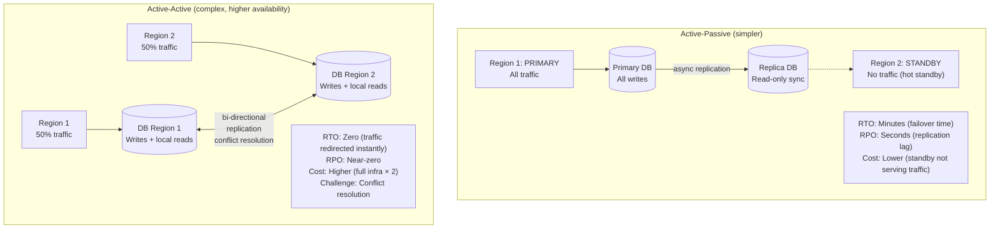

### 7.2. RTO và RPO

```
RTO (Recovery Time Objective):
  "Sau sự cố, bao lâu hệ thống phải hoạt động trở lại?"

  Target tùy business:
  Payment Service:  RTO = 5 phút
  Catalog Service:  RTO = 30 phút
  Analytics:        RTO = 4 giờ

RPO (Recovery Point Objective):
  "Tối đa bao nhiêu data có thể mất?"

  Target:
  Payment Service:  RPO = 0 (zero data loss, synchronous replication)
  Order Service:    RPO = 60 giây (async replication acceptable)
  Analytics:        RPO = 4 giờ (batch sync OK)

Cost vs RTO/RPO:
Lower RTO/RPO = Higher cost (more replication, active-active, faster failover)
```

### 7.3. Chaos Engineering

```
"If it hurts, do it more often" – Netflix

Chaos Engineering: Chủ động gây lỗi trong production để phát hiện điểm yếu

Levels (từ thấp đến cao):

- Level 1: Kill random pod in Kubernetes
  kubectl delete pod order-service-abc123

- Level 2: Inject network latency (Istio fault injection)
  5s delay cho 10% traffic đến payment-service

- Level 3: Kill entire AZ (Availability Zone)
  Terminate all EC2 instances in us-east-1a

- Level 4: Full region outage simulation
  Block traffic to/from ap-southeast-1

Tools:
  - Chaos Monkey (Netflix, kills random EC2)
  - Chaos Mesh (Kubernetes-native, many failure types)
  - AWS Fault Injection Service (managed chaos)
  - Istio fault injection

Process:
1. Define steady state (normal behavior metrics)
2. Hypothesize: "If payment-service is slow, order checkout degrades gracefully"
3. Inject failure
4. Observe: Does system recover? Which metrics change?
5. Fix weaknesses discovered
6. Repeat
```

## 8. Tổng hợp Pattern Reference Card

### 8.1. Pattern Selection Guide

| Problem                                   | Pattern                   | Tool/Framework             |
| ----------------------------------------- | ------------------------- | -------------------------- |
| Service phải giao tiếp, cần kết quả ngay  | Synchronous REST/gRPC     | REST, gRPC                 |
| Service phải thông báo, không cần kết quả | Async Events              | Kafka, RabbitMQ            |
| Nhiều services cần cùng event             | Pub/Sub (Broker Topology) | Kafka Topics               |
| Long-running workflow cần orchestration   | Orchestration (Mediator)  | Temporal, Cadence          |
| Distributed transaction across services   | Saga Pattern              | Choreography/Orchestration |
| Read model cần dữ liệu từ nhiều services  | CQRS + Read Model         | Elasticsearch, PostgreSQL  |
| Cần audit trail / replay events           | Event Sourcing            | Event Store, Kafka         |
| Cache data, giảm DB load                  | Cache-Aside               | Redis                      |
| Write consistency + cache                 | Write-Through             | Redis                      |
| External clients cần single entry point   | API Gateway               | Kong, AWS API GW           |
| Multiple client types (web/mobile)        | BFF Pattern               | Custom service             |
| Service-to-service auth                   | mTLS                      | Istio, SPIFFE              |
| User authentication                       | JWT + OAuth2              | Keycloak, Auth0            |
| Service B down, Service A must survive    | Circuit Breaker           | Resilience4j               |
| Prevent cascade failure                   | Bulkhead                  | Thread pools               |
| Test API compatibility                    | Contract Testing          | Pact                       |
| Migrate monolith                          | Strangler Fig             | API Gateway                |
| Protect from legacy model                 | ACL                       | Custom adapter             |
| Zero-downtime deploy                      | Blue-Green / Canary       | Kubernetes + Istio         |

### 8.2. Kafka vs REST Decision

```
Dùng KAFKA khi:
✅ Fan-out: 1 event → nhiều consumers
✅ Cần replay events
✅ High throughput (> 10K events/sec)
✅ Loose coupling quan trọng hơn low latency
✅ Audit trail / event history required
✅ Consumer có thể xử lý async

Dùng REST/gRPC khi:
✅ Cần response ngay (checkout cần biết stock available không)
✅ Simple request-response
✅ Client polling (GET /orders/{id})
✅ External API (browser, mobile app)
✅ Strong consistency cần thiết
```

### 8.3. Caching Decision

```
Cache-Aside:   Default choice. Read-heavy. DB là source of truth.
Write-Through: Cần cache luôn fresh sau write (cart, user profile).
Write-Behind:  Write-heavy, minor data loss OK (counters, analytics).
No Cache:      Data thay đổi quá thường xuyên, mỗi read cần freshest data.

TTL guidelines:
  Static config, categories:    6-24 hours
  Product catalog:              1-4 hours
  User profile:                 30 minutes
  Search results:               5-15 minutes
  Stock availability:           1-5 minutes (changes frequently)
  Flash sale stock:             No TTL (managed by business logic)
  Session:                      30 minutes (sliding window)
```

### 8.4. Deployment Strategy Decision

```
Rolling Update:   Default. Stateless services. Low risk changes.
Blue-Green:       High-risk deploy. Cần instant rollback. Có đủ infra budget.
Canary:           Validate new version với real traffic trước khi full rollout.
Feature Flag:     Deploy code without activating feature. Safe for experiments.

Combine:
Canary + Feature Flag = Maximum safety
→ Deploy new code (canary 5%) + Feature flag OFF
→ Enable feature flag for 5% canary users
→ Monitor, if OK → increase canary + flag %
→ 100% canary + 100% flag = full rollout
```
