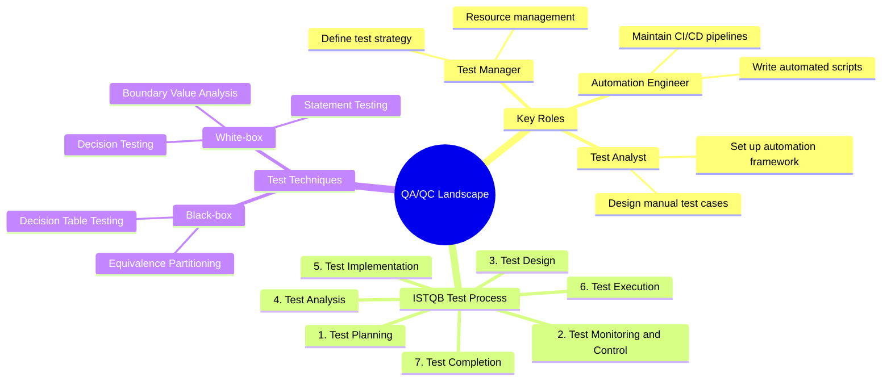

```mermaid
mindmap
  root((QA/QC Landscape))
    Key Roles
      Test Manager
        Define test strategy
        Resource management
      Test Analyst
        Set up automation framework
        Design manual test cases
      Automation Engineer
        Write automated scripts
        Maintain CI/CD pipelines
    ISTQB Test Process
      1. Test Planning
      2. Test Monitoring and Control
      3. Test Design
      4. Test Analysis
      5. Test Implementation
      6. Test Execution
      7. Test Completion
    Test Techniques
      Black-box
        Equivalence Partitioning
        Decision Table Testing
      White-box
        Statement Testing
        Decision Testing
        Boundary Value Analysis
```
