<div align="center">
  <h1>Homework 02 — Bug Report</h1>
  <small>
    <strong>Student:</strong> Nguyễn Tấn Phát - 23127449
  </small> <br />
  <sub>June 20, 2026</sub>
</div>

# Table of Contents

1. [FR-01: Account Registration (Pool A)](#fr-01-account-registration)
2. [FR-07: Shopping Cart (Pool B)](#fr-07-shopping-cart)
3. [FR-17: Coupon Management (Pool C)](#fr-17-coupon-management)
4. [FR-03: Forgot Password & Reset Password (Pool D)](#fr-03-forgot-password--reset-password)

# FR-01: Account Registration

**Generated by:** bug-report-writer skill  
**Date:** 2026-06-16  
**Total bugs:** 10

## BUG-001

<p align="center">
  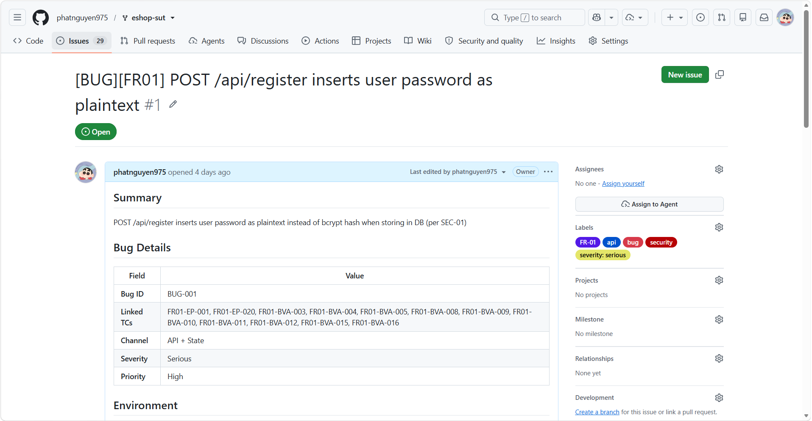
</p>

| Field            | Value                                                                                                                                                                |
| ---------------- | -------------------------------------------------------------------------------------------------------------------------------------------------------------------- |
| **Bug ID**       | BUG-001                                                                                                                                                              |
| **Feature**      | FR-01 — Account Registration                                                                                                                                         |
| **Linked TCs**   | FR01-EP-001, FR01-EP-020, FR01-BVA-003, FR01-BVA-004, FR01-BVA-005, FR01-BVA-008, FR01-BVA-009, FR01-BVA-010, FR01-BVA-011, FR01-BVA-012, FR01-BVA-015, FR01-BVA-016 |
| **Channel**      | API + State                                                                                                                                                          |
| **Summary**      | POST /api/register inserts user password as plaintext instead of bcrypt hash when storing in DB (per SEC-01)                                                         |
| **Status**       | New                                                                                                                                                                  |
| **Severity**     | Serious                                                                                                                                                              |
| **Priority**     | High                                                                                                                                                                 |
| **Reported by**  | 23127449 - Nguyễn Tấn Phát                                                                                                                                           |
| **Date**         | 2026-06-14                                                                                                                                                           |
| **GitHub Issue** | [#1](https://github.com/phatnguyen975/eshop-sut/issues/1)                                                                                                            |

### Environment

| Component    | Value                    |
| ------------ | ------------------------ |
| OS / Device  | Ubuntu (WSL), Windows 11 |
| Runtime Env  | N/A (cURL test)          |
| Backend      | http://localhost:3000    |
| Frontend/App | N/A (API-only test)      |
| Test Account | ep001@test.com           |

### Steps to Reproduce

1. Ensure the EShop backend is running at http://localhost:3000.
2. Send the following request:
   ```bash
   curl -s -X POST http://localhost:3000/api/register \
      -H "Content-Type: application/json" \
      -d '{"name":"Nguyen Van A","email":"ep001@test.com","password":"Test@123"}'
   ```
3. Observe the HTTP response status code.
4. Observe the response body.
5. Query the database:
   ```bash
   sqlite3 backend/database.sqlite "SELECT password FROM users WHERE email='ep001@test.com';"
   ```

**This root cause also causes the following TCs to fail:** FR01-EP-020, FR01-BVA-003, FR01-BVA-004, FR01-BVA-005, FR01-BVA-008, FR01-BVA-009, FR01-BVA-010, FR01-BVA-011, FR01-BVA-012, FR01-BVA-015, FR01-BVA-016.

### Expected Behavior

Per **SEC-01**:

> Passwords must not be stored as plaintext.

Specifically (based on Primary TC):

- HTTP 200 OK
- Response body: `{"message": "User registered successfully", "id": <positive integer>}`
- DB state: Password stored as bcrypt hash (starts with `$2`).

### Actual Behavior

- HTTP Status: `HTTP 200`
- Response Body:
  ```json
  { "message": "User registered successfully", "id": 1 }
  ```
- DB State: Password is stored as plaintext `Test@123` instead of a bcrypt hash.

### Severity Rationale

**Serious:** SEC-01 is explicitly violated, storing user passwords in plaintext which poses a massive security vulnerability.

### Priority Rationale

**High:** Security vulnerability that exposes user credentials, blocking secure deployment.

## BUG-002

<p align="center">
  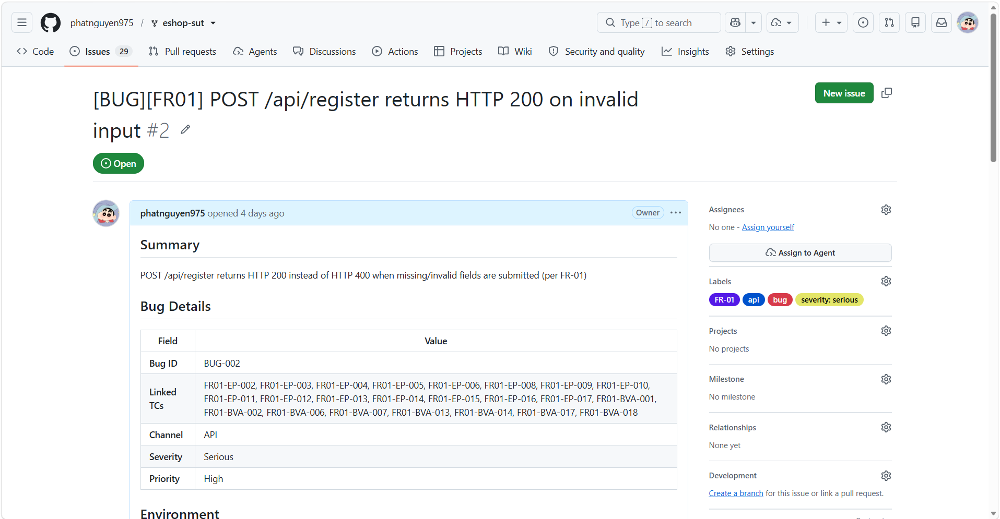
</p>

| Field            | Value                                                                                                                                                                                                                                                                                                             |
| ---------------- | ----------------------------------------------------------------------------------------------------------------------------------------------------------------------------------------------------------------------------------------------------------------------------------------------------------------- |
| **Bug ID**       | BUG-002                                                                                                                                                                                                                                                                                                           |
| **Feature**      | FR-01 — Account Registration                                                                                                                                                                                                                                                                                      |
| **Linked TCs**   | FR01-EP-002, FR01-EP-003, FR01-EP-004, FR01-EP-005, FR01-EP-006, FR01-EP-008, FR01-EP-009, FR01-EP-010, FR01-EP-011, FR01-EP-012, FR01-EP-013, FR01-EP-014, FR01-EP-015, FR01-EP-016, FR01-EP-017, FR01-BVA-001, FR01-BVA-002, FR01-BVA-006, FR01-BVA-007, FR01-BVA-013, FR01-BVA-014, FR01-BVA-017, FR01-BVA-018 |
| **Channel**      | API                                                                                                                                                                                                                                                                                                               |
| **Summary**      | POST /api/register returns HTTP 200 instead of HTTP 400 when missing/invalid fields are submitted (per FR-01)                                                                                                                                                                                                     |
| **Status**       | New                                                                                                                                                                                                                                                                                                               |
| **Severity**     | Serious                                                                                                                                                                                                                                                                                                           |
| **Priority**     | High                                                                                                                                                                                                                                                                                                              |
| **Reported by**  | 23127449 - Nguyễn Tấn Phát                                                                                                                                                                                                                                                                                        |
| **Date**         | 2026-06-14                                                                                                                                                                                                                                                                                                        |
| **GitHub Issue** | [#2](https://github.com/phatnguyen975/eshop-sut/issues/2)                                                                                                                                                                                                                                                         |

### Environment

| Component    | Value                    |
| ------------ | ------------------------ |
| OS / Device  | Ubuntu (WSL), Windows 11 |
| Runtime Env  | N/A (cURL test)          |
| Backend      | http://localhost:3000    |
| Frontend/App | N/A (API-only test)      |
| Test Account | ep002@test.com           |

### Steps to Reproduce

1. Ensure the EShop backend is running at http://localhost:3000.
2. Send the following request:
   ```bash
   curl -s -X POST http://localhost:3000/api/register \
      -H "Content-Type: application/json" \
      -d '{"name":"","email":"ep002@test.com","password":"Test@123"}'
   ```
3. Observe the HTTP response status code.
4. Observe the response body.

**This root cause also causes the following TCs to fail:** FR01-EP-003, FR01-EP-004, FR01-EP-005, FR01-EP-006, FR01-EP-008, FR01-EP-009, FR01-EP-010, FR01-EP-011, FR01-EP-012, FR01-EP-013, FR01-EP-014, FR01-EP-015, FR01-EP-016, FR01-EP-017, FR01-BVA-001, FR01-BVA-002, FR01-BVA-006, FR01-BVA-007, FR01-BVA-013, FR01-BVA-014, FR01-BVA-017, FR01-BVA-018.

### Expected Behavior

Per **FR-01**:

> The system must validate input fields (Name is required, Email must be valid format, Password strength requirements, etc).

Specifically (based on Primary TC):

- HTTP 400 Bad Request
- Response body: Error message indicating Name is required.
- DB state: No new user created in DB.

### Actual Behavior

- HTTP Status: `HTTP 200`
- Response Body:
  ```json
  { "message": "User registered successfully", "id": 3 }
  ```

### Severity Rationale

**Serious:** Complete absence of backend input validation on the registration endpoint allows garbage data and empty required fields to be saved.

### Priority Rationale

**High:** Data integrity risk affecting core user registration flow.

## BUG-003

<p align="center">
  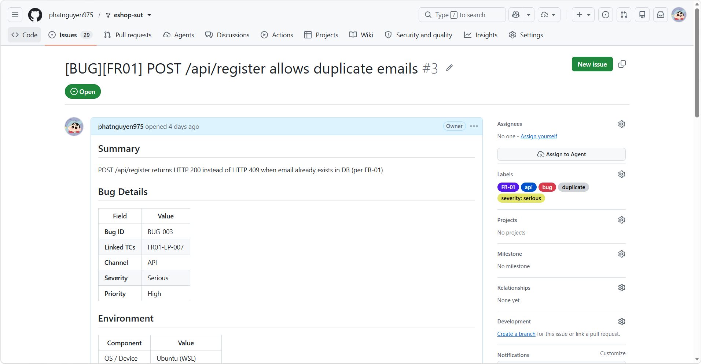
</p>

| Field            | Value                                                                                               |
| ---------------- | --------------------------------------------------------------------------------------------------- |
| **Bug ID**       | BUG-003                                                                                             |
| **Feature**      | FR-01 — Account Registration                                                                        |
| **Linked TCs**   | FR01-EP-007                                                                                         |
| **Channel**      | API                                                                                                 |
| **Summary**      | POST /api/register returns HTTP 200 instead of HTTP 409 when email already exists in DB (per FR-01) |
| **Status**       | New                                                                                                 |
| **Severity**     | Serious                                                                                             |
| **Priority**     | High                                                                                                |
| **Reported by**  | 23127449 - Nguyễn Tấn Phát                                                                          |
| **Date**         | 2026-06-14                                                                                          |
| **GitHub Issue** | [#3](https://github.com/phatnguyen975/eshop-sut/issues/3)                                           |

### Environment

| Component    | Value                    |
| ------------ | ------------------------ |
| OS / Device  | Ubuntu (WSL), Windows 11 |
| Runtime Env  | N/A (cURL test)          |
| Backend      | http://localhost:3000    |
| Frontend/App | N/A (API-only test)      |
| Test Account | test@eshop.com           |

### Steps to Reproduce

1. Ensure the EShop backend is running at http://localhost:3000.
2. Send the following request with an already registered email:
   ```bash
   curl -s -X POST http://localhost:3000/api/register \
      -H "Content-Type: application/json" \
      -d '{"name":"Duplicate User","email":"test@eshop.com","password":"Test@123"}'
   ```
3. Observe the HTTP response status code.
4. Observe the response body.

### Expected Behavior

Per **FR-01**:

> System must reject registration if email already exists in the system.

Specifically (based on Primary TC):

- HTTP 409 Conflict
- Response body: `{"message": "Email already exists"}`
- DB state: No additional user record created.

### Actual Behavior

- HTTP Status: `HTTP 200`
- Response Body:
  ```json
  { "message": "User registered successfully", "id": 5 }
  ```

### Severity Rationale

**Serious:** Allows multiple users to register with the exact same email, violating core business rules and breaking login functionality.

### Priority Rationale

**High:** Causes critical data integrity issues for the authentication flow.

## BUG-004

<p align="center">
  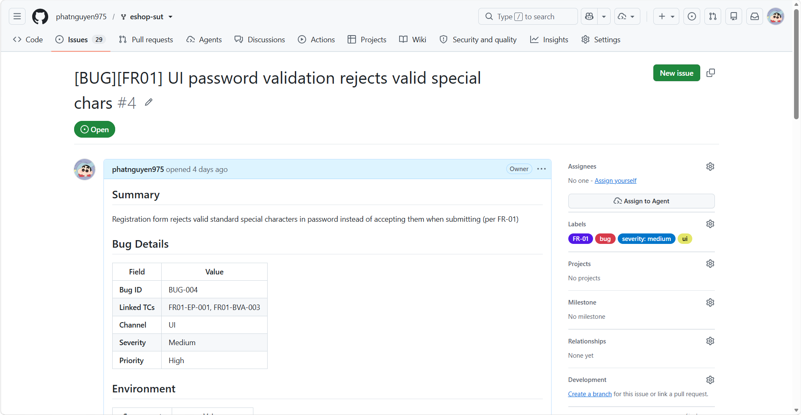
</p>

| Field            | Value                                                                                                                         |
| ---------------- | ----------------------------------------------------------------------------------------------------------------------------- |
| **Bug ID**       | BUG-004                                                                                                                       |
| **Feature**      | FR-01 — Account Registration                                                                                                  |
| **Linked TCs**   | FR01-EP-001, FR01-BVA-003                                                                                                     |
| **Channel**      | UI                                                                                                                            |
| **Summary**      | Registration form rejects valid standard special characters in password instead of accepting them when submitting (per FR-01) |
| **Status**       | New                                                                                                                           |
| **Severity**     | Medium                                                                                                                        |
| **Priority**     | High                                                                                                                          |
| **Reported by**  | 23127449 - Nguyễn Tấn Phát                                                                                                    |
| **Date**         | 2026-06-14                                                                                                                    |
| **GitHub Issue** | [#4](https://github.com/phatnguyen975/eshop-sut/issues/4)                                                                     |

### Environment

| Component    | Value                    |
| ------------ | ------------------------ |
| OS / Device  | Ubuntu (WSL), Windows 11 |
| Runtime Env  | Edge (Web Browser)       |
| Backend      | http://localhost:3000    |
| Frontend/App | http://localhost:5173    |
| Test Account | ep001@test.com           |

### Steps to Reproduce

1. Navigate to: http://localhost:5173/register
2. Fill `Name` with `Nguyen Van A`
3. Fill `Email` with `ep001@test.com`
4. Fill `Password` with `Test@123`
5. Click the "Register" button.
6. Observe: UI validation error message for the password field.

**This root cause also causes the following TCs to fail:** FR01-BVA-003.

### Expected Behavior

Per **FR-01**:

> Password must contain at least one special character from the allowed set.

Specifically (based on Primary TC):

- UI: Form is submitted successfully without validation errors for standard special characters like `@`.

### Actual Behavior

- UI: Password incorrectly rejected due to standard special character (requires space instead).

### Severity Rationale

**Medium:** Incorrect UI validation blocks valid passwords, deviating from SRS.

### Priority Rationale

**High:** Blocks users from registering with common, standard strong passwords.

## BUG-005

<p align="center">
  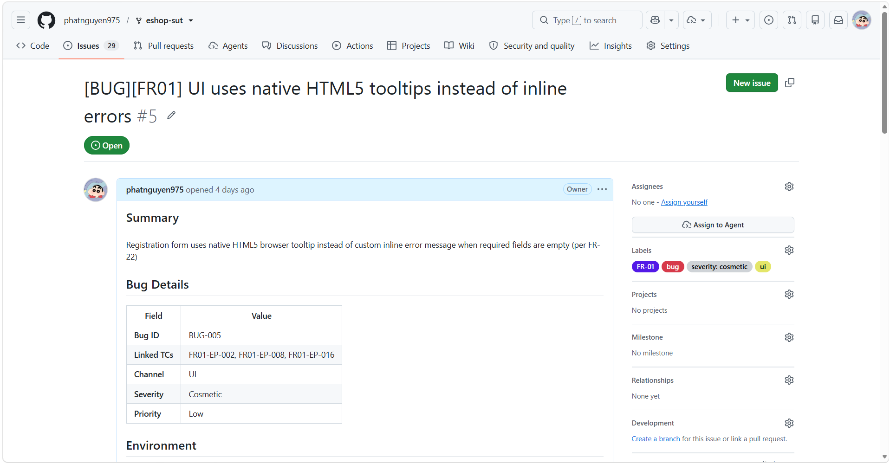
</p>

| Field            | Value                                                                                                                                 |
| ---------------- | ------------------------------------------------------------------------------------------------------------------------------------- |
| **Bug ID**       | BUG-005                                                                                                                               |
| **Feature**      | FR-01 — Account Registration                                                                                                          |
| **Linked TCs**   | FR01-EP-002, FR01-EP-008, FR01-EP-016                                                                                                 |
| **Channel**      | UI                                                                                                                                    |
| **Summary**      | Registration form uses native HTML5 browser tooltip instead of custom inline error message when required fields are empty (per FR-22) |
| **Status**       | New                                                                                                                                   |
| **Severity**     | Cosmetic                                                                                                                              |
| **Priority**     | Low                                                                                                                                   |
| **Reported by**  | 23127449 - Nguyễn Tấn Phát                                                                                                            |
| **Date**         | 2026-06-14                                                                                                                            |
| **GitHub Issue** | [#5](https://github.com/phatnguyen975/eshop-sut/issues/5)                                                                             |

### Environment

| Component    | Value                    |
| ------------ | ------------------------ |
| OS / Device  | Ubuntu (WSL), Windows 11 |
| Runtime Env  | Edge (Web Browser)       |
| Backend      | http://localhost:3000    |
| Frontend/App | http://localhost:5173    |
| Test Account | ep002@test.com           |

### Steps to Reproduce

1. Navigate to: http://localhost:5173/register
2. Fill `Name` with `""` (leave empty)
3. Fill `Email` with `ep002@test.com`
4. Fill `Password` with `Test@123`
5. Click the "Register" button.
6. Observe: Error presentation format.

**This root cause also causes the following TCs to fail:** FR01-EP-008, FR01-EP-016.

### Expected Behavior

Per **FR-22**:

> Forms must display custom inline error messages for missing required fields.

Specifically (based on Primary TC):

- UI: Custom inline error message displayed for the empty `Name` field.

### Actual Behavior

- UI: Relies on native browser HTML5 tooltip instead of custom inline error message.

### Severity Rationale

**Cosmetic:** Does not prevent registration but deviates from the expected custom UI design language.

### Priority Rationale

**Low:** Purely a visual / UX inconsistency.

## BUG-006

<p align="center">
  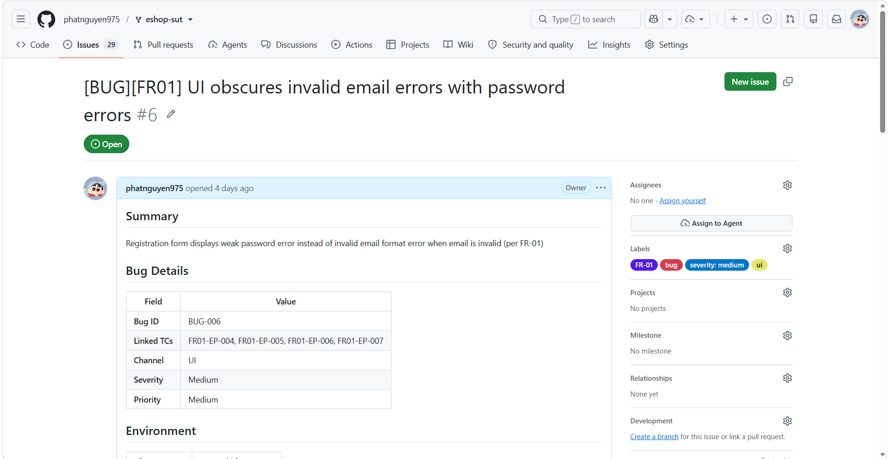
</p>

| Field            | Value                                                                                                                  |
| ---------------- | ---------------------------------------------------------------------------------------------------------------------- |
| **Bug ID**       | BUG-006                                                                                                                |
| **Feature**      | FR-01 — Account Registration                                                                                           |
| **Linked TCs**   | FR01-EP-004, FR01-EP-005, FR01-EP-006, FR01-EP-007                                                                     |
| **Channel**      | UI                                                                                                                     |
| **Summary**      | Registration form displays weak password error instead of invalid email format error when email is invalid (per FR-01) |
| **Status**       | New                                                                                                                    |
| **Severity**     | Medium                                                                                                                 |
| **Priority**     | Medium                                                                                                                 |
| **Reported by**  | 23127449 - Nguyễn Tấn Phát                                                                                             |
| **Date**         | 2026-06-14                                                                                                             |
| **GitHub Issue** | [#6](https://github.com/phatnguyen975/eshop-sut/issues/6)                                                              |

### Environment

| Component    | Value                    |
| ------------ | ------------------------ |
| OS / Device  | Ubuntu (WSL), Windows 11 |
| Runtime Env  | Edge (Web Browser)       |
| Backend      | http://localhost:3000    |
| Frontend/App | http://localhost:5173    |
| Test Account | invalidemail             |

### Steps to Reproduce

1. Navigate to: http://localhost:5173/register
2. Fill `Name` with `Nguyen Van A`
3. Fill `Email` with `invalidemail`
4. Fill `Password` with `Test@123`
5. Click the "Register" button.
6. Observe: Which validation error is displayed first.

**This root cause also causes the following TCs to fail:** FR01-EP-005, FR01-EP-006, FR01-EP-007.

### Expected Behavior

Per **FR-01**:

> Must validate all fields correctly and show specific inline errors for invalid email format.

Specifically (based on Primary TC):

- UI: Inline error on Email field indicating invalid email format.

### Actual Behavior

- UI: Displayed weak password error instead of invalid email format error.

### Severity Rationale

**Medium:** Confuses users by showing unrelated error messages due to incorrect execution order or shared validation state.

### Priority Rationale

**Medium:** UX issue that misleads users trying to fix form errors.

## BUG-007

<p align="center">
  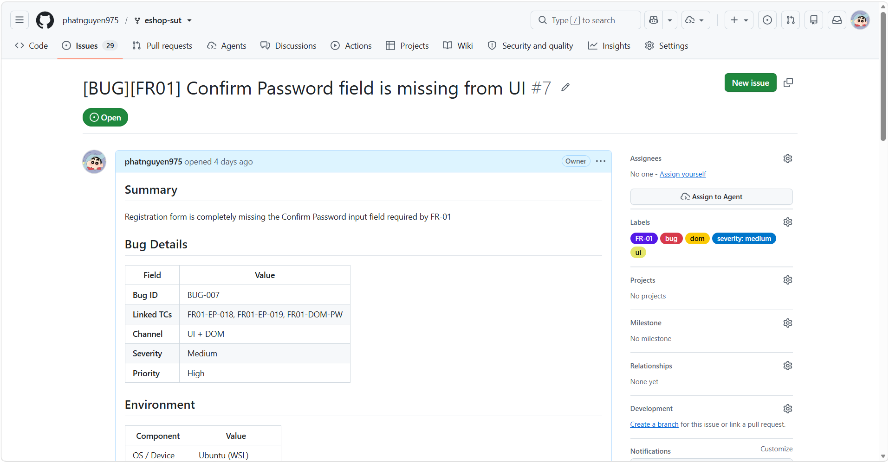
</p>

| Field            | Value                                                                                      |
| ---------------- | ------------------------------------------------------------------------------------------ |
| **Bug ID**       | BUG-007                                                                                    |
| **Feature**      | FR-01 — Account Registration                                                               |
| **Linked TCs**   | FR01-EP-018, FR01-EP-019, FR01-DOM-PW                                                      |
| **Channel**      | UI + DOM                                                                                   |
| **Summary**      | Registration form is completely missing the Confirm Password input field required by FR-01 |
| **Status**       | New                                                                                        |
| **Severity**     | Medium                                                                                     |
| **Priority**     | High                                                                                       |
| **Reported by**  | 23127449 - Nguyễn Tấn Phát                                                                 |
| **Date**         | 2026-06-14                                                                                 |
| **GitHub Issue** | [#7](https://github.com/phatnguyen975/eshop-sut/issues/7)                                  |

### Environment

| Component    | Value                    |
| ------------ | ------------------------ |
| OS / Device  | Ubuntu (WSL), Windows 11 |
| Runtime Env  | Edge (Web Browser)       |
| Backend      | http://localhost:3000    |
| Frontend/App | http://localhost:5173    |
| Test Account | N/A                      |

### Steps to Reproduce

1. Navigate to: http://localhost:5173/register
2. Observe: The available input fields on the registration form.

**This root cause also causes the following TCs to fail:** FR01-EP-019, FR01-DOM-PW.

### Expected Behavior

Per **FR-01**:

> The form must have Password and Confirm Password inputs.

Specifically (based on Primary TC):

- UI: "Confirm Password" field is visible and validates against the "Password" field.

### Actual Behavior

- UI: Confirm Password input field is entirely missing from the UI.

### Severity Rationale

**Medium:** Missing UI element explicitly required by the SRS, removing the ability to prevent typos in passwords during registration.

### Priority Rationale

**High:** Missing a core standard form component on the registration flow.

## BUG-008

<p align="center">
  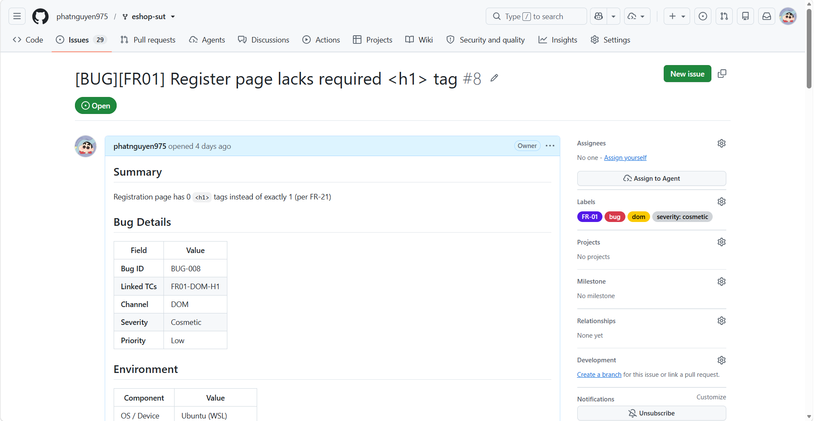
</p>

| Field            | Value                                                                |
| ---------------- | -------------------------------------------------------------------- |
| **Bug ID**       | BUG-008                                                              |
| **Feature**      | FR-01 — Account Registration                                         |
| **Linked TCs**   | FR01-DOM-H1                                                          |
| **Channel**      | DOM                                                                  |
| **Summary**      | Registration page has 0 `<h1>` tags instead of exactly 1 (per FR-21) |
| **Status**       | New                                                                  |
| **Severity**     | Cosmetic                                                             |
| **Priority**     | Low                                                                  |
| **Reported by**  | 23127449 - Nguyễn Tấn Phát                                           |
| **Date**         | 2026-06-14                                                           |
| **GitHub Issue** | [#8](https://github.com/phatnguyen975/eshop-sut/issues/8)            |

### Environment

| Component    | Value                    |
| ------------ | ------------------------ |
| OS / Device  | Ubuntu (WSL), Windows 11 |
| Runtime Env  | Edge (Web Browser)       |
| Backend      | http://localhost:3000    |
| Frontend/App | http://localhost:5173    |
| Test Account | N/A                      |

### Steps to Reproduce

1. Navigate to: http://localhost:5173/register
2. Open DevTools: F12 → Console tab.
3. Paste the following and press Enter:

   ```js
   (function FR01DOMChecks() {
     "use strict";

     let pass = 0,
       fail = 0;
     const results = [];

     function check(tcId, description, expected, actualFn) {
       let actual, status;
       try {
         actual = actualFn();
         const ok =
           expected === "EXISTS"
             ? actual !== null && actual !== undefined && actual !== "NOT_FOUND"
             : String(actual) === String(expected);
         status = ok ? "PASS" : "FAIL";
       } catch (e) {
         actual = "ERROR: " + e.message;
         status = "FAIL";
       }
       status === "PASS" ? pass++ : fail++;
       results.push({ tcId, description, expected, actual, status });
     }

     // DOM-H1: Exactly 1 <h1> tag (per FR-21 — all web pages)
     check("FR01-DOM-H1", "Page has exactly 1 <h1> tag (per FR-21)", "1", () =>
       String(document.querySelectorAll("h1").length),
     );

     console.log(
       "%c━━━━━━━━━━━━━━━━━━━━━━━━━━━━━━━━━━━━━━━━━━━━━━━━━━━━━━━━━━━━━━",
       "font-weight: bold",
     );
     console.log(
       "%c FR-01 DOM CHECK RESULTS",
       "font-weight: bold; font-size: 14px",
     );
     console.log(
       "%c━━━━━━━━━━━━━━━━━━━━━━━━━━━━━━━━━━━━━━━━━━━━━━━━━━━━━━━━━━━━━━",
       "font-weight: bold",
     );

     results.forEach((r) => {
       const color =
         r.status === "PASS"
           ? "color: green; font-weight: bold"
           : "color: red; font-weight: bold";
       console.log(
         `%c[${r.status}] %c${r.tcId} — ${r.description}`,
         color,
         "color: inherit",
       );
       console.log(`       Expected: ${r.expected} | Actual: ${r.actual}`);
     });

     console.log(
       "%c━━━━━━━━━━━━━━━━━━━━━━━━━━━━━━━━━━━━━━━━━━━━━━━━━━━━━━━━━━━━━━",
       "font-weight: bold",
     );
     console.log(
       `TOTAL: %c${pass} PASS%c | %c${fail} FAIL`,
       "color: green; font-weight: bold",
       "color: inherit",
       "color: red; font-weight: bold",
     );
   })();
   ```

4. Observe the FAIL output in the console.

### Expected Behavior

Per **FR-21**:

> Every web page must have exactly one `<h1>` tag.

Specifically:

- DOM should contain 1 `<h1>` element.

### Actual Behavior

- UI: DOM has 0 `<h1>` elements.

### Severity Rationale

**Cosmetic:** DOM structure deviation that doesn't block functional workflows.

### Priority Rationale

**Low:** Minor SEO / Accessibility deviation.

## BUG-009

<p align="center">
  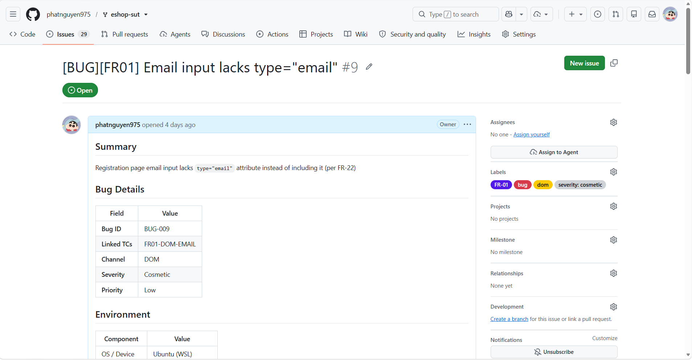
</p>

| Field            | Value                                                                                            |
| ---------------- | ------------------------------------------------------------------------------------------------ |
| **Bug ID**       | BUG-009                                                                                          |
| **Feature**      | FR-01 — Account Registration                                                                     |
| **Linked TCs**   | FR01-DOM-EMAIL                                                                                   |
| **Channel**      | DOM                                                                                              |
| **Summary**      | Registration page email input lacks `type="email"` attribute instead of including it (per FR-22) |
| **Status**       | New                                                                                              |
| **Severity**     | Cosmetic                                                                                         |
| **Priority**     | Low                                                                                              |
| **Reported by**  | 23127449 - Nguyễn Tấn Phát                                                                       |
| **Date**         | 2026-06-14                                                                                       |
| **GitHub Issue** | [#9](https://github.com/phatnguyen975/eshop-sut/issues/9)                                        |

### Environment

| Component    | Value                    |
| ------------ | ------------------------ |
| OS / Device  | Ubuntu (WSL), Windows 11 |
| Runtime Env  | Edge (Web Browser)       |
| Backend      | http://localhost:3000    |
| Frontend/App | http://localhost:5173    |
| Test Account | N/A                      |

### Steps to Reproduce

1. Navigate to: http://localhost:5173/register
2. Open DevTools: F12 → Console tab.
3. Paste the following and press Enter:

   ```js
   (function FR01DOMChecks() {
     "use strict";

     let pass = 0,
       fail = 0;
     const results = [];

     function check(tcId, description, expected, actualFn) {
       let actual, status;
       try {
         actual = actualFn();
         const ok =
           expected === "EXISTS"
             ? actual !== null && actual !== undefined && actual !== "NOT_FOUND"
             : String(actual) === String(expected);
         status = ok ? "PASS" : "FAIL";
       } catch (e) {
         actual = "ERROR: " + e.message;
         status = "FAIL";
       }
       status === "PASS" ? pass++ : fail++;
       results.push({ tcId, description, expected, actual, status });
     }

     // DOM-EMAIL: Email input type="email" (per FR-22)
     check(
       "FR01-DOM-EMAIL",
       'Email input has type="email" (per FR-22)',
       "email",
       () => {
         const el =
           document.querySelector(
             'input[name="email"], input[autocomplete="email"]',
           ) || document.querySelector('input[type="email"]');
         return el
           ? el.type
           : "No email field found or input type is not email";
       },
     );

     console.log(
       "%c━━━━━━━━━━━━━━━━━━━━━━━━━━━━━━━━━━━━━━━━━━━━━━━━━━━━━━━━━━━━━━",
       "font-weight: bold",
     );
     console.log(
       "%c FR-01 DOM CHECK RESULTS",
       "font-weight: bold; font-size: 14px",
     );
     console.log(
       "%c━━━━━━━━━━━━━━━━━━━━━━━━━━━━━━━━━━━━━━━━━━━━━━━━━━━━━━━━━━━━━━",
       "font-weight: bold",
     );

     results.forEach((r) => {
       const color =
         r.status === "PASS"
           ? "color: green; font-weight: bold"
           : "color: red; font-weight: bold";
       console.log(
         `%c[${r.status}] %c${r.tcId} — ${r.description}`,
         color,
         "color: inherit",
       );
       console.log(`       Expected: ${r.expected} | Actual: ${r.actual}`);
     });

     console.log(
       "%c━━━━━━━━━━━━━━━━━━━━━━━━━━━━━━━━━━━━━━━━━━━━━━━━━━━━━━━━━━━━━━",
       "font-weight: bold",
     );
     console.log(
       `TOTAL: %c${pass} PASS%c | %c${fail} FAIL`,
       "color: green; font-weight: bold",
       "color: inherit",
       "color: red; font-weight: bold",
     );
   })();
   ```

4. Observe the FAIL output in the console.

### Expected Behavior

Per **FR-22**:

> Email inputs must use `type="email"`.

Specifically:

- DOM should return "email" for the input type.

### Actual Behavior

- UI: Email input has type text or lacks `type="email"`.

### Severity Rationale

**Cosmetic:** Deviates from standard HTML5 semantics.

### Priority Rationale

**Low:** Mobile keyboard optimizations won't trigger for this field.

## BUG-010

<p align="center">
  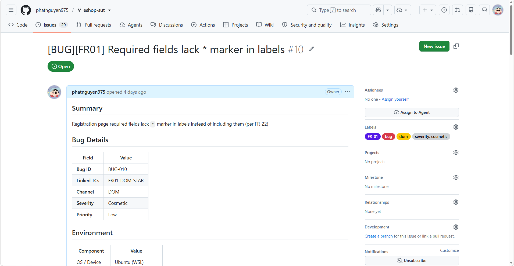
</p>

| Field            | Value                                                                                             |
| ---------------- | ------------------------------------------------------------------------------------------------- |
| **Bug ID**       | BUG-010                                                                                           |
| **Feature**      | FR-01 — Account Registration                                                                      |
| **Linked TCs**   | FR01-DOM-STAR                                                                                     |
| **Channel**      | DOM                                                                                               |
| **Summary**      | Registration page required fields lack `*` marker in labels instead of including them (per FR-22) |
| **Status**       | New                                                                                               |
| **Severity**     | Cosmetic                                                                                          |
| **Priority**     | Low                                                                                               |
| **Reported by**  | 23127449 - Nguyễn Tấn Phát                                                                        |
| **Date**         | 2026-06-14                                                                                        |
| **GitHub Issue** | [#10](https://github.com/phatnguyen975/eshop-sut/issues/10)                                       |

### Environment

| Component    | Value                    |
| ------------ | ------------------------ |
| OS / Device  | Ubuntu (WSL), Windows 11 |
| Runtime Env  | Edge (Web Browser)       |
| Backend      | http://localhost:3000    |
| Frontend/App | http://localhost:5173    |
| Test Account | N/A                      |

### Steps to Reproduce

1. Navigate to: http://localhost:5173/register
2. Open DevTools: F12 → Console tab.
3. Paste the following and press Enter:

   ```js
   (function FR01DOMChecks() {
     "use strict";

     let pass = 0,
       fail = 0;
     const results = [];

     function check(tcId, description, expected, actualFn) {
       let actual, status;
       try {
         actual = actualFn();
         const ok =
           expected === "EXISTS"
             ? actual !== null && actual !== undefined && actual !== "NOT_FOUND"
             : String(actual) === String(expected);
         status = ok ? "PASS" : "FAIL";
       } catch (e) {
         actual = "ERROR: " + e.message;
         status = "FAIL";
       }
       status === "PASS" ? pass++ : fail++;
       results.push({ tcId, description, expected, actual, status });
     }

     // DOM-STAR: Required fields have * label marker (per FR-22)
     check(
       "FR01-DOM-STAR",
       "Required fields have * in label (per FR-22)",
       "Has * markers",
       () => {
         const labels = Array.from(document.querySelectorAll("label"));
         const stars = labels.filter((l) => l.textContent.trim().includes("*"));
         if (stars.length > 0) return "Has * markers";
         return "0 labels with *";
       },
     );

     console.log(
       "%c━━━━━━━━━━━━━━━━━━━━━━━━━━━━━━━━━━━━━━━━━━━━━━━━━━━━━━━━━━━━━━",
       "font-weight: bold",
     );
     console.log(
       "%c FR-01 DOM CHECK RESULTS",
       "font-weight: bold; font-size: 14px",
     );
     console.log(
       "%c━━━━━━━━━━━━━━━━━━━━━━━━━━━━━━━━━━━━━━━━━━━━━━━━━━━━━━━━━━━━━━",
       "font-weight: bold",
     );

     results.forEach((r) => {
       const color =
         r.status === "PASS"
           ? "color: green; font-weight: bold"
           : "color: red; font-weight: bold";
       console.log(
         `%c[${r.status}] %c${r.tcId} — ${r.description}`,
         color,
         "color: inherit",
       );
       console.log(`       Expected: ${r.expected} | Actual: ${r.actual}`);
     });

     console.log(
       "%c━━━━━━━━━━━━━━━━━━━━━━━━━━━━━━━━━━━━━━━━━━━━━━━━━━━━━━━━━━━━━━",
       "font-weight: bold",
     );
     console.log(
       `TOTAL: %c${pass} PASS%c | %c${fail} FAIL`,
       "color: green; font-weight: bold",
       "color: inherit",
       "color: red; font-weight: bold",
     );
   })();
   ```

4. Observe the FAIL output in the console.

### Expected Behavior

Per **FR-22**:

> Required fields must be marked with a `*` in their labels.

Specifically:

- UI labels should visually show `*`.

### Actual Behavior

- UI: 0 labels found with `*`.

### Severity Rationale

**Cosmetic:** Visual UX deviation from SRS.

### Priority Rationale

**Low:** Minor UX inconsistency.

# FR-07: Shopping Cart

**Generated by:** bug-report-writer skill  
**Date:** 2026-06-17  
**Total bugs:** 7

## BUG-001

<p align="center">
  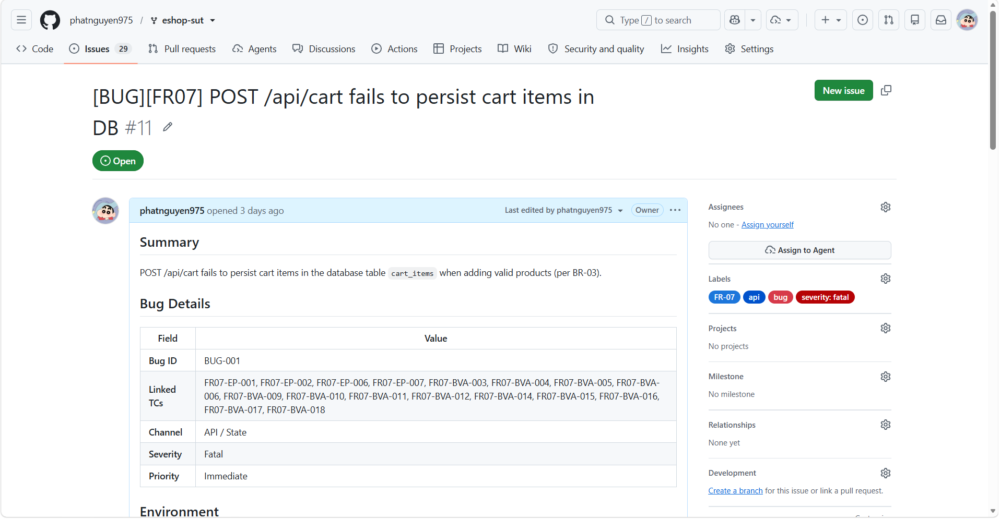
</p>

| Field            | Value                                                                                                                                                                                                                                    |
| ---------------- | ---------------------------------------------------------------------------------------------------------------------------------------------------------------------------------------------------------------------------------------- |
| **Bug ID**       | BUG-001                                                                                                                                                                                                                                  |
| **Feature**      | FR-07 — Shopping Cart                                                                                                                                                                                                                    |
| **Linked TCs**   | FR07-EP-001, FR07-EP-002, FR07-EP-006, FR07-EP-007, FR07-BVA-003, FR07-BVA-004, FR07-BVA-005, FR07-BVA-006, FR07-BVA-009, FR07-BVA-010, FR07-BVA-011, FR07-BVA-012, FR07-BVA-014, FR07-BVA-015, FR07-BVA-016, FR07-BVA-017, FR07-BVA-018 |
| **Channel**      | API + State                                                                                                                                                                                                                              |
| **Summary**      | POST /api/cart fails to persist cart items in the database table `cart_items` when adding valid products (per BR-03)                                                                                                                     |
| **Status**       | New                                                                                                                                                                                                                                      |
| **Severity**     | Fatal                                                                                                                                                                                                                                    |
| **Priority**     | Immediate                                                                                                                                                                                                                                |
| **Reported by**  | 23127449 - Nguyến Tấn Phát                                                                                                                                                                                                               |
| **Date**         | 2026-06-16                                                                                                                                                                                                                               |
| **GitHub Issue** | [#11](https://github.com/phatnguyen975/eshop-sut/issues/11)                                                                                                                                                                              |

### Environment

| Component    | Value                     |
| ------------ | ------------------------- |
| OS / Device  | Ubuntu (WSL) / Windows 11 |
| Runtime Env  | Node.js / cURL test       |
| Backend      | http://localhost:3000     |
| Frontend/App | N/A (API-only test)       |
| Test Account | test@eshop.com            |

### Steps to Reproduce

1. Ensure the EShop backend is running at http://localhost:3000.
2. Obtain a user JWT:
   ```bash
   curl -s -X POST http://localhost:3000/api/login \
     -H "Content-Type: application/json" \
     -d '{"email":"test@eshop.com","password":"Test1234!"}'
   ```
   Copy the `token` field from the response.
3. Send the following request to add an item to the cart:
   ```bash
   curl -s -X POST http://localhost:3000/api/cart \
     -H "Content-Type: application/json" \
     -H "Authorization: Bearer <token>" \
     -d '{"id":1, "name":"TestCartProduct", "price":100000, "quantity":2}'
   ```
4. Query the database to verify persistence:
   ```bash
   sqlite3 backend/database.sqlite "SELECT quantity FROM cart_items WHERE user_id=2 AND product_id=1;"
   ```

**This root cause also causes the following TCs to fail:** FR07-EP-002, FR07-EP-006, FR07-EP-007, FR07-BVA-003, FR07-BVA-004, FR07-BVA-005, FR07-BVA-006, FR07-BVA-009, FR07-BVA-010, FR07-BVA-011, FR07-BVA-012, FR07-BVA-014, FR07-BVA-015, FR07-BVA-016, FR07-BVA-017, FR07-BVA-018

### Expected Behavior

Per **BR-03** and the backend architecture design:

> The shopping cart state must be preserved in the `cart_items` database table so that logged-in users retain their carts across sessions.

Specifically:

- DB state: The query should return `2` (the quantity).

### Actual Behavior

- DB State: `Error: in prepare, no such table: cart_items` (The backend stores the cart in a transient memory array `userCarts` instead of persisting to SQLite).

### Evidence

**Evidence:** `evidence/api-responses/FR07/` and SQLite output.

### Severity Rationale

**Fatal:** The total failure to use database persistence means cart data is wiped every time the server restarts or scales. This causes massive data loss for users and completely breaks the e-commerce flow.

### Priority Rationale

**Immediate:** Blocks all state-dependent downstream testing. Must be fixed before any other Cart or Checkout tests can be reliably automated against the database.

## BUG-002

<p align="center">
  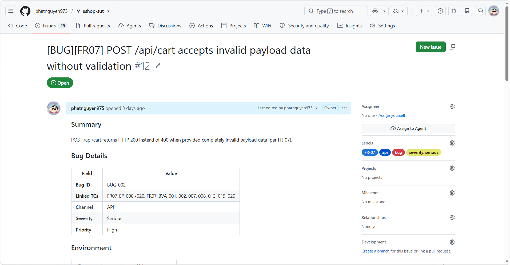
</p>

| Field            | Value                                                                                                    |
| ---------------- | -------------------------------------------------------------------------------------------------------- |
| **Bug ID**       | BUG-002                                                                                                  |
| **Feature**      | FR-07 — Shopping Cart                                                                                    |
| **Linked TCs**   | FR07-EP-008~020, FR07-BVA-001, 002, 007, 008, 013, 019, 020                                              |
| **Channel**      | API                                                                                                      |
| **Summary**      | POST /api/cart returns HTTP 200 instead of 400 when provided completely invalid payload data (per FR-07) |
| **Status**       | New                                                                                                      |
| **Severity**     | Serious                                                                                                  |
| **Priority**     | High                                                                                                     |
| **Reported by**  | 23127449 - Nguyến Tấn Phát                                                                               |
| **Date**         | 2026-06-16                                                                                               |
| **GitHub Issue** | [#12](https://github.com/phatnguyen975/eshop-sut/issues/12)                                              |

### Environment

| Component    | Value                     |
| ------------ | ------------------------- |
| OS / Device  | Ubuntu (WSL) / Windows 11 |
| Runtime Env  | Node.js / cURL test       |
| Backend      | http://localhost:3000     |
| Frontend/App | N/A (API-only test)       |
| Test Account | test@eshop.com            |

### Steps to Reproduce

1. Ensure the EShop backend is running at http://localhost:3000.
2. Obtain a user JWT:
   ```bash
   curl -s -X POST http://localhost:3000/api/login \
     -H "Content-Type: application/json" \
     -d '{"email":"test@eshop.com","password":"Test1234!"}'
   ```
3. Send the following request with an invalid/non-existent product ID (`99999`):
   ```bash
   curl -s -X POST http://localhost:3000/api/cart \
     -H "Content-Type: application/json" \
     -H "Authorization: Bearer <token>" \
     -d '{"id":99999, "name":"TestCartProduct", "price":100000, "quantity":1}'
   ```
4. Observe the HTTP response status code.

This root cause also causes **all validation checks** (negative price, null quantity, 1000-character name strings) to fail across EP-008 through EP-020 and boundary points.

### Expected Behavior

Per **FR-07** implicit constraints:

> The API must validate incoming payloads and reject missing fields, malformed types, negative values, and non-existent identifiers.

Specifically:

- HTTP 400 Bad Request or HTTP 404 Not Found.

### Actual Behavior

- HTTP Status: `HTTP 200 OK` (The backend blindly pushes any received object into the transient cart array without validation).

### Evidence

**Evidence:** `evidence/api-responses/FR07/` JSON responses.

### Severity Rationale

**Serious:** Accepting unvalidated input allows malicious actors to manipulate cart prices (e.g., negative totals) or break the checkout flow by passing invalid product IDs.

### Priority Rationale

**High:** This compromises data integrity at the entry point of the purchasing funnel. Validation middleware needs to be implemented immediately.

## BUG-003

<p align="center">
  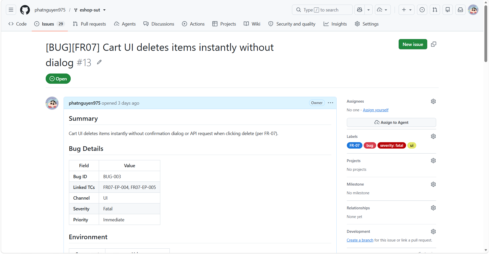
</p>

| Field            | Value                                                                                                       |
| ---------------- | ----------------------------------------------------------------------------------------------------------- |
| **Bug ID**       | BUG-003                                                                                                     |
| **Feature**      | FR-07 — Shopping Cart                                                                                       |
| **Linked TCs**   | FR07-EP-004, FR07-EP-005                                                                                    |
| **Channel**      | UI                                                                                                          |
| **Summary**      | Cart UI deletes items instantly without confirmation dialog or API request when clicking delete (per FR-07) |
| **Status**       | New                                                                                                         |
| **Severity**     | Fatal                                                                                                       |
| **Priority**     | Immediate                                                                                                   |
| **Reported by**  | 23127449 - Nguyến Tấn Phát                                                                                  |
| **Date**         | 2026-06-16                                                                                                  |
| **GitHub Issue** | [#13](https://github.com/phatnguyen975/eshop-sut/issues/13)                                                 |

### Environment

| Component    | Value                     |
| ------------ | ------------------------- |
| OS / Device  | Ubuntu (WSL) / Windows 11 |
| Runtime Env  | Edge Web Browser          |
| Backend      | http://localhost:3000     |
| Frontend/App | http://localhost:5173     |
| Test Account | test@eshop.com            |

### Steps to Reproduce

1. Navigate to: http://localhost:5173/products
2. Log in with email="test@eshop.com", password="Test1234!".
3. Add a product to the cart.
4. Navigate to the Cart page (http://localhost:5173/cart).
5. Click the "Xóa" (Delete) button next to the product.
6. Observe the immediate deletion and lack of network request.

_Note: This root cause also blocks FR07-EP-005 from testing the "Cancel" flow._

### Expected Behavior

Per **FR-07**:

> "Nút Xóa sản phẩm phải có dialog xác nhận trước khi thực hiện." (Delete button must have a confirmation dialog).

Specifically:

- UI: A confirmation dialog should appear. If confirmed, a `DELETE /api/cart/:id` network request should be dispatched to the backend.

### Actual Behavior

- UI: No confirmation dialog appears; item deleted instantly from the UI.
- Network: No API request is sent. The deletion happens exclusively in transient local React state.

### Evidence

**Evidence:** `evidence/screenshots/FR07/BUG-003.png`

### Severity Rationale

**Fatal:** This completely violates the functional requirement for safety dialogs, and worse, entirely disconnects the frontend from the backend. The cart is fake and un-purchasable.

### Priority Rationale

**Immediate:** The frontend integration for the Cart is fundamentally broken and must be wired to actual API endpoints before any meaningful user flows can occur.

## BUG-004

<p align="center">
  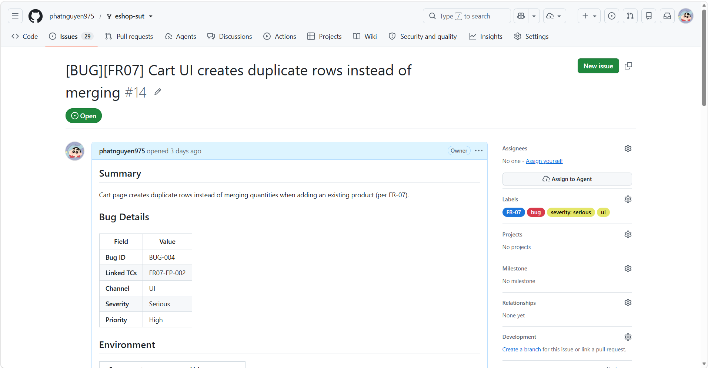
</p>

| Field            | Value                                                                                                      |
| ---------------- | ---------------------------------------------------------------------------------------------------------- |
| **Bug ID**       | BUG-004                                                                                                    |
| **Feature**      | FR-07 — Shopping Cart                                                                                      |
| **Linked TCs**   | FR07-EP-002                                                                                                |
| **Channel**      | UI                                                                                                         |
| **Summary**      | Cart page creates duplicate rows instead of merging quantities when adding an existing product (per FR-07) |
| **Status**       | New                                                                                                        |
| **Severity**     | Serious                                                                                                    |
| **Priority**     | High                                                                                                       |
| **Reported by**  | 23127449 - Nguyến Tấn Phát                                                                                 |
| **Date**         | 2026-06-16                                                                                                 |
| **GitHub Issue** | [#14](https://github.com/phatnguyen975/eshop-sut/issues/14)                                                |

### Environment

| Component    | Value                     |
| ------------ | ------------------------- |
| OS / Device  | Ubuntu (WSL) / Windows 11 |
| Runtime Env  | Edge Web Browser          |
| Backend      | http://localhost:3000     |
| Frontend/App | http://localhost:5173     |
| Test Account | test@eshop.com            |

### Steps to Reproduce

1. Navigate to: http://localhost:5173/products
2. Log in with email="test@eshop.com", password="Test1234!".
3. Click "Thêm vào giỏ hàng" for Product A.
4. Click "Thêm vào giỏ hàng" for Product A again.
5. Navigate to the Cart page.
6. Observe the cart rows.

### Expected Behavior

Per **FR-07**:

> "Thêm cùng một sản phẩm vào giỏ sẽ tăng số lượng, không tạo dòng mới." (Adding the same product to the cart increments the quantity, does not create a new row).

Specifically:

- UI: The cart should display one row for Product A with a quantity of 2.

### Actual Behavior

- UI: The cart displays two completely separate rows for Product A, each with a quantity of 1.

### Evidence

**Evidence:** `evidence/screenshots/FR07/BUG-004.png`

### Severity Rationale

**Serious:** Directly violates a core cart business rule. This confuses the user and makes calculating totals artificially complex or broken.

### Priority Rationale

**High:** The merge logic is a standard expectation in e-commerce and needs to be corrected in both the frontend display and backend handling.

## BUG-005

<p align="center">
  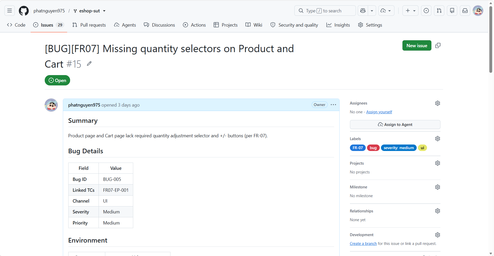
</p>

| Field            | Value                                                                                             |
| ---------------- | ------------------------------------------------------------------------------------------------- |
| **Bug ID**       | BUG-005                                                                                           |
| **Feature**      | FR-07 — Shopping Cart                                                                             |
| **Linked TCs**   | FR07-EP-001                                                                                       |
| **Channel**      | UI                                                                                                |
| **Summary**      | Product page and Cart page lack required quantity adjustment selector and +/- buttons (per FR-07) |
| **Status**       | New                                                                                               |
| **Severity**     | Medium                                                                                            |
| **Priority**     | Medium                                                                                            |
| **Reported by**  | 23127449 - Nguyến Tấn Phát                                                                        |
| **Date**         | 2026-06-16                                                                                        |
| **GitHub Issue** | [#15](https://github.com/phatnguyen975/eshop-sut/issues/15)                                       |

### Environment

| Component    | Value                     |
| ------------ | ------------------------- |
| OS / Device  | Ubuntu (WSL) / Windows 11 |
| Runtime Env  | Edge Web Browser          |
| Backend      | http://localhost:3000     |
| Frontend/App | http://localhost:5173     |
| Test Account | test@eshop.com            |

### Steps to Reproduce

1. Navigate to: http://localhost:5173/products
2. Log in with email="test@eshop.com", password="Test1234!".
3. Click on a product to view its details.
4. Observe the lack of a quantity input field before adding to cart.
5. Add the item to the cart and navigate to http://localhost:5173/cart.
6. Observe the quantity column.

### Expected Behavior

Per **FR-07**:

> "Hiển thị danh sách sản phẩm với các cột: Sản phẩm, Đơn giá, Số lượng (có nút +/- để chỉnh)..." (Quantity column must have +/- buttons to adjust).

Specifically:

- UI: The user should be able to select quantity before adding, and adjust it via +/- buttons in the cart.

### Actual Behavior

- UI: The product page lacks a quantity selection input. Inside the cart, the product defaults to quantity 1 and there are no +/- buttons to adjust the quantity.

### Evidence

**Evidence:** `evidence/screenshots/FR07/BUG-005.png`

### Severity Rationale

**Medium:** The missing UI controls violate the UI specification, forcing users to click "Add to Cart" repeatedly on the product list to simulate purchasing multiple items.

### Priority Rationale

**Medium:** While annoying, users can theoretically still buy items (if the merge bug BUG-004 didn't exist). Needs fixing for a proper UX flow.

## BUG-006

<p align="center">
  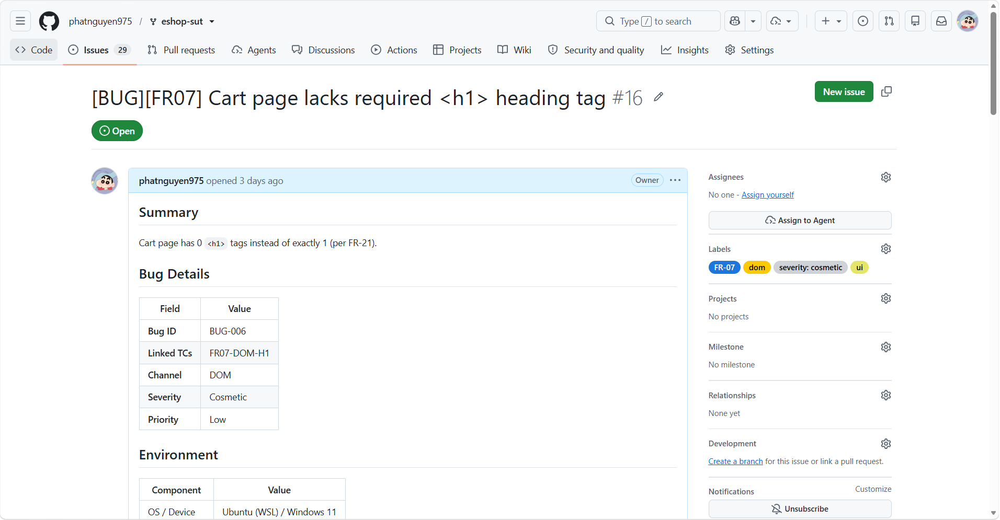
</p>

| Field            | Value                                                        |
| ---------------- | ------------------------------------------------------------ |
| **Bug ID**       | BUG-006                                                      |
| **Feature**      | FR-07 — Shopping Cart                                        |
| **Linked TCs**   | FR07-DOM-H1                                                  |
| **Channel**      | DOM                                                          |
| **Summary**      | Cart page has 0 `<h1>` tags instead of exactly 1 (per FR-21) |
| **Status**       | New                                                          |
| **Severity**     | Cosmetic                                                     |
| **Priority**     | Low                                                          |
| **Reported by**  | 23127449 - Nguyến Tấn Phát                                   |
| **Date**         | 2026-06-16                                                   |
| **GitHub Issue** | [#16](https://github.com/phatnguyen975/eshop-sut/issues/16)  |

### Environment

| Component    | Value                     |
| ------------ | ------------------------- |
| OS / Device  | Ubuntu (WSL) / Windows 11 |
| Runtime Env  | Edge Web Browser          |
| Backend      | http://localhost:3000     |
| Frontend/App | http://localhost:5173     |
| Test Account | N/A                       |

### Steps to Reproduce

1. Navigate to: http://localhost:5173/cart
2. Open DevTools: F12 → Console tab.
3. Paste the following and press Enter:

   ```javascript
   (function FR07DOMChecks() {
     "use strict";

     let pass = 0,
       fail = 0;
     const results = [];

     function check(tcId, description, expected, actualFn) {
       let actual, status;
       try {
         actual = actualFn();
         const ok = String(actual) === String(expected);
         status = ok ? "PASS" : "FAIL";
       } catch (e) {
         actual = "ERROR: " + e.message;
         status = "FAIL";
       }
       status === "PASS" ? pass++ : fail++;
       results.push({ tcId, description, expected, actual, status });
     }

     // FR07-DOM-H1: Exactly 1 <h1> tag
     check("FR07-DOM-H1", "Page has exactly 1 <h1> tag (per FR-21)", "1", () =>
       String(document.querySelectorAll("h1").length),
     );

     console.log(
       "%c\n========================================",
       "font-weight: bold;",
     );
     console.log(
       "%c FR-07 DOM CHECK RESULTS                ",
       "font-weight: bold;",
     );
     console.log(
       "%c========================================",
       "font-weight: bold;",
     );

     results.forEach((r) => {
       const c =
         r.status === "PASS" ? "color: green" : "color: red; font-weight: bold";
       console.log(`%c[${r.status}] ${r.tcId} — ${r.description}`, c);
       console.log(`%c      Expected: ${r.expected} | Actual: ${r.actual}`, c);
     });

     console.log(
       "%c========================================",
       "font-weight: bold;",
     );
     console.log(
       `TOTAL: %c${pass} PASS%c | %c${fail} FAIL`,
       "color: green; font-weight: bold",
       "color: inherit",
       "color: red; font-weight: bold",
     );
   })();
   ```

4. Observe the output in the console.

### Expected Behavior

Per **FR-21**:

> "Mỗi trang có đúng 1 thẻ `<h1>` mô tả nội dung trang." (Every page must contain exactly one `<h1>` tag describing its content).

Specifically:

- 1 `<h1>` tag expected.

### Actual Behavior

- `0` tags found.

### Evidence

**Evidence:** `evidence/screenshots/FR07/BUG-006.png`

### Severity Rationale

**Cosmetic:** Missing an `<h1>` tag is an SEO and accessibility violation but does not block any core functionality for end users.

### Priority Rationale

**Low:** Can be fixed quickly but is not critical to the application's functional requirements.

## BUG-007

<p align="center">
  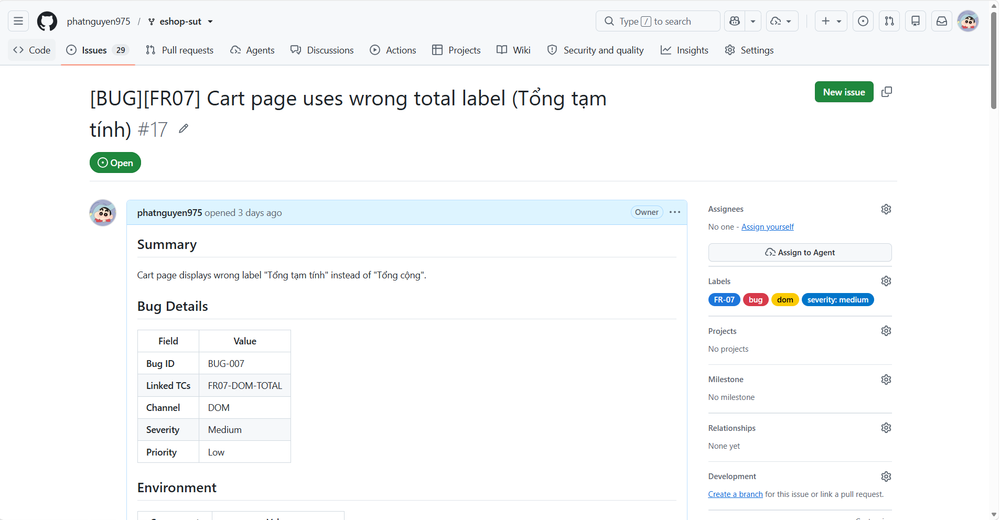
</p>

| Field            | Value                                                                 |
| ---------------- | --------------------------------------------------------------------- |
| **Bug ID**       | BUG-007                                                               |
| **Feature**      | FR-07 — Shopping Cart                                                 |
| **Linked TCs**   | FR07-DOM-TOTAL                                                        |
| **Channel**      | DOM                                                                   |
| **Summary**      | Cart page displays wrong label "Tổng tạm tính" instead of "Tổng cộng" |
| **Status**       | New                                                                   |
| **Severity**     | Medium                                                                |
| **Priority**     | Low                                                                   |
| **Reported by**  | 23127449 - Nguyến Tấn Phát                                            |
| **Date**         | 2026-06-16                                                            |
| **GitHub Issue** | [#17](https://github.com/phatnguyen975/eshop-sut/issues/17)           |

### Environment

| Component    | Value                     |
| ------------ | ------------------------- |
| OS / Device  | Ubuntu (WSL) / Windows 11 |
| Runtime Env  | Edge Web Browser          |
| Backend      | http://localhost:3000     |
| Frontend/App | http://localhost:5173     |
| Test Account | test@eshop.com            |

### Steps to Reproduce

1. Navigate to: http://localhost:5173/cart
2. Open DevTools: F12 → Console tab.
3. Paste the following and press Enter:

   ```js
   (function FR07DOMChecks() {
     "use strict";

     let pass = 0,
       fail = 0;
     const results = [];

     function check(tcId, description, expected, actualFn) {
       let actual, status;
       try {
         actual = actualFn();
         const ok = String(actual) === String(expected);
         status = ok ? "PASS" : "FAIL";
       } catch (e) {
         actual = "ERROR: " + e.message;
         status = "FAIL";
       }
       status === "PASS" ? pass++ : fail++;
       results.push({ tcId, description, expected, actual, status });
     }

     // FR07-DOM-UI: Check "Tổng cộng" label
     check(
       "FR07-DOM-TOTAL",
       "Display 'Tổng cộng' (not 'Tổng tạm tính')",
       "EXISTS",
       () => {
         const pageText = document.body.innerText || document.body.textContent;
         if (pageText.includes("Tổng tạm tính")) {
           return "FOUND_WRONG_LABEL: Tổng tạm tính";
         }
         if (pageText.includes("Tổng cộng")) {
           return "EXISTS";
         }
         return "NOT_FOUND";
       },
     );

     console.log(
       "%c\n========================================",
       "font-weight: bold;",
     );
     console.log(
       "%c FR-07 DOM CHECK RESULTS                ",
       "font-weight: bold;",
     );
     console.log(
       "%c========================================",
       "font-weight: bold;",
     );

     results.forEach((r) => {
       const c =
         r.status === "PASS" ? "color: green" : "color: red; font-weight: bold";
       console.log(`%c[${r.status}] ${r.tcId} — ${r.description}`, c);
       console.log(`%c      Expected: ${r.expected} | Actual: ${r.actual}`, c);
     });

     console.log(
       "%c========================================",
       "font-weight: bold;",
     );
     console.log(
       `TOTAL: %c${pass} PASS%c | %c${fail} FAIL`,
       "color: green; font-weight: bold",
       "color: inherit",
       "color: red; font-weight: bold",
     );
   })();
   ```

4. Observe the output in the console.

### Expected Behavior

Per **FR-07** implicit expectations based on UI testing parameters:

> The cart must clearly display a "Tổng cộng" label to represent the final amount.

Specifically:

- The text "Tổng cộng" should be visible.

### Actual Behavior

- DOM: `FOUND_WRONG_LABEL: Tổng tạm tính`.

### Evidence

**Evidence:** `evidence/screenshots/FR07/BUG-007.png`

### Severity Rationale

**Medium:** Displaying incorrect business logic labels confuses customers regarding whether the total is final or provisional.

### Priority Rationale

**Low:** This is a simple string replacement fix and does not break functionality.

## Bug Summary Table

| Bug ID  | Linked TCs                     | Channel | Summary (brief)                                              | Severity | Priority  | GitHub Issue                                                |
| ------- | ------------------------------ | ------- | ------------------------------------------------------------ | -------- | --------- | ----------------------------------------------------------- |
| BUG-001 | FR07-EP-001, FR07-BVA-003+     | API     | POST /api/cart fails to persist cart items in database       | Fatal    | Immediate | [#11](https://github.com/phatnguyen975/eshop-sut/issues/11) |
| BUG-002 | FR07-EP-008~020, FR07-BVA-001+ | API     | POST /api/cart returns HTTP 200 on completely invalid data   | Serious  | High      | [#12](https://github.com/phatnguyen975/eshop-sut/issues/12) |
| BUG-003 | FR07-EP-004, FR07-EP-005       | UI      | UI deletes item instantly without dialog or API request      | Fatal    | Immediate | [#13](https://github.com/phatnguyen975/eshop-sut/issues/13) |
| BUG-004 | FR07-EP-002                    | UI      | UI creates duplicate cart rows instead of merging quantities | Serious  | High      | [#14](https://github.com/phatnguyen975/eshop-sut/issues/14) |
| BUG-005 | FR07-EP-001                    | UI      | Missing quantity selector and +/- buttons on UI              | Medium   | Medium    | [#15](https://github.com/phatnguyen975/eshop-sut/issues/15) |
| BUG-006 | FR07-DOM-H1                    | DOM     | Page has 0 `<h1>` tags instead of exactly 1                  | Cosmetic | Low       | [#16](https://github.com/phatnguyen975/eshop-sut/issues/16) |
| BUG-007 | FR07-DOM-TOTAL                 | DOM     | Cart page displays wrong total label "Tổng tạm tính"         | Medium   | Low       | [#17](https://github.com/phatnguyen975/eshop-sut/issues/17) |

# FR-17: Coupon Management

**Generated by:** bug-report-writer skill  
**Date:** 2026-06-18  
**Total bugs:** 6

## BUG-001

<p align="center">
  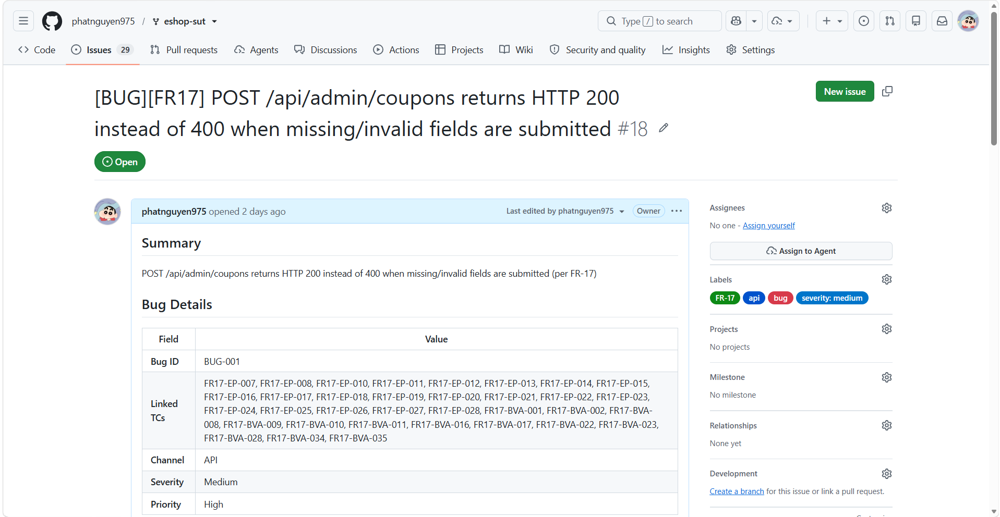
</p>

| Field            | Value                                                                                                                                                                                                                                                                                                                                                                                                                                                                 |
| ---------------- | --------------------------------------------------------------------------------------------------------------------------------------------------------------------------------------------------------------------------------------------------------------------------------------------------------------------------------------------------------------------------------------------------------------------------------------------------------------------- |
| **Bug ID**       | BUG-001                                                                                                                                                                                                                                                                                                                                                                                                                                                               |
| **Feature**      | FR-17 — Coupon Management                                                                                                                                                                                                                                                                                                                                                                                                                                             |
| **Linked TCs**   | FR17-EP-007, FR17-EP-008, FR17-EP-010, FR17-EP-011, FR17-EP-012, FR17-EP-013, FR17-EP-014, FR17-EP-015, FR17-EP-016, FR17-EP-017, FR17-EP-018, FR17-EP-019, FR17-EP-020, FR17-EP-021, FR17-EP-022, FR17-EP-023, FR17-EP-024, FR17-EP-025, FR17-EP-026, FR17-EP-027, FR17-EP-028, FR17-BVA-001, FR17-BVA-002, FR17-BVA-008, FR17-BVA-009, FR17-BVA-010, FR17-BVA-011, FR17-BVA-016, FR17-BVA-017, FR17-BVA-022, FR17-BVA-023, FR17-BVA-028, FR17-BVA-034, FR17-BVA-035 |
| **Channel**      | API                                                                                                                                                                                                                                                                                                                                                                                                                                                                   |
| **Summary**      | POST /api/admin/coupons returns HTTP 200 instead of 400 when missing/invalid fields are submitted (per FR-17)                                                                                                                                                                                                                                                                                                                                                         |
| **Status**       | New                                                                                                                                                                                                                                                                                                                                                                                                                                                                   |
| **Severity**     | Medium                                                                                                                                                                                                                                                                                                                                                                                                                                                                |
| **Priority**     | High                                                                                                                                                                                                                                                                                                                                                                                                                                                                  |
| **Reported by**  | 23127449 - Nguyễn Tấn Phát                                                                                                                                                                                                                                                                                                                                                                                                                                            |
| **Date**         | 2026-06-18                                                                                                                                                                                                                                                                                                                                                                                                                                                            |
| **GitHub Issue** | [#18](https://github.com/phatnguyen975/eshop-sut/issues/18)                                                                                                                                                                                                                                                                                                                                                                                                           |

### Environment

| Component    | Value                            |
| ------------ | -------------------------------- |
| OS / Device  | Ubuntu (WSL) / Windows 11        |
| Runtime Env  | Edge Browser / cURL              |
| Backend      | http://localhost:3000            |
| Frontend/App | http://localhost:5174            |
| Test Account | admin@eshop.com / test@eshop.com |

### Steps to Reproduce

1. Ensure the EShop backend is running at http://localhost:3000.
2. Obtain an admin JWT:
   ```bash
   curl -s -X POST http://localhost:3000/api/login \
     -H "Content-Type: application/json" \
     -d '{"email":"admin@eshop.com","password":"Admin123!"}'
   ```
3. Send the following request (empty code):
   ```bash
   curl -s -X POST http://localhost:3000/api/admin/coupons \
     -H "Content-Type: application/json" \
     -H "Authorization: Bearer <admin_token>" \
     -d '{"code":"", "type":"fixed", "discount_value":50000, "expired_at":"2027-12-31", "min_order_amount":500000, "max_uses_per_user":1}'
   ```
4. Observe the HTTP response status code.
5. Observe the response body.

**Note:** This root cause also causes the other Linked TCs to fail (system accepts invalid inputs for discount_value, dates, and types).

### Expected Behavior

Per **FR-17**: The system must reject empty codes.

Specifically (based on FR17-EP-007):

- HTTP 400 Bad Request
- Response body should indicate the code cannot be empty.

### Actual Behavior

- HTTP Status: `200 OK`
- Response Body:
  ```json
  { "message": "Coupon created", "id": 5 }
  ```

### Severity Rationale

**Medium:** The system accepts invalid, empty, or out-of-bounds data directly violating the validation rules defined in FR-17. This degrades data integrity but does not crash the system or bypass security.

### Priority Rationale

**High:** This breaks the core business rules for coupon creation. If admins create invalid coupons, users may exploit them or the system may break during checkout.

## BUG-002

<p align="center">
  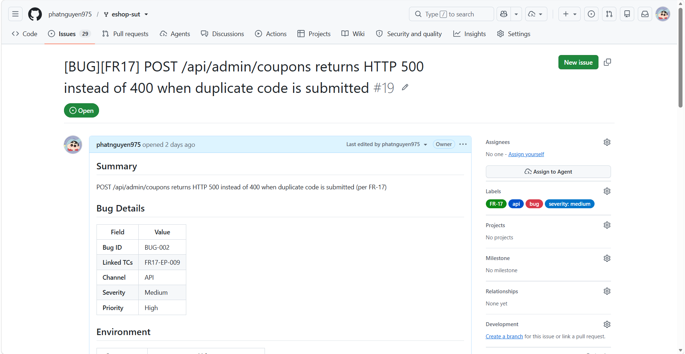
</p>

| Field            | Value                                                                                                |
| ---------------- | ---------------------------------------------------------------------------------------------------- |
| **Bug ID**       | BUG-002                                                                                              |
| **Feature**      | FR-17 — Coupon Management                                                                            |
| **Linked TCs**   | FR17-EP-009                                                                                          |
| **Channel**      | API                                                                                                  |
| **Summary**      | POST /api/admin/coupons returns HTTP 500 instead of 400 when duplicate code is submitted (per FR-17) |
| **Status**       | New                                                                                                  |
| **Severity**     | Medium                                                                                               |
| **Priority**     | High                                                                                                 |
| **Reported by**  | 23127449 - Nguyễn Tấn Phát                                                                           |
| **Date**         | 2026-06-18                                                                                           |
| **GitHub Issue** | [#19](https://github.com/phatnguyen975/eshop-sut/issues/19)                                          |

### Environment

| Component    | Value                            |
| ------------ | -------------------------------- |
| OS / Device  | Ubuntu (WSL) / Windows 11        |
| Runtime Env  | Edge Browser / cURL              |
| Backend      | http://localhost:3000            |
| Frontend/App | http://localhost:5174            |
| Test Account | admin@eshop.com / test@eshop.com |

### Steps to Reproduce

1. Ensure the EShop backend is running at http://localhost:3000.
2. Obtain an admin JWT:
   ```bash
   curl -s -X POST http://localhost:3000/api/login \
     -H "Content-Type: application/json" \
     -d '{"email":"admin@eshop.com","password":"Admin123!"}'
   ```
3. Send a POST request with an existing code (e.g. `SAVE10`):
   ```bash
   curl -s -X POST http://localhost:3000/api/admin/coupons \
     -H "Content-Type: application/json" \
     -H "Authorization: Bearer <admin_token>" \
     -d '{"code":"SAVE10", "type":"fixed", "discount_value":50000, "expired_at":"2027-12-31", "min_order_amount":500000, "max_uses_per_user":1}'
   ```
4. Observe the HTTP response status code.

### Expected Behavior

Per **FR-17**: The system must reject duplicate codes and return a validation error.

Specifically:

- HTTP 400 Bad Request
- Response body should indicate duplicate code.

### Actual Behavior

- HTTP Status: `500 Internal Server Error`
- Response Body: Server exception trace (`SQLITE_CONSTRAINT`).

### Severity Rationale

**Medium:** Unhandled SQL unique constraint error surfaces as a 500 Internal Server Error instead of a 400 Bad Request validation message (per FR-17).

### Priority Rationale

**High:** Backend crashes/exceptions on standard user errors should be caught and handled gracefully to prevent service instability.

## BUG-003

<p align="center">
  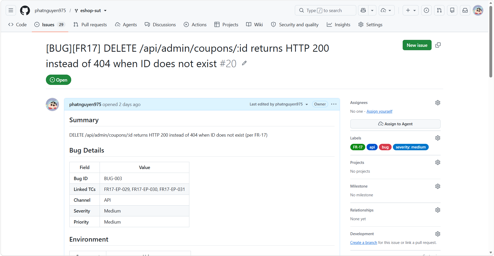
</p>

| Field            | Value                                                                                            |
| ---------------- | ------------------------------------------------------------------------------------------------ |
| **Bug ID**       | BUG-003                                                                                          |
| **Feature**      | FR-17 — Coupon Management                                                                        |
| **Linked TCs**   | FR17-EP-029, FR17-EP-030, FR17-EP-031                                                            |
| **Channel**      | API                                                                                              |
| **Summary**      | DELETE /api/admin/coupons/:id returns HTTP 200 instead of 404 when ID does not exist (per FR-17) |
| **Status**       | New                                                                                              |
| **Severity**     | Medium                                                                                           |
| **Priority**     | Medium                                                                                           |
| **Reported by**  | 23127449 - Nguyễn Tấn Phát                                                                       |
| **Date**         | 2026-06-18                                                                                       |
| **GitHub Issue** | [#20](https://github.com/phatnguyen975/eshop-sut/issues/20)                                      |

### Environment

| Component    | Value                            |
| ------------ | -------------------------------- |
| OS / Device  | Ubuntu (WSL) / Windows 11        |
| Runtime Env  | Edge Browser / cURL              |
| Backend      | http://localhost:3000            |
| Frontend/App | http://localhost:5174            |
| Test Account | admin@eshop.com / test@eshop.com |

### Steps to Reproduce

1. Ensure the EShop backend is running at http://localhost:3000.
2. Obtain an admin JWT:
   ```bash
   curl -s -X POST http://localhost:3000/api/login \
     -H "Content-Type: application/json" \
     -d '{"email":"admin@eshop.com","password":"Admin123!"}'
   ```
3. Send a DELETE request to a non-existent ID:
   ```bash
   curl -s -X DELETE http://localhost:3000/api/admin/coupons/99999 \
     -H "Authorization: Bearer <admin_token>"
   ```
4. Observe the HTTP response status code.

**Note:** This also occurs for non-numeric and zero IDs.

### Expected Behavior

Per **FR-17**: The system should return a 404 Not Found (or 400) if the coupon ID to delete does not exist.

Specifically:

- HTTP 404 Not Found

### Actual Behavior

- HTTP Status: `200 OK`
- Response Body:
  ```json
  { "message": "Coupon deleted" }
  ```

### Severity Rationale

**Medium:** The deletion endpoint succeeds silently even if the resource doesn't exist. This violates standard REST principles and FR-17's implicit rules.

### Priority Rationale

**Medium:** Does not block users or admins, but causes confusing UI states where an admin might think they deleted something they didn't.

## BUG-004

<p align="center">
  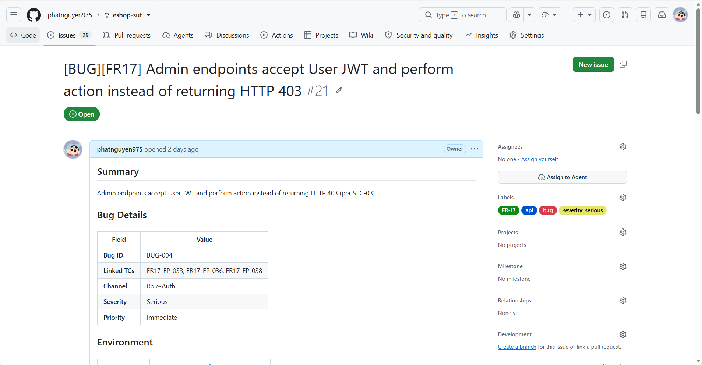
</p>

| Field            | Value                                                                                         |
| ---------------- | --------------------------------------------------------------------------------------------- |
| **Bug ID**       | BUG-004                                                                                       |
| **Feature**      | FR-17 — Coupon Management                                                                     |
| **Linked TCs**   | FR17-EP-033, FR17-EP-036, FR17-EP-038                                                         |
| **Channel**      | Role-Auth                                                                                     |
| **Summary**      | Admin endpoints accept User JWT and perform action instead of returning HTTP 403 (per SEC-03) |
| **Status**       | New                                                                                           |
| **Severity**     | Serious                                                                                       |
| **Priority**     | Immediate                                                                                     |
| **Reported by**  | 23127449 - Nguyễn Tấn Phát                                                                    |
| **Date**         | 2026-06-18                                                                                    |
| **GitHub Issue** | [#21](https://github.com/phatnguyen975/eshop-sut/issues/21)                                   |

### Environment

| Component    | Value                            |
| ------------ | -------------------------------- |
| OS / Device  | Ubuntu (WSL) / Windows 11        |
| Runtime Env  | Edge Browser / cURL              |
| Backend      | http://localhost:3000            |
| Frontend/App | http://localhost:5174            |
| Test Account | admin@eshop.com / test@eshop.com |

### Steps to Reproduce

1. Ensure the EShop backend is running at http://localhost:3000.
2. Obtain a standard USER JWT:
   ```bash
   curl -s -X POST http://localhost:3000/api/login \
     -H "Content-Type: application/json" \
     -d '{"email":"test@eshop.com","password":"Test1234!"}'
   ```
3. Send the following restricted POST request using the User JWT:
   ```bash
   curl -s -X POST http://localhost:3000/api/admin/coupons \
     -H "Content-Type: application/json" \
     -H "Authorization: Bearer <user_token>" \
     -d '{"code":"HACKER25", "type":"fixed", "discount_value":10, "expired_at":"2027-12-31", "min_order_amount":0, "max_uses_per_user":1}'
   ```
4. Observe that the HTTP response is 200 OK instead of 403 Forbidden.

**Note:** This vulnerability affects GET, POST, and DELETE /api/coupons endpoints.

### Expected Behavior

Per **SEC-03**: All administrative endpoints must explicitly verify that the JWT token belongs to a user with the `admin` role.

Specifically:

- HTTP 403 Forbidden

### Actual Behavior

- HTTP Status: `200 OK`
- The user token is accepted, and the restricted action is successfully performed.

### Severity Rationale

**Serious:** CRITICAL ROLE BYPASS. Any standard user can call the Admin Coupon endpoints to view, create, and delete coupons. This directly violates SEC-03.

### Priority Rationale

**Immediate:** This is a major security vulnerability that must be hotfixed immediately before any deployment.

## BUG-005

<p align="center">
  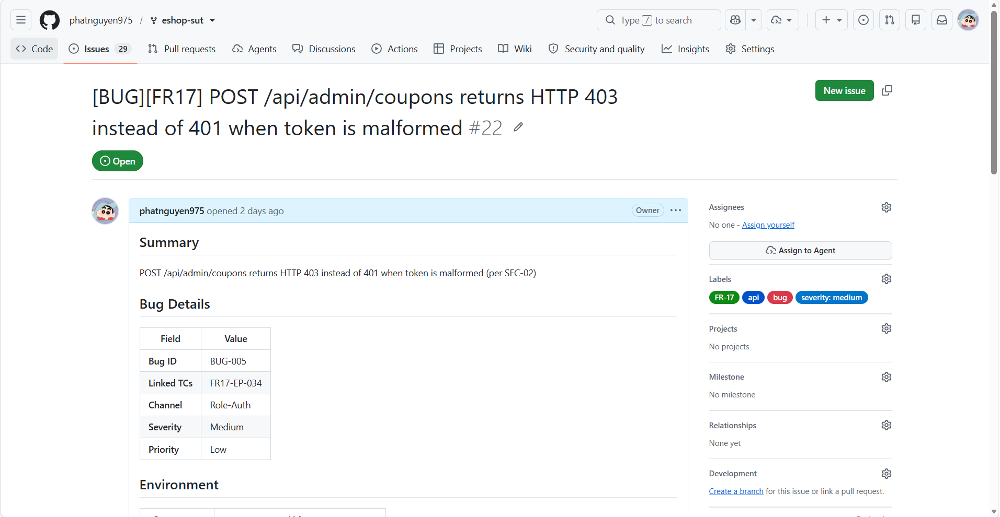
</p>

| Field            | Value                                                                                        |
| ---------------- | -------------------------------------------------------------------------------------------- |
| **Bug ID**       | BUG-005                                                                                      |
| **Feature**      | FR-17 — Coupon Management                                                                    |
| **Linked TCs**   | FR17-EP-034                                                                                  |
| **Channel**      | Role-Auth                                                                                    |
| **Summary**      | POST /api/admin/coupons returns HTTP 403 instead of 401 when token is malformed (per SEC-02) |
| **Status**       | New                                                                                          |
| **Severity**     | Medium                                                                                       |
| **Priority**     | Low                                                                                          |
| **Reported by**  | 23127449 - Nguyễn Tấn Phát                                                                   |
| **Date**         | 2026-06-18                                                                                   |
| **GitHub Issue** | [#22](https://github.com/phatnguyen975/eshop-sut/issues/22)                                  |

### Environment

| Component    | Value                            |
| ------------ | -------------------------------- |
| OS / Device  | Ubuntu (WSL) / Windows 11        |
| Runtime Env  | Edge Browser / cURL              |
| Backend      | http://localhost:3000            |
| Frontend/App | http://localhost:5174            |
| Test Account | admin@eshop.com / test@eshop.com |

### Steps to Reproduce

1. Send a POST request to the endpoint with an invalid/malformed token:
   ```bash
   curl -s -X POST http://localhost:3000/api/admin/coupons \
     -H "Content-Type: application/json" \
     -H "Authorization: Bearer MALFORMED_TOKEN_123" \
     -d '{"code":"TEST"}'
   ```
2. Observe the HTTP status code is 403 instead of 401.

### Expected Behavior

Per **SEC-02**: The system must return 401 Unauthorized for malformed, missing, or invalid tokens.

Specifically:

- HTTP 401 Unauthorized

### Actual Behavior

- HTTP Status: `403 Forbidden`

### Severity Rationale

**Medium:** Using 403 for an unauthenticated/invalid token state is non-standard (should be 401 Unauthorized per SEC-02), but the system successfully blocks the action.

### Priority Rationale

**Low:** The system remains secure since the action is blocked, it just uses the wrong status code.

## BUG-006

<p align="center">
  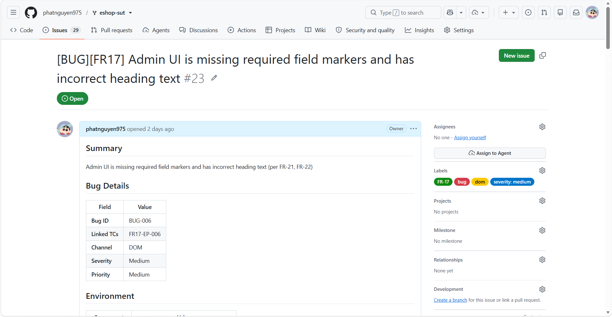
</p>

| Field            | Value                                                                                        |
| ---------------- | -------------------------------------------------------------------------------------------- |
| **Bug ID**       | BUG-006                                                                                      |
| **Feature**      | FR-17 — Coupon Management                                                                    |
| **Linked TCs**   | FR17-EP-006                                                                                  |
| **Channel**      | DOM                                                                                          |
| **Summary**      | Admin UI is missing required field markers and has incorrect heading text (per FR-21, FR-22) |
| **Status**       | New                                                                                          |
| **Severity**     | Medium                                                                                       |
| **Priority**     | Medium                                                                                       |
| **Reported by**  | 23127449 - Nguyễn Tấn Phát                                                                   |
| **Date**         | 2026-06-18                                                                                   |
| **GitHub Issue** | [#23](https://github.com/phatnguyen975/eshop-sut/issues/23)                                  |

### Environment

| Component    | Value                            |
| ------------ | -------------------------------- |
| OS / Device  | Ubuntu (WSL) / Windows 11        |
| Runtime Env  | Edge Browser / cURL              |
| Backend      | http://localhost:3000            |
| Frontend/App | http://localhost:5174            |
| Test Account | admin@eshop.com / test@eshop.com |

### Steps to Reproduce

1. Open Admin UI at http://localhost:5174 and log in with admin credentials.
2. Navigate to Coupon Management tab on the left.
3. Open DevTools: F12 → Console tab.
4. Run the DOM checks script (or inspect the form visually):

   ```js
   (function FR17DOMChecks() {
     "use strict";

     let pass = 0,
       fail = 0;
     const results = [];

     function check(tcId, description, expected, actualFn) {
       let actual, status;
       try {
         actual = actualFn();
         const ok =
           expected === "EXISTS"
             ? actual !== null &&
               actual !== undefined &&
               actual !== "NOT_FOUND" &&
               actual !== false
             : String(actual) === String(expected);
         status = ok ? "PASS" : "FAIL";
       } catch (e) {
         actual = "ERROR: " + e.message;
         status = "FAIL";
       }
       status === "PASS" ? pass++ : fail++;
       results.push({
         "TC ID": tcId,
         Check: description,
         Expected: String(expected),
         Actual: String(actual),
         Status: status,
       });
     }

     // ── FR17-EP-006: Verify DOM properties for Coupon Management form ──────────
     // Per FR-21: Exactly one <h1> on the page
     check(
       "FR17-EP-006-h1",
       "Exactly one <h1> tag on page (per FR-21)",
       "1",
       () => document.querySelectorAll("h1").length,
     );

     // Per FR-22: Mandatory fields marked with asterisk (*)
     check(
       "FR17-EP-006-required-star",
       "At least one label with '*' marking mandatory field (per FR-22)",
       "EXISTS",
       () => {
         const labels = Array.from(
           document.querySelectorAll("label, span, p, th"),
         );
         const found = labels.some((el) => el.textContent.includes("*"));
         return found ? "EXISTS" : "NOT_FOUND";
       },
     );

     // Per FR-17: expired_at field uses input type="date"
     check(
       "FR17-EP-006-date-input",
       "expired_at field has type='date' (per FR-17)",
       "EXISTS",
       () => {
         const dateInput = document.querySelector("input[type='date']");
         return dateInput ? "EXISTS" : "NOT_FOUND";
       },
     );

     // Per FR-21: Create button should have blue styling
     check(
       "FR17-EP-006-create-btn",
       "Create coupon button exists on page (per FR-21)",
       "EXISTS",
       () => {
         const btns = Array.from(
           document.querySelectorAll("button, input[type='submit']"),
         );
         const createBtn = btns.find((b) =>
           /create|thêm|tạo/i.test(b.textContent),
         );
         return createBtn ? "EXISTS" : "NOT_FOUND";
       },
     );

     // Per FR-21: Delete button should have red styling
     check(
       "FR17-EP-006-delete-btn",
       "Delete coupon button exists on page (per FR-21)",
       "EXISTS",
       () => {
         const btns = Array.from(
           document.querySelectorAll("button, input[type='submit']"),
         );
         const delBtn = btns.find((b) =>
           /delete|remove|xóa/i.test(b.textContent),
         );
         return delBtn ? "EXISTS" : "NOT_FOUND";
       },
     );

     // Per FR-21: Page heading text should mention "Coupon" or "Mã giảm giá"
     check(
       "FR17-EP-006-heading-text",
       "Page <h1> heading references 'Coupon' or 'Mã giảm giá'",
       "EXISTS",
       () => {
         const h1 = document.querySelector("h1");
         if (!h1) return "NOT_FOUND";
         return /coupon|mã giảm giá/i.test(h1.textContent)
           ? "EXISTS"
           : "NOT_FOUND";
       },
     );

     // Check no script injection alert on page (SEC-04 — XSS safe rendering)
     // Run AFTER creating a coupon with code = <script>alert(1)</script>
     check(
       "FR17-EP-038-xss",
       "No raw <script>alert(1)</script> injected into DOM (per SEC-04)",
       "SAFE",
       () => {
         return document.body.innerHTML.includes("<script>alert(1)</script>")
           ? "VULNERABLE"
           : "SAFE";
       },
     );

     // ── Summary Output ─────────────────────────────────────────────────────────
     console.log(
       "%c━━━━━━━━━━━━━━━━━━━━━━━━━━━━━━━━━━━━━━━━━━━━━━━━━━━━━━━",
       "font-weight:bold;color:#333",
     );
     console.log(
       "%c FR-17 TEST RESULTS — DOM CHECKS (FR17-EP-006)",
       "font-weight:bold;font-size:14px;color:#0056b3",
     );
     console.log("%c URL: " + window.location.href, "color:#666");
     console.log(
       "%c━━━━━━━━━━━━━━━━━━━━━━━━━━━━━━━━━━━━━━━━━━━━━━━━━━━━━━━",
       "font-weight:bold;color:#333",
     );
     console.table(results);
     const color =
       fail === 0
         ? "color:#28a745;font-weight:bold"
         : "color:#dc3545;font-weight:bold";
     console.log(
       `TOTAL: %c${pass} PASS%c | %c${fail} FAIL`,
       "color: green; font-weight: bold",
       "color: inherit",
       "color: red; font-weight: bold",
     );
     console.log(
       "%c━━━━━━━━━━━━━━━━━━━━━━━━━━━━━━━━━━━━━━━━━━━━━━━━━━━━━━━",
       "font-weight:bold;color:#333",
     );
     console.log(
       "%cScreenshot this panel and paste the summary into Phase B.",
       "color:#888;font-style:italic",
     );
   })();
   ```

5. Observe the missing `*` on the code, type, and value fields, and the mismatched heading text.

### Expected Behavior

Per **FR-21 and FR-22**: Mandatory fields must be marked with an asterisk (`*`), and heading text must match the specified design.

Specifically:

- `*` should be present next to required fields
- Heading text should match requirement exactly.

### Actual Behavior

DOM checks failed: No required-field `*` found. Heading text mismatch.

### Severity Rationale

**Medium:** The UI lacks visual indications for required fields (`*`), violating standard usability conventions and explicit FR-22 requirements.

### Priority Rationale

**Medium:** Does not block coupon creation, but degrades the administrator's user experience.

# FR-03: Forgot Password & Reset Password

**Generated by:** bug-report-writer skill  
**Date:** 2026-06-19  
**Total bugs:** 6

## BUG-001

<p align="center">
  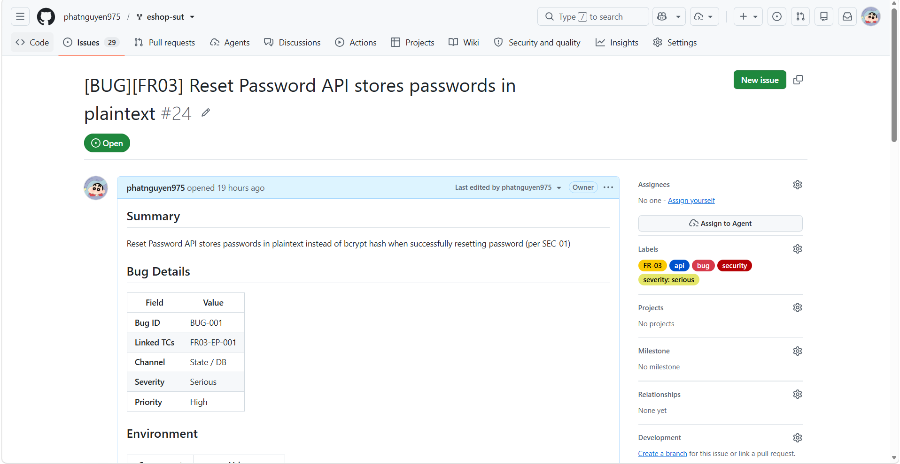
</p>

| Field            | Value                                                                                                                     |
| ---------------- | ------------------------------------------------------------------------------------------------------------------------- |
| **Bug ID**       | BUG-001                                                                                                                   |
| **Feature**      | FR-03 — Forgot Password                                                                                                   |
| **Linked TCs**   | FR03-EP-001                                                                                                               |
| **Channel**      | State / DB                                                                                                                |
| **Summary**      | Reset Password API stores passwords in plaintext instead of bcrypt hash when successfully resetting password (per SEC-01) |
| **Status**       | New                                                                                                                       |
| **Severity**     | Serious                                                                                                                   |
| **Priority**     | High                                                                                                                      |
| **Reported by**  | 23127449 - Nguyễn Tấn Phát                                                                                                |
| **Date**         | 2026-06-19                                                                                                                |
| **GitHub Issue** | [#24](https://github.com/phatnguyen975/eshop-sut/issues/24)                                                               |

### Environment

| Component    | Value                    |
| ------------ | ------------------------ |
| OS / Device  | Ubuntu (WSL), Windows 11 |
| Runtime Env  | Node.js 24.x             |
| Backend      | http://localhost:3000    |
| Frontend/App | N/A (API-only test)      |
| Test Account | test@eshop.com           |

### Steps to Reproduce

1. Ensure the EShop backend is running at http://localhost:3000.
2. Send the following request to fetch OTP:
   ```bash
   curl -s -X POST http://localhost:3000/api/forgot-password \
     -H "Content-Type: application/json" \
     -d '{"email":"test@eshop.com"}'
   ```
3. Send the following request to reset password using the fetched resetToken:
   ```bash
   curl -s -X POST http://localhost:3000/api/reset-password \
     -H "Content-Type: application/json" \
     -d '{"email":"test@eshop.com","resetToken":"<fetched_token>","newPassword":"Test@123"}'
   ```
4. Query the database:
   ```bash
   sqlite3 backend/database.sqlite "SELECT password FROM users WHERE email='test@eshop.com';"
   ```

### Expected Behavior

Per **SEC-01**:

> Mật khẩu không được lưu dưới dạng plaintext.

Specifically:

- DB state: Password must be stored as a bcrypt hash (starting with `$2`).

### Actual Behavior

- HTTP Status: `200`
- DB State: Password stored exactly as `"Test@123"` (plaintext) instead of bcrypt hashed.

### Severity Rationale

**Serious:** SEC-01 violation. Storing passwords in plaintext is a critical security vulnerability that exposes user credentials if the DB is compromised.

### Priority Rationale

**High:** Data integrity risk and major security vulnerability that must be fixed before production.

## BUG-002

<p align="center">
  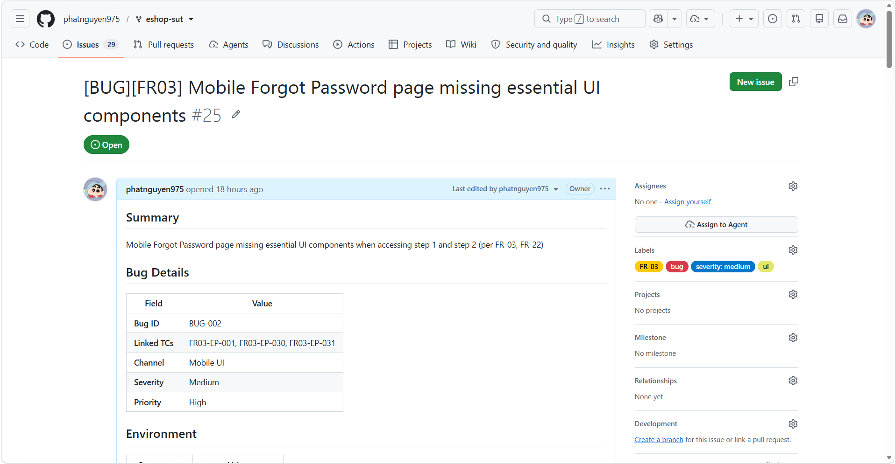
</p>

| Field            | Value                                                                                                           |
| ---------------- | --------------------------------------------------------------------------------------------------------------- |
| **Bug ID**       | BUG-002                                                                                                         |
| **Feature**      | FR-03 — Forgot Password                                                                                         |
| **Linked TCs**   | FR03-EP-001, FR03-EP-030, FR03-EP-031                                                                           |
| **Channel**      | Mobile UI                                                                                                       |
| **Summary**      | Mobile Forgot Password page missing essential UI components when accessing step 1 and step 2 (per FR-03, FR-22) |
| **Status**       | New                                                                                                             |
| **Severity**     | Medium                                                                                                          |
| **Priority**     | High                                                                                                            |
| **Reported by**  | 23127449 - Nguyễn Tấn Phát                                                                                      |
| **Date**         | 2026-06-19                                                                                                      |
| **GitHub Issue** | [#25](https://github.com/phatnguyen975/eshop-sut/issues/25)                                                     |

### Environment

| Component    | Value                    |
| ------------ | ------------------------ |
| OS / Device  | Ubuntu (WSL), Windows 11 |
| Runtime Env  | Expo Go                  |
| Backend      | http://localhost:3000    |
| Frontend/App | Mobile App               |
| Test Account | test@eshop.com           |

### Steps to Reproduce

1. Open the EShop Mobile App in Expo Go.
2. Navigate to the Forgot Password screen (Step 1).
3. Observe the absence of a "Step Indicator" (e.g., Bước 1/2), "Quay lại đăng nhập" button, and `*` markers for required fields.
4. Enter `test@eshop.com` and proceed to Step 2.
5. Observe that the "Confirm Password" field is completely missing from the UI.

**Note:** This root cause also causes the following TCs to fail: FR03-EP-030, FR03-EP-031

### Expected Behavior

Per **FR-03** and **FR-22**:

> Giao diện phải hiển thị chỉ báo bước (Step Indicator). Có nút **Quay lại đăng nhập**. Phải có trường **Xác nhận mật khẩu mới**.

Specifically:

- UI: Must have step indicator, back button, required markers, and confirm password field.

### Actual Behavior

- UI: Missing OTP display on screen, missing step indicator, back button, required markers, and confirm password field.

### Severity Rationale

**Medium:** Missing UI elements required by SRS. The absence of the confirm password field breaks the intended UX flow preventing users from double-checking their new password.

### Priority Rationale

**High:** Core user flow deviated heavily from the SRS requirements, directly impacting the usability of the feature.

## BUG-003

<p align="center">
  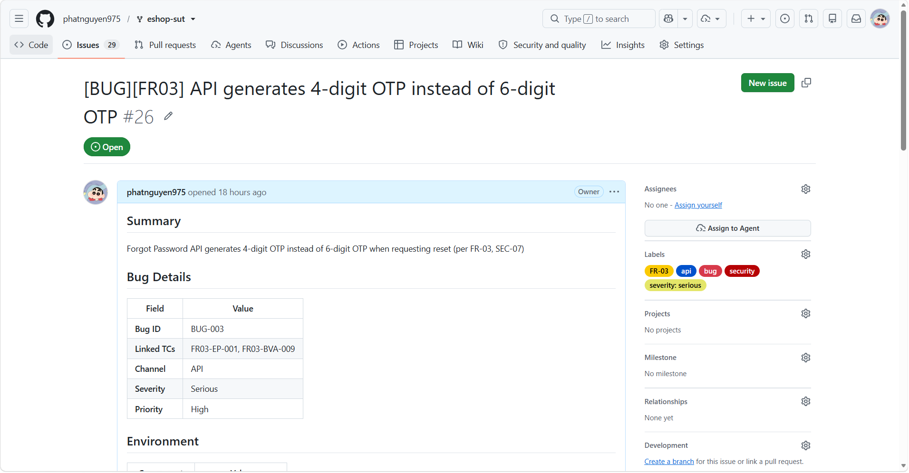
</p>

| Field            | Value                                                                                                      |
| ---------------- | ---------------------------------------------------------------------------------------------------------- |
| **Bug ID**       | BUG-003                                                                                                    |
| **Feature**      | FR-03 — Forgot Password                                                                                    |
| **Linked TCs**   | FR03-EP-001, FR03-BVA-009                                                                                  |
| **Channel**      | API                                                                                                        |
| **Summary**      | Forgot Password API generates 4-digit OTP instead of 6-digit OTP when requesting reset (per FR-03, SEC-07) |
| **Status**       | New                                                                                                        |
| **Severity**     | Serious                                                                                                    |
| **Priority**     | High                                                                                                       |
| **Reported by**  | 23127449 - Nguyễn Tấn Phát                                                                                 |
| **Date**         | 2026-06-19                                                                                                 |
| **GitHub Issue** | [#26](https://github.com/phatnguyen975/eshop-sut/issues/26)                                                |

### Environment

| Component    | Value                    |
| ------------ | ------------------------ |
| OS / Device  | Ubuntu (WSL), Windows 11 |
| Runtime Env  | Node.js 24.x             |
| Backend      | http://localhost:3000    |
| Frontend/App | N/A (API-only test)      |
| Test Account | test@eshop.com           |

### Steps to Reproduce

1. Ensure the EShop backend is running at http://localhost:3000.
2. Send the following request:
   ```bash
   curl -s -X POST http://localhost:3000/api/forgot-password \
     -H "Content-Type: application/json" \
     -d '{"email":"test@eshop.com"}'
   ```
3. Observe the response body and the length of the `resetToken`.

**Note:** This root cause also causes the following TCs to fail: FR03-BVA-009

### Expected Behavior

Per **FR-03**:

> Hệ thống sinh mã OTP 6 chữ số ngẫu nhiên.

Specifically:

- HTTP 200 OK
- Response body: OTP generated must be exactly 6 digits long.

### Actual Behavior

- HTTP Status: `200`
- Response Body:
  ```json
  { "message": "Mã đặt lại mật khẩu đã được tạo", "resetToken": "1234" }
  ```

### Severity Rationale

**Serious:** FR-03 violation. A 4-digit OTP has insufficient entropy (only 10,000 combinations) and makes the system highly vulnerable to brute-force attacks.

### Priority Rationale

**High:** Security vulnerability affecting the core authentication recovery flow.

## BUG-004

<p align="center">
  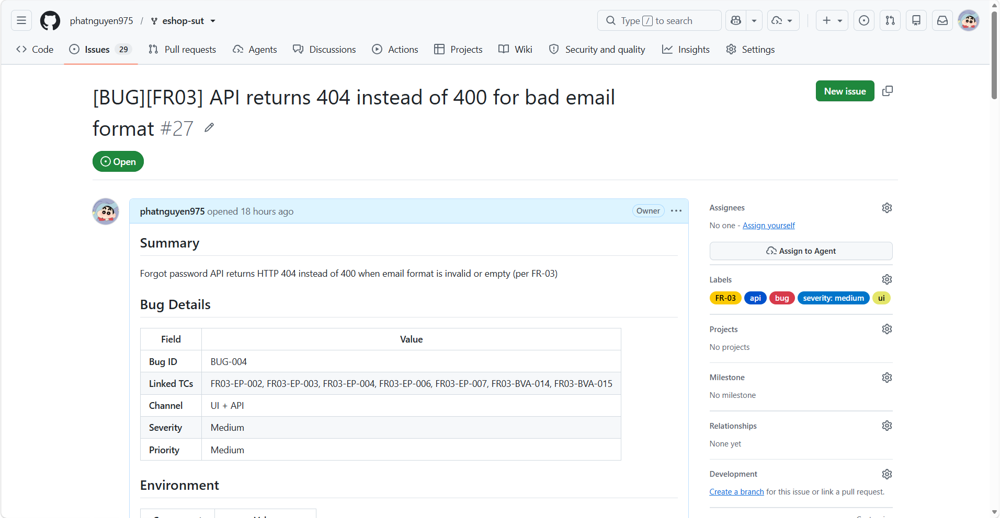
</p>

| Field            | Value                                                                                                 |
| ---------------- | ----------------------------------------------------------------------------------------------------- |
| **Bug ID**       | BUG-004                                                                                               |
| **Feature**      | FR-03 — Forgot Password                                                                               |
| **Linked TCs**   | FR03-EP-002, FR03-EP-003, FR03-EP-004, FR03-EP-006, FR03-EP-007, FR03-BVA-014, FR03-BVA-015           |
| **Channel**      | UI + API                                                                                              |
| **Summary**      | Forgot password API returns HTTP 404 instead of 400 when email format is invalid or empty (per FR-03) |
| **Status**       | New                                                                                                   |
| **Severity**     | Medium                                                                                                |
| **Priority**     | Medium                                                                                                |
| **Reported by**  | 23127449 - Nguyễn Tấn Phát                                                                            |
| **Date**         | 2026-06-19                                                                                            |
| **GitHub Issue** | [#27](https://github.com/phatnguyen975/eshop-sut/issues/27)                                           |

### Environment

| Component    | Value                    |
| ------------ | ------------------------ |
| OS / Device  | Ubuntu (WSL), Windows 11 |
| Runtime Env  | Node.js 24.x             |
| Backend      | http://localhost:3000    |
| Frontend/App | Mobile App / cURL        |
| Test Account | test@eshop.com           |

### Steps to Reproduce

**[UI Reproduction]:**

1. Open the EShop Mobile App in Expo Go.
2. Navigate to the Forgot Password screen.
3. Enter `invalidemail` into the Email field and submit.
4. Observe the incorrect `"User not found"` generic popup instead of a proper format validation message.

**[API Reproduction]:**

1. Ensure the EShop backend is running at http://localhost:3000.
2. Send the following request:
   ```bash
   curl -s -X POST http://localhost:3000/api/forgot-password \
     -H "Content-Type: application/json" \
     -d '{"email":"invalidemail"}'
   ```
3. Observe the HTTP response status code.

**Note:** This root cause also causes the following TCs to fail: FR03-EP-003, FR03-EP-004, FR03-EP-006, FR03-EP-007, FR03-BVA-014, FR03-BVA-015

### Expected Behavior

Per **FR-03**:

> Email phải có định dạng hợp lệ.

Specifically:

- HTTP 400 Bad Request
- UI should display proper email validation error.

### Actual Behavior

- HTTP Status: `404`
- UI: Shows generic "User not found" error instead of validating format.

### Severity Rationale

**Medium:** Wrong HTTP status and wrong UI feedback. The system incorrectly queries the DB before validating the email format, skipping standard input validation.

### Priority Rationale

**Medium:** Deviation from SRS that is visible to the user, but the request is still ultimately rejected and does not pose a security threat.

## BUG-005

<p align="center">
  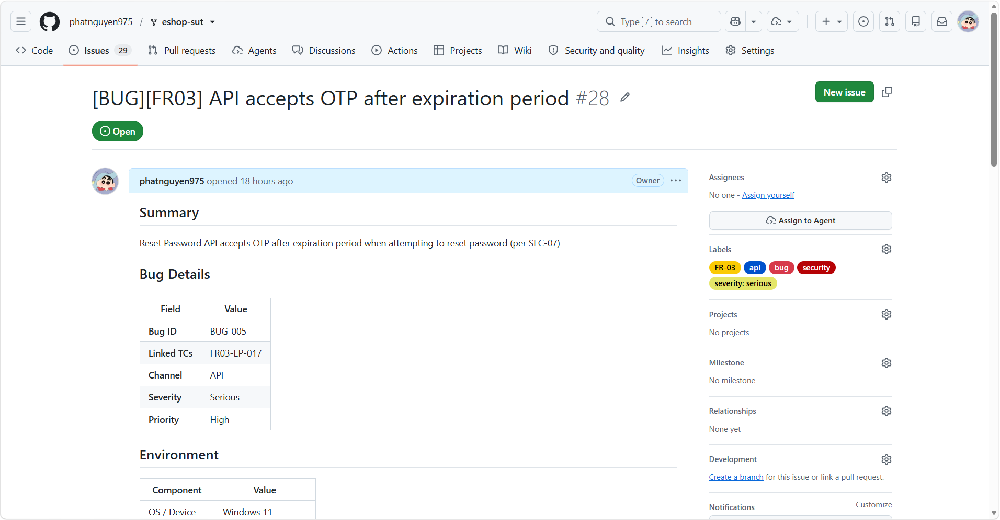
</p>

| Field            | Value                                                                                                 |
| ---------------- | ----------------------------------------------------------------------------------------------------- |
| **Bug ID**       | BUG-005                                                                                               |
| **Feature**      | FR-03 — Forgot Password                                                                               |
| **Linked TCs**   | FR03-EP-017                                                                                           |
| **Channel**      | API                                                                                                   |
| **Summary**      | Reset Password API accepts OTP after expiration period when attempting to reset password (per SEC-07) |
| **Status**       | New                                                                                                   |
| **Severity**     | Serious                                                                                               |
| **Priority**     | High                                                                                                  |
| **Reported by**  | 23127449 - Nguyễn Tấn Phát                                                                            |
| **Date**         | 2026-06-19                                                                                            |
| **GitHub Issue** | [#28](https://github.com/phatnguyen975/eshop-sut/issues/28)                                           |

### Environment

| Component    | Value                    |
| ------------ | ------------------------ |
| OS / Device  | Ubuntu (WSL), Windows 11 |
| Runtime Env  | Node.js 24.x             |
| Backend      | http://localhost:3000    |
| Frontend/App | N/A (API-only test)      |
| Test Account | test@eshop.com           |

### Steps to Reproduce

1. Ensure the EShop backend is running at http://localhost:3000.
2. Send a request to get an OTP:
   ```bash
   curl -s -X POST http://localhost:3000/api/forgot-password \
     -H "Content-Type: application/json" \
     -d '{"email":"test@eshop.com"}'
   ```
3. Wait for 60 seconds to naturally expire the OTP.
4. Send the following request to reset the password using the expired OTP:
   ```bash
   curl -s -X POST http://localhost:3000/api/reset-password \
     -H "Content-Type: application/json" \
     -d '{"email":"test@eshop.com","resetToken":"<expired_otp>","newPassword":"Test@123"}'
   ```
5. Observe the HTTP response status code.

### Expected Behavior

Per **SEC-07**:

> OTP đặt lại mật khẩu phải có thời hạn.

Specifically:

- HTTP 400 or 401 Unauthorized.

### Actual Behavior

- HTTP Status: `200`
- API correctly resets password; OTP expiration is not enforced.

### Severity Rationale

**Serious:** SEC-07 violation. A lack of OTP expiration allows attackers an infinite window to brute-force or intercept the token.

### Priority Rationale

**High:** Security vulnerability affecting the authentication recovery flow.

## BUG-006

<p align="center">
  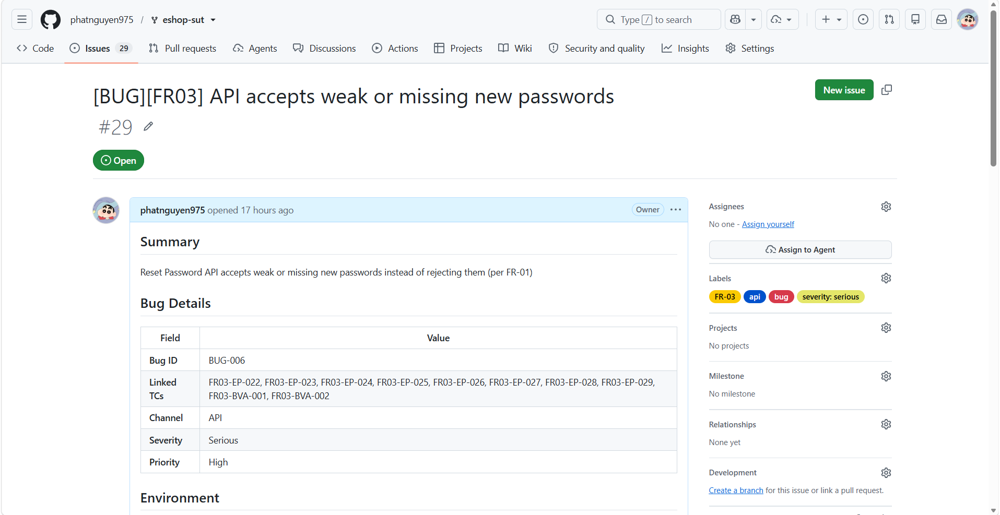
</p>

| Field            | Value                                                                                                                              |
| ---------------- | ---------------------------------------------------------------------------------------------------------------------------------- |
| **Bug ID**       | BUG-006                                                                                                                            |
| **Feature**      | FR-03 — Forgot Password                                                                                                            |
| **Linked TCs**   | FR03-EP-022, FR03-EP-023, FR03-EP-024, FR03-EP-025, FR03-EP-026, FR03-EP-027, FR03-EP-028, FR03-EP-029, FR03-BVA-001, FR03-BVA-002 |
| **Channel**      | API                                                                                                                                |
| **Summary**      | Reset Password API accepts weak or missing new passwords instead of rejecting them (per FR-01)                                     |
| **Status**       | New                                                                                                                                |
| **Severity**     | Serious                                                                                                                            |
| **Priority**     | High                                                                                                                               |
| **Reported by**  | 23127449 - Nguyễn Tấn Phát                                                                                                         |
| **Date**         | 2026-06-19                                                                                                                         |
| **GitHub Issue** | [#29](https://github.com/phatnguyen975/eshop-sut/issues/29)                                                                        |

### Environment

| Component    | Value                    |
| ------------ | ------------------------ |
| OS / Device  | Ubuntu (WSL), Windows 11 |
| Runtime Env  | Node.js 24.x             |
| Backend      | http://localhost:3000    |
| Frontend/App | N/A (API-only test)      |
| Test Account | test@eshop.com           |

### Steps to Reproduce

1. Ensure the EShop backend is running at http://localhost:3000.
2. Send a request to get an OTP:
   ```bash
   curl -s -X POST http://localhost:3000/api/forgot-password \
     -H "Content-Type: application/json" \
     -d '{"email":"test@eshop.com"}'
   ```
3. Send the following request with a weak password (e.g. missing 8 characters):
   ```bash
   curl -s -X POST http://localhost:3000/api/reset-password \
     -H "Content-Type: application/json" \
     -d '{"email":"test@eshop.com","resetToken":"<fresh_otp>","newPassword":"Te@1"}'
   ```
4. Observe the HTTP response status code.

**Note:** This root cause also causes the following TCs to fail: FR03-EP-023, FR03-EP-024, FR03-EP-025, FR03-EP-026, FR03-EP-027, FR03-EP-028, FR03-EP-029, FR03-BVA-001, FR03-BVA-002

### Expected Behavior

Per **FR-01**:

> Yêu cầu mật khẩu mạnh: Tối thiểu 8 ký tự, có ít nhất 1 chữ hoa, 1 chữ thường, 1 chữ số và 1 ký tự đặc biệt.

Specifically:

- HTTP 400 Bad Request.

### Actual Behavior

- HTTP Status: `200`
- API resets password successfully bypassing all strength validations.

### Severity Rationale

**Serious:** The backend relies purely on frontend UI validation and fails to enforce mandatory password strength rules, allowing malicious actors to set weak passwords via API.

### Priority Rationale

**High:** Core business rule completely ignored at the API layer, leading to data integrity and security risks.
