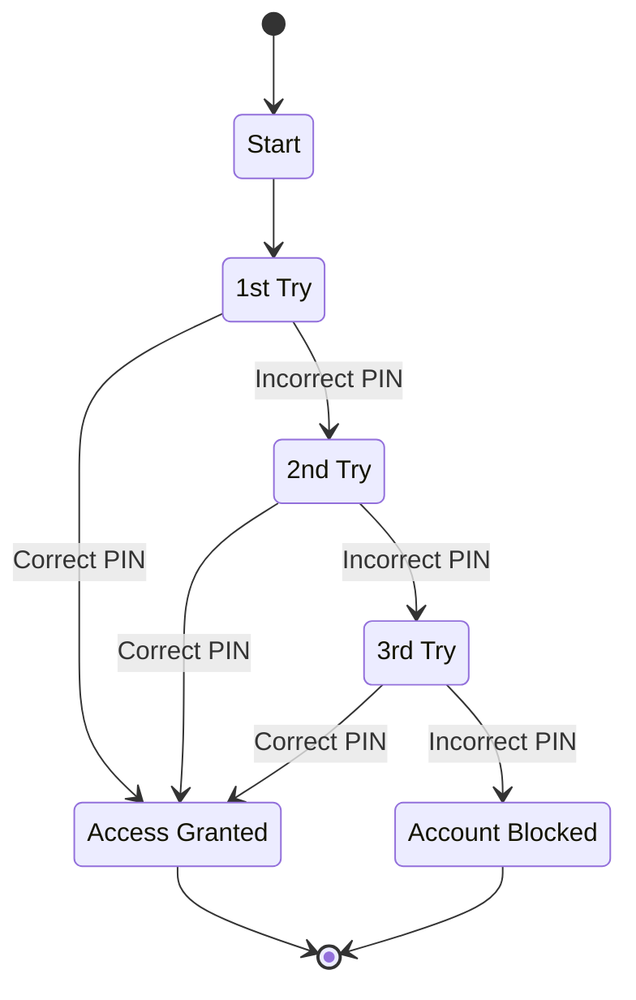
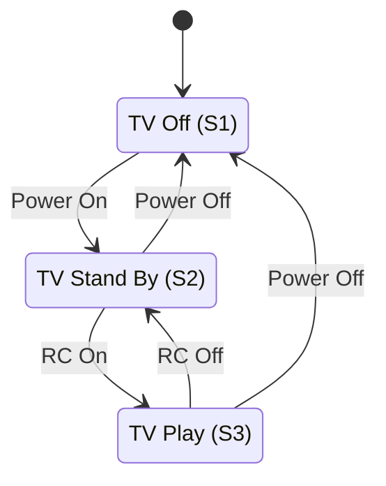
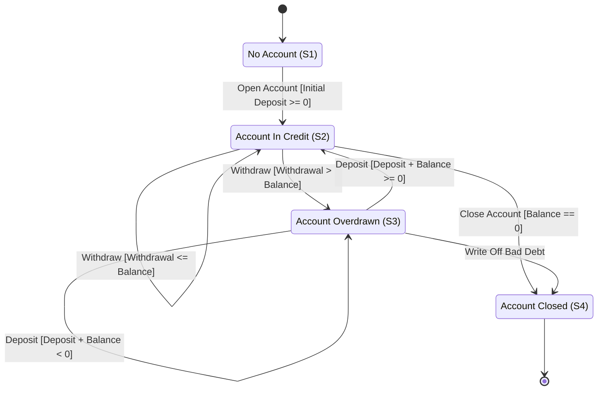
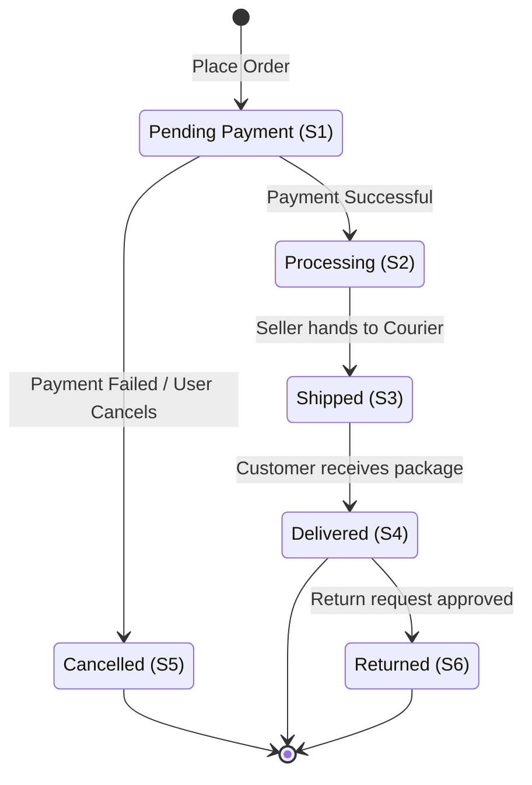

  <h1>State Transition Testing</h1>
  June 01, 2026

## 1. Core Concepts of State Transition Testing

### 1.1. Introduction to State Transition Testing

In the realm of software quality assurance, systems often behave differently depending on what has happened to them previously. State Transition Testing is a dynamic, black-box testing technique designed specifically for systems where the output depends not only on the current input but also on the system's historical state.

This technique is highly helpful for testing different system transitions and ensuring that the business logic holds up under various sequences of operations. Instead of treating the application as a simple input-output mechanism, we view it as a living entity that moves through a defined lifecycle.

### 1.2. The Finite State Machine (FSM) Approach

The general approach to State Transition Testing begins with conceptualizing the System Under Test (SUT) as a Finite State Machine (FSM).

An FSM is a mathematical model of computation that represents a system's behavior through a finite number of conditions (states). By modeling the software as an FSM, a QA engineer can systematically map out all possible behaviors of the system. This model acts as the single source of truth for designing test cases, ensuring that no hidden behaviors or untested paths remain in the production code.

### 1.3. The Four Core Components

To build an accurate FSM and subsequently design effective tests, you must deeply understand its four structural pillars. Every state transition model is constructed using these elements:

#### State

A state is a distinguishable situation or condition of a system at a specific point in time. It reflects the system's current memory or status based on past inputs.

- **Key characteristic:** A system can only exist in exactly one state at any given point in time. It cannot be in multiple states simultaneously.
- **Example:** In an e-commerce application, a shopping cart can be in an "Empty", "Active", or "Checked Out" state.

#### Event

An event is an occurrence, either internal or external to the system, that triggers a reaction. It is the catalyst—the input or the trigger—that causes the system to evaluate its current state and decide what to do next.

- **Key characteristic:** Events can be user actions (clicking a button), system timeouts (a session expiring after 15 minutes), or hardware interrupts.
- **Example:** The user clicking the "Add to Cart" button, or entering an "Incorrect PIN" at an ATM.

#### Transition

A transition is the actual change of the system from one state to another, triggered by an event.

- **Key characteristic:** A transition maps the relationship between the origin state and the destination state. It is entirely possible for a transition to lead back to the exact same state, which is known as a "transition-to-self".
- **Example:** Moving from the "Logged Out" state to the "Logged In" state. A transition-to-self would be entering an invalid password and remaining in the "Logged Out" state while an error message increments.

#### Action

An action is the observable behavior or output executed by the system at a particular point during a transition.

- **Key characteristic:** While an event is the input, the action is the output. It can be a single operation or a string of actions executed sequentially.
- **Example:** Displaying an "Access Granted" message on the screen, triggering an email notification, or writing a transaction log to a database.

### 1.4. The General Testing Approach

To successfully implement State Transition Testing in a real-world project, QA engineers follow a structured, step-by-step methodology:

1. **Model the System:** Describe the System Under Test by creating a State Transition Diagram. This visual representation helps stakeholders and developers align on the business logic.
2. **Tabulate the Logic:** Create a State Transition Table based on the diagram. This step is crucial for mathematically evaluating all possible combinations, specifically to identify and handle Invalid Transitions (paths the system should reject).
3. **Determine Coverage:** Define the testing criteria based on State Transition Coverage metrics (e.g., aiming for 100% All States Coverage or All Transitions Coverage).
4. **Derive Test Cases:** Translate the valid and invalid paths from the table into executable test cases, outlining the preconditions, inputs, and expected outputs.

### 1.5. Best Practices: When to Apply State Transition Testing

Understanding when to use this technique is just as important as knowing how to use it. Applying it to the wrong type of system leads to wasted effort.

**Highly Recommended For:**

- **Stateful Systems:** Applications requiring user authentication flows, multi-step wizards, or complex transaction lifecycles.
- **Embedded Systems:** Software controlling hardware interfaces like ATMs, microwaves, or smart home devices.
- **Gaming and Simulators:** Environments where entities have strict lifecycles and behaviors based on historical data.

**Not Recommended For:**

- **Stateless Systems:** Simple informational websites, static web pages, or basic calculators where the output relies solely on the immediate input, regardless of what happened 5 minutes ago.
- **Data-Driven Workflows:** If the complexity lies in the massive variation of input data rather than the sequence of steps, Boundary Value Analysis or Equivalence Partitioning are more appropriate.

### 1.6. The Role of AI in State Transition Testing

The integration of AI is revolutionizing how QA engineers approach State Transition Testing, shifting the paradigm from manual modeling to automated, intelligent generation.

- **Automated FSM Generation:** Modern AI tools leverage Natural Language Processing (NLP) to read business requirements, user stories, or acceptance criteria and automatically construct State Transition Diagrams. This significantly reduces the manual effort required to model the system.
- **Predictive Edge-Case Detection:** Machine Learning algorithms analyze historical defect data and production logs to predict which state transitions are most likely to fail. AI can highlight complex transition paths that human testers might overlook, focusing the testing effort on high-risk areas.
- **Intelligent Test Case Generation:** By feeding an FSM into an AI model, the system can automatically generate a minimized, optimized suite of test cases that guarantees maximum coverage (like N-switch coverage) while eliminating redundant tests.
- **Reinforcement Learning Bots:** In complex applications, AI agents using reinforcement learning can be deployed to autonomously traverse the state machine. These bots randomly explore different events and transitions to uncover invalid states, unhandled exceptions, or infinite loops, acting as automated exploratory testers.

## 2. State Transition Diagram

### 2.1. Visualizing the System

A State Transition Diagram is a graphical representation of a Finite State Machine (FSM). While textual requirements and business rules describe how a system should behave, the diagram provides a bird's-eye view of the system's entire lifecycle. It acts as a visual blueprint, making it easier for Product Owners, Developers, and QA Engineers to grasp complex business logic, identify missing requirements, and map out testing paths.

By mapping the system visually, teams can quickly see where a user can go, how they get there, and importantly, where they are not allowed to go.

### 2.2. Anatomy of the Diagram (The Visual Syntax)

To read and create these diagrams effectively, you need to understand the standard visual syntax used across the software engineering industry (often based on UML - Unified Modeling Language conventions):

- **Nodes (Circles or Rectangles):** Represent the **States** of the system.
  - _Start State:_ Usually indicated by a solid black circle or a node specifically labeled "Start". This is the initial entry point of the system.
  - _End/Final State:_ Often indicated by a target symbol (a circle with a dot inside) or a bolded border. This signifies the termination of the lifecycle where no further transitions are possible.
- **Directed Arrows:** Represent the **Transitions** between states. The arrowhead indicates the direction of the flow.
- **Labels on Arrows:** Describe what causes the transition and what happens during it. The standard format is `Event [Condition] / Action`.
  - _Event:_ The trigger (e.g., "Click Submit").
  - _Condition (Guard):_ Enclosed in square brackets `[]`, this is a boolean rule that must be true for the transition to occur (e.g., `[Password is Valid]`).
  - _Action:_ Following a forward slash `/`, this is the resulting output (e.g., `/ Show Dashboard`).

### 2.3. Real-World Case Studies

Let us analyze different scenarios ranging from simple mechanics to complex financial lifecycles to see how these diagrams are constructed in practice.

#### Case Study 1: The Authentication Flow (Login System)

A standard security mechanism is the "3-strike" login rule.

- **Initial State:** Start.
- **Transitions & Events:** The user attempts to log in.
  - Entering a "Correct PIN" from the 1st, 2nd, or 3rd try transitions the system to the "Access Granted" state.
  - Entering an "Incorrect PIN" on the 1st try transitions to the "2nd Try" state. Failing again moves it to the "3rd Try" state.
- **Terminal States:** If the user fails on the 3rd try, the system transitions to the "Account Blocked" state. Both "Access Granted" and "Account Blocked" act as endpoints for this specific authorization flow.

This diagram illustrates the "3-strike" security mechanism for a standard login flow.

#### Case Study 2: The Hardware Controller (Television Set)

Embedded systems often rely heavily on state transitions based on remote control (RC) inputs or physical power buttons.

- **States:** TV Off (S1), TV Stand By (S2), TV Play (S3).
- **Transitions:**
  - From "TV Off", triggering a "Power On" event moves the system to "TV Stand By".
  - From "TV Stand By", an "RC On" (Remote Control On) event transitions the system to "TV Play".
  - From "TV Play", an "RC Off" event returns it to "TV Stand By", while a physical "Power Off" event bypasses Stand By and returns directly to "TV Off".

This diagram illustrates the state transitions for an embedded hardware system driven by physical and remote control (RC) events.

#### Case Study 3: The Financial Lifecycle (Bank Account)

Financial applications require strict guard conditions to prevent logic errors.

- **States:** Account In Credit (S2), Account Overdrawn (S3), Account Closed (S4).
- **Guard Conditions in Action:**
  - If a user is in "Account In Credit", and triggers a "Withdraw" event, the system evaluates the condition: `[withdrawal <= account balance]`. If true, it stays in credit (transition-to-self). If false `[withdrawal > account balance]`, it transitions to "Account Overdrawn".
  - To close the account (transition to final state S4), the condition `[account balance = 0]` must be met.
  - If the account is overdrawn and cannot be recovered, the bank may trigger a "Write Off Bad Debt" event, moving the state directly from S3 to S4.

This diagram illustrates a highly logical flow requiring strict guard conditions to manage a user's financial state.

### 2.4. Senior QA Best Practices for Diagramming

Drawing boxes and arrows is easy, but creating a maintainable and testable diagram requires discipline:

1. **Manage Complexity with Hierarchical State Machines (Sub-states):** If a diagram looks like a bowl of spaghetti, it is too complex to test effectively. Break large systems into parent states and child states. For example, an "Order Processing" state can be a parent node that contains a sub-diagram of "Payment Verification", "Inventory Check", and "Packaging" states.
2. **Hunt for "Sink States" (Black Holes):** A common architectural defect is a state that a user can enter but cannot exit (unless it is a legitimate End State like "Account Deleted"). Always trace arrows backwards to ensure there is a logical escape route for the user.
3. **Validate Guard Conditions for Overlap:** Ensure that conditions on outgoing transitions from a single state are mutually exclusive. If State A has one arrow for `[Age > 18]` and another for `[Age >= 18]`, an input of exactly 18 creates non-deterministic behavior.
4. **Diagram Reviews:** Never build test cases in isolation. The QA engineer should co-create or heavily review the diagram with the Product Owner before a single line of code is written to ensure the modeled business rules align with user expectations.

### 2.5. The Role of AI in State Modeling

AI is modernizing the way we create, analyze, and maintain State Transition Diagrams, making the process faster and less prone to human error.

- **Generative Modeling:** Instead of manually dragging and dropping shapes in tools like Visio or Lucidchart, engineers can use AI assistants. By providing a natural language prompt like "Draw a state machine for an e-commerce checkout flow with cart, payment, and shipping states," the AI generates the complete diagram structure automatically.
- **Automated Static Analysis:** AI models can scan complex State Transition Diagrams to find structural flaws instantly. The AI can highlight "orphan states" (states with no arrows pointing to them), unreachable paths, or conflicting guard conditions before testing even begins.
- **Image-to-Model Conversion:** Computer Vision algorithms can process a photo of a whiteboard sketch taken during a brainstorming session and convert it directly into a digitized, interactive State Transition Diagram in engineering modeling software, bridging the gap between physical planning and digital test design.

## 3. State Transition Table

### 3.1. Transitioning from Visual to Analytical Analysis

While a State Transition Diagram provides an excellent visual overview of a system's lifecycle, it has a significant blind spot: it typically only illustrates what _should_ happen. In software testing, especially as a Senior QA engineer, your job is equally focused on what _should not_ happen.

This is where the State Transition Table becomes indispensable. A State Transition Table is a mathematical, grid-based representation of your system's states and events. It systematically maps out all possible state-event combinations, not just the valid ones. By transitioning from a diagram to a table, you shift from a descriptive mindset to an analytical, exhaustive testing mindset.

### 3.2. Structure of a State Transition Table

To build an effective table, you must cross-reference every known state with every possible event. A standard, industry-best-practice table contains the following columns:

- **Current/Prior State:** The state the system is currently in before the event occurs.
- **Event (Condition):** The action, trigger, or input applied to the system.
- **Destination/New State:** The state the system transitions to after the event is processed.
- **Valid Transition (Y/N):** A crucial boolean indicator of whether this combination is allowed by the business logic.
- **Expected Result (Action):** What the system outputs or does (e.g., displaying an error message, updating a database).
- **Notes/Comments:** Context for why a transition behaves a certain way or links to specific business requirements.

Here is a practical example based on a banking system lifecycle:

| Current State   | Event / Condition            | Destination State | Valid (Y/N) | Expected Action / Comment            |
| :-------------- | :--------------------------- | :---------------- | :---------- | :----------------------------------- |
| No Account (S1) | Open Account                 | In Credit (S2)    | Y           | Create account, balance >= 0         |
| No Account (S1) | Withdraw                     | Overdrawn (S3)    | N           | Error: Account does not exist        |
| In Credit (S2)  | Withdraw (Amount <= Balance) | In Credit (S2)    | Y           | Deduct amount, maintain credit       |
| In Credit (S2)  | Withdraw (Amount > Balance)  | Overdrawn (S3)    | Y           | Deduct amount, flag as overdrawn     |
| Overdrawn (S3)  | Close Account                | N/A               | N           | Error: Cannot close negative account |

### 3.3. The Power of Invalid Transitions (Negative Testing)

The greatest advantage of utilizing a State Transition Table is its ability to enforce systematic negative testing.

When developers write code, they naturally focus on the "happy paths"—the valid transitions required to make the feature work. They often forget to implement guard clauses for illogical user actions.

By listing every combination, the table forces you to ask questions like:

- "What happens if a user triggers the 'Close Account' event while in the 'No Account' state?"
- "What happens if a user clicks 'Submit Payment' while the transaction is already in a 'Processing' state?"

Identifying these "Invalid" paths in your table allows you to write test cases that verify the system handles unexpected inputs gracefully (e.g., throwing a validation error, disabling buttons) rather than crashing, entering an infinite loop, or allowing unauthorized data manipulation.

### 3.4. Overcoming the "State Explosion" Problem

The primary disadvantage of this technique is scalability. If an application has 20 states and 15 events, a complete table requires 300 rows. If you add multiple conditional variables, the number of combinations can skyrocket into the thousands. This phenomenon is known as "State Explosion," rendering a table practically unmanageable for manual testing.

Senior QA engineers mitigate this using several strategies:

1. **Equivalence Partitioning inside States:** Group similar states together if they react identically to a specific set of events.
2. **Pairwise Testing (Orthogonal Arrays):** Instead of testing every single combination, use mathematical algorithms to test all pairs of variables. This drastically reduces the number of test cases while maintaining a statistically high defect detection rate.
3. **Risk-Based Pruning:** Filter the table to focus testing efforts on high-risk, critical business flows (e.g., financial transactions) and ignore highly unlikely or low-impact invalid combinations.

### 3.5. Deriving Executable Test Cases

The table is not the final deliverable; it is a matrix used to generate executable test cases.

- **Positive Test Cases:** Every row marked as a Valid Transition (Y) becomes a positive test case. You verify that the system successfully moves from State A to State B and performs the correct action.
- **Negative Test Cases:** Every row marked as an Invalid Transition (N) becomes a negative test case. You verify that the system rejects the event, remains in the correct state, and displays an appropriate error mechanism.

### 3.6. The Role of AI in State Transition Tables

AI is highly effective at solving the exact bottlenecks associated with tabular modeling, particularly the state explosion problem and test generation.

- **Automated Matrix Generation:** AI models can ingest a State Transition Diagram or complex requirement documents and instantly generate a complete, exhaustive State Transition Table, ensuring no combinations are accidentally skipped by human oversight.
- **Intelligent Table Pruning:** Machine Learning algorithms can analyze code complexity and historical bug reports to identify which "Invalid" transitions pose an actual risk. The AI then prunes the massive table, highlighting only the rows that have a high probability of exposing a defect, effectively solving the state explosion issue.
- **Script Generation (Model-Based Testing):** AI tools act as a bridge between the table and automated execution. By feeding the completed State Transition Table into an AI-driven test automation framework, the AI can automatically write the underlying Selenium, Appium, or Playwright scripts needed to execute the transitions, mapping the tabular events to physical UI interactions.

## 4. State Transition Coverage

### 4.1. Introduction to Coverage Metrics

In software testing, one of the most difficult questions a QA engineer must answer is: "When have we tested enough?" Without a mathematical metric, testing is purely based on intuition, which is unacceptable for enterprise-level or safety-critical systems.

State Transition Coverage provides a quantifiable, objective way to measure the thoroughness of your test execution against the defined Finite State Machine (FSM). By tracking coverage, you can identify exactly which parts of the system's lifecycle have been verified and which parts remain untested and potentially vulnerable. It provides stakeholders with a clear KPI (Key Performance Indicator) of product quality before release.

### 4.2. The General Coverage Formula

Regardless of the specific coverage type you are measuring, the foundational formula remains the same. It calculates the percentage of the model that your test cases have successfully exercised.

**Coverage % = (Number of identified items tested / Total number of items in the test object) x 100**

The "item" in this formula changes based on what you are trying to measure: states, valid transitions, or invalid transitions.

### 4.3. All States Coverage

All States Coverage is the most basic level of coverage in this technique. The goal is to design a suite of test cases that ensures every single state (node) in your diagram is visited at least once during execution.

- **Calculation:** (Number of states visited / Total number of states) x 100.
- **Example:** In a banking app with states `[Open, In Credit, Overdrawn, Closed]`, achieving 100% All States Coverage means your test cases must successfully cause the application to enter each of these four states at least one time.
- **Limitations:** While it proves that every state is reachable, it is considered a weak testing metric. It does not guarantee that you have tested all the different ways to enter or exit those states. For instance, you might reach the "Closed" state directly from "Open," but entirely miss testing the transition from "Overdrawn" to "Closed."
- **Best Practice Application:** Use All States Coverage for "Smoke Testing" or basic sanity checks to ensure the fundamental architecture of the application is functioning before committing to deeper, more time-consuming test cycles.

### 4.4. All Transitions Coverage (0-Switch Coverage)

All Transitions Coverage is the industry standard for functional State Transition Testing. It requires your test cases to execute every single valid transition (arrow) depicted in your state diagram at least once.

- **Calculation:** (Number of transitions executed / Total number of valid transitions) x 100.
- **Key Characteristic:** Because every transition originates from a state and ends at a state, achieving 100% All Transitions Coverage automatically guarantees 100% All States Coverage.
- **Best Practice Application:** This is the baseline requirement for most commercial software testing. It ensures that every legitimate business rule, workflow step, and user journey mapped out in the requirements has been proven to work. It verifies that the "happy paths" are completely intact.

### 4.5. Invalid Transition Coverage (Negative Coverage)

Standard definitions of coverage often focus only on the valid paths shown in a diagram. However, senior QA engineers recognize that testing what the system _should not do_ is just as critical. Invalid Transition Coverage is derived from the State Transition Table.

- **Definition:** Ensuring that all rejected state-event combinations (the "N" or Invalid cells in your State Table) have been tested to confirm the system correctly blocks them.
- **Best Practice Application:** This level of coverage is vital for security and stability. It proves that the system handles edge cases gracefully—such as showing a user-friendly error message when someone tries to check out with an empty cart—rather than throwing a 500 Internal Server Error or crashing the database.

### 4.6. Senior QA Best Practices for Setting Coverage Targets

Achieving 100% coverage on every single metric is often mathematically possible but economically unviable due to time and budget constraints. A senior approach requires risk-based decision making:

1. **Context-Driven Targets:** For a standard informational mobile app, 100% All States and 80% All Transitions coverage might be acceptable. For a pacemaker, an aviation control system, or a core banking ledger, 100% All Transitions and 100% Invalid Transition coverage are mandatory.
2. **Path Optimization:** You do not need a separate test case for every transition. A single, well-designed end-to-end test case can cover multiple transitions sequentially. Optimizing your test paths to cover the most transitions in the fewest steps is a hallmark of efficient QA.
3. **Traceability:** Always map your coverage metrics back to business requirements using a Test Management Tool (like Jira with Xray or Zephyr). If a transition fails, you need to instantly know which business feature is impacted.

### 4.7. The Role of AI in Coverage Optimization

Tracking coverage manually on large projects is tedious and error-prone. AI is heavily utilized in modern testing to automate and optimize this process.

- **Dynamic Coverage Analysis:** AI-powered APM (Application Performance Monitoring) tools can run silently in the background while automation scripts execute. They dynamically trace the code paths triggered by your tests and automatically generate real-time coverage dashboards, showing exactly which state transitions were hit and which were missed.
- **Predictive Gap Analysis:** Machine learning models can analyze coverage reports against production usage data. The AI can highlight "coverage gaps" by pointing out: "You only have 50% transition coverage in the Payment Module, but production telemetry shows 80% of users traverse those untested paths." This allows QA teams to prioritize testing where it matters most.
- **Test Suite Minimization:** When regression suites become bloated, AI algorithms (using techniques like graph theory) can analyze the FSM and determine the absolute minimum number of test cases required to maintain 100% All Transitions Coverage. This reduces execution time and infrastructure costs without sacrificing quality.

## 5. Advanced N-Switch Testing

### 5.1. Understanding the N-Switch Concept

As systems become more complex, testing single, isolated transitions is often insufficient. Many software defects do not manifest immediately after a single action; instead, they hide deeper within the system and only occur after a specific _sequence_ of actions.

This is where N-Switch testing comes into play. It is an advanced coverage metric used to design test cases that execute valid sequences of transitions. The rule is strictly mathematical: an N-switch test is designed to execute all valid sequences of **$N+1$ transitions**.

By adjusting the value of $N$, a QA engineer can systematically increase the depth and rigor of the test suite, ensuring that the system's "memory" of previous states behaves correctly over time.

### 5.2. 0-Switch Coverage (The Baseline)

The most fundamental level of this technique is 0-switch coverage. Applying the formula $(0 + 1 = 1)$, this means we are testing sequences containing exactly **one** single transition.

- **Concept:** 0-switch coverage is functionally identical to **All Transitions Coverage** (discussed in Section 4). The goal is to ensure that every individual arrow on your State Transition Diagram is traversed at least once.
- **Practical Example:** Consider a Television controller.
  - State 1: TV Off
  - State 2: TV Stand By
  - State 3: TV Play
  - A 0-switch test suite would simply trigger the individual events: "Power On" (Off to Stand By), "RC On" (Stand By to Play), "RC Off" (Play to Stand By), and "Power Off" (Play or Stand By back to Off). Each test case focuses on verifying one hop.
- **Creating the Optimal Path:** To achieve 100% 0-switch coverage efficiently, QA engineers trace a continuous path through the diagram. For instance, if a system has transitions A, B, C, D, E, and F, an optimal test case might be a single user journey like `A -> B -> E -> B -> C -> F -> D`. This single, long test case covers multiple 0-switch transitions sequentially without needing to restart the application for every single arrow.

### 5.3. 1-Switch Coverage (Testing the Flow)

When you elevate the testing to 1-switch coverage, the formula $(1 + 1 = 2)$ dictates that you must test all valid combinations of **two consecutive transitions**.

- **Concept:** Instead of just checking if State A can go to State B, you are verifying if the system can successfully go from State A -> State B -> State C.
- **Why it matters:** 1-switch coverage catches "context carry-over" bugs. For example, a banking app might allow you to log in (Transition 1), and it might allow you to transfer money (Transition 2). But what if transferring money immediately after logging in crashes the app because a security token wasn't fully initialized? 1-switch coverage guarantees this specific A-to-B-to-C flow is tested.
- **Deriving 1-Switch Pairs:** To design these tests, you look at every state in your diagram and map every incoming arrow to every outgoing arrow. If State B has two incoming arrows (X, Y) and two outgoing arrows (Z, W), your 1-switch pairs for State B are: X-Z, X-W, Y-Z, and Y-W.

### 5.4. Higher-Order Switches (2-Switch, 3-Switch...)

The logic continues to scale.

- **2-Switch:** Tests sequences of $2 + 1 = 3$ consecutive transitions.
- **3-Switch:** Tests sequences of $3 + 1 = 4$ consecutive transitions.

While mathematically possible to calculate N-switches to infinity, the number of required test cases grows exponentially with each step. This creates a massive testing bottleneck.

### 5.5. Senior QA Best Practices for N-Switch Testing

Applying N-switch testing requires strategic balancing between risk and effort:

1. **Do Not Apply N-Switch Globally:** It is a critical mistake to demand 2-switch or 3-switch coverage for an entire application. Use 0-switch for the majority of the system to ensure baseline functionality.
2. **Target Critical Nodes:** Reserve 1-switch and 2-switch coverage strictly for high-risk, highly complex areas. Typical candidates include payment gateways, multi-factor authentication flows, checkout wizards, and embedded hardware controllers where system memory is volatile.
3. **Use Graph Theory (Chow's W-Method):** Senior engineers often use algorithms derived from graph theory, such as the W-Method, to mathematically deduce the absolute minimum number of test paths required to achieve the desired N-switch coverage, ensuring no redundant testing occurs.
4. **Beware of Loops:** If your diagram has a transition-to-self (e.g., entering a wrong password up to 3 times), calculating higher-order switches can lead to infinite loops. You must strictly bound your test cases to the business logic limits (e.g., maximum 3 attempts).

### 5.6. The Role of AI in N-Switch Testing

The exponential complexity of calculating N-switch paths manually makes it a perfect candidate for AI integration.

- **Algorithmic Pathfinding:** AI tools utilize graph traversal algorithms (like Depth-First Search or Breadth-First Search optimized by Machine Learning heuristics) to ingest a State Transition Diagram and automatically output the exact sequences needed for 1-switch, 2-switch, or any N-switch coverage. It computes in seconds what would take a human hours to map out on a spreadsheet.
- **Automated Script Chaining:** AI test automation frameworks can take the generated N-switch sequences and automatically chain individual test methods together. If the AI knows how to execute "Login" and "Add to Cart", it can automatically construct the execution script for the 1-switch sequence "Login -> Add to Cart" without human coding.
- **Smart Coverage Prediction:** By analyzing historical production defects, AI can predict which specific N-switch sequences are statistically most likely to fail. Instead of running thousands of 2-switch combinations, the AI prunes the list, directing the QA team to execute only the top 50 sequences that have an 80% probability of uncovering a critical bug. This transforms N-switch testing from an exhaustive mathematical exercise into a highly targeted, risk-based weapon.

## 6. Practical Test Case Design from State Models

### 6.1. The Anatomy of a State Transition Test Case

The ultimate goal of creating State Diagrams and State Tables is to derive executable, high-quality test cases. While the table maps out the logic, a test case provides the exact, step-by-step instructions that a human tester or an automation script will follow.

A well-structured State Transition test case must contain specific elements to be effective. Translating a row from your State Table into a test case requires defining the following standard fields:

- **Test Case ID (#TC):** A unique identifier for traceability.
- **Precondition (Initial State):** The exact state the system must be in before the test begins. Setting up this precondition often requires running prerequisite scripts or injecting data into a database.
- **Input / Condition (Event):** The specific action the user takes or the trigger that occurs. This must include the exact test data used (e.g., instead of "Withdraw money," use "Withdraw $50").
- **Expected Result (Action & Destination State):** The observable outcome. This includes two parts: what the system displays or does (e.g., "Balance updates to $50") and the invisible system state change (e.g., "System transitions to $S_2$").
- **Note / Transition Path:** A documentation field indicating the state movement, usually represented as $S_{initial} \rightarrow S_{destination}$.

### 6.2. Step-by-Step Test Case Derivation

Deriving test cases is a systematic process of converting the theoretical combinations in your State Table into practical scenarios.

**1. Deriving Positive Test Cases (Valid Transitions)**
Every row in your State Table marked as a "Valid Transition" becomes at least one positive test case. The objective is to prove that the system can successfully navigate the intended business flow.

- _Example from Banking:_
  - **Precondition:** Account exists with balance $\ge 0$ ($S_2$).
  - **Event:** User deposits amount $D$.
  - **Expected Result:** Balance mathematically equals $Balance + D$. The account remains in the "Account in Credit" state.
  - **Path:** $S_2 \rightarrow S_2$.

**2. Deriving Negative Test Cases (Invalid Transitions)**
Every row marked as an "Invalid Transition" is critical for security and stability testing. These test cases ensure the system's error-handling mechanisms function correctly when a user attempts an illegal action.

- _Example from Banking:_
  - **Precondition:** User is in the "No Account" state ($S_1$).
  - **Event:** User attempts to trigger a "Withdraw" event via direct API call.
  - **Expected Result:** The system explicitly rejects the transaction. An error message "Account does not exist" is returned. The system does NOT create an account or allow the withdrawal.
  - **Path:** $S_1 \rightarrow S_3$ (Attempted) resulting in system remaining at $S_1$.

### 6.3. Industry Best Practices for Test Case Management

Writing the test cases is only half the battle. Senior QA engineers employ strict management practices to ensure these tests are maintainable and valuable over the lifecycle of the project.

- **Integration with Test Management Tools:** Test cases derived from state models should never live in isolated Excel spreadsheets. They must be imported into centralized tools like Jira (using Zephyr or Xray), TestRail, or ALM. This allows for real-time execution tracking and defect linking.
- **Establishing the Traceability Matrix:** Every State Transition test case must be directly linked back to a specific Business Requirement Document (BRD) or User Story. If a developer changes the logic for how an account becomes "Overdrawn," the traceability matrix instantly flags which test cases need to be updated.
- **Cross-Functional Peer Reviews:** Before test execution begins, the derived test cases should be reviewed with the developers and the Business Analyst (BA). Developers verify that the preconditions are technically feasible to set up, and BAs confirm that the expected results align with the business domain logic.
- **Behavior-Driven Development (BDD) Alignment:** State transitions map perfectly to the Gherkin syntax used in BDD. The "Precondition" becomes the `Given`, the "Event" becomes the `When`, and the "Expected Result" becomes the `Then`.

### 6.4. The Role of AI in Test Case Generation

AI drastically reduces the manual overhead of writing and maintaining test cases, allowing QA engineers to focus on strategy rather than clerical work.

- **Automated Translation to BDD/Gherkin:** AI models trained on natural language processing can ingest a raw State Transition Table and automatically generate hundreds of perfectly formatted BDD test scripts. For example, it translates the table row into: `Given the user has an Account in Credit, When the user withdraws an amount greater than the balance, Then the account state changes to Overdrawn`.
- **Test Data Generation:** Executing state transitions requires highly specific test data. AI generators can synthesize thousands of rows of realistic, compliant mock data (like valid and invalid account balances, user profiles, and transaction IDs) tailored to trigger specific state changes, solving the data bottleneck in testing.
- **Self-Healing Test Suites:** When a product evolves and a new state is added to the application, traditional automated test scripts break. AI-driven test frameworks analyze the underlying DOM changes and the updated state model to automatically "heal" the test scripts. The AI updates the locators and transition logic in the code, minimizing the maintenance burden on the QA automation team.

## 7. Practice Exercises & Case Studies

### 7.1. Multiple-Choice Questions (MCQs)

**1. Which of the following best describes the four core components of a State Transition model?**

- A. State, Condition, Pathway, Output
- **B. State, Event, Transition, Action**
- C. Node, Arrow, Guard, Result
- D. Input, Process, Output, Memory

**Explanation:** The standard architecture of a Finite State Machine (FSM) consists of States (the current condition), Events (the trigger/input), Transitions (the movement between states), and Actions (the resulting behavior/output).

**2. According to the rules of a Finite State Machine, how many states can a system occupy at any exact given moment?**

- A. Multiple, as long as they are related sub-states.
- **B. Exactly one.**
- C. Two: a primary state and a secondary background state.
- D. Zero, if the system is currently processing data.

**Explanation:** A fundamental rule of FSMs is that a system can only exist in exactly one state at any given point in time. It cannot overlap or exist in multiple states simultaneously.

**3. For which of the following applications is State Transition Testing LEAST appropriate?**

- A. An ATM software interface.
- B. A multi-step e-commerce checkout wizard.
- **C. A static informational blog website.**
- D. A video game character's lifecycle system.

**Explanation:** State Transition Testing is meant for "stateful" systems where history and previous actions matter. A static blog is "stateless"; its output relies solely on the immediate click, regardless of past navigation.

**4. What is the primary advantage of creating a State Transition Table over relying solely on a State Transition Diagram?**

- A. The table is easier to show to non-technical stakeholders.
- B. The table automatically generates UI automation code.
- **C. The table systematically forces the tester to evaluate all invalid (negative) state-event combinations.**
- D. The table eliminates the need for establishing preconditions.

**Explanation:** While diagrams primarily show the "happy paths", a table matrix maps every possible state against every possible event. This mathematically exposes the invalid transitions (what the system should NOT do), which are critical for negative testing.

**5. In a state transition diagram, what does a "guard condition" inside square brackets (e.g., `[Balance > 0]`) represent?**

- A. The resulting database action that occurs after the transition.
- **B. A boolean rule that must be evaluated as true for the transition to be allowed.**
- C. The fallback state the system will move to if the event fails.
- D. The maximum number of times the transition can be executed in a single session.

**Explanation:** A guard condition is a prerequisite business rule. Even if the correct event is triggered, the transition will only execute if the guard condition is met.

**6. Achieving 100% "0-switch coverage" is functionally equivalent to which of the following metrics?**

- A. All States Coverage
- B. Path Coverage
- C. Invalid Transition Coverage
- **D. All Transitions Coverage**

**Explanation:** The formula for N-switch is testing sequences of N+1 transitions. Therefore, 0-switch coverage means testing sequences of 0+1 = 1 transition. Testing every single isolated transition at least once is the exact definition of All Transitions Coverage.

**7. If a QA engineer is designing tests for "1-switch coverage", what exactly are they verifying?**

- A. Every single state in the system in isolation.
- B. All possible combinations of three consecutive transitions.
- **C. All valid combinations of two consecutive transitions.**
- D. The system's ability to switch back and forth between two states infinitely.

**Explanation:** Using the N+1 formula, 1-switch tests verify sequences of 1+1 = 2 consecutive transitions (e.g., State A -> State B -> State C). This helps uncover defects where a sequence of actions corrupts the system's memory.

**8. What is the "State Explosion" problem in State Transition Testing?**

- **A. The exponential increase in state-event combinations when adding variables, making exhaustive testing unmanageable.**
- B. A critical system defect where the software loops infinitely between two states.
- C. The failure of a diagrammatic tool to render properly due to too many drawn arrows.
- D. The database crashing when too many transitions occur simultaneously.

**Explanation:** "State explosion" occurs when the number of states and events increases slightly, but the combinatorial rows in the State Transition Table multiply exponentially, making manual testing mathematically impossible.

**9. When writing a practical test case derived from a State Transition model, what does the "Precondition" represent?**

- A. The specific event that the user will trigger.
- B. The expected outcome or database update.
- **C. The specific initial state the system must be placed in before the trigger event occurs.**
- D. The security token required to run the test.

**Explanation:** To accurately test a transition, the system must first be in the correct starting location. The precondition defines this initial state (e.g., "The user must be logged in and their account must be Overdrawn").

**10. How is Artificial Intelligence most effectively utilized to optimize the State Transition Table process?**

- A. By automatically approving all test case results without human review.
- **B. By using machine learning to intelligently prune the table, highlighting high-risk invalid transitions and minimizing redundant paths.**
- C. By bypassing the FSM model entirely and guessing which code blocks are vulnerable.
- D. By translating the table into boundary value matrices.

**Explanation:** AI algorithms can analyze code complexity and historical defect data to identify which combinations in a massive state table actually pose a risk. It "prunes" the table to solve the state explosion problem, focusing QA efforts on high-value test cases.

### 7.2. Practical Application Exercises

#### Type 1: Coverage Metrics & N-Switch

**Question 1: Calculating Baseline Metrics**

**Scenario:** A smart thermostat system has 3 states: **S1 (Off)**, **S2 (Cooling)**, and **S3 (Heating)**. There are 4 valid transitions defined in the requirements:

- **T1:** S1 -> S2 (_Event:_ Temp rises above target)
- **T2:** S2 -> S1 (_Event:_ Temp reaches target)
- **T3:** S1 -> S3 (_Event:_ Temp drops below target)
- **T4:** S3 -> S1 (_Event:_ Temp reaches target)

A QA tester executes a single test case that follows this exact path: `System starts at S1 -> Temp rises (moves to S2) -> Temp reaches target (moves to S1)`.

**Task:** Calculate the **All States Coverage %** and the **All Transitions (0-switch) Coverage %** achieved by this single test case.

**Detailed Solution:**

1.  **All States Coverage:** The test case visits S1, moves to S2, and returns to S1.
    - **States visited:** S1, S2 (_Total:_ 2)
    - **Total states in system:** S1, S2, S3 (_Total:_ 3)
    - **Calculation:** (2 / 3) x 100 = **66.67% All States Coverage**.
2.  **All Transitions (0-switch) Coverage:** The test case executes T1 (S1 -> S2) and T2 (S2 -> S1).
    - **Transitions executed:** T1, T2 (_Total:_ 2)
    - **Total valid transitions in system:** T1, T2, T3, T4 (_Total:_ 4)
    - **Calculation:** (2 / 4) x 100 = **50% All Transitions Coverage**.

**Question 2: Deriving 1-Switch Combinations**

**Scenario:** Look at a specific state in an e-commerce flow: **S2 (Cart Active)**.

- **Incoming Transitions to S2:**
  - **Transition A:** From S1 (Empty Cart) via "Add Item".
  - **Transition B:** From S2 (Cart Active) via "Add Another Item" (Transition-to-self).
- **Outgoing Transitions from S2:**
  - **Transition C:** To S3 (Checkout) via "Proceed to Pay".
  - **Transition D:** To S1 (Empty Cart) via "Clear Cart".

**Task:** List all the valid **1-switch test sequences** that pass through the S2 state.

**Detailed Solution:** A 1-switch test sequence requires testing combinations of two consecutive transitions (1 + 1 = 2). To find all pairs passing through S2, we must combine every incoming arrow with every outgoing arrow.

- **Path 1:** Transition A followed by Transition C (Add first item, then proceed to checkout).
- **Path 2:** Transition A followed by Transition D (Add first item, then clear cart).
- **Path 3:** Transition B followed by Transition C (Add another item, then proceed to checkout).
- **Path 4:** Transition B followed by Transition D (Add another item, then clear cart).
- _Note:_ Transition B is both incoming and outgoing (it loops). Therefore, Transition A followed by B, and B followed by B are also valid 1-switch pairs.
- **Path 5:** Transition A followed by Transition B.
- **Path 6:** Transition B followed by Transition B.

**Result:** There are **6** valid 1-switch sequences passing through S2.

#### Type 2: Negative Testing & Test Case Design

**Question 3: Extracting Negative Tests from a Table**

**Scenario:** You are reviewing a State Transition Table for a document signing application. You find the following row:

- **Current State:** S3 (Document Signed)
- **Event:** Click "Edit Text"
- **New State:** N/A
- **Valid Transition:** No (N)
- **Action/Comment:** System should block editing and show warning

**Task:** Write a formal, executable negative test case based on this row.

**Detailed Solution:** To transform a table row into a formal test case, we must structure it clearly for execution:

- **Test Case ID:** `TC_DOC_NEG_001`
- **Objective:** Verify that a signed document cannot be edited.
- **Precondition:** The system must be in state **S3**. (e.g., "A document has been uploaded and successfully digitally signed by all parties.")
- **Input/Event:** The user attempts to trigger the 'Edit Text' event. (e.g., "User clicks the 'Edit Text' button, or attempts to forcefully access the edit URL endpoint via API.")
- **Expected Result:**
  1. The system explicitly rejects the action.
  2. A warning message is displayed: "Editing is disabled for signed documents."
  3. The system remains safely in state **S3 (Document Signed)**. No data is altered.

**Question 4: Modeling a Business Rule & Deriving Cases**

**Scenario:** A cloud subscription service operates under these rules:

1. New users are created in a **Pending** state.
2. If they pay, they become **Active**.
3. If an Active user's monthly payment fails, they go to **Suspended**.
4. A Suspended user can pay to become **Active** again, or they can cancel to become **Terminated**.

**Task:**

1. Identify all the valid states.
2. Write ONE positive test case for an account recovery flow.
3. Write ONE negative test case targeting the "Terminated" state.

**Detailed Solution:**

1. **Identified States:** S1 (Pending), S2 (Active), S3 (Suspended), S4 (Terminated).
2. **Positive Test Case (Account Recovery):**
   - **Precondition:** User account is in **S3 (Suspended)** due to a failed payment last month.
   - **Event:** User updates credit card and successfully triggers a "Pay Balance" event.
   - **Expected Result:** Payment is processed. The account state transitions from **S3 to S2 (Active)**, and all cloud services are restored.
3. **Negative Test Case (Terminated state protection):**
   - **Precondition:** User account is in **S4 (Terminated)**.
   - **Event:** User attempts to trigger a "Pay Balance" event (e.g., clicking an old billing link in their email).
   - **Expected Result:** The system rejects the payment attempt. The account remains in **S4 (Terminated)**, and the UI displays an error: "This account has been permanently closed. Please register a new account."

#### Type 3: Comprehensive End-to-End Case Study

**Question 5: Modeling a Full E-Commerce Business Requirement**

**Scenario:** You are working as a QA Engineer for an E-commerce project. The Product Owner (PO) provides you with the following description of an Order's lifecycle:

1. When the user clicks **"Place Order"**, the order is created with the status **"Pending Payment"**.
2. If the payment is successful, the system transitions to **"Processing"** (Preparing to ship).
3. If the payment fails, or the user manually clicks the Cancel button while waiting for payment, the order transitions to **"Cancelled"**.
4. From the **"Processing"** state, when the seller hands the package over to the courier, the status changes to **"Shipped"**.
5. When the customer receives the goods, the status changes to **"Delivered"**.
6. The customer can only request a Return/Refund when the order is in the **"Delivered"** state. If the return request is approved, the order transitions to **"Returned"**.
7. **Critical Business Rule:** The system must strictly PREVENT the user from cancelling the order once it has transitioned to the **"Processing"** or **"Shipped"** states.

**Tasks:**

1. Visualize the requirements using a State Transition Diagram (Provide Mermaid code).
2. Create an exhaustive State Transition Table.
3. Write ONE valid (Positive) Test Case for the longest successful flow (End-to-End Happy Path).
4. Write TWO invalid (Negative) Test Cases based on the critical business rules.

**Detailed Solution:**

**Task 1: State Transition Diagram (Visualization):** Here is the Mermaid code to visualize the business logic for stakeholder review:

**Task 2: State Transition Table:** To ensure no edge cases are missed (especially for negative testing), we matrix the primary states against the possible events:

| Current State       | Event (Action)            | Next State      | Valid? | Expected System Output / Note                                  |
| :------------------ | :------------------------ | :-------------- | :----- | :------------------------------------------------------------- |
| S1 (Pending)        | Payment Successful        | S2 (Processing) | Y      | Order is sent to the warehouse for packing.                    |
| S1 (Pending)        | Payment Failed            | S5 (Cancelled)  | Y      | Inventory lock is released.                                    |
| S1 (Pending)        | Click "Cancel Order"      | S5 (Cancelled)  | Y      | Order is successfully cancelled by user.                       |
| **S2 (Processing)** | **Click "Cancel Order"**  | **N/A**         | **N**  | **Cancel button is disabled or returns an error.**             |
| S2 (Processing)     | Hand over to Courier      | S3 (Shipped)    | Y      | Tracking number is updated in the system.                      |
| **S3 (Shipped)**    | **Click "Cancel Order"**  | **N/A**         | **N**  | **Block cancellation, display "Order is already on the way".** |
| S3 (Shipped)        | Customer receives package | S4 (Delivered)  | Y      | Initial transaction lifecycle is complete.                     |
| S4 (Delivered)      | Request Return            | S6 (Returned)   | Y      | Funds are refunded to the user's wallet.                       |
| **S4 (Delivered)**  | **Payment Successful**    | **N/A**         | **N**  | **Logic error (Double-payment risk), system MUST block this.** |

**Task 3 & 4: Practical Test Case Design:** Based on the table, we derive the following executable test cases:

1. **Positive Test Case:** End-to-End Purchase (Happy Path)
   - **Test Case ID:** `TC_ORDER_POS_001`
   - **Objective:** Verify the successful order lifecycle from creation to delivery (Achieves All States Coverage for the main path).
   - **Precondition:** User is logged in, and there is 1 valid item in the shopping cart.
   - **Steps & Expected Results:**
     1. **Input:** Click "Place Order" $\rightarrow$ **Result:** Order is created in **Pending Payment (S1)** state.
     2. **Input:** Process successful Visa payment $\rightarrow$ **Result:** State changes to **Processing (S2)**.
     3. **Input:** Trigger Courier API indicating package pickup $\rightarrow$ **Result:** State changes to **Shipped (S3)**.
     4. **Input:** Click "Confirm Receipt" $\rightarrow$ **Result:** State changes to **Delivered (S4)**.

2. **Negative Test Case 1:** Block Invalid Cancellation (Derived from bold row 4)
   - **Test Case ID:** `TC_ORDER_NEG_001`
   - **Objective:** Ensure users cannot cancel an order once the seller has started preparing it.
   - **Precondition:** An order exists in the **Processing (S2)** state.
   - **Input / Event:** User accesses the order details and attempts to cancel (e.g., via UI or forcing a `POST /api/orders/{id}/cancel` API request).
   - **Expected Result:**
     - **UI:** The "Cancel Order" button is hidden or disabled.
     - **API:** Returns an HTTP 400 or 403 error stating "Order is being processed and cannot be cancelled."
     - **Database:** The order state REMAINS strictly as **Processing (S2)**.

3. **Negative Test Case 2:** Block Double-Payment on Completed Order (Derived from the final bold row)
   - **Test Case ID:** `TC_ORDER_NEG_002`
   - **Objective:** Security/Logic test to prevent double-payment vulnerabilities.
   - **Precondition:** An order exists and is already in the **Delivered (S4)** state.
   - **Input / Event:** A malicious user intercepts an old network request or uses Postman to resubmit a "Payment Successful" webhook payload for this specific Order ID.
   - **Expected Result:** The system rejects the payload. No funds are deducted. An error is logged stating "Order has reached a terminal state." The state remains **S4**.
