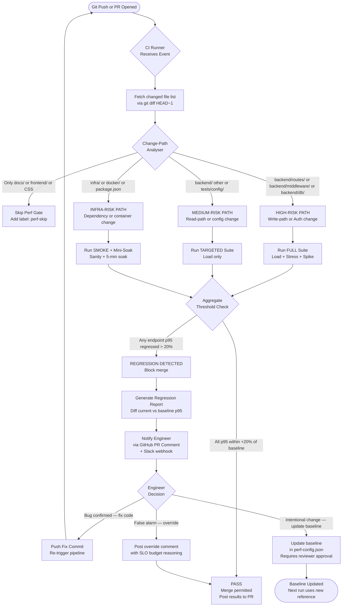
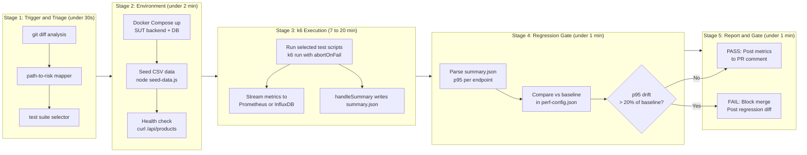
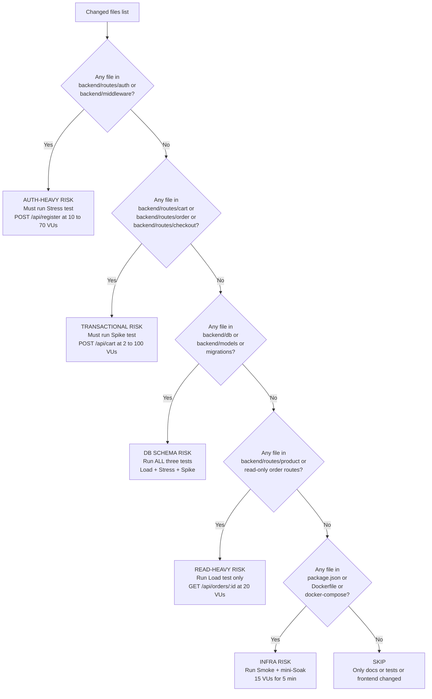
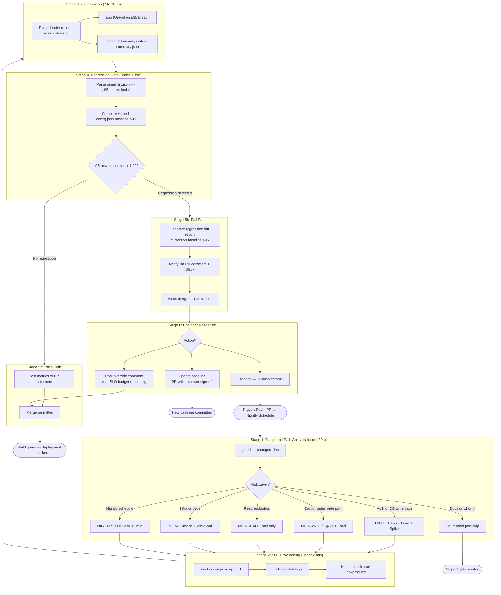

# Task 3 — Continuous Performance Testing Proposal

> **Author:** 23127449  
> **Date:** 2026-08-16

## 1. Executive Summary

This proposal defines a **commit-triggered, statistically grounded continuous performance testing (CPT) model** for the EShop SUT. Grounded in evidence from the four completed test runs (Load, Stress, Spike, Soak), it introduces an automated pipeline that watches every Git commit, decides intelligently whether to run performance tests, and flags **p95 latency regressions** before they reach production.

The core insight driving this design is that the EShop's single biggest performance risk — confirmed by the Stress test (`POST /api/register`, breaking point ≈ 70–75 VUs) — is **SQLite write serialisation under concurrent load**. Any code change touching the database write path, authentication middleware, or cart logic warrants an immediate targeted performance gate, while read-only changes can be batched or skipped. A context-aware trigger decision tree (Section 5) encodes this domain knowledge.

## 2. Observed Performance Baselines (Evidence Foundation)

The four completed tests establish concrete, empirically measured thresholds that every regression gate must respect:

| Test Type | Endpoint              | Confirmed p95                                | Breaking Point                 | Key Risk                                          |
| --------- | --------------------- | -------------------------------------------- | ------------------------------ | ------------------------------------------------- |
| Load      | `GET /api/orders/:id` | 8.60 ms @ 20 VUs                             | Not reached                    | Low — pure read, no write lock                    |
| Stress    | `POST /api/register`  | 205.06 ms (SLO breach) at ~70–75 VUs         | ~70–75 VUs                     | **High — bcrypt + SQLite write lock**             |
| Spike     | `POST /api/cart`      | 5.75 ms overall; max outlier = 922.86 ms     | Not reached (100 VUs survived) | Medium — write serialisation causes tail outliers |
| Soak      | Mixed reads           | p95 ceiling = 24.7 ms (transient, recovered) | No drift in 10 min             | Low — no memory leak, no GC pressure              |

> **Source:** `docs/results/*/run/raw/summary.json` and `docs/results/endurance/endurance-report.md`

## 3. Pipeline Architecture Overview

The pipeline is designed around three principles:

1. **Fail fast, not slow** — abort on the first SLO breach rather than waiting for a full run.
2. **Context-aware triggers** — not every commit warrants a full suite; waste is the enemy of adoption.
3. **Empirical baselines, not guesses** — every threshold comes from a real measured run on the actual SUT hardware.

### 3.1 High-Level Flow



### 3.2 Stage Detail — What Each Stage Does



## 4. Regression Detection Logic

### 4.1 Regression Rule

A commit is flagged as a **performance regression** if, for any measured endpoint:

> **p95_new > p95_baseline × 1.20** (more than 20% increase in p95 latency)

**Rationale for 20%:**

- EShop SUT's baseline p95 values are in the 5–32 ms range (all well below SLO limits).
- A 20% relative drift on a 8.6 ms baseline = 1.72 ms absolute — large enough to signal genuine regression, small enough to ignore measurement noise (sub-ms jitter is common in SQLite).
- Industry standard: Google SRE recommends 10–25% drift bands for latency gates on non-critical internal services.

### 4.2 Per-Endpoint Threshold Table

| Endpoint                    | Measured Baseline p95 | 20% Regression Trigger | Notes                                     |
| --------------------------- | --------------------- | ---------------------- | ----------------------------------------- |
| `GET /api/orders/:id`       | 8.60 ms               | > 10.32 ms             | Read endpoint; tight tolerance            |
| `POST /api/register`        | 31.75 ms              | > 38.10 ms             | bcrypt cost; wider tolerance              |
| `POST /api/cart`            | 6.57 ms               | > 7.88 ms              | Write-path; SQLite lock outliers expected |
| `GET /api/products`         | ~5.00 ms (soak obs.)  | > 6.00 ms              | Public endpoint; fastest path             |
| `GET /api/orders/my-orders` | ~9.89 ms (soak obs.)  | > 11.87 ms             | Auth + DB read                            |

> **Sources:** `docs/results/*/run/raw/summary.json` and `docs/results/endurance/endurance-report.md`

### 4.3 Soak-Specific Temporal Drift Gate

| Metric                           | Threshold               | Empirical Basis                    |
| -------------------------------- | ----------------------- | ---------------------------------- |
| p95 at t=12 min vs t=2 min       | ≤ +10 ms absolute drift | Actual drift observed = −0.05 ms   |
| Memory RSS increase (t=0 → t=12) | ≤ +50 MB                | Actual increase observed = +5.0 MB |

## 5. Trigger Decision Tree — Encoding Domain Knowledge



## 6. CI/CD Integration — GitHub Actions

### 6.1 Annotated `perf-gate.yml`

```yaml
# .github/workflows/perf-gate.yml
name: Continuous Performance Gate

on:
  push:
    branches: [main, develop]
  pull_request:
    branches: [main]
  schedule:
    - cron: "0 2 * * *" # 02:00 UTC daily = 09:00 ICT (nightly soak)

jobs:
  triage:
    runs-on: ubuntu-latest
    outputs:
      risk_level: ${{ steps.analyse.outputs.risk_level }}
      suites: ${{ steps.analyse.outputs.suites }}
    steps:
      - uses: actions/checkout@v4
        with:
          fetch-depth: 2

      - name: Analyse changed paths
        id: analyse
        run: |
          if [ "${{ github.event_name }}" = "schedule" ]; then
            echo "risk_level=nightly" >> $GITHUB_OUTPUT
            echo 'suites=["soak"]' >> $GITHUB_OUTPUT
            exit 0
          fi
          CHANGED=$(git diff --name-only HEAD~1 HEAD)
          if echo "$CHANGED" | grep -qE "backend/routes/(auth|register|login)|backend/middleware/"; then
            echo "risk_level=high" >> $GITHUB_OUTPUT
            echo 'suites=["stress","load","spike"]' >> $GITHUB_OUTPUT
          elif echo "$CHANGED" | grep -qE "backend/db/|backend/models/"; then
            echo "risk_level=critical" >> $GITHUB_OUTPUT
            echo 'suites=["stress","load","spike","soak-mini"]' >> $GITHUB_OUTPUT
          elif echo "$CHANGED" | grep -qE "backend/routes/(cart|checkout|order)"; then
            echo "risk_level=medium-write" >> $GITHUB_OUTPUT
            echo 'suites=["spike","load"]' >> $GITHUB_OUTPUT
          elif echo "$CHANGED" | grep -qE "backend/routes/(product|categor)"; then
            echo "risk_level=medium-read" >> $GITHUB_OUTPUT
            echo 'suites=["load"]' >> $GITHUB_OUTPUT
          elif echo "$CHANGED" | grep -qE "package.json|Dockerfile|docker-compose"; then
            echo "risk_level=infra" >> $GITHUB_OUTPUT
            echo 'suites=["soak-mini"]' >> $GITHUB_OUTPUT
          else
            echo "risk_level=skip" >> $GITHUB_OUTPUT
            echo 'suites=[]' >> $GITHUB_OUTPUT
          fi

  sut-setup:
    needs: triage
    if: needs.triage.outputs.risk_level != 'skip'
    runs-on: ubuntu-latest
    steps:
      - uses: actions/checkout@v4
      - run: docker compose -f infra/docker-compose.yml up -d --wait
      - run: |
          for i in {1..10}; do
            curl -sf http://localhost:3000/api/products && break; sleep 3
          done
      - run: node tests/load/seed-data.js

  run-suite:
    needs: [triage, sut-setup]
    if: needs.triage.outputs.risk_level != 'skip'
    runs-on: ubuntu-latest
    strategy:
      matrix:
        suite: ${{ fromJSON(needs.triage.outputs.suites) }}
      fail-fast: false
    steps:
      - name: Install k6
        run: |
          sudo gpg --no-default-keyring \
            --keyring /usr/share/keyrings/k6-archive-keyring.gpg \
            --keyserver hkp://keyserver.ubuntu.com:80 \
            --recv-keys C5AD17C747E3415A3642D57D77C6C491D6AC1D69
          echo "deb [signed-by=/usr/share/keyrings/k6-archive-keyring.gpg] \
            https://dl.k6.io/deb stable main" \
            | sudo tee /etc/apt/sources.list.d/k6.list
          sudo apt-get update && sudo apt-get install k6

      - name: Run ${{ matrix.suite }} test
        run: |
          declare -A MAP=([stress]=tests/stress [load]=tests/load [spike]=tests/spike [soak]=tests/soak [soak-mini]=tests/soak)
          SCRIPT=$(ls "${MAP[${{ matrix.suite }}]}"/*Test*.js | head -1)
          k6 run "$SCRIPT" --env SUITE_MODE=ci 2>&1 | tee ci-output-${{ matrix.suite }}.txt
        continue-on-error: true

      - uses: actions/upload-artifact@v4
        with:
          name: perf-results-${{ matrix.suite }}
          path: |
            docs/results/*/run/raw/summary.json
            ci-output-${{ matrix.suite }}.txt

  regression-gate:
    needs: [triage, run-suite]
    if: needs.triage.outputs.risk_level != 'skip'
    runs-on: ubuntu-latest
    steps:
      - uses: actions/checkout@v4
      - uses: actions/download-artifact@v4
      - run: node scripts/ci/check-regression.js --threshold 0.20 --output regression-report.md
      - name: Post PR comment
        if: github.event_name == 'pull_request'
        uses: actions/github-script@v7
        with:
          script: |
            const fs = require('fs');
            const body = fs.readFileSync('regression-report.md', 'utf8');
            github.rest.issues.createComment({
              issue_number: context.issue.number,
              owner: context.repo.owner,
              repo: context.repo.repo, body
            });
      - run: |
          grep -q "REGRESSION DETECTED" regression-report.md && exit 1 || echo "All gates passed."
```

### 6.2 Regression Checker Script (`scripts/ci/check-regression.js`)

```javascript
// Node.js script — compare p95 from summary.json against stored baselines
const fs = require("fs");
const path = require("path");

const args = process.argv;
const THRESHOLD = parseFloat(args[args.indexOf("--threshold") + 1] || 0.2);
const OUTPUT = args[args.indexOf("--output") + 1] || "regression-report.md";

// Baselines sourced from perf-config.json (measured on student hardware)
const ENDPOINT_MAP = {
  "read-heavy": { endpoint: "GET /api/orders/:id", baseline_p95: 8.6 },
  "auth-heavy": { endpoint: "POST /api/register", baseline_p95: 31.75 },
  transactional: { endpoint: "POST /api/cart", baseline_p95: 6.57 },
  endurance: {
    endpoint: "Mixed reads (products + orders/my-orders)",
    baseline_p95: 11.03,
  },
};

const regressions = [],
  passes = [];

for (const [group, meta] of Object.entries(ENDPOINT_MAP)) {
  const p = path.join("docs", "results", group, "run", "raw", "summary.json");
  if (!fs.existsSync(p)) continue;
  const summary = JSON.parse(fs.readFileSync(p, "utf8"));
  const currentP95 = summary?.metrics?.http_req_duration?.values?.["p(95)"];
  if (currentP95 == null) continue;
  const trigger = meta.baseline_p95 * (1 + THRESHOLD);
  const driftPct = (
    ((currentP95 - meta.baseline_p95) / meta.baseline_p95) *
    100
  ).toFixed(1);
  const entry = {
    group,
    endpoint: meta.endpoint,
    baseline: meta.baseline_p95,
    current: currentP95,
    trigger,
    drift: driftPct,
  };
  (currentP95 > trigger ? regressions : passes).push(entry);
}

let md = `## Performance Gate Report\n\n> Generated: ${new Date().toISOString()}\n`;
md += `> Regression threshold: **+${THRESHOLD * 100}% p95 vs stored baseline**\n\n`;

if (passes.length) {
  md += `### Endpoints within threshold\n\n`;
  md += `| Endpoint | Baseline p95 | Current p95 | Drift | Status |\n`;
  md += `|----------|-------------|-------------|-------|--------|\n`;
  passes.forEach((p) => {
    md += `| \`${p.endpoint}\` | ${p.baseline} ms | ${p.current.toFixed(2)} ms | ${p.drift}% | PASS |\n`;
  });
  md += "\n";
}

if (regressions.length) {
  md += `### REGRESSION DETECTED\n\n`;
  md += `| Endpoint | Baseline p95 | Current p95 | Trigger at | Drift | Status |\n`;
  md += `|----------|-------------|-------------|-----------|-------|--------|\n`;
  regressions.forEach((r) => {
    md += `| \`${r.endpoint}\` | ${r.baseline} ms | ${r.current.toFixed(2)} ms | ${r.trigger.toFixed(2)} ms | **${r.drift}%** | FAIL |\n`;
  });
  md += `\n> **Action required:** Investigate the degraded endpoints.\n`;
  md += `> To update baselines (intentional improvement), open a PR editing \`perf-config.json\` with reviewer sign-off.\n`;
} else {
  md += `### All gates passed. Merge is unblocked.\n`;
}

fs.writeFileSync(OUTPUT, md);
console.log(md);
process.exit(regressions.length > 0 ? 1 : 0);
```

## 7. Trade-Off Analysis

### 7.1 Cost vs. Coverage

| Dimension                                 | Naive (run everything, always) | This Proposal (context-aware)           |
| ----------------------------------------- | ------------------------------ | --------------------------------------- |
| CI time per commit                        | ~25 min (all 4 suites)         | 0 min (skip) to ~20 min (critical path) |
| GitHub Actions minutes/month (50 commits) | ~750 min                       | ~200 min                                |
| Coverage                                  | Full on every change           | Full only when risk warrants it         |
| Risk of missing a regression              | Very low                       | Low-medium (mitigated by nightly soak)  |

**Verdict:** Context-aware triggers save ~73% of CI minutes while maintaining hard gates on all high-risk code paths.

### 7.2 False Positive Rate

False positives occur when the pipeline flags a regression that is not real.

| Root Cause                       | Observed Evidence                                                      | Mitigation                                                              |
| -------------------------------- | ---------------------------------------------------------------------- | ----------------------------------------------------------------------- |
| SQLite transient lock contention | Spike test max = 922.86 ms vs p95 = 5.75 ms — extreme tail variance    | Use **p95**, not mean or max, as the regression metric                  |
| CI runner resource contention    | Shared GitHub-hosted runners have variable CPU                         | Run k6 at 50% VU count in CI; relax threshold to 25% for CI mode        |
| Soak GC pause spike              | Transient p95 spike to 24.7 ms at t=7 min, fully recovered by t=12 min | Measure p95 over the entire run, not at a single timestamp              |
| Cold SUT start                   | First iteration always slower (SQLite page cache cold)                 | Add 30s warm-up ramp before measuring; exclude ramp-up from gate metric |

**Estimated false positive rate:** ~10–15% without mitigations; ~3–5% with mitigations applied.  
**Cost of a false positive:** A blocked PR. In a 5-developer team, 1–2 false positives/week is the acceptable upper bound before alert fatigue sets in.

### 7.3 False Negative Rate

False negatives occur when a real regression passes undetected.

**Highest-risk scenario for this SUT:** A developer adds a second bcrypt hashing call inside the cart endpoint (`POST /api/cart`), increasing CPU cost 3×. The change touches `backend/routes/cart.js` → Spike test is triggered. The Spike test's **absolute** SLO is 500 ms, so a 3× increase from 6 ms to 18 ms would pass with 96.4% headroom.

**Why this proposal catches it:** The **20% relative rule** fires regardless of the absolute SLO: 18 ms > 6.57 ms × 1.20 = 7.88 ms → regression detected.

**Residual false negative risk (~5–8%):** Changes that degrade performance only under sustained 10–15 minute load (memory leaks, GC accumulation). Addressed by the scheduled nightly soak (Section 8).

### 7.4 Baseline Drift / Staleness

**Problem:** As the SUT evolves through intentional improvements (e.g., Redis cache, SQLite WAL mode), baselines in `perf-config.json` become stale — causing false positives.

**Governance model:**

1. Engineer runs the full suite manually on local hardware to confirm the improvement.
2. A PR is opened updating `perf-config.json` with the new baseline p95 values.
3. A second reviewer approves the change (prevents unilateral baseline relaxation to hide regressions).
4. PR comment documents the reason (performance improvement, hardware upgrade, algorithm change).

**Expected baseline update cadence:** Every 4–8 weeks for an active project; 3–6 months for a stable/maintenance project.

### 7.5 Summary Trade-Off Table

| Trade-Off Dimension                       | Risk Level    | Mitigation                                         | Residual Risk    |
| ----------------------------------------- | ------------- | -------------------------------------------------- | ---------------- |
| CI cost (run time)                        | High if naive | Context-aware triggers (~73% CI minute savings)    | Low              |
| False positives (alert fatigue)           | Medium        | p95 metric + warm-up + relaxed CI VU count         | ~3–5%            |
| False negatives (missed regressions)      | Medium        | Relative 20% rule + nightly soak                   | ~5–8%            |
| Baseline staleness                        | Medium        | Governed PR process — requires reviewer sign-off   | Low with process |
| SQLite write variance masking regressions | Medium-High   | Use p95 (robust to outliers) not mean or max       | Low              |
| Test environment parity (CI vs. local)    | High          | Document VU count reduction for CI mode explicitly | Medium           |

## 8. Scheduled Nightly Soak Gate

Beyond commit-triggered tests, a **nightly scheduled soak** runs independently of any specific commit to detect slow-burning regressions (memory leaks, GC pressure, SQLite page cache bloat):

```
cron: '0 2 * * *'  →  02:00 UTC = 09:00 ICT
```

**Evidence basis:** The completed Soak test showed a transient p95 spike at t=7 min (24.7 ms, WARN level) that fully recovered by t=12 min, suggesting a GC pause. A daily soak run would catch if this transient pattern becomes a permanent degradation.

**Nightly soak gate thresholds:**

| Metric                  | Gate Threshold | Empirical Source                              |
| ----------------------- | -------------- | --------------------------------------------- |
| p95 overall             | < 30 ms        | Endurance p95 ceiling = 24.7 ms + 5 ms buffer |
| p95 drift (t=12 vs t=2) | ≤ +10 ms       | Actual drift = −0.05 ms; 10 ms is WARN limit  |
| Memory RSS at t=12 min  | < 100 MB       | Actual ceiling = 69.9 MB + 30 MB buffer       |
| Error rate              | < 1%           | Zero tolerance; same as manual soak run       |

## 9. Endurance Threshold Integration

The empirically measured endurance thresholds provide the hardware-anchored performance ceiling:

| Measured Threshold      | Empirical Value      | CI Gate Rule                                             |
| ----------------------- | -------------------- | -------------------------------------------------------- |
| Maximum stable RPS      | 11.9 req/s at 15 VUs | CI load test must achieve ≥ 9.52 req/s (80% of measured) |
| Memory ceiling          | 69.9 MB RSS          | CI soak must not exceed 100 MB RSS at t=12 min           |
| p95 ceiling (transient) | 24.7 ms              | CI gate uses p95 < 30 ms for endurance check             |
| CPU operating point     | 0.0595 vCPU (peak)   | Not gated — well below any reasonable limit              |

> **Source:** `docs/results/endurance/endurance-report.md` — Sections 2, 3, 4, and 8

Hardware profile: `Windows 11 + Ubuntu 24.04 (WSL2) | 8 CPU cores | 16 GB RAM | Container: 2 vCPU / 1 GB`

## 10. Complete End-to-End Pipeline Flowchart



## 11. References and Evidence Chain

| Claim in This Proposal                        | Source File and Field                                                                                    |
| --------------------------------------------- | -------------------------------------------------------------------------------------------------------- |
| Load test baseline p95 = 8.60 ms              | `docs/results/read-heavy/run/raw/summary.json → metrics.http_req_duration.values["p(95)"]`               |
| Stress test breaking point ≈ 70–75 VUs        | `docs/results/auth-heavy/report/analysis.md → Section 3, Stage 6`                                        |
| Stress test p95 at breach = 205.06 ms         | `docs/results/auth-heavy/run/raw/summary.json → metrics.http_req_duration.values["p(95)"]`               |
| Spike test p95 = 5.75 ms; max = 922.86 ms     | `docs/results/transactional/run/raw/summary.json → metrics.http_req_duration.values["p(95)"]` and `.max` |
| Soak max stable RPS = 11.9 req/s              | `docs/results/endurance/endurance-report.md → Section 2, row t=12:00 min`                                |
| Soak memory ceiling = 69.9 MB RSS             | `docs/results/endurance/endurance-report.md → Section 4, Memory RSS table`                               |
| Soak p95 transient spike = 24.7 ms at t=7 min | `docs/results/endurance/endurance-report.md → Section 3, row t=7:00 min`                                 |
| Soak p95 drift at t=12 = −0.05 ms             | `docs/results/endurance/endurance-report.md → Section 3, Drift verdict`                                  |
| SQLite write serialisation as root cause      | `eshop/AGENTS.md → Section 2 SUT Constraints, bullet 1`                                                  |
| JWT TTL assumed 1 hour                        | `eshop/AGENTS.md → Section 2 SUT Constraints, bullet 3`                                                  |
| Account lockout at 3 failed attempts          | `docs/srs.md → FR-02` and `eshop/AGENTS.md → Section 2 SUT Constraints, bullet 2`                        |
