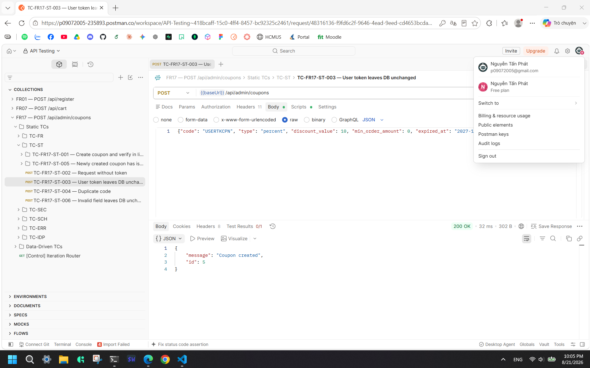
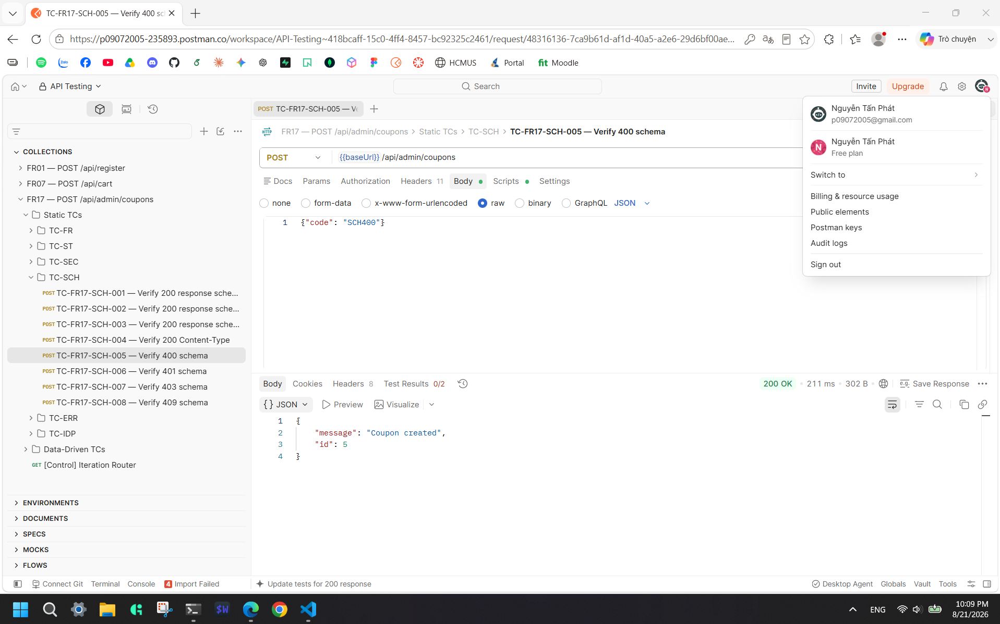
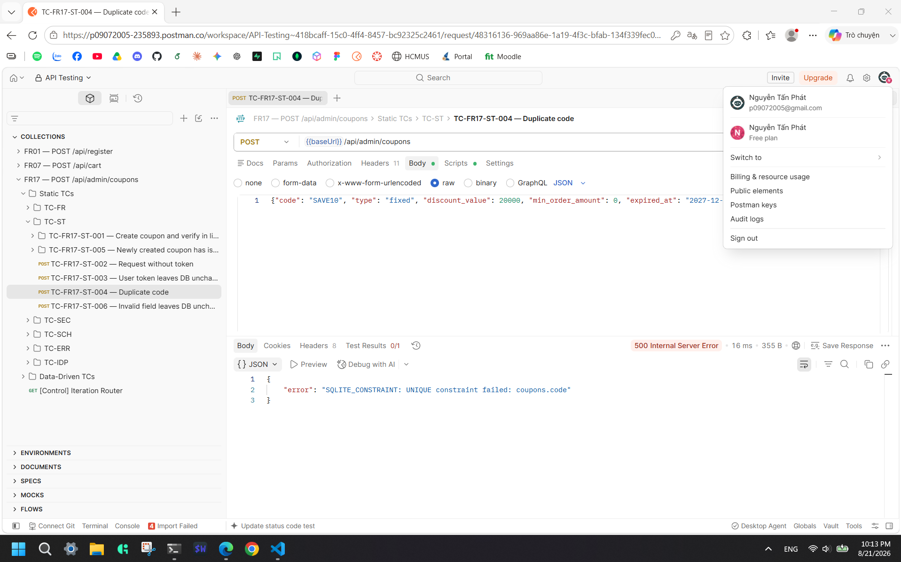
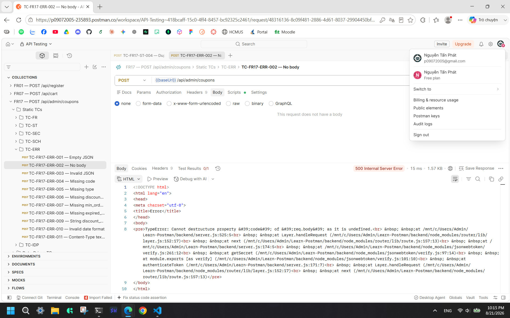

# Bug Report: POST /api/admin/coupons

> **Feature:** FR17 | **Endpoint:** `POST /api/admin/coupons`  
> **Total Bugs:** 4 | **Status:** Approved  
> **Generated:** 2026-08-21

## BUG-FR17-001

**Title:** Broken Function Level Authorization allows regular users to create coupons  
**Severity:** Critical  
**Priority:** P1  
**Root Cause Category:** SECURITY  
**Status:** Open  
**Related TCs:** TC-FR17-ST-003, TC-FR17-SEC-005  
**GitHub Issue:** [#11](https://github.com/phatnguyen975/Learn-Postman/issues/11)

### Description

The API does not enforce role-based access control (RBAC). The `authenticateToken` middleware only validates the JWT signature but fails to check if `req.user.role === 'admin'`. As a result, any authenticated user with the `user` role can successfully create coupons.

**Contract clause violated:** SEC-05 — Endpoints under `/api/admin/*` must verify that the authenticated user possesses the `admin` role.

### Steps to Reproduce

1. Start the API server: `cd backend && node server.js` on `http://localhost:3000`.
2. Obtain a valid JWT by logging in as a regular user (role `user`).
3. Send the following request:

   ```
   POST /api/admin/coupons
   Content-Type: application/json
   Authorization: Bearer <valid_user_token>

   {
     "code": "USER_HACK",
     "type": "percent",
     "discount_value": 10,
     "min_order_amount": 0,
     "expired_at": "2027-12-31"
   }
   ```

4. Observe the successful creation response.

### Expected Result

The server must reject the request with `403 Forbidden` indicating the user does not have admin privileges, and no coupon should be created in the database.

### Actual Result

**HTTP Status:** 200
**Response Body:**

```json
{
  "message": "Coupon created",
  "id": 5
}
```

### Evidence

- **Newman Report:** `postman/reports/fr17-report.html`
- **Screenshot:**



### Impact

Critical security vulnerability (Broken Function Level Authorization / OWASP API5). Any regular customer can arbitrarily create discount coupons for themselves, leading to severe financial loss for the business.

## BUG-FR17-002

**Title:** Complete lack of input validation allows invalid data, SQLi, and XSS payloads  
**Severity:** High  
**Priority:** P2  
**Root Cause Category:** VALIDATION  
**Status:** Open  
**Related TCs:** TC-FR17-FR-006, TC-FR17-FR-007, TC-FR17-FR-010, TC-FR17-FR-011, TC-FR17-FR-012, TC-FR17-FR-014, TC-FR17-FR-015, TC-FR17-FR-016, TC-FR17-FR-019, TC-FR17-FR-020, TC-FR17-ST-006, TC-FR17-SEC-007, TC-FR17-SEC-008, TC-FR17-SEC-009, TC-FR17-SCH-005, TC-FR17-SCH-007, TC-FR17-ERR-001, TC-FR17-ERR-004, TC-FR17-ERR-005, TC-FR17-ERR-006, TC-FR17-ERR-007, TC-FR17-ERR-008, TC-FR17-ERR-009, TC-FR17-ERR-010  
**GitHub Issue:** [#12](https://github.com/phatnguyen975/Learn-Postman/issues/12)

### Description

The API controller extracts fields directly from `req.body` and inserts them into the database without any validation logic. It accepts strings exceeding maximum lengths, dates in the past, invalid enum values (e.g., `type: "bonus"`), negative discount values, and even missing required fields (inserting `null` instead). Furthermore, it stores XSS and SQLi payloads exactly as provided.

**Contract clause violated:** BR-02 through BR-10 (Validation rules for all fields), and SEC-01, SEC-04 (Input validation & Injection prevention).

### Steps to Reproduce

1. Start the API server: `cd backend && node server.js` on `http://localhost:3000`.
2. Obtain a valid JWT by logging in as an admin.
3. Send the following request containing invalid values and an XSS payload:

   ```
   POST /api/admin/coupons
   Content-Type: application/json
   Authorization: Bearer <valid_admin_token>

   {
     "code": "<script>alert('XSS')</script>",
     "type": "invalid_type",
     "discount_value": -50,
     "expired_at": "2020-01-01"
   }
   ```

4. Observe the successful creation response.

### Expected Result

The server must reject the request with `400 Bad Request` and return an error message indicating the fields that failed validation.

### Actual Result

**HTTP Status:** 200
**Response Body:**

```json
{
  "message": "Coupon created",
  "id": 5
}
```

### Evidence

- **Newman Report:** `postman/reports/fr17-report.html`
- **Screenshot:**



### Impact

Compromises data integrity across the entire `coupons` table. It allows stored XSS which could compromise admin accounts when viewing the coupons list on a dashboard. Missing required fields and negative discounts break core business logic.

## BUG-FR17-003

**Title:** Unhandled UNIQUE constraint violation returns 500 Internal Server Error  
**Severity:** Medium  
**Priority:** P3  
**Root Cause Category:** ERROR_HANDLING  
**Status:** Open  
**Related TCs:** TC-FR17-FR-021, TC-FR17-ST-004, TC-FR17-SCH-008, TC-FR17-IDP-001  
**GitHub Issue:** [#13](https://github.com/phatnguyen975/Learn-Postman/issues/13)

### Description

When a request attempts to create a coupon with a `code` that already exists in the database, the SQLite database throws a `SQLITE_CONSTRAINT` error. The API catches this error but blindly propagates it as a generic `500 Internal Server Error` instead of mapping it to a `409 Conflict`.

**Contract clause violated:** BR-01 — The `code` must be unique across the system. Duplicates must return `409 Conflict`.

### Steps to Reproduce

1. Start the API server: `cd backend && node server.js` on `http://localhost:3000`.
2. Obtain a valid JWT by logging in as an admin.
3. Send the following request attempting to create a seed coupon (`SAVE10`):

   ```
   POST /api/admin/coupons
   Content-Type: application/json
   Authorization: Bearer <valid_admin_token>

   {
     "code": "SAVE10",
     "type": "percent",
     "discount_value": 10,
     "min_order_amount": 0,
     "expired_at": "2027-12-31"
   }
   ```

4. Observe the 500 status code response.

### Expected Result

The server should return `409 Conflict` indicating that the coupon code already exists.

### Actual Result

**HTTP Status:** 500
**Response Body:**

```json
{
  "error": "SQLITE_CONSTRAINT: UNIQUE constraint failed: coupons.code"
}
```

### Evidence

- **Newman Report:** `postman/reports/fr17-report.html`
- **Screenshot:**



### Impact

Leads to poor developer experience and incorrect HTTP semantic usage. Clients cannot programmatically distinguish between a true server crash and a simple duplicate resource error, preventing automated error handling or retry mechanisms.

## BUG-FR17-004

**Title:** Empty body or non-JSON Content-Type causes server crash  
**Severity:** High  
**Priority:** P2  
**Root Cause Category:** ERROR_HANDLING  
**Status:** Open  
**Related TCs:** TC-FR17-ERR-002, TC-FR17-ERR-011  
**GitHub Issue:** [#14](https://github.com/phatnguyen975/Learn-Postman/issues/14)

### Description

If the request lacks a body or uses a `Content-Type` other than `application/json` (like `text/plain`), the `body-parser` middleware skips parsing, leaving `req.body` as `undefined`. The controller then attempts to destructure `req.body` (`const { code, ... } = req.body`), which throws a JavaScript `TypeError` and crashes the request handler, returning a raw HTML stack trace.

**Contract clause violated:** Section 4.3 Error Responses — The API must handle invalid payloads gracefully with `400 Bad Request`.

### Steps to Reproduce

1. Start the API server: `cd backend && node server.js` on `http://localhost:3000`.
2. Obtain a valid JWT by logging in as an admin.
3. Send the request with `Content-Type: text/plain`:

   ```
   POST /api/admin/coupons
   Content-Type: text/plain
   Authorization: Bearer <valid_admin_token>

   {"code": "ERR011"}
   ```

4. Observe the HTML stack trace in the response.

### Expected Result

The server must return `400 Bad Request` indicating that the payload is missing or the format is unsupported.

### Actual Result

**HTTP Status:** 500
**Response Body (excerpt):**

```html
<!DOCTYPE html>
<html lang="en">
  <head>
    <meta charset="utf-8" />
    <title>Error</title>
  </head>
  <body>
    <pre>>
  </body>
</html>
```

### Evidence

- **Newman Report:** `postman/reports/fr17-report.html`
- **Screenshot:**



### Impact

Information disclosure via stack traces and potential Denial of Service (if the crash affected the main thread, though Express catches it). It exposes internal server implementation details to the client and presents a highly unprofessional API response.

## Bug Summary Table

| Bug ID       | Title                                                                      | Category       | Severity | Priority | Status |
| ------------ | -------------------------------------------------------------------------- | -------------- | -------- | -------- | ------ |
| BUG-FR17-001 | Broken Function Level Authorization allows regular users to create coupons | SECURITY       | Critical | P1       | Open   |
| BUG-FR17-002 | Complete lack of input validation allows invalid data, SQLi, and XSS       | VALIDATION     | High     | P2       | Open   |
| BUG-FR17-003 | Unhandled UNIQUE constraint violation returns 500 Internal Server Error    | ERROR_HANDLING | Medium   | P3       | Open   |
| BUG-FR17-004 | Empty body or non-JSON Content-Type causes server crash (TypeError)        | ERROR_HANDLING | High     | P2       | Open   |
