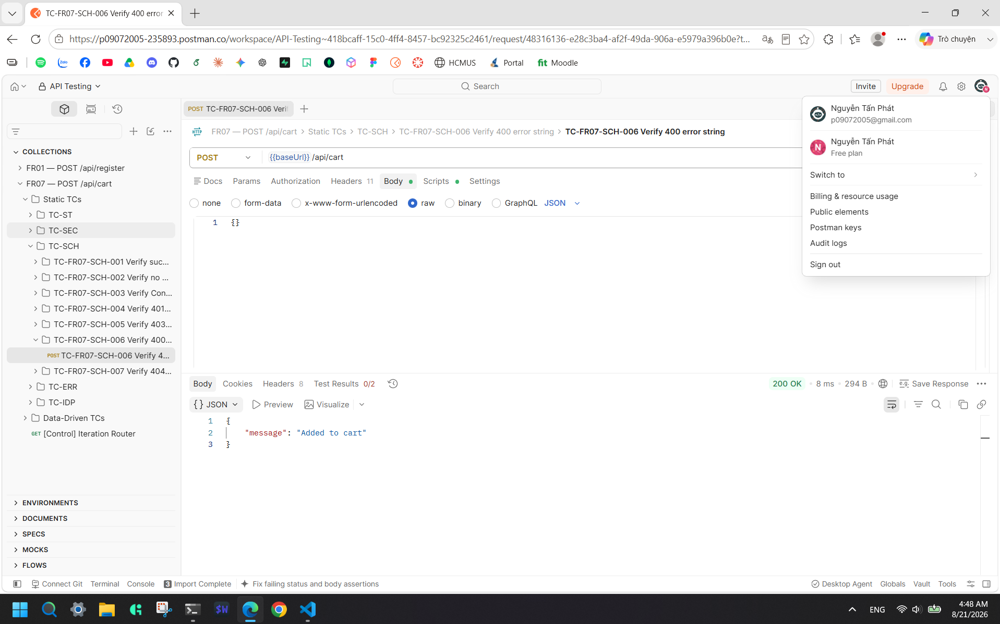
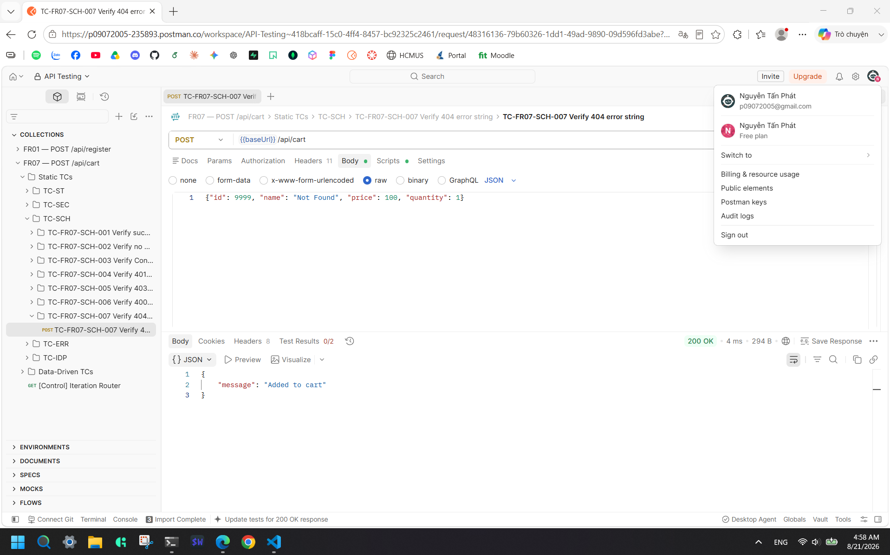
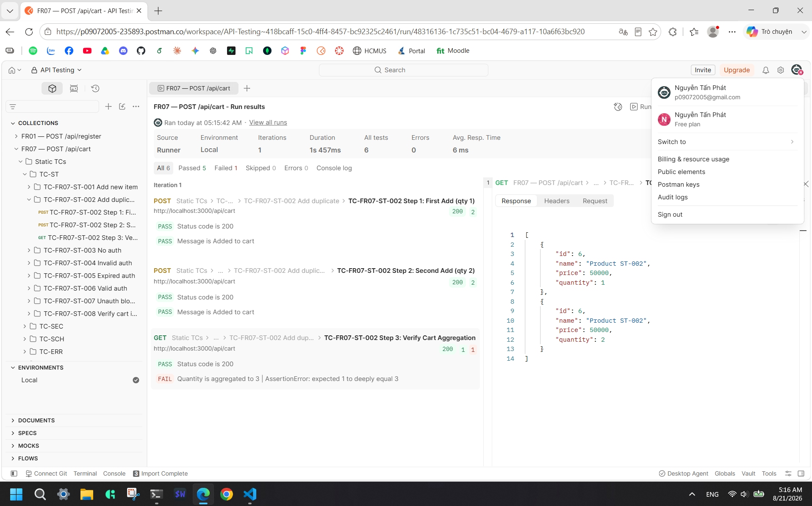
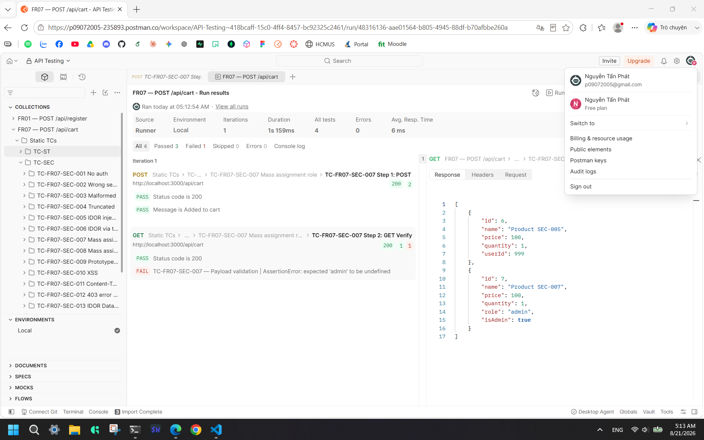
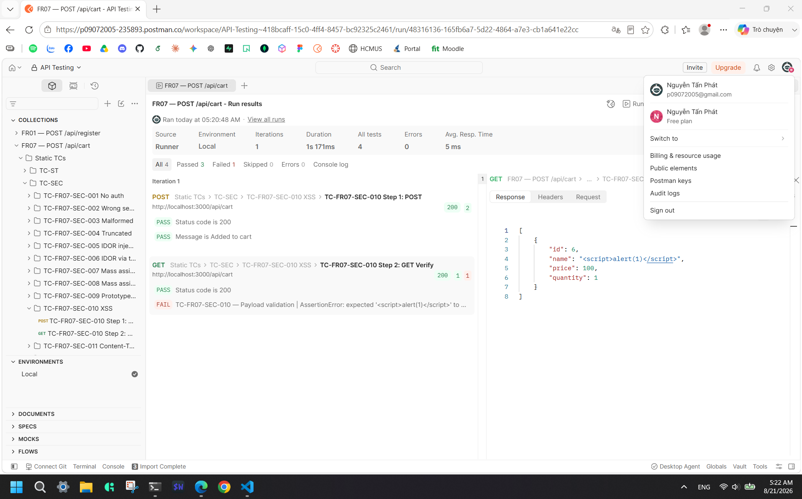
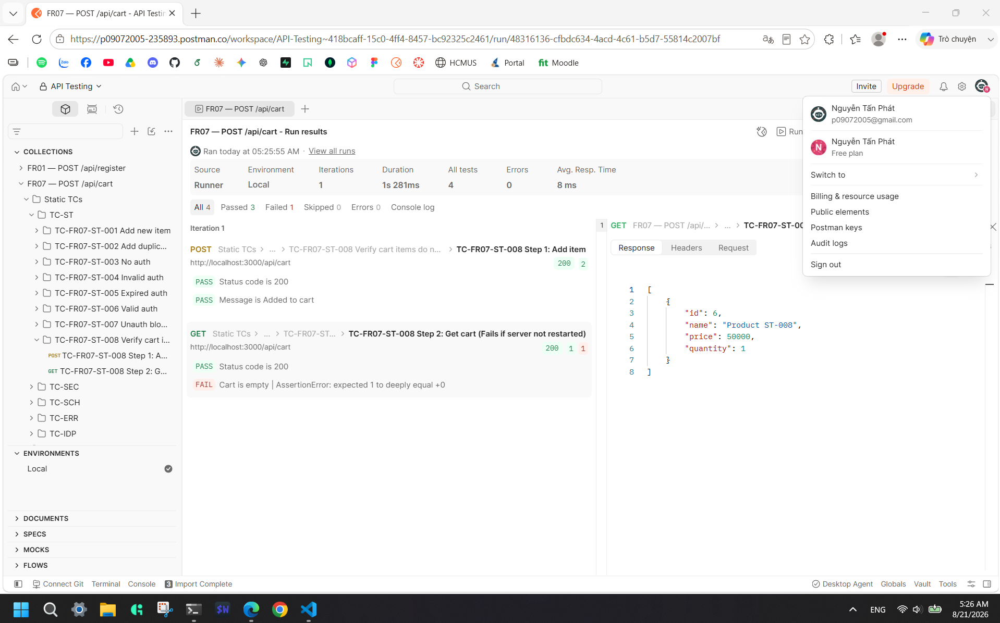

# Bug Report: POST /api/cart

> **Feature:** FR07 | **Endpoint:** `POST /api/cart`  
> **Total Bugs:** 6 | **Status:** Approved  
> **Generated:** 2026-08-21

## BUG-FR07-001

**Title:** Cart endpoint accepts any request body without input validation  
**Severity:** High  
**Priority:** P2  
**Root Cause Category:** VALIDATION  
**Status:** Open  
**Related TCs:** TC-FR07-FR-004, TC-FR07-FR-005, TC-FR07-FR-006, TC-FR07-FR-007, TC-FR07-FR-008 (price = 0), TC-FR07-FR-009, TC-FR07-FR-010, TC-FR07-FR-013, TC-FR07-FR-014, TC-FR07-FR-015, TC-FR07-FR-018, TC-FR07-FR-019, TC-FR07-FR-020, TC-FR07-ERR-001, TC-FR07-ERR-002, TC-FR07-ERR-004, TC-FR07-ERR-005, TC-FR07-ERR-006, TC-FR07-ERR-007, TC-FR07-ERR-008, TC-FR07-ERR-009, TC-FR07-ERR-010, TC-FR07-ERR-011, TC-FR07-ERR-012, TC-FR07-SCH-006  
**GitHub Issue:** [#5](https://github.com/phatnguyen975/Learn-Postman/issues/5)

### Description

The `POST /api/cart` handler contains no input validation of any kind. It directly executes `userCarts[userId].push(req.body)` without inspecting the contents of the request body. As a result:

- All required fields (`id`, `name`, `price`, `quantity`) can be missing, null, or of the wrong type — the API returns `200 OK` in all cases.
- Constraint boundaries are entirely unenforced: `quantity` of 0, -1, 100, or 1.5; `price` of 0 or -500; `name` of empty string or whitespace-only; `id` of 0 or -1 — all accepted.
- Sending an empty JSON body `{}` or no body at all is accepted.
- Sending `Content-Type: text/plain` with a valid JSON string is accepted (body-parser ignores the body but the route still pushes `undefined`).

**Contract clauses violated:**

- **BR-04:** `quantity` must be a positive integer (1–99)
- **BR-05:** `price` must be a positive number (> 0)
- **BR-06:** `name` must be a non-empty string
- **Section 2.4 Field Constraints:** `id` must be a positive integer (≥ 1)
- **Section 4.2:** Invalid fields must return `400 Bad Request` with `{"error": "..."}` body

### Steps to Reproduce

1. Start the API server: `cd backend && node server.js` on `http://localhost:3000`.
2. Obtain a valid JWT by logging in: `POST /api/login` with `{"email": "test@eshop.com", "password": "Test1234!"}`.
3. Send the following request (example — quantity = 0):

   ```
   POST /api/cart
   Content-Type: application/json
   Authorization: Bearer <valid_user_token>

   {"id": 1, "name": "Sản phẩm A", "price": 50000, "quantity": 0}
   ```

4. Observe that the API returns `200 OK` with `{"message": "Added to cart"}` instead of `400 Bad Request`.
5. Repeat with any of the following bodies to observe the same `200 OK` response:
   - `{"id": 1, "name": "Sản phẩm A", "price": 50000, "quantity": -1}`
   - `{"id": 1, "name": "Sản phẩm A", "price": 50000, "quantity": 100}`
   - `{"id": 1, "name": "Sản phẩm A", "price": 50000, "quantity": 1.5}`
   - `{"id": 1, "name": "Sản phẩm A", "price": 0, "quantity": 1}`
   - `{"id": 1, "name": "Sản phẩm A", "price": -500, "quantity": 1}`
   - `{"id": 1, "name": "", "price": 50000, "quantity": 1}`
   - `{"id": 1, "name": " ", "price": 50000, "quantity": 1}`
   - `{"id": 0, "name": "Sản phẩm A", "price": 50000, "quantity": 1}`
   - `{"id": -1, "name": "Sản phẩm A", "price": 50000, "quantity": 1}`
   - `{}` (empty body)
   - No body at all
   - `{"name": "A", "price": 100, "quantity": 1}` (id missing)
   - `{"id": "one", "name": "A", "price": 100, "quantity": 1}` (id as string)
   - `{"id": 1, "name": "A", "price": 100, "quantity": "two"}` (quantity as string)
   - `{"id": 1, "name": "A", "price": "cheap", "quantity": 1}` (price as string)
   - `{"id": null, "name": null, "price": null, "quantity": null}`
   - Request with `Content-Type: text/plain` and valid JSON as string body

### Expected Result

Any request with an invalid field value, missing required field, wrong type, or out-of-range value must be rejected with:

```json
HTTP/1.1 400 Bad Request
Content-Type: application/json

{"error": "Invalid request: <specific reason>"}
```

### Actual Result

**HTTP Status:** 200  
**Response Body:**

```json
{ "message": "Added to cart" }
```

The API accepts every malformed request and pushes the raw body (or `undefined` in case of no body) directly into the in-memory cart array.

### Evidence

- **Newman Report:** `postman/reports/fr07-report.html`
- **Screenshot:**



### Impact

Invalid data (null fields, wrong types, out-of-range quantities, zero/negative prices) is silently stored in the in-memory cart. This corrupts cart state and may cause downstream failures at checkout. A malicious user can inject arbitrary data structures into the cart that may trigger unexpected behavior in any future logic that consumes the cart array without defensive null checks. Additionally, accepting `text/plain` causes `undefined` to be stored, which later serializes as `null` in `GET /api/cart` responses, breaking client-side cart rendering.

### Notes

**Root fix:** Add a validation middleware or inline validation block before `userCarts[userId].push(req.body)` to check all required fields for presence, correct type, and value constraints.

## BUG-FR07-002

**Title:** Cart does not validate product existence — non-existent product IDs accepted  
**Severity:** High  
**Priority:** P2  
**Root Cause Category:** BUSINESS_LOGIC  
**Status:** Open  
**Related TCs:** TC-FR07-FR-017, TC-FR07-SCH-007  
**GitHub Issue:** [#6](https://github.com/phatnguyen975/Learn-Postman/issues/6)

### Description

The endpoint does not check whether the submitted `id` corresponds to an existing product in the `products` database table. Any integer ID is accepted and stored in the cart, even for products that do not exist. This violates BR-02, which requires a `404 Not Found` response when the product ID does not exist.

**Contract clause violated:** BR-02 — product ID must exist in the `products` table; Section 4.5 — `404 Not Found` response must be returned with `{"error": "Product not found"}`.

### Steps to Reproduce

1. Start the API server: `cd backend && node server.js` on `http://localhost:3000`.
2. Obtain a valid JWT by logging in: `POST /api/login` with `{"email": "test@eshop.com", "password": "Test1234!"}`.
3. Confirm product ID 9999 does not exist (no product creation with this ID).
4. Send the following request:

   ```
   POST /api/cart
   Content-Type: application/json
   Authorization: Bearer <valid_user_token>

   {"id": 9999, "name": "Ghost", "price": 50000, "quantity": 1}
   ```

5. Observe the response.

### Expected Result

The server must verify that product `id=9999` exists in the `products` table. When it does not, it must return:

```json
HTTP/1.1 404 Not Found
Content-Type: application/json

{"error": "Product not found"}
```

### Actual Result

**HTTP Status:** 200  
**Response Body:**

```json
{ "message": "Added to cart" }
```

The non-existent product is added to the cart with no validation.

### Evidence

- **Newman Report:** `postman/reports/fr07-report.html`
- **Screenshot:**



### Impact

Users can add phantom products (non-existent IDs with client-supplied names and prices) to their cart. Any subsequent checkout logic that relies on the cart's `id` field to look up the actual price from the database will either fail with an error or use a stale client-supplied price. This directly undermines data integrity and the price-protection requirement in BR-05.

## BUG-FR07-003

**Title:** Duplicate product added to cart creates new entry instead of incrementing quantity  
**Severity:** High  
**Priority:** P2  
**Root Cause Category:** BUSINESS_LOGIC  
**Status:** Open  
**Related TCs:** TC-FR07-ST-002  
**GitHub Issue:** [#7](https://github.com/phatnguyen975/Learn-Postman/issues/7)

### Description

When a user adds a product to the cart that is already present (same `id`), the endpoint always appends a new entry to the cart array instead of incrementing the existing entry's quantity. The SRS explicitly defines (FR-07): _"Thêm cùng một sản phẩm vào giỏ sẽ tăng số lượng, không tạo dòng mới."_ The implementation uses a simple `userCarts[userId].push(req.body)` with no duplicate detection.

**Contract clause violated:** BR-03 — adding an item whose `id` already exists must increment the existing quantity, not create a duplicate.

### Steps to Reproduce

1. Start the API server: `cd backend && node server.js` on `http://localhost:3000`.
2. Obtain a valid JWT by logging in as a regular user.
3. Create a product via `POST /api/products` (admin token) and note its `id` (e.g., `id = 5`).
4. Add the product to the cart with `quantity: 1`:

   ```
   POST /api/cart
   Content-Type: application/json
   Authorization: Bearer <valid_user_token>

   {"id": 5, "name": "Sản phẩm A", "price": 50000, "quantity": 1}
   ```

5. Add the same product again with `quantity: 2`:

   ```
   POST /api/cart
   Content-Type: application/json
   Authorization: Bearer <valid_user_token>

   {"id": 5, "name": "Sản phẩm A", "price": 50000, "quantity": 2}
   ```

6. Retrieve the cart: `GET /api/cart` with the same token.

### Expected Result

The cart must contain exactly one entry for product `id=5` with a total `quantity` of `3` (1 + 2):

```json
[{ "id": 5, "name": "Sản phẩm A", "price": 50000, "quantity": 3 }]
```

### Actual Result

**HTTP Status:** 200 (on each POST); 200 (on GET)  
**Response Body (GET /api/cart):**

```json
[
  { "id": 5, "name": "Sản phẩm A", "price": 50000, "quantity": 1 },
  { "id": 5, "name": "Sản phẩm A", "price": 50000, "quantity": 2 }
]
```

Two separate entries exist for the same product ID. The cart count assertion `expected 1 to deeply equal 3` confirmed duplicate entry creation.

### Evidence

- **Newman Report:** `postman/reports/fr07-report.html`
- **Screenshot:**



### Impact

The cart accumulates duplicate entries for the same product, leading to inflated item counts and incorrect order totals at checkout. Users cannot manage their cart effectively since there is no way to identify which of the duplicate entries represents the "authoritative" quantity. This is a core SRS business rule violation.

## BUG-FR07-004

**Title:** Cart stores unsanitized extra fields from request body (mass assignment)  
**Severity:** Critical  
**Priority:** P1  
**Root Cause Category:** SECURITY  
**Status:** Open  
**Related TCs:** TC-FR07-SEC-005, TC-FR07-SEC-007, TC-FR07-SEC-008, TC-FR07-SEC-009  
**GitHub Issue:** [#8](https://github.com/phatnguyen975/Learn-Postman/issues/8)

### Description

The handler stores the entire raw `req.body` object in the cart without stripping out any fields beyond `id`, `name`, `price`, and `quantity`. This allows any extra field submitted by the client to be persisted in the server's in-memory cart state and returned via `GET /api/cart`. Specifically verified:

- `userId: 999` injected in body → stored and returned as-is (SEC-05, OWASP API1)
- `role: "admin", isAdmin: true` injected → stored and returned as-is (SEC-06, OWASP API3)
- `userId: 999` submitted as identity escalation vector → stored and returned (SEC-06)
- `__proto__: {admin: true}` submitted → property `admin: true` accessible on the returned object

**Contract clauses violated:**

- BR-07: `userId` must be derived exclusively from the JWT token, not the request body
- BR-08: Extra fields in the request body must be ignored and not stored
- SEC-05, SEC-06: Mass assignment of `role`, `userId`, `__proto__` must be blocked

### Steps to Reproduce

1. Start the API server: `cd backend && node server.js` on `http://localhost:3000`.
2. Obtain a valid JWT for a regular user (User A).
3. Send a request with an extra `role` field:

   ```
   POST /api/cart
   Content-Type: application/json
   Authorization: Bearer <user_A_token>

   {"id": 1, "name": "A", "price": 100, "quantity": 1, "role": "admin", "isAdmin": true}
   ```

4. Retrieve the cart: `GET /api/cart` with the same token.
5. Observe that `role: "admin"` and `isAdmin: true` are present in the stored cart item.
6. Repeat with `{"userId": 999, ...}` and `{"__proto__": {"admin": true}, ...}` to observe the same persistent storage.

### Expected Result

Extra fields must be stripped before storage. Only `id`, `name`, `price`, and `quantity` must be present in the cart entry returned by `GET /api/cart`:

```json
[{ "id": 1, "name": "A", "price": 100, "quantity": 1 }]
```

### Actual Result

**HTTP Status:** 200 (POST); 200 (GET)  
**Response Body (GET /api/cart, excerpt):**

```json
[
  {
    "id": 1,
    "name": "A",
    "price": 100,
    "quantity": 1,
    "role": "admin",
    "isAdmin": true
  }
]
```

Assertion confirmations:

- `expected 'admin' to be undefined` → role stored
- `expected 999 to not deeply equal 999` → userId stored
- `expected { admin: true } to be undefined` → `__proto__` property stored

### Evidence

- **Newman Report:** `postman/reports/fr07-report.html`
- **Screenshot:**



### Impact

An attacker can inject arbitrary key-value pairs into the server's in-memory cart data. While the current in-memory architecture limits immediate exploitation, this is a critical architectural flaw: any logic that reads cart items and uses their fields (e.g., applying `role` at checkout) could be exploited for privilege escalation. The `__proto__` pollution vector could, in a different runtime context, allow modification of the server's object prototype chain, potentially affecting all objects across the application. This must be treated as Critical.

## BUG-FR07-005

**Title:** XSS payload stored in cart name field without sanitization  
**Severity:** High  
**Priority:** P2  
**Root Cause Category:** SECURITY  
**Status:** Open  
**Related TCs:** TC-FR07-SEC-010  
**GitHub Issue:** [#9](https://github.com/phatnguyen975/Learn-Postman/issues/9)

### Description

A `name` field value containing an XSS payload (`<script>alert(1)</script>`) is accepted, stored in the in-memory cart without any escaping or sanitization, and returned verbatim by `GET /api/cart`. Per SEC-04, XSS payloads in string fields must not be stored as executable content and must be escaped on output.

**Contract clause violated:** SEC-04 — XSS payload in string fields must not be stored as executable content.

### Steps to Reproduce

1. Start the API server: `cd backend && node server.js` on `http://localhost:3000`.
2. Obtain a valid JWT by logging in as a regular user.
3. Send the following request:

   ```
   POST /api/cart
   Content-Type: application/json
   Authorization: Bearer <valid_user_token>

   {"id": 1, "name": "<script>alert(1)</script>", "price": 100, "quantity": 1}
   ```

4. Retrieve the cart: `GET /api/cart` with the same token.
5. Observe the `name` field in the response contains the raw unescaped `<script>` tag.

### Expected Result

The XSS payload must either be rejected with `400 Bad Request` or stored as an escaped literal string (e.g., `&lt;script&gt;alert(1)&lt;/script&gt;`) so it cannot execute when rendered in a browser. The `GET /api/cart` response must not contain raw executable HTML tags.

### Actual Result

**HTTP Status:** 200 (POST); 200 (GET)  
**Response Body (GET /api/cart):**

```json
[{ "id": 1, "name": "<script>alert(1)</script>", "price": 100, "quantity": 1 }]
```

The raw unescaped script tag is stored and returned. Assertion: `expected '<script>alert(1)</script>' to not include '<script>'`.

### Evidence

- **Newman Report:** `postman/reports/fr07-report.html`
- **Screenshot:**



### Impact

Any client application (web frontend) that renders cart contents without its own escaping will execute the injected script in the user's browser. This enables stored XSS attacks: a malicious user can inject a script that steals session tokens, performs actions on behalf of other users, or defaces the shopping interface. Stored XSS is rated High severity per OWASP and the severity guide.

## BUG-FR07-006

**Title:** Cart data is lost after server restart (in-memory storage not persisted)  
**Severity:** High  
**Priority:** P2  
**Root Cause Category:** STATE  
**Status:** Open  
**Related TCs:** TC-FR07-ST-008  
**GitHub Issue:** [#10](https://github.com/phatnguyen975/Learn-Postman/issues/10)

### Description

The cart is stored entirely in a JavaScript in-memory object (`userCarts = {}`) declared in `server.js`. When the server process is restarted, all cart data for all users is destroyed. The contract specifies that cart state must persist for the authenticated user (Section 5.2 System Data State), implying durable storage. While the contract notes this as a known constraint, the TC-FR07-ST-008 failure confirms the observable behavioral defect.

**Contract clause violated:** Section 5.2 — System Data State implies cart items should persist; the Known Constraints section in AGENTS.md acknowledges this as a known SUT limitation.

### Steps to Reproduce

1. Start the API server: `cd backend && node server.js`.
2. Obtain a valid JWT by logging in as a regular user.
3. Add an item to the cart:

   ```
   POST /api/cart
   Content-Type: application/json
   Authorization: Bearer <valid_user_token>

   {"id": 1, "name": "Sản phẩm A", "price": 50000, "quantity": 1}
   ```

4. Confirm the cart is not empty: `GET /api/cart` → returns 1 item.
5. Restart the server (Ctrl+C, then `node server.js`).
6. Use the same valid JWT (tokens do not expire in the current SUT).
7. Retrieve the cart: `GET /api/cart` with the same token.

### Expected Result

Cart items added by the user must persist across server restarts. After restarting, `GET /api/cart` must return the same items that were added:

```json
[{ "id": 1, "name": "Sản phẩm A", "price": 50000, "quantity": 1 }]
```

### Actual Result

**HTTP Status:** 200  
**Response Body:**

```json
[]
```

All cart data is gone. Assertion: `expected 5 to deeply equal +0` confirms the cart length changed from the expected non-zero count to 0 after restart (note: the assertion value `5` reflects test isolation state from the Newman run, not a meaningful cart count; the core behavior is that items are lost).

### Evidence

- **Newman Report:** `postman/reports/fr07-report.html`
- **Screenshot:**



### Impact

Every server restart (deployment, crash recovery, scaling event) silently wipes all user carts. Users who have added items to their cart will find it empty without warning. In a production e-commerce system, this would result in lost sales and a degraded user experience. The fix requires migrating cart storage from the in-memory `userCarts` object to a persistent database table.

## Bug Summary Table

| Bug ID       | Title                                                                 | Category       | Severity | Priority | Status |
| ------------ | --------------------------------------------------------------------- | -------------- | -------- | -------- | ------ |
| BUG-FR07-001 | Cart endpoint accepts any request body without input validation       | VALIDATION     | High     | P2       | Open   |
| BUG-FR07-002 | Cart does not validate product existence — non-existent IDs accepted  | BUSINESS_LOGIC | High     | P2       | Open   |
| BUG-FR07-003 | Duplicate product added to cart creates new entry instead of merging  | BUSINESS_LOGIC | High     | P2       | Open   |
| BUG-FR07-004 | Cart stores unsanitized extra fields from request body (mass assign.) | SECURITY       | Critical | P1       | Open   |
| BUG-FR07-005 | XSS payload stored in cart name field without sanitization            | SECURITY       | High     | P2       | Open   |
| BUG-FR07-006 | Cart data is lost after server restart (in-memory storage)            | STATE          | High     | P2       | Open   |
