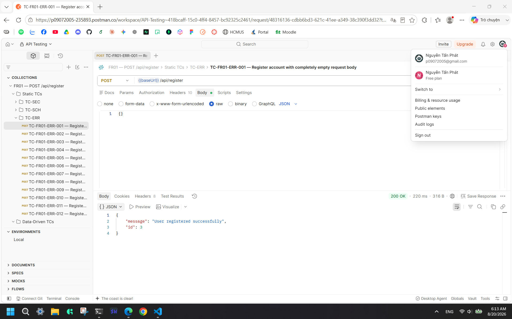
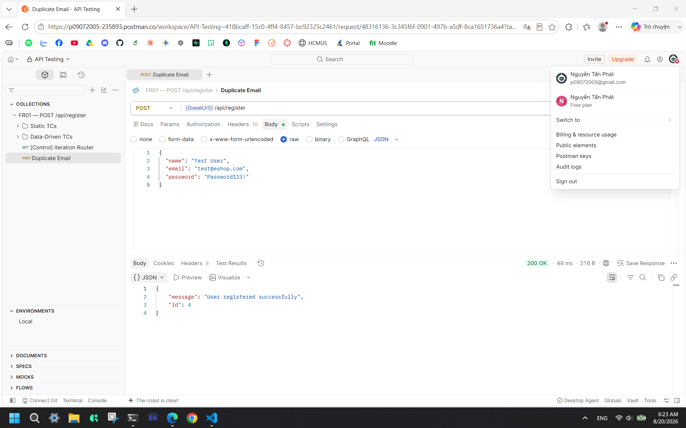
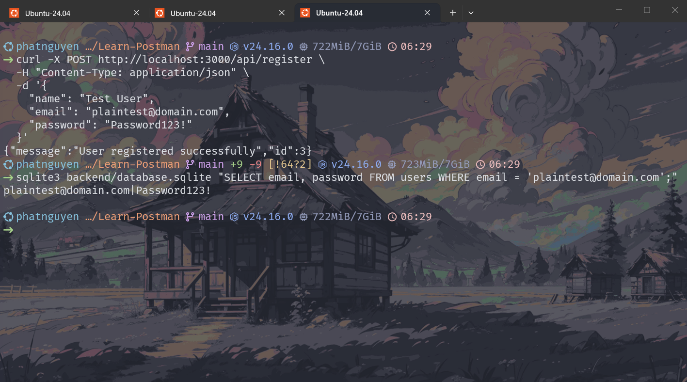
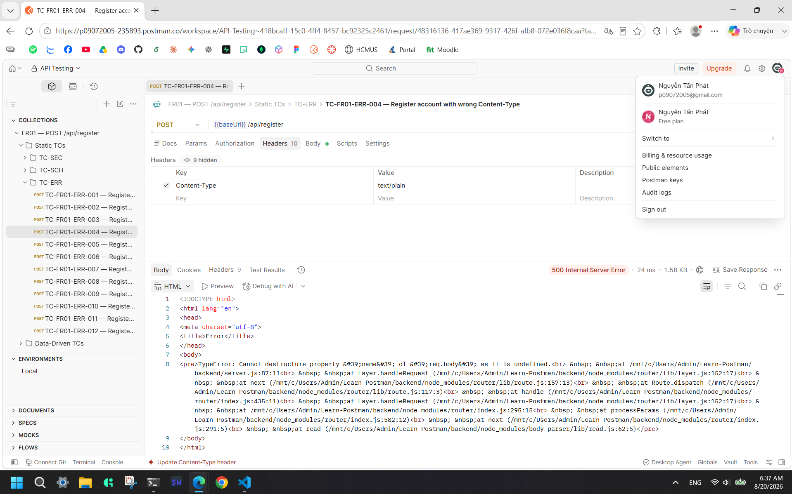

# Bug Report: POST /api/register

> **Feature:** FR01 | **Endpoint:** `POST /api/register`  
> **Total Bugs:** 4 | **Status:** Approved  
> **Generated:** 2026-08-20

## BUG-FR01-001

**Title:** Registration accepts any input without field validation — no 400 returned  
**Severity:** High  
**Priority:** P2  
**Root Cause Category:** VALIDATION  
**Status:** Open  
**Related TCs:** TC-FR01-FR-004, TC-FR01-FR-005, TC-FR01-FR-006, TC-FR01-FR-008, TC-FR01-FR-009, TC-FR01-FR-010, TC-FR01-FR-012, TC-FR01-FR-014, TC-FR01-FR-016, TC-FR01-FR-017, TC-FR01-FR-018, TC-FR01-FR-019, TC-FR01-FR-020, TC-FR01-ERR-001, TC-FR01-ERR-002, TC-FR01-ERR-005, TC-FR01-ERR-006, TC-FR01-ERR-007, TC-FR01-ERR-008, TC-FR01-ERR-009, TC-FR01-ERR-010, TC-FR01-ERR-011, TC-FR01-SCH-005, TC-FR01-SCH-006  
**GitHub Issue:** [#1](https://github.com/phatnguyen975/Learn-Postman/issues/1)

### Description

The `POST /api/register` endpoint performs no input validation on any request field. All of the following invalid inputs are accepted and result in `200 OK`:

- `name` missing, null, empty (`""`), whitespace-only (`" "`), or exceeding 100 characters
- `email` missing, null, invalid RFC 5322 format, or exceeding 254 characters
- `password` missing, null, below 8 characters, exceeding 128 characters, or failing complexity policy
- An entirely empty request body `{}` or no body at all
- Fields with wrong types (integer, boolean)

As a secondary consequence, because no error path is ever executed, all error response bodies (which must use the `"error"` key per contract) are never emitted. When validation is implemented, error responses must use `{"error": "..."}` — not `{"message": "..."}`.

This violates:

- **BR-01:** All three fields are required; missing fields must return `400 Bad Request`
- **BR-02:** `email` must conform to RFC 5322; invalid format must return `400 Bad Request`
- **BR-04:** `password` must satisfy the strong password policy; failing values must return `400 Bad Request`
- **BR-06:** `name` must not be empty or whitespace-only
- **Section 4.2:** `400 Bad Request` response body must use key `"error"`, not `"message"`

### Steps to Reproduce

**Example 1 — Missing required field:**

1. Start the API server on `localhost:3000`.
2. Send the following request:

   ```
   POST /api/register
   Content-Type: application/json

   {
     "email": "no-name@domain.com",
     "password": "Password123!"
   }
   ```

3. Observe `200 OK` with `{"message": "User registered successfully", "id": <integer>}` instead of `400 Bad Request`.

**Example 2 — Invalid email format:**

1. Start the API server.
2. Send the following request:

   ```
   POST /api/register
   Content-Type: application/json

   {
     "name": "Test User",
     "email": "invalidemail.com",
     "password": "Password123!"
   }
   ```

3. Observe `200 OK` returned instead of `400 Bad Request`.

**Example 3 — Weak password (missing uppercase):**

1. Start the API server.
2. Send the following request:

   ```
   POST /api/register
   Content-Type: application/json

   {
     "name": "Test User",
     "email": "no-upper@domain.com",
     "password": "password1!"
   }
   ```

3. Observe `200 OK` returned instead of `400 Bad Request`.

**Example 4 — Empty request body:**

1. Start the API server.
2. Send the following request:

   ```
   POST /api/register
   Content-Type: application/json

   {}
   ```

3. Observe `200 OK` returned instead of `400 Bad Request`.

### Expected Result

Any request where `name`, `email`, or `password` is missing, null, empty, whitespace-only, has invalid format, or fails the password complexity policy must be rejected with:

```json
HTTP 400 Bad Request
{
  "error": "<specific validation error message>"
}
```

The field constraints are:

- `name`: required, non-empty, non-whitespace-only, 1–100 characters
- `email`: required, RFC 5322 format, max 254 characters
- `password`: required, 8–128 characters, ≥1 uppercase, ≥1 lowercase, ≥1 digit, ≥1 special character from `@$!%*?&`

### Actual Result

**HTTP Status:** 200  
**Response Body:**

```json
{
  "message": "User registered successfully",
  "id": 3
}
```

The API accepts all invalid inputs and responds with a success message. No validation error is ever returned for field-level failures. The response key is `"message"`, not `"error"` as required by the contract for error responses.

### Evidence

- **Newman Report:** `postman/reports/fr01-report.html`
- **Screenshot:**



### Impact

- **Data pollution:** Any string, null, empty value, or wrong type can be registered, corrupting data quality.
- **Weak password acceptance:** Passwords with no complexity requirements are accepted, undermining account security.
- **Schema non-compliance:** Error responses use the wrong key (`"message"` instead of `"error"`), breaking API consumers that rely on the documented schema.

### Notes

None.

## BUG-FR01-002

**Title:** Duplicate email registration succeeds — no uniqueness enforcement  
**Severity:** High  
**Priority:** P2  
**Root Cause Category:** BUSINESS_LOGIC  
**Status:** Open  
**Related TCs:** TC-FR01-FR-021, TC-FR01-FR-022  
**GitHub Issue:** [#2](https://github.com/phatnguyen975/Learn-Postman/issues/2)

### Description

The `POST /api/register` endpoint does not enforce email uniqueness. Registering with an email already in the system — whether exact-case or different-case — succeeds with `200 OK` and creates a duplicate record.

This violates:

- **BR-03:** Email must be unique system-wide, case-insensitive. Duplicate registration must return `409 Conflict`.
- **Section 4.3:** `409 Conflict` with `{"error": "Email already registered"}` must be returned for duplicate email attempts.

### Steps to Reproduce

1. Start the API server on `localhost:3000`.
2. Ensure a user with email `test@eshop.com` already exists (seeded by default, or register one first).
3. Send the following request:

   ```
   POST /api/register
   Content-Type: application/json

   {
     "name": "Other User",
     "email": "test@eshop.com",
     "password": "Password123!"
   }
   ```

4. Observe `200 OK` instead of `409 Conflict`.
5. Repeat with different case (`TEST@ESHOP.COM`) — observe `200 OK` again, a second duplicate row is created.

### Expected Result

When a user attempts to register with an email already present in the system (case-insensitive comparison), the API must respond:

```json
HTTP 409 Conflict
{
  "error": "Email already registered"
}
```

No new user record must be created.

### Actual Result

**HTTP Status:** 200  
**Response Body:**

```json
{
  "message": "User registered successfully",
  "id": 4
}
```

A duplicate row is silently inserted. The different-case variant also succeeds with a new ID, creating a third row for the same email address.

### Evidence

- **Newman Report:** `postman/reports/fr01-report.html`
- **Screenshot:**



### Impact

- **Account integrity:** Multiple accounts can exist for the same email, breaking login, password reset, and order history attribution.
- **Identity confusion:** A user could register `ADMIN@ESHOP.COM` if `admin@eshop.com` already exists, potentially confusing case-sensitive lookups.

### Notes

None.

## BUG-FR01-003

**Title:** Password stored as plaintext — no hashing applied  
**Severity:** Critical  
**Priority:** P1  
**Root Cause Category:** SECURITY  
**Status:** Open  
**GitHub Issue:** [#3](https://github.com/phatnguyen975/Learn-Postman/issues/3)

### Description

The `POST /api/register` endpoint stores the submitted password directly in the database without any cryptographic hashing. The raw plaintext password is stored verbatim.

This violates:

- **BR-05:** Passwords must be stored as cryptographic hashes (e.g., bcrypt cost factor ≥ 10).
- **SEC-01:** Plaintext password storage is explicitly prohibited.
- **Section 7 — DEV-01:** Documented as Critical severity deviation.

### Steps to Reproduce

1. Start the API server on `localhost:3000`.
2. Register a new user:

   ```
   POST /api/register
   Content-Type: application/json

   {
     "name": "Test User",
     "email": "plaintest@domain.com",
     "password": "Password123!"
   }
   ```

3. Verify the stored password using:

   ```bash
   sqlite3 backend/database.sqlite "SELECT email, password FROM users WHERE email = 'plaintest@domain.com';"
   ```

4. Observe that the `password` column contains the literal string `Password123!` in plaintext.

### Expected Result

The password must be stored as a bcrypt hash (cost factor ≥ 10). The database row must contain a value such as:

```
$2b$10$XXXXXXXXXXXXXXXXXXXXXXXXXXXXXXXXXXXXXXXXXXXXXXXXXXX
```

The plaintext password must never appear anywhere in the system after registration.

### Actual Result

**HTTP Status:** 200 (registration succeeds)  
**Database content after registration:**

```
email                 | password
plaintest@domain.com  | Password123!
```

The plaintext password is stored verbatim.

### Evidence

- **Newman Report:** `postman/reports/fr01-report.html`
- **Screenshot:**



### Impact

- **Critical data breach risk:** Any entity with database read access immediately sees all user passwords without decryption or cracking.
- **Credential stuffing:** Plaintext passwords can be directly used for credential stuffing attacks on third-party services.
- **Regulatory violation:** Plaintext password storage violates GDPR Article 32, PCI DSS Requirement 8.2.1, and OWASP ASVS Level 1 requirements.

### Notes

None.

## BUG-FR01-004

**Title:** Invalid JSON and wrong Content-Type return HTML error page instead of JSON  
**Severity:** Medium  
**Priority:** P3  
**Root Cause Category:** SCHEMA  
**Status:** Open  
**Related TCs:** TC-FR01-ERR-003, TC-FR01-ERR-004  
**GitHub Issue:** [#4](https://github.com/phatnguyen975/Learn-Postman/issues/4)

### Description

When the request body contains invalid JSON syntax or when `Content-Type: text/plain` is sent instead of `application/json`, the API returns an HTML error page instead of a structured JSON error response.

- **TC-FR01-ERR-003** (invalid JSON): Returns `400 Bad Request` with an HTML body containing a raw `SyntaxError` stack trace.
- **TC-FR01-ERR-004** (wrong Content-Type): Returns `500 Internal Server Error` with an HTML body containing a `TypeError` stack trace and internal file paths.

This violates:

- **Section 4.4:** Malformed JSON must return `400 Bad Request` with `Content-Type: application/json` and body `{"error": "Bad Request"}`.
- **BR-10:** The status code for invalid JSON (400) is correct in ERR-003, but the response body format is wrong.
- **ERR-004 additionally:** Returning `500` for a wrong Content-Type is semantically incorrect — this is a client error and must return `400`.

### Steps to Reproduce

**Example 1 — Invalid JSON syntax:**

1. Start the API server on `localhost:3000`.
2. Send the following request with intentionally malformed JSON:

   ```
   POST /api/register
   Content-Type: application/json

   {"name": "Test", "email": "test@domain.com" "password": "Password123!"}
   ```

   (Note: missing comma between `email` and `password` values)

3. Observe that the response is `400 Bad Request` but the body is an HTML page with a `SyntaxError` stack trace, not `{"error": "Bad Request"}`.

**Example 2 — Wrong Content-Type:**

1. Start the API server.
2. Send the following request with `Content-Type: text/plain`:

   ```
   POST /api/register
   Content-Type: text/plain

   {"name": "Test User", "email": "ct-test@domain.com", "password": "Password123!"}
   ```

3. Observe that the response is `500 Internal Server Error` with an HTML page exposing a `TypeError` and internal file paths.

### Expected Result

Both cases must return:

```json
HTTP 400 Bad Request
Content-Type: application/json

{
  "error": "Bad Request"
}
```

No stack traces, internal error messages, or HTML pages must be returned to the client.

### Actual Result

**TC-FR01-ERR-003 — HTTP Status:** 400  
**Response Body (HTML, excerpt):**

```
SyntaxError: Expected ',' or '}' after property value in JSON at position 21 (line 1 column 22)
    at JSON.parse (<anonymous>)
    ...
```

**TC-FR01-ERR-004 — HTTP Status:** 500  
**Response Body (HTML, excerpt):**

```
TypeError: Cannot destructure property 'name' of 'req.body' as it is undefined.
    ...
```

Both responses expose internal stack traces and implementation details.

### Evidence

- **Newman Report:** `postman/reports/fr01-report.html`
- **Screenshot:**



### Impact

- **Information disclosure:** Stack traces reveal internal file paths and implementation details, exploitable for codebase mapping (OWASP API8:2023 — Security Misconfiguration).
- **Client integration breakage:** API consumers expecting JSON error format will receive HTML, causing parsing failures.
- **Incorrect semantics (ERR-004):** Returning `500` for a client error misleads consumers and monitoring systems.

### Notes

None.

## Bug Summary Table

| Bug ID       | Title                                                                      | Category       | Severity | Priority | Status |
| ------------ | -------------------------------------------------------------------------- | -------------- | -------- | -------- | ------ |
| BUG-FR01-001 | Registration accepts any input without field validation — no 400 returned  | VALIDATION     | High     | P2       | Open   |
| BUG-FR01-002 | Duplicate email registration succeeds — no uniqueness enforcement          | BUSINESS_LOGIC | High     | P2       | Open   |
| BUG-FR01-003 | Password stored as plaintext — no hashing applied                          | SECURITY       | Critical | P1       | Open   |
| BUG-FR01-004 | Invalid JSON and wrong Content-Type return HTML error page instead of JSON | SCHEMA         | Medium   | P3       | Open   |
