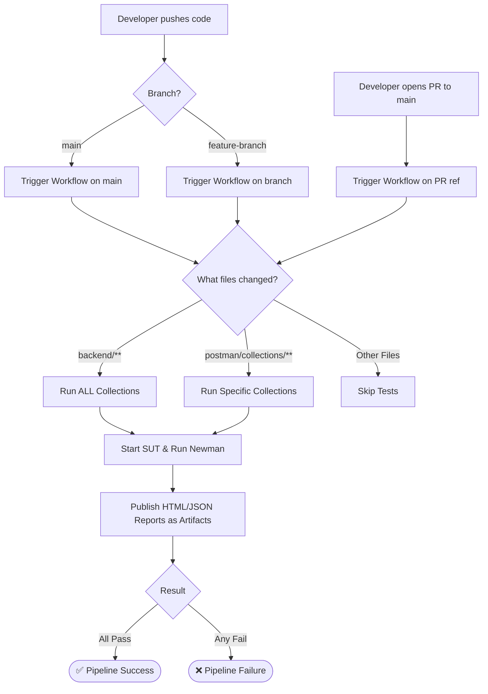

# CI/CD Pipeline

## 1. Trigger Flow Diagram

## 2. Pipeline Configuration Details

The pipeline is defined in `.github/workflows/api-test.yml` and is configured to optimize execution time and resource usage:

- **Triggers:**
  - `push` on all branches: Triggers when commits are pushed directly.
  - `pull_request` to `main`: Triggers when a PR is created or updated.
  - **Path Filters:** The workflow only executes if changes are detected in the `backend/` or `postman/collections/` directories. This prevents wasting CI minutes on pure documentation changes.
- **Dynamic Test Selection (Custom Script):**
  - We implemented a custom test runner script (`scripts/ci-runner.js`) that analyzes the `git diff`.
  - If any file in `backend/` changes, the script assumes the core system under test has been modified and executes **all** collections (`fr01`, `fr07`, `fr17`, etc.) to ensure no regressions.
  - If only files in `postman/collections/` change, the script intelligently identifies which specific collection folders were modified and **only** runs Newman for those specific collections.
  - This allows the pipeline to scale gracefully as new features are added without hardcoding.
- **Execution Environment:**
  - Uses `ubuntu-latest`.
  - Sets up Node.js v20.
  - Installs dependencies in the root and starts the SUT (`backend/server.js`) in the background.
  - Uses `wait-on` to ensure the API server is fully up and running before executing Newman tests.
- **Artifacts:**
  - Always uploads the Newman execution reports (HTML and JSON) as GitHub workflow artifacts, retained for 14 days, regardless of whether the run passed or failed.
