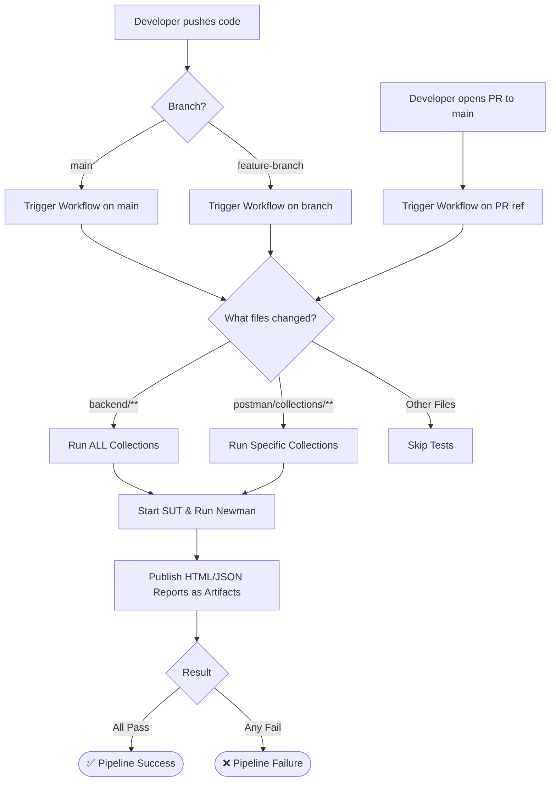
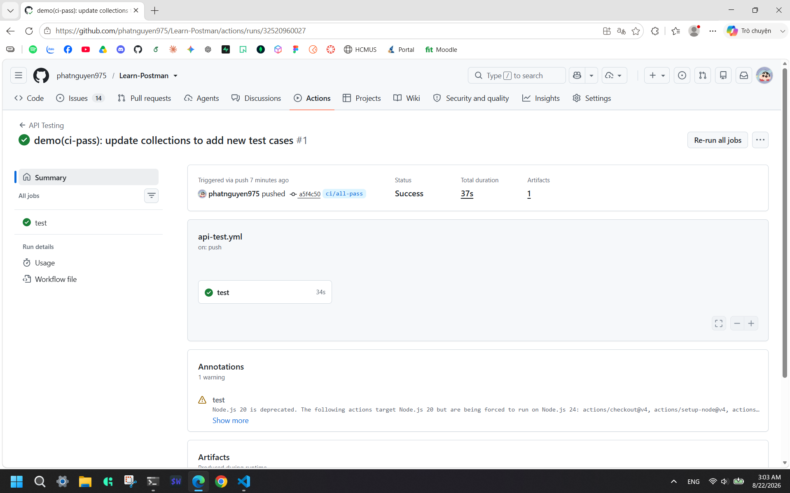
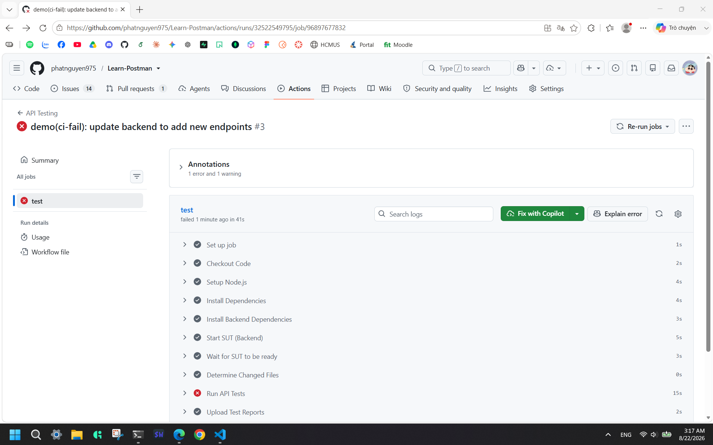
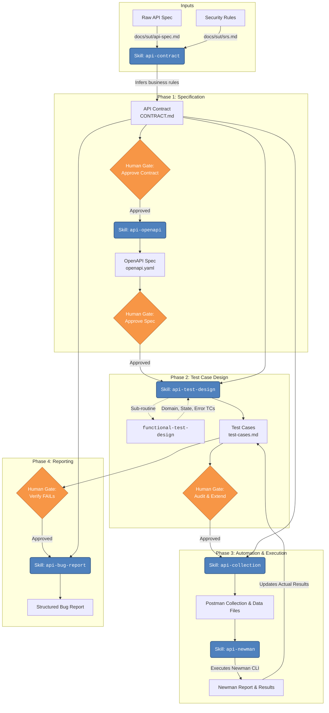

<div align="center">
  <h1>Main Report — HW06 (API Testing)</h1>
  <small>
    <strong>Student:</strong> Nguyễn Tấn Phát — 23127449
  </small> <br />
  <sub>August 22, 2026</sub>
</div>

## 1. Test Summary

| API Endpoint              | Feature ID | Total TCs | Passed | Failed | Skipped | Bugs Found |
| :------------------------ | :--------: | :-------: | :----: | :----: | :-----: | :--------: |
| `POST /api/register`      |    FR01    |    45     |   14   |   31   |    0    |     4      |
| `POST /api/cart`          |    FR07    |    62     |   29   |   33   |    0    |     6      |
| `POST /api/admin/coupons` |    FR17    |    59     |   27   |   32   |    0    |     4      |
| **GRAND TOTAL**           | **3 APIs** |  **166**  | **70** | **96** |  **0**  |   **14**   |

_Note: The high failure rate is expected, as the SUT (EShop) intentionally lacks robust input validation and proper error handling, which the multidimensional test cases explicitly target._

## 2. Postman Features Utilized

During the project, the following Postman features were exercised to build a robust and automated test suite:

- **Workspaces:** Created a dedicated public workspace to organize collections and environments, enabling seamless cloud synchronization.
- **Collections & Folders:** Grouped test cases logically (e.g., FR01, FR07, FR17) and nested them by test category (Functional, Security, etc.). Utilized Collection-level Pre-request Scripts to universally inject the `X-Student-Id` header.
- **Environments:** Defined a `local.json` environment to manage configuration variables like `baseUrl` and static user credentials.
- **Variables:** Used environment variables for static data, and runtime/local variables to persist JWT tokens dynamically extracted during setup scripts for subsequent requests.
- **Data-Driven Runs:** Employed external CSV data files containing boundary values and invalid payloads. Leveraged `pm.iterationData.get()` in tests to dynamically validate SUT responses during Newman CLI execution.
- **Automated Scripts (Setup/Teardown):** Extensively used `pm.sendRequest()` within Pre-request and Test scripts to seed database state before testing and clean up injected data afterward to ensure test isolation.

**Public Workspace Link:** https://www.postman.com/p09072005-235893/api-testing

## 3. CI/CD Integration Report

### Trigger Flow Diagram



### Pipeline Configuration Details

The pipeline is defined in `.github/workflows/api-test.yml` and is configured to optimize execution time and resource usage:

- **Triggers:**
  - `push` on all branches: Triggers when commits are pushed directly.
  - `pull_request` to `main`: Triggers when a PR is created or updated.
  - **Path Filters:** The workflow only executes if changes are detected in the `backend/` or `postman/collections/` directories. This prevents wasting CI minutes on pure documentation changes.
- **Dynamic Test Selection (Custom Script):**
  - We implemented a custom test runner script (`scripts/ci-runner.js`) that analyzes the `git diff`.
  - If any file in `backend/` changes, the script assumes the core system under test has been modified and executes **all** collections (`fr01`, `fr07`, `fr17`, etc.) to ensure no regressions.
  - If only files in `postman/collections/` change, the script intelligently identifies which specific collection folders were modified and **only** runs Newman for those specific collections.
  - This allows the pipeline to scale gracefully as new features are added without hardcoding.
- **Execution Environment:**
  - Uses `ubuntu-latest`.
  - Sets up Node.js v20.
  - Installs dependencies in the root and starts the SUT (`backend/server.js`) in the background.
  - Uses `wait-on` to ensure the API server is fully up and running before executing Newman tests.
- **Artifacts:**
  - Always uploads the Newman execution reports (HTML and JSON) as GitHub workflow artifacts, retained for 14 days, regardless of whether the run passed or failed.

### Pipeline Execution Evidence

#### All-Passing Run

This pipeline run demonstrates the execution where all API test cases pass successfully.


- **Branch:** https://github.com/phatnguyen975/Learn-Postman/tree/ci/all-pass
- **Commit Hash:** `a5f4c50`
- **Pull Request:** https://github.com/phatnguyen975/Learn-Postman/pull/15
- **Evidence Link:** https://github.com/phatnguyen975/Learn-Postman/actions/runs/32520960027/job/96892816450
- **Screenshot:**



#### Any-Failing Run

This pipeline run demonstrates the execution where at least one test case fails (catching a regression or an existing bug).

- **Branch:** https://github.com/phatnguyen975/Learn-Postman/tree/ci/any-fail
- **Commit Hash:** `146e6e1`
- **Pull Request:** https://github.com/phatnguyen975/Learn-Postman/pull/16
- **Evidence Link:** https://github.com/phatnguyen975/Learn-Postman/actions/runs/32522549795/job/96897677832
- **Screenshot:**



## 4. Agent Skills: AI Test Generator Design

This document details the architectural design and pseudocode for an autonomous AI test generation system, implementing the workflow defined for the EShop API Testing project.

The system takes raw API specifications and security requirements as inputs and outputs a fully automated, data-driven Postman test suite that is executed via Newman, complete with bug reports.

**Link to demo execution flow:** [YouTube URL](https://youtu.be/DiICchZHS44)

### System Architecture Diagram

The system employs a multi-agent, pipeline-based approach with explicit "Human Validation Gates" between critical stages to prevent AI hallucinations from cascading into the execution phase.



### Agent Skills Pseudocode

The implementation is broken down into distinct skills (functions) executed by an LLM orchestration agent. Below is the conceptual pseudocode for the primary pipeline.

```python
class AITestGenerator:
    def __init__(self, llm_agent, human_reviewer):
        self.ai = llm_agent
        self.human = human_reviewer
        self.skills = {
            "api-contract": self.api_contract_skill,
            "api-openapi": self.api_openapi_skill,
            "api-test-design": self.api_test_design_skill,
            "api-collection": self.api_collection_skill,
            "api-newman": self.api_newman_skill,
            "api-bug-report": self.api_bug_report_skill
        }

    def generate_full_suite(self, api_endpoint, raw_spec, srs_doc):
        """Main pipeline orchestrator"""

        # Step 1: Formalize Contract
        contract = self.skills["api-contract"](api_endpoint, raw_spec, srs_doc)
        if not self.human.approve("Review inferred business & security rules", contract):
            raise Exception("Pipeline halted at Contract Approval")

        # Step 2: Generate OpenAPI Specification
        openapi_spec = self.skills["api-openapi"](contract)
        if not self.human.approve("Review OpenAPI Schema against Swagger UI", openapi_spec):
            raise Exception("Pipeline halted at OpenAPI Approval")

        # Step 3: Design Multi-Dimensional Test Cases
        test_cases = self.skills["api-test-design"](contract, openapi_spec)

        # Human Audit: Mark VALID/INVALID, extend with missing edge cases
        audited_test_cases = self.human.audit_and_extend(test_cases)

        # Step 4: Automate - Build Postman Collection
        collection, data_files = self.skills["api-collection"](audited_test_cases, contract)
        if not self.human.approve("Review Postman variables and setup/teardown logic", collection):
            raise Exception("Pipeline halted at Collection Approval")

        # Step 5: Execute via Newman
        executed_test_cases = self.skills["api-newman"](collection, data_files, audited_test_cases)

        # Human Gate: Confirm which failures are real SUT bugs vs Script errors
        verified_test_cases = self.human.verify_failures(executed_test_cases)

        # Step 6: Generate Bug Report
        bug_report = self.skills["api-bug-report"](verified_test_cases, contract)
        return bug_report

    # ----------------- SKILL DEFINITIONS -----------------

    def api_contract_skill(self, endpoint, raw_spec, srs_doc):
        prompt = f"""
        Act as a Senior QA Architect. Read {raw_spec} and {srs_doc}.
        Extract and infer implicit business rules for an e-commerce system for {endpoint}.
        Output a CONTRACT.md containing:
        - HTTP Request/Response signatures
        - Field constraints (type, length, boundaries)
        - Security requirements (SEC-01 to SEC-07 mapping)
        - Expected state transitions
        """
        return self.ai.generate(prompt)

    def api_test_design_skill(self, contract, openapi_spec):
        """Uses sub-routines to generate combinations systematically"""

        # Sub-routine: functional-test-design (Black-box techniques)
        functional_tcs = self.ai.invoke_skill("functional-test-design", {
            "inputs": contract,
            "techniques": ["Equivalence Partitioning", "Boundary Value Analysis", "Error Guessing"]
        })

        # Sub-routine: security-test-design
        security_tcs = self.ai.generate_security_vectors(contract.security_rules)

        # Format into unified test-cases.md table
        return self.ai.format_as_markdown_table([functional_tcs, security_tcs])

    def api_collection_skill(self, test_cases, contract):
        prompt = f"""
        Read the approved {test_cases} and {contract}.
        Generate a Postman Collection JSON v2.1.0.
        Rule 1: Use pm.environment.get() for dynamic data-driven variables.
        Rule 2: Inject X-Student-Id header in the Collection-level Pre-request script.
        Rule 3: Generate setup/teardown logic using pm.sendRequest() (wrapped in success conditionals).
        Output the JSON and a data-domain.csv for data-driven testing.
        """
        return self.ai.execute(prompt)

    def api_newman_skill(self, collection, data_files, test_cases):
        # 1. Execute system CLI tool
        sys.run(f"newman run {collection} -d {data_files} --reporters json,htmlextra")

        # 2. Parse results via AI or Python script
        results_json = sys.read("newman-summary.json")

        prompt = f"""
        Read {results_json}. Find failed assertions.
        Update the 'Status' and 'Actual Result' columns in {test_cases}.
        Do not output raw JSON in Actual Result; summarize the failure in English.
        """
        return self.ai.generate(prompt)

    def api_bug_report_skill(self, executed_test_cases, contract):
        prompt = f"""
        Filter {executed_test_cases} for Status == FAIL.
        Cross-reference expected behavior with {contract}.
        Group failures sharing the same root cause into single bug entries.
        Assign severity/priority.
        Output a structured Bug Report Markdown file ready for GitHub Issues.
        """
        return self.ai.generate(prompt)
```

### Design Philosophy

This test generator architecture explicitly rejects the single-prompt ("zero-shot") approach. Building a reliable API test suite requires high context retention and deterministic intermediate artifacts.

By chaining specific AI Agent Skills (Contract → OpenAPI → TC Design → Collection Gen), the system:

1. **Reduces Hallucinations:** The AI builds the test suite from a rigidly defined `CONTRACT.md` rather than loosely interpreting the raw SUT specs.
2. **Enables Human Steering:** The `Human Gates` ensure that edge cases missed by the AI can be injected at the design phase (`test-cases.md`) before automated execution begins.
3. **Optimizes Token Context:** Each skill operates with only the context it needs (e.g., `api-bug-report` only reads failures and the contract, ignoring execution logs of passing tests).
